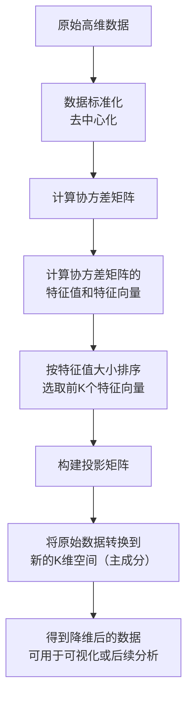

# 机器学习 - PCA 可视化案例

想象一下，你正在整理一个塞满各种物品的杂乱房间，为了更清晰地了解房间的布局，你可能会从不同角度（比如正面、侧面、俯视）给它拍几张照片。

**主成分分析（Principal Component Analysis，简称 PCA）** 在机器学习中所做的事情与此类似。

PCA 是一种强大的**数据降维**和**可视化**工具。当我们的数据包含成百上千个特征（维度）时，这些数据就像身处一个超高维度的空间中，人类无法直观理解。

PCA 可以帮助我们找到数据中最重要的视角（即主成分），将数据投影到最重要的两三个维度上，从而让我们能够用二维或三维散点图来观察高维数据的结构和分布。

简单来说，PCA的目标是：

- **降维**：用更少的特征来代表原始数据，减少计算量和存储空间，同时去除噪声。
- **可视化**：将高维数据降至2维或3维，以便于我们直观地观察数据点之间的关系（如聚类、分离情况）。

------

## PCA 核心原理与工作流程

PCA 的核心思想是寻找数据方差最大的方向。

方差越大，意味着数据在这个方向上的投影点越分散，所包含的信息量也就越多。

第一个找到的方向就是**第一主成分（PC1）**，第二个与 PC1 正交且方差次大的方向是**第二主成分（PC2）**，以此类推。

### PCA 工作流程图



**流程关键步骤说明：**

**标准化**：让每个特征的平均值为 0，标准差为 1，确保所有特征在计算时具有同等重要性。

**协方差矩阵**：计算特征之间的相关性。PCA 通过分析这个矩阵来找到数据变化的主要方向。

**特征值与特征向量**：

- **特征向量**：就是我们要找的主成分方向。
- **特征值**：对应特征向量方向上的数据方差大小。特征值越大，该主成分越重要。

**选择主成分**：我们将特征值从大到小排序，选择前 K 个最大的特征值对应的特征向量。K 就是我们想要降维到的目标维度（例如，对于可视化，K=2 或 3）。

**数据转换**：用选出的 K 个特征向量组成一个投影矩阵，将原始数据点乘这个矩阵，就得到了在 K 个新主成分上的坐标，即降维后的数据。

------

## 实战案例：鸢尾花数据集的可视化

我们将使用经典的**鸢尾花（Iris）数据集**来演示PCA。这个数据集包含150个样本，每个样本有4个特征（萼片长度、萼片宽度、花瓣长度、花瓣宽度），并属于3个不同的品种。

我们的目标是：将这 4 维的数据用 PCA 降到 2 维，并在二维平面上画出来，观察不同品种的花是否能被区分开。

### 环境准备与数据加载

首先，确保你安装了必要的Python库：`scikit-learn`, `matplotlib`, `numpy`，`pandas`。

```py
# 导入必要的库
import numpy as np
import pandas as pd
import matplotlib.pyplot as plt
from sklearn import datasets
from sklearn.decomposition import PCA
from sklearn.preprocessing import StandardScaler

# 设置中文字体和图表样式（可选）
plt.rcParams['font.sans-serif'] = ['SimHei']  # 用来正常显示中文标签
plt.rcParams['axes.unicode_minus'] = False  # 用来正常显示负号

# 加载鸢尾花数据集
iris = datasets.load_iris()
X = iris.data  # 特征数据，形状为 (150, 4)
y = iris.target  # 目标标签（品种），形状为 (150,)
target_names = iris.target_names  # 品种名称：['setosa', 'versicolor', 'virginica']

print(f"数据集形状: {X.shape}")
print(f"特征名称: {iris.feature_names}")
print(f"目标类别: {target_names}")
```

### 数据标准化

在应用 PCA 之前，对数据进行标准化是**至关重要**的一步。

因为 PCA 对特征的尺度非常敏感，如果一个特征的数值范围（例如花瓣长度以厘米计，数值在 1-10 之间）远大于另一个特征（例如萼片宽度以毫米计，数值在 0.1-1 之间），那么数值范围大的特征会主导主成分的方向，这通常不是我们想要的。

```py
# 数据标准化（去中心化并缩放到单位方差）
scaler = StandardScaler()
X_scaled = scaler.fit_transform(X)
print("标准化后，前5个样本的数据：")
print(X_scaled[:5])
```

### 应用 PCA 进行降维

我们使用 `scikit-learn` 的 `PCA` 类，它可以轻松完成所有数学计算。

```py
# 创建PCA对象，指定降维到2维
pca = PCA(n_components=2)

# 在标准化后的数据上拟合PCA模型，并进行数据转换
X_pca = pca.fit_transform(X_scaled)

print(f"降维后的数据形状: {X_pca.shape}")
print(f"前5个样本在PC1和PC2上的坐标:\n{X_pca[:5]}")

# 查看各主成分的方差解释率
print(f"主成分方差解释率: {pca.explained_variance_ratio_}")
print(f"前两个主成分累计方差解释率: {sum(pca.explained_variance_ratio_):.4f}")
```

**代码解析：**

`n_components=2`：指定我们要将数据降至 2 维。

`fit_transform(X_scaled)`：该方法一次性完成两件事：

- `fit`：根据输入数据 `X_scaled` 计算 PCA 所需的参数（如主成分方向）。
- `transform`：使用计算好的参数，将数据 `X_scaled` 转换到新的二维空间。

`explained_variance_ratio_`：这是一个非常重要的属性。它告诉我们每个主成分**捕获的原始数据方差的比例**。例如，如果输出是 `[0.73, 0.23]`，意味着PC1保留了原始数据73%的信息，PC2保留了23%的信息，两者加起来保留了96%的信息。这帮助我们评估降维后的信息损失。

### 可视化结果

现在，我们有了二维数据 `X_pca`，可以轻松地用散点图将其可视化。

```py
# 创建可视化图表
plt.figure(figsize=(8, 6))

# 为每个品种设置不同的颜色和标记
colors = ['navy', 'turquoise', 'darkorange']
lw = 2  # 线宽

# 遍历三个品种，分别绘制
for color, i, target_name in zip(colors, [0, 1, 2], target_names):
    plt.scatter(X_pca[y == i, 0],  # 选择属于当前品种i的样本的PC1坐标
                X_pca[y == i, 1],  # 选择属于当前品种i的样本的PC2坐标
                color=color, alpha=0.8, lw=lw,
                label=target_name)

# 添加图表标题和坐标轴标签
plt.title('鸢尾花数据集的PCA二维可视化')
plt.xlabel(f'第一主成分 (PC1) - 方差解释率: {pca.explained_variance_ratio_[0]:.2%}')
plt.ylabel(f'第二主成分 (PC2) - 方差解释率: {pca.explained_variance_ratio_[1]:.2%}')
plt.legend(loc='best', shadow=False, scatterpoints=1)
plt.grid(True, linestyle='--', alpha=0.6)

# 显示图表
plt.tight_layout()
plt.show()
```

**可视化结果解读：** 运行上述代码后，你会得到一张二维散点图。

- **X轴（PC1）**：代表了原始4个特征中方差最大的方向，是区分数据最重要的维度。从图中可以看出，它很好地将 **Setosa（山鸢尾）** 品种与其他两个品种分离开。
- **Y轴（PC2）**：代表了与PC1正交且方差次大的方向，提供了额外的区分信息。它帮助进一步区分 **Versicolor（杂色鸢尾）** 和 **Virginica（维吉尼亚鸢尾）**，尽管两者有一些重叠。
- **结论**：通过PCA，我们成功将4维数据投影到2维平面，并清晰地观察到三个品种的聚类情况。Setosa完全分离，而Versicolor和Virginica在二维投影上存在部分重叠，这说明仅用前两个主成分（保留了约95%的信息）还不足以完美区分后两个品种，但它们的主要分布趋势已经非常明显。

## 深入探索与思考

### 如何选择主成分的数量（K值）？

在实际项目中，我们可能不知道应该降到几维。一个常用的方法是绘制 **碎石图（Scree Plot）**，它展示了每个主成分的方差解释率。

```py
# 首先，用所有主成分拟合PCA
pca_full = PCA()
pca_full.fit(X_scaled)

# 绘制碎石图
plt.figure(figsize=(8, 5))
plt.plot(range(1, len(pca_full.explained_variance_ratio_) + 1),
         pca_full.explained_variance_ratio_, 'o-', linewidth=2)
plt.title('PCA方差解释率碎石图')
plt.xlabel('主成分序号')
plt.ylabel('方差解释率')
plt.grid(True, linestyle='--', alpha=0.6)
plt.xticks(range(1, len(pca_full.explained_variance_ratio_) + 1))
plt.tight_layout()
plt.show()

# 绘制累计方差解释率图
plt.figure(figsize=(8, 5))
plt.plot(range(1, len(pca_full.explained_variance_ratio_) + 1),
         np.cumsum(pca_full.explained_variance_ratio_), 's-', linewidth=2, color='red')
plt.title('PCA累计方差解释率')
plt.xlabel('主成分数量')
plt.ylabel('累计方差解释率')
plt.axhline(y=0.95, color='gray', linestyle='--', label='95% 阈值') # 常用阈值
plt.legend()
plt.grid(True, linestyle='--', alpha=0.6)
plt.xticks(range(1, len(pca_full.explained_variance_ratio_) + 1))
plt.tight_layout()
plt.show()
```

**如何选择 K 值？**

- **看拐点**：在碎石图中，寻找方差解释率下降趋势突然变缓的点（即肘部），其后的主成分贡献较小。
- **设定阈值**：在累计方差图中，选择能使累计解释率达到一个满意阈值（如 95% 或 99%）的最小K值。从鸢尾花数据的累计图可以看出，前两个主成分已能解释超过 95% 的方差，因此 K=2 是一个很好的选择。

### 理解主成分的含义

我们还可以查看主成分的**载荷（Loadings）**，即每个原始特征对主成分的贡献权重，这有助于解释主成分的实际意义。

```py
# 获取前两个主成分的载荷矩阵（特征向量）
pca_components = pca.components_  # 形状为 (2, 4)

# 用DataFrame展示，更清晰
df_components = pd.DataFrame(pca_components,
                             columns=iris.feature_names,
                             index=['PC1', 'PC2'])
print("主成分载荷矩阵（特征向量）：")
print(df_components)

# 可以用热力图可视化
import seaborn as sns
plt.figure(figsize=(8, 4))
sns.heatmap(df_components, annot=True, cmap='RdBu_r', center=0)
plt.title('主成分载荷热力图')
plt.tight_layout()
plt.show()
```

**解读载荷矩阵：**

- 对于 **PC1**，如果花瓣长度和花瓣宽度有较大的**正**权重，而萼片宽度有较大的**负**权重，那么 PC1 可能主要代表了花瓣大小与萼片宽度的对比这个综合特征。
- 对于 **PC2**，权重模式不同，它可能代表了另一种特征组合。通过分析这些权重，我们可以为抽象的主成分赋予一些实际的生物学或业务含义。

### 关键要点总结

- **PCA 是什么**：一种无监督的线性降维方法，通过寻找数据方差最大的正交方向（主成分）来重新表述数据。
- **核心步骤**：标准化 -> 计算协方差矩阵 -> 计算特征值与特征向量 -> 选择主成分 -> 数据投影。
- 重要概念:
  - **主成分**：新的、不相关的特征轴。
  - **方差解释率**：衡量每个主成分重要性的指标。
  - **载荷**：连接原始特征与主成分的桥梁，用于解释主成分的意义。
- **主要应用**：数据可视化、去除噪声和冗余、作为其他模型（如分类、回归）的预处理步骤以加速训练。

> [!TIP]
>
> 如上一章的黑神话悟空可做如下PCA扩展

```py
# =========================================================================
# 8. PCA 深度探索：碎石图、载荷热力图与可视化分布
# =========================================================================
print(f"\n[PCA 深入探索] 正在分析 {tar.upper()} 用户群的成分特征...")

# 8.1 拟合全量主成分，计算方差解释率
pca_full = PCA(random_state=42)
pca_full.fit(X_scaled)

# 绘制 PCA 解释率双子图
fig, (ax1, ax2) = plt.subplots(1, 2, figsize=(15, 5), dpi=100)

# 左图：碎石图
components_num = range(1, len(pca_full.explained_variance_ratio_) + 1)
ax1.plot(components_num, pca_full.explained_variance_ratio_, 'o-', linewidth=2, color='#1f77b4')
ax1.set_title('PCA 独立方差解释率 (碎石图)', fontsize=13, fontweight='bold', pad=10)
ax1.set_xlabel('主成分序号 (PC)')
ax1.set_ylabel('方差解释率 (Explaining Ratio)')
ax1.set_xticks(components_num)
ax1.grid(True, linestyle='--', alpha=0.5)

# 右图：累计解释率
ax2.plot(components_num, np.cumsum(pca_full.explained_variance_ratio_), 's-', linewidth=2, color='#d62728')
ax2.axhline(y=0.70, color='gray', linestyle='--', label='70% 核心信息阈值')
ax2.axhline(y=0.85, color='orange', linestyle='--', label='85% 强解释阈值')
ax2.set_title('PCA 累计方差解释率曲线', fontsize=13, fontweight='bold', pad=10)
ax2.set_xlabel('主成分累计数量')
ax2.set_ylabel('累计方差解释率')
ax2.set_xticks(components_num)
ax2.legend(loc='lower right')
ax2.grid(True, linestyle='--', alpha=0.5)

plt.tight_layout()
plt.show()

# 8.2 提取前 2 个主成分的载荷矩阵并绘制热力图
pca_2d = PCA(n_components=2, random_state=42)
X_pca = pca_2d.fit_transform(X_scaled)

df_components = pd.DataFrame(
    pca_2d.components_,
    columns=features_to_cluster,
    index=['PC1 (横轴:综合行为轴)', 'PC2 (纵轴:活跃偏离轴)']
)

print(f"\n🔥 【{tar.upper()} 用户群】主成分载荷矩阵（权重分值）：")
print(df_components.round(3))

# 绘制载荷热力图
plt.figure(figsize=(11, 4), dpi=100)
sns.heatmap(df_components, annot=True, cmap='RdBu_r', center=0, fmt='.2f', linewidths=0.5, cbar_kws={"shrink": 0.8})
plt.title(f'Target="{tar.upper()}" 主成分载荷（原始特征贡献权重）热力图', fontsize=14, fontweight='bold', pad=15)
plt.xticks(rotation=15)
plt.tight_layout()
plt.show()

# 8.3 绘制最终的 2D 聚类分色散点图
print(f"正在生成 {tar.upper()} 用户专用聚类空间分布图...")
df['PCA1'] = X_pca[:, 0]
df['PCA2'] = X_pca[:, 1]

plt.figure(figsize=(10, 7), dpi=100)

if tar == 'high':
    custom_colors = ['#2ca02c', '#1f77b4', '#9467bd']
    business_labels = ['High 0: 核心在局爆肝党', 'High 1: 低频长线硬核粉', 'High 2: 高频骨灰沉浸大拿']
elif tar == 'medium':
    custom_colors = ['#ff7f0e', '#1f77b4', '#bcbd22']
    business_labels = ['Medium 0: 日常稳定打卡党', 'Medium 1: 碎片时间轻度群', 'Medium 2: 潜力进阶活跃派']
else:
    custom_colors = ['#d62728', '#7f7f7f', '#8c564b']
    business_labels = ['Low 0: 卡关退游痛点群', 'Low 1: 浅尝辄止白嫖群', 'Low 2: 技术受害流失群']

scatter = sns.scatterplot(
    x='PCA1', y='PCA2', hue='Cluster', data=df,
    palette=custom_colors[:low_k], alpha=0.6, edgecolor='none', s=15
)

plt.title(f'Target="{tar.upper()}" 用户微观细分空间分布图 (K={low_k})', fontsize=15, fontweight='bold', pad=15)
plt.xlabel('主成分 1 (PC1) - 综合行为轴', fontsize=12)
plt.ylabel('主成分 2 (PC2) - 活跃偏离轴', fontsize=12)
plt.legend(handles=scatter.get_legend_handles_labels()[0], labels=business_labels, title=f'{tar.upper()} 用户细分群', loc='best')
plt.tight_layout()
plt.show()

# =========================================================================
# 8. 升级版：提取 3 个主成分并绘制 3D 聚类散点图
# =========================================================================
from mpl_toolkits.mplot3d import Axes3D  # 导入3D绘图引擎

print(f"\n正在提取 3 个主成分并生成 {tar.upper()} 用户 3D 聚类图...")

# 8.1 明确提取 3 个主成分
pca_3d = PCA(n_components=3, random_state=42)
X_pca_3d = pca_3d.fit_transform(X_scaled)

# 合并 3D 坐标到 DataFrame
df['PCA1'] = X_pca_3d[:, 0]
df['PCA2'] = X_pca_3d[:, 1]
df['PCA3'] = X_pca_3d[:, 2]

# 8.2 创建 3D 画布
fig = plt.figure(figsize=(11, 8), dpi=100)
ax = fig.add_subplot(111, projection='3d') # ✨ 开启 3D 模式

# 配置动态配色
if tar == 'high':
    custom_colors = ['#2ca02c', '#1f77b4', '#9467bd']
    business_labels = ['High 0: 核心在局爆肝党', 'High 1: 低频长线硬核粉', 'High 2: 高频骨灰沉浸大拿']
elif tar == 'medium':
    custom_colors = ['#ff7f0e', '#1f77b4', '#bcbd22']
    business_labels = ['Medium 0: 日常稳定打卡党', 'Medium 1: 碎片时间轻度群', 'Medium 2: 潜力进阶活跃派']
else:
    custom_colors = ['#d62728', '#7f7f7f', '#8c564b']
    business_labels = ['Low 0: 卡关退游痛点群', 'Low 1: 浅尝辄止白嫖群', 'Low 2: 技术受害流失群']

# 8.3 循环绘制 3D 散点（确保图例能一一对应）
for i in range(low_k):
    cluster_data = df[df['Cluster'] == i]
    ax.scatter(
        cluster_data['PCA1'],
        cluster_data['PCA2'],
        cluster_data['PCA3'],
        c=custom_colors[i],
        label=business_labels[i],
        alpha=0.5,
        s=15,
        edgecolor='none'
    )

# 8.4 美化 3D 空间坐标轴
ax.set_title(f'Target="{tar.upper()}" 用户 3D 微观细分空间分布图 (PC1 & PC2 & PC3)', fontsize=15, fontweight='bold', pad=20)
ax.set_xlabel('主成分 1 (PC1) - 综合行为轴', fontsize=11)
ax.set_ylabel('主成分 2 (PC2) - 活跃偏离轴', fontsize=11)
ax.set_zlabel('主成分 3 (PC3) - 辅助特征分化轴', fontsize=11) # ✨ 新增 Z 轴

# 调整 3D 初始视角 (仰角 20 度，方位角 45 度，你可以手动鼠标拖动旋转它)
ax.view_init(elev=20, azim=45)

plt.legend(title=f'{tar.upper()} 用户细分群', loc='best', frameon=True)
plt.tight_layout()
plt.show()
```

