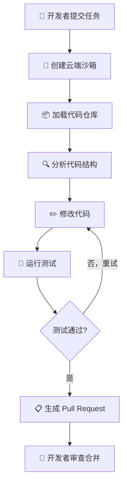
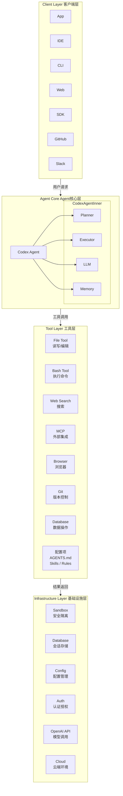
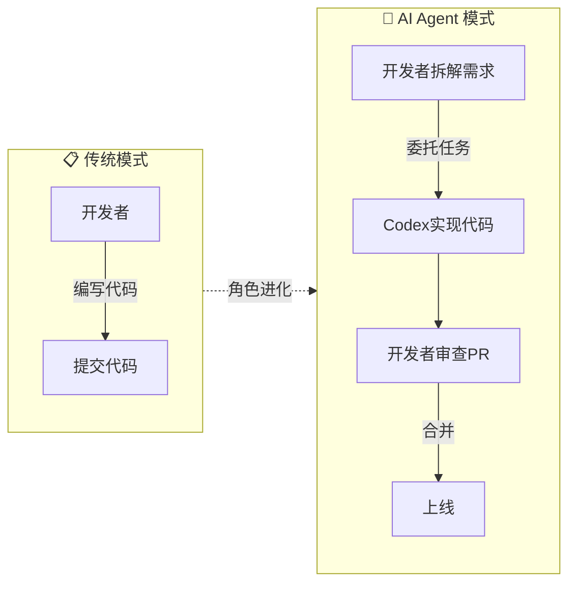

# Codex 简介

OpenAI Codex 是一个 **AI 编程代理（AI Coding Agent）**，目标不是帮你补全代码，而是直接**参与并完成整个开发任务**——写代码、修 Bug、跑测试、提 Pull Request。

传统聊天机器人只有一个输入框，而 Codex App 不一样，它本质上是：>一个运行在本地电脑上的 AI Agent 工作台。

它不仅能回答问题，还能：

- 读取本地文件
- 修改项目
- 浏览网页
- 运行命令
- 调用外部工具
- 自动执行任务
- 操作浏览器甚至桌面应用

一句话定义：

> Codex App 是一个具备 AI Agent 能力的本地工作平台。

传统 ChatGPT 的核心是：

- 你提问
- AI 回答

而 Codex App 的核心是：

- 你提出目标
- AI 帮你完成任务

这两者不是一个维度。

Codex APP 是经典的三栏布局：左侧是任务列表，中间是对话窗口，右侧是多功能区域。


## 为什么说 Codex 是第三代 AI 编程工具

| 阶段     | 定位                 | 代表产品       |
| :------- | :------------------- | :------------- |
| 第一阶段 | 代码补全             | GitHub Copilot |
| 第二阶段 | 对话写代码           | ChatGPT        |
| 第三阶段 | **自主执行开发任务** | OpenAI Codex   |

前两代工具的本质是辅助，Codex 的本质是执行——AI 从工具变成了协作者。

------

## 核心能力

**写代码** — 描述需求，Codex 生成符合项目结构和风格的代码，而非孤立的代码片段。

**理解代码库** — 阅读整个仓库，解释架构、业务逻辑和模块关系，对大型历史项目尤为实用。

**代码审查** — 自动识别潜在 Bug、边界条件遗漏、性能瓶颈和安全风险。

**调试修复** — 读取错误日志 → 定位问题代码 → 给出修复补丁，全流程自动化。

**任务自动化** — 重构、生成测试、数据库迁移、CI/CD 配置，均可一键委托。

------

## 工作原理

每个任务运行在独立的**云端沙箱**中，流程如下：

```
输入任务 → 创建云环境 → 加载仓库 → 分析代码
        → 修改代码 → 运行测试 → 生成 PR → 等待审查
```

**两个关键优势：**

- **并行执行**：多个任务同时运行，不互相阻塞
- **安全隔离**：沙箱环境，不影响本地系统



所有操作均可追溯——终端日志、测试输出、代码 diff 一目了然。

系统架构如下:



## 使用方式

| 形态                            | 适用场景                       |
| :------------------------------ | :----------------------------- |
| **Codex Web**（集成于 ChatGPT） | 提交任务、查看进度、审查代码   |
| **Codex CLI**                   | 终端直接操作，适合开发者日常流 |
| **Codex Desktop App**           | 管理多个并行 Agent 任务        |

------

## Codex 改变了什么

开发者角色的变化

引入 Codex 后，开发者的工作重心正在发生结构性转变——从亲自编写每一行代码"到拆解任务、审查结果、把控架构方向。

开发者核心职责的三个转变：**任务拆解**（把模糊需求分解为可执行的具体指令）、**架构决策**（Codex 不擅长全局系统设计，这仍是人类的主场）、**结果审查**（确保 Codex 生成的代码符合业务逻辑和质量标准）。



## 适用场景

Codex 并非万能工具，理解它最擅长什么，才能发挥最大价值。

**独立开发者 / 小型团队** — 需求明确但人手不足时，将重复性开发任务（CRUD 接口、测试用例、脚手架搭建）委托给 Codex，专注核心业务逻辑。

**企业大规模重构** — 涉及数万行代码的重构或框架迁移（如从 Python 2 升 Python 3、从 REST 迁移到 GraphQL），Codex 可批量处理并保证行为一致性。

**遗留系统理解** — 接手无文档的历史代码库时，让 Codex 优先完成代码阅读和注释生成，大幅降低上手成本。

**快速原型验证** — 产品想法需要快速落地验证时，用 Codex 在数分钟内生成可运行的原型，而非花数天搭建基础结构。

**测试覆盖补全** — 存量代码缺乏测试时，Codex 可分析函数签名和业务逻辑，批量补充单元测试，提升覆盖率。

**不适合的场景** — 需要深度领域知识的核心算法设计、强依赖非公开内部文档的决策、以及需要频繁人工确认的高风险生产操作，仍建议人工主导。


# Codex 核心概念

在使用 Codex 之前，理解几个核心概念非常重要。这些概念构成了 Codex 工作的基础。

------

## Prompt（提示词）

你通过发送 Prompt 与 Codex 交互，描述你想要它完成的任务。

### Prompt 工作循环

当你提交 Prompt 后，Codex 按以下循环工作：

1. 调用语言模型理解任务
2. 执行模型输出指示的操作（读取文件、编辑代码、运行命令）
3. 将操作结果反馈给模型
4. 循环执行直到任务完成或你取消

> Codex 采用 **Agent 循环**模式工作——模型输出指示操作，操作结果反馈给模型，循环往复直到任务完成。

### 有效 Prompt 的原则

| 原则             | 说明                           | 示例                                         |
| :--------------- | :----------------------------- | :------------------------------------------- |
| **包含验证步骤** | Codex 能验证工作时输出质量更高 | "写一个函数，包含测试用例验证它处理空列表"   |
| **拆解复杂任务** | 小任务更容易测试和审查         | "第一步：创建模型；完成后告诉我再继续第二步" |
| **提供上下文**   | 引用相关文件和图片             | "参考 src/auth.py 的风格，实现类似功能"      |

> Codex 处理小而专注的任务时表现最好。大任务应拆分为小步骤逐步执行。

------

## Thread（线程/会话）

Thread 是单个任务会话：你的 Prompt 加上后续的模型输出和工具调用。

### 线程类型

| 类型         | 运行环境           | 特点                                   |
| :----------- | :----------------- | :------------------------------------- |
| **本地线程** | 你的机器（沙箱内） | 可读写文件、使用现有工具、执行命令     |
| **云端线程** | 云端隔离环境       | 克隆仓库运行、适合并行任务、跨设备委派 |

### 线程使用规则

运行中的线程可以并发，但需要注意：

- 避免两个线程同时修改同一文件
- 线程可以稍后通过继续另一个 Prompt 来恢复
- 长时间任务可能会自动压缩上下文

------

## Context（上下文）

当你提交 Prompt 时，包含 Codex 可以使用的上下文——对相关文件和图片的引用。

### 上下文来源

- **IDE 扩展**：自动包含打开的文件列表和选中文本范围
- **手动指定**：在 Prompt 中引用文件路径或附加图片
- **对话历史**：线程中之前的对话内容

### 上下文窗口

线程中的所有信息必须适合模型的上下文窗口。

Codex 会监控并报告剩余空间。当接近限制时，你会收到提示。

### 自动 Compact

对于较长的任务，Codex 可能会自动压缩上下文。

压缩机制会总结相关信息，丢弃不太重要的细节，释放空间继续处理。

```bash
管理上下文
# 开始新会话释放上下文
/new

# 查看当前上下文使用情况
/status
```

> 当 Codex 报告上下文使用量较高时，考虑开始新会话或减少历史消息。

------

## Sandbox（沙箱）

Sandbox 是 Codex 的安全隔离机制，防止意外修改工作区外的文件。

### 沙箱模式

| 模式                | 文件修改 | 网络访问 | 适用场景                   |
| :------------------ | :------- | :------- | :------------------------- |
| **Read-only**       | 禁止     | 禁止     | 只读分析、代码审查         |
| **Workspace-write** | 仅工作区 | 禁止     | 日常开发（默认）           |
| **Full-access**     | 允许     | 允许     | 完全信任的环境（谨慎使用） |

### Approval（审批）机制

某些操作需要你的确认才能执行：

- 执行 Shell 命令（特别是 rm、kill 等）
- 修改或删除文件
- 访问敏感目录（如 ~/.ssh/、/etc/）
- 网络请求

```bash
# 在 CLI 中切换沙箱模式
codex --sandbox workspace-write

# 或在 Prompt 中指定
"分析这个代码，不要修改任何文件"
```

> 沙箱是 Codex 安全策略的第一道防线，确保 AI 操作不会超出预期范围。

------

## Approval Policy（审批策略）

审批策略控制 Codex 执行操作前是否需要确认。

### 策略类型

| 策略      | 说明     | 行为                           |
| :-------- | :------- | :----------------------------- |
| `ask`     | 每次询问 | 敏感操作前请求确认（默认）     |
| `approve` | 自动批准 | 自动执行，无需确认（谨慎使用） |
| `deny`    | 自动拒绝 | 拒绝所有可能产生副作用的操作   |

```bash
配置审批策略
\# ~/.codex/config.toml

approval_policy = "ask"
```

------

## 总结

理解这些核心概念后，你可以更有效地使用 Codex：

- **Prompt**：清晰描述任务，包含验证步骤
- **Thread**：管理任务会话，注意并发规则
- **Context**：提供相关上下文，监控窗口使用
- **Sandbox**：了解安全机制，选择适当模式
