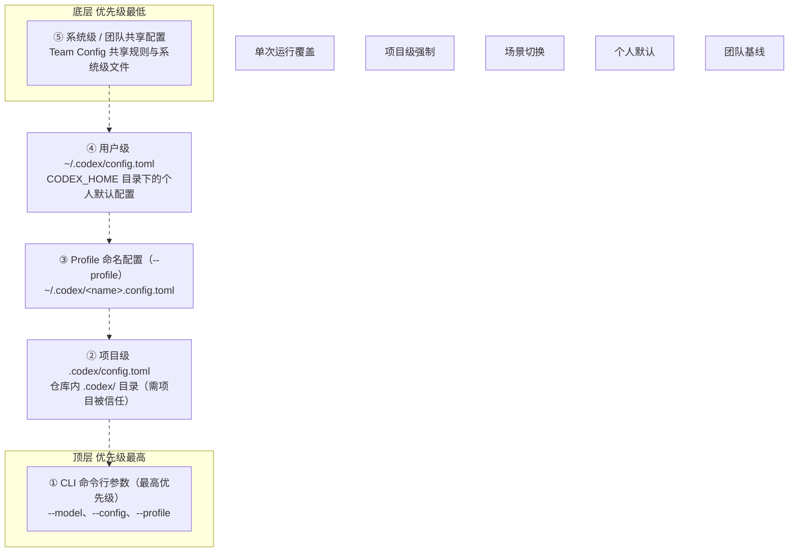

# Codex 高级配置

**Codex CLI** 的高级配置层让我们可以精细控制模型提供商、沙箱权限、Hooks 钩子、遥测数据与终端行为。

如果你是第一次接触 Codex，先阅读 [**Config basics**（配置基础）](https://www.runoob.com/codex/codex-config-file.html)建立整体认知；本文默认你已了解 **~/.codex/config.toml** 的存在与作用。

------

## 配置层级全景

Codex 的配置由多层叠加而成，理解这一点是后续所有高级用法的基石。

从底层到顶层依次是：系统层 → 用户层（**~/.codex/config.toml**） → Profile 层 → 项目层（**.codex/config.toml**） → CLI 命令行参数。

上层会覆盖下层同名配置，离当前工作目录最近的项目配置优先级最高。



> [!NOTE]
>
> 合并规则：同名 key 后面覆盖前面；点号语法可定位嵌套字段例：--config mcp_servers.context7.enabled=false 关闭单个 MCP 服务

```
判断当前生效配置最稳妥的方式是 codex --help 配合日志，或者显式使用 codex exec "show my current config" 让模型帮你解读。
```

## Profiles 命名配置层

**Profile** 是 Codex 推荐的"场景化切换"方案：把一组配置另存为 TOML 文件，按需通过 **--profile** 加载。

Profile 文件位于 **~/.codex/<name>.config.toml**，其中 **<name>** 只能包含字母、数字、连字符、下划线。

### 创建并使用一个 Profile

假设你经常进行深度代码审查，希望使用更强的推理能力：

```bash
# 文件路径：~/.codex/deep-review.config.toml
model = "gpt-5.5"                  # 使用推理能力更强的模型
model_reasoning_effort = "xhigh"   # 推理强度拉到最高
approval_policy = "on-request"    # 每次工具调用都提示审批
model_catalog_json = "/Users/me/.codex/model-catalogs/deep-review.json"  # 可选：自定义模型目录
```

使用 Profile 启动 Codex：

```bash
# 启动交互式 TUI
codex --profile deep-review

# 或在非交互式 exec 模式使用
codex exec --profile deep-review "review this change"
```

### Profile 的合并语义

Profile 文件不是完整配置，它是在用户级 **~/.codex/config.toml** 之上的一层增量覆盖。

这意味着 Profile 里只需要写"和默认配置不同"的字段，其它字段会自动继承用户级设置。

如果用户级和 Profile 同时设置 **model_catalog_json**，**Profile 的值会优先生效**。

> 从 Codex 0.134.0 开始，**--profile** 不再读取 **config.toml** 里的 **[profiles.<name>]** 表，也不再支持顶层的 **profile = "name"** 选择器。所有历史 Profile 设置必须迁移到独立的 **~/.codex/<name>.config.toml** 文件。

### 从旧配置迁移到 Profile

如果你之前的 **config.toml** 长这样：

```bash
# 旧写法（已废弃）
profile = "deep-review"

[profiles.deep-review]
model = "gpt-5.5"
model_reasoning_effort = "xhigh"
```

需要拆分为两个文件：

```
# 文件路径：~/.codex/config.toml（保留非 profile 部分）
# 注意：删除了 profile = "deep-review" 选择器
# 文件路径：~/.codex/deep-review.config.toml
model = "gpt-5.5"
model_reasoning_effort = "xhigh"
```

迁移完成后，原来的 **codex --profile deep-review** 命令行用法保持不变。

------

## 命令行一次性覆盖

有时你只想临时改一两个字段跑一次任务，不想污染配置文件。这时可以用 CLI 覆盖：

### 优先使用专用标志

如果官方提供了专用参数（如 **--model**），**优先用专用标志**，可读性最好：

```bash
# 用专用标志切换模型
codex --model gpt-5.4
```

### 使用 --config 覆盖任意键

对于没有专用标志的字段，用 **-c** 或 **--config** 覆盖。值是 TOML 格式，不是 JSON。

```bash
# 字符串值要用双引号嵌套引号
codex --config model='"gpt-5.4"'

# 布尔值直接写
codex --config sandbox_workspace_write.network_access=true

# 数组使用 TOML 数组语法
codex --config 'shell_environment_policy.include_only=["PATH","HOME"]'
```

几条易踩坑的规则：

- 使用点号语法定位嵌套字段，例如 **mcp_servers.context7.enabled=false**
- **--config** 的值会被当作 TOML 解析，含空格的字符串务必加引号
- 解析失败时，Codex 会把整个值当成字符串处理

> 判断一次覆盖是否生效，最快的办法是在命令后跟一个简单问题："what model are you using?"，让 Codex 主动报告当前配置。

------

## 配置文件与状态位置

Codex 把所有本地状态都放在 **CODEX_HOME** 目录下，默认是 **~/.codex**。

常见文件与含义：

| 文件              | 作用                             | 是否敏感          |
| :---------------- | :------------------------------- | :---------------- |
| **config.toml**   | 本地主配置，所有自定义项都写这里 | 否                |
| **auth.json**     | 文件式凭据（若未使用系统钥匙串） | 是，建议 600 权限 |
| **history.jsonl** | 会话历史（可关闭）               | 可能含敏感内容    |
| logs/、caches/    | 运行日志与缓存                   | 可能含请求体片段  |

### 只想换 OpenAI 基础 URL？

很多同学用 LLM 代理、路由器或数据驻留项目，只需要修改 **openai** 内置提供商的 base URL。

此时直接设置 **openai_base_url**，不要新建 **[model_providers.openai]**，因为内置 ID 不可覆盖：

```bash
# 文件路径：~/.codex/config.toml
# 把内置 openai 提供商的 base URL 指向代理
openai_base_url = "https://us.api.openai.com/v1"
```

## 项目级配置 .codex/config.toml

项目级配置放在仓库根的 **.codex/config.toml**，用于团队共享默认值。

Codex 会从工作目录向上逐级查找，**离当前工作目录最近的文件优先级最高**。

### 项目级配置的边界

出于安全考虑，**只有项目被标记为"已信任"**时才会加载项目级 .codex/ 层（包括 config.toml、本地 hooks、本地 rules）。

未受信任的项目中，下表里的敏感键会被忽略并打印启动警告：

| 被忽略的键                                      | 原因                              |
| :---------------------------------------------- | :-------------------------------- |
| **openai_base_url**、**chatgpt_base_url**       | 防止重定向凭据 / 改变 host 元数据 |
| **apps_mcp_product_sku**                        | 影响 Codex Apps 产品识别          |
| **model_provider**、**model_providers**         | 防止替换凭据 / 提供商身份         |
| **notify**                                      | 防止执行任意机器本地命令          |
| **profile**、**profiles**                       | 项目级不能选择 config profile     |
| **experimental_realtime_ws_base_url**、**otel** | 遥测与实时通道                    |

这些键必须放在用户级 **~/.codex/config.toml** 中。

相对路径（如 **model_instructions_file**）相对于其 **.codex/** 所在目录解析。

> 如果项目未受信任而你设置了 **model_provider = "proxy"**，启动时 Codex 会打印警告并使用默认 provider；这是安全设计，不是 bug。

------

## Hooks 生命周期钩子

Hooks 让你在工具调用、回合开始等关键节点插入自定义脚本，适合做审计、敏感词过滤、commit 检查等。

Hooks 配置支持两种形式，且事件结构完全相同：

| 形式                     | 位置                  | 适合场景                  |
| :----------------------- | :-------------------- | :------------------------ |
| **hooks.json** 文件      | 与 config.toml 同目录 | JSON 工具链友好，便于复用 |
| 内联 **[[hooks.\*]]** 表 | config.toml 内        | 所有配置集中管理          |

四个最常用的加载位置：

- **~/.codex/hooks.json**
- **~/.codex/config.toml**
- **<repo>/.codex/hooks.json**
- **<repo>/.codex/config.toml**

项目级 hooks 仅在项目受信任时加载，用户级 hooks 始终独立加载。

### 内联 TOML Hook 示例

下面是一个在 Bash 工具调用前执行的预检钩子：

```bash
# 文件路径：~/.codex/config.toml
# 匹配所有 Bash 工具调用
[[hooks.PreToolUse]]
matcher = "^Bash$"

[[hooks.PreToolUse.hooks]]
type = "command"
# 调用仓库内的预检脚本（路径相对于 .codex/ 所在目录）
command = '/usr/bin/python3 "$(git rev-parse --show-toplevel)/.codex/hooks/pre_tool_use_policy.py"'
timeout = 30                                 # 超时秒数，超时后视为拒绝
statusMessage = "Checking Bash command"      # 状态栏提示
```

如果同一层既存在 **hooks.json** 又存在内联 **[hooks]** 表，Codex 会同时加载两者并打印警告。**建议每层只选一种形式**，避免维护成本翻倍。

------

## 自定义模型提供商

当你需要让 Codex 接入 LLM 代理、Ollama、Mistral、Azure 等非 OpenAI 官方端点时，**model_providers** 是入口。

内置 provider ID（**openai**、**ollama**、**lmstudio**）**不能复用**，否则会冲突。

### 基本定义

```bash
# 文件路径：~/.codex/config.toml
model = "gpt-5.4"           # 模型名由所选 provider 决定
model_provider = "proxy"    # 指向下面的 [model_providers.proxy]

[model_providers.proxy]
name = "OpenAI using LLM proxy"  # 显示名
base_url = "http://proxy.example.com"
env_key = "OPENAI_API_KEY"       # 从环境变量读取密钥

[model_providers.local_ollama]
name = "Ollama"
base_url = "http://localhost:11434/v1"

[model_providers.mistral]
name = "Mistral"
base_url = "https://api.mistral.ai/v1"
env_key = "MISTRAL_API_KEY"
```

### 添加 HTTP 头

有些代理需要额外的 header（如租户标识、特性开关）：

```bash
[model_providers.example]
# 静态 header：每次请求都带上
http_headers = { "X-Example-Header" = "example-value" }
# 动态 header：值从环境变量读取
env_http_headers = { "X-Example-Features" = "EXAMPLE_FEATURES" }
```

### 命令式认证（Command-backed Auth）

当提供商的 bearer token 需要从外部凭据助手动态拉取时，使用 **[model_providers.<id>.auth]**：

```bash
[model_providers.proxy]
name = "OpenAI using LLM proxy"
base_url = "https://proxy.example.com/v1"
wire_api = "responses"   # 走 Responses API 协议

[model_providers.proxy.auth]
command = "/usr/local/bin/fetch-codex-token"
args = ["--audience", "codex"]
timeout_ms = 5000            # 单次拉取超时
refresh_interval_ms = 300000 # 主动刷新周期（5 分钟）
```

auth 命令的运行约束：

- 不接收 **stdin**，必须把 token 输出到 **stdout**
- Codex 会自动 trim 前后空白，空 token 视为错误
- 设置 **refresh_interval_ms = 0** 表示仅在认证失败后刷新
- **不能与 env_key、experimental_bearer_token、requires_openai_auth 同时使用**

### Amazon Bedrock 内置提供商

Codex 自带 **amazon-bedrock** 内置 provider，可以直接通过 **model_provider** 引用：

```bash
# 文件路径：~/.codex/config.toml
model_provider = "amazon-bedrock"
model = "<bedrock-model-id>"

[model_providers.amazon-bedrock.aws]
profile = "default"      # AWS profile；不填则走标准凭据链
region = "eu-central-1"  # Bedrock 区域
```

> Bedrock 内置 provider 只支持嵌套 **.aws** 下的 profile 与 region 覆盖；其它自定义项请走标准 **model_providers.<id>** 流程。

------

## OSS 本地模式

Codex 支持连接本地"开源"模型（如 Ollama、LM Studio），通过 **--oss** 启动。

如果只传 **--oss** 不指定 provider，Codex 会读 **oss_provider** 选择默认：

```bash
# 文件路径：~/.codex/config.toml
# 默认本地 provider，可选 ollama 或 lmstudio
oss_provider = "ollama"
```

```bash
# 使用默认 oss_provider（ollama）
codex --oss

# 显式指定本会话使用 lmstudio
codex --oss --oss-provider lmstudio
```

## Azure 提供商与微调

Azure OpenAI 接入示例，演示请求级参数与重试策略：

```bash
# 文件路径：~/.codex/config.toml
[model_providers.azure]
name = "Azure"
base_url = "https://YOUR_PROJECT_NAME.openai.azure.com/openai"
env_key = "AZURE_OPENAI_API_KEY"          # 从环境变量读取 key
query_params = { api-version = "2025-04-01-preview" }
wire_api = "responses"                    # 走 Responses API 协议
request_max_retries = 4                   # 普通请求重试次数
stream_max_retries = 10                   # 流式请求重试次数
stream_idle_timeout_ms = 300000           # 流式空闲超时（5 分钟）
```

需要修改内置 **openai** provider 的 base URL 时，使用 **openai_base_url**，不要新建 **[model_providers.openai]**。

------

## ChatGPT 数据驻留项目

启用了"数据驻留"（Data Residency）的 ChatGPT 项目需要使用带区域前缀的 base URL：

```bash
# 文件路径：~/.codex/config.toml
model_provider = "openaidr"

[model_providers.openaidr]
name = "OpenAI Data Residency"
# 将 "us" 替换为数据驻留文档要求的前缀（如 eu、jp 等）
base_url = "https://us.api.openai.com/v1"
```

> 不是所有模型都支持数据驻留；选择前请查阅 OpenAI 数据驻留文档中的"eligible models"清单。

------

## 模型推理、详细度与上下文

控制模型行为的最常用四件套：

```bash
# 文件路径：~/.codex/config.toml
model_reasoning_summary = "none"          # 关闭推理摘要
model_verbosity = "low"                   # 缩短回答长度
model_supports_reasoning_summaries = true # 强制要求模型输出推理
model_context_window = 128000             # 覆盖上下文窗口大小
```

其中 **model_verbosity** 仅在使用 Responses API 的 provider 上生效，Chat Completions provider 会忽略该设置。

------

## 审批策略与沙箱模式

**approval_policy** 控制 Codex 何时停下来请求人工确认，**sandbox_mode** 控制它能访问哪些文件与网络。

两个维度独立组合，下面是一组典型配置：

```bash
# 文件路径：~/.codex/config.toml
approval_policy = "untrusted"   # 其它选项：on-request、never，或 { granular = { ... } }
approvals_reviewer = "user"     # "auto_review" 走自动审阅
sandbox_mode = "workspace-write"
allow_login_shell = false       # 关闭 login shell（加固项）

# 细粒度审批策略示例（按 prompt 类别区分）
# approval_policy = { granular = {
#   sandbox_approval = true,
#   rules = true,
#   mcp_elicitations = true,
#   request_permissions = false,   # 请求权限类直接 fail-closed
#   skill_approval = false         # skill 脚本类直接 fail-closed
# } }

[sandbox_workspace_write]
exclude_tmpdir_env_var = false  # 允许 $TMPDIR 写入
exclude_slash_tmp = false       # 允许 /tmp 写入
writable_roots = ["/Users/YOU/.pyenv/shims"]   # 额外可写目录
network_access = false          # 默认禁止外网

[auto_review]
policy = """
Use your organization's automatic review policy.
"""

]
```

### 常见组合速查

| 场景           | approval_policy | sandbox_mode       | 说明                       |
| :------------- | :-------------- | :----------------- | :------------------------- |
| 本地日常开发   | on-request      | workspace-write    | 每次工具调用前提示，最安全 |
| CI 自动化      | never           | workspace-write    | 无人工干预，需在沙箱中测试 |
| 完全信任的环境 | never           | danger-full-access | 关闭沙箱；仅在隔离环境使用 |
| 审计严格场景   | untrusted       | workspace-write    | 所有写操作都需要二次确认   |

### 关闭沙箱（慎用）

当你的环境本身已经做了进程级隔离时，可以关闭 Codex 沙箱：

```bash
# 文件路径：~/.codex/config.toml
sandbox_mode = "danger-full-access"
```

> 在 **workspace-write** 模式下，部分环境会把 **.git/** 与 **.codex/** 保持只读。这意味着 **git commit** 等命令在沙箱外执行时仍需审批。如需在沙箱内直接提交，请通过 **rules** 显式放行。

------

## Shell 环境变量策略

**shell_environment_policy** 控制 Codex 启动子进程时透传哪些环境变量。**默认目标**是"少泄露密钥 + 保留任务所需路径"。

```bash
# 文件路径：~/.codex/config.toml
[shell_environment_policy]
inherit = "none"                            # 干净起步（推荐）
set = { PATH = "/usr/bin", MY_FLAG = "1" } # 显式设置变量
ignore_default_excludes = false             # 保留默认 KEY/SECRET/TOKEN 过滤
exclude = ["AWS_*", "AZURE_*"]              # 再额外排除匹配 globs 的变量
include_only = ["PATH", "HOME"]             # 只透传白名单（覆盖 exclude）
```

模式语法：大小写不敏感的 glob，***** 匹配任意字符，**?** 匹配单字符，**[A-Z]** 是字符类。

**ignore_default_excludes = false** 会保留 Codex 内置的 KEY/SECRET/TOKEN 过滤器，在 include/exclude 之前生效。

------

## MCP 服务器

MCP（Model Context Protocol）服务器让 Codex 接入外部工具集。

完整的 MCP 配置说明见官方 **MCP 文档**，不在本文展开。常见模式：

```bash
# 文件路径：~/.codex/config.toml
[mcp_servers.context7]
command = "npx"
args = ["-y", "@upstash/context7-mcp"]
enabled = true

# 用 --config 临时关闭某个 MCP 服务
# codex --config mcp_servers.context7.enabled=false
```

## 可观测性与遥测（OTel）

Codex 支持通过 OpenTelemetry 导出运行日志，默认关闭。开启方式：

```bash
# 文件路径：~/.codex/config.toml
[otel]
environment = "staging"   # 默认 dev
exporter = "none"         # 可选：otlp-http 或 otlp-grpc
log_user_prompt = false   # 不导出用户 prompt 内容（推荐）
```

### 选择 HTTP 导出器

```bash
[otel]
exporter = { otlp-http = {
  endpoint = "https://otel.example.com/v1/logs",
  protocol = "binary",
  headers = { "x-otlp-api-key" = "${OTLP_TOKEN}" }
}}
```

### 选择 gRPC 导出器

```bash
[otel]
exporter = { otlp-grpc = {
  endpoint = "https://otel.example.com:4317",
  headers = { "x-otlp-meta" = "abc123" }
}}
```

### 导出事件类型

Codex 会发出结构化事件，包括但不限于：

| 事件                                                   | 含义                                               |
| :----------------------------------------------------- | :------------------------------------------------- |
| **codex.conversation_starts**                          | 模型、推理设置、沙箱/审批策略                      |
| **codex.api_request**                                  | API 请求尝试、状态、耗时、错误                     |
| **codex.sse_event**                                    | SSE 流事件、token 计数（在 response.completed 时） |
| **codex.websocket_request**、**codex.websocket_event** | WebSocket 请求与消息                               |
| **codex.user_prompt**                                  | 用户 prompt 长度；内容默认 redact                  |
| **codex.tool_decision**                                | 工具调用决策：批准/拒绝，来源是配置还是用户        |
| **codex.tool_result**                                  | 工具执行耗时、是否成功、输出片段                   |

当 **exporter = "none"** 时，Codex 仍会在内存中记录事件但不发送。**关闭时仍会按事件触发异步批量**，进程退出时 flush。

### 匿名指标（默认开启）

Codex 默认会周期性上报少量匿名使用与健康数据，用于检测异常。**不包含 PII**。

如需彻底关闭：

```bash
# 文件路径：~/.codex/config.toml
[analytics]
enabled = false
```

### 隐藏与显示推理事件

在 CI 日志里，推理输出常常"吵闹"，可以全局关闭：

```bash
# 文件路径：~/.codex/config.toml
hide_agent_reasoning = true
```

反之，需要查看模型原始推理内容时：

```bash
# 文件路径：~/.codex/config.toml
show_raw_agent_reasoning = true
```

> 仅在确认你的工作流允许暴露原始推理时再开启。部分模型（如 **gpt-oss**）本身不输出原始推理，此时该设置无效。

------

## 外部通知（notify）

当 Codex 完成一个回合时，可触发外部脚本，实现桌面通知、聊天 webhook、CI 状态更新等。

```bash
# 文件路径：~/.codex/config.toml
notify = ["python3", "/path/to/notify.py"]
```

脚本接收一个 JSON 参数，常见字段：

| 字段                       | 含义                           |
| :------------------------- | :----------------------------- |
| **type**                   | 目前仅 **agent-turn-complete** |
| **thread-id**              | 会话 ID                        |
| **turn-id**                | 回合 ID                        |
| **cwd**                    | 工作目录                       |
| **input-messages**         | 用户消息列表                   |
| **last-assistant-message** | 最后一条 assistant 消息        |

一个调用 terminal-notifier 的简单脚本示例：

```bash
# 文件路径：/path/to/notify.py
#!/usr/bin/env python3
import json, subprocess, sys

def main() -> int:
    notification = json.loads(sys.argv[1])
    # 只处理回合完成事件
    if notification.get("type") != "agent-turn-complete":
        return 0
    title = f"Codex: {notification.get('last-assistant-message', 'Turn Complete!')}"
    message = " ".join(notification.get("input-messages", []))
    subprocess.check_output([
        "terminal-notifier",
        "-title", title,
        "-message", message,
        "-group", "codex-" + notification.get("thread-id", ""),
        "-activate", "com.googlecode.iterm2",
    ])
    return 0

if __name__ == "__main__":
    sys.exit(main())
```

### notify 与 tui.notifications 的区别

| 机制                           | 适合场景                   | 关键配置           |
| :----------------------------- | :------------------------- | :----------------- |
| **notify**                     | webhook、桌面通知、CI 钩子 | 外部程序           |
| **tui.notifications**          | TUI 内置通知               | 支持按事件类型过滤 |
| **tui.notification_method**    | 终端通知方式               | auto / osc9 / bel  |
| **tui.notification_condition** | 触发条件                   | unfocused / always |

**auto** 模式下 Codex 优先使用 OSC 9 终端转义序列，部分终端会把它当作桌面通知；不支持时回退到 BEL（**\x07**）。

------

## 反馈与历史记录

### 关闭反馈收集

默认 Codex 在 TUI 中提供 **/feedback** 命令。如需关闭：

```bash
# 文件路径：~/.codex/config.toml
[feedback]
enabled = false
```

关闭后 **/feedback** 会显示已禁用消息，且 Codex 拒绝提交反馈。

### 历史记录（history.jsonl）

Codex 默认把本地会话 transcript 写到 **~/.codex/history.jsonl**。关闭方式：

```bash
# 文件路径：~/.codex/config.toml
[history]
persistence = "none"
```

限制文件大小（超过时丢弃最旧条目并压缩）：

```bash
# 文件路径：~/.codex/config.toml
[history]
max_bytes = 104857600  # 100 MiB
```

## 可点击引用（Clickable Citations）

当终端或编辑器支持时，Codex 可以把文件引用渲染为可点击链接。

```bash
# 文件路径：~/.codex/config.toml
# 可选：vscode、cursor、windsurf、vscode-insiders、none
file_opener = "vscode"
```

设置后，引用 **/home/runoob/project/main.py:42** 会被改写为 **vscode://file/.../main.py:42**，在 VS Code 中点击即可跳转。

------

## 项目指令发现（AGENTS.md）

Codex 会读取 **AGENTS.md**（及相关文件），把项目规范自动带入会话的"第一回合"。

两个核心旋钮：

| 配置键                             | 作用                            | 典型值           |
| :--------------------------------- | :------------------------------ | :--------------- |
| **project_doc_max_bytes**          | 每个 AGENTS.md 最多读取多少字节 | 默认约 32 KiB    |
| **project_doc_fallback_filenames** | AGENTS.md 缺失时的备用文件名    | 如 **CLAUDE.md** |

------

## 终端界面（TUI）选项

运行 **codex** 不带子命令会进入交互式 TUI。**[tui]** 表下的常见键：

| 键                             | 作用                                        | 可选值              |
| :----------------------------- | :------------------------------------------ | :------------------ |
| **tui.notifications**          | 启用/禁用 TUI 通知，可按事件类型过滤        | 布尔 / 事件类型数组 |
| **tui.notification_method**    | 终端通知方式                                | auto、osc9、bel     |
| **tui.notification_condition** | 触发条件                                    | unfocused、always   |
| **tui.animations**             | ASCII 动画与 shimmer 效果                   | true / false        |
| **tui.alternate_screen**       | 是否使用备用屏幕（设为 never 保留滚动历史） | auto、always、never |
| **tui.show_tooltips**          | 欢迎页是否显示新手提示                      | true / false        |

------

## 常用配置速查表

把这一节当作"忘了就翻"的速查清单：

| 需求             | 配置位置 / 命令                                        |
| :--------------- | :----------------------------------------------------- |
| 切换模型         | **--model gpt-5.4** 或 **model = "..."**               |
| 场景化配置       | **--profile <name>** + **~/.codex/<name>.config.toml** |
| 临时改任意字段   | **--config key=value**（TOML 语法）                    |
| 改 OpenAI 端点   | **openai_base_url**                                    |
| 接代理/自建厂商  | **[model_providers.<id>]** + **model_provider**        |
| 本机 Ollama      | **--oss** + **oss_provider**                           |
| 关闭沙箱（慎用） | **sandbox_mode = "danger-full-access"**                |
| 关闭匿名指标     | **[analytics] enabled = false**                        |
| 关闭历史记录     | **[history] persistence = "none"**                     |
| 关闭反馈         | **[feedback] enabled = false**                         |
| 桌面通知         | **notify = ["python3", "/path/to/notify.py"]**         |

------

## 常见问题

### 项目级配置里设置的 model_provider 没生效？

出于安全考虑，**model_provider**、**model_providers**、**profile**、**notify** 等敏感键**在项目级 .codex/config.toml 中会被忽略**，且启动时会打印警告。

把这些键移到用户级 **~/.codex/config.toml** 中即可。

### --config 写完没变化？

检查三点：值是否符合 TOML 语法（数组用 **[]**，字符串用 **""**，嵌套用点号）；shell 是否把空格当分隔符拆开了多个值；键名是否拼写正确。打开 **~/.codex/logs/** 下的最新日志能看到解析失败的原始字符串。

### Profile 启动后还是默认模型？

最常见原因：Profile 文件还在用旧的 **[profiles.<name>]** 表，或者文件名后缀不是 **.config.toml**。从 0.134.0 开始只识别 **~/.codex/<name>.config.toml** 形式。

### 沙箱关闭后 git commit 还要审批？

关闭 **sandbox_mode** 不影响审批策略。**git commit** 等命令仍可能因为 **approval_policy = "on-request"** 而触发提示；如果想"全自动提交"，需要把审批策略同时设为 **never**。

### 自定义模型能选择 gpt-5 系列吗？

取决于 **base_url** 所指向的服务是否支持。Codex 本身对 **model** 字段不做强校验，关键是你的 provider 端能识别并响应。
