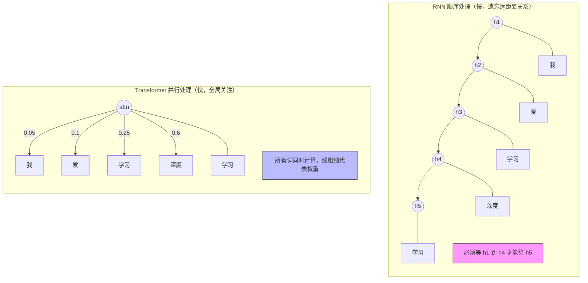
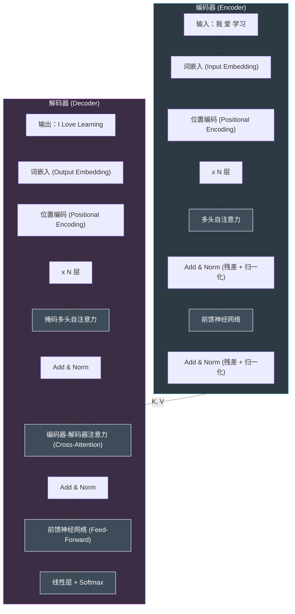
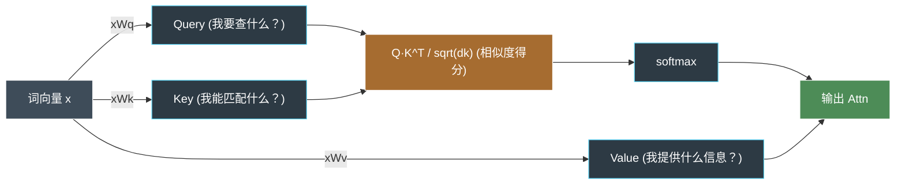
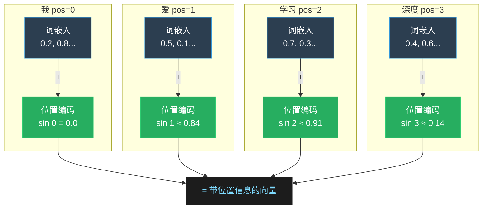
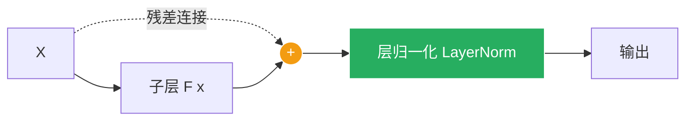
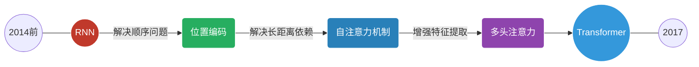

# Transformer 模型

Transformer 是一种基于注意力机制的深度学习模型，最初由 Vaswani 等人在 2017 年的论文《Attention is All You Need》中提出。

它彻底改变了自然语言处理（NLP）领域，并逐渐扩展到计算机视觉等几乎所有 AI 方向。

> Transformer 的核心思想是完全放弃传统的逐词处理方式（RNN），改用注意力机制让模型一次性看完整个句子，同时判断每个词与其他词的关系，从而实现更快的训练和更强的理解能力。

------

## 为什么需要 Transformer？

在 Transformer 出现之前，NLP 领域主要依赖 RNN（循环神经网络）系列模型（如 LSTM、GRU），它们按顺序处理文本，存在两个关键缺陷。

### RNN 的局限性

RNN 像人类"逐字阅读"一样处理文本，这带来了以下问题：

- **梯度消失：**处理长文本时，模型会"忘记"较早的信息。例如"我昨天在图书馆借了一本关于量子物理的书"中，读到"书"时早已忘记"我"是主语，长距离依赖极难捕捉。
- **无法并行：**RNN 必须按顺序处理每一个词，无法利用 GPU 的并行计算能力，训练超长文本时速度极慢。

### Transformer 的解决方案

通过自注意力机制，模型同时处理所有词，并动态计算每对词之间的关联强度，彻底解决了上述两个问题。



RNN 顺序处理 vs Transformer 并行 + 全局注意力对比

------

## Transformer 整体架构

Transformer 由编码器（Encoder）和解码器（Decoder）两大部分组成，各自由多层相同模块堆叠而成。

> 类比理解：编码器好比"读书人"，把输入的中文句子理解为一组富含语义的向量；解码器好比"翻译官"，参考这些向量，一个词一个词地生成英文输出。

以下是 Transformer 架构图，左边为编码器，右边为解码器。




Transformer 编码器 + 解码器完整架构（虚线箭头为 Cross-Attention 信息流）

Transformer 模型由 编码器（Encoder） 和 解码器（Decoder） 两部分组成，每部分都由多层堆叠的相同模块构成。


### 编码器（Encoder）

编码器由 NN 层相同的模块堆叠而成，每层包含两个子层：

- **多头自注意力机制（Multi-Head Self-Attention）：**计算输入序列中每个词与其他词的相关性。
- **前馈神经网络（Feed-Forward Neural Network）：**对每个词进行独立的非线性变换。

每个子层后面都接有 残差连接（Residual Connection） 和 层归一化（Layer Normalization）。

### 解码器（Decoder）

解码器也由 NN 层相同的模块堆叠而成，每层包含三个子层：

- **掩码多头自注意力机制（Masked Multi-Head Self-Attention）：**计算输出序列中每个词与前面词的相关性（使用掩码防止未来信息泄露）。
- **编码器-解码器注意力机制（Encoder-Decoder Attention）：**计算输出序列与输入序列的相关性。
- **前馈神经网络（Feed-Forward Neural Network）：**对每个词进行独立的非线性变换。

同样，每个子层后面都接有残差连接和层归一化。

在 Transformer 模型出现之前，NLP 领域的主流模型是基于 RNN 的架构，如长短期记忆网络（LSTM）和门控循环单元（GRU）。这些模型通过顺序处理输入数据来捕捉序列中的依赖关系，但存在以下问题：

1. **梯度消失问题**：长距离依赖关系难以捕捉。
2. **顺序计算的局限性**：无法充分利用现代硬件的并行计算能力，训练效率低下。


Transformer 通过引入自注意力机制解决了这些问题，允许模型同时处理整个输入序列，并动态地为序列中的每个位置分配不同的权重。

------

## 核心：自注意力机制

自注意力机制是 Transformer 最重要的组件，它回答一个问题："处理这个词时，我应该重点关注句子中的哪些其他词？"

### Q、K、V 是什么？

每个词的向量会被线性变换成三个角色：Query（查询）、Key（键）、Value（值）。



Q、K、V 的来源与注意力计算流程

> 用搜索引擎类比理解 Q/K/V：
>
> Q（Query）= 你在搜索框里输入的关键词，代表"我要查什么？"
>
> K（Key）= 每个网页的标题标签，代表"我能匹配哪些词？"
>
> V（Value）= 每个网页的实际内容，代表"我能提供什么信息？"
>
> 注意力权重 = Q 与每个 K 的相似度，最终结果 = 用权重对所有 V 加权求和。

### 注意力公式

$$
\text{Attention}(Q, K, V) = \text{softmax}\left(\frac{QK^T}{\sqrt{d_k}}\right)V
$$

其中：

- Q 是查询矩阵，K 是键矩阵，V 是值矩阵。
- dk 是向量的维度，用于缩放点积，防止梯度爆炸。
- softmax 将原始得分转为 0~1 之间的概率分布（权重之和为 1）

### 多头注意力（Multi-Head Attention）

单一注意力视角有限，就像只用一种角度看问题。

多头注意力将输入分成 h 个子空间，每个"头"独立学习不同的关注模式，最后拼接结果。


------

## 位置编码（Positional Encoding）

Transformer 同时处理所有词，天然没有"顺序感"——"猫吃鱼"和"鱼吃猫"会被当成一样的。

位置编码就是给每个词加上"座位号"，告诉模型各词在句子中的位置。

> 类比：就像考试时在试卷上标"第1题、第2题"，位置编码让 Transformer 知道"我"是第1个词，"爱"是第2个词。

由于 Transformer 没有显式的序列信息（如 RNN 中的时间步），位置编码被用来为输入序列中的每个词添加位置信息。通常使用正弦和余弦函数生成位置编码：
$$
PE_{(pos,2i)} = \sin\left(\frac{pos}{10000^{2i/d_{\text{model}}}}\right)
$$

$$
PE_{(pos,2i+1)} = \cos\left(\frac{pos}{10000^{2i/d_{\text{model}}}}\right)
$$

其中：

*p**os* 是词的位置，i*i* 是维度索引。



位置编码与词嵌入相加，给模型注入位置信息

### 编码器-解码器架构

### 编码器-解码器架构

Transformer 模型由编码器和解码器两部分组成：

- **编码器：**将输入序列转换为一系列隐藏表示。每个编码器层包含一个自注意力机制和一个前馈神经网络。
- **解码器：** 根据编码器的输出生成目标序列。每个解码器层包含两个注意力机制（自注意力和编码器-解码器注意力）和一个前馈神经网络。

------

## 残差连接与层归一化

每个子层（自注意力、前馈网络）输出后，会执行残差连接和层归一化两个操作，帮助深层网络稳定训练。



输出 = LayerNorm( F(x) + x )

残差连接让梯度"短路"流过，层归一化稳定训练

- **残差连接：**将子层的输入直接加到输出上（output = F(x) + x），避免深层网络的梯度消失，也让模型可以"选择性忽略"某层的变换。
- **层归一化：**对每层的激活值做归一化，使训练更稳定，收敛更快。

------

## Transformer 的优势

相比传统的 RNN 架构，Transformer 有以下几个显著优势：

| 并行计算                                                    | 长距离依赖                                                   | 可扩展性强                                                   |
| ----------------------------------------------------------- | ------------------------------------------------------------ | ------------------------------------------------------------ |
| 同时处理整个序列，充分利用 GPU 并行能力，训练速度远超 RNN。 | 自注意力机制让任意两个词之间的 "通信距离" 始终为 1，不再受序列长度限制。 | 堆叠更多层、增大维度即可提升性能，催生了 BERT、GPT 等强大模型。 |

------

## Transformer 的应用

Transformer 架构已在 AI 各领域得到广泛应用，以下按领域分类介绍。

### 自然语言处理 (NLP)

`机器翻译 (Google Translate)` | `文本生成(GPT 系列)`  | `文本分类` | `问答系统` | `情感分析` | `摘要生成`

### 计算机视觉（CV）

`图像分类 (Vision Transformer / ViT)` | `目标检测` | `图像生成`

### 多模态任务

`图文对齐 (CLIP) `|`文本生成图像 (DALL-E / Stable Diffusion)` |`视频理解`

------

## Transformer 的应用

- **自然语言处理（NLP）**：
  - 机器翻译（如 Google Translate）
  - 文本生成（如 GPT 系列模型）
  - 文本分类、问答系统等。
- **计算机视觉（CV）**：
  - 图像分类（如 Vision Transformer）
  - 目标检测、图像生成等。
- **多模态任务**：
  - 结合文本和图像的任务（如 CLIP、DALL-E）。


## PyTorch 实现示例

以下是一个完整的 PyTorch Transformer 示例，包含详细注释帮助初学者理解每个步骤：

```py
import torch
import torch.nn as nn
import torch.optim as optim

# --- 定义 Transformer 模型 ---

class TransformerModel(nn.Module):
    def __init__(self, input_dim, model_dim, num_heads, num_layers, output_dim):
        super(TransformerModel, self).__init__()

        # 词嵌入：将词索引映射为 model_dim 维向量
        self.embedding = nn.Embedding(input_dim, model_dim)

        # 位置编码：可学习的位置向量，最大支持长度 1000
        self.positional_encoding = nn.Parameter(
            torch.zeros(1, 1000, model_dim)
        )

        # PyTorch 内置 Transformer（包含编码器 + 解码器）
        self.transformer = nn.Transformer(
            d_model=model_dim,               # 向量维度
            nhead=num_heads,                 # 多头注意力的头数
            num_encoder_layers=num_layers,   # 编码器层数
            num_decoder_layers=num_layers    # 解码器层数
        )

        # 最终线性层：将向量映射回词汇表大小（用于预测下一个词）
        self.fc = nn.Linear(model_dim, output_dim)

    def forward(self, src, tgt):
        src_seq_length = src.size(1)
        tgt_seq_length = tgt.size(1)

        # 词嵌入 + 位置编码（两者相加）
        src = self.embedding(src) + self.positional_encoding[:, :src_seq_length, :]
        tgt = self.embedding(tgt) + self.positional_encoding[:, :tgt_seq_length, :]

        # 通过 Transformer（编码器读 src，解码器生成 tgt）
        transformer_output = self.transformer(src, tgt)

        # 线性层输出每个位置的词汇概率
        output = self.fc(transformer_output)
        return output

# --- 超参数设置 ---

input_dim  = 10000  # 词汇表大小（共有多少个不同的词）
model_dim  = 512    # 每个词的向量维度（原论文使用 512）
num_heads  = 8      # 多头注意力头数（需能整除 model_dim）
num_layers = 6      # 编码器/解码器层数（原论文使用 6）
output_dim = 10000  # 输出维度（与词汇表大小相同）

# --- 初始化模型、损失函数和优化器 ---

model     = TransformerModel(input_dim, model_dim, num_heads, num_layers, output_dim)
criterion = nn.CrossEntropyLoss()                # 多分类交叉熵损失
optimizer = optim.Adam(model.parameters(), lr=0.001)  # Adam 优化器

# --- 构造示例数据（实际使用时换成真实语料） ---

# src: 源序列（如中文），shape = (序列长度=10, 批量大小=32)
src = torch.randint(0, input_dim, (10, 32))
# tgt: 目标序列（如英文），shape = (序列长度=20, 批量大小=32)
tgt = torch.randint(0, input_dim, (20, 32))

# --- 前向传播 ---

output = model(src, tgt)
# output.shape = (20, 32, 10000)：每个位置对词汇表的预测分布

# --- 计算损失 ---

# view(-1, output_dim) 将 (20,32,10000) 展平为 (640, 10000)
loss = criterion(output.view(-1, output_dim), tgt.view(-1))

# --- 反向传播 + 更新权重 ---

optimizer.zero_grad()   # 清空上一步的梯度
loss.backward()         # 计算梯度
optimizer.step()        # 更新参数

print(f"损失值: {loss.item():.4f}")
```

> 上面的代码使用随机数据只是为了演示流程。实际训练时需要：
>
> - 1) 准备真实的平行语料（如中英翻译对）；
> - 2) 做好分词和词汇表构建；
> - 3) 实现 Decoder 的逐步推理（自回归生成）；
> - 4) 调整学习率调度策略（原论文用 Warmup）。

------

## 总结

从 RNN 到 Transformer 的演进，代表了深度学习领域一次重要的范式转变。



从 RNN 到 Transformer 的演进路径

Transformer 的三大创新彻底改变了深度学习格局：

1. **自注意力机制**——让任意两词直接"对话"，告别梯度消失。
2. **完全并行化**——训练速度质的飞跃，使大规模预训练成为可能。
3. **通用架构**——从 NLP 到 CV、多模态，Transformer 已成为 AI 时代的"通用积木"。

掌握 Transformer，你就掌握了理解 GPT、BERT、Stable Diffusion 等现代 AI 模型的钥匙。

------

## 相关术语速查

| 术语       | 英文                 | 说明                                           |
| :--------- | :------------------- | :--------------------------------------------- |
| 自注意力   | Self-Attention       | 计算序列内各元素之间相关性的机制               |
| 多头注意力 | Multi-Head Attention | 多个注意力头并行计算，捕捉不同特征子空间的信息 |
| 位置编码   | Positional Encoding  | 为模型提供序列中元素位置信息的技术             |
| 残差连接   | Residual Connection  | 将输入直接加到子层输出上，缓解梯度消失         |
| 层归一化   | Layer Normalization  | 对每层激活值归一化，加速训练收敛               |
| 编码器     | Encoder              | 将输入序列编码为上下文表示                     |
| 解码器     | Decoder              | 根据编码器输出生成目标序列                     |
| 交叉注意力 | Cross-Attention      | 解码器关注编码器输出的注意力机制               |
| 掩码注意力 | Masked Attention     | 解码器中防止关注未来位置信息的机制             |
| 前馈网络   | Feed-Forward Network | 对每个位置独立应用的全连接层                   |
