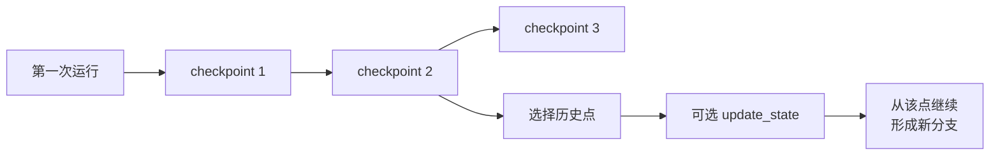
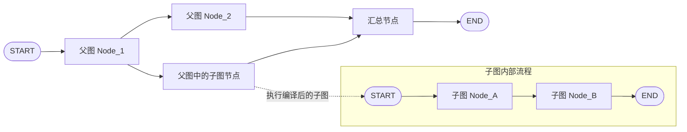

# LangGraph 高级特性

------

**本章课程目标：**

- 理解 LangGraph 的五类高级能力：**流式处理（Streaming）**、**状态持久化（Persistence）**、**人机协作与中断恢复（Interrupt / HITL）**、**时间回溯（Time-Travel）**、**子图（Subgraphs）**。
- 建立一个更工程化的认知：这些能力不是零散 API，而是 LangGraph 为真实生产场景提供的“可观测、可恢复、可复用、可扩展”的基础设施。
- 能运行并理解本章全部案例，知道这些高级特性分别解决什么问题、适合放在什么场景里使用。

**学习建议：** 这章按真实项目的优先级读：流式解决“看不见进度”，持久化解决“状态接不上、失败要重跑”，Interrupt 解决“关键动作要人审”，时间回溯偏调试复盘，子图偏复用拆分。每学一个特性，先问它解决哪类痛点，再看 API。

**官方文档与资源**：详见 [工具导航与参考资料索引 - LangGraph](https://i8zoro8i.github.io/zoro_blog/column/AIAgent/工具导航与参考资料索引)。

------

## 1、流式处理（Streaming）

### 1.1 定义

在很多人的印象里，“流式输出”常常只等于“大模型逐 token 打字机式输出”。但放到 LangGraph 里，流式处理的范围更大。它不仅能输出模型生成过程，还能把**图执行过程中的状态变化、节点进度、子图过程、自定义消息**一边执行一边暴露出来。

这也是 LangGraph 流式处理和普通模型流式输出最大的区别：

- **普通 LLM 流式**：更关注“模型文字怎么一点点吐出来”
- **LangGraph 流式**：更关注“整张图现在跑到哪一步了，状态发生了什么变化”

所以你可以先把 LangGraph Streaming 理解成：**把图执行过程拆开给你看，而不是等整张图完全跑完才给最终结果。**

### 1.2 流式处理的价值

流式处理不是“锦上添花”的体验优化，而是很多 AI 应用的重要基础能力。真实项目里常见需求包括：

- 前端希望边执行边展示当前进度，而不是长时间白屏等待
- 调用大模型时，希望 token 级别实时显示
- 工作流较长时，希望知道当前执行到哪个节点
- 调试复杂图时，希望看到每一步到底更新了什么状态
- 子图或工具内部有重要中间结果，希望在最终结果出来前先看到过程

它有两层价值：**用户体验层**，让用户更早感知任务正在执行；**工程调试层**，让开发者更容易观察图内部发生了什么。

### 1.3 stream() 与 invoke()

先分清这两个入口：

- `invoke()`：等整张图跑完，再返回最终结果
- `stream()` / `astream()`：图在运行过程中，就把中间结果分批往外送
- 如果你只关心最后结果，用 `invoke()`
- 如果你想一边执行一边观察，用 `stream()` 或 `astream()`

LangGraph 图本身实现了 **Runnable** 接口，所以自然拥有这些流式能力。这也让它和 LangChain `Runnable` / LCEL 体系能够衔接起来。

这里还要补一个关键参数：`stream_mode`。`stream()` 不是只有一种固定输出格式，`stream_mode` 决定了“图在执行过程中，到底往外流什么”，比如完整状态、增量更新、模型消息片段，或自定义进度信息。

### 1.4 stream_mode 有哪些

LangGraph 通过 `stream_mode` 指定“到底想流什么”。

当前最常见、最值得你先掌握的模式有这些：

| 模式       | 含义                                  |
| ---------- | ------------------------------------- |
| `values`   | 每一步结束后输出当前完整状态快照      |
| `updates`  | 每一步结束后只输出本步的增量更新      |
| `messages` | 输出 LLM 生成过程中的消息片段 / token |
| `custom`   | 输出节点内部主动写出的自定义消息      |
| `debug`    | 输出更完整、更底层的调试信息          |

如果你想同时拿到多种流，可以直接传列表，例如：

```python
stream_mode=["updates", "custom"]
```

这时返回的流式结果通常会带上“当前是哪一种模式的数据”。

### 1.5 values 和 updates 怎么区分

这是本章里最容易混的一组概念。

- `values`：每一步都给你“当前完整 State 长什么样”
- `updates`：每一步只给你“这一小步到底改了哪些字段”

从调试体验上说：

- `values` 更像“每一步的全量快照”
- `updates` 更像“每一步的增量日志”

### 1.6 案例：流图状态（values / updates）

这个案例就是用最直接的方式，把 `values` 和 `updates` 的差别跑给你看。它的重点不是业务逻辑，而是让你建立一个流式观察状态变化的直觉。

【案例源码】`案例与源码-3-LangGraph框架/07-senior/streaming/StreamGraphState.py`

```py
"""
【案例】流式传输图状态：对比 stream_mode 为 updates 与 values 时，每一步向调用方推送的内容差异。

对应教程章节：第 17 章 - LangGraph 高级特性 → 1、流式处理（Streaming）

知识点速览：
- `stream(..., stream_mode="updates")`：每步只推送“本节点本次改了什么”，更像增量日志。
- `stream(..., stream_mode="values")`：每步推送“当前完整状态长什么样”，更像全量快照。
- 这是理解第 17 章 Streaming 主线的关键案例：同一张图，只是换了流模式，看到的数据视角就完全不同。
"""

from typing import TypedDict

from langgraph.graph import StateGraph, START, END


class DiliState(TypedDict):
    topic: str
    joke: str


def refine_topic(state: DiliState):
    return {"topic": state["topic"] + " and cats"}


def generate_joke(state: DiliState):
    return {"joke": f"This is a joke about {state['topic']}"}


def main():
    graph = (
        StateGraph(DiliState)
        .add_node(refine_topic)
        .add_node(generate_joke)
        .add_edge(START, "refine_topic")
        .add_edge("refine_topic", "generate_joke")
        .add_edge("generate_joke", END)
        .compile()
    )

    # updates：每步结束后只流出「本步对状态的更新」
    for chunk in graph.stream({"topic": "ice cream"}, stream_mode="updates"):
        print(chunk)

    print()

    # values：每步结束后流出「当前完整 state」（未写字段可能仍为空字符串等初始形态）
    for chunk in graph.stream({"topic": "ice cream"}, stream_mode="values"):
        print(chunk)


if __name__ == "__main__":
    main()
"""
【输出示例】
{'refine_topic': {'topic': 'ice cream and cats'}}
{'generate_joke': {'joke': 'This is a joke about ice cream and cats'}}

{'topic': 'ice cream'}
{'topic': 'ice cream and cats'}
{'topic': 'ice cream and cats', 'joke': 'This is a joke about ice cream and cats'}
"""

```

### 1.7 案例：多模式流与 debug

当你把 `stream_mode` 设成列表时，一次运行里就能同时拿到多种类型的流。这个案例最值得观察的是：

- 多种模式一起开时，输出长什么样
- `debug` 模式为什么更适合调试，而不是直接拿去做业务 UI

【案例源码】`案例与源码-3-LangGraph框架/07-senior/streaming/StreamMultipleModes.py`

```py
"""
【案例】多模式流式传输：同一图依次演示 values、updates、列表组合 [values, updates]、以及 debug 模式。

对应教程章节：第 17 章 - LangGraph 高级特性 → 1、流式处理（Streaming）

知识点速览：
- stream_mode 为列表时，每次迭代得到 (mode, chunk) 元组，便于前端按类型分别处理。
- `values` 看“全貌”，`updates` 看“增量”；`debug` 输出更细，适合调试，不适合直接当业务输出。
- 这个案例的核心价值是帮你建立“同一张图可以同时暴露多种观察视角”，而不是背住某个模式名。
- 节点函数返回的字典仍按 State 的 Reducer 合并；本例字段未显式 Annotated，默认就是覆盖更新。
"""

from typing import TypedDict

from langgraph.graph import StateGraph, START, END


class DiliState(TypedDict):
    question: str
    answer: str
    confidence: float  # 置信度分数
    steps: list


def think(state: DiliState) -> DiliState:
    """思考节点：模拟多步推理，写入 steps。"""
    question = state["question"]
    steps = [f"分析问题: {question}", "检索相关知识", "形成初步答案"]
    return {"steps": steps}


def respond(state: DiliState) -> DiliState:
    """回应节点：根据关键词生成答案与置信度。"""
    question = state["question"]
    if "天气" in question:
        answer = "今天天气晴朗"
        confidence = 0.9
    elif "时间" in question:
        answer = "现在是上午10点"
        confidence = 0.8
    else:
        answer = "这是一个很好的问题"
        confidence = 0.7

    return {
        "answer": answer,
        "confidence": confidence,
    }


def reflect(state: DiliState) -> DiliState:
    """反思节点：在 steps 上追加校验与结论。"""
    answer = state["answer"]
    confidence = state["confidence"]
    steps = state.get("steps", [])

    steps.append(f"验证答案: {answer}")
    steps.append(f"置信度评估: {confidence}")

    if confidence > 0.8:
        conclusion = "高置信度答案"
    elif confidence > 0.5:
        conclusion = "中等置信度答案"
    else:
        conclusion = "低置信度答案"

    steps.append(f"结论: {conclusion}")

    return {"steps": steps}


def main():
    builder = StateGraph(DiliState)
    builder.add_node("think", think)
    builder.add_node("respond", respond)
    builder.add_node("reflect", reflect)

    builder.add_edge(START, "think")
    builder.add_edge("think", "respond")
    builder.add_edge("respond", "reflect")
    builder.add_edge("reflect", END)

    graph = builder.compile()

    print("=== LangGraph 多模式流式传输演示 ===\n")

    input_state = {
        "question": "今天天气怎么样?",
        "answer": "",
        "confidence": 0.0,
        "steps": [],
    }

    print("--- 1. 使用 stream_mode='values' 模式 ---")
    print("显示每一步执行后的完整状态:")
    for chunk in graph.stream(input_state, stream_mode="values"):
        print(f"  {chunk}")

    print("\n" + "=" * 60 + "\n")

    print("--- 2. 使用 stream_mode='updates' 模式 ---")
    print("只显示每一步的状态更新:")
    for chunk in graph.stream(input_state, stream_mode="updates"):
        print(f"  {chunk}")

    print("\n" + "=" * 60 + "\n")

    print("--- 3. 同时使用 stream_mode=[values, updates] 多种流模式 ---")
    print("同时显示完整状态和状态更新:")
    for mode, chunk in graph.stream(input_state, stream_mode=["values", "updates"]):
        print(f"  [{mode}]: {chunk}")

    print("\n" + "=" * 60 + "\n")

    print("--- 4. 使用 debug 模式 ---")
    print("显示详细的调试信息:")
    try:
        for chunk in graph.stream(input_state, stream_mode="debug"):
            print(f"  {chunk}")
    except Exception as e:
        print(f"  Debug模式可能需要特殊配置: {e}")


if __name__ == "__main__":
    main()

"""
【输出示例】
=== LangGraph 多模式流式传输演示 ===

--- 1. 使用 stream_mode='values' 模式 ---
显示每一步执行后的完整状态:
  {'question': '今天天气怎么样?', 'answer': '', 'confidence': 0.0, 'steps': []}
  {'question': '今天天气怎么样?', 'answer': '', 'confidence': 0.0, 'steps': ['分析问题: 今天天气怎么样?', '检索相关知识', '形成初步答案']}
  {'question': '今天天气怎么样?', 'answer': '今天天气晴朗', 'confidence': 0.9, 'steps': ['分析问题: 今天天气怎么样?', '检索相关知识', '形成初步答案']}
  {'question': '今天天气怎么样?', 'answer': '今天天气晴朗', 'confidence': 0.9, 'steps': ['分析问题: 今天天气怎么样?', '检索相关知识', '形成初步答案', '验证答案: 今天天气晴朗', '置信度评估: 0.9', '结论: 高置信度答案']}

============================================================

--- 2. 使用 stream_mode='updates' 模式 ---
只显示每一步的状态更新:
  {'think': {'steps': ['分析问题: 今天天气怎么样?', '检索相关知识', '形成初步答案']}}
  {'respond': {'answer': '今天天气晴朗', 'confidence': 0.9}}
  {'reflect': {'steps': ['分析问题: 今天天气怎么样?', '检索相关知识', '形成初步答案', '验证答案: 今天天气晴朗', '置信度评估: 0.9', '结论: 高置信度答案']}}

============================================================

--- 3. 同时使用 stream_mode=[values, updates] 多种流模式 ---
同时显示完整状态和状态更新:
  [values]: {'question': '今天天气怎么样?', 'answer': '', 'confidence': 0.0, 'steps': []}
  [updates]: {'think': {'steps': ['分析问题: 今天天气怎么样?', '检索相关知识', '形成初步答案']}}
  [values]: {'question': '今天天气怎么样?', 'answer': '', 'confidence': 0.0, 'steps': ['分析问题: 今天天气怎么样?', '检索相关知识', '形成初步答案']}
  [updates]: {'respond': {'answer': '今天天气晴朗', 'confidence': 0.9}}
  [values]: {'question': '今天天气怎么样?', 'answer': '今天天气晴朗', 'confidence': 0.9, 'steps': ['分析问题: 今天天气怎么样?', '检索相关知识', '形成初步答案']}
  [updates]: {'reflect': {'steps': ['分析问题: 今天天气怎么样?', '检索相关知识', '形成初步答案', '验证答案: 今天天气晴朗', '置信度评估: 0.9', '结论: 高置信度答案']}}
  [values]: {'question': '今天天气怎么样?', 'answer': '今天天气晴朗', 'confidence': 0.9, 'steps': ['分析问题: 今天天气怎么样?', '检索相关知识', '形成初步答案', '验证答案: 今天天气晴朗', '置信度评估: 0.9', '结论: 高置信度答案']}

============================================================

--- 4. 使用 debug 模式 ---
显示详细的调试信息:
  {'step': 1, 'timestamp': '2026-03-23T10:18:42.693927+00:00', 'type': 'task', 'payload': {'id': '11d771f2-98ac-b00c-931e-2b5bcb28f2ec', 'name': 'think', 'input': {'question': '今天天气怎么样?', 'answer': '', 'confidence': 0.0, 'steps': []}, 'triggers': ('branch:to:think',)}}
  {'step': 1, 'timestamp': '2026-03-23T10:18:42.693983+00:00', 'type': 'task_result', 'payload': {'id': '11d771f2-98ac-b00c-931e-2b5bcb28f2ec', 'name': 'think', 'error': None, 'result': {'steps': ['分析问题: 今天天气怎么样?', '检索相关知识', '形成初步答案']}, 'interrupts': []}}
  {'step': 2, 'timestamp': '2026-03-23T10:18:42.694026+00:00', 'type': 'task', 'payload': {'id': 'a3af09a2-2f1a-d7f5-7957-55d931a52ed7', 'name': 'respond', 'input': {'question': '今天天气怎么样?', 'answer': '', 'confidence': 0.0, 'steps': ['分析问题: 今天天气怎么样?', '检索相关知识', '形成初步答案']}, 'triggers': ('branch:to:respond',)}}
  {'step': 2, 'timestamp': '2026-03-23T10:18:42.694074+00:00', 'type': 'task_result', 'payload': {'id': 'a3af09a2-2f1a-d7f5-7957-55d931a52ed7', 'name': 'respond', 'error': None, 'result': {'answer': '今天天气晴朗', 'confidence': 0.9}, 'interrupts': []}}
  {'step': 3, 'timestamp': '2026-03-23T10:18:42.694113+00:00', 'type': 'task', 'payload': {'id': 'c2627962-4fda-05bb-b1f5-5c40e36195a7', 'name': 'reflect', 'input': {'question': '今天天气怎么样?', 'answer': '今天天气晴朗', 'confidence': 0.9, 'steps': ['分析问题: 今天天气怎么样?', '检索相关知识', '形成初步答案']}, 'triggers': ('branch:to:reflect',)}}
  {'step': 3, 'timestamp': '2026-03-23T10:18:42.694234+00:00', 'type': 'task_result', 'payload': {'id': 'c2627962-4fda-05bb-b1f5-5c40e36195a7', 'name': 'reflect', 'error': None, 'result': {'steps': ['分析问题: 今天天气怎么样?', '检索相关知识', '形成初步答案', '验证答案: 今天天气晴朗', '置信度评估: 0.9', '结论: 高置信度答案']}, 'interrupts': []}}
"""

```

### 1.8 案例：LLM 逐 token 流式输出（messages）

如果某个节点里调用了大模型，`messages` 模式就特别有价值。它可以帮助你在图运行过程中，直接拿到模型生成的消息片段，而不用等节点完全执行完。

这也是为什么 LangGraph Streaming 不只是“图状态流”，它还能把模型输出也纳入统一流式体系。

【案例源码】`案例与源码-3-LangGraph框架/07-senior/streaming/StreamLLMTokens.py`

```py
"""
【案例】messages 流模式：从图中调用 LLM 的节点逐 token（或片段）推送输出，便于打字机效果。

对应教程章节：第 17 章 - LangGraph 高级特性 → 1、流式处理（Streaming）

知识点速览：
- stream_mode="messages" 时，每次迭代一般为 (message_chunk, metadata)：chunk 为模型输出片段，metadata 标明节点等上下文。
- 这个案例最适合用来建立“LangGraph Streaming 不只流状态，也能流模型输出”这层认知。
- 流式消费侧通常关心 `chunk.content` 和 `metadata`；前者是输出片段，后者帮助你知道这些片段来自哪个节点。
- 需配置环境变量（如 aliQwen-api）与网络；模型、base_url 按你本地教程为准。
"""

import os
from typing import TypedDict

from langchain.chat_models import init_chat_model
from langgraph.graph import StateGraph, START

from dotenv import load_dotenv

load_dotenv(encoding="utf-8")


class State(TypedDict):
    query: str
    answer: str


def node(state: State):
    print("开始调用 node 节点")

    model = init_chat_model(
        model="qwen-plus",
        model_provider="openai",
        api_key=os.getenv("aliQwen-api"),
        base_url="https://dashscope.aliyuncs.com/compatible-mode/v1",
    )

    llm_result = model.invoke([("user", state["query"])])
    print("llm invoke 结束", end="\n\n")

    return {"answer": llm_result}


def main():
    graph = (
        StateGraph(state_schema=State).add_node(node).add_edge(START, "node").compile()
    )

    inputs = {"query": "帮我生成一个200字的小学生作文，主题为我的一天"}

    # messages：从图内触发的大模型调用处流式输出；(chunk, metadata) 见官方文档
    for chunk, _metadata in graph.stream(inputs, stream_mode="messages"):
        # print(f"type of chunk:{type(chunk)}")  # 调试时可打开
        print(chunk.content, end="")
        # print(chunk, end="")


if __name__ == "__main__":
    main()

"""
【输出示例】
(.venv) didilili@DidililiMacBook-Pro streaming % python3 StreamLLMTokens.py
开始调用 node 节点
我的一天  

清晨，阳光悄悄爬上窗台，我伸个懒腰起床了！吃完妈妈做的香喷喷的煎蛋和牛奶，背上书包去上学。课堂上，我认真听讲，积极举手回答问题；课间和好朋友跳皮筋、讲故事，笑声像铃铛一样清脆。中午吃食堂的番茄炒蛋盖饭，暖暖的真好吃！放学后，我先完成作业，再陪小猫“团团”玩一会儿毛线球。晚饭后，我和爸爸一起读绘本，妈妈教我折了一只纸鹤，翅膀还微微翘着呢！临睡前，我刷牙洗脸，把小书包整理好，明天还要早起升旗呢！这一天像一颗甜甜的水果糖——有学习的酸、玩耍的甜、家人的暖，还有成长的光。我爱这充实又快乐的一天！（198字）llm invoke 结束
"""

```

### 1.9 案例：自定义数据流（custom）

有时候你想流的不是状态，也不是 token，而是业务自定义进度。例如：

- “正在检索知识库”
- “正在生成回答”
- “当前进度 60%”

这时就可以在节点内部通过流写入器主动写出自定义数据，然后用 `custom` 模式接收。

这两个案例的关系如下：

- `StreamCustomDataSimple.py`：先看最小可运行版本
- `StreamCustomData.py`：再看更贴近真实项目的进度与组合模式写法

【案例源码】`案例与源码-3-LangGraph框架/07-senior/streaming/StreamCustomDataSimple.py`

```py
"""
【案例】自定义流（custom）最简版：在节点内通过 get_stream_writer() 写入任意可序列化数据，stream 侧用 custom 接收。

对应教程章节：第 17 章 - LangGraph 高级特性 → 1、流式处理（Streaming）

知识点速览：
- 这是 `custom` 模式的最小案例，重点不是业务逻辑，而是先看懂“节点内部怎么主动写出一段流式消息”。
- `get_stream_writer()` 仅在图执行（stream/astream）过程中有效；调用 `graph.stream` 时，`stream_mode` 里必须包含 `custom`。
- 自定义块与状态更新是分开的：前者更适合 UI/日志/进度提示，后者仍然通过 State 和 Reducer 管理。
"""

from typing import TypedDict

from langgraph.config import get_stream_writer
from langgraph.graph import StateGraph, START, END


class State(TypedDict):
    query: str
    answer: str


def node(state: State):
    writer = get_stream_writer()
    writer({"custom_key": "欢迎来到线上Agent班级学习，O(∩_∩)O"})
    return {"answer": "some data"}


def main():
    graph = (
        StateGraph(State)
        .add_node(node)
        .add_edge(START, "node")
        .add_edge("node", END)
        .compile()
    )

    # 仅 custom：for chunk in graph.stream({"query": "example"}, stream_mode=["custom"]): print(chunk)
    # custom + updates：for mode, chunk in graph.stream(..., stream_mode=["updates", "custom"]): ...
    for chunk in graph.stream({"query": "example"}, stream_mode=["values", "custom"]):
        print(chunk)


if __name__ == "__main__":
    main()

"""
【输出示例】
('values', {'query': 'example'})
('custom', {'custom_key': '欢迎来到线上Agent班级学习，O(∩_∩)O'})
('values', {'query': 'example', 'answer': 'some data'})
"""

```

【案例源码】`案例与源码-3-LangGraph框架/07-senior/streaming/StreamCustomData.py`

```py
"""
【案例】自定义流 + 状态更新组合：节点内多次 writer(...) 推送进度，同时返回 dict 更新 State；演示 custom / updates / 组合。

对应教程章节：第 17 章 - LangGraph 高级特性 → 1、流式处理（Streaming）

知识点速览：
- `get_stream_writer()` 负责把“图运行过程中的自定义消息”主动往外推；它和节点返回的状态更新是两条并行通道。
- `stream_mode=["custom", "updates"]` 时，迭代得到 `(mode, chunk)`，非常适合前端一边看业务进度，一边看状态更新。
- 本例最值得观察的是：`writer(...)` 写出的 `custom` 数据不会自动进 State；节点真正写回图状态的，仍然是最后 return 的那份 dict。
"""

from typing import TypedDict

from langgraph.config import get_stream_writer
from langgraph.graph import StateGraph, START, END


class State(TypedDict):
    query: str
    answer: str
    progress: list


def node_with_custom_streaming(state: State) -> State:
    """带自定义流式传输的节点：边写自定义流边更新状态。"""
    writer = get_stream_writer()

    writer({"custom_key": "开始处理查询"})
    writer({"progress": "步骤1: 分析查询内容", "status": "running"})

    query = state["query"]

    writer({"progress": "步骤2: 生成结果", "status": "running"})
    writer({"progress": "步骤3: 完成处理", "status": "completed"})
    writer({"custom_key": "查询处理完成"})

    result = f"处理结果: {query.upper()}"
    return {
        "answer": result,
        "progress": state.get("progress", []) + ["处理完成"],
    }


def main():
    print("=== LangGraph 自定义数据流式传输演示 ===\n")

    graph = (
        StateGraph(State)
        .add_node("node_with_custom_streaming", node_with_custom_streaming)
        .add_edge(START, "node_with_custom_streaming")
        .add_edge("node_with_custom_streaming", END)
        .compile()
    )

    inputs = {"query": "hello world", "answer": "", "progress": []}

    print("--- 1. 单独使用 custom 流模式 ---")
    try:
        for chunk in graph.stream(inputs, stream_mode="custom"):
            print(f"自定义数据块: {chunk}")
    except Exception as e:
        print(f"错误: {e}")
        print(
            "说明: 在 Graph API 中，自定义流数据需在节点中通过 get_stream_writer 发送"
        )

    print("\n" + "=" * 50 + "\n")

    print("--- 2. 单独使用 updates 流模式 ---")
    for chunk in graph.stream(inputs, stream_mode="updates"):
        print(f"状态更新: {chunk}")

    print("\n" + "=" * 50 + "\n")

    print("--- 3. 同时使用 custom 和 updates 流模式 ---")
    try:
        for mode, chunk in graph.stream(inputs, stream_mode=["custom", "updates"]):
            print(f"[{mode}]: {chunk}")
    except Exception as e:
        print(f"错误: {e}")
        print("说明: 请确认 LangGraph 版本支持多模式流")


if __name__ == "__main__":
    main()

"""
【输出示例】
=== LangGraph 自定义数据流式传输演示 ===

--- 1. 单独使用 custom 流模式 ---
自定义数据块: {'custom_key': '开始处理查询'}
自定义数据块: {'progress': '步骤1: 分析查询内容', 'status': 'running'}
自定义数据块: {'progress': '步骤2: 生成结果', 'status': 'running'}
自定义数据块: {'progress': '步骤3: 完成处理', 'status': 'completed'}
自定义数据块: {'custom_key': '查询处理完成'}

==================================================

--- 2. 单独使用 updates 流模式 ---
状态更新: {'node_with_custom_streaming': {'answer': '处理结果: HELLO WORLD', 'progress': ['处理完成']}}

==================================================

--- 3. 同时使用 custom 和 updates 流模式 ---
[custom]: {'custom_key': '开始处理查询'}
[custom]: {'progress': '步骤1: 分析查询内容', 'status': 'running'}
[custom]: {'progress': '步骤2: 生成结果', 'status': 'running'}
[custom]: {'progress': '步骤3: 完成处理', 'status': 'completed'}
[custom]: {'custom_key': '查询处理完成'}
[updates]: {'node_with_custom_streaming': {'answer': '处理结果: HELLO WORLD', 'progress': ['处理完成']}}
"""

```

### 1.10 小结：什么时候该用哪种流

| 需求                   | 更适合的模式 |
| ---------------------- | ------------ |
| 想看整张图当前完整状态 | `values`     |
| 想看每一步改了什么     | `updates`    |
| 想看 LLM token         | `messages`   |
| 想推送业务自定义进度   | `custom`     |
| 想详细调试图内部执行   | `debug`      |

------

## 2、状态持久化（Persistence）

### 2.1 定义

如果说流式处理解决的是“图在运行过程中怎么被看见”，那状态持久化解决的是另一个问题：**图跑到一半、跑完之后，状态能不能被记住，并在下次继续使用。**

LangGraph 的持久化核心围绕 **checkpoint（检查点）** 展开。给图配置 checkpointer 后，图在执行过程中会把状态保存成一个个检查点。被保存的字段与合并规则，仍由你在 第 15 章 定义的 **State / Reducer** 决定。

这些检查点会被组织到某个 **thread** 下面。入门阶段，可以先把 thread 理解成“同一条会话或同一条工作流链路”的 ID 容器，而最常见的就是通过：

```python
{"configurable": {"thread_id": "..."}}
```

来区分不同对话、不同用户或不同执行线程。


**图注：** 上图概括 **Checkpoint 在生产场景中的价值**（存档、容错、断点续跑、回溯与审计）；`thread_id` 则用于在存储侧把同一对话/任务链的检查点归并到一条「线程」下，与图中「按步落盘」互补。

### 2.2 持久化的价值

LangGraph 的很多高级能力，其实都建立在持久化之上。官方文档里明确提到，持久化是这些能力的基础：

- 人工介入（human-in-the-loop）
- 对话 / 线程级记忆
- 时间回溯（time-travel）
- 容错恢复（fault-tolerant execution）

持久化不是“额外加的一层存储”，而是 LangGraph 适合做生产级 Agent / Workflow 的关键原因之一。

### 2.3 常见场景

先不急着看 Checkpointer 后端，先把持久化最常解决的两个场景想明白。

**场景一：同一个 Agent 会话里，多次调用之间保持上下文。**

比如用户第一次问：“北京明天天气怎么样？”Agent 调用天气工具得到“晴，26 度”。第二次用户接着问：“适合出去玩吗？”如果没有持久化，第二次调用只看到当前问题，很可能不知道“出去玩”指的是北京明天；如果同一条会话共用同一个 `thread_id`，图就能从 checkpoint 里接上前面的消息和工具结果。


**场景二：图执行到一半时，某个节点报错、断电或网络故障，希望修好后从中间继续。**

比如 `Node1` 已经正常写入了 `key_1`，`Node2` 报错了。我们通常不希望修复 `Node2` 后又从 `START` 全量重跑一次，尤其是前面节点可能很慢、很贵、或者已经产生了外部副作用。只要状态已经落到持久化后端，后续就有机会从最近的 checkpoint 继续。


这两个场景分别对应两种常见价值：

- **会话连续性**：同一用户、同一任务、同一线程里的多轮调用可以共享上下文。
- **故障恢复**：长流程中途失败后，尽量从已保存的执行现场继续，而不是全部重来。

### 2.4 Checkpointer 与 thread_id

要让图保存状态，通常有三步：

1. 创建一个 checkpointer，例如 `InMemorySaver()`、`SqliteSaver(...)`。
2. 编译图时传入：`builder.compile(checkpointer=checkpointer)`。
3. 调用图时传入 `config={"configurable": {"thread_id": "..."}}`。

`thread_id` 很容易被误解。它不是 Python 线程 ID，也不表示操作系统线程；在 LangGraph 语境里，它更像是**状态空间的隔离 ID**。同一个 `thread_id` 下，图可以接上历史状态；换一个新的 `thread_id`，就是另一条独立会话或任务链。

从故障中恢复时，还会看到一个很常见的写法：

```python
graph.invoke(None, config={"configurable": {"thread_id": "user-001"}})
```

这里传 `None` 的意思不是“没有输入”，而是告诉图：**不要重新初始化一份新状态，而是沿用这个 thread 最近保存的状态继续推进。** 当然，真实项目里是否可以这样恢复，还取决于你的节点是否幂等、错误是否已修复、checkpoint 是否已经保存到了可靠后端。

### 2.5 历史状态

持久化还带来一个直接收益：你可以查看某条 thread 的状态历史。常见 API 是：

- `graph.get_state(config)`：获取最近一次状态快照。
- `graph.get_state_history(config)`：获取历史状态快照序列。

这些状态快照可以帮助你回答几个排障问题：

- 当前图最后停在什么状态？
- 下一步准备执行哪个节点？
- 中间某一步到底写入了哪些字段？
- 如果要做时间回溯，应该从哪一个 checkpoint 开始？

这和第 15 章讲过的 `StateSnapshot` 是一条线：`values` 让你看到当前状态，`next` 让你知道下一步，`config` / `parent_config` 帮你串起 checkpoint 链，`interrupts` 用来记录等待处理的人机中断。

### 2.6 短期记忆：Checkpointer

在 LangGraph 语境里，最常先接触到的是 **Checkpointer**。

这里说的 Checkpointer，主要做两件事：

- 按 `thread_id` 保存图的执行状态
- 让同一个线程下的多次调用可以继续沿用之前的状态

所以 Checkpointer 更像是：**线程内、会话内、工作流运行期的短期记忆。**

这和你前面学过“消息历史”“短期记忆”的主线，是能够串起来的。区别在于，这里不是单独记消息，而是记**整张图的状态快照**。

### 2.7 长期记忆：Store / BaseStore

只用 Checkpointer 还不够，因为它更偏“同一条线程内部的连续状态”。那如果我们想跨线程、跨会话保存长期信息呢？

这就轮到 **Store** 出场了。

官方 Persistence 文档里把它解释得很清楚：**Checkpointer 保存线程内状态，Store 用来保存跨线程共享的长期信息。**

所以两者最核心的区别可以这样记：

- **Checkpointer**：保存图在某条 thread 里的运行状态
- **Store / BaseStore**：保存跨 thread、跨会话仍然要长期保留的数据

例如：

- 用户偏好
- 长期业务事实
- 跨会话共享的知识片段

这些都更适合放 Store，而不是硬塞进单条 thread 的 checkpoint 链里。

### 2.8 持久化后端怎么选

从本地学习到真实部署，持久化后端通常会有一个很自然的演进路线：

- **内存**：适合学习和临时验证
- **SQLite**：适合本地开发、小型项目、单机轻量部署
- **Postgres / Redis / 其他数据库后端**：更适合生产环境


### 2.9 案例：内存检查点（MemoryPersistence）

这个案例用来建立“checkpoint 到底是什么”的第一层理解。因为它不需要额外数据库配置，能让你专注观察：

- 同一条 thread 下状态是怎么延续的
- 为什么图执行完后，状态还能被后续调用接上

【案例源码】`案例与源码-3-LangGraph框架/07-senior/state_persistence/MemoryPersistence.py`

```py
"""
【案例】内存检查点 InMemorySaver：编译图时传入 checkpointer，用 thread_id 区分会话，演示 get_state / get_state_history / 二次 invoke。

对应教程章节：第 17 章 - LangGraph 高级特性 → 2、状态持久化（Persistence）

知识点速览：
- compile(checkpointer=...) 后，每次 invoke 会在检查点中留下快照；config["configurable"]["thread_id"] 标识一条「对话线程」。
- get_state(config) 取当前线程最新状态；get_state_history(config) 取历史快照序列（用于调试或时间回溯）。
- `InMemorySaver` 数据仅在进程内存中，进程结束即丢失；它最适合先帮助你理解“checkpoint 到底是什么”。
- 本例最值得观察的是：Persistence 不只是“把结果存起来”，而是把图每一步的状态历史都保留下来，为后面的 Time-Travel 打基础。
"""

from typing import Annotated

import operator
from langgraph.checkpoint.memory import InMemorySaver
from langgraph.graph import StateGraph, START, END
from typing_extensions import TypedDict


class PersistenceDemoState(TypedDict):
    # operator.add：列表/数值等按「相加」语义合并（列表相当于拼接）
    messages: Annotated[list, operator.add]
    step_count: Annotated[int, operator.add]


def step_one(state: PersistenceDemoState) -> dict:
    print("执行步骤 1")
    return {
        "messages": ["执行了步骤 1"],
        "step_count": 1,
    }


def step_two(state: PersistenceDemoState) -> dict:
    print("执行步骤 2")
    return {
        "messages": ["执行了步骤 2"],
        "step_count": 1,
    }


def step_three(state: PersistenceDemoState) -> dict:
    print("执行步骤 3")
    return {
        "messages": ["执行了步骤 3"],
        "step_count": 1,
    }


def create_graph():
    builder = StateGraph(PersistenceDemoState)

    builder.add_node("step_one", step_one)
    builder.add_node("step_two", step_two)
    builder.add_node("step_three", step_three)

    builder.add_edge(START, "step_one")
    builder.add_edge("step_one", "step_two")
    builder.add_edge("step_two", "step_three")
    builder.add_edge("step_three", END)

    return builder


def main():
    print("=== LangGraph 1.0 内存持久化存储演示 ===\n")

    graph = create_graph()
    app = graph.compile(checkpointer=InMemorySaver())

    config = {"configurable": {"thread_id": "user_13811112222"}}

    print("1. 首次执行工作流:")
    result = app.invoke(
        {
            "messages": ["开始执行"],
            "step_count": 0,
        },
        config,
    )

    print(f"执行结果 result: {result}\n")

    print("2. 检查存储的状态:")
    saved_state = app.get_state(config)
    print(f"保存的状态: {saved_state.values}")
    print(f"下一个节点: {saved_state.next}\n")

    # 正序遍历：从最早到最晚的检查点快照
    history = app.get_state_history(config)
    for checkpoint in history:
        print("=" * 50)
        print(f"当前状态: {checkpoint.values}")

    print("=" * 80)
    print("3. 恢复执行工作流:")
    # 工作流若已结束，再次 invoke(None, config) 通常直接返回已落盘的结果
    result2 = app.invoke(None, config)
    print(f"恢复执行结果: {result2}\n")

    print("=== 演示结束 ===")


if __name__ == "__main__":
    main()

"""
【输出示例】
=== LangGraph 1.0 内存持久化存储演示 ===

1. 首次执行工作流:
执行步骤 1
执行步骤 2
执行步骤 3
执行结果 result: {'messages': ['开始执行', '执行了步骤 1', '执行了步骤 2', '执行了步骤 3'], 'step_count': 3}

2. 检查存储的状态:
保存的状态: {'messages': ['开始执行', '执行了步骤 1', '执行了步骤 2', '执行了步骤 3'], 'step_count': 3}
下一个节点: ()

==================================================
当前状态: {'messages': ['开始执行', '执行了步骤 1', '执行了步骤 2', '执行了步骤 3'], 'step_count': 3}
==================================================
当前状态: {'messages': ['开始执行', '执行了步骤 1', '执行了步骤 2'], 'step_count': 2}
==================================================
当前状态: {'messages': ['开始执行', '执行了步骤 1'], 'step_count': 1}
==================================================
当前状态: {'messages': ['开始执行'], 'step_count': 0}
==================================================
当前状态: {'messages': [], 'step_count': 0}
================================================================================
3. 恢复执行工作流:
恢复执行结果: {'messages': ['开始执行', '执行了步骤 1', '执行了步骤 2', '执行了步骤 3'], 'step_count': 3}

=== 演示结束 ===
"""

```

### 2.10 案例：SQLite 检查点（SqlitePersistence）

当你已经理解内存版 checkpoint，再看 SQLite 会更顺。这个案例更像是在回答：**如果我不想让状态只存在进程内，而想把它真正保存到本地数据库里，怎么做？**

它也很适合作为“从学习版走向更接近真实部署版”的过渡。

【案例源码】`案例与源码-3-LangGraph框架/07-senior/state_persistence/SqlitePersistence.py`

```py
"""
【案例】SQLite 检查点 SqliteSaver：把检查点写入本地 .db 文件，进程重启仍可恢复同 thread_id 的会话。

对应教程章节：第 17 章 - LangGraph 高级特性 → 2、状态持久化（Persistence）

知识点速览：
- 依赖包：项目根目录 `requirements.txt` 已包含 `langgraph-checkpoint-sqlite`；全量安装用 `pip install -r requirements.txt`，或单独 `pip install langgraph-checkpoint-sqlite`。生产环境更常用 Postgres（`langgraph-checkpoint-postgres`）等实现。
- SqliteSaver(conn=...) 与 sqlite3.connect 配合；数据库文件路径需本机可写，目录需事先存在。
- 与 InMemorySaver 用法相同：`compile(checkpointer=...)`、`invoke(..., config)`、`get_state(config)`，区别主要在于存储介质。
- 这个案例更像“从学习版持久化走向接近真实部署版”的过渡，重点是理解后端替换而不是 API 换了一套。
"""

import sqlite3
import operator
from pathlib import Path
from typing import Annotated, TypedDict

from langgraph.checkpoint.sqlite import SqliteSaver
from langgraph.graph import StateGraph, START, END


class MyState(TypedDict):
    messages: Annotated[list, operator.add]


def node_1(state: MyState):
    return {"messages": ["abc", "def"]}


def main():
    # 默认写在项目旁，避免硬编码 Windows 盘符
    db_dir = Path(__file__).resolve().parent / "sqlite_checkpoints"
    db_dir.mkdir(parents=True, exist_ok=True)
    db_path = db_dir / "sqlite_data.db"

    conn = sqlite3.connect(database=str(db_path), check_same_thread=False)
    sqlite_db = SqliteSaver(conn=conn)

    builder = StateGraph(MyState)
    builder.add_node("node_1", node_1)

    builder.add_edge(START, "node_1")
    builder.add_edge("node_1", END)

    graph = builder.compile(checkpointer=sqlite_db)

    # 同一 thread_id 表示同一会话；多次执行会累积检查点，调试时可删 .db 或换 thread_id
    config = {"configurable": {"thread_id": "user-001"}}

    initial_state = graph.get_state(config)
    print(f"Initial state: {initial_state}")

    result = graph.invoke({"messages": []}, config)
    print(f"Result: {result}")

    print()
    print("====================查看执行后的状态====================")
    final_state = graph.get_state(config)
    print()
    print(f"Final state: {final_state}")

    conn.close()


if __name__ == "__main__":
    main()

"""
【输出示例】
Initial state: StateSnapshot(values={}, next=(), config={'configurable': {'thread_id': 'user-001'}}, metadata=None, created_at=None, parent_config=None, tasks=(), interrupts=())
Result: {'messages': ['abc', 'def']}

====================查看执行后的状态====================

Final state: StateSnapshot(values={'messages': ['abc', 'def']}, next=(), config={'configurable': {'thread_id': 'user-001', 'checkpoint_ns': '', 'checkpoint_id': '1f1272f0-d724-675e-8001-bb885d01bb16'}}, metadata={'source': 'loop', 'step': 1, 'parents': {}}, created_at='2026-03-24T03:10:46.773535+00:00', parent_config={'configurable': {'thread_id': 'user-001', 'checkpoint_ns': '', 'checkpoint_id': '1f1272f0-d723-6a48-8000-d3aac2954c9d'}}, tasks=(), interrupts=())
"""

```

### 2.11 案例：预构建 Agent 与持久化（AgentPersistence）

这个案例把前面 LangChain Agent 那条主线和 LangGraph 持久化连起来了。即使你用的是高层的 `create_agent`，底层依然能借助 LangGraph 的持久化能力，让同一 `thread_id` 下的多轮对话具有连续性。

这也能帮助你建立一个更完整的认知：

- LangGraph 不只是“你手写图时才会用到”
- 它的持久化能力也会支撑更高层的 Agent 体系

【案例源码】`案例与源码-3-LangGraph框架/07-senior/state_persistence/AgentPersistence.py`

```py
"""
【案例】高阶 Agent + 短期记忆：create_agent 搭配 InMemorySaver，实现同一 thread_id 下的多轮对话与上下文延续。

对应教程章节：第 17 章 - LangGraph 高级特性 → 2、状态持久化（Persistence）

知识点速览：
- `create_agent(..., checkpointer=...)` 说明高层 Agent 接口底层仍然可以吃到 LangGraph 的持久化能力。
- 同一 `thread_id` 下的多次 invoke 会连续使用同一条线程状态，这也是“多轮对话为什么能续上”的关键。
- 这个案例最值得帮助读者建立的认知是：Persistence 不只服务于手写图，也服务于更高层的 Agent 体系。
"""

import os

from langchain.agents import create_agent
from langchain.chat_models import init_chat_model
from langgraph.checkpoint.memory import InMemorySaver

from dotenv import load_dotenv

load_dotenv(encoding="utf-8")


def main():
    llm = init_chat_model(
        model="qwen-plus",
        model_provider="openai",
        api_key=os.getenv("aliQwen-api"),
        temperature=0.0,
        base_url="https://dashscope.aliyuncs.com/compatible-mode/v1",
    )

    checkpointer = InMemorySaver()
    agent = create_agent(model=llm, checkpointer=checkpointer)

    config = {"configurable": {"thread_id": "user-001"}}

    msg1 = agent.invoke(
        {"messages": [("user", "你好，我叫张三，喜欢足球，60字内简洁回复")]},
        config,
    )
    msg1["messages"][-1].pretty_print()

    msg2 = agent.invoke(
        {"messages": [("user", "我叫什么？我喜欢做什么？")]},
        config,
    )
    msg2["messages"][-1].pretty_print()


if __name__ == "__main__":
    main()

"""
【输出示例】
================================== Ai Message ==================================

你好张三！很高兴认识一位足球爱好者，祝你绿茵场上挥洒汗水、享受快乐！
================================== Ai Message ==================================

你叫张三，喜欢足球！⚽
"""

```

------

## 3、人机协作（Interrupt / HITL）

### 3.1 定义

学完持久化之后，人机协作就很好理解了：既然图的执行现场可以保存下来，那流程就可以在关键节点停住，等人处理完再继续。

很多真实 Agent 系统不能完全自动跑到底。比如转账、删库、发邮件、提交订单、修改线上配置，这些动作一旦执行就会产生真实影响。此时最合理的设计不是让模型“自己觉得可以就执行”，而是在关键节点暂停，让人审核、修改或拒绝。

LangGraph 提供的核心原语是 `interrupt(...)`。它可以让节点运行到某个位置时暂停，把需要审核的数据带到图外；等外部用户处理完，再通过 `Command(resume=...)` 把结果送回图内继续执行。

可以把两者的关系理解成：`interrupt` 是图里主动设置的暂停点，`Command(resume=...)` 是暂停后的恢复输入。

### 3.2 interrupt 与持久化

`interrupt` 不是普通函数里的 `input()`。它要解决的是生产级图运行中的暂停与恢复，所以必须依赖 checkpoint：

1. 图运行到含有 `interrupt(...)` 的节点。
2. 当前执行现场被 checkpointer 保存下来。
3. 图把需要人工处理的数据返回到图外。
4. 人类审核、修改、批准或拒绝。
5. 外部再次调用图，用 `Command(resume=用户结果)` 恢复执行。

人类审核者CheckpointerLangGraph 图人类审核者CheckpointerLangGraph 图执行到 review_node保存当前 State 与下一步现场interrupt(...) 返回审核数据Command(resume=审核结果)读取同一 thread_id 的 checkpoint从暂停点继续执行


这里最关键的不是“暂停”本身，而是**暂停后还能接着跑**。如果没有 checkpoint，图外用户审核完以后，程序不知道要从哪里恢复，也不知道当时的 State 是什么。

### 3.3 最小代码

实际代码里，`interrupt` 常见长这样：

```python
from langgraph.types import Command, interrupt

def review_node(state: TransferState):
    user_review = interrupt({
        "title": "转账审核",
        "recipient": state["recipient"],
        "amount": state["amount"],
        "memo": state["memo"],
    })
    return {
        "approved": bool(user_review.get("approved")),
        "amount": user_review.get("amount", state["amount"]),
    }

first = graph.invoke(initial_state, config=config)
final = graph.invoke(Command(resume={"approved": True, "amount": 80}), config=config)
```

第一次 `invoke` 会停在 `interrupt`。第二次 `invoke(Command(resume=...))` 会把用户审核结果送回 `review_node`，让节点继续执行并返回状态更新。

### 3.4 恢复时节点会重新执行

使用 `interrupt` 时要记住一条规则：**恢复执行时，包含 `interrupt` 的节点会从函数开头重新执行，直到再次走到 interrupt 位置，然后拿到 resume 值继续往下。**


这意味着，下面这些操作不要放在 `interrupt` 前面，除非它们是幂等的：

- 真正发起转账
- 真正发送邮件
- 真正删除文件
- 真正写入不可重复的外部订单
- 调用会收费或有副作用的外部 API

更稳的设计是：

- 在 `review_node` 里只准备审核数据并暂停。
- 用户批准后，把真正执行动作放到下一个 `execute_node`。
- 如果必须在同一个节点里做外部调用，要用业务 ID、防重表、幂等键等机制保护。

因此，`interrupt` 前面适合做可重复的准备工作；真实副作用动作尽量放在恢复之后的独立节点里。

### 3.5 与 Time-Travel 的关系

Interrupt 和 Time-Travel 都建立在 checkpoint 之上，但目的不同：

- **Interrupt**：图主动暂停，等待外部输入后继续。
- **Time-Travel**：图已经跑过，开发者或系统选择回到某个历史 checkpoint 重放或分叉。

在复杂系统里，两者还会组合使用。比如图在审核节点暂停，用户拒绝后，可以回到更早的 checkpoint 修改状态，再从那里分出另一条执行路径。这也是 LangGraph 适合复杂 Agent 工作流的原因：它不是只“跑一遍”，而是能围绕状态历史做暂停、恢复、修改和分叉。

------

## 4、时间回溯（Time-Travel）

### 4.1 定义

时间回溯是 LangGraph 很有代表性、也很体现“生产级工作流”思路的一项能力。

它解决的问题不是“怎么正常跑一张图”，而是：**图已经跑过了，我能不能回到历史中的某一步，从那里重新继续跑，甚至改一改状态再跑。**

这类需求在普通线性脚本里很难优雅实现，但在 LangGraph 里，因为前面已经有了 checkpoint 链，所以时间回溯就变得自然了。

### 4.2 时间回溯的价值

时间回溯的价值，不是展示概念，而是处理**非确定性系统**，尤其是由 LLM 驱动的 Agent / Workflow。

真实项目里很常见的问题包括：这次为什么回答对了，我想回看中间过程；这次为什么跑偏了，我想定位到底在哪一步开始出问题；如果在某一步换一个状态、换一条分支，后面会发生什么。

所以时间回溯特别适合：调试、复盘、分支探索、人工修正后重跑。

### 4.3 操作步骤

把官方文档里的思路收敛成四步，大概就是：

1. 先跑一遍图，生成历史 checkpoint
2. 用 `get_state_history(...)` 找到你想回到的那个历史点
3. 视情况决定是原样恢复，还是先 `update_state(...)` 改状态
4. 再从那个历史点继续 `invoke(...)` 或 `stream(...)`

也可以换成更工程化的说法：

- 先生成一串历史状态快照
- 再选择要回到的 checkpoint
- 需要时先修改那一刻的状态
- 然后从这个状态继续执行，形成新的分支




### 4.4 案例：TimeTravel

这个案例的学习重点不是死记 API，而是看清楚：

- 历史 checkpoint 是怎么被拿出来的
- 目标 checkpoint 是怎么选的
- 修改状态后，为什么会形成新的执行分支

因此，时间回溯不是“抹掉过去”，而是**基于过去某个点，再分出一条新的未来路径。**

【案例源码】`案例与源码-3-LangGraph框架/07-senior/time_travel/TimeTravel.py`

```py
"""
【案例】时间旅行：在带 checkpointer 的图上先跑完全程，用 get_state_history 选历史快照，update_state 改写状态后 invoke(None, new_config) 从分叉点重跑。

对应教程章节：第 17 章 - LangGraph 高级特性 → 3、时间回溯（Time-Travel）

知识点速览：
- 基本步骤：（1）invoke/stream 跑图；（2）get_state_history 找 checkpoint_id；（3）可选 update_state 改 values；（4）invoke(None, config) 从指定检查点继续。
- update_state 返回的新 config 含新 checkpoint，后续应使用该 config 作为「时间旅行起点」。
- 本例用 InMemorySaver；索引 states1[2] 对应「create_character 执行之后」的快照，与历史顺序有关，学习时可打印 enumerate 对照。
- NotRequired 表示该键在开始时可不出现，适合分步填满的故事状态。
- 这个案例最重要的不是背方法名，而是建立一个认知：Time-Travel 本质上是在已有 checkpoint 历史上“回到过去、从那里再分一条新路径”。

# 这个案例会串起时间回溯的完整主线：先跑图生成历史，再查看历史，再从某个历史点恢复，最后比较不同执行路径。
"""

import uuid

from langgraph.checkpoint.memory import InMemorySaver
from langgraph.graph import StateGraph, START, END
from typing_extensions import TypedDict, NotRequired


class StoryState(TypedDict):
    """故事状态：字段均可逐步写入。"""

    character: NotRequired[str]
    setting: NotRequired[str]
    plot: NotRequired[str]
    ending: NotRequired[str]


def create_character(state: StoryState):
    """创建故事角色（模拟 LLM 节点）。"""
    print("执行节点: create_character")

    mock_character = "一只会说话的猫"
    print(f"创建的角色: {mock_character}")
    return {"character": mock_character}


def set_setting(state: StoryState):
    """设置故事背景。"""
    print("执行节点: set_setting")

    mock_setting = "在一个神秘的图书馆里"
    print(f"设置的背景: {mock_setting}")
    return {"setting": mock_setting}


def develop_plot(state: StoryState):
    """发展故事情节。"""
    print("执行节点: develop_plot")

    character = state.get("character", "未知角色")
    setting = state.get("setting", "未知背景")
    mock_plot = f"{character}在{setting}发现了一本会发光的书"
    print(f"发展的剧情: {mock_plot}")
    return {"plot": mock_plot}


def write_ending(state: StoryState):
    """编写故事结局。"""
    print("执行节点: write_ending")

    plot = state.get("plot", "未知剧情")
    mock_ending = f"当{plot}时，整个图书馆都被魔法光芒照亮了"
    print(f"编写的结局: {mock_ending}")
    return {"ending": mock_ending}


def main():
    print("=== LangGraph 高级时间旅行演示 ===\n")

    workflow = StateGraph(StoryState)

    workflow.add_node("create_character", create_character)
    workflow.add_node("set_setting", set_setting)
    workflow.add_node("develop_plot", develop_plot)
    workflow.add_node("write_ending", write_ending)

    workflow.add_edge(START, "create_character")
    workflow.add_edge("create_character", "set_setting")
    workflow.add_edge("set_setting", "develop_plot")
    workflow.add_edge("develop_plot", "write_ending")
    workflow.add_edge("write_ending", END)

    graph = workflow.compile(checkpointer=InMemorySaver())

    print("1. 生成第一个故事...")
    config1 = {
        "configurable": {
            "thread_id": str(uuid.uuid4()),
        }
    }

    story1 = graph.invoke({}, config1)
    print(f"角色: {story1['character']}")
    print(f"背景: {story1['setting']}")
    print(f"剧情: {story1['plot']}")
    print(f"结局: {story1['ending']}")
    print("话痨猫-图书馆-发光书-魔法亮")
    print()

    print("2. 查看第一个故事的历史状态...")
    states1 = list(graph.get_state_history(config1))

    print("历史状态:")
    for i, state in enumerate(states1):
        print(f"  {i}. 下一步节点: {state.next}")
        print(f"     检查点ID: {state.config['configurable']['checkpoint_id']}")
        if state.values:
            print(f"     状态值: {state.values}")
        print()

    print("3. 从中间状态恢复执行，创建第二个故事...")

    # 索引需与 get_state_history 顺序一致；states1[2] 对应 create_character 执行后的快照（请以本地打印为准调整）
    character_state = states1[2]
    print(f"选中的状态: {character_state.next}")
    print(f"选中的状态值: {character_state.values}")

    new_config = graph.update_state(
        character_state.config,
        values={"character": "一只会飞的龙"},
    )
    print(f"新配置: {new_config}")
    print()

    print("4. 从新检查点恢复执行，生成第二个故事...")
    story2 = graph.invoke(None, new_config)
    print(f"新角色: {story2['character']}")
    print(f"背景: {story2['setting']}")
    print(f"剧情: {story2['plot']}")
    print(f"结局: {story2['ending']}")
    print()

    print("5. 比较两个故事:")
    print("  故事1:")
    print(f"    角色: {story1['character']}")
    print(f"    背景: {story1['setting']}")
    print(f"    剧情: {story1['plot']}")
    print(f"    结局: {story1['ending']}")
    print()

    print("  故事2:")
    print(f"    角色: {story2['character']}")
    print(f"    背景: {story2['setting']}")
    print(f"    剧情: {story2['plot']}")
    print(f"    结局: {story2['ending']}")
    print()

    print("=== 演示完成 ===")


if __name__ == "__main__":
    main()

"""
【输出示例】
=== LangGraph 高级时间旅行演示 ===

1. 生成第一个故事...
执行节点: create_character
创建的角色: 一只会说话的猫
执行节点: set_setting
设置的背景: 在一个神秘的图书馆里
执行节点: develop_plot
发展的剧情: 一只会说话的猫在在一个神秘的图书馆里发现了一本会发光的书
执行节点: write_ending
编写的结局: 当一只会说话的猫在在一个神秘的图书馆里发现了一本会发光的书时，整个图书馆都被魔法光芒照亮了
角色: 一只会说话的猫
背景: 在一个神秘的图书馆里
剧情: 一只会说话的猫在在一个神秘的图书馆里发现了一本会发光的书
结局: 当一只会说话的猫在在一个神秘的图书馆里发现了一本会发光的书时，整个图书馆都被魔法光芒照亮了
话痨猫-图书馆-发光书-魔法亮

2. 查看第一个故事的历史状态...
历史状态:
  0. 下一步节点: ()
     检查点ID: 1f126a2f-a543-677c-8004-25ad704b46dc
     状态值: {'character': '一只会说话的猫', 'setting': '在一个神秘的图书馆里', 'plot': '一只会说话的猫在在一个神秘的图书馆里发现了一本会发光的书', 'ending': '当一只会说话的猫在在一个神秘的图书馆里发现了一本会发光的书时，整个图书馆都被魔法光芒照亮了'}

  1. 下一步节点: ('write_ending',)
     检查点ID: 1f126a2f-a543-6114-8003-e6f6f5d0680f
     状态值: {'character': '一只会说话的猫', 'setting': '在一个神秘的图书馆里', 'plot': '一只会说话的猫在在一个神秘的图书馆里发现了一本会发光的书'}

  2. 下一步节点: ('develop_plot',)
     检查点ID: 1f126a2f-a542-6bf6-8002-51b610dbb811
     状态值: {'character': '一只会说话的猫', 'setting': '在一个神秘的图书馆里'}

  3. 下一步节点: ('set_setting',)
     检查点ID: 1f126a2f-a542-628c-8001-0117ba1c85fd
     状态值: {'character': '一只会说话的猫'}

  4. 下一步节点: ('create_character',)
     检查点ID: 1f126a2f-a541-676a-8000-1e7372afa9ff

  5. 下一步节点: ('__start__',)
     检查点ID: 1f126a2f-a540-65d6-bfff-71b7980fbdd5

3. 从中间状态恢复执行，创建第二个故事...
选中的状态: ('develop_plot',)
选中的状态值: {'character': '一只会说话的猫', 'setting': '在一个神秘的图书馆里'}
新配置: {'configurable': {'thread_id': 'c9f337ef-562e-4c57-ac92-1c00f9d1c95b', 'checkpoint_ns': '', 'checkpoint_id': '1f126a2f-a545-666c-8003-f18761d213fb'}}

4. 从新检查点恢复执行，生成第二个故事...
执行节点: develop_plot
发展的剧情: 一只会飞的龙在在一个神秘的图书馆里发现了一本会发光的书
执行节点: write_ending
编写的结局: 当一只会飞的龙在在一个神秘的图书馆里发现了一本会发光的书时，整个图书馆都被魔法光芒照亮了
新角色: 一只会飞的龙
背景: 在一个神秘的图书馆里
剧情: 一只会飞的龙在在一个神秘的图书馆里发现了一本会发光的书
结局: 当一只会飞的龙在在一个神秘的图书馆里发现了一本会发光的书时，整个图书馆都被魔法光芒照亮了

5. 比较两个故事:
  故事1:
    角色: 一只会说话的猫
    背景: 在一个神秘的图书馆里
    剧情: 一只会说话的猫在在一个神秘的图书馆里发现了一本会发光的书
    结局: 当一只会说话的猫在在一个神秘的图书馆里发现了一本会发光的书时，整个图书馆都被魔法光芒照亮了

  故事2:
    角色: 一只会飞的龙
    背景: 在一个神秘的图书馆里
    剧情: 一只会飞的龙在在一个神秘的图书馆里发现了一本会发光的书
    结局: 当一只会飞的龙在在一个神秘的图书馆里发现了一本会发光的书时，整个图书馆都被魔法光芒照亮了

=== 演示完成 ===
"""

```

------

## 5、子图（Subgraphs）

### 5.1 定义

当图开始变复杂时，最自然的问题就是：**能不能把一整张图，当成另一张图里的一个节点来复用？**

这正是子图要解决的问题。LangGraph 里的子图，可以理解成：**把一个已经编译好的图，嵌入到另一张更大的父图里。**

所以子图的价值在于：复杂流程拆分、模块化复用、父子流程解耦。




### 5.2 为什么需要子图

当流程越来越长时，如果所有节点都堆在一张图里，会出现几个问题：图结构越来越难读；某个局部流程没法单独测试；相似流程难复用；不同业务子模块之间耦合越来越重。

这时子图就很像“工作流层面的函数抽取”。

你可以把它和普通函数封装做一个类比：

- 普通函数：把一段 Python 逻辑封起来复用
- 子图：把一段 LangGraph 工作流封起来复用

### 5.3 三种模式

子图最容易从这三种模式入手理解：

1. **最简单模式**：把编译后的子图直接当成父图里的节点
2. **共享字段模式**：父图和子图共享部分状态字段
3. **状态转换模式**：父图状态和子图状态结构不同，需要代理节点做转换

这三种模式，正好也是本章三个子图案例的递进顺序。

### 5.4 案例：子图作为节点

这是最基础的子图案例。它的重点非常单纯：

- 子图也可以像普通节点一样被挂进父图
- 当父图执行到这个“节点”时，其实就是在执行一整张子图

【案例源码】`案例与源码-3-LangGraph框架/07-senior/subgraph/SubGraphHello.py`

```py
"""
【案例】子图作为节点：将 compile 后的子图直接 add_node 进父图；父子共用同一 State 类型时，由 Reducer 合并 messages。

对应教程章节：第 17 章 - LangGraph 高级特性 → 4、子图（Subgraphs）

知识点速览：
- 这是子图最基础的入门案例：重点先理解“编译后的图也可以像节点一样被父图注册”。
- 父子状态结构相同、且 `messages` 使用 add（列表拼接）时，本例会出现重复前缀，正好用来观察“父图和子图各自合并一次”带来的效果。
- 这个案例不是在教“最佳消息合并策略”，而是在帮你建立对子图调用链和状态合并路径的第一直觉。
"""

from operator import add
from typing import Annotated, TypedDict

from langgraph.constants import END
from langgraph.graph import StateGraph, START


class DiliState(TypedDict):
    """
    状态：messages 使用 operator.add 合并策略——新返回的列表与原有列表拼接（非覆盖）。
    """

    messages: Annotated[list[str], add]


def sub_node(state: DiliState) -> DiliState:
    return {"messages": ["response from subgraph"]}


# --- 子图 ---
subgraph_builder = StateGraph(DiliState)
subgraph_builder.add_node("sub_node", sub_node)
subgraph_builder.add_edge(START, "sub_node")
subgraph_builder.add_edge("sub_node", END)
subgraph = subgraph_builder.compile()

# --- 父图：节点即子图 ---
builder = StateGraph(DiliState)
builder.add_node("subgraph_node", subgraph)
builder.add_edge(START, "subgraph_node")
builder.add_edge("subgraph_node", END)

graph = builder.compile()

"""
子图调用的状态传递逻辑当主图调用子图节点时，整个过程会触发两次状态合并：
第一步：主图把初始状态 {"messages": ["main-graph"]} 传递给子图

第二步：子图内部执行 sub_node，返回 {"messages": ["response from subgraph"]}，
        由于 add 策略，子图会把传入的 ["main-graph"] 和返回的 ["response from subgraph"] 拼接，
        得到 ["main-graph", "response from subgraph"]

第三步：子图执行完成后，主图会再次应用 add 策略，
    把主图原有的 ["main-graph"]
    和子图返回的 ["main-graph", "response from subgraph"] 拼接，
    最终得到 ["main-graph", "main-graph", "response from subgraph"]
"""
print(graph.invoke({"messages": ["main-graph"]}))
print()
# 预期形态示例：{'messages': ['main-graph', 'main-graph', 'response from subgraph']}

print(subgraph.get_graph().draw_mermaid())
print("=" * 50)
print()

"""
【输出示例】
{'messages': ['main-graph', 'main-graph', 'response from subgraph']}

---
config:
  flowchart:
    curve: linear
---
graph TD;
        __start__([<p>__start__</p>]):::first
        sub_node(sub_node)
        __end__([<p>__end__</p>]):::last
        __start__ --> sub_node;
        sub_node --> __end__;
        classDef default fill:#f2f0ff,line-height:1.2
        classDef first fill-opacity:0
        classDef last fill:#bfb6fc

==================================================
"""

```

### 5.5 案例：共享状态字段

当父图和子图共享部分字段时，理解重点就变成了：

- 哪些字段是共享的
- 哪些字段是子图内部私有的
- 父图最终能看到哪些结果

这个案例特别有价值，因为它帮助读者意识到：**子图不是完全孤立的小黑盒，它可以和父图共享部分状态空间。**

【案例源码】`案例与源码-3-LangGraph框架/07-senior/subgraph/SubGraphSimple.py`

```py
"""
【案例】父子图共享字段：父图 State 与子图 State 均含 parent_messages；子图内可改共享列表；子图私有字段不会出现在父图最终 state（父 schema 未声明）。

对应教程章节：第 17 章 - LangGraph 高级特性 → 4、子图（Subgraphs）

知识点速览：
- 子图 compile 后作为父图的一个 node；父图 invoke 的初始状态会传入子图（字段对齐时）。
- 子图 TypedDict 多出的键（如 sub_message）仅在子图内部可见，父图输出按 ParentState 过滤。
- 本例重点是理解“父子图可以共享部分字段，但不是所有字段都会一路透到父图最终输出”。
- 直接修改 `state["parent_messages"].append(...)` 时需注意：若追求更稳的不可变更新风格，真实项目里通常更推荐返回新列表；本例保留原地修改只是为了更容易观察共享字段变化。
"""

from typing import TypedDict

from langgraph.graph import StateGraph, START, END


class ParentState(TypedDict):
    parent_messages: list


class SubgraphState(TypedDict):
    parent_messages: list
    sub_message: str


def subgraph_node(state: SubgraphState) -> SubgraphState:
    """子图节点：更新共享列表 + 写入子图私有字段。"""
    state["parent_messages"].append("message from subgraph updateO(∩_∩)O")
    state["sub_message"] = "subgraph private message"
    return state


def parent_node(state: ParentState) -> ParentState:
    """父图首节点：保证 parent_messages 为列表并追加父侧消息。"""
    if not state.get("parent_messages"):
        state["parent_messages"] = []
    state["parent_messages"].append("message from 父亲 node")
    return state


def build_subgraph():
    """构建并返回编译后的子图。"""
    sub_builder = StateGraph(SubgraphState)
    sub_builder.add_node("sub_node", subgraph_node)
    sub_builder.add_edge(START, "sub_node")
    sub_builder.add_edge("sub_node", END)
    return sub_builder.compile()


def build_parent_graph(compiled_subgraph):
    """构建并返回编译后的父图。"""
    builder = StateGraph(ParentState)
    builder.add_node("parent_node", parent_node)
    builder.add_node("subgraph_node", compiled_subgraph)
    builder.add_edge(START, "parent_node")
    builder.add_edge("parent_node", "subgraph_node")
    builder.add_edge("subgraph_node", END)
    return builder.compile()


def main():
    # 构建子图
    compiled_subgraph = build_subgraph()
    # 构建父图
    parent_graph = build_parent_graph(compiled_subgraph)
    initial_state = {"parent_messages": ["我是父消息"]}
    print("初始状态：", initial_state)

    # 父图执行时会进入子图；sub_message 不会出现在父图最终 dict（ParentState 无此键）
    final_state = parent_graph.invoke(initial_state)
    print("\n执行后最终状态：", final_state)


if __name__ == "__main__":
    main()
"""
初始状态： {'parent_messages': ['我是父消息']}

执行后最终状态： {'parent_messages': ['我是父消息', 'message from 父亲 node', 'message from subgraph updateO(∩_∩)O']}
"""

```

### 5.6 案例：代理节点与状态转换（SubGraphPro）

这是最贴近真实项目的一种子图用法。因为很多时候，父图和子图的状态结构根本不是一套：

- 父图关心用户请求和最终答案
- 子图关心分析输入、中间步骤、分析结果

这时就不能直接把子图粗暴塞进去，而更推荐用一个父图代理节点完成三件事：

1. 父状态 → 子图输入
2. 调用子图
3. 子图输出 → 父状态

这个模式是“跨图状态解耦”的关键。

【案例源码】`案例与源码-3-LangGraph框架/07-senior/subgraph/SubGraphPro.py`

```py
"""
【案例】代理节点调用子图：父子 State 字段完全不同，不能直接把子图挂成节点；在父图节点里手动构造子图输入、invoke 子图、再把结果写回父 State。

对应教程章节：第 17 章 - LangGraph 高级特性 → 4、子图（Subgraphs）

知识点速览：
- 父状态 ParentState 专注业务（user_query / final_answer），子状态 SubgraphState 专注分析过程，二者无交集字段时必须「代理节点」做映射。
- 代理节点签名仍为 (父 state) -> 父 state 的增量/全量；内部调用 compiled_subgraph.invoke(subgraph_input)。
- 该模式可扩展任意形状的状态转换，是多智能体、流水线拆图时的常用技巧。
- 这个案例最值得读者记住的一句话是：父子图状态不一致时，不要硬凑，直接用“代理节点”做父→子、子→父的状态转换。

# 本例故意把父图状态和子图状态完全拆开，目的就是强调：真正复杂的子图集成，关键往往不在“怎么调用”，而在“怎么做状态转换”。
"""

from typing import TypedDict

from langgraph.graph import StateGraph, START, END


# 定义不同结构的父子图状态
# 父图状态：仅包含用户查询和最终答案（与子图状态完全不同）
class ParentState(TypedDict):
    user_query: str
    final_answer: str | None


# 子图状态：专注于分析逻辑（与父图状态无重叠字段）
class SubgraphState(TypedDict):
    analysis_input: str
    analysis_result: str
    intermediate_steps: list


# 定义子图核心逻辑
def subgraph_analysis_node(state: SubgraphState) -> SubgraphState:
    """子图核心节点：模拟分析流水线。"""
    query = state["analysis_input"]
    state["intermediate_steps"] = [f"解析查询：{query}", "执行分析逻辑", "生成结果"]
    state["analysis_result"] = f"针对「{query}」的分析结果：这是子图处理后的内容"
    return state


def build_subgraph() -> StateGraph:
    sub_builder = StateGraph(SubgraphState)
    sub_builder.add_node("subgraph_analysis_node", subgraph_analysis_node)
    sub_builder.add_edge(START, "subgraph_analysis_node")
    sub_builder.add_edge("subgraph_analysis_node", END)
    return sub_builder.compile()


compiled_subgraph = build_subgraph()


# 定义父图代理节点（核心：状态转换+调用子图）从节点调用图
def call_subgraph_proxy(state: ParentState) -> ParentState:
    """
    父图代理节点：
    1) 父 -> 子：拼子图输入；
    2) 调用子图 invoke；
    3) 子 -> 父：把 analysis_result 写入 final_answer。
    """
    subgraph_input = {
        "analysis_input": state["user_query"],
        "intermediate_steps": [],
        "analysis_result": "",
    }

    subgraph_response = compiled_subgraph.invoke(subgraph_input)

    return {
        "user_query": state["user_query"],
        "final_answer": subgraph_response["analysis_result"],
    }


def build_parent_graph():
    parent_builder = StateGraph(ParentState)
    # 添加代理节点（核心：手动处理状态转换+调用子图）
    parent_builder.add_node("call_subgraph_proxy", call_subgraph_proxy)
    # 父图执行链路：START → 代理节点 → END
    parent_builder.add_edge(START, "call_subgraph_proxy")
    parent_builder.add_edge("call_subgraph_proxy", END)
    return parent_builder.compile()


def main():
    # 1. 构建父图
    parent_graph = build_parent_graph()

    # 2. 定义父图初始状态（仅包含user_query，符合父图状态结构）
    initial_state = {
        "user_query": "请分析Python中StateGraph的使用场景",
        "final_answer": None,
    }
    print("父图初始状态：", initial_state)

    # 3. 执行父图，实际而言父图调用了call_subgraph_proxy
    final_state = parent_graph.invoke(initial_state)

    # 4. 输出结果
    print("\n父图最终状态：", final_state)
    print("\n子图处理后的最终答案：", final_state["final_answer"])


if __name__ == "__main__":
    main()

"""
【输出示例】
父图初始状态： {'user_query': '请分析Python中StateGraph的使用场景', 'final_answer': None}

父图最终状态： {'user_query': '请分析Python中StateGraph的使用场景', 'final_answer': '针对「请分析Python中StateGraph的使用场景」的分析结果：这是子图处理后的内容'}

子图处理后的最终答案： 针对「请分析Python中StateGraph的使用场景」的分析结果：这是子图处理后的内容
"""

```

### 5.7 子图与持久化

子图不只是结构复用问题，它还会和持久化、线程级状态、命名空间隔离联系起来。

当前阶段不需要展开太深，先记住几条边界：

- 子图如果涉及持久化，会带来父图 / 子图状态边界问题
- 子图如果要有独立记忆，还要考虑 thread 级别与命名空间隔离
- 子图作为普通节点直接嵌入时，通常最容易理解，适合初学阶段

如果子图也需要保存自己的 checkpoint 历史，就要额外考虑持久化边界：可以给子图单独配置 checkpointer，或者在编译子图时使用 `compile(checkpointer=True)` 让子图拥有独立的检查点命名空间。实际项目里也建议给子图节点使用稳定、清晰的名称，这样后续查看 checkpoint 命名空间和状态历史时更容易定位问题。

这一层先有概念就够了。更复杂的多智能体 / 子图持久化协作，会在后续章节继续展开。

------

**章节思考题：**

1. Streaming、Persistence、Interrupt、Time-Travel、Subgraph 这几个能力分别解决哪类真实痛点？

   **参考思路：** Streaming 解决过程不可见，Persistence 解决上下文连续和故障恢复，Interrupt 解决关键动作前的人机审核，Time-Travel 解决回放调试，Subgraph 解决复杂流程拆分和复用。先从痛点理解，再看 API。

2. 为什么 `updates` 和 `values` 适合观察不同层面的信息？

   **参考思路：** `updates` 看每一步变了什么，适合调试节点行为；`values` 看某个时刻完整状态，适合理解全局。排障时经常两者结合使用。

3. Checkpointer 和 Store 的边界为什么要分清？

   **参考思路：** Checkpointer 保存线程执行状态，用于恢复和回放；Store 保存跨线程或业务级数据，用于长期复用。把业务数据全当 checkpoint，或者把执行状态全丢进 Store，都会让系统难维护。

4. 如果线上任务跑偏，Time-Travel 能帮你做什么，不能帮你做什么？

   **参考思路：** 它能帮你回到某个 checkpoint 看当时状态、复盘路径、从中间点重跑；但它不能自动判断业务对错，也不能替代日志、评测和权限控制。

5. 为什么 `interrupt` 前面的代码要尽量保持幂等？

   **参考思路：** 恢复执行时，含有 `interrupt` 的节点会从函数开头重新执行。如果暂停前已经发邮件、扣款、写订单，恢复时可能重复触发副作用。更稳的做法是暂停前只准备审核数据，真实动作放到恢复后的独立节点。

**本章小结：**

- **Streaming** 让你不必等图完全执行结束再拿结果，而是能边跑边观察状态、消息、进度与调试信息。
- **Persistence** 是 LangGraph 很核心的生产能力。Checkpointer 管线程内状态，Store 更适合跨线程长期信息。
- **Interrupt / HITL** 让图可以在关键节点暂停，把待审核数据交给人，随后通过 `Command(resume=...)` 恢复执行。
- **Time-Travel** 建立在持久化之上，可以从历史 checkpoint 恢复或修改后重跑，适合调试、复盘和分支探索。
- **Subgraphs** 让复杂工作流可以模块化拆分和复用，是从“小图”走向“大系统”的关键一步。
- 学完本章后，你至少应该：能说清 `stream()` 和 `invoke()` 的区别，以及 `values / updates / messages / custom / debug` 几种流式模式分别在看什么；知道 **Checkpointer** 和 **Store** 的边界，理解“线程内短期状态”和“跨线程长期信息”不是同一层；知道 `interrupt` 为什么必须配合 checkpoint、恢复时为什么要注意幂等；明白 **Time-Travel 依赖持久化**，以及 **Subgraph** 不只是拆文件，而是结构复用和模块边界。

**建议下一步：** 建议先完整运行 `案例与源码-3-LangGraph框架/07-senior` 下的 Streaming、Persistence、TimeTravel、Subgraph 全部案例，再把本章 `interrupt` 小节里的转账审核伪代码改写成一个可运行小 demo。做完后继续学习下一章的多智能体内容，这样你会对 LangGraph 为什么适合做复杂 Agent 系统，有一个更完整的工程化理解。
