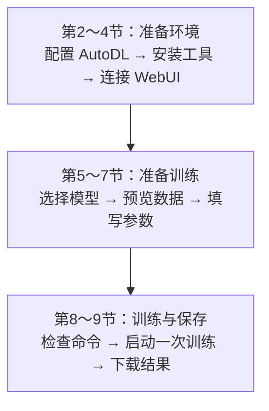

# LLaMA-Factory 环境搭建与微调实战

------

**本章课程目标：**

- 能按顺序完成环境准备、页面连接、数据登记、参数配置、训练启动与结果保存，分清本机和远端的职责。
- 能检查 GPU 实际计算、数据预览与模型模板配置，判断是否具备启动训练的条件。
- 能把 WebUI 设置对应到 YAML 和日志，解释独立验证集、批次与训练方式等关键设置。
- 能观察训练进度，区分页面连接故障与训练中断，并根据日志和状态选择检查点。
- 能整理 Adapter、配置、数据版本与实验记录，检查备份完整性，分清推理加载与完整续训所需材料。

**学习建议：** 按正文顺序完成“准备环境 → 连接页面 → 登记并预览数据 → 配置训练 → 启动并观察 → 保存结果”。每一步先说明正在操作本机还是远端，再核对完成标志；例如看见 GPU 后还要运行 Python 计算检查，上传数据后还要预览。先用主线题复述正常流程，再处理连接、检查点与恢复问题，最后填写第 9.5 节实验记录。

------

## 1、实验任务与环境

第 2 章已经准备好关键词训练数据，第 3 章也解释了怎样设置训练参数。本章把这些文件和参数交给训练工具，得到一份能在下一章加载的 LoRA Adapter。

本章使用 **AutoDL + LLaMA-Factory**：AutoDL 提供带 GPU 的远程机器，LLaMA-Factory 提供训练程序和 WebUI（浏览器操作页面）。你在自己电脑的浏览器里填写参数，真正的模型下载和训练都在 AutoDL 实例中完成。



本机与 AutoDL 实例的分工如下：

| 位置        | 本章的工作                             | 命令在哪里执行                           |
| ----------- | -------------------------------------- | ---------------------------------------- |
| 自己的电脑  | 打开控制台和训练页面，保存资料备份     | 数据清洗在本机完成；SSH 隧道也在本机建立 |
| AutoDL 实例 | 安装工具、下载模型、读取数据、执行训练 | JupyterLab 终端                          |

后文的 `/root/autodl-tmp` 是 **AutoDL 实例内的数据盘目录**，相关命令在 JupyterLab 终端执行。

------

## 2、AutoDL 实例配置

第 7 章的 AutoDL 部署操作已经介绍过这个平台。本章在 AutoDL 算力市场创建单卡实例，完成 Qwen3-0.6B 的 LoRA 训练。

**如果已经有可用实例，不需要另外租赁。** 先对照下面的配置，再从第 2.5 节进入 JupyterLab。只有尚未准备实例的读者，才需要完成创建步骤。

### 2.1 单卡与显存选择

下面这组硬件和环境用于本章的 `keywords-clean` 训练。先准备实例与工具，再上传第 2 章清洗、划分后的数据。

| 项目             | 示例环境                                | 跟做时看什么                                      |
| ---------------- | --------------------------------------- | ------------------------------------------------- |
| GPU 数量         | 1 张                                    | 不需要多卡                                        |
| GPU 型号 / 显存  | Tesla V100-PCIE-32GB / 32 GB            | AutoDL 页面显示为 V100-32GB，终端再确认完整型号   |
| 数据盘           | 50 GB 起步                              | 存放训练工具、数据和输出；模型缓存位置见第 2.5 节 |
| 创建时的基础镜像 | PyTorch 2.8.0 / Python 3.12 / CUDA 12.8 | 这是安装起点，不等于最终训练环境                  |
| 最终训练环境     | Python 3.12.3、PyTorch 2.14.0+cu126     | 第 3 节解释安装与实际计算检查                     |
| 训练计算类型     | FP16                                    | V100 跟做使用 FP16                                |

示例显卡有 32 GB 显存；选择显卡时还要结合样本长度、batch 和工具版本估算实际占用。

使用已有的 RTX 3090、RTX 4090 或其他显卡时，先按第 3.4 节检查实际计算是否可用，再填写训练参数。

第 5 章会沿用这台机器检查回答和导出模型；若继续部署 vLLM 服务，还需按该章核对显卡兼容性，并使用独立的推理环境。

### 2.2 地区与主机选择

在市场页切换地区，选择有空闲卡的主机，将实际租用数量设为 **1 张**，并检查最终费用。


读图时按这个顺序检查：

1. 顶部的 **GPU 型号** 和 **GPU 数量**：本课程第一轮只需要 1 张卡；
2. 实例卡标题中的显存：图中 `V100-32GB / 32 GB` 表示单卡显存为 32 GB；
3. “硬盘”区域中的 **数据盘**：图中为 50 GB，用于存放训练工具、数据和训练产物；
4. “其它”区域中的 **CUDA 版本**：这是主机环境信息，随后仍需进入创建页选择镜像，并检查虚拟环境实际使用的 PyTorch/CUDA。

> 图中以 V100 为例说明选择位置；库存、价格和空闲卡数量会变化，租用时以控制台为准。

<details style="-webkit-font-smoothing: antialiased; -webkit-tap-highlight-color: rgba(221, 220, 217, 0); text-size-adjust: none; box-sizing: border-box; font-size: 15px; color: rgb(163, 182, 197); font-family: &quot;Source Sans Pro&quot;, &quot;Helvetica Neue&quot;, Arial, sans-serif; font-style: normal; font-variant-ligatures: normal; font-variant-caps: normal; font-weight: 400; letter-spacing: normal; orphans: 2; text-align: start; text-indent: 0px; text-transform: none; widows: 2; word-spacing: 0px; -webkit-text-stroke-width: 0px; white-space: normal; background-color: rgb(34, 36, 37); text-decoration-thickness: initial; text-decoration-style: initial; text-decoration-color: initial;"><summary style="-webkit-font-smoothing: antialiased; -webkit-tap-highlight-color: rgba(221, 220, 217, 0); text-size-adjust: none; box-sizing: border-box;">选读：关机后可能没有空闲 GPU，怎样提前考虑</summary><p style="-webkit-font-smoothing: antialiased; -webkit-tap-highlight-color: rgba(221, 220, 217, 0); text-size-adjust: none; box-sizing: border-box; margin: 1.2em 0px; line-height: 1.6rem; word-spacing: 0.05rem;">关机后，主机上的 GPU 可能被其他人租用，影响下次带卡开机。选主机时可参考剩余卡数，但空闲卡不会自动为你保留。若暂时把市场页的数量筛选调到 2 或 4 来查看资源较多的主机，进入创建页后须将实际租用数量改回 1，并核对费用。</p></details>

### 2.3 数据盘与基础镜像

镜像是预装了部分软件的环境起点；第 3 节会另建 `.venv`，安装并检查实际训练依赖。点击“可租”进入实例配置页，按下图选择单卡、50 GB 数据盘和基础镜像。AutoDL 基础镜像说明


对照截图，先找出下面四个位置：

| 页面区域 | 截图中的配置                            | 跟做时注意什么                                         |
| -------- | --------------------------------------- | ------------------------------------------------------ |
| 选择主机 | `V100-32GB`，单卡 32 GB                 | V100 跟做选择 FP16，并检查 PyTorch 是否包含 sm_70 内核 |
| GPU 数量 | 1                                       | 先以单卡跑通完整流程，不提前引入多卡变量               |
| 数据盘   | 免费 50 GB SSD                          | 存放 LLaMA-Factory、数据与训练输出                     |
| 基础镜像 | PyTorch 2.8.0 / Python 3.12 / CUDA 12.8 | 镜像与虚拟环境的版本可能不同，安装后按第 3 节检查      |

确认配置无误后，到页面底部点击“创建并开机”。

### 2.4 无卡模式

下载模型、上传文件时，GPU 往往没有参与工作。如果这些准备要花较长时间，可以使用 AutoDL 的**无卡模式**降低准备阶段的费用：

1. 在控制台找到刚创建的实例，确认没有正在执行的任务后关机。
2. 对**同一个实例**选择“无卡模式开机”。
3. 打开 JupyterLab，完成第 3 节的环境安装，再按第 5.1 节提前下载模型、按第 6 节上传数据；这些工作不需要 GPU。
4. 等待下载、安装任务完成并保存文件，再将这个实例关机。
5. 对同一个实例选择正常开机，重新打开终端并激活环境，然后检查 GPU、开始训练。

实例处于“已关机”状态时，在右侧点击“更多”，再选择“无卡模式开机”：


随后会弹出确认框，明确显示无 GPU、CPU 与内存配置，以及按小时计费的提示：


> 截图中的费用、实例编号和停机时间只代表截图时的页面状态。无卡模式适合做准备工作；需要训练或查看 GPU 显存时，必须回到带 GPU 的开机方式。

无卡模式并非免费，而且 CPU、内存配置也会降低。它适合文件准备，不适合本课程的 GPU 训练、vLLM 服务，也不适合需要大量内存或编译 CUDA 扩展的安装任务。遇到这类安装需求，就恢复正常开机再做。

### 2.5 JupyterLab 与工作目录

实例开机后，在 AutoDL 控制台的“快捷工具”中点击 **JupyterLab**。进入后点击文件面板上方的 **+\**，在启动页的“其他”区域选择 \**终端**。


接下来的安装命令都在这个远端终端中执行：

```bash
cd /root/autodl-tmp
pwd
df -h .
```

预期第一行输出：

```text
/root/autodl-tmp
```

这里是课程的工作根目录，用于存放 LLaMA-Factory 源码、数据、训练输出和导出模型。Qwen3-0.6B 的下载示例使用 ModelScope 默认缓存 `/root/.cache/modelscope/`，位于系统盘；下载前检查剩余空间，需要改放数据盘时参考第 5.3 节。

下面是数据盘检查的实际输出。第一行是当前目录；表格最后一列是挂载点，两处都应为 `/root/autodl-tmp`。`Avail` 表示剩余可用空间，图中为 39G，自己的实例以实际读数为准。


```text
/root/autodl-tmp/
├── LLaMA-Factory/            # 第 3 节克隆的训练工具
│   ├── data/keywords-clean/ # 第 6 节上传的数据与独立登记文件
│   └── saves/                 # 本章产生的 Adapter、日志和 checkpoint
├── models/                    # 可选：从缓存移到数据盘的基础模型
└── exports/                   # 第 5 章导出的完整模型
```

> 检查点和导出模型会持续占用磁盘，放到数据盘便于管理。数据盘中的重要结果还要下载到本机；“保存系统镜像”不会自动打包数据盘内容。AutoDL 磁盘说明

------

## 3、LLaMA-Factory 安装

### 3.1 源码下载与版本选择

下面命令都在 **AutoDL 的 JupyterLab 终端**执行。先进入数据盘，克隆源码：

```bash
cd /root/autodl-tmp
git clone --depth 1 https://github.com/hiyouga/LLaMA-Factory.git
cd LLaMA-Factory
git fetch --depth 1 origin dced5f8804bfbf7109ef7c14401db6bd5cce7e53
git checkout --detach dced5f8804bfbf7109ef7c14401db6bd5cce7e53
```

最后两条命令把**新克隆的仓库**固定到课程使用的源码版本，便于对应页面、参数和示例结果。课程源码版本

<details style="-webkit-font-smoothing: antialiased; -webkit-tap-highlight-color: rgba(221, 220, 217, 0); text-size-adjust: none; box-sizing: border-box; font-size: 15px; color: rgb(163, 182, 197); font-family: &quot;Source Sans Pro&quot;, &quot;Helvetica Neue&quot;, Arial, sans-serif; font-style: normal; font-variant-ligatures: normal; font-variant-caps: normal; font-weight: 400; letter-spacing: normal; orphans: 2; text-align: start; text-indent: 0px; text-transform: none; widows: 2; word-spacing: 0px; -webkit-text-stroke-width: 0px; white-space: normal; background-color: rgb(34, 36, 37); text-decoration-thickness: initial; text-decoration-style: initial; text-decoration-color: initial;"><summary style="-webkit-font-smoothing: antialiased; -webkit-tap-highlight-color: rgba(221, 220, 217, 0); text-size-adjust: none; box-sizing: border-box;">源码下载很慢或出现 TLS 连接错误时</summary><p style="-webkit-font-smoothing: antialiased; -webkit-tap-highlight-color: rgba(221, 220, 217, 0); text-size-adjust: none; box-sizing: border-box; margin: 1.2em 0px; line-height: 1.6rem; word-spacing: 0.05rem;">若 <code style="-webkit-font-smoothing: antialiased; -webkit-tap-highlight-color: rgba(221, 220, 217, 0); text-size-adjust: none; box-sizing: border-box; font-family: &quot;Roboto Mono&quot;, Monaco, courier, monospace; background-color: rgb(38, 40, 41); border-radius: 2px; color: rgb(238, 137, 55); margin: 0px 2px; padding: 3px 5px; white-space: pre-wrap; font-size: 0.8rem;">git clone</code> 下载很慢，或出现 <code style="-webkit-font-smoothing: antialiased; -webkit-tap-highlight-color: rgba(221, 220, 217, 0); text-size-adjust: none; box-sizing: border-box; font-family: &quot;Roboto Mono&quot;, Monaco, courier, monospace; background-color: rgb(38, 40, 41); border-radius: 2px; color: rgb(238, 137, 55); margin: 0px 2px; padding: 3px 5px; white-space: pre-wrap; font-size: 0.8rem;">GnuTLS recv error (-110)</code>、TLS 连接中断，在 AutoDL 的<strong style="-webkit-font-smoothing: antialiased; -webkit-tap-highlight-color: rgba(221, 220, 217, 0); text-size-adjust: none; box-sizing: border-box; color: rgb(163, 182, 197); font-weight: 600;">帮助文档 → 学术资源加速</strong>中查看当前命令，在同一终端执行后重试：</p><pre v-pre="" data-lang="bash" style="-webkit-font-smoothing: antialiased; -webkit-tap-highlight-color: rgba(221, 220, 217, 0); text-size-adjust: none; box-sizing: border-box; font-family: &quot;Roboto Mono&quot;, Monaco, courier, monospace; background-color: rgb(38, 40, 41); margin: 1.2em 0px; position: relative; padding: 0px 1.4rem; line-height: 1.5rem; overflow: auto; overflow-wrap: normal;"><code class="lang-bash" style="-webkit-font-smoothing: initial; -webkit-tap-highlight-color: rgba(221, 220, 217, 0); text-size-adjust: none; box-sizing: border-box; font-family: &quot;Roboto Mono&quot;, Monaco, courier, monospace; background-color: inherit; border-radius: 2px; color: rgb(175, 169, 161); margin: 0px 2px; padding: 2.2em 5px; white-space: inherit; display: block; font-size: 0.8rem; line-height: inherit; max-width: inherit; overflow: inherit;">source /etc/network_turbo</code><button class="docsify-copy-code-button" style="-webkit-font-smoothing: antialiased; -webkit-tap-highlight-color: rgba(221, 220, 217, 0); text-size-adjust: none; box-sizing: border-box; cursor: pointer; transition: 0.25s; position: absolute; z-index: 1; top: 0px; right: 0px; overflow: visible; padding: 0.65em 0.8em; border: 0px; border-radius: 0px; outline: 0px; font-size: 1em; background: none 0% 0% / auto repeat scroll padding-box border-box rgb(18, 155, 75); color: rgb(222, 220, 217); opacity: 0;"><span class="label" style="-webkit-font-smoothing: antialiased; -webkit-tap-highlight-color: rgba(221, 220, 217, 0); text-size-adjust: none; box-sizing: border-box; cursor: pointer; transition: 0.25s; border-radius: 3px; background: inherit; pointer-events: none;">复制</span><span class="error" style="-webkit-font-smoothing: antialiased; -webkit-tap-highlight-color: rgba(221, 220, 217, 0); text-size-adjust: none; box-sizing: border-box; cursor: pointer; transition: 0.25s; border-radius: 3px; background: inherit; pointer-events: none; position: absolute; z-index: -100; top: 19.75px; right: 0px; padding: 0.5em 0.65em; font-size: 0.825em; opacity: 0; transform: translateY(-50%);">错误</span><span class="success" style="-webkit-font-smoothing: antialiased; -webkit-tap-highlight-color: rgba(221, 220, 217, 0); text-size-adjust: none; box-sizing: border-box; cursor: pointer; transition: 0.25s; border-radius: 3px; background: inherit; pointer-events: none; position: absolute; z-index: -100; top: 19.75px; right: 0px; padding: 0.5em 0.65em; font-size: 0.825em; opacity: 0; transform: translateY(-50%);">已复制</span></button></pre><p style="-webkit-font-smoothing: antialiased; -webkit-tap-highlight-color: rgba(221, 220, 217, 0); text-size-adjust: none; box-sizing: border-box; margin: 1.2em 0px; line-height: 1.6rem; word-spacing: 0.05rem;">设置会影响当前终端及它启动的程序，不会自动应用到其他终端。不再需要加速时，在同一终端关闭：</p><pre v-pre="" data-lang="bash" style="-webkit-font-smoothing: antialiased; -webkit-tap-highlight-color: rgba(221, 220, 217, 0); text-size-adjust: none; box-sizing: border-box; font-family: &quot;Roboto Mono&quot;, Monaco, courier, monospace; background-color: rgb(38, 40, 41); margin: 1.2em 0px; position: relative; padding: 0px 1.4rem; line-height: 1.5rem; overflow: auto; overflow-wrap: normal;"><code class="lang-bash" style="-webkit-font-smoothing: initial; -webkit-tap-highlight-color: rgba(221, 220, 217, 0); text-size-adjust: none; box-sizing: border-box; font-family: &quot;Roboto Mono&quot;, Monaco, courier, monospace; background-color: inherit; border-radius: 2px; color: rgb(175, 169, 161); margin: 0px 2px; padding: 2.2em 5px; white-space: inherit; display: block; font-size: 0.8rem; line-height: inherit; max-width: inherit; overflow: inherit;">unset http_proxy https_proxy</code><button class="docsify-copy-code-button" style="-webkit-font-smoothing: antialiased; -webkit-tap-highlight-color: rgba(221, 220, 217, 0); text-size-adjust: none; box-sizing: border-box; cursor: pointer; transition: 0.25s; position: absolute; z-index: 1; top: 0px; right: 0px; overflow: visible; padding: 0.65em 0.8em; border: 0px; border-radius: 0px; outline: 0px; font-size: 1em; background: none 0% 0% / auto repeat scroll padding-box border-box rgb(18, 155, 75); color: rgb(222, 220, 217); opacity: 0;"><span class="label" style="-webkit-font-smoothing: antialiased; -webkit-tap-highlight-color: rgba(221, 220, 217, 0); text-size-adjust: none; box-sizing: border-box; cursor: pointer; transition: 0.25s; border-radius: 3px; background: inherit; pointer-events: none;">复制</span><span class="error" style="-webkit-font-smoothing: antialiased; -webkit-tap-highlight-color: rgba(221, 220, 217, 0); text-size-adjust: none; box-sizing: border-box; cursor: pointer; transition: 0.25s; border-radius: 3px; background: inherit; pointer-events: none; position: absolute; z-index: -100; top: 19.75px; right: 0px; padding: 0.5em 0.65em; font-size: 0.825em; opacity: 0; transform: translateY(-50%);">错误</span><span class="success" style="-webkit-font-smoothing: antialiased; -webkit-tap-highlight-color: rgba(221, 220, 217, 0); text-size-adjust: none; box-sizing: border-box; cursor: pointer; transition: 0.25s; border-radius: 3px; background: inherit; pointer-events: none; position: absolute; z-index: -100; top: 19.75px; right: 0px; padding: 0.5em 0.65em; font-size: 0.825em; opacity: 0; transform: translateY(-50%);">已复制</span></button></pre><p style="-webkit-font-smoothing: antialiased; -webkit-tap-highlight-color: rgba(221, 220, 217, 0); text-size-adjust: none; box-sizing: border-box; margin: 1.2em 0px; line-height: 1.6rem; word-spacing: 0.05rem;">支持的站点和当前命令以 <a href="https://www.autodl.com/docs/network_turbo/" target="_blank" rel="noopener" style="color: rgb(77, 240, 144); -webkit-font-smoothing: antialiased; -webkit-tap-highlight-color: rgba(221, 220, 217, 0); text-size-adjust: none; box-sizing: border-box; font-weight: 600;">AutoDL 学术资源加速说明</a>为准。</p></details>

### 3.2 项目目录与配置文件

克隆完成后，在 JupyterLab 左侧打开 `LLaMA-Factory/`。本章主要使用以下位置，其中课程数据、环境和训练结果会在后续步骤中创建：

```text
LLaMA-Factory/
├── data/keywords-clean/   第 6 节上传的课程数据与独立登记文件
├── .venv/                第 3.3 节创建的 Python 环境
└── saves/                训练生成的 Adapter、日志和检查点
```

**训练设置也可以保存在 YAML 文本文件中。** 打开本机课程附带的 `案例与源码-4-微调/configs/keywords_clean_train.yaml`，其中使用的是本章的 Qwen3-0.6B、关键词数据和 FP16 配置。下面摘出几项，加上中文注释：

```yaml
# 训练阶段：SFT（监督微调），用输入和参考答案训练模型
stage: sft

# 微调方式：采用 LoRA，只训练新增的少量参数
finetuning_type: lora

# LoRA 的秩：设为 8，这个值会影响新增可训练参数的数量
lora_rank: 8

# 对话模板：使用 Qwen3 的非思考模式模板组织输入
template: qwen3_nothink

# 截断长度：每条训练样本的长度上限为 2048 个 token，包含输入和答案
cutoff_len: 2048

# 梯度累积步数：累积 8 个小批次的梯度后，再更新一次参数
gradient_accumulation_steps: 8
```

例如，`lora_rank: 8` 对应 WebUI 中的“LoRA 秩 8”。第 5～7 节会在页面填写这些设置，第 8.1 节再查看它们转换成的训练参数；选择命令行方式时，第 8.3 节会上传并使用这份课程 YAML。

<details style="-webkit-font-smoothing: antialiased; -webkit-tap-highlight-color: rgba(221, 220, 217, 0); text-size-adjust: none; box-sizing: border-box; font-size: 15px; color: rgb(163, 182, 197); font-family: &quot;Source Sans Pro&quot;, &quot;Helvetica Neue&quot;, Arial, sans-serif; font-style: normal; font-variant-ligatures: normal; font-variant-caps: normal; font-weight: 400; letter-spacing: normal; orphans: 2; text-align: start; text-indent: 0px; text-transform: none; widows: 2; word-spacing: 0px; -webkit-text-stroke-width: 0px; white-space: normal; background-color: rgb(34, 36, 37); text-decoration-thickness: initial; text-decoration-style: initial; text-decoration-color: initial;"><summary style="-webkit-font-smoothing: antialiased; -webkit-tap-highlight-color: rgba(221, 220, 217, 0); text-size-adjust: none; box-sizing: border-box;">选读：工具源码、官方示例与依赖清单</summary><p style="-webkit-font-smoothing: antialiased; -webkit-tap-highlight-color: rgba(221, 220, 217, 0); text-size-adjust: none; box-sizing: border-box; margin: 1.2em 0px; line-height: 1.6rem; word-spacing: 0.05rem;">在 JupyterLab 的项目文件面板中，<code style="-webkit-font-smoothing: antialiased; -webkit-tap-highlight-color: rgba(221, 220, 217, 0); text-size-adjust: none; box-sizing: border-box; font-family: &quot;Roboto Mono&quot;, Monaco, courier, monospace; background-color: rgb(38, 40, 41); border-radius: 2px; color: rgb(238, 137, 55); margin: 0px 2px; padding: 3px 5px; white-space: pre-wrap; font-size: 0.8rem;">src/</code> 存程序源码，<code style="-webkit-font-smoothing: antialiased; -webkit-tap-highlight-color: rgba(221, 220, 217, 0); text-size-adjust: none; box-sizing: border-box; font-family: &quot;Roboto Mono&quot;, Monaco, courier, monospace; background-color: rgb(38, 40, 41); border-radius: 2px; color: rgb(238, 137, 55); margin: 0px 2px; padding: 3px 5px; white-space: pre-wrap; font-size: 0.8rem;">examples/</code> 存训练、推理和合并示例，<code style="-webkit-font-smoothing: antialiased; -webkit-tap-highlight-color: rgba(221, 220, 217, 0); text-size-adjust: none; box-sizing: border-box; font-family: &quot;Roboto Mono&quot;, Monaco, courier, monospace; background-color: rgb(38, 40, 41); border-radius: 2px; color: rgb(238, 137, 55); margin: 0px 2px; padding: 3px 5px; white-space: pre-wrap; font-size: 0.8rem;">requirements/</code> 存可选依赖清单：</p><p style="-webkit-font-smoothing: antialiased; -webkit-tap-highlight-color: rgba(221, 220, 217, 0); text-size-adjust: none; box-sizing: border-box; margin: 1.2em 0px; line-height: 1.6rem; word-spacing: 0.05rem;"></p><p style="-webkit-font-smoothing: antialiased; -webkit-tap-highlight-color: rgba(221, 220, 217, 0); text-size-adjust: none; box-sizing: border-box; margin: 1.2em 0px; line-height: 1.6rem; word-spacing: 0.05rem;">下图打开的是工具自带的 <code style="-webkit-font-smoothing: antialiased; -webkit-tap-highlight-color: rgba(221, 220, 217, 0); text-size-adjust: none; box-sizing: border-box; font-family: &quot;Roboto Mono&quot;, Monaco, courier, monospace; background-color: rgb(38, 40, 41); border-radius: 2px; color: rgb(238, 137, 55); margin: 0px 2px; padding: 3px 5px; white-space: pre-wrap; font-size: 0.8rem;">examples/train_lora/qwen3_lora_sft.yaml</code>。其中使用 <code style="-webkit-font-smoothing: antialiased; -webkit-tap-highlight-color: rgba(221, 220, 217, 0); text-size-adjust: none; box-sizing: border-box; font-family: &quot;Roboto Mono&quot;, Monaco, courier, monospace; background-color: rgb(38, 40, 41); border-radius: 2px; color: rgb(238, 137, 55); margin: 0px 2px; padding: 3px 5px; white-space: pre-wrap; font-size: 0.8rem;">Qwen/Qwen3-4B-Instruct-2507</code>、<code style="-webkit-font-smoothing: antialiased; -webkit-tap-highlight-color: rgba(221, 220, 217, 0); text-size-adjust: none; box-sizing: border-box; font-family: &quot;Roboto Mono&quot;, Monaco, courier, monospace; background-color: rgb(38, 40, 41); border-radius: 2px; color: rgb(238, 137, 55); margin: 0px 2px; padding: 3px 5px; white-space: pre-wrap; font-size: 0.8rem;">identity,alpaca_en_demo</code> 和 BF16，适合参考配置结构；本章运行时使用上面的课程 YAML。<a href="https://github.com/hiyouga/LLaMA-Factory/blob/dced5f8804bfbf7109ef7c14401db6bd5cce7e53/examples/train_lora/qwen3_lora_sft.yaml" target="_blank" rel="noopener" style="color: rgb(77, 240, 144); -webkit-font-smoothing: antialiased; -webkit-tap-highlight-color: rgba(221, 220, 217, 0); text-size-adjust: none; box-sizing: border-box; font-weight: 600;">锁定版本的官方示例</a></p><p style="-webkit-font-smoothing: antialiased; -webkit-tap-highlight-color: rgba(221, 220, 217, 0); text-size-adjust: none; box-sizing: border-box; margin: 1.2em 0px; line-height: 1.6rem; word-spacing: 0.05rem;"></p><p style="-webkit-font-smoothing: antialiased; -webkit-tap-highlight-color: rgba(221, 220, 217, 0); text-size-adjust: none; box-sizing: border-box; margin: 1.2em 0px; line-height: 1.6rem; word-spacing: 0.05rem;">安装时，<code style="-webkit-font-smoothing: antialiased; -webkit-tap-highlight-color: rgba(221, 220, 217, 0); text-size-adjust: none; box-sizing: border-box; font-family: &quot;Roboto Mono&quot;, Monaco, courier, monospace; background-color: rgb(38, 40, 41); border-radius: 2px; color: rgb(238, 137, 55); margin: 0px 2px; padding: 3px 5px; white-space: pre-wrap; font-size: 0.8rem;">uv pip install -e .</code> 读取 <code style="-webkit-font-smoothing: antialiased; -webkit-tap-highlight-color: rgba(221, 220, 217, 0); text-size-adjust: none; box-sizing: border-box; font-family: &quot;Roboto Mono&quot;, Monaco, courier, monospace; background-color: rgb(38, 40, 41); border-radius: 2px; color: rgb(238, 137, 55); margin: 0px 2px; padding: 3px 5px; white-space: pre-wrap; font-size: 0.8rem;">pyproject.toml</code>（<a href="https://github.com/hiyouga/LLaMA-Factory/blob/dced5f8804bfbf7109ef7c14401db6bd5cce7e53/pyproject.toml" target="_blank" rel="noopener" style="color: rgb(77, 240, 144); -webkit-font-smoothing: antialiased; -webkit-tap-highlight-color: rgba(221, 220, 217, 0); text-size-adjust: none; box-sizing: border-box; font-weight: 600;">官方源码</a>）中的 <code style="-webkit-font-smoothing: antialiased; -webkit-tap-highlight-color: rgba(221, 220, 217, 0); text-size-adjust: none; box-sizing: border-box; font-family: &quot;Roboto Mono&quot;, Monaco, courier, monospace; background-color: rgb(38, 40, 41); border-radius: 2px; color: rgb(238, 137, 55); margin: 0px 2px; padding: 3px 5px; white-space: pre-wrap; font-size: 0.8rem;">torch</code>、<code style="-webkit-font-smoothing: antialiased; -webkit-tap-highlight-color: rgba(221, 220, 217, 0); text-size-adjust: none; box-sizing: border-box; font-family: &quot;Roboto Mono&quot;, Monaco, courier, monospace; background-color: rgb(38, 40, 41); border-radius: 2px; color: rgb(238, 137, 55); margin: 0px 2px; padding: 3px 5px; white-space: pre-wrap; font-size: 0.8rem;">transformers</code>、<code style="-webkit-font-smoothing: antialiased; -webkit-tap-highlight-color: rgba(221, 220, 217, 0); text-size-adjust: none; box-sizing: border-box; font-family: &quot;Roboto Mono&quot;, Monaco, courier, monospace; background-color: rgb(38, 40, 41); border-radius: 2px; color: rgb(238, 137, 55); margin: 0px 2px; padding: 3px 5px; white-space: pre-wrap; font-size: 0.8rem;">peft</code> 等基础依赖。额外清单按用途安装：</p><table style="border-color: rgb(89, 95, 97); -webkit-font-smoothing: antialiased; -webkit-tap-highlight-color: rgba(221, 220, 217, 0); text-size-adjust: none; box-sizing: border-box; border-collapse: collapse; border-spacing: 0px; display: block; margin-bottom: 1rem; overflow: auto; width: 1134.8px;"><thead style="-webkit-font-smoothing: antialiased; -webkit-tap-highlight-color: rgba(221, 220, 217, 0); text-size-adjust: none; box-sizing: border-box;"><tr style="-webkit-font-smoothing: antialiased; -webkit-tap-highlight-color: rgba(221, 220, 217, 0); text-size-adjust: none; box-sizing: border-box; border-top: 1px solid rgb(65, 69, 71);"><th style="-webkit-font-smoothing: antialiased; -webkit-tap-highlight-color: rgba(221, 220, 217, 0); text-size-adjust: none; box-sizing: border-box; font-weight: 700; border: 1px solid rgb(65, 69, 71); padding: 6px 13px;">清单</th><th style="-webkit-font-smoothing: antialiased; -webkit-tap-highlight-color: rgba(221, 220, 217, 0); text-size-adjust: none; box-sizing: border-box; font-weight: 700; border: 1px solid rgb(65, 69, 71); padding: 6px 13px;">锁定版本中的内容</th><th style="-webkit-font-smoothing: antialiased; -webkit-tap-highlight-color: rgba(221, 220, 217, 0); text-size-adjust: none; box-sizing: border-box; font-weight: 700; border: 1px solid rgb(65, 69, 71); padding: 6px 13px;">用途</th></tr></thead><tbody style="-webkit-font-smoothing: antialiased; -webkit-tap-highlight-color: rgba(221, 220, 217, 0); text-size-adjust: none; box-sizing: border-box;"><tr style="-webkit-font-smoothing: antialiased; -webkit-tap-highlight-color: rgba(221, 220, 217, 0); text-size-adjust: none; box-sizing: border-box; border-top: 1px solid rgb(65, 69, 71);"><td style="-webkit-font-smoothing: antialiased; -webkit-tap-highlight-color: rgba(221, 220, 217, 0); text-size-adjust: none; box-sizing: border-box; border: 1px solid rgb(65, 69, 71); padding: 6px 13px;"><code style="-webkit-font-smoothing: antialiased; -webkit-tap-highlight-color: rgba(221, 220, 217, 0); text-size-adjust: none; box-sizing: border-box; font-family: &quot;Roboto Mono&quot;, Monaco, courier, monospace; background-color: rgb(38, 40, 41); border-radius: 2px; color: rgb(238, 137, 55); margin: 0px 2px; padding: 3px 5px; white-space: pre-wrap; font-size: 0.8rem;">requirements/metrics.txt</code>（<a href="https://github.com/hiyouga/LLaMA-Factory/blob/dced5f8804bfbf7109ef7c14401db6bd5cce7e53/requirements/metrics.txt" target="_blank" rel="noopener" style="color: rgb(77, 240, 144); -webkit-font-smoothing: antialiased; -webkit-tap-highlight-color: rgba(221, 220, 217, 0); text-size-adjust: none; box-sizing: border-box; font-weight: 600;">官方源码</a>）</td><td style="-webkit-font-smoothing: antialiased; -webkit-tap-highlight-color: rgba(221, 220, 217, 0); text-size-adjust: none; box-sizing: border-box; border: 1px solid rgb(65, 69, 71); padding: 6px 13px;"><code style="-webkit-font-smoothing: antialiased; -webkit-tap-highlight-color: rgba(221, 220, 217, 0); text-size-adjust: none; box-sizing: border-box; font-family: &quot;Roboto Mono&quot;, Monaco, courier, monospace; background-color: rgb(38, 40, 41); border-radius: 2px; color: rgb(238, 137, 55); margin: 0px 2px; padding: 3px 5px; white-space: pre-wrap; font-size: 0.8rem;">nltk</code>、<code style="-webkit-font-smoothing: antialiased; -webkit-tap-highlight-color: rgba(221, 220, 217, 0); text-size-adjust: none; box-sizing: border-box; font-family: &quot;Roboto Mono&quot;, Monaco, courier, monospace; background-color: rgb(38, 40, 41); border-radius: 2px; color: rgb(238, 137, 55); margin: 0px 2px; padding: 3px 5px; white-space: pre-wrap; font-size: 0.8rem;">jieba</code>、<code style="-webkit-font-smoothing: antialiased; -webkit-tap-highlight-color: rgba(221, 220, 217, 0); text-size-adjust: none; box-sizing: border-box; font-family: &quot;Roboto Mono&quot;, Monaco, courier, monospace; background-color: rgb(38, 40, 41); border-radius: 2px; color: rgb(238, 137, 55); margin: 0px 2px; padding: 3px 5px; white-space: pre-wrap; font-size: 0.8rem;">rouge-chinese</code></td><td style="-webkit-font-smoothing: antialiased; -webkit-tap-highlight-color: rgba(221, 220, 217, 0); text-size-adjust: none; box-sizing: border-box; border: 1px solid rgb(65, 69, 71); padding: 6px 13px;">部分文本评估功能</td></tr><tr style="-webkit-font-smoothing: antialiased; -webkit-tap-highlight-color: rgba(221, 220, 217, 0); text-size-adjust: none; box-sizing: border-box; border-top: 1px solid rgb(65, 69, 71); background-color: rgb(38, 40, 41);"><td style="-webkit-font-smoothing: antialiased; -webkit-tap-highlight-color: rgba(221, 220, 217, 0); text-size-adjust: none; box-sizing: border-box; border: 1px solid rgb(65, 69, 71); padding: 6px 13px;"><code style="-webkit-font-smoothing: antialiased; -webkit-tap-highlight-color: rgba(221, 220, 217, 0); text-size-adjust: none; box-sizing: border-box; font-family: &quot;Roboto Mono&quot;, Monaco, courier, monospace; background-color: rgb(38, 40, 41); border-radius: 2px; color: rgb(238, 137, 55); margin: 0px 2px; padding: 3px 5px; white-space: pre-wrap; font-size: 0.8rem;">requirements/bitsandbytes.txt</code>（<a href="https://github.com/hiyouga/LLaMA-Factory/blob/dced5f8804bfbf7109ef7c14401db6bd5cce7e53/requirements/bitsandbytes.txt" target="_blank" rel="noopener" style="color: rgb(77, 240, 144); -webkit-font-smoothing: antialiased; -webkit-tap-highlight-color: rgba(221, 220, 217, 0); text-size-adjust: none; box-sizing: border-box; font-weight: 600;">官方源码</a>）</td><td style="-webkit-font-smoothing: antialiased; -webkit-tap-highlight-color: rgba(221, 220, 217, 0); text-size-adjust: none; box-sizing: border-box; border: 1px solid rgb(65, 69, 71); padding: 6px 13px;"><code style="-webkit-font-smoothing: antialiased; -webkit-tap-highlight-color: rgba(221, 220, 217, 0); text-size-adjust: none; box-sizing: border-box; font-family: &quot;Roboto Mono&quot;, Monaco, courier, monospace; background-color: rgb(38, 40, 41); border-radius: 2px; color: rgb(238, 137, 55); margin: 0px 2px; padding: 3px 5px; white-space: pre-wrap; font-size: 0.8rem;">bitsandbytes&gt;=0.39.0</code></td><td style="-webkit-font-smoothing: antialiased; -webkit-tap-highlight-color: rgba(221, 220, 217, 0); text-size-adjust: none; box-sizing: border-box; border: 1px solid rgb(65, 69, 71); padding: 6px 13px;">bitsandbytes 量化；本轮不开量化</td></tr></tbody></table></details>

### 3.3 Python 环境与依赖安装

接下来使用 **uv** 创建独立的 Python 环境并安装依赖。先检查它是否可用：

```bash
uv --version
```

如果提示 `uv: command not found`，在当前 AutoDL 终端安装后再检查：

```bash
python -m pip install uv
uv --version
```

这是 uv 支持的 pip 安装方式；已有可用的 uv 时，不必重复安装。uv 安装说明

确认终端仍在 `/root/autodl-tmp/LLaMA-Factory`，再执行：

```bash
uv venv --python 3.12
source .venv/bin/activate
uv pip install -e .
uv pip install -r requirements/metrics.txt
```

`uv pip install -e .` 中的 `.` 表示当前目录，`-e` 表示以可编辑方式安装当前项目；因此要在仓库根目录执行，并保留这里的源码。`metrics.txt` 补充后续部分评估功能用到的依赖。

**使用 V100 跟做时，安装下面的 CUDA 12.6 构建。** 默认软件源可能选到不包含 V100 内核的包。等上面的安装结束后，在同一虚拟环境执行：

```bash
uv pip install --reinstall \
  --index-url https://download.pytorch.org/whl/cu126 \
  torch==2.14.0 torchvision==0.29.0 torchaudio==2.11.0
```

这三个包对应课程的 V100 训练环境。已有可用环境时，先检查版本，不必重复安装；准备完成后，按第 3.4 节实际执行一次小矩阵计算。

等待安装命令结束、终端重新出现可以输入命令的提示符后，再进入下一步。还在下载包时不要另外开一份安装进程。

每次新开终端时，都要重新进入项目、激活已有环境，让当前终端使用项目的 Python 和依赖：

```bash
cd /root/autodl-tmp/LLaMA-Factory
source .venv/bin/activate
```

提示符可能显示 `(LLaMA-Factory)`，不一定直接显示 `.venv`；下一节会用 Python 的实际路径确认。

<details style="-webkit-font-smoothing: antialiased; -webkit-tap-highlight-color: rgba(221, 220, 217, 0); text-size-adjust: none; box-sizing: border-box; font-size: 15px; color: rgb(163, 182, 197); font-family: &quot;Source Sans Pro&quot;, &quot;Helvetica Neue&quot;, Arial, sans-serif; font-style: normal; font-variant-ligatures: normal; font-variant-caps: normal; font-weight: 400; letter-spacing: normal; orphans: 2; text-align: start; text-indent: 0px; text-transform: none; widows: 2; word-spacing: 0px; -webkit-text-stroke-width: 0px; white-space: normal; background-color: rgb(34, 36, 37); text-decoration-thickness: initial; text-decoration-style: initial; text-decoration-color: initial;"><summary style="-webkit-font-smoothing: antialiased; -webkit-tap-highlight-color: rgba(221, 220, 217, 0); text-size-adjust: none; box-sizing: border-box;">下载很慢或中断时，怎样重试安装</summary><p style="-webkit-font-smoothing: antialiased; -webkit-tap-highlight-color: rgba(221, 220, 217, 0); text-size-adjust: none; box-sizing: border-box; margin: 1.2em 0px; line-height: 1.6rem; word-spacing: 0.05rem;">第一次执行 <code style="-webkit-font-smoothing: antialiased; -webkit-tap-highlight-color: rgba(221, 220, 217, 0); text-size-adjust: none; box-sizing: border-box; font-family: &quot;Roboto Mono&quot;, Monaco, courier, monospace; background-color: rgb(38, 40, 41); border-radius: 2px; color: rgb(238, 137, 55); margin: 0px 2px; padding: 3px 5px; white-space: pre-wrap; font-size: 0.8rem;">uv pip install -e .</code> 时，<code style="-webkit-font-smoothing: antialiased; -webkit-tap-highlight-color: rgba(221, 220, 217, 0); text-size-adjust: none; box-sizing: border-box; font-family: &quot;Roboto Mono&quot;, Monaco, courier, monospace; background-color: rgb(38, 40, 41); border-radius: 2px; color: rgb(238, 137, 55); margin: 0px 2px; padding: 3px 5px; white-space: pre-wrap; font-size: 0.8rem;">uv</code> 会先解析依赖，再下载 PyTorch、NVIDIA CUDA 等较大的安装包。即使速度较慢，只要进度条、已下载大小或“Preparing packages”的数量仍在变化，就说明命令还在工作，先等待当前命令结束。</p><p style="-webkit-font-smoothing: antialiased; -webkit-tap-highlight-color: rgba(221, 220, 217, 0); text-size-adjust: none; box-sizing: border-box; margin: 1.2em 0px; line-height: 1.6rem; word-spacing: 0.05rem;">前面执行的 <code style="-webkit-font-smoothing: antialiased; -webkit-tap-highlight-color: rgba(221, 220, 217, 0); text-size-adjust: none; box-sizing: border-box; font-family: &quot;Roboto Mono&quot;, Monaco, courier, monospace; background-color: rgb(38, 40, 41); border-radius: 2px; color: rgb(238, 137, 55); margin: 0px 2px; padding: 3px 5px; white-space: pre-wrap; font-size: 0.8rem;">source /etc/network_turbo</code> 主要用于 GitHub、Hugging Face 等学术资源访问，不能据此认为 PyPI 下载一定加速。<a href="https://www.autodl.com/docs/network_turbo/" target="_blank" rel="noopener" style="color: rgb(77, 240, 144); -webkit-font-smoothing: antialiased; -webkit-tap-highlight-color: rgba(221, 220, 217, 0); text-size-adjust: none; box-sizing: border-box; font-weight: 600;">AutoDL 的说明</a>也明确列出了它覆盖的站点范围。</p><p style="-webkit-font-smoothing: antialiased; -webkit-tap-highlight-color: rgba(221, 220, 217, 0); text-size-adjust: none; box-sizing: border-box; margin: 1.2em 0px; line-height: 1.6rem; word-spacing: 0.05rem;">如果下载总量连续几分钟完全不再增长，或终端已经报出网络错误，再按 <code style="-webkit-font-smoothing: antialiased; -webkit-tap-highlight-color: rgba(221, 220, 217, 0); text-size-adjust: none; box-sizing: border-box; font-family: &quot;Roboto Mono&quot;, Monaco, courier, monospace; background-color: rgb(38, 40, 41); border-radius: 2px; color: rgb(238, 137, 55); margin: 0px 2px; padding: 3px 5px; white-space: pre-wrap; font-size: 0.8rem;">Ctrl+C</code> 结束这一次安装。在<strong style="-webkit-font-smoothing: antialiased; -webkit-tap-highlight-color: rgba(221, 220, 217, 0); text-size-adjust: none; box-sizing: border-box; color: rgb(163, 182, 197); font-weight: 600;">同一个已经激活 <code style="-webkit-font-smoothing: antialiased; -webkit-tap-highlight-color: rgba(221, 220, 217, 0); text-size-adjust: none; box-sizing: border-box; font-family: &quot;Roboto Mono&quot;, Monaco, courier, monospace; background-color: rgb(38, 40, 41); border-radius: 2px; color: rgb(238, 137, 55); margin: 0px 2px; padding: 3px 5px; white-space: pre-wrap; font-size: 0.8rem;">.venv</code> 的终端</strong>中，临时改用 PyPI 镜像后重新执行下面两条安装命令：</p><pre v-pre="" data-lang="bash" style="-webkit-font-smoothing: antialiased; -webkit-tap-highlight-color: rgba(221, 220, 217, 0); text-size-adjust: none; box-sizing: border-box; font-family: &quot;Roboto Mono&quot;, Monaco, courier, monospace; background-color: rgb(38, 40, 41); margin: 1.2em 0px; position: relative; padding: 0px 1.4rem; line-height: 1.5rem; overflow: auto; overflow-wrap: normal;"><code class="lang-bash" style="-webkit-font-smoothing: initial; -webkit-tap-highlight-color: rgba(221, 220, 217, 0); text-size-adjust: none; box-sizing: border-box; font-family: &quot;Roboto Mono&quot;, Monaco, courier, monospace; background-color: inherit; border-radius: 2px; color: rgb(175, 169, 161); margin: 0px 2px; padding: 2.2em 5px; white-space: inherit; display: block; font-size: 0.8rem; line-height: inherit; max-width: inherit; overflow: inherit;">source /etc/network_turbo
UV_DEFAULT_INDEX="https://mirrors.tuna.tsinghua.edu.cn/pypi/web/simple/" \
  uv pip install -e .UV_DEFAULT_INDEX="https://mirrors.tuna.tsinghua.edu.cn/pypi/web/simple/" \
  uv pip install -r requirements/metrics.txt</code><button class="docsify-copy-code-button" style="-webkit-font-smoothing: antialiased; -webkit-tap-highlight-color: rgba(221, 220, 217, 0); text-size-adjust: none; box-sizing: border-box; cursor: pointer; transition: 0.25s; position: absolute; z-index: 1; top: 0px; right: 0px; overflow: visible; padding: 0.65em 0.8em; border: 0px; border-radius: 0px; outline: 0px; font-size: 1em; background: none 0% 0% / auto repeat scroll padding-box border-box rgb(18, 155, 75); color: rgb(222, 220, 217); opacity: 0;"><span class="label" style="-webkit-font-smoothing: antialiased; -webkit-tap-highlight-color: rgba(221, 220, 217, 0); text-size-adjust: none; box-sizing: border-box; cursor: pointer; transition: 0.25s; border-radius: 3px; background: inherit; pointer-events: none;">复制</span><span class="error" style="-webkit-font-smoothing: antialiased; -webkit-tap-highlight-color: rgba(221, 220, 217, 0); text-size-adjust: none; box-sizing: border-box; cursor: pointer; transition: 0.25s; border-radius: 3px; background: inherit; pointer-events: none; position: absolute; z-index: -100; top: 19.75px; right: 0px; padding: 0.5em 0.65em; font-size: 0.825em; opacity: 0; transform: translateY(-50%);">错误</span><span class="success" style="-webkit-font-smoothing: antialiased; -webkit-tap-highlight-color: rgba(221, 220, 217, 0); text-size-adjust: none; box-sizing: border-box; cursor: pointer; transition: 0.25s; border-radius: 3px; background: inherit; pointer-events: none; position: absolute; z-index: -100; top: 19.75px; right: 0px; padding: 0.5em 0.65em; font-size: 0.825em; opacity: 0; transform: translateY(-50%);">已复制</span></button></pre><p style="-webkit-font-smoothing: antialiased; -webkit-tap-highlight-color: rgba(221, 220, 217, 0); text-size-adjust: none; box-sizing: border-box; margin: 1.2em 0px; line-height: 1.6rem; word-spacing: 0.05rem;"><code style="-webkit-font-smoothing: antialiased; -webkit-tap-highlight-color: rgba(221, 220, 217, 0); text-size-adjust: none; box-sizing: border-box; font-family: &quot;Roboto Mono&quot;, Monaco, courier, monospace; background-color: rgb(38, 40, 41); border-radius: 2px; color: rgb(238, 137, 55); margin: 0px 2px; padding: 3px 5px; white-space: pre-wrap; font-size: 0.8rem;">UV_DEFAULT_INDEX</code> 只对紧随其后的那一条命令生效，不会改写系统的全局软件源；这是 <code style="-webkit-font-smoothing: antialiased; -webkit-tap-highlight-color: rgba(221, 220, 217, 0); text-size-adjust: none; box-sizing: border-box; font-family: &quot;Roboto Mono&quot;, Monaco, courier, monospace; background-color: rgb(38, 40, 41); border-radius: 2px; color: rgb(238, 137, 55); margin: 0px 2px; padding: 3px 5px; white-space: pre-wrap; font-size: 0.8rem;">uv</code> 官方支持的默认索引环境变量。镜像在某些网络环境下可能更快，但不保证始终更快；清华镜像站也提供了对应的 PyPI 与 <code style="-webkit-font-smoothing: antialiased; -webkit-tap-highlight-color: rgba(221, 220, 217, 0); text-size-adjust: none; box-sizing: border-box; font-family: &quot;Roboto Mono&quot;, Monaco, courier, monospace; background-color: rgb(38, 40, 41); border-radius: 2px; color: rgb(238, 137, 55); margin: 0px 2px; padding: 3px 5px; white-space: pre-wrap; font-size: 0.8rem;">uv</code> 配置说明。<a href="https://docs.astral.sh/uv/configuration/environment/" target="_blank" rel="noopener" style="color: rgb(77, 240, 144); -webkit-font-smoothing: antialiased; -webkit-tap-highlight-color: rgba(221, 220, 217, 0); text-size-adjust: none; box-sizing: border-box; font-weight: 600;">uv 环境变量说明</a>；<a href="https://mirrors.tuna.tsinghua.edu.cn/help/pypi/" target="_blank" rel="noopener" style="color: rgb(77, 240, 144); -webkit-font-smoothing: antialiased; -webkit-tap-highlight-color: rgba(221, 220, 217, 0); text-size-adjust: none; box-sizing: border-box; font-weight: 600;">清华 PyPI 镜像说明</a>。</p><p style="-webkit-font-smoothing: antialiased; -webkit-tap-highlight-color: rgba(221, 220, 217, 0); text-size-adjust: none; box-sizing: border-box; margin: 1.2em 0px; line-height: 1.6rem; word-spacing: 0.05rem;">不要为了“快一点”加 <code style="-webkit-font-smoothing: antialiased; -webkit-tap-highlight-color: rgba(221, 220, 217, 0); text-size-adjust: none; box-sizing: border-box; font-family: &quot;Roboto Mono&quot;, Monaco, courier, monospace; background-color: rgb(38, 40, 41); border-radius: 2px; color: rgb(238, 137, 55); margin: 0px 2px; padding: 3px 5px; white-space: pre-wrap; font-size: 0.8rem;">--no-deps</code>，也不要删除已经创建的 <code style="-webkit-font-smoothing: antialiased; -webkit-tap-highlight-color: rgba(221, 220, 217, 0); text-size-adjust: none; box-sizing: border-box; font-family: &quot;Roboto Mono&quot;, Monaco, courier, monospace; background-color: rgb(38, 40, 41); border-radius: 2px; color: rgb(238, 137, 55); margin: 0px 2px; padding: 3px 5px; white-space: pre-wrap; font-size: 0.8rem;">.venv</code>；前者会漏装训练所需依赖。更不要让两条 <code style="-webkit-font-smoothing: antialiased; -webkit-tap-highlight-color: rgba(221, 220, 217, 0); text-size-adjust: none; box-sizing: border-box; font-family: &quot;Roboto Mono&quot;, Monaco, courier, monospace; background-color: rgb(38, 40, 41); border-radius: 2px; color: rgb(238, 137, 55); margin: 0px 2px; padding: 3px 5px; white-space: pre-wrap; font-size: 0.8rem;">uv pip install</code> 命令同时运行，它们会争用网络、缓存和磁盘，反而更难判断进度。</p></details>


### 3.4 版本与 GPU 计算检查

先确认实例已经带卡开机。在 **AutoDL 终端**进入项目、激活环境后，执行：

```bash
llamafactory-cli version
git rev-parse HEAD
nvidia-smi
```

前两条分别查看工具版本和源码提交；第三条查看 GPU 型号、显存与当前占用。课程使用工具版本 `0.9.6.dev0`、源码提交 `dced5f8804bfbf7109ef7c14401db6bd5cce7e53`。


图中的 `Tesla V100-PCIE-32GB` 与控制台的 V100-32GB 对应，`32768 MiB` 是显存容量。

**看见显卡以后，还要确认当前 Python 能用它计算。** 把下面整段复制到同一个终端执行。它只做一次小矩阵乘法，不加载模型，也不训练：

```bash
python - <<'PY'
import sys
import torch

print("Python 路径:", sys.executable)
print("Python 版本:", sys.version.split()[0])
print("PyTorch 版本:", torch.__version__)
print("PyTorch 构建使用的 CUDA:", torch.version.cuda)
assert torch.cuda.is_available(), "当前环境未发现可用 GPU，请先检查开机模式与安装结果"
print("GPU 型号:", torch.cuda.get_device_name(0))
print("GPU 计算能力:", torch.cuda.get_device_capability(0))
print("编译的 GPU 架构:", torch.cuda.get_arch_list())
x = torch.randn((1024, 1024), device="cuda", dtype=torch.float16)
y = x @ x
torch.cuda.synchronize()
print("计算完成，结果设备:", y.device)
PY
```

跟做时核对下面几项：

| 检查项              | 示例环境的结果               | 说明                                        |
| ------------------- | ---------------------------- | ------------------------------------------- |
| Python 路径         | 项目 `.venv/bin/python`      | 正在使用项目环境，而不是系统 Python         |
| PyTorch / CUDA 构建 | `2.14.0+cu126` / `12.6`      | 与第 3.3 节的 V100 安装配置对应             |
| GPU 计算能力        | `(7, 0)`，即 7.0             | V100 的硬件特性版本，不是 CUDA 软件版本     |
| 编译的架构          | 包含 `sm_70`                 | 当前安装包包含这类显卡的内核                |
| 最后一行            | `计算完成，结果设备: cuda:0` | 实际 FP16 运算成功；`cuda:0` 表示第一张 GPU |


结果应包含 `cu126`、`sm_70`，并以 `计算完成，结果设备: cuda:0` 确认 FP16 运算成功。

<details style="-webkit-font-smoothing: antialiased; -webkit-tap-highlight-color: rgba(221, 220, 217, 0); text-size-adjust: none; box-sizing: border-box; font-size: 15px; color: rgb(163, 182, 197); font-family: &quot;Source Sans Pro&quot;, &quot;Helvetica Neue&quot;, Arial, sans-serif; font-style: normal; font-variant-ligatures: normal; font-variant-caps: normal; font-weight: 400; letter-spacing: normal; orphans: 2; text-align: start; text-indent: 0px; text-transform: none; widows: 2; word-spacing: 0px; -webkit-text-stroke-width: 0px; white-space: normal; background-color: rgb(34, 36, 37); text-decoration-thickness: initial; text-decoration-style: initial; text-decoration-color: initial;"><summary style="-webkit-font-smoothing: antialiased; -webkit-tap-highlight-color: rgba(221, 220, 217, 0); text-size-adjust: none; box-sizing: border-box;">进一步理解：为什么两处 CUDA 版本号可以不同</summary><p style="-webkit-font-smoothing: antialiased; -webkit-tap-highlight-color: rgba(221, 220, 217, 0); text-size-adjust: none; box-sizing: border-box; margin: 1.2em 0px; line-height: 1.6rem; word-spacing: 0.05rem;"><code style="-webkit-font-smoothing: antialiased; -webkit-tap-highlight-color: rgba(221, 220, 217, 0); text-size-adjust: none; box-sizing: border-box; font-family: &quot;Roboto Mono&quot;, Monaco, courier, monospace; background-color: rgb(38, 40, 41); border-radius: 2px; color: rgb(238, 137, 55); margin: 0px 2px; padding: 3px 5px; white-space: pre-wrap; font-size: 0.8rem;">nvidia-smi</code> 顶部的 CUDA Version 是驱动支持的最高 CUDA 版本；<code style="-webkit-font-smoothing: antialiased; -webkit-tap-highlight-color: rgba(221, 220, 217, 0); text-size-adjust: none; box-sizing: border-box; font-family: &quot;Roboto Mono&quot;, Monaco, courier, monospace; background-color: rgb(38, 40, 41); border-radius: 2px; color: rgb(238, 137, 55); margin: 0px 2px; padding: 3px 5px; white-space: pre-wrap; font-size: 0.8rem;">torch.version.cuda</code> 是当前 PyTorch 构建使用的版本。两者不必显示同一个数字，真正需要通过的是上面的实际运算。<a href="https://www.autodl.com/docs/cuda/" target="_blank" rel="noopener" style="color: rgb(77, 240, 144); -webkit-font-smoothing: antialiased; -webkit-tap-highlight-color: rgba(221, 220, 217, 0); text-size-adjust: none; box-sizing: border-box; font-weight: 600;">AutoDL CUDA 说明</a></p></details>

<details style="-webkit-font-smoothing: antialiased; -webkit-tap-highlight-color: rgba(221, 220, 217, 0); text-size-adjust: none; box-sizing: border-box; font-size: 15px; color: rgb(163, 182, 197); font-family: &quot;Source Sans Pro&quot;, &quot;Helvetica Neue&quot;, Arial, sans-serif; font-style: normal; font-variant-ligatures: normal; font-variant-caps: normal; font-weight: 400; letter-spacing: normal; orphans: 2; text-align: start; text-indent: 0px; text-transform: none; widows: 2; word-spacing: 0px; -webkit-text-stroke-width: 0px; white-space: normal; background-color: rgb(34, 36, 37); text-decoration-thickness: initial; text-decoration-style: initial; text-decoration-color: initial;"><summary style="-webkit-font-smoothing: antialiased; -webkit-tap-highlight-color: rgba(221, 220, 217, 0); text-size-adjust: none; box-sizing: border-box;">GPU 检查失败或出现 OMP_NUM_THREADS 提示时</summary><p style="-webkit-font-smoothing: antialiased; -webkit-tap-highlight-color: rgba(221, 220, 217, 0); text-size-adjust: none; box-sizing: border-box; margin: 1.2em 0px; line-height: 1.6rem; word-spacing: 0.05rem;">检查失败时，先核对 Python 路径、实例是否带卡开机，以及第 3.3 节安装是否完整结束。解决报错、通过 FP16 运算后再启动 WebUI。</p><p style="-webkit-font-smoothing: antialiased; -webkit-tap-highlight-color: rgba(221, 220, 217, 0); text-size-adjust: none; box-sizing: border-box; margin: 1.2em 0px; line-height: 1.6rem; word-spacing: 0.05rem;">截图首行的 <code style="-webkit-font-smoothing: antialiased; -webkit-tap-highlight-color: rgba(221, 220, 217, 0); text-size-adjust: none; box-sizing: border-box; font-family: &quot;Roboto Mono&quot;, Monaco, courier, monospace; background-color: rgb(38, 40, 41); border-radius: 2px; color: rgb(238, 137, 55); margin: 0px 2px; padding: 3px 5px; white-space: pre-wrap; font-size: 0.8rem;">OMP_NUM_THREADS</code> 提示涉及 CPU 线程变量；判断 GPU 是否可用仍看矩阵运算能否完成。若提示 GPU 内核不兼容，回查 PyTorch 构建及 <code style="-webkit-font-smoothing: antialiased; -webkit-tap-highlight-color: rgba(221, 220, 217, 0); text-size-adjust: none; box-sizing: border-box; font-family: &quot;Roboto Mono&quot;, Monaco, courier, monospace; background-color: rgb(38, 40, 41); border-radius: 2px; color: rgb(238, 137, 55); margin: 0px 2px; padding: 3px 5px; white-space: pre-wrap; font-size: 0.8rem;">sm_70</code> 支持。</p></details>

------

## 4、WebUI 启动与连接

### 4.1 启动 WebUI 服务

在 LLaMA-Factory 根目录执行：

```bash
cd /root/autodl-tmp/LLaMA-Factory
source .venv/bin/activate
llamafactory-cli webui
```

终端出现类似下面的信息时，说明服务已经在 AutoDL 实例中启动：

```text
Running on local URL:  http://0.0.0.0:7860
```

`0.0.0.0:7860` 表示服务在 AutoDL 实例中监听 `7860` 端口。保持这个终端运行，下一步通过 SSH 隧道从本机访问。


### 4.2 SSH 隧道连接

**SSH 隧道**是一条转发通道：浏览器访问自己电脑的 `7860` 端口，请求经隧道到达 AutoDL 实例中的 `7860`。本章使用本地转发，不使用控制台的“自定义服务”公网入口。


读图时沿中间的箭头看：**本机浏览器 → 本机 7860 → SSH 隧道 → AutoDL 的 WebUI**。图中的两种终端不要混用：本机终端负责保持隧道；JupyterLab 终端虽然也在浏览器里打开，命令却在 AutoDL 中执行。

**Mac / Linux：在自己的电脑上打开终端。**

在 AutoDL 控制台找到当前实例的 SSH 登录指令。假设它的结构为 `ssh -p SSH端口 root@实例主机`，把主机和 SSH 端口替换到下面的命令中：

```bash
# 将 SSH端口 和 实例主机 替换为控制台中的真实值，再执行
ssh -N -L 127.0.0.1:7860:127.0.0.1:7860 -p SSH端口 root@实例主机
```

这条命令在**本机终端**执行，不在 JupyterLab 里执行。按提示完成登录；输入密码时终端通常不会显示字符，输入完成后按回车即可。不要把密码写进命令或分享给他人。

| 命令中的位置            | 作用                                |
| ----------------------- | ----------------------------------- |
| 第一个 `127.0.0.1:7860` | 自己电脑上供浏览器访问的入口        |
| 第二个 `127.0.0.1:7860` | AutoDL 实例中 WebUI 的地址          |
| `-p` 后的 SSH 端口      | 来自控制台登录指令，通常不是 `7860` |
| `-N`                    | 只建立转发，不打开远端命令行        |

登录后终端保持等待，没有返回命令提示符，是隧道工作的常见状态。保持它打开，再在**本机浏览器**访问：

```text
http://127.0.0.1:7860/
```

打开后确认页面是 LLaMA-Factory，并将语言切换为中文，继续配置模型和数据。

<details style="-webkit-font-smoothing: antialiased; -webkit-tap-highlight-color: rgba(221, 220, 217, 0); text-size-adjust: none; box-sizing: border-box; font-size: 15px; color: rgb(163, 182, 197); font-family: &quot;Source Sans Pro&quot;, &quot;Helvetica Neue&quot;, Arial, sans-serif; font-style: normal; font-variant-ligatures: normal; font-variant-caps: normal; font-weight: 400; letter-spacing: normal; orphans: 2; text-align: start; text-indent: 0px; text-transform: none; widows: 2; word-spacing: 0px; -webkit-text-stroke-width: 0px; white-space: normal; background-color: rgb(34, 36, 37); text-decoration-thickness: initial; text-decoration-style: initial; text-decoration-color: initial;"><summary style="-webkit-font-smoothing: antialiased; -webkit-tap-highlight-color: rgba(221, 220, 217, 0); text-size-adjust: none; box-sizing: border-box;">Windows：使用 AutoDL 图形化隧道工具</summary><ol style="-webkit-font-smoothing: antialiased; -webkit-tap-highlight-color: rgba(221, 220, 217, 0); text-size-adjust: none; box-sizing: border-box; line-height: 1.6rem; word-spacing: 0.05rem; padding-left: 1.5rem;"><li style="-webkit-font-smoothing: antialiased; -webkit-tap-highlight-color: rgba(221, 220, 217, 0); text-size-adjust: none; box-sizing: border-box;">从 <a href="https://api.autodl.com/docs/ssh_proxy/" target="_blank" rel="noopener" style="color: rgb(77, 240, 144); -webkit-font-smoothing: antialiased; -webkit-tap-highlight-color: rgba(221, 220, 217, 0); text-size-adjust: none; box-sizing: border-box; font-weight: 600;">AutoDL SSH 隧道说明</a>下载并打开工具。</li><li style="-webkit-font-smoothing: antialiased; -webkit-tap-highlight-color: rgba(221, 220, 217, 0); text-size-adjust: none; box-sizing: border-box;">填入正在运行 WebUI 的那台实例的 SSH 登录信息。</li><li style="-webkit-font-smoothing: antialiased; -webkit-tap-highlight-color: rgba(221, 220, 217, 0); text-size-adjust: none; box-sizing: border-box;">在“代理到本地端口”填写 <code style="-webkit-font-smoothing: antialiased; -webkit-tap-highlight-color: rgba(221, 220, 217, 0); text-size-adjust: none; box-sizing: border-box; font-family: &quot;Roboto Mono&quot;, Monaco, courier, monospace; background-color: rgb(38, 40, 41); border-radius: 2px; color: rgb(238, 137, 55); margin: 0px 2px; padding: 3px 5px; white-space: pre-wrap; font-size: 0.8rem;">7860</code>，不是“代理到远程端口”。</li><li style="-webkit-font-smoothing: antialiased; -webkit-tap-highlight-color: rgba(221, 220, 217, 0); text-size-adjust: none; box-sizing: border-box;">开始代理并保持工具运行，在浏览器访问 <code style="-webkit-font-smoothing: antialiased; -webkit-tap-highlight-color: rgba(221, 220, 217, 0); text-size-adjust: none; box-sizing: border-box; font-family: &quot;Roboto Mono&quot;, Monaco, courier, monospace; background-color: rgb(38, 40, 41); border-radius: 2px; color: rgb(238, 137, 55); margin: 0px 2px; padding: 3px 5px; white-space: pre-wrap; font-size: 0.8rem;">http://127.0.0.1:7860/</code>。</li></ol><p style="-webkit-font-smoothing: antialiased; -webkit-tap-highlight-color: rgba(221, 220, 217, 0); text-size-adjust: none; box-sizing: border-box; margin: 1.2em 0px; line-height: 1.6rem; word-spacing: 0.05rem;">不同实例的主机、SSH 端口和登录凭据不同，请使用自己控制台里的信息。</p></details>

<details style="-webkit-font-smoothing: antialiased; -webkit-tap-highlight-color: rgba(221, 220, 217, 0); text-size-adjust: none; box-sizing: border-box; font-size: 15px; color: rgb(163, 182, 197); font-family: &quot;Source Sans Pro&quot;, &quot;Helvetica Neue&quot;, Arial, sans-serif; font-style: normal; font-variant-ligatures: normal; font-variant-caps: normal; font-weight: 400; letter-spacing: normal; orphans: 2; text-align: start; text-indent: 0px; text-transform: none; widows: 2; word-spacing: 0px; -webkit-text-stroke-width: 0px; white-space: normal; background-color: rgb(34, 36, 37); text-decoration-thickness: initial; text-decoration-style: initial; text-decoration-color: initial;"><summary style="-webkit-font-smoothing: antialiased; -webkit-tap-highlight-color: rgba(221, 220, 217, 0); text-size-adjust: none; box-sizing: border-box;">页面打不开或连接中断时</summary><p style="-webkit-font-smoothing: antialiased; -webkit-tap-highlight-color: rgba(221, 220, 217, 0); text-size-adjust: none; box-sizing: border-box; margin: 1.2em 0px; line-height: 1.6rem; word-spacing: 0.05rem;">按这三处检查：</p><ol style="-webkit-font-smoothing: antialiased; -webkit-tap-highlight-color: rgba(221, 220, 217, 0); text-size-adjust: none; box-sizing: border-box; line-height: 1.6rem; word-spacing: 0.05rem; padding-left: 1.5rem;"><li style="-webkit-font-smoothing: antialiased; -webkit-tap-highlight-color: rgba(221, 220, 217, 0); text-size-adjust: none; box-sizing: border-box;">AutoDL：启动 WebUI 的终端是否还在运行，是否已经出现 <code style="-webkit-font-smoothing: antialiased; -webkit-tap-highlight-color: rgba(221, 220, 217, 0); text-size-adjust: none; box-sizing: border-box; font-family: &quot;Roboto Mono&quot;, Monaco, courier, monospace; background-color: rgb(38, 40, 41); border-radius: 2px; color: rgb(238, 137, 55); margin: 0px 2px; padding: 3px 5px; white-space: pre-wrap; font-size: 0.8rem;">7860</code> 监听信息。</li><li style="-webkit-font-smoothing: antialiased; -webkit-tap-highlight-color: rgba(221, 220, 217, 0); text-size-adjust: none; box-sizing: border-box;">本机终端：隧道是否还在运行，连接的是否是同一个实例；若提示端口被占用，先确认是否已有隧道，不重复启动。</li><li style="-webkit-font-smoothing: antialiased; -webkit-tap-highlight-color: rgba(221, 220, 217, 0); text-size-adjust: none; box-sizing: border-box;">浏览器：地址是否为本机 <code style="-webkit-font-smoothing: antialiased; -webkit-tap-highlight-color: rgba(221, 220, 217, 0); text-size-adjust: none; box-sizing: border-box; font-family: &quot;Roboto Mono&quot;, Monaco, courier, monospace; background-color: rgb(38, 40, 41); border-radius: 2px; color: rgb(238, 137, 55); margin: 0px 2px; padding: 3px 5px; white-space: pre-wrap; font-size: 0.8rem;">127.0.0.1:7860</code>，打开的是否是目标服务。</li></ol><p style="-webkit-font-smoothing: antialiased; -webkit-tap-highlight-color: rgba(221, 220, 217, 0); text-size-adjust: none; box-sizing: border-box; margin: 1.2em 0px; line-height: 1.6rem; word-spacing: 0.05rem;">本机另开终端可检查入口是否响应：</p><pre v-pre="" data-lang="bash" style="-webkit-font-smoothing: antialiased; -webkit-tap-highlight-color: rgba(221, 220, 217, 0); text-size-adjust: none; box-sizing: border-box; font-family: &quot;Roboto Mono&quot;, Monaco, courier, monospace; background-color: rgb(38, 40, 41); margin: 1.2em 0px; position: relative; padding: 0px 1.4rem; line-height: 1.5rem; overflow: auto; overflow-wrap: normal;"><code class="lang-bash" style="-webkit-font-smoothing: initial; -webkit-tap-highlight-color: rgba(221, 220, 217, 0); text-size-adjust: none; box-sizing: border-box; font-family: &quot;Roboto Mono&quot;, Monaco, courier, monospace; background-color: inherit; border-radius: 2px; color: rgb(175, 169, 161); margin: 0px 2px; padding: 2.2em 5px; white-space: inherit; display: block; font-size: 0.8rem; line-height: inherit; max-width: inherit; overflow: inherit;">curl -I --max-time 5 http://127.0.0.1:7860/</code><button class="docsify-copy-code-button" style="-webkit-font-smoothing: antialiased; -webkit-tap-highlight-color: rgba(221, 220, 217, 0); text-size-adjust: none; box-sizing: border-box; cursor: pointer; transition: 0.25s; position: absolute; z-index: 1; top: 0px; right: 0px; overflow: visible; padding: 0.65em 0.8em; border: 0px; border-radius: 0px; outline: 0px; font-size: 1em; background: none 0% 0% / auto repeat scroll padding-box border-box rgb(18, 155, 75); color: rgb(222, 220, 217); opacity: 0;"><span class="label" style="-webkit-font-smoothing: antialiased; -webkit-tap-highlight-color: rgba(221, 220, 217, 0); text-size-adjust: none; box-sizing: border-box; cursor: pointer; transition: 0.25s; border-radius: 3px; background: inherit; pointer-events: none;">复制</span><span class="error" style="-webkit-font-smoothing: antialiased; -webkit-tap-highlight-color: rgba(221, 220, 217, 0); text-size-adjust: none; box-sizing: border-box; cursor: pointer; transition: 0.25s; border-radius: 3px; background: inherit; pointer-events: none; position: absolute; z-index: -100; top: 19.75px; right: 0px; padding: 0.5em 0.65em; font-size: 0.825em; opacity: 0; transform: translateY(-50%);">错误</span><span class="success" style="-webkit-font-smoothing: antialiased; -webkit-tap-highlight-color: rgba(221, 220, 217, 0); text-size-adjust: none; box-sizing: border-box; cursor: pointer; transition: 0.25s; border-radius: 3px; background: inherit; pointer-events: none; position: absolute; z-index: -100; top: 19.75px; right: 0px; padding: 0.5em 0.65em; font-size: 0.825em; opacity: 0; transform: translateY(-50%);">已复制</span></button></pre><p style="-webkit-font-smoothing: antialiased; -webkit-tap-highlight-color: rgba(221, 220, 217, 0); text-size-adjust: none; box-sizing: border-box; margin: 1.2em 0px; line-height: 1.6rem; word-spacing: 0.05rem;">返回 <code style="-webkit-font-smoothing: antialiased; -webkit-tap-highlight-color: rgba(221, 220, 217, 0); text-size-adjust: none; box-sizing: border-box; font-family: &quot;Roboto Mono&quot;, Monaco, courier, monospace; background-color: rgb(38, 40, 41); border-radius: 2px; color: rgb(238, 137, 55); margin: 0px 2px; padding: 3px 5px; white-space: pre-wrap; font-size: 0.8rem;">HTTP/1.1 200 OK</code> 表示这个本机入口能够响应 HTTP 请求。接着打开浏览器，确认页面确实是目标实例的 LLaMA-Factory；状态码本身不能区分不同服务。</p><p style="-webkit-font-smoothing: antialiased; -webkit-tap-highlight-color: rgba(221, 220, 217, 0); text-size-adjust: none; box-sizing: border-box; margin: 1.2em 0px; line-height: 1.6rem; word-spacing: 0.05rem;">如果提示 <code style="-webkit-font-smoothing: antialiased; -webkit-tap-highlight-color: rgba(221, 220, 217, 0); text-size-adjust: none; box-sizing: border-box; font-family: &quot;Roboto Mono&quot;, Monaco, courier, monospace; background-color: rgb(38, 40, 41); border-radius: 2px; color: rgb(238, 137, 55); margin: 0px 2px; padding: 3px 5px; white-space: pre-wrap; font-size: 0.8rem;">Failed to connect</code> 或页面出现 <code style="-webkit-font-smoothing: antialiased; -webkit-tap-highlight-color: rgba(221, 220, 217, 0); text-size-adjust: none; box-sizing: border-box; font-family: &quot;Roboto Mono&quot;, Monaco, courier, monospace; background-color: rgb(38, 40, 41); border-radius: 2px; color: rgb(238, 137, 55); margin: 0px 2px; padding: 3px 5px; white-space: pre-wrap; font-size: 0.8rem;">Connection errored out</code>，先检查连接，不要重新安装或重新训练。只关闭本机隧道会断开访问，不等于远端训练已经停止。</p><p style="-webkit-font-smoothing: antialiased; -webkit-tap-highlight-color: rgba(221, 220, 217, 0); text-size-adjust: none; box-sizing: border-box; margin: 1.2em 0px; line-height: 1.6rem; word-spacing: 0.05rem;">重新连接后，按第 5～7 节核对模型、模板、精度和数据，再做启动前检查；页面可能恢复为不同的参数。</p></details>

### 4.3 后台运行（选读）

<details style="-webkit-font-smoothing: antialiased; -webkit-tap-highlight-color: rgba(221, 220, 217, 0); text-size-adjust: none; box-sizing: border-box; font-size: 15px; color: rgb(163, 182, 197); font-family: &quot;Source Sans Pro&quot;, &quot;Helvetica Neue&quot;, Arial, sans-serif; font-style: normal; font-variant-ligatures: normal; font-variant-caps: normal; font-weight: 400; letter-spacing: normal; orphans: 2; text-align: start; text-indent: 0px; text-transform: none; widows: 2; word-spacing: 0px; -webkit-text-stroke-width: 0px; white-space: normal; background-color: rgb(34, 36, 37); text-decoration-thickness: initial; text-decoration-style: initial; text-decoration-color: initial;"><summary style="-webkit-font-smoothing: antialiased; -webkit-tap-highlight-color: rgba(221, 220, 217, 0); text-size-adjust: none; box-sizing: border-box;">需要关闭远端终端时，再了解后台启动</summary><p style="-webkit-font-smoothing: antialiased; -webkit-tap-highlight-color: rgba(221, 220, 217, 0); text-size-adjust: none; box-sizing: border-box; margin: 1.2em 0px; line-height: 1.6rem; word-spacing: 0.05rem;">前台启动便于第一次看报错；准备长时间训练时，可以改为后台运行。<strong style="-webkit-font-smoothing: antialiased; -webkit-tap-highlight-color: rgba(221, 220, 217, 0); text-size-adjust: none; box-sizing: border-box; color: rgb(163, 182, 197); font-weight: 600;">如果还没有开始训练</strong>，先在运行前台 WebUI 的远端终端按 <code style="-webkit-font-smoothing: antialiased; -webkit-tap-highlight-color: rgba(221, 220, 217, 0); text-size-adjust: none; box-sizing: border-box; font-family: &quot;Roboto Mono&quot;, Monaco, courier, monospace; background-color: rgb(38, 40, 41); border-radius: 2px; color: rgb(238, 137, 55); margin: 0px 2px; padding: 3px 5px; white-space: pre-wrap; font-size: 0.8rem;">Ctrl+C</code> 停止它，确认退出后，再在同一项目目录、同一虚拟环境中执行：</p><pre v-pre="" data-lang="bash" style="-webkit-font-smoothing: antialiased; -webkit-tap-highlight-color: rgba(221, 220, 217, 0); text-size-adjust: none; box-sizing: border-box; font-family: &quot;Roboto Mono&quot;, Monaco, courier, monospace; background-color: rgb(38, 40, 41); margin: 1.2em 0px; position: relative; padding: 0px 1.4rem; line-height: 1.5rem; overflow: auto; overflow-wrap: normal;"><code class="lang-bash" style="-webkit-font-smoothing: initial; -webkit-tap-highlight-color: rgba(221, 220, 217, 0); text-size-adjust: none; box-sizing: border-box; font-family: &quot;Roboto Mono&quot;, Monaco, courier, monospace; background-color: inherit; border-radius: 2px; color: rgb(175, 169, 161); margin: 0px 2px; padding: 2.2em 5px; white-space: inherit; display: block; font-size: 0.8rem; line-height: inherit; max-width: inherit; overflow: inherit;">mkdir -p logs
nohup llamafactory-cli webui &gt; logs/webui-keywords.log 2&gt;&amp;1 &lt; /dev/null &amp;
WEBUI_PID=$!
ps -p "$WEBUI_PID" -o pid,ppid,lstart,args</code><button class="docsify-copy-code-button" style="-webkit-font-smoothing: antialiased; -webkit-tap-highlight-color: rgba(221, 220, 217, 0); text-size-adjust: none; box-sizing: border-box; cursor: pointer; transition: 0.25s; position: absolute; z-index: 1; top: 0px; right: 0px; overflow: visible; padding: 0.65em 0.8em; border: 0px; border-radius: 0px; outline: 0px; font-size: 1em; background: none 0% 0% / auto repeat scroll padding-box border-box rgb(18, 155, 75); color: rgb(222, 220, 217); opacity: 0;"><span class="label" style="-webkit-font-smoothing: antialiased; -webkit-tap-highlight-color: rgba(221, 220, 217, 0); text-size-adjust: none; box-sizing: border-box; cursor: pointer; transition: 0.25s; border-radius: 3px; background: inherit; pointer-events: none;">复制</span><span class="error" style="-webkit-font-smoothing: antialiased; -webkit-tap-highlight-color: rgba(221, 220, 217, 0); text-size-adjust: none; box-sizing: border-box; cursor: pointer; transition: 0.25s; border-radius: 3px; background: inherit; pointer-events: none; position: absolute; z-index: -100; top: 19.75px; right: 0px; padding: 0.5em 0.65em; font-size: 0.825em; opacity: 0; transform: translateY(-50%);">错误</span><span class="success" style="-webkit-font-smoothing: antialiased; -webkit-tap-highlight-color: rgba(221, 220, 217, 0); text-size-adjust: none; box-sizing: border-box; cursor: pointer; transition: 0.25s; border-radius: 3px; background: inherit; pointer-events: none; position: absolute; z-index: -100; top: 19.75px; right: 0px; padding: 0.5em 0.65em; font-size: 0.825em; opacity: 0; transform: translateY(-50%);">已复制</span></button></pre><p style="-webkit-font-smoothing: antialiased; -webkit-tap-highlight-color: rgba(221, 220, 217, 0); text-size-adjust: none; box-sizing: border-box; margin: 1.2em 0px; line-height: 1.6rem; word-spacing: 0.05rem;">这里 <code style="-webkit-font-smoothing: antialiased; -webkit-tap-highlight-color: rgba(221, 220, 217, 0); text-size-adjust: none; box-sizing: border-box; font-family: &quot;Roboto Mono&quot;, Monaco, courier, monospace; background-color: rgb(38, 40, 41); border-radius: 2px; color: rgb(238, 137, 55); margin: 0px 2px; padding: 3px 5px; white-space: pre-wrap; font-size: 0.8rem;">nohup</code> 用于让进程在终端断开后继续运行，<code style="-webkit-font-smoothing: antialiased; -webkit-tap-highlight-color: rgba(221, 220, 217, 0); text-size-adjust: none; box-sizing: border-box; font-family: &quot;Roboto Mono&quot;, Monaco, courier, monospace; background-color: rgb(38, 40, 41); border-radius: 2px; color: rgb(238, 137, 55); margin: 0px 2px; padding: 3px 5px; white-space: pre-wrap; font-size: 0.8rem;">&amp;</code> 让命令在后台执行，输出和报错写入这个日志文件。若已有同名日志，要换一个新文件名，避免覆盖旧记录。查看是否启动成功：</p><pre v-pre="" data-lang="bash" style="-webkit-font-smoothing: antialiased; -webkit-tap-highlight-color: rgba(221, 220, 217, 0); text-size-adjust: none; box-sizing: border-box; font-family: &quot;Roboto Mono&quot;, Monaco, courier, monospace; background-color: rgb(38, 40, 41); margin: 1.2em 0px; position: relative; padding: 0px 1.4rem; line-height: 1.5rem; overflow: auto; overflow-wrap: normal;"><code class="lang-bash" style="-webkit-font-smoothing: initial; -webkit-tap-highlight-color: rgba(221, 220, 217, 0); text-size-adjust: none; box-sizing: border-box; font-family: &quot;Roboto Mono&quot;, Monaco, courier, monospace; background-color: inherit; border-radius: 2px; color: rgb(175, 169, 161); margin: 0px 2px; padding: 2.2em 5px; white-space: inherit; display: block; font-size: 0.8rem; line-height: inherit; max-width: inherit; overflow: inherit;">tail -n 50 logs/webui-keywords.log</code><button class="docsify-copy-code-button" style="-webkit-font-smoothing: antialiased; -webkit-tap-highlight-color: rgba(221, 220, 217, 0); text-size-adjust: none; box-sizing: border-box; cursor: pointer; transition: 0.25s; position: absolute; z-index: 1; top: 0px; right: 0px; overflow: visible; padding: 0.65em 0.8em; border: 0px; border-radius: 0px; outline: 0px; font-size: 1em; background: none 0% 0% / auto repeat scroll padding-box border-box rgb(18, 155, 75); color: rgb(222, 220, 217); opacity: 0;"><span class="label" style="-webkit-font-smoothing: antialiased; -webkit-tap-highlight-color: rgba(221, 220, 217, 0); text-size-adjust: none; box-sizing: border-box; cursor: pointer; transition: 0.25s; border-radius: 3px; background: inherit; pointer-events: none;">复制</span><span class="error" style="-webkit-font-smoothing: antialiased; -webkit-tap-highlight-color: rgba(221, 220, 217, 0); text-size-adjust: none; box-sizing: border-box; cursor: pointer; transition: 0.25s; border-radius: 3px; background: inherit; pointer-events: none; position: absolute; z-index: -100; top: 19.75px; right: 0px; padding: 0.5em 0.65em; font-size: 0.825em; opacity: 0; transform: translateY(-50%);">错误</span><span class="success" style="-webkit-font-smoothing: antialiased; -webkit-tap-highlight-color: rgba(221, 220, 217, 0); text-size-adjust: none; box-sizing: border-box; cursor: pointer; transition: 0.25s; border-radius: 3px; background: inherit; pointer-events: none; position: absolute; z-index: -100; top: 19.75px; right: 0px; padding: 0.5em 0.65em; font-size: 0.825em; opacity: 0; transform: translateY(-50%);">已复制</span></button></pre><p style="-webkit-font-smoothing: antialiased; -webkit-tap-highlight-color: rgba(221, 220, 217, 0); text-size-adjust: none; box-sizing: border-box; margin: 1.2em 0px; line-height: 1.6rem; word-spacing: 0.05rem;">看到 <code style="-webkit-font-smoothing: antialiased; -webkit-tap-highlight-color: rgba(221, 220, 217, 0); text-size-adjust: none; box-sizing: border-box; font-family: &quot;Roboto Mono&quot;, Monaco, courier, monospace; background-color: rgb(38, 40, 41); border-radius: 2px; color: rgb(238, 137, 55); margin: 0px 2px; padding: 3px 5px; white-space: pre-wrap; font-size: 0.8rem;">7860</code> 启动信息后，通过第 4.2 节的隧道重新打开页面。不要同时再启动第二个 WebUI，占用同一个端口。</p><p style="-webkit-font-smoothing: antialiased; -webkit-tap-highlight-color: rgba(221, 220, 217, 0); text-size-adjust: none; box-sizing: border-box; margin: 1.2em 0px; line-height: 1.6rem; word-spacing: 0.05rem;"><strong style="-webkit-font-smoothing: antialiased; -webkit-tap-highlight-color: rgba(221, 220, 217, 0); text-size-adjust: none; box-sizing: border-box; color: rgb(163, 182, 197); font-weight: 600;">怎样确认终端退出后，服务确实还在？</strong></p><p style="-webkit-font-smoothing: antialiased; -webkit-tap-highlight-color: rgba(221, 220, 217, 0); text-size-adjust: none; box-sizing: border-box; margin: 1.2em 0px; line-height: 1.6rem; word-spacing: 0.05rem;"><code style="-webkit-font-smoothing: antialiased; -webkit-tap-highlight-color: rgba(221, 220, 217, 0); text-size-adjust: none; box-sizing: border-box; font-family: &quot;Roboto Mono&quot;, Monaco, courier, monospace; background-color: rgb(38, 40, 41); border-radius: 2px; color: rgb(238, 137, 55); margin: 0px 2px; padding: 3px 5px; white-space: pre-wrap; font-size: 0.8rem;">$!</code> 是刚启动的后台进程编号。记下 <code style="-webkit-font-smoothing: antialiased; -webkit-tap-highlight-color: rgba(221, 220, 217, 0); text-size-adjust: none; box-sizing: border-box; font-family: &quot;Roboto Mono&quot;, Monaco, courier, monospace; background-color: rgb(38, 40, 41); border-radius: 2px; color: rgb(238, 137, 55); margin: 0px 2px; padding: 3px 5px; white-space: pre-wrap; font-size: 0.8rem;">ps</code> 输出中的 PID 和启动时间；在远端终端执行 <code style="-webkit-font-smoothing: antialiased; -webkit-tap-highlight-color: rgba(221, 220, 217, 0); text-size-adjust: none; box-sizing: border-box; font-family: &quot;Roboto Mono&quot;, Monaco, courier, monospace; background-color: rgb(38, 40, 41); border-radius: 2px; color: rgb(238, 137, 55); margin: 0px 2px; padding: 3px 5px; white-space: pre-wrap; font-size: 0.8rem;">exit</code> 退出 shell、重新打开终端后，输入刚记录的 PID，再检查进程和服务：</p><pre v-pre="" data-lang="bash" style="-webkit-font-smoothing: antialiased; -webkit-tap-highlight-color: rgba(221, 220, 217, 0); text-size-adjust: none; box-sizing: border-box; font-family: &quot;Roboto Mono&quot;, Monaco, courier, monospace; background-color: rgb(38, 40, 41); margin: 1.2em 0px; position: relative; padding: 0px 1.4rem; line-height: 1.5rem; overflow: auto; overflow-wrap: normal;"><code class="lang-bash" style="-webkit-font-smoothing: initial; -webkit-tap-highlight-color: rgba(221, 220, 217, 0); text-size-adjust: none; box-sizing: border-box; font-family: &quot;Roboto Mono&quot;, Monaco, courier, monospace; background-color: inherit; border-radius: 2px; color: rgb(175, 169, 161); margin: 0px 2px; padding: 2.2em 5px; white-space: inherit; display: block; font-size: 0.8rem; line-height: inherit; max-width: inherit; overflow: inherit;">read -r -p "输入刚记录的 WebUI PID：" webui_pid
ps -p "$webui_pid" -o pid,ppid,lstart,args
curl -I --max-time 5 http://127.0.0.1:7860/</code><button class="docsify-copy-code-button" style="-webkit-font-smoothing: antialiased; -webkit-tap-highlight-color: rgba(221, 220, 217, 0); text-size-adjust: none; box-sizing: border-box; cursor: pointer; transition: 0.25s; position: absolute; z-index: 1; top: 0px; right: 0px; overflow: visible; padding: 0.65em 0.8em; border: 0px; border-radius: 0px; outline: 0px; font-size: 1em; background: none 0% 0% / auto repeat scroll padding-box border-box rgb(18, 155, 75); color: rgb(222, 220, 217); opacity: 0;"><span class="label" style="-webkit-font-smoothing: antialiased; -webkit-tap-highlight-color: rgba(221, 220, 217, 0); text-size-adjust: none; box-sizing: border-box; cursor: pointer; transition: 0.25s; border-radius: 3px; background: inherit; pointer-events: none;">复制</span><span class="error" style="-webkit-font-smoothing: antialiased; -webkit-tap-highlight-color: rgba(221, 220, 217, 0); text-size-adjust: none; box-sizing: border-box; cursor: pointer; transition: 0.25s; border-radius: 3px; background: inherit; pointer-events: none; position: absolute; z-index: -100; top: 19.75px; right: 0px; padding: 0.5em 0.65em; font-size: 0.825em; opacity: 0; transform: translateY(-50%);">错误</span><span class="success" style="-webkit-font-smoothing: antialiased; -webkit-tap-highlight-color: rgba(221, 220, 217, 0); text-size-adjust: none; box-sizing: border-box; cursor: pointer; transition: 0.25s; border-radius: 3px; background: inherit; pointer-events: none; position: absolute; z-index: -100; top: 19.75px; right: 0px; padding: 0.5em 0.65em; font-size: 0.825em; opacity: 0; transform: translateY(-50%);">已复制</span></button></pre><p style="-webkit-font-smoothing: antialiased; -webkit-tap-highlight-color: rgba(221, 220, 217, 0); text-size-adjust: none; box-sizing: border-box; margin: 1.2em 0px; line-height: 1.6rem; word-spacing: 0.05rem;">比较退出终端前后的 PID 和启动时间，确认仍是同一个 WebUI 进程；再看 HTTP 是否返回 <code style="-webkit-font-smoothing: antialiased; -webkit-tap-highlight-color: rgba(221, 220, 217, 0); text-size-adjust: none; box-sizing: border-box; font-family: &quot;Roboto Mono&quot;, Monaco, courier, monospace; background-color: rgb(38, 40, 41); border-radius: 2px; color: rgb(238, 137, 55); margin: 0px 2px; padding: 3px 5px; white-space: pre-wrap; font-size: 0.8rem;">200 OK</code>。下面两张截图展示这些检查位置，具体编号以自己的输出为准：</p><p style="-webkit-font-smoothing: antialiased; -webkit-tap-highlight-color: rgba(221, 220, 217, 0); text-size-adjust: none; box-sizing: border-box; margin: 1.2em 0px; line-height: 1.6rem; word-spacing: 0.05rem;"></p><p style="-webkit-font-smoothing: antialiased; -webkit-tap-highlight-color: rgba(221, 220, 217, 0); text-size-adjust: none; box-sizing: border-box; margin: 1.2em 0px; line-height: 1.6rem; word-spacing: 0.05rem;"></p><p style="-webkit-font-smoothing: antialiased; -webkit-tap-highlight-color: rgba(221, 220, 217, 0); text-size-adjust: none; box-sizing: border-box; margin: 1.2em 0px; line-height: 1.6rem; word-spacing: 0.05rem;">远端服务正常后，按第 4.2 节建立本机 SSH 隧道，再从浏览器确认能打开 LLaMA-Factory 页面：</p><p style="-webkit-font-smoothing: antialiased; -webkit-tap-highlight-color: rgba(221, 220, 217, 0); text-size-adjust: none; box-sizing: border-box; margin: 1.2em 0px; line-height: 1.6rem; word-spacing: 0.05rem;"></p><p style="-webkit-font-smoothing: antialiased; -webkit-tap-highlight-color: rgba(221, 220, 217, 0); text-size-adjust: none; box-sizing: border-box; margin: 1.2em 0px; line-height: 1.6rem; word-spacing: 0.05rem;"><strong style="-webkit-font-smoothing: antialiased; -webkit-tap-highlight-color: rgba(221, 220, 217, 0); text-size-adjust: none; box-sizing: border-box; color: rgb(163, 182, 197); font-weight: 600;">网页能打开，只说明服务可访问。</strong> 训练前仍需完成第 5～7 节的模型和数据配置；如果训练已经开始，不要为了改启动方式按 <code style="-webkit-font-smoothing: antialiased; -webkit-tap-highlight-color: rgba(221, 220, 217, 0); text-size-adjust: none; box-sizing: border-box; font-family: &quot;Roboto Mono&quot;, Monaco, courier, monospace; background-color: rgb(38, 40, 41); border-radius: 2px; color: rgb(238, 137, 55); margin: 0px 2px; padding: 3px 5px; white-space: pre-wrap; font-size: 0.8rem;">Ctrl+C</code>。后台运行只处理终端断开，实例关机仍会停止任务。</p><p style="-webkit-font-smoothing: antialiased; -webkit-tap-highlight-color: rgba(221, 220, 217, 0); text-size-adjust: none; box-sizing: border-box; margin: 1.2em 0px; line-height: 1.6rem; word-spacing: 0.05rem;"><strong style="-webkit-font-smoothing: antialiased; -webkit-tap-highlight-color: rgba(221, 220, 217, 0); text-size-adjust: none; box-sizing: border-box; color: rgb(163, 182, 197); font-weight: 600;">怎样停止后台 WebUI？</strong></p><p style="-webkit-font-smoothing: antialiased; -webkit-tap-highlight-color: rgba(221, 220, 217, 0); text-size-adjust: none; box-sizing: border-box; margin: 1.2em 0px; line-height: 1.6rem; word-spacing: 0.05rem;">先确保 Train 页的训练已经结束或中断，Chat 页加载的模型也已卸载。停止 WebUI 服务与停止其中的训练是两件事；训练的中断入口见第 8.2 节。</p><p style="-webkit-font-smoothing: antialiased; -webkit-tap-highlight-color: rgba(221, 220, 217, 0); text-size-adjust: none; box-sizing: border-box; margin: 1.2em 0px; line-height: 1.6rem; word-spacing: 0.05rem;">在 <strong style="-webkit-font-smoothing: antialiased; -webkit-tap-highlight-color: rgba(221, 220, 217, 0); text-size-adjust: none; box-sizing: border-box; color: rgb(163, 182, 197); font-weight: 600;">AutoDL 终端</strong>列出 WebUI 进程：</p><pre v-pre="" data-lang="bash" style="-webkit-font-smoothing: antialiased; -webkit-tap-highlight-color: rgba(221, 220, 217, 0); text-size-adjust: none; box-sizing: border-box; font-family: &quot;Roboto Mono&quot;, Monaco, courier, monospace; background-color: rgb(38, 40, 41); margin: 1.2em 0px; position: relative; padding: 0px 1.4rem; line-height: 1.5rem; overflow: auto; overflow-wrap: normal;"><code class="lang-bash" style="-webkit-font-smoothing: initial; -webkit-tap-highlight-color: rgba(221, 220, 217, 0); text-size-adjust: none; box-sizing: border-box; font-family: &quot;Roboto Mono&quot;, Monaco, courier, monospace; background-color: inherit; border-radius: 2px; color: rgb(175, 169, 161); margin: 0px 2px; padding: 2.2em 5px; white-space: inherit; display: block; font-size: 0.8rem; line-height: inherit; max-width: inherit; overflow: inherit;">ps -eo pid,ppid,lstart,args | grep '[l]lamafactory-cli webui'</code><button class="docsify-copy-code-button" style="-webkit-font-smoothing: antialiased; -webkit-tap-highlight-color: rgba(221, 220, 217, 0); text-size-adjust: none; box-sizing: border-box; cursor: pointer; transition: 0.25s; position: absolute; z-index: 1; top: 0px; right: 0px; overflow: visible; padding: 0.65em 0.8em; border: 0px; border-radius: 0px; outline: 0px; font-size: 1em; background: none 0% 0% / auto repeat scroll padding-box border-box rgb(18, 155, 75); color: rgb(222, 220, 217); opacity: 0;"><span class="label" style="-webkit-font-smoothing: antialiased; -webkit-tap-highlight-color: rgba(221, 220, 217, 0); text-size-adjust: none; box-sizing: border-box; cursor: pointer; transition: 0.25s; border-radius: 3px; background: inherit; pointer-events: none;">复制</span><span class="error" style="-webkit-font-smoothing: antialiased; -webkit-tap-highlight-color: rgba(221, 220, 217, 0); text-size-adjust: none; box-sizing: border-box; cursor: pointer; transition: 0.25s; border-radius: 3px; background: inherit; pointer-events: none; position: absolute; z-index: -100; top: 19.75px; right: 0px; padding: 0.5em 0.65em; font-size: 0.825em; opacity: 0; transform: translateY(-50%);">错误</span><span class="success" style="-webkit-font-smoothing: antialiased; -webkit-tap-highlight-color: rgba(221, 220, 217, 0); text-size-adjust: none; box-sizing: border-box; cursor: pointer; transition: 0.25s; border-radius: 3px; background: inherit; pointer-events: none; position: absolute; z-index: -100; top: 19.75px; right: 0px; padding: 0.5em 0.65em; font-size: 0.825em; opacity: 0; transform: translateY(-50%);">已复制</span></button></pre><p style="-webkit-font-smoothing: antialiased; -webkit-tap-highlight-color: rgba(221, 220, 217, 0); text-size-adjust: none; box-sizing: border-box; margin: 1.2em 0px; line-height: 1.6rem; word-spacing: 0.05rem;">核对命令包含 <code style="-webkit-font-smoothing: antialiased; -webkit-tap-highlight-color: rgba(221, 220, 217, 0); text-size-adjust: none; box-sizing: border-box; font-family: &quot;Roboto Mono&quot;, Monaco, courier, monospace; background-color: rgb(38, 40, 41); border-radius: 2px; color: rgb(238, 137, 55); margin: 0px 2px; padding: 3px 5px; white-space: pre-wrap; font-size: 0.8rem;">llamafactory-cli webui</code>，启动时间与目标服务一致。在这个终端输入刚查到的 PID，再检查一次；不要照抄截图中的进程编号：</p><pre v-pre="" data-lang="bash" style="-webkit-font-smoothing: antialiased; -webkit-tap-highlight-color: rgba(221, 220, 217, 0); text-size-adjust: none; box-sizing: border-box; font-family: &quot;Roboto Mono&quot;, Monaco, courier, monospace; background-color: rgb(38, 40, 41); margin: 1.2em 0px; position: relative; padding: 0px 1.4rem; line-height: 1.5rem; overflow: auto; overflow-wrap: normal;"><code class="lang-bash" style="-webkit-font-smoothing: initial; -webkit-tap-highlight-color: rgba(221, 220, 217, 0); text-size-adjust: none; box-sizing: border-box; font-family: &quot;Roboto Mono&quot;, Monaco, courier, monospace; background-color: inherit; border-radius: 2px; color: rgb(175, 169, 161); margin: 0px 2px; padding: 2.2em 5px; white-space: inherit; display: block; font-size: 0.8rem; line-height: inherit; max-width: inherit; overflow: inherit;">read -r -p "输入要停止的 WebUI PID：" webui_pid
ps -p "$webui_pid" -o pid,ppid,lstart,args</code><button class="docsify-copy-code-button" style="-webkit-font-smoothing: antialiased; -webkit-tap-highlight-color: rgba(221, 220, 217, 0); text-size-adjust: none; box-sizing: border-box; cursor: pointer; transition: 0.25s; position: absolute; z-index: 1; top: 0px; right: 0px; overflow: visible; padding: 0.65em 0.8em; border: 0px; border-radius: 0px; outline: 0px; font-size: 1em; background: none 0% 0% / auto repeat scroll padding-box border-box rgb(18, 155, 75); color: rgb(222, 220, 217); opacity: 0;"><span class="label" style="-webkit-font-smoothing: antialiased; -webkit-tap-highlight-color: rgba(221, 220, 217, 0); text-size-adjust: none; box-sizing: border-box; cursor: pointer; transition: 0.25s; border-radius: 3px; background: inherit; pointer-events: none;">复制</span><span class="error" style="-webkit-font-smoothing: antialiased; -webkit-tap-highlight-color: rgba(221, 220, 217, 0); text-size-adjust: none; box-sizing: border-box; cursor: pointer; transition: 0.25s; border-radius: 3px; background: inherit; pointer-events: none; position: absolute; z-index: -100; top: 19.75px; right: 0px; padding: 0.5em 0.65em; font-size: 0.825em; opacity: 0; transform: translateY(-50%);">错误</span><span class="success" style="-webkit-font-smoothing: antialiased; -webkit-tap-highlight-color: rgba(221, 220, 217, 0); text-size-adjust: none; box-sizing: border-box; cursor: pointer; transition: 0.25s; border-radius: 3px; background: inherit; pointer-events: none; position: absolute; z-index: -100; top: 19.75px; right: 0px; padding: 0.5em 0.65em; font-size: 0.825em; opacity: 0; transform: translateY(-50%);">已复制</span></button></pre><p style="-webkit-font-smoothing: antialiased; -webkit-tap-highlight-color: rgba(221, 220, 217, 0); text-size-adjust: none; box-sizing: border-box; margin: 1.2em 0px; line-height: 1.6rem; word-spacing: 0.05rem;">确认是目标服务后，才执行下面的停止命令。条件判断只接受大于 <code style="-webkit-font-smoothing: antialiased; -webkit-tap-highlight-color: rgba(221, 220, 217, 0); text-size-adjust: none; box-sizing: border-box; font-family: &quot;Roboto Mono&quot;, Monaco, courier, monospace; background-color: rgb(38, 40, 41); border-radius: 2px; color: rgb(238, 137, 55); margin: 0px 2px; padding: 3px 5px; white-space: pre-wrap; font-size: 0.8rem;">1</code> 的进程编号，避免空值、<code style="-webkit-font-smoothing: antialiased; -webkit-tap-highlight-color: rgba(221, 220, 217, 0); text-size-adjust: none; box-sizing: border-box; font-family: &quot;Roboto Mono&quot;, Monaco, courier, monospace; background-color: rgb(38, 40, 41); border-radius: 2px; color: rgb(238, 137, 55); margin: 0px 2px; padding: 3px 5px; white-space: pre-wrap; font-size: 0.8rem;">0</code> 或系统主进程被当成目标：</p><pre v-pre="" data-lang="bash" style="-webkit-font-smoothing: antialiased; -webkit-tap-highlight-color: rgba(221, 220, 217, 0); text-size-adjust: none; box-sizing: border-box; font-family: &quot;Roboto Mono&quot;, Monaco, courier, monospace; background-color: rgb(38, 40, 41); margin: 1.2em 0px; position: relative; padding: 0px 1.4rem; line-height: 1.5rem; overflow: auto; overflow-wrap: normal;"><code class="lang-bash" style="-webkit-font-smoothing: initial; -webkit-tap-highlight-color: rgba(221, 220, 217, 0); text-size-adjust: none; box-sizing: border-box; font-family: &quot;Roboto Mono&quot;, Monaco, courier, monospace; background-color: inherit; border-radius: 2px; color: rgb(175, 169, 161); margin: 0px 2px; padding: 2.2em 5px; white-space: inherit; display: block; font-size: 0.8rem; line-height: inherit; max-width: inherit; overflow: inherit;">[[ "$webui_pid" =~ ^[1-9][0-9]*$ ]] &amp;&amp; (( webui_pid &gt; 1 )) &amp;&amp; kill -TERM "$webui_pid"
ps -p "$webui_pid" -o pid,ppid,lstart,args
python - &lt;&lt;'PY'
import socket
with socket.socket() as s:
    s.settimeout(2)
    print("7860 连接检查：", s.connect_ex(("127.0.0.1", 7860)))
PY</code><button class="docsify-copy-code-button" style="-webkit-font-smoothing: antialiased; -webkit-tap-highlight-color: rgba(221, 220, 217, 0); text-size-adjust: none; box-sizing: border-box; cursor: pointer; transition: 0.25s; position: absolute; z-index: 1; top: 0px; right: 0px; overflow: visible; padding: 0.65em 0.8em; border: 0px; border-radius: 0px; outline: 0px; font-size: 1em; background: none 0% 0% / auto repeat scroll padding-box border-box rgb(18, 155, 75); color: rgb(222, 220, 217); opacity: 0;"><span class="label" style="-webkit-font-smoothing: antialiased; -webkit-tap-highlight-color: rgba(221, 220, 217, 0); text-size-adjust: none; box-sizing: border-box; cursor: pointer; transition: 0.25s; border-radius: 3px; background: inherit; pointer-events: none;">复制</span><span class="error" style="-webkit-font-smoothing: antialiased; -webkit-tap-highlight-color: rgba(221, 220, 217, 0); text-size-adjust: none; box-sizing: border-box; cursor: pointer; transition: 0.25s; border-radius: 3px; background: inherit; pointer-events: none; position: absolute; z-index: -100; top: 19.75px; right: 0px; padding: 0.5em 0.65em; font-size: 0.825em; opacity: 0; transform: translateY(-50%);">错误</span><span class="success" style="-webkit-font-smoothing: antialiased; -webkit-tap-highlight-color: rgba(221, 220, 217, 0); text-size-adjust: none; box-sizing: border-box; cursor: pointer; transition: 0.25s; border-radius: 3px; background: inherit; pointer-events: none; position: absolute; z-index: -100; top: 19.75px; right: 0px; padding: 0.5em 0.65em; font-size: 0.825em; opacity: 0; transform: translateY(-50%);">已复制</span></button></pre><p style="-webkit-font-smoothing: antialiased; -webkit-tap-highlight-color: rgba(221, 220, 217, 0); text-size-adjust: none; box-sizing: border-box; margin: 1.2em 0px; line-height: 1.6rem; word-spacing: 0.05rem;">这里用 Python 检查端口，无需额外安装网络工具。返回 <code style="-webkit-font-smoothing: antialiased; -webkit-tap-highlight-color: rgba(221, 220, 217, 0); text-size-adjust: none; box-sizing: border-box; font-family: &quot;Roboto Mono&quot;, Monaco, courier, monospace; background-color: rgb(38, 40, 41); border-radius: 2px; color: rgb(238, 137, 55); margin: 0px 2px; padding: 3px 5px; white-space: pre-wrap; font-size: 0.8rem;">0</code> 表示仍可连接；非 <code style="-webkit-font-smoothing: antialiased; -webkit-tap-highlight-color: rgba(221, 220, 217, 0); text-size-adjust: none; box-sizing: border-box; font-family: &quot;Roboto Mono&quot;, Monaco, courier, monospace; background-color: rgb(38, 40, 41); border-radius: 2px; color: rgb(238, 137, 55); margin: 0px 2px; padding: 3px 5px; white-space: pre-wrap; font-size: 0.8rem;">0</code> 表示连接未成功，还需结合 <code style="-webkit-font-smoothing: antialiased; -webkit-tap-highlight-color: rgba(221, 220, 217, 0); text-size-adjust: none; box-sizing: border-box; font-family: &quot;Roboto Mono&quot;, Monaco, courier, monospace; background-color: rgb(38, 40, 41); border-radius: 2px; color: rgb(238, 137, 55); margin: 0px 2px; padding: 3px 5px; white-space: pre-wrap; font-size: 0.8rem;">ps</code> 判断目标进程是否退出。确认目标进程退出、端口不能连接后，再启动新的 WebUI；仍有占用时先核对遗留进程。关闭本机 SSH 隧道、退出 <code style="-webkit-font-smoothing: antialiased; -webkit-tap-highlight-color: rgba(221, 220, 217, 0); text-size-adjust: none; box-sizing: border-box; font-family: &quot;Roboto Mono&quot;, Monaco, courier, monospace; background-color: rgb(38, 40, 41); border-radius: 2px; color: rgb(238, 137, 55); margin: 0px 2px; padding: 3px 5px; white-space: pre-wrap; font-size: 0.8rem;">tail</code> 或关闭网页，都不等于停止远端服务。</p></details>

------

## 5、模型与对话模板配置

### 5.1 模型与微调方式

在 WebUI 的训练页面，按本课程的第一轮练习选择：

| 页面项目 | 本课程选择                                                   |
| -------- | ------------------------------------------------------------ |
| 模型名称 | 搜索 `Qwen3-0.6B`；本章界面示例中的选项叫 `Qwen3-0.6B-Thinking` |
| 模型路径 | 先确认是 `Qwen/Qwen3-0.6B`；下载后也可以填本地模型目录       |
| 模型来源 | ModelScope                                                   |
| 训练阶段 | SFT（监督微调）                                              |
| 微调方法 | LoRA                                                         |
| 量化等级 | 不开启                                                       |

“模型名称”是 WebUI 的显示名，下载用的仓库 ID 是 `Qwen/Qwen3-0.6B`。**模型路径决定加载什么权重，对话模板决定怎样组织消息**；模板在下一小节设置。

下图只截取页面上方的模型设置。按三行核对：第一行看模型名称、仓库 ID 和 ModelScope；第二行选 LoRA，检查点路径留空；第三行不开量化，并选择下一小节要用的 `qwen3_nothink` 模板。


V100 使用的 `fp16` 位于 Train 页的“计算类型”，第 7.3 节会和批次等参数一起填写，不在上面这三行中。

选择 ModelScope 作为下载来源后，可以按下面的方法提前下载模型，也可以在首次正式加载时由工具下载。

<details style="-webkit-font-smoothing: antialiased; -webkit-tap-highlight-color: rgba(221, 220, 217, 0); text-size-adjust: none; box-sizing: border-box; font-size: 15px; color: rgb(163, 182, 197); font-family: &quot;Source Sans Pro&quot;, &quot;Helvetica Neue&quot;, Arial, sans-serif; font-style: normal; font-variant-ligatures: normal; font-variant-caps: normal; font-weight: 400; letter-spacing: normal; orphans: 2; text-align: start; text-indent: 0px; text-transform: none; widows: 2; word-spacing: 0px; -webkit-text-stroke-width: 0px; white-space: normal; background-color: rgb(34, 36, 37); text-decoration-thickness: initial; text-decoration-style: initial; text-decoration-color: initial;"><summary style="-webkit-font-smoothing: antialiased; -webkit-tap-highlight-color: rgba(221, 220, 217, 0); text-size-adjust: none; box-sizing: border-box;">实操：提前下载模型，不启动训练</summary><p style="-webkit-font-smoothing: antialiased; -webkit-tap-highlight-color: rgba(221, 220, 217, 0); text-size-adjust: none; box-sizing: border-box; margin: 1.2em 0px; line-height: 1.6rem; word-spacing: 0.05rem;">本步骤也可以在无卡模式下完成。先按第 3 节装好环境，在 <strong style="-webkit-font-smoothing: antialiased; -webkit-tap-highlight-color: rgba(221, 220, 217, 0); text-size-adjust: none; box-sizing: border-box; color: rgb(163, 182, 197); font-weight: 600;">AutoDL 的 JupyterLab 终端</strong>中执行：</p><pre v-pre="" data-lang="bash" style="-webkit-font-smoothing: antialiased; -webkit-tap-highlight-color: rgba(221, 220, 217, 0); text-size-adjust: none; box-sizing: border-box; font-family: &quot;Roboto Mono&quot;, Monaco, courier, monospace; background-color: rgb(38, 40, 41); margin: 1.2em 0px; position: relative; padding: 0px 1.4rem; line-height: 1.5rem; overflow: auto; overflow-wrap: normal;"><code class="lang-bash" style="-webkit-font-smoothing: initial; -webkit-tap-highlight-color: rgba(221, 220, 217, 0); text-size-adjust: none; box-sizing: border-box; font-family: &quot;Roboto Mono&quot;, Monaco, courier, monospace; background-color: inherit; border-radius: 2px; color: rgb(175, 169, 161); margin: 0px 2px; padding: 2.2em 5px; white-space: inherit; display: block; font-size: 0.8rem; line-height: inherit; max-width: inherit; overflow: inherit;">cd /root/autodl-tmp/LLaMA-Factory
source .venv/bin/activate
df -h /root /root/autodl-tmp</code><button class="docsify-copy-code-button" style="-webkit-font-smoothing: antialiased; -webkit-tap-highlight-color: rgba(221, 220, 217, 0); text-size-adjust: none; box-sizing: border-box; cursor: pointer; transition: 0.25s; position: absolute; z-index: 1; top: 0px; right: 0px; overflow: visible; padding: 0.65em 0.8em; border: 0px; border-radius: 0px; outline: 0px; font-size: 1em; background: none 0% 0% / auto repeat scroll padding-box border-box rgb(18, 155, 75); color: rgb(222, 220, 217); opacity: 0;"><span class="label" style="-webkit-font-smoothing: antialiased; -webkit-tap-highlight-color: rgba(221, 220, 217, 0); text-size-adjust: none; box-sizing: border-box; cursor: pointer; transition: 0.25s; border-radius: 3px; background: inherit; pointer-events: none;">复制</span><span class="error" style="-webkit-font-smoothing: antialiased; -webkit-tap-highlight-color: rgba(221, 220, 217, 0); text-size-adjust: none; box-sizing: border-box; cursor: pointer; transition: 0.25s; border-radius: 3px; background: inherit; pointer-events: none; position: absolute; z-index: -100; top: 19.75px; right: 0px; padding: 0.5em 0.65em; font-size: 0.825em; opacity: 0; transform: translateY(-50%);">错误</span><span class="success" style="-webkit-font-smoothing: antialiased; -webkit-tap-highlight-color: rgba(221, 220, 217, 0); text-size-adjust: none; box-sizing: border-box; cursor: pointer; transition: 0.25s; border-radius: 3px; background: inherit; pointer-events: none; position: absolute; z-index: -100; top: 19.75px; right: 0px; padding: 0.5em 0.65em; font-size: 0.825em; opacity: 0; transform: translateY(-50%);">已复制</span></button></pre><p style="-webkit-font-smoothing: antialiased; -webkit-tap-highlight-color: rgba(221, 220, 217, 0); text-size-adjust: none; box-sizing: border-box; margin: 1.2em 0px; line-height: 1.6rem; word-spacing: 0.05rem;">下面的下载命令使用 ModelScope 默认缓存，通常位于系统盘 <code style="-webkit-font-smoothing: antialiased; -webkit-tap-highlight-color: rgba(221, 220, 217, 0); text-size-adjust: none; box-sizing: border-box; font-family: &quot;Roboto Mono&quot;, Monaco, courier, monospace; background-color: rgb(38, 40, 41); border-radius: 2px; color: rgb(238, 137, 55); margin: 0px 2px; padding: 3px 5px; white-space: pre-wrap; font-size: 0.8rem;">/root/.cache/modelscope/</code>。先确认系统盘还有下载空间，再执行整段命令：</p><pre v-pre="" data-lang="bash" style="-webkit-font-smoothing: antialiased; -webkit-tap-highlight-color: rgba(221, 220, 217, 0); text-size-adjust: none; box-sizing: border-box; font-family: &quot;Roboto Mono&quot;, Monaco, courier, monospace; background-color: rgb(38, 40, 41); margin: 1.2em 0px; position: relative; padding: 0px 1.4rem; line-height: 1.5rem; overflow: auto; overflow-wrap: normal;"><code class="lang-bash" style="-webkit-font-smoothing: initial; -webkit-tap-highlight-color: rgba(221, 220, 217, 0); text-size-adjust: none; box-sizing: border-box; font-family: &quot;Roboto Mono&quot;, Monaco, courier, monospace; background-color: inherit; border-radius: 2px; color: rgb(175, 169, 161); margin: 0px 2px; padding: 2.2em 5px; white-space: inherit; display: block; font-size: 0.8rem; line-height: inherit; max-width: inherit; overflow: inherit;">python - &lt;&lt;'PY'
from modelscope import snapshot_download
model_dir = snapshot_download("Qwen/Qwen3-0.6B")
print("模型下载目录：", model_dir)
PY</code><button class="docsify-copy-code-button" style="-webkit-font-smoothing: antialiased; -webkit-tap-highlight-color: rgba(221, 220, 217, 0); text-size-adjust: none; box-sizing: border-box; cursor: pointer; transition: 0.25s; position: absolute; z-index: 1; top: 0px; right: 0px; overflow: visible; padding: 0.65em 0.8em; border: 0px; border-radius: 0px; outline: 0px; font-size: 1em; background: none 0% 0% / auto repeat scroll padding-box border-box rgb(18, 155, 75); color: rgb(222, 220, 217); opacity: 0;"><span class="label" style="-webkit-font-smoothing: antialiased; -webkit-tap-highlight-color: rgba(221, 220, 217, 0); text-size-adjust: none; box-sizing: border-box; cursor: pointer; transition: 0.25s; border-radius: 3px; background: inherit; pointer-events: none;">复制</span><span class="error" style="-webkit-font-smoothing: antialiased; -webkit-tap-highlight-color: rgba(221, 220, 217, 0); text-size-adjust: none; box-sizing: border-box; cursor: pointer; transition: 0.25s; border-radius: 3px; background: inherit; pointer-events: none; position: absolute; z-index: -100; top: 19.75px; right: 0px; padding: 0.5em 0.65em; font-size: 0.825em; opacity: 0; transform: translateY(-50%);">错误</span><span class="success" style="-webkit-font-smoothing: antialiased; -webkit-tap-highlight-color: rgba(221, 220, 217, 0); text-size-adjust: none; box-sizing: border-box; cursor: pointer; transition: 0.25s; border-radius: 3px; background: inherit; pointer-events: none; position: absolute; z-index: -100; top: 19.75px; right: 0px; padding: 0.5em 0.65em; font-size: 0.825em; opacity: 0; transform: translateY(-50%);">已复制</span></button></pre><p style="-webkit-font-smoothing: antialiased; -webkit-tap-highlight-color: rgba(221, 220, 217, 0); text-size-adjust: none; box-sizing: border-box; margin: 1.2em 0px; line-height: 1.6rem; word-spacing: 0.05rem;"><code style="-webkit-font-smoothing: antialiased; -webkit-tap-highlight-color: rgba(221, 220, 217, 0); text-size-adjust: none; box-sizing: border-box; font-family: &quot;Roboto Mono&quot;, Monaco, courier, monospace; background-color: rgb(38, 40, 41); border-radius: 2px; color: rgb(238, 137, 55); margin: 0px 2px; padding: 3px 5px; white-space: pre-wrap; font-size: 0.8rem;">snapshot_download</code> 下载模型仓库文件并返回本地目录，已有的同版本缓存会复用。<a href="https://github.com/modelscope/modelscope/blob/master/modelscope/hub/snapshot_download.py" target="_blank" rel="noopener" style="color: rgb(77, 240, 144); -webkit-font-smoothing: antialiased; -webkit-tap-highlight-color: rgba(221, 220, 217, 0); text-size-adjust: none; box-sizing: border-box; font-weight: 600;">ModelScope 下载接口</a></p><p style="-webkit-font-smoothing: antialiased; -webkit-tap-highlight-color: rgba(221, 220, 217, 0); text-size-adjust: none; box-sizing: border-box; margin: 1.2em 0px; line-height: 1.6rem; word-spacing: 0.05rem;">下载完成后，终端会打印「模型下载目录」。在 JupyterLab 文件面板中打开这个目录，确认有 <code style="-webkit-font-smoothing: antialiased; -webkit-tap-highlight-color: rgba(221, 220, 217, 0); text-size-adjust: none; box-sizing: border-box; font-family: &quot;Roboto Mono&quot;, Monaco, courier, monospace; background-color: rgb(38, 40, 41); border-radius: 2px; color: rgb(238, 137, 55); margin: 0px 2px; padding: 3px 5px; white-space: pre-wrap; font-size: 0.8rem;">config.json</code>、权重文件和 tokenizer 文件。<strong style="-webkit-font-smoothing: antialiased; -webkit-tap-highlight-color: rgba(221, 220, 217, 0); text-size-adjust: none; box-sizing: border-box; color: rgb(163, 182, 197); font-weight: 600;">记下实际返回的路径</strong>：第 2 章打印模板、第 3 章检查预处理结果时，都需要它。</p><p style="-webkit-font-smoothing: antialiased; -webkit-tap-highlight-color: rgba(221, 220, 217, 0); text-size-adjust: none; box-sizing: border-box; margin: 1.2em 0px; line-height: 1.6rem; word-spacing: 0.05rem;">缓存仍在默认位置时，WebUI 和课程 YAML 可以继续填写仓库 ID <code style="-webkit-font-smoothing: antialiased; -webkit-tap-highlight-color: rgba(221, 220, 217, 0); text-size-adjust: none; box-sizing: border-box; font-family: &quot;Roboto Mono&quot;, Monaco, courier, monospace; background-color: rgb(38, 40, 41); border-radius: 2px; color: rgb(238, 137, 55); margin: 0px 2px; padding: 3px 5px; white-space: pre-wrap; font-size: 0.8rem;">Qwen/Qwen3-0.6B</code>。如果需要把已下载的模型移到数据盘，接着看第 5.3 节；更换为 8B 等大模型前，应另行规划数据盘下载位置，不直接照用这个小模型的默认缓存方案。</p></details>


### 5.2 对话模板与思考模式

第 2 章已经用图书馆示例解释了对话模板，并对照了模型路径与模板选项。这里把设置用于关键词训练：

| 页面项目 | 本次设置                           |
| -------- | ---------------------------------- |
| 对话模板 | `qwen3_nothink`                    |
| 思考模式 | 关闭，对应 `enable_thinking=False` |

关键词样本的助手答案只有关键词，不包含推理过程，因此本次训练不提供思考正文作为示范。模型显示名中的 `Thinking` 并不会替我们完成这些设置，仍要单独核对模板和思考开关。**没有训练思考正文，不保证模型回答时一定不分析。** 本版本 `qwen3_nothink` 不会因这个开关补入空思考区块；生成阶段的实测区别见第 5 章第 2.4 节。

消息边界与 `<think>` 标签的处理见第 2 章的模板说明，参与损失计算的位置见第 3 章的训练标签。

换模型或重新打开页面后，都要确认模板没有变回默认值。下一章先沿用这组设置复现已有结果，再单独阅读模板推理对照。如果当前版本找不到 `qwen3_nothink`，先回第 3 节核对工具版本，不用另一个相似名称代替。

### 5.3 本地模型路径（选读）

<details style="-webkit-font-smoothing: antialiased; -webkit-tap-highlight-color: rgba(221, 220, 217, 0); text-size-adjust: none; box-sizing: border-box; font-size: 15px; color: rgb(163, 182, 197); font-family: &quot;Source Sans Pro&quot;, &quot;Helvetica Neue&quot;, Arial, sans-serif; font-style: normal; font-variant-ligatures: normal; font-variant-caps: normal; font-weight: 400; letter-spacing: normal; orphans: 2; text-align: start; text-indent: 0px; text-transform: none; widows: 2; word-spacing: 0px; -webkit-text-stroke-width: 0px; white-space: normal; background-color: rgb(34, 36, 37); text-decoration-thickness: initial; text-decoration-style: initial; text-decoration-color: initial;"><summary style="-webkit-font-smoothing: antialiased; -webkit-tap-highlight-color: rgba(221, 220, 217, 0); text-size-adjust: none; box-sizing: border-box;">模型已下载完成，需要从数据盘加载时再展开</summary><p style="-webkit-font-smoothing: antialiased; -webkit-tap-highlight-color: rgba(221, 220, 217, 0); text-size-adjust: none; box-sizing: border-box; margin: 1.2em 0px; line-height: 1.6rem; word-spacing: 0.05rem;">第一次使用仓库 ID 时，可以先保持上面的设置，不必提前移动尚未下载好的模型。<strong style="-webkit-font-smoothing: antialiased; -webkit-tap-highlight-color: rgba(221, 220, 217, 0); text-size-adjust: none; box-sizing: border-box; color: rgb(163, 182, 197); font-weight: 600;">只有模型已经下载完成、当前没有任务正在加载它，而且你需要把系统盘缓存整理到数据盘时，才做本节操作。</strong></p><p style="-webkit-font-smoothing: antialiased; -webkit-tap-highlight-color: rgba(221, 220, 217, 0); text-size-adjust: none; box-sizing: border-box; margin: 1.2em 0px; line-height: 1.6rem; word-spacing: 0.05rem;">先在 JupyterLab 文件面板或终端检查两个位置：</p><pre v-pre="" data-lang="bash" style="-webkit-font-smoothing: antialiased; -webkit-tap-highlight-color: rgba(221, 220, 217, 0); text-size-adjust: none; box-sizing: border-box; font-family: &quot;Roboto Mono&quot;, Monaco, courier, monospace; background-color: rgb(38, 40, 41); margin: 1.2em 0px; position: relative; padding: 0px 1.4rem; line-height: 1.5rem; overflow: auto; overflow-wrap: normal;"><code class="lang-bash" style="-webkit-font-smoothing: initial; -webkit-tap-highlight-color: rgba(221, 220, 217, 0); text-size-adjust: none; box-sizing: border-box; font-family: &quot;Roboto Mono&quot;, Monaco, courier, monospace; background-color: inherit; border-radius: 2px; color: rgb(175, 169, 161); margin: 0px 2px; padding: 2.2em 5px; white-space: inherit; display: block; font-size: 0.8rem; line-height: inherit; max-width: inherit; overflow: inherit;">ls -ld /root/.cache/modelscope/models
ls -ld /root/autodl-tmp/models</code><button class="docsify-copy-code-button" style="-webkit-font-smoothing: antialiased; -webkit-tap-highlight-color: rgba(221, 220, 217, 0); text-size-adjust: none; box-sizing: border-box; cursor: pointer; transition: 0.25s; position: absolute; z-index: 1; top: 0px; right: 0px; overflow: visible; padding: 0.65em 0.8em; border: 0px; border-radius: 0px; outline: 0px; font-size: 1em; background: none 0% 0% / auto repeat scroll padding-box border-box rgb(18, 155, 75); color: rgb(222, 220, 217); opacity: 0;"><span class="label" style="-webkit-font-smoothing: antialiased; -webkit-tap-highlight-color: rgba(221, 220, 217, 0); text-size-adjust: none; box-sizing: border-box; cursor: pointer; transition: 0.25s; border-radius: 3px; background: inherit; pointer-events: none;">复制</span><span class="error" style="-webkit-font-smoothing: antialiased; -webkit-tap-highlight-color: rgba(221, 220, 217, 0); text-size-adjust: none; box-sizing: border-box; cursor: pointer; transition: 0.25s; border-radius: 3px; background: inherit; pointer-events: none; position: absolute; z-index: -100; top: 19.75px; right: 0px; padding: 0.5em 0.65em; font-size: 0.825em; opacity: 0; transform: translateY(-50%);">错误</span><span class="success" style="-webkit-font-smoothing: antialiased; -webkit-tap-highlight-color: rgba(221, 220, 217, 0); text-size-adjust: none; box-sizing: border-box; cursor: pointer; transition: 0.25s; border-radius: 3px; background: inherit; pointer-events: none; position: absolute; z-index: -100; top: 19.75px; right: 0px; padding: 0.5em 0.65em; font-size: 0.825em; opacity: 0; transform: translateY(-50%);">已复制</span></button></pre><p style="-webkit-font-smoothing: antialiased; -webkit-tap-highlight-color: rgba(221, 220, 217, 0); text-size-adjust: none; box-sizing: border-box; margin: 1.2em 0px; line-height: 1.6rem; word-spacing: 0.05rem;">第一条应找到已下载的缓存目录；第二条若提示不存在，才符合下面这条移动命令的前提。两个目录都存在时，不要继续照抄移动命令，先查看已有内容。</p><p style="-webkit-font-smoothing: antialiased; -webkit-tap-highlight-color: rgba(221, 220, 217, 0); text-size-adjust: none; box-sizing: border-box; margin: 1.2em 0px; line-height: 1.6rem; word-spacing: 0.05rem;">确认源目录存在、目标目录不存在后执行：</p><pre v-pre="" data-lang="bash" style="-webkit-font-smoothing: antialiased; -webkit-tap-highlight-color: rgba(221, 220, 217, 0); text-size-adjust: none; box-sizing: border-box; font-family: &quot;Roboto Mono&quot;, Monaco, courier, monospace; background-color: rgb(38, 40, 41); margin: 1.2em 0px; position: relative; padding: 0px 1.4rem; line-height: 1.5rem; overflow: auto; overflow-wrap: normal;"><code class="lang-bash" style="-webkit-font-smoothing: initial; -webkit-tap-highlight-color: rgba(221, 220, 217, 0); text-size-adjust: none; box-sizing: border-box; font-family: &quot;Roboto Mono&quot;, Monaco, courier, monospace; background-color: inherit; border-radius: 2px; color: rgb(175, 169, 161); margin: 0px 2px; padding: 2.2em 5px; white-space: inherit; display: block; font-size: 0.8rem; line-height: inherit; max-width: inherit; overflow: inherit;">mv /root/.cache/modelscope/models /root/autodl-tmp/</code><button class="docsify-copy-code-button" style="-webkit-font-smoothing: antialiased; -webkit-tap-highlight-color: rgba(221, 220, 217, 0); text-size-adjust: none; box-sizing: border-box; cursor: pointer; transition: 0.25s; position: absolute; z-index: 1; top: 0px; right: 0px; overflow: visible; padding: 0.65em 0.8em; border: 0px; border-radius: 0px; outline: 0px; font-size: 1em; background: none 0% 0% / auto repeat scroll padding-box border-box rgb(18, 155, 75); color: rgb(222, 220, 217); opacity: 0;"><span class="label" style="-webkit-font-smoothing: antialiased; -webkit-tap-highlight-color: rgba(221, 220, 217, 0); text-size-adjust: none; box-sizing: border-box; cursor: pointer; transition: 0.25s; border-radius: 3px; background: inherit; pointer-events: none;">复制</span><span class="error" style="-webkit-font-smoothing: antialiased; -webkit-tap-highlight-color: rgba(221, 220, 217, 0); text-size-adjust: none; box-sizing: border-box; cursor: pointer; transition: 0.25s; border-radius: 3px; background: inherit; pointer-events: none; position: absolute; z-index: -100; top: 19.75px; right: 0px; padding: 0.5em 0.65em; font-size: 0.825em; opacity: 0; transform: translateY(-50%);">错误</span><span class="success" style="-webkit-font-smoothing: antialiased; -webkit-tap-highlight-color: rgba(221, 220, 217, 0); text-size-adjust: none; box-sizing: border-box; cursor: pointer; transition: 0.25s; border-radius: 3px; background: inherit; pointer-events: none; position: absolute; z-index: -100; top: 19.75px; right: 0px; padding: 0.5em 0.65em; font-size: 0.825em; opacity: 0; transform: translateY(-50%);">已复制</span></button></pre><p style="-webkit-font-smoothing: antialiased; -webkit-tap-highlight-color: rgba(221, 220, 217, 0); text-size-adjust: none; box-sizing: border-box; margin: 1.2em 0px; line-height: 1.6rem; word-spacing: 0.05rem;">这样会得到：</p><pre v-pre="" data-lang="text" style="-webkit-font-smoothing: antialiased; -webkit-tap-highlight-color: rgba(221, 220, 217, 0); text-size-adjust: none; box-sizing: border-box; font-family: &quot;Roboto Mono&quot;, Monaco, courier, monospace; background-color: rgb(38, 40, 41); margin: 1.2em 0px; position: relative; padding: 0px 1.4rem; line-height: 1.5rem; overflow: auto; overflow-wrap: normal;"><code class="lang-text" style="-webkit-font-smoothing: initial; -webkit-tap-highlight-color: rgba(221, 220, 217, 0); text-size-adjust: none; box-sizing: border-box; font-family: &quot;Roboto Mono&quot;, Monaco, courier, monospace; background-color: inherit; border-radius: 2px; color: rgb(175, 169, 161); margin: 0px 2px; padding: 2.2em 5px; white-space: inherit; display: block; font-size: 0.8rem; line-height: inherit; max-width: inherit; overflow: inherit;">/root/autodl-tmp/models/</code><button class="docsify-copy-code-button" style="-webkit-font-smoothing: antialiased; -webkit-tap-highlight-color: rgba(221, 220, 217, 0); text-size-adjust: none; box-sizing: border-box; cursor: pointer; transition: 0.25s; position: absolute; z-index: 1; top: 0px; right: 0px; overflow: visible; padding: 0.65em 0.8em; border: 0px; border-radius: 0px; outline: 0px; font-size: 1em; background: none 0% 0% / auto repeat scroll padding-box border-box rgb(18, 155, 75); color: rgb(222, 220, 217); opacity: 0;"><span class="label" style="-webkit-font-smoothing: antialiased; -webkit-tap-highlight-color: rgba(221, 220, 217, 0); text-size-adjust: none; box-sizing: border-box; cursor: pointer; transition: 0.25s; border-radius: 3px; background: inherit; pointer-events: none;">复制</span><span class="error" style="-webkit-font-smoothing: antialiased; -webkit-tap-highlight-color: rgba(221, 220, 217, 0); text-size-adjust: none; box-sizing: border-box; cursor: pointer; transition: 0.25s; border-radius: 3px; background: inherit; pointer-events: none; position: absolute; z-index: -100; top: 19.75px; right: 0px; padding: 0.5em 0.65em; font-size: 0.825em; opacity: 0; transform: translateY(-50%);">错误</span><span class="success" style="-webkit-font-smoothing: antialiased; -webkit-tap-highlight-color: rgba(221, 220, 217, 0); text-size-adjust: none; box-sizing: border-box; cursor: pointer; transition: 0.25s; border-radius: 3px; background: inherit; pointer-events: none; position: absolute; z-index: -100; top: 19.75px; right: 0px; padding: 0.5em 0.65em; font-size: 0.825em; opacity: 0; transform: translateY(-50%);">已复制</span></button></pre><p style="-webkit-font-smoothing: antialiased; -webkit-tap-highlight-color: rgba(221, 220, 217, 0); text-size-adjust: none; box-sizing: border-box; margin: 1.2em 0px; line-height: 1.6rem; word-spacing: 0.05rem;">这会移动整个 <code style="-webkit-font-smoothing: antialiased; -webkit-tap-highlight-color: rgba(221, 220, 217, 0); text-size-adjust: none; box-sizing: border-box; font-family: &quot;Roboto Mono&quot;, Monaco, courier, monospace; background-color: rgb(38, 40, 41); border-radius: 2px; color: rgb(238, 137, 55); margin: 0px 2px; padding: 3px 5px; white-space: pre-wrap; font-size: 0.8rem;">models/</code> 缓存目录。之后训练配置要改用移动后的本地路径。</p><p style="-webkit-font-smoothing: antialiased; -webkit-tap-highlight-color: rgba(221, 220, 217, 0); text-size-adjust: none; box-sizing: border-box; margin: 1.2em 0px; line-height: 1.6rem; word-spacing: 0.05rem;">在 <code style="-webkit-font-smoothing: antialiased; -webkit-tap-highlight-color: rgba(221, 220, 217, 0); text-size-adjust: none; box-sizing: border-box; font-family: &quot;Roboto Mono&quot;, Monaco, courier, monospace; background-color: rgb(38, 40, 41); border-radius: 2px; color: rgb(238, 137, 55); margin: 0px 2px; padding: 3px 5px; white-space: pre-wrap; font-size: 0.8rem;">models/</code> 下继续打开 Qwen3-0.6B 的目录，找到同时包含权重、<code style="-webkit-font-smoothing: antialiased; -webkit-tap-highlight-color: rgba(221, 220, 217, 0); text-size-adjust: none; box-sizing: border-box; font-family: &quot;Roboto Mono&quot;, Monaco, courier, monospace; background-color: rgb(38, 40, 41); border-radius: 2px; color: rgb(238, 137, 55); margin: 0px 2px; padding: 3px 5px; white-space: pre-wrap; font-size: 0.8rem;">config.json</code> 和 tokenizer 文件的那一层。例如目录结构可能是：</p><pre v-pre="" data-lang="text" style="-webkit-font-smoothing: antialiased; -webkit-tap-highlight-color: rgba(221, 220, 217, 0); text-size-adjust: none; box-sizing: border-box; font-family: &quot;Roboto Mono&quot;, Monaco, courier, monospace; background-color: rgb(38, 40, 41); margin: 1.2em 0px; position: relative; padding: 0px 1.4rem; line-height: 1.5rem; overflow: auto; overflow-wrap: normal;"><code class="lang-text" style="-webkit-font-smoothing: initial; -webkit-tap-highlight-color: rgba(221, 220, 217, 0); text-size-adjust: none; box-sizing: border-box; font-family: &quot;Roboto Mono&quot;, Monaco, courier, monospace; background-color: inherit; border-radius: 2px; color: rgb(175, 169, 161); margin: 0px 2px; padding: 2.2em 5px; white-space: inherit; display: block; font-size: 0.8rem; line-height: inherit; max-width: inherit; overflow: inherit;">/root/autodl-tmp/models/Qwen--Qwen3-0.6B/snapshots/master/
├── config.json
├── model.safetensors
├── tokenizer.json
└── tokenizer_config.json</code><button class="docsify-copy-code-button" style="-webkit-font-smoothing: antialiased; -webkit-tap-highlight-color: rgba(221, 220, 217, 0); text-size-adjust: none; box-sizing: border-box; cursor: pointer; transition: 0.25s; position: absolute; z-index: 1; top: 0px; right: 0px; overflow: visible; padding: 0.65em 0.8em; border: 0px; border-radius: 0px; outline: 0px; font-size: 1em; background: none 0% 0% / auto repeat scroll padding-box border-box rgb(18, 155, 75); color: rgb(222, 220, 217); opacity: 0;"><span class="label" style="-webkit-font-smoothing: antialiased; -webkit-tap-highlight-color: rgba(221, 220, 217, 0); text-size-adjust: none; box-sizing: border-box; cursor: pointer; transition: 0.25s; border-radius: 3px; background: inherit; pointer-events: none;">复制</span><span class="error" style="-webkit-font-smoothing: antialiased; -webkit-tap-highlight-color: rgba(221, 220, 217, 0); text-size-adjust: none; box-sizing: border-box; cursor: pointer; transition: 0.25s; border-radius: 3px; background: inherit; pointer-events: none; position: absolute; z-index: -100; top: 19.75px; right: 0px; padding: 0.5em 0.65em; font-size: 0.825em; opacity: 0; transform: translateY(-50%);">错误</span><span class="success" style="-webkit-font-smoothing: antialiased; -webkit-tap-highlight-color: rgba(221, 220, 217, 0); text-size-adjust: none; box-sizing: border-box; cursor: pointer; transition: 0.25s; border-radius: 3px; background: inherit; pointer-events: none; position: absolute; z-index: -100; top: 19.75px; right: 0px; padding: 0.5em 0.65em; font-size: 0.825em; opacity: 0; transform: translateY(-50%);">已复制</span></button></pre><p style="-webkit-font-smoothing: antialiased; -webkit-tap-highlight-color: rgba(221, 220, 217, 0); text-size-adjust: none; box-sizing: border-box; margin: 1.2em 0px; line-height: 1.6rem; word-spacing: 0.05rem;"><strong style="-webkit-font-smoothing: antialiased; -webkit-tap-highlight-color: rgba(221, 220, 217, 0); text-size-adjust: none; box-sizing: border-box; color: rgb(163, 182, 197); font-weight: 600;">模型路径就填这个同时包含配置、权重和 tokenizer 的目录。</strong> 它是权重文件的父目录，不是这个目录的上一层。缓存版本不同，外层目录名可能不同，以文件面板里实际存在的内容为准。</p><p style="-webkit-font-smoothing: antialiased; -webkit-tap-highlight-color: rgba(221, 220, 217, 0); text-size-adjust: none; box-sizing: border-box; margin: 1.2em 0px; line-height: 1.6rem; word-spacing: 0.05rem;">注意，<strong style="-webkit-font-smoothing: antialiased; -webkit-tap-highlight-color: rgba(221, 220, 217, 0); text-size-adjust: none; box-sizing: border-box; color: rgb(163, 182, 197); font-weight: 600;">在左侧文件面板里双击文件夹，不会改变已经打开的终端目录</strong>。若你的模型确实位于上面的示例位置，要在 AutoDL 终端单独执行 <code style="-webkit-font-smoothing: antialiased; -webkit-tap-highlight-color: rgba(221, 220, 217, 0); text-size-adjust: none; box-sizing: border-box; font-family: &quot;Roboto Mono&quot;, Monaco, courier, monospace; background-color: rgb(38, 40, 41); border-radius: 2px; color: rgb(238, 137, 55); margin: 0px 2px; padding: 3px 5px; white-space: pre-wrap; font-size: 0.8rem;">cd</code>：</p><pre v-pre="" data-lang="bash" style="-webkit-font-smoothing: antialiased; -webkit-tap-highlight-color: rgba(221, 220, 217, 0); text-size-adjust: none; box-sizing: border-box; font-family: &quot;Roboto Mono&quot;, Monaco, courier, monospace; background-color: rgb(38, 40, 41); margin: 1.2em 0px; position: relative; padding: 0px 1.4rem; line-height: 1.5rem; overflow: auto; overflow-wrap: normal;"><code class="lang-bash" style="-webkit-font-smoothing: initial; -webkit-tap-highlight-color: rgba(221, 220, 217, 0); text-size-adjust: none; box-sizing: border-box; font-family: &quot;Roboto Mono&quot;, Monaco, courier, monospace; background-color: inherit; border-radius: 2px; color: rgb(175, 169, 161); margin: 0px 2px; padding: 2.2em 5px; white-space: inherit; display: block; font-size: 0.8rem; line-height: inherit; max-width: inherit; overflow: inherit;">cd /root/autodl-tmp/models/Qwen--Qwen3-0.6B/snapshots/master
pwd
ls config.json tokenizer_config.json</code><button class="docsify-copy-code-button" style="-webkit-font-smoothing: antialiased; -webkit-tap-highlight-color: rgba(221, 220, 217, 0); text-size-adjust: none; box-sizing: border-box; cursor: pointer; transition: 0.25s; position: absolute; z-index: 1; top: 0px; right: 0px; overflow: visible; padding: 0.65em 0.8em; border: 0px; border-radius: 0px; outline: 0px; font-size: 1em; background: none 0% 0% / auto repeat scroll padding-box border-box rgb(18, 155, 75); color: rgb(222, 220, 217); opacity: 0;"><span class="label" style="-webkit-font-smoothing: antialiased; -webkit-tap-highlight-color: rgba(221, 220, 217, 0); text-size-adjust: none; box-sizing: border-box; cursor: pointer; transition: 0.25s; border-radius: 3px; background: inherit; pointer-events: none;">复制</span><span class="error" style="-webkit-font-smoothing: antialiased; -webkit-tap-highlight-color: rgba(221, 220, 217, 0); text-size-adjust: none; box-sizing: border-box; cursor: pointer; transition: 0.25s; border-radius: 3px; background: inherit; pointer-events: none; position: absolute; z-index: -100; top: 19.75px; right: 0px; padding: 0.5em 0.65em; font-size: 0.825em; opacity: 0; transform: translateY(-50%);">错误</span><span class="success" style="-webkit-font-smoothing: antialiased; -webkit-tap-highlight-color: rgba(221, 220, 217, 0); text-size-adjust: none; box-sizing: border-box; cursor: pointer; transition: 0.25s; border-radius: 3px; background: inherit; pointer-events: none; position: absolute; z-index: -100; top: 19.75px; right: 0px; padding: 0.5em 0.65em; font-size: 0.825em; opacity: 0; transform: translateY(-50%);">已复制</span></button></pre><p style="-webkit-font-smoothing: antialiased; -webkit-tap-highlight-color: rgba(221, 220, 217, 0); text-size-adjust: none; box-sizing: border-box; margin: 1.2em 0px; line-height: 1.6rem; word-spacing: 0.05rem;">路径不同时，把 <code style="-webkit-font-smoothing: antialiased; -webkit-tap-highlight-color: rgba(221, 220, 217, 0); text-size-adjust: none; box-sizing: border-box; font-family: &quot;Roboto Mono&quot;, Monaco, courier, monospace; background-color: rgb(38, 40, 41); border-radius: 2px; color: rgb(238, 137, 55); margin: 0px 2px; padding: 3px 5px; white-space: pre-wrap; font-size: 0.8rem;">cd</code> 后的地址换成文件面板中找到的实际目录。确认 <code style="-webkit-font-smoothing: antialiased; -webkit-tap-highlight-color: rgba(221, 220, 217, 0); text-size-adjust: none; box-sizing: border-box; font-family: &quot;Roboto Mono&quot;, Monaco, courier, monospace; background-color: rgb(38, 40, 41); border-radius: 2px; color: rgb(238, 137, 55); margin: 0px 2px; padding: 3px 5px; white-space: pre-wrap; font-size: 0.8rem;">cd</code> 成功，且 <code style="-webkit-font-smoothing: antialiased; -webkit-tap-highlight-color: rgba(221, 220, 217, 0); text-size-adjust: none; box-sizing: border-box; font-family: &quot;Roboto Mono&quot;, Monaco, courier, monospace; background-color: rgb(38, 40, 41); border-radius: 2px; color: rgb(238, 137, 55); margin: 0px 2px; padding: 3px 5px; white-space: pre-wrap; font-size: 0.8rem;">ls</code> 找到了配置文件后，再把 <strong style="-webkit-font-smoothing: antialiased; -webkit-tap-highlight-color: rgba(221, 220, 217, 0); text-size-adjust: none; box-sizing: border-box; color: rgb(163, 182, 197); font-weight: 600;"><code style="-webkit-font-smoothing: antialiased; -webkit-tap-highlight-color: rgba(221, 220, 217, 0); text-size-adjust: none; box-sizing: border-box; font-family: &quot;Roboto Mono&quot;, Monaco, courier, monospace; background-color: rgb(38, 40, 41); border-radius: 2px; color: rgb(238, 137, 55); margin: 0px 2px; padding: 3px 5px; white-space: pre-wrap; font-size: 0.8rem;">pwd</code> 的完整输出</strong>粘贴到 WebUI 的模型路径中；若 <code style="-webkit-font-smoothing: antialiased; -webkit-tap-highlight-color: rgba(221, 220, 217, 0); text-size-adjust: none; box-sizing: border-box; font-family: &quot;Roboto Mono&quot;, Monaco, courier, monospace; background-color: rgb(38, 40, 41); border-radius: 2px; color: rgb(238, 137, 55); margin: 0px 2px; padding: 3px 5px; white-space: pre-wrap; font-size: 0.8rem;">cd</code> 报错，终端仍停留在原位置，此时不要复制 <code style="-webkit-font-smoothing: antialiased; -webkit-tap-highlight-color: rgba(221, 220, 217, 0); text-size-adjust: none; box-sizing: border-box; font-family: &quot;Roboto Mono&quot;, Monaco, courier, monospace; background-color: rgb(38, 40, 41); border-radius: 2px; color: rgb(238, 137, 55); margin: 0px 2px; padding: 3px 5px; white-space: pre-wrap; font-size: 0.8rem;">pwd</code>。不要只复制到 <code style="-webkit-font-smoothing: antialiased; -webkit-tap-highlight-color: rgba(221, 220, 217, 0); text-size-adjust: none; box-sizing: border-box; font-family: &quot;Roboto Mono&quot;, Monaco, courier, monospace; background-color: rgb(38, 40, 41); border-radius: 2px; color: rgb(238, 137, 55); margin: 0px 2px; padding: 3px 5px; white-space: pre-wrap; font-size: 0.8rem;">models/</code> 的总目录，也不要复制到单个 <code style="-webkit-font-smoothing: antialiased; -webkit-tap-highlight-color: rgba(221, 220, 217, 0); text-size-adjust: none; box-sizing: border-box; font-family: &quot;Roboto Mono&quot;, Monaco, courier, monospace; background-color: rgb(38, 40, 41); border-radius: 2px; color: rgb(238, 137, 55); margin: 0px 2px; padding: 3px 5px; white-space: pre-wrap; font-size: 0.8rem;">model.safetensors</code> 文件。</p><p style="-webkit-font-smoothing: antialiased; -webkit-tap-highlight-color: rgba(221, 220, 217, 0); text-size-adjust: none; box-sizing: border-box; margin: 1.2em 0px; line-height: 1.6rem; word-spacing: 0.05rem;">原来填 <code style="-webkit-font-smoothing: antialiased; -webkit-tap-highlight-color: rgba(221, 220, 217, 0); text-size-adjust: none; box-sizing: border-box; font-family: &quot;Roboto Mono&quot;, Monaco, courier, monospace; background-color: rgb(38, 40, 41); border-radius: 2px; color: rgb(238, 137, 55); margin: 0px 2px; padding: 3px 5px; white-space: pre-wrap; font-size: 0.8rem;">Qwen/Qwen3-0.6B</code> 时，工具按仓库 ID 找模型；现在填完整本地目录时，工具从这个目录读文件。不要把本地路径填到“检查点路径”中，那里留给稍后训练出的 Adapter。</p><p style="-webkit-font-smoothing: antialiased; -webkit-tap-highlight-color: rgba(221, 220, 217, 0); text-size-adjust: none; box-sizing: border-box; margin: 1.2em 0px; line-height: 1.6rem; word-spacing: 0.05rem;">移动后如果仍填写仓库 ID，工具可能在默认缓存处重新下载一份。采用本地路径时，要同时修改训练 YAML 的 <code style="-webkit-font-smoothing: antialiased; -webkit-tap-highlight-color: rgba(221, 220, 217, 0); text-size-adjust: none; box-sizing: border-box; font-family: &quot;Roboto Mono&quot;, Monaco, courier, monospace; background-color: rgb(38, 40, 41); border-radius: 2px; color: rgb(238, 137, 55); margin: 0px 2px; padding: 3px 5px; white-space: pre-wrap; font-size: 0.8rem;">model_name_or_path</code>，后续预测、导出也使用同一份模型；不能只改页面而仍运行旧 YAML。</p><p style="-webkit-font-smoothing: antialiased; -webkit-tap-highlight-color: rgba(221, 220, 217, 0); text-size-adjust: none; box-sizing: border-box; margin: 1.2em 0px; line-height: 1.6rem; word-spacing: 0.05rem;">不需要整理缓存位置时，继续使用仓库 ID 即可，跳过本节的移动操作。</p></details>

使用仓库 ID 时，模型会从已下载的缓存加载；课程示例对应 `/root/.cache/modelscope/models/Qwen--Qwen3-0.6B/snapshots/master`。若改用数据盘的本地模型目录，后续训练、预测和导出也应指向同一份基础模型。

------

## 6、数据上传与登记

第 2 章已经生成 `keywords-clean`，本节直接使用其中清洗并划分好的数据，不再重新清洗或随机分组。上传之后，先检查文件，再让 LLaMA-Factory 读取登记信息，最后在页面预览。

### 6.1 数据上传与完整性检查

在 AutoDL 的 JupyterLab 文件面板进入 `/root/autodl-tmp/LLaMA-Factory/data/`，新建 `keywords-clean` 文件夹。打开它，点击文件面板上方的“上传文件”，选择本机 `案例与源码-4-微调/processed/keywords-clean/` 中的六个文件；也可以把这些文件拖进当前文件面板。上传完成后应看到：

```text
data/keywords-clean/
├── keywords_train.jsonl        # 1,600 条，用于训练
├── keywords_validation.jsonl   # 200 条，用于开发和选择检查点
├── keywords_test.jsonl         # 200 条，留给第 5 章最终测试
├── dataset_info.json           # 三份文件的登记
├── manifest.json               # 条数、文件校验值、原始行号
└── cleaning_report.json        # 自动处理明细与检查范围
```

若服务器已存在同名目录，先核对版本，不覆盖里面的数据。测试文件即使已上传，也不应加入训练或训练期间验证。

在 **AutoDL 的 LLaMA-Factory 根目录**检查上传内容：

```bash
cd /root/autodl-tmp/LLaMA-Factory
python - <<'PY'
import hashlib
import json
from pathlib import Path

folder = Path("data/keywords-clean")
manifest = json.loads((folder / "manifest.json").read_text(encoding="utf-8"))
for name, info in manifest["splits"].items():
    file = folder / info["file"]
    assert hashlib.sha256(file.read_bytes()).hexdigest() == info["sha256"], file
    rows = [json.loads(line) for line in file.read_text(encoding="utf-8").splitlines()]
    assert len(rows) == info["records"], file
    print(f"{name}: {len(rows)} 条，校验通过")
PY
```

这里的 SHA-256 可以理解为文件内容的“指纹”：上传前后相同，才说明服务器读到的是这份数据。上面代码同时检查文件指纹和记录条数，正常结果应是：

```text
train: 1600 条，校验通过
validation: 200 条，校验通过
test: 200 条，校验通过
```

校验失败时先检查上传是否完整、是否混入了别的版本，不修改训练参数来绕过。

下图中，三份数据均通过文件指纹与条数核对：


图中前三行对应数据校验结果；本步骤只核对指纹和条数。末行“输出目录尚未创建”不属于这段代码的输出，训练输出目录在第 8 节检查。

### 6.2 数据集路径与登记文件

本次 WebUI 的**数据路径**填写 `data/keywords-clean`。工具会读取这个目录内的 `dataset_info.json`，不需要修改 LLaMA-Factory 自带的 `data/dataset_info.json`。

上传的是文件，页面选择的是**登记名**。以训练集为例，工具会按下面的关系找到它：


因此，数据路径填文件夹，下拉框选 `keywords_train`；不要把 `keywords_train.jsonl` 填进数据路径，也不要把登记名当作另一个需要上传的文件。

清洗脚本已经登记了三项：

| 登记名                | 指向的文件                  | 用途             |
| --------------------- | --------------------------- | ---------------- |
| `keywords_train`      | `keywords_train.jsonl`      | 训练             |
| `keywords_validation` | `keywords_validation.jsonl` | 训练期间验证     |
| `keywords_test`       | `keywords_test.jsonl`       | 方案确定后的测试 |

<details style="-webkit-font-smoothing: antialiased; -webkit-tap-highlight-color: rgba(221, 220, 217, 0); text-size-adjust: none; box-sizing: border-box; font-size: 15px; color: rgb(163, 182, 197); font-family: &quot;Source Sans Pro&quot;, &quot;Helvetica Neue&quot;, Arial, sans-serif; font-style: normal; font-variant-ligatures: normal; font-variant-caps: normal; font-weight: 400; letter-spacing: normal; orphans: 2; text-align: start; text-indent: 0px; text-transform: none; widows: 2; word-spacing: 0px; -webkit-text-stroke-width: 0px; white-space: normal; background-color: rgb(34, 36, 37); text-decoration-thickness: initial; text-decoration-style: initial; text-decoration-color: initial;"><summary style="-webkit-font-smoothing: antialiased; -webkit-tap-highlight-color: rgba(221, 220, 217, 0); text-size-adjust: none; box-sizing: border-box;">需要核对字段映射时：dataset_info.json 怎样读取样本</summary><p style="-webkit-font-smoothing: antialiased; -webkit-tap-highlight-color: rgba(221, 220, 217, 0); text-size-adjust: none; box-sizing: border-box; margin: 1.2em 0px; line-height: 1.6rem; word-spacing: 0.05rem;">其中一项的结构如下；另外两项只更换登记名和文件名：</p><pre v-pre="" data-lang="json" style="-webkit-font-smoothing: antialiased; -webkit-tap-highlight-color: rgba(221, 220, 217, 0); text-size-adjust: none; box-sizing: border-box; font-family: &quot;Roboto Mono&quot;, Monaco, courier, monospace; background-color: rgb(38, 40, 41); margin: 1.2em 0px; position: relative; padding: 0px 1.4rem; line-height: 1.5rem; overflow: auto; overflow-wrap: normal;"><code class="lang-json" style="-webkit-font-smoothing: initial; -webkit-tap-highlight-color: rgba(221, 220, 217, 0); text-size-adjust: none; box-sizing: border-box; font-family: &quot;Roboto Mono&quot;, Monaco, courier, monospace; background-color: inherit; border-radius: 2px; color: rgb(175, 169, 161); margin: 0px 2px; padding: 2.2em 5px; white-space: inherit; display: block; font-size: 0.8rem; line-height: inherit; max-width: inherit; overflow: inherit;">{
  "keywords_train": {
    "file_name": "keywords_train.jsonl",
    "formatting": "sharegpt",
    "columns": { "messages": "conversations" },
    "tags": {
      "role_tag": "role",
      "content_tag": "content",
      "user_tag": "user",
      "assistant_tag": "assistant"
    }
  }
}</code><button class="docsify-copy-code-button" style="-webkit-font-smoothing: antialiased; -webkit-tap-highlight-color: rgba(221, 220, 217, 0); text-size-adjust: none; box-sizing: border-box; cursor: pointer; transition: 0.25s; position: absolute; z-index: 1; top: 0px; right: 0px; overflow: visible; padding: 0.65em 0.8em; border: 0px; border-radius: 0px; outline: 0px; font-size: 1em; background: none 0% 0% / auto repeat scroll padding-box border-box rgb(18, 155, 75); color: rgb(222, 220, 217); opacity: 0;"><span class="label" style="-webkit-font-smoothing: antialiased; -webkit-tap-highlight-color: rgba(221, 220, 217, 0); text-size-adjust: none; box-sizing: border-box; cursor: pointer; transition: 0.25s; border-radius: 3px; background: inherit; pointer-events: none;">复制</span><span class="error" style="-webkit-font-smoothing: antialiased; -webkit-tap-highlight-color: rgba(221, 220, 217, 0); text-size-adjust: none; box-sizing: border-box; cursor: pointer; transition: 0.25s; border-radius: 3px; background: inherit; pointer-events: none; position: absolute; z-index: -100; top: 19.75px; right: 0px; padding: 0.5em 0.65em; font-size: 0.825em; opacity: 0; transform: translateY(-50%);">错误</span><span class="success" style="-webkit-font-smoothing: antialiased; -webkit-tap-highlight-color: rgba(221, 220, 217, 0); text-size-adjust: none; box-sizing: border-box; cursor: pointer; transition: 0.25s; border-radius: 3px; background: inherit; pointer-events: none; position: absolute; z-index: -100; top: 19.75px; right: 0px; padding: 0.5em 0.65em; font-size: 0.825em; opacity: 0; transform: translateY(-50%);">已复制</span></button></pre><p style="-webkit-font-smoothing: antialiased; -webkit-tap-highlight-color: rgba(221, 220, 217, 0); text-size-adjust: none; box-sizing: border-box; margin: 1.2em 0px; line-height: 1.6rem; word-spacing: 0.05rem;">这段用于阅读字段，上传时仍使用清洗脚本生成的完整登记文件。按下面的对应关系理解它怎样读取一条样本：</p><table style="border-color: rgb(89, 95, 97); -webkit-font-smoothing: antialiased; -webkit-tap-highlight-color: rgba(221, 220, 217, 0); text-size-adjust: none; box-sizing: border-box; border-collapse: collapse; border-spacing: 0px; display: block; margin-bottom: 1rem; overflow: auto; width: 1134.8px;"><thead style="-webkit-font-smoothing: antialiased; -webkit-tap-highlight-color: rgba(221, 220, 217, 0); text-size-adjust: none; box-sizing: border-box;"><tr style="-webkit-font-smoothing: antialiased; -webkit-tap-highlight-color: rgba(221, 220, 217, 0); text-size-adjust: none; box-sizing: border-box; border-top: 1px solid rgb(65, 69, 71);"><th style="-webkit-font-smoothing: antialiased; -webkit-tap-highlight-color: rgba(221, 220, 217, 0); text-size-adjust: none; box-sizing: border-box; font-weight: 700; border: 1px solid rgb(65, 69, 71); padding: 6px 13px;">配置字段</th><th style="-webkit-font-smoothing: antialiased; -webkit-tap-highlight-color: rgba(221, 220, 217, 0); text-size-adjust: none; box-sizing: border-box; font-weight: 700; border: 1px solid rgb(65, 69, 71); padding: 6px 13px;">中文含义</th><th style="-webkit-font-smoothing: antialiased; -webkit-tap-highlight-color: rgba(221, 220, 217, 0); text-size-adjust: none; box-sizing: border-box; font-weight: 700; border: 1px solid rgb(65, 69, 71); padding: 6px 13px;">本例告诉工具什么</th></tr></thead><tbody style="-webkit-font-smoothing: antialiased; -webkit-tap-highlight-color: rgba(221, 220, 217, 0); text-size-adjust: none; box-sizing: border-box;"><tr style="-webkit-font-smoothing: antialiased; -webkit-tap-highlight-color: rgba(221, 220, 217, 0); text-size-adjust: none; box-sizing: border-box; border-top: 1px solid rgb(65, 69, 71);"><td style="-webkit-font-smoothing: antialiased; -webkit-tap-highlight-color: rgba(221, 220, 217, 0); text-size-adjust: none; box-sizing: border-box; border: 1px solid rgb(65, 69, 71); padding: 6px 13px;"><code style="-webkit-font-smoothing: antialiased; -webkit-tap-highlight-color: rgba(221, 220, 217, 0); text-size-adjust: none; box-sizing: border-box; font-family: &quot;Roboto Mono&quot;, Monaco, courier, monospace; background-color: rgb(38, 40, 41); border-radius: 2px; color: rgb(238, 137, 55); margin: 0px 2px; padding: 3px 5px; white-space: pre-wrap; font-size: 0.8rem;">file_name</code></td><td style="-webkit-font-smoothing: antialiased; -webkit-tap-highlight-color: rgba(221, 220, 217, 0); text-size-adjust: none; box-sizing: border-box; border: 1px solid rgb(65, 69, 71); padding: 6px 13px;">数据文件名</td><td style="-webkit-font-smoothing: antialiased; -webkit-tap-highlight-color: rgba(221, 220, 217, 0); text-size-adjust: none; box-sizing: border-box; border: 1px solid rgb(65, 69, 71); padding: 6px 13px;">从同目录的 <code style="-webkit-font-smoothing: antialiased; -webkit-tap-highlight-color: rgba(221, 220, 217, 0); text-size-adjust: none; box-sizing: border-box; font-family: &quot;Roboto Mono&quot;, Monaco, courier, monospace; background-color: rgb(38, 40, 41); border-radius: 2px; color: rgb(238, 137, 55); margin: 0px 2px; padding: 3px 5px; white-space: pre-wrap; font-size: 0.8rem;">keywords_train.jsonl</code> 读取样本</td></tr><tr style="-webkit-font-smoothing: antialiased; -webkit-tap-highlight-color: rgba(221, 220, 217, 0); text-size-adjust: none; box-sizing: border-box; border-top: 1px solid rgb(65, 69, 71); background-color: rgb(38, 40, 41);"><td style="-webkit-font-smoothing: antialiased; -webkit-tap-highlight-color: rgba(221, 220, 217, 0); text-size-adjust: none; box-sizing: border-box; border: 1px solid rgb(65, 69, 71); padding: 6px 13px;"><code style="-webkit-font-smoothing: antialiased; -webkit-tap-highlight-color: rgba(221, 220, 217, 0); text-size-adjust: none; box-sizing: border-box; font-family: &quot;Roboto Mono&quot;, Monaco, courier, monospace; background-color: rgb(38, 40, 41); border-radius: 2px; color: rgb(238, 137, 55); margin: 0px 2px; padding: 3px 5px; white-space: pre-wrap; font-size: 0.8rem;">formatting</code></td><td style="-webkit-font-smoothing: antialiased; -webkit-tap-highlight-color: rgba(221, 220, 217, 0); text-size-adjust: none; box-sizing: border-box; border: 1px solid rgb(65, 69, 71); padding: 6px 13px;">数据格式</td><td style="-webkit-font-smoothing: antialiased; -webkit-tap-highlight-color: rgba(221, 220, 217, 0); text-size-adjust: none; box-sizing: border-box; border: 1px solid rgb(65, 69, 71); padding: 6px 13px;"><code style="-webkit-font-smoothing: antialiased; -webkit-tap-highlight-color: rgba(221, 220, 217, 0); text-size-adjust: none; box-sizing: border-box; font-family: &quot;Roboto Mono&quot;, Monaco, courier, monospace; background-color: rgb(38, 40, 41); border-radius: 2px; color: rgb(238, 137, 55); margin: 0px 2px; padding: 3px 5px; white-space: pre-wrap; font-size: 0.8rem;">sharegpt</code> 表示按对话消息结构读取</td></tr><tr style="-webkit-font-smoothing: antialiased; -webkit-tap-highlight-color: rgba(221, 220, 217, 0); text-size-adjust: none; box-sizing: border-box; border-top: 1px solid rgb(65, 69, 71);"><td style="-webkit-font-smoothing: antialiased; -webkit-tap-highlight-color: rgba(221, 220, 217, 0); text-size-adjust: none; box-sizing: border-box; border: 1px solid rgb(65, 69, 71); padding: 6px 13px;"><code style="-webkit-font-smoothing: antialiased; -webkit-tap-highlight-color: rgba(221, 220, 217, 0); text-size-adjust: none; box-sizing: border-box; font-family: &quot;Roboto Mono&quot;, Monaco, courier, monospace; background-color: rgb(38, 40, 41); border-radius: 2px; color: rgb(238, 137, 55); margin: 0px 2px; padding: 3px 5px; white-space: pre-wrap; font-size: 0.8rem;">columns.messages</code></td><td style="-webkit-font-smoothing: antialiased; -webkit-tap-highlight-color: rgba(221, 220, 217, 0); text-size-adjust: none; box-sizing: border-box; border: 1px solid rgb(65, 69, 71); padding: 6px 13px;">消息列表字段</td><td style="-webkit-font-smoothing: antialiased; -webkit-tap-highlight-color: rgba(221, 220, 217, 0); text-size-adjust: none; box-sizing: border-box; border: 1px solid rgb(65, 69, 71); padding: 6px 13px;">样本中的消息保存在 <code style="-webkit-font-smoothing: antialiased; -webkit-tap-highlight-color: rgba(221, 220, 217, 0); text-size-adjust: none; box-sizing: border-box; font-family: &quot;Roboto Mono&quot;, Monaco, courier, monospace; background-color: rgb(38, 40, 41); border-radius: 2px; color: rgb(238, 137, 55); margin: 0px 2px; padding: 3px 5px; white-space: pre-wrap; font-size: 0.8rem;">conversations</code> 中</td></tr><tr style="-webkit-font-smoothing: antialiased; -webkit-tap-highlight-color: rgba(221, 220, 217, 0); text-size-adjust: none; box-sizing: border-box; border-top: 1px solid rgb(65, 69, 71); background-color: rgb(38, 40, 41);"><td style="-webkit-font-smoothing: antialiased; -webkit-tap-highlight-color: rgba(221, 220, 217, 0); text-size-adjust: none; box-sizing: border-box; border: 1px solid rgb(65, 69, 71); padding: 6px 13px;"><code style="-webkit-font-smoothing: antialiased; -webkit-tap-highlight-color: rgba(221, 220, 217, 0); text-size-adjust: none; box-sizing: border-box; font-family: &quot;Roboto Mono&quot;, Monaco, courier, monospace; background-color: rgb(38, 40, 41); border-radius: 2px; color: rgb(238, 137, 55); margin: 0px 2px; padding: 3px 5px; white-space: pre-wrap; font-size: 0.8rem;">tags.role_tag</code></td><td style="-webkit-font-smoothing: antialiased; -webkit-tap-highlight-color: rgba(221, 220, 217, 0); text-size-adjust: none; box-sizing: border-box; border: 1px solid rgb(65, 69, 71); padding: 6px 13px;">角色字段</td><td style="-webkit-font-smoothing: antialiased; -webkit-tap-highlight-color: rgba(221, 220, 217, 0); text-size-adjust: none; box-sizing: border-box; border: 1px solid rgb(65, 69, 71); padding: 6px 13px;">每条消息用 <code style="-webkit-font-smoothing: antialiased; -webkit-tap-highlight-color: rgba(221, 220, 217, 0); text-size-adjust: none; box-sizing: border-box; font-family: &quot;Roboto Mono&quot;, Monaco, courier, monospace; background-color: rgb(38, 40, 41); border-radius: 2px; color: rgb(238, 137, 55); margin: 0px 2px; padding: 3px 5px; white-space: pre-wrap; font-size: 0.8rem;">role</code> 标明角色</td></tr><tr style="-webkit-font-smoothing: antialiased; -webkit-tap-highlight-color: rgba(221, 220, 217, 0); text-size-adjust: none; box-sizing: border-box; border-top: 1px solid rgb(65, 69, 71);"><td style="-webkit-font-smoothing: antialiased; -webkit-tap-highlight-color: rgba(221, 220, 217, 0); text-size-adjust: none; box-sizing: border-box; border: 1px solid rgb(65, 69, 71); padding: 6px 13px;"><code style="-webkit-font-smoothing: antialiased; -webkit-tap-highlight-color: rgba(221, 220, 217, 0); text-size-adjust: none; box-sizing: border-box; font-family: &quot;Roboto Mono&quot;, Monaco, courier, monospace; background-color: rgb(38, 40, 41); border-radius: 2px; color: rgb(238, 137, 55); margin: 0px 2px; padding: 3px 5px; white-space: pre-wrap; font-size: 0.8rem;">tags.content_tag</code></td><td style="-webkit-font-smoothing: antialiased; -webkit-tap-highlight-color: rgba(221, 220, 217, 0); text-size-adjust: none; box-sizing: border-box; border: 1px solid rgb(65, 69, 71); padding: 6px 13px;">内容字段</td><td style="-webkit-font-smoothing: antialiased; -webkit-tap-highlight-color: rgba(221, 220, 217, 0); text-size-adjust: none; box-sizing: border-box; border: 1px solid rgb(65, 69, 71); padding: 6px 13px;">每条消息的文字保存在 <code style="-webkit-font-smoothing: antialiased; -webkit-tap-highlight-color: rgba(221, 220, 217, 0); text-size-adjust: none; box-sizing: border-box; font-family: &quot;Roboto Mono&quot;, Monaco, courier, monospace; background-color: rgb(38, 40, 41); border-radius: 2px; color: rgb(238, 137, 55); margin: 0px 2px; padding: 3px 5px; white-space: pre-wrap; font-size: 0.8rem;">content</code> 中</td></tr><tr style="-webkit-font-smoothing: antialiased; -webkit-tap-highlight-color: rgba(221, 220, 217, 0); text-size-adjust: none; box-sizing: border-box; border-top: 1px solid rgb(65, 69, 71); background-color: rgb(38, 40, 41);"><td style="-webkit-font-smoothing: antialiased; -webkit-tap-highlight-color: rgba(221, 220, 217, 0); text-size-adjust: none; box-sizing: border-box; border: 1px solid rgb(65, 69, 71); padding: 6px 13px;"><code style="-webkit-font-smoothing: antialiased; -webkit-tap-highlight-color: rgba(221, 220, 217, 0); text-size-adjust: none; box-sizing: border-box; font-family: &quot;Roboto Mono&quot;, Monaco, courier, monospace; background-color: rgb(38, 40, 41); border-radius: 2px; color: rgb(238, 137, 55); margin: 0px 2px; padding: 3px 5px; white-space: pre-wrap; font-size: 0.8rem;">tags.user_tag</code></td><td style="-webkit-font-smoothing: antialiased; -webkit-tap-highlight-color: rgba(221, 220, 217, 0); text-size-adjust: none; box-sizing: border-box; border: 1px solid rgb(65, 69, 71); padding: 6px 13px;">用户角色的取值</td><td style="-webkit-font-smoothing: antialiased; -webkit-tap-highlight-color: rgba(221, 220, 217, 0); text-size-adjust: none; box-sizing: border-box; border: 1px solid rgb(65, 69, 71); padding: 6px 13px;"><code style="-webkit-font-smoothing: antialiased; -webkit-tap-highlight-color: rgba(221, 220, 217, 0); text-size-adjust: none; box-sizing: border-box; font-family: &quot;Roboto Mono&quot;, Monaco, courier, monospace; background-color: rgb(38, 40, 41); border-radius: 2px; color: rgb(238, 137, 55); margin: 0px 2px; padding: 3px 5px; white-space: pre-wrap; font-size: 0.8rem;">role</code> 为 <code style="-webkit-font-smoothing: antialiased; -webkit-tap-highlight-color: rgba(221, 220, 217, 0); text-size-adjust: none; box-sizing: border-box; font-family: &quot;Roboto Mono&quot;, Monaco, courier, monospace; background-color: rgb(38, 40, 41); border-radius: 2px; color: rgb(238, 137, 55); margin: 0px 2px; padding: 3px 5px; white-space: pre-wrap; font-size: 0.8rem;">user</code> 时，识别为用户输入</td></tr><tr style="-webkit-font-smoothing: antialiased; -webkit-tap-highlight-color: rgba(221, 220, 217, 0); text-size-adjust: none; box-sizing: border-box; border-top: 1px solid rgb(65, 69, 71);"><td style="-webkit-font-smoothing: antialiased; -webkit-tap-highlight-color: rgba(221, 220, 217, 0); text-size-adjust: none; box-sizing: border-box; border: 1px solid rgb(65, 69, 71); padding: 6px 13px;"><code style="-webkit-font-smoothing: antialiased; -webkit-tap-highlight-color: rgba(221, 220, 217, 0); text-size-adjust: none; box-sizing: border-box; font-family: &quot;Roboto Mono&quot;, Monaco, courier, monospace; background-color: rgb(38, 40, 41); border-radius: 2px; color: rgb(238, 137, 55); margin: 0px 2px; padding: 3px 5px; white-space: pre-wrap; font-size: 0.8rem;">tags.assistant_tag</code></td><td style="-webkit-font-smoothing: antialiased; -webkit-tap-highlight-color: rgba(221, 220, 217, 0); text-size-adjust: none; box-sizing: border-box; border: 1px solid rgb(65, 69, 71); padding: 6px 13px;">助手角色的取值</td><td style="-webkit-font-smoothing: antialiased; -webkit-tap-highlight-color: rgba(221, 220, 217, 0); text-size-adjust: none; box-sizing: border-box; border: 1px solid rgb(65, 69, 71); padding: 6px 13px;"><code style="-webkit-font-smoothing: antialiased; -webkit-tap-highlight-color: rgba(221, 220, 217, 0); text-size-adjust: none; box-sizing: border-box; font-family: &quot;Roboto Mono&quot;, Monaco, courier, monospace; background-color: rgb(38, 40, 41); border-radius: 2px; color: rgb(238, 137, 55); margin: 0px 2px; padding: 3px 5px; white-space: pre-wrap; font-size: 0.8rem;">role</code> 为 <code style="-webkit-font-smoothing: antialiased; -webkit-tap-highlight-color: rgba(221, 220, 217, 0); text-size-adjust: none; box-sizing: border-box; font-family: &quot;Roboto Mono&quot;, Monaco, courier, monospace; background-color: rgb(38, 40, 41); border-radius: 2px; color: rgb(238, 137, 55); margin: 0px 2px; padding: 3px 5px; white-space: pre-wrap; font-size: 0.8rem;">assistant</code> 时，识别为助手参考答案</td></tr></tbody></table></details>

在 JupyterLab 左侧打开刚上传的 `dataset_info.json`，展开 `keywords_train`，再展开 `columns` 和 `tags`。下图左边是六份实际文件，右边是登记内容：先对照 `file_name`，再核对 `messages` 和两个角色。


### 6.3 数据集预览与选择

填写数据路径后，在数据集下拉框选择 `keywords_train`，点击“预览数据集”。数量应为 **1,600**，每条都是 `user → assistant`，助手答案只包含分号分隔的关键词。


先看上方的 **数量 1600**，再在样例中找到 `conversations`、`role: user` 和 `role: assistant`。这个版本把样例显示为较长的文本；不必逐字阅读文章，重点确认中文没有乱码、角色对应正确、答案中的分隔符仍是英文分号。

预览验证集时，先清除训练集选项，再选 `keywords_validation`，确认数量为 200。预览结束后，训练页的数据集选择框恢复为只选 `keywords_train`；验证集在第 7.2 节单独指定，测试集留给最终评估。


预览用于核对文件、角色、中文显示和字段映射；实际 token 长度与参与损失计算的位置，还要按第 3 章“检查实际训练长度”核对，不能只看预览是否成功。

<details style="-webkit-font-smoothing: antialiased; -webkit-tap-highlight-color: rgba(221, 220, 217, 0); text-size-adjust: none; box-sizing: border-box; font-size: 15px; color: rgb(163, 182, 197); font-family: &quot;Source Sans Pro&quot;, &quot;Helvetica Neue&quot;, Arial, sans-serif; font-style: normal; font-variant-ligatures: normal; font-variant-caps: normal; font-weight: 400; letter-spacing: normal; orphans: 2; text-align: start; text-indent: 0px; text-transform: none; widows: 2; word-spacing: 0px; -webkit-text-stroke-width: 0px; white-space: normal; background-color: rgb(34, 36, 37); text-decoration-thickness: initial; text-decoration-style: initial; text-decoration-color: initial;"><summary style="-webkit-font-smoothing: antialiased; -webkit-tap-highlight-color: rgba(221, 220, 217, 0); text-size-adjust: none; box-sizing: border-box;">数据下拉框或预览出现问题时</summary><ul style="-webkit-font-smoothing: antialiased; -webkit-tap-highlight-color: rgba(221, 220, 217, 0); text-size-adjust: none; box-sizing: border-box; line-height: 1.6rem; word-spacing: 0.05rem; padding-left: 1.5rem;"><li style="-webkit-font-smoothing: antialiased; -webkit-tap-highlight-color: rgba(221, 220, 217, 0); text-size-adjust: none; box-sizing: border-box;"><strong style="-webkit-font-smoothing: antialiased; -webkit-tap-highlight-color: rgba(221, 220, 217, 0); text-size-adjust: none; box-sizing: border-box; color: rgb(163, 182, 197); font-weight: 600;">下拉框没有 <code style="-webkit-font-smoothing: antialiased; -webkit-tap-highlight-color: rgba(221, 220, 217, 0); text-size-adjust: none; box-sizing: border-box; font-family: &quot;Roboto Mono&quot;, Monaco, courier, monospace; background-color: rgb(38, 40, 41); border-radius: 2px; color: rgb(238, 137, 55); margin: 0px 2px; padding: 3px 5px; white-space: pre-wrap; font-size: 0.8rem;">keywords_train</code>。</strong> 先确认数据路径为 <code style="-webkit-font-smoothing: antialiased; -webkit-tap-highlight-color: rgba(221, 220, 217, 0); text-size-adjust: none; box-sizing: border-box; font-family: &quot;Roboto Mono&quot;, Monaco, courier, monospace; background-color: rgb(38, 40, 41); border-radius: 2px; color: rgb(238, 137, 55); margin: 0px 2px; padding: 3px 5px; white-space: pre-wrap; font-size: 0.8rem;">data/keywords-clean</code>，再在 JupyterLab 中打开这个目录，检查是否有 <code style="-webkit-font-smoothing: antialiased; -webkit-tap-highlight-color: rgba(221, 220, 217, 0); text-size-adjust: none; box-sizing: border-box; font-family: &quot;Roboto Mono&quot;, Monaco, courier, monospace; background-color: rgb(38, 40, 41); border-radius: 2px; color: rgb(238, 137, 55); margin: 0px 2px; padding: 3px 5px; white-space: pre-wrap; font-size: 0.8rem;">dataset_info.json</code>，其中是否登记了 <code style="-webkit-font-smoothing: antialiased; -webkit-tap-highlight-color: rgba(221, 220, 217, 0); text-size-adjust: none; box-sizing: border-box; font-family: &quot;Roboto Mono&quot;, Monaco, courier, monospace; background-color: rgb(38, 40, 41); border-radius: 2px; color: rgb(238, 137, 55); margin: 0px 2px; padding: 3px 5px; white-space: pre-wrap; font-size: 0.8rem;">keywords_train</code>。</li><li style="-webkit-font-smoothing: antialiased; -webkit-tap-highlight-color: rgba(221, 220, 217, 0); text-size-adjust: none; box-sizing: border-box;"><strong style="-webkit-font-smoothing: antialiased; -webkit-tap-highlight-color: rgba(221, 220, 217, 0); text-size-adjust: none; box-sizing: border-box; color: rgb(163, 182, 197); font-weight: 600;">能选中名称，但提示找不到文件。</strong> 查看登记项中的 <code style="-webkit-font-smoothing: antialiased; -webkit-tap-highlight-color: rgba(221, 220, 217, 0); text-size-adjust: none; box-sizing: border-box; font-family: &quot;Roboto Mono&quot;, Monaco, courier, monospace; background-color: rgb(38, 40, 41); border-radius: 2px; color: rgb(238, 137, 55); margin: 0px 2px; padding: 3px 5px; white-space: pre-wrap; font-size: 0.8rem;">file_name</code>，确认它填写的是 <code style="-webkit-font-smoothing: antialiased; -webkit-tap-highlight-color: rgba(221, 220, 217, 0); text-size-adjust: none; box-sizing: border-box; font-family: &quot;Roboto Mono&quot;, Monaco, courier, monospace; background-color: rgb(38, 40, 41); border-radius: 2px; color: rgb(238, 137, 55); margin: 0px 2px; padding: 3px 5px; white-space: pre-wrap; font-size: 0.8rem;">keywords_train.jsonl</code>，且文件确实位于同一个数据目录。</li><li style="-webkit-font-smoothing: antialiased; -webkit-tap-highlight-color: rgba(221, 220, 217, 0); text-size-adjust: none; box-sizing: border-box;"><strong style="-webkit-font-smoothing: antialiased; -webkit-tap-highlight-color: rgba(221, 220, 217, 0); text-size-adjust: none; box-sizing: border-box; color: rgb(163, 182, 197); font-weight: 600;">打开后角色或内容不对。</strong> 对照 JSONL 中的 <code style="-webkit-font-smoothing: antialiased; -webkit-tap-highlight-color: rgba(221, 220, 217, 0); text-size-adjust: none; box-sizing: border-box; font-family: &quot;Roboto Mono&quot;, Monaco, courier, monospace; background-color: rgb(38, 40, 41); border-radius: 2px; color: rgb(238, 137, 55); margin: 0px 2px; padding: 3px 5px; white-space: pre-wrap; font-size: 0.8rem;">conversations</code>、<code style="-webkit-font-smoothing: antialiased; -webkit-tap-highlight-color: rgba(221, 220, 217, 0); text-size-adjust: none; box-sizing: border-box; font-family: &quot;Roboto Mono&quot;, Monaco, courier, monospace; background-color: rgb(38, 40, 41); border-radius: 2px; color: rgb(238, 137, 55); margin: 0px 2px; padding: 3px 5px; white-space: pre-wrap; font-size: 0.8rem;">role</code>、<code style="-webkit-font-smoothing: antialiased; -webkit-tap-highlight-color: rgba(221, 220, 217, 0); text-size-adjust: none; box-sizing: border-box; font-family: &quot;Roboto Mono&quot;, Monaco, courier, monospace; background-color: rgb(38, 40, 41); border-radius: 2px; color: rgb(238, 137, 55); margin: 0px 2px; padding: 3px 5px; white-space: pre-wrap; font-size: 0.8rem;">content</code>，检查第 6.2 节的字段映射；本例应把 <code style="-webkit-font-smoothing: antialiased; -webkit-tap-highlight-color: rgba(221, 220, 217, 0); text-size-adjust: none; box-sizing: border-box; font-family: &quot;Roboto Mono&quot;, Monaco, courier, monospace; background-color: rgb(38, 40, 41); border-radius: 2px; color: rgb(238, 137, 55); margin: 0px 2px; padding: 3px 5px; white-space: pre-wrap; font-size: 0.8rem;">user</code> 识别为输入，把 <code style="-webkit-font-smoothing: antialiased; -webkit-tap-highlight-color: rgba(221, 220, 217, 0); text-size-adjust: none; box-sizing: border-box; font-family: &quot;Roboto Mono&quot;, Monaco, courier, monospace; background-color: rgb(38, 40, 41); border-radius: 2px; color: rgb(238, 137, 55); margin: 0px 2px; padding: 3px 5px; white-space: pre-wrap; font-size: 0.8rem;">assistant</code> 识别为参考答案。如果提示 JSON 格式错误，再打开报错对应的记录检查。</li></ul></details>

------

## 7、LoRA 训练参数配置

模型、模板和数据选好后，填写 **训练页主参数、其它参数设置、LoRA 参数设置** 三处；RLHF、多模态等区域保持默认。第 3 章已解释取值原因，这里照位置填写，最后在第 8.1 节确认设置确实传给程序；各处完整字段表供查阅。

### 7.1 训练方式与输出目录

沿用第 5 节的模型设置：SFT、LoRA、量化等级 `none`、`qwen3_nothink`，关闭思考模式。模型显示名保留 `Qwen3-0.6B-Thinking`，输出目录填写 `keywords-clean`；按这个显示名与微调方法，结果路径应为：

```text
saves/Qwen3-0.6B-Thinking/lora/keywords-clean
```

若该目录已经存在，换一个新实验名，并同步更改后续预测、导出配置里的 Adapter 路径。仅想重新打开日志时，不要再次点“开始”。

本轮从基础模型新建 Adapter，因此上方“检查点路径”留空，不选择过去的训练结果。加载已有 Adapter 和从中断位置续训是另外的操作，不混入这次首次训练。

### 7.2 独立验证集配置

训练页填写：

| 页面项目   | 值                    |
| ---------- | --------------------- |
| 数据路径   | `data/keywords-clean` |
| 数据集     | 只选 `keywords_train` |
| 最大样本数 | `1600`                |
| 验证集比例 | `0`                   |

这里有两处设置需要配合：主页面的“验证集比例”设为 `0`，表示不再从训练数据中切分；独立验证文件则在“额外参数”中指定。展开 **其它参数设置**，找到右侧的 **额外参数** JSON 输入框，用下面完整内容替换原来的 `{"optim": "adamw_torch"}`，不要在已有大括号后再拼一段：

```json
{
  "optim": "adamw_torch",
  "preprocessing_num_workers": 4,
  "eval_dataset": "keywords_validation",
  "val_size": 0,
  "eval_strategy": "steps",
  "eval_steps": 50,
  "per_device_eval_batch_size": 4,
  "load_best_model_at_end": true,
  "metric_for_best_model": "eval_loss",
  "greater_is_better": false
}
```


这张局部截图对应上面的整个 JSON 输入框。填好后，先找到 `eval_dataset` 和 `eval_steps` 两行，分别核对验证文件的登记名与检查间隔；最终是否传给训练程序，还要看第 8.1 节的命令预览。

每 50 步在这 200 条验证数据上计算损失，并按较低的验证 Loss 选择检查点。它只是候选选择依据，不代表关键词内容一定更好；下一章还会检查实际回答。

<details style="-webkit-font-smoothing: antialiased; -webkit-tap-highlight-color: rgba(221, 220, 217, 0); text-size-adjust: none; box-sizing: border-box; font-size: 15px; color: rgb(163, 182, 197); font-family: &quot;Source Sans Pro&quot;, &quot;Helvetica Neue&quot;, Arial, sans-serif; font-style: normal; font-variant-ligatures: normal; font-variant-caps: normal; font-weight: 400; letter-spacing: normal; orphans: 2; text-align: start; text-indent: 0px; text-transform: none; widows: 2; word-spacing: 0px; -webkit-text-stroke-width: 0px; white-space: normal; background-color: rgb(34, 36, 37); text-decoration-thickness: initial; text-decoration-style: initial; text-decoration-color: initial;"><summary style="-webkit-font-smoothing: antialiased; -webkit-tap-highlight-color: rgba(221, 220, 217, 0); text-size-adjust: none; box-sizing: border-box;">查阅：额外参数中各字段的含义</summary><p style="-webkit-font-smoothing: antialiased; -webkit-tap-highlight-color: rgba(221, 220, 217, 0); text-size-adjust: none; box-sizing: border-box; margin: 1.2em 0px; line-height: 1.6rem; word-spacing: 0.05rem;">按字段逐项对照：</p><table style="border-color: rgb(89, 95, 97); -webkit-font-smoothing: antialiased; -webkit-tap-highlight-color: rgba(221, 220, 217, 0); text-size-adjust: none; box-sizing: border-box; border-collapse: collapse; border-spacing: 0px; display: block; margin-bottom: 1rem; overflow: auto; width: 1134.8px;"><thead style="-webkit-font-smoothing: antialiased; -webkit-tap-highlight-color: rgba(221, 220, 217, 0); text-size-adjust: none; box-sizing: border-box;"><tr style="-webkit-font-smoothing: antialiased; -webkit-tap-highlight-color: rgba(221, 220, 217, 0); text-size-adjust: none; box-sizing: border-box; border-top: 1px solid rgb(65, 69, 71);"><th style="-webkit-font-smoothing: antialiased; -webkit-tap-highlight-color: rgba(221, 220, 217, 0); text-size-adjust: none; box-sizing: border-box; font-weight: 700; border: 1px solid rgb(65, 69, 71); padding: 6px 13px;">中文名称与配置字段</th><th style="-webkit-font-smoothing: antialiased; -webkit-tap-highlight-color: rgba(221, 220, 217, 0); text-size-adjust: none; box-sizing: border-box; font-weight: 700; border: 1px solid rgb(65, 69, 71); padding: 6px 13px;">本次取值</th><th style="-webkit-font-smoothing: antialiased; -webkit-tap-highlight-color: rgba(221, 220, 217, 0); text-size-adjust: none; box-sizing: border-box; font-weight: 700; border: 1px solid rgb(65, 69, 71); padding: 6px 13px;">在这次训练中做什么</th></tr></thead><tbody style="-webkit-font-smoothing: antialiased; -webkit-tap-highlight-color: rgba(221, 220, 217, 0); text-size-adjust: none; box-sizing: border-box;"><tr style="-webkit-font-smoothing: antialiased; -webkit-tap-highlight-color: rgba(221, 220, 217, 0); text-size-adjust: none; box-sizing: border-box; border-top: 1px solid rgb(65, 69, 71);"><td style="-webkit-font-smoothing: antialiased; -webkit-tap-highlight-color: rgba(221, 220, 217, 0); text-size-adjust: none; box-sizing: border-box; border: 1px solid rgb(65, 69, 71); padding: 6px 13px;">优化器<br style="-webkit-font-smoothing: antialiased; -webkit-tap-highlight-color: rgba(221, 220, 217, 0); text-size-adjust: none; box-sizing: border-box;"><code style="-webkit-font-smoothing: antialiased; -webkit-tap-highlight-color: rgba(221, 220, 217, 0); text-size-adjust: none; box-sizing: border-box; font-family: &quot;Roboto Mono&quot;, Monaco, courier, monospace; background-color: rgb(38, 40, 41); border-radius: 2px; color: rgb(238, 137, 55); margin: 0px 2px; padding: 3px 5px; white-space: pre-wrap; font-size: 0.8rem;">optim</code></td><td style="-webkit-font-smoothing: antialiased; -webkit-tap-highlight-color: rgba(221, 220, 217, 0); text-size-adjust: none; box-sizing: border-box; border: 1px solid rgb(65, 69, 71); padding: 6px 13px;"><code style="-webkit-font-smoothing: antialiased; -webkit-tap-highlight-color: rgba(221, 220, 217, 0); text-size-adjust: none; box-sizing: border-box; font-family: &quot;Roboto Mono&quot;, Monaco, courier, monospace; background-color: rgb(38, 40, 41); border-radius: 2px; color: rgb(238, 137, 55); margin: 0px 2px; padding: 3px 5px; white-space: pre-wrap; font-size: 0.8rem;">adamw_torch</code></td><td style="-webkit-font-smoothing: antialiased; -webkit-tap-highlight-color: rgba(221, 220, 217, 0); text-size-adjust: none; box-sizing: border-box; border: 1px solid rgb(65, 69, 71); padding: 6px 13px;">使用 PyTorch 的 AdamW 更新参数</td></tr><tr style="-webkit-font-smoothing: antialiased; -webkit-tap-highlight-color: rgba(221, 220, 217, 0); text-size-adjust: none; box-sizing: border-box; border-top: 1px solid rgb(65, 69, 71); background-color: rgb(38, 40, 41);"><td style="-webkit-font-smoothing: antialiased; -webkit-tap-highlight-color: rgba(221, 220, 217, 0); text-size-adjust: none; box-sizing: border-box; border: 1px solid rgb(65, 69, 71); padding: 6px 13px;">数据预处理进程数<br style="-webkit-font-smoothing: antialiased; -webkit-tap-highlight-color: rgba(221, 220, 217, 0); text-size-adjust: none; box-sizing: border-box;"><code style="-webkit-font-smoothing: antialiased; -webkit-tap-highlight-color: rgba(221, 220, 217, 0); text-size-adjust: none; box-sizing: border-box; font-family: &quot;Roboto Mono&quot;, Monaco, courier, monospace; background-color: rgb(38, 40, 41); border-radius: 2px; color: rgb(238, 137, 55); margin: 0px 2px; padding: 3px 5px; white-space: pre-wrap; font-size: 0.8rem;">preprocessing_num_workers</code></td><td style="-webkit-font-smoothing: antialiased; -webkit-tap-highlight-color: rgba(221, 220, 217, 0); text-size-adjust: none; box-sizing: border-box; border: 1px solid rgb(65, 69, 71); padding: 6px 13px;"><code style="-webkit-font-smoothing: antialiased; -webkit-tap-highlight-color: rgba(221, 220, 217, 0); text-size-adjust: none; box-sizing: border-box; font-family: &quot;Roboto Mono&quot;, Monaco, courier, monospace; background-color: rgb(38, 40, 41); border-radius: 2px; color: rgb(238, 137, 55); margin: 0px 2px; padding: 3px 5px; white-space: pre-wrap; font-size: 0.8rem;">4</code></td><td style="-webkit-font-smoothing: antialiased; -webkit-tap-highlight-color: rgba(221, 220, 217, 0); text-size-adjust: none; box-sizing: border-box; border: 1px solid rgb(65, 69, 71); padding: 6px 13px;">使用 4 个进程处理数据，区别于一次训练几条样本</td></tr><tr style="-webkit-font-smoothing: antialiased; -webkit-tap-highlight-color: rgba(221, 220, 217, 0); text-size-adjust: none; box-sizing: border-box; border-top: 1px solid rgb(65, 69, 71);"><td style="-webkit-font-smoothing: antialiased; -webkit-tap-highlight-color: rgba(221, 220, 217, 0); text-size-adjust: none; box-sizing: border-box; border: 1px solid rgb(65, 69, 71); padding: 6px 13px;">验证集<br style="-webkit-font-smoothing: antialiased; -webkit-tap-highlight-color: rgba(221, 220, 217, 0); text-size-adjust: none; box-sizing: border-box;"><code style="-webkit-font-smoothing: antialiased; -webkit-tap-highlight-color: rgba(221, 220, 217, 0); text-size-adjust: none; box-sizing: border-box; font-family: &quot;Roboto Mono&quot;, Monaco, courier, monospace; background-color: rgb(38, 40, 41); border-radius: 2px; color: rgb(238, 137, 55); margin: 0px 2px; padding: 3px 5px; white-space: pre-wrap; font-size: 0.8rem;">eval_dataset</code></td><td style="-webkit-font-smoothing: antialiased; -webkit-tap-highlight-color: rgba(221, 220, 217, 0); text-size-adjust: none; box-sizing: border-box; border: 1px solid rgb(65, 69, 71); padding: 6px 13px;"><code style="-webkit-font-smoothing: antialiased; -webkit-tap-highlight-color: rgba(221, 220, 217, 0); text-size-adjust: none; box-sizing: border-box; font-family: &quot;Roboto Mono&quot;, Monaco, courier, monospace; background-color: rgb(38, 40, 41); border-radius: 2px; color: rgb(238, 137, 55); margin: 0px 2px; padding: 3px 5px; white-space: pre-wrap; font-size: 0.8rem;">keywords_validation</code></td><td style="-webkit-font-smoothing: antialiased; -webkit-tap-highlight-color: rgba(221, 220, 217, 0); text-size-adjust: none; box-sizing: border-box; border: 1px solid rgb(65, 69, 71); padding: 6px 13px;">从登记表找到 200 条验证数据</td></tr><tr style="-webkit-font-smoothing: antialiased; -webkit-tap-highlight-color: rgba(221, 220, 217, 0); text-size-adjust: none; box-sizing: border-box; border-top: 1px solid rgb(65, 69, 71); background-color: rgb(38, 40, 41);"><td style="-webkit-font-smoothing: antialiased; -webkit-tap-highlight-color: rgba(221, 220, 217, 0); text-size-adjust: none; box-sizing: border-box; border: 1px solid rgb(65, 69, 71); padding: 6px 13px;">自动验证划分<br style="-webkit-font-smoothing: antialiased; -webkit-tap-highlight-color: rgba(221, 220, 217, 0); text-size-adjust: none; box-sizing: border-box;"><code style="-webkit-font-smoothing: antialiased; -webkit-tap-highlight-color: rgba(221, 220, 217, 0); text-size-adjust: none; box-sizing: border-box; font-family: &quot;Roboto Mono&quot;, Monaco, courier, monospace; background-color: rgb(38, 40, 41); border-radius: 2px; color: rgb(238, 137, 55); margin: 0px 2px; padding: 3px 5px; white-space: pre-wrap; font-size: 0.8rem;">val_size</code></td><td style="-webkit-font-smoothing: antialiased; -webkit-tap-highlight-color: rgba(221, 220, 217, 0); text-size-adjust: none; box-sizing: border-box; border: 1px solid rgb(65, 69, 71); padding: 6px 13px;"><code style="-webkit-font-smoothing: antialiased; -webkit-tap-highlight-color: rgba(221, 220, 217, 0); text-size-adjust: none; box-sizing: border-box; font-family: &quot;Roboto Mono&quot;, Monaco, courier, monospace; background-color: rgb(38, 40, 41); border-radius: 2px; color: rgb(238, 137, 55); margin: 0px 2px; padding: 3px 5px; white-space: pre-wrap; font-size: 0.8rem;">0</code></td><td style="-webkit-font-smoothing: antialiased; -webkit-tap-highlight-color: rgba(221, 220, 217, 0); text-size-adjust: none; box-sizing: border-box; border: 1px solid rgb(65, 69, 71); padding: 6px 13px;">不再从 1,600 条训练数据中额外划分</td></tr><tr style="-webkit-font-smoothing: antialiased; -webkit-tap-highlight-color: rgba(221, 220, 217, 0); text-size-adjust: none; box-sizing: border-box; border-top: 1px solid rgb(65, 69, 71);"><td style="-webkit-font-smoothing: antialiased; -webkit-tap-highlight-color: rgba(221, 220, 217, 0); text-size-adjust: none; box-sizing: border-box; border: 1px solid rgb(65, 69, 71); padding: 6px 13px;">验证策略<br style="-webkit-font-smoothing: antialiased; -webkit-tap-highlight-color: rgba(221, 220, 217, 0); text-size-adjust: none; box-sizing: border-box;"><code style="-webkit-font-smoothing: antialiased; -webkit-tap-highlight-color: rgba(221, 220, 217, 0); text-size-adjust: none; box-sizing: border-box; font-family: &quot;Roboto Mono&quot;, Monaco, courier, monospace; background-color: rgb(38, 40, 41); border-radius: 2px; color: rgb(238, 137, 55); margin: 0px 2px; padding: 3px 5px; white-space: pre-wrap; font-size: 0.8rem;">eval_strategy</code></td><td style="-webkit-font-smoothing: antialiased; -webkit-tap-highlight-color: rgba(221, 220, 217, 0); text-size-adjust: none; box-sizing: border-box; border: 1px solid rgb(65, 69, 71); padding: 6px 13px;"><code style="-webkit-font-smoothing: antialiased; -webkit-tap-highlight-color: rgba(221, 220, 217, 0); text-size-adjust: none; box-sizing: border-box; font-family: &quot;Roboto Mono&quot;, Monaco, courier, monospace; background-color: rgb(38, 40, 41); border-radius: 2px; color: rgb(238, 137, 55); margin: 0px 2px; padding: 3px 5px; white-space: pre-wrap; font-size: 0.8rem;">steps</code></td><td style="-webkit-font-smoothing: antialiased; -webkit-tap-highlight-color: rgba(221, 220, 217, 0); text-size-adjust: none; box-sizing: border-box; border: 1px solid rgb(65, 69, 71); padding: 6px 13px;">按参数更新步数安排验证</td></tr><tr style="-webkit-font-smoothing: antialiased; -webkit-tap-highlight-color: rgba(221, 220, 217, 0); text-size-adjust: none; box-sizing: border-box; border-top: 1px solid rgb(65, 69, 71); background-color: rgb(38, 40, 41);"><td style="-webkit-font-smoothing: antialiased; -webkit-tap-highlight-color: rgba(221, 220, 217, 0); text-size-adjust: none; box-sizing: border-box; border: 1px solid rgb(65, 69, 71); padding: 6px 13px;">验证间隔<br style="-webkit-font-smoothing: antialiased; -webkit-tap-highlight-color: rgba(221, 220, 217, 0); text-size-adjust: none; box-sizing: border-box;"><code style="-webkit-font-smoothing: antialiased; -webkit-tap-highlight-color: rgba(221, 220, 217, 0); text-size-adjust: none; box-sizing: border-box; font-family: &quot;Roboto Mono&quot;, Monaco, courier, monospace; background-color: rgb(38, 40, 41); border-radius: 2px; color: rgb(238, 137, 55); margin: 0px 2px; padding: 3px 5px; white-space: pre-wrap; font-size: 0.8rem;">eval_steps</code></td><td style="-webkit-font-smoothing: antialiased; -webkit-tap-highlight-color: rgba(221, 220, 217, 0); text-size-adjust: none; box-sizing: border-box; border: 1px solid rgb(65, 69, 71); padding: 6px 13px;"><code style="-webkit-font-smoothing: antialiased; -webkit-tap-highlight-color: rgba(221, 220, 217, 0); text-size-adjust: none; box-sizing: border-box; font-family: &quot;Roboto Mono&quot;, Monaco, courier, monospace; background-color: rgb(38, 40, 41); border-radius: 2px; color: rgb(238, 137, 55); margin: 0px 2px; padding: 3px 5px; white-space: pre-wrap; font-size: 0.8rem;">50</code></td><td style="-webkit-font-smoothing: antialiased; -webkit-tap-highlight-color: rgba(221, 220, 217, 0); text-size-adjust: none; box-sizing: border-box; border: 1px solid rgb(65, 69, 71); padding: 6px 13px;">每完成 50 个更新步，运行一次验证</td></tr><tr style="-webkit-font-smoothing: antialiased; -webkit-tap-highlight-color: rgba(221, 220, 217, 0); text-size-adjust: none; box-sizing: border-box; border-top: 1px solid rgb(65, 69, 71);"><td style="-webkit-font-smoothing: antialiased; -webkit-tap-highlight-color: rgba(221, 220, 217, 0); text-size-adjust: none; box-sizing: border-box; border: 1px solid rgb(65, 69, 71); padding: 6px 13px;">单卡验证批次<br style="-webkit-font-smoothing: antialiased; -webkit-tap-highlight-color: rgba(221, 220, 217, 0); text-size-adjust: none; box-sizing: border-box;"><code style="-webkit-font-smoothing: antialiased; -webkit-tap-highlight-color: rgba(221, 220, 217, 0); text-size-adjust: none; box-sizing: border-box; font-family: &quot;Roboto Mono&quot;, Monaco, courier, monospace; background-color: rgb(38, 40, 41); border-radius: 2px; color: rgb(238, 137, 55); margin: 0px 2px; padding: 3px 5px; white-space: normal; font-size: 0.8rem; overflow-wrap: anywhere;">per_device_eval_batch_size</code></td><td style="-webkit-font-smoothing: antialiased; -webkit-tap-highlight-color: rgba(221, 220, 217, 0); text-size-adjust: none; box-sizing: border-box; border: 1px solid rgb(65, 69, 71); padding: 6px 13px;"><code style="-webkit-font-smoothing: antialiased; -webkit-tap-highlight-color: rgba(221, 220, 217, 0); text-size-adjust: none; box-sizing: border-box; font-family: &quot;Roboto Mono&quot;, Monaco, courier, monospace; background-color: rgb(38, 40, 41); border-radius: 2px; color: rgb(238, 137, 55); margin: 0px 2px; padding: 3px 5px; white-space: pre-wrap; font-size: 0.8rem;">4</code></td><td style="-webkit-font-smoothing: antialiased; -webkit-tap-highlight-color: rgba(221, 220, 217, 0); text-size-adjust: none; box-sizing: border-box; border: 1px solid rgb(65, 69, 71); padding: 6px 13px;">每张卡验证时每批处理 4 条，与训练批次分别设置</td></tr><tr style="-webkit-font-smoothing: antialiased; -webkit-tap-highlight-color: rgba(221, 220, 217, 0); text-size-adjust: none; box-sizing: border-box; border-top: 1px solid rgb(65, 69, 71); background-color: rgb(38, 40, 41);"><td style="-webkit-font-smoothing: antialiased; -webkit-tap-highlight-color: rgba(221, 220, 217, 0); text-size-adjust: none; box-sizing: border-box; border: 1px solid rgb(65, 69, 71); padding: 6px 13px;">结束时加载最佳检查点<br style="-webkit-font-smoothing: antialiased; -webkit-tap-highlight-color: rgba(221, 220, 217, 0); text-size-adjust: none; box-sizing: border-box;"><code style="-webkit-font-smoothing: antialiased; -webkit-tap-highlight-color: rgba(221, 220, 217, 0); text-size-adjust: none; box-sizing: border-box; font-family: &quot;Roboto Mono&quot;, Monaco, courier, monospace; background-color: rgb(38, 40, 41); border-radius: 2px; color: rgb(238, 137, 55); margin: 0px 2px; padding: 3px 5px; white-space: pre-wrap; font-size: 0.8rem;">load_best_model_at_end</code></td><td style="-webkit-font-smoothing: antialiased; -webkit-tap-highlight-color: rgba(221, 220, 217, 0); text-size-adjust: none; box-sizing: border-box; border: 1px solid rgb(65, 69, 71); padding: 6px 13px;"><code style="-webkit-font-smoothing: antialiased; -webkit-tap-highlight-color: rgba(221, 220, 217, 0); text-size-adjust: none; box-sizing: border-box; font-family: &quot;Roboto Mono&quot;, Monaco, courier, monospace; background-color: rgb(38, 40, 41); border-radius: 2px; color: rgb(238, 137, 55); margin: 0px 2px; padding: 3px 5px; white-space: pre-wrap; font-size: 0.8rem;">true</code></td><td style="-webkit-font-smoothing: antialiased; -webkit-tap-highlight-color: rgba(221, 220, 217, 0); text-size-adjust: none; box-sizing: border-box; border: 1px solid rgb(65, 69, 71); padding: 6px 13px;">训练结束后加载选中的最佳检查点</td></tr><tr style="-webkit-font-smoothing: antialiased; -webkit-tap-highlight-color: rgba(221, 220, 217, 0); text-size-adjust: none; box-sizing: border-box; border-top: 1px solid rgb(65, 69, 71);"><td style="-webkit-font-smoothing: antialiased; -webkit-tap-highlight-color: rgba(221, 220, 217, 0); text-size-adjust: none; box-sizing: border-box; border: 1px solid rgb(65, 69, 71); padding: 6px 13px;">最佳检查点的比较指标<br style="-webkit-font-smoothing: antialiased; -webkit-tap-highlight-color: rgba(221, 220, 217, 0); text-size-adjust: none; box-sizing: border-box;"><code style="-webkit-font-smoothing: antialiased; -webkit-tap-highlight-color: rgba(221, 220, 217, 0); text-size-adjust: none; box-sizing: border-box; font-family: &quot;Roboto Mono&quot;, Monaco, courier, monospace; background-color: rgb(38, 40, 41); border-radius: 2px; color: rgb(238, 137, 55); margin: 0px 2px; padding: 3px 5px; white-space: pre-wrap; font-size: 0.8rem;">metric_for_best_model</code></td><td style="-webkit-font-smoothing: antialiased; -webkit-tap-highlight-color: rgba(221, 220, 217, 0); text-size-adjust: none; box-sizing: border-box; border: 1px solid rgb(65, 69, 71); padding: 6px 13px;"><code style="-webkit-font-smoothing: antialiased; -webkit-tap-highlight-color: rgba(221, 220, 217, 0); text-size-adjust: none; box-sizing: border-box; font-family: &quot;Roboto Mono&quot;, Monaco, courier, monospace; background-color: rgb(38, 40, 41); border-radius: 2px; color: rgb(238, 137, 55); margin: 0px 2px; padding: 3px 5px; white-space: pre-wrap; font-size: 0.8rem;">eval_loss</code></td><td style="-webkit-font-smoothing: antialiased; -webkit-tap-highlight-color: rgba(221, 220, 217, 0); text-size-adjust: none; box-sizing: border-box; border: 1px solid rgb(65, 69, 71); padding: 6px 13px;">使用验证损失比较候选检查点</td></tr><tr style="-webkit-font-smoothing: antialiased; -webkit-tap-highlight-color: rgba(221, 220, 217, 0); text-size-adjust: none; box-sizing: border-box; border-top: 1px solid rgb(65, 69, 71); background-color: rgb(38, 40, 41);"><td style="-webkit-font-smoothing: antialiased; -webkit-tap-highlight-color: rgba(221, 220, 217, 0); text-size-adjust: none; box-sizing: border-box; border: 1px solid rgb(65, 69, 71); padding: 6px 13px;">指标是否越大越好<br style="-webkit-font-smoothing: antialiased; -webkit-tap-highlight-color: rgba(221, 220, 217, 0); text-size-adjust: none; box-sizing: border-box;"><code style="-webkit-font-smoothing: antialiased; -webkit-tap-highlight-color: rgba(221, 220, 217, 0); text-size-adjust: none; box-sizing: border-box; font-family: &quot;Roboto Mono&quot;, Monaco, courier, monospace; background-color: rgb(38, 40, 41); border-radius: 2px; color: rgb(238, 137, 55); margin: 0px 2px; padding: 3px 5px; white-space: pre-wrap; font-size: 0.8rem;">greater_is_better</code></td><td style="-webkit-font-smoothing: antialiased; -webkit-tap-highlight-color: rgba(221, 220, 217, 0); text-size-adjust: none; box-sizing: border-box; border: 1px solid rgb(65, 69, 71); padding: 6px 13px;"><code style="-webkit-font-smoothing: antialiased; -webkit-tap-highlight-color: rgba(221, 220, 217, 0); text-size-adjust: none; box-sizing: border-box; font-family: &quot;Roboto Mono&quot;, Monaco, courier, monospace; background-color: rgb(38, 40, 41); border-radius: 2px; color: rgb(238, 137, 55); margin: 0px 2px; padding: 3px 5px; white-space: pre-wrap; font-size: 0.8rem;">false</code></td><td style="-webkit-font-smoothing: antialiased; -webkit-tap-highlight-color: rgba(221, 220, 217, 0); text-size-adjust: none; box-sizing: border-box; border: 1px solid rgb(65, 69, 71); padding: 6px 13px;">本例验证损失越小越好</td></tr></tbody></table></details>

**已有独立 `eval_dataset` 时，`val_size` 必须为 `0`**；`eval_dataset` 与非零 `val_size` 同时出现会报错。这里配置的是训练期间验证；“评估与预测”标签页是单独的操作入口。WebUI 参数合并、数据参数约束。

### 7.3 批次、学习率与训练轮次

先按第 6.3 节只选择 `keywords_train`，再填写 Train 页直接显示的参数。下面将同一张真实截图分区放大，按从上到下的顺序核对；窄屏可在图内横向滚动。

**先看学习率、训练轮数、随机种子、最大样本数和计算类型。**


**再看长度、批次、梯度累积、验证比例和调度器。**


查看完整训练参数截图，确认数据路径为 `data/keywords-clean`，训练集为 `keywords_train`。

照图填写时，用这张短表核对数值：

| 页面区域                                     | 本次填写                          |
| -------------------------------------------- | --------------------------------- |
| 学习率、轮数、随机种子、最大样本数、计算类型 | `5e-5`、`3`、`42`、`1600`、`fp16` |
| 截断长度、批次、累积、验证比例、调度器       | `2048`、`4`、`8`、`0`、`cosine`   |
| 其它参数中的日志间隔、保存间隔、预热步数     | `5`、`50`、`5`                    |

需要查看英文键名或复习用途时，再展开对应表。

<details style="-webkit-font-smoothing: antialiased; -webkit-tap-highlight-color: rgba(221, 220, 217, 0); text-size-adjust: none; box-sizing: border-box; font-size: 15px; color: rgb(163, 182, 197); font-family: &quot;Source Sans Pro&quot;, &quot;Helvetica Neue&quot;, Arial, sans-serif; font-style: normal; font-variant-ligatures: normal; font-variant-caps: normal; font-weight: 400; letter-spacing: normal; orphans: 2; text-align: start; text-indent: 0px; text-transform: none; widows: 2; word-spacing: 0px; -webkit-text-stroke-width: 0px; white-space: normal; background-color: rgb(34, 36, 37); text-decoration-thickness: initial; text-decoration-style: initial; text-decoration-color: initial;"><summary style="-webkit-font-smoothing: antialiased; -webkit-tap-highlight-color: rgba(221, 220, 217, 0); text-size-adjust: none; box-sizing: border-box;">查阅：页面主参数与 YAML 字段对应关系</summary><table style="border-color: rgb(89, 95, 97); -webkit-font-smoothing: antialiased; -webkit-tap-highlight-color: rgba(221, 220, 217, 0); text-size-adjust: none; box-sizing: border-box; border-collapse: collapse; border-spacing: 0px; display: block; margin-bottom: 1rem; overflow: auto; width: 1134.8px;"><thead style="-webkit-font-smoothing: antialiased; -webkit-tap-highlight-color: rgba(221, 220, 217, 0); text-size-adjust: none; box-sizing: border-box;"><tr style="-webkit-font-smoothing: antialiased; -webkit-tap-highlight-color: rgba(221, 220, 217, 0); text-size-adjust: none; box-sizing: border-box; border-top: 1px solid rgb(65, 69, 71);"><th style="-webkit-font-smoothing: antialiased; -webkit-tap-highlight-color: rgba(221, 220, 217, 0); text-size-adjust: none; box-sizing: border-box; font-weight: 700; border: 1px solid rgb(65, 69, 71); padding: 6px 13px;">WebUI 项目与配置字段</th><th style="-webkit-font-smoothing: antialiased; -webkit-tap-highlight-color: rgba(221, 220, 217, 0); text-size-adjust: none; box-sizing: border-box; font-weight: 700; border: 1px solid rgb(65, 69, 71); padding: 6px 13px;">本轮值</th><th style="-webkit-font-smoothing: antialiased; -webkit-tap-highlight-color: rgba(221, 220, 217, 0); text-size-adjust: none; box-sizing: border-box; font-weight: 700; border: 1px solid rgb(65, 69, 71); padding: 6px 13px;">含义</th></tr></thead><tbody style="-webkit-font-smoothing: antialiased; -webkit-tap-highlight-color: rgba(221, 220, 217, 0); text-size-adjust: none; box-sizing: border-box;"><tr style="-webkit-font-smoothing: antialiased; -webkit-tap-highlight-color: rgba(221, 220, 217, 0); text-size-adjust: none; box-sizing: border-box; border-top: 1px solid rgb(65, 69, 71);"><td style="-webkit-font-smoothing: antialiased; -webkit-tap-highlight-color: rgba(221, 220, 217, 0); text-size-adjust: none; box-sizing: border-box; border: 1px solid rgb(65, 69, 71); padding: 6px 13px;">截断长度<br style="-webkit-font-smoothing: antialiased; -webkit-tap-highlight-color: rgba(221, 220, 217, 0); text-size-adjust: none; box-sizing: border-box;"><code style="-webkit-font-smoothing: antialiased; -webkit-tap-highlight-color: rgba(221, 220, 217, 0); text-size-adjust: none; box-sizing: border-box; font-family: &quot;Roboto Mono&quot;, Monaco, courier, monospace; background-color: rgb(38, 40, 41); border-radius: 2px; color: rgb(238, 137, 55); margin: 0px 2px; padding: 3px 5px; white-space: pre-wrap; font-size: 0.8rem;">cutoff_len</code></td><td style="-webkit-font-smoothing: antialiased; -webkit-tap-highlight-color: rgba(221, 220, 217, 0); text-size-adjust: none; box-sizing: border-box; border: 1px solid rgb(65, 69, 71); padding: 6px 13px;"><code style="-webkit-font-smoothing: antialiased; -webkit-tap-highlight-color: rgba(221, 220, 217, 0); text-size-adjust: none; box-sizing: border-box; font-family: &quot;Roboto Mono&quot;, Monaco, courier, monospace; background-color: rgb(38, 40, 41); border-radius: 2px; color: rgb(238, 137, 55); margin: 0px 2px; padding: 3px 5px; white-space: pre-wrap; font-size: 0.8rem;">2048</code></td><td style="-webkit-font-smoothing: antialiased; -webkit-tap-highlight-color: rgba(221, 220, 217, 0); text-size-adjust: none; box-sizing: border-box; border: 1px solid rgb(65, 69, 71); padding: 6px 13px;">输入和答案组成的训练序列最多保留 2,048 个 token</td></tr><tr style="-webkit-font-smoothing: antialiased; -webkit-tap-highlight-color: rgba(221, 220, 217, 0); text-size-adjust: none; box-sizing: border-box; border-top: 1px solid rgb(65, 69, 71); background-color: rgb(38, 40, 41);"><td style="-webkit-font-smoothing: antialiased; -webkit-tap-highlight-color: rgba(221, 220, 217, 0); text-size-adjust: none; box-sizing: border-box; border: 1px solid rgb(65, 69, 71); padding: 6px 13px;">单卡 batch<br style="-webkit-font-smoothing: antialiased; -webkit-tap-highlight-color: rgba(221, 220, 217, 0); text-size-adjust: none; box-sizing: border-box;"><code style="-webkit-font-smoothing: antialiased; -webkit-tap-highlight-color: rgba(221, 220, 217, 0); text-size-adjust: none; box-sizing: border-box; font-family: &quot;Roboto Mono&quot;, Monaco, courier, monospace; background-color: rgb(38, 40, 41); border-radius: 2px; color: rgb(238, 137, 55); margin: 0px 2px; padding: 3px 5px; white-space: normal; font-size: 0.8rem; overflow-wrap: anywhere;">per_device_train_batch_size</code></td><td style="-webkit-font-smoothing: antialiased; -webkit-tap-highlight-color: rgba(221, 220, 217, 0); text-size-adjust: none; box-sizing: border-box; border: 1px solid rgb(65, 69, 71); padding: 6px 13px;"><code style="-webkit-font-smoothing: antialiased; -webkit-tap-highlight-color: rgba(221, 220, 217, 0); text-size-adjust: none; box-sizing: border-box; font-family: &quot;Roboto Mono&quot;, Monaco, courier, monospace; background-color: rgb(38, 40, 41); border-radius: 2px; color: rgb(238, 137, 55); margin: 0px 2px; padding: 3px 5px; white-space: pre-wrap; font-size: 0.8rem;">4</code></td><td style="-webkit-font-smoothing: antialiased; -webkit-tap-highlight-color: rgba(221, 220, 217, 0); text-size-adjust: none; box-sizing: border-box; border: 1px solid rgb(65, 69, 71); padding: 6px 13px;">每张卡每个小批次处理 4 条</td></tr><tr style="-webkit-font-smoothing: antialiased; -webkit-tap-highlight-color: rgba(221, 220, 217, 0); text-size-adjust: none; box-sizing: border-box; border-top: 1px solid rgb(65, 69, 71);"><td style="-webkit-font-smoothing: antialiased; -webkit-tap-highlight-color: rgba(221, 220, 217, 0); text-size-adjust: none; box-sizing: border-box; border: 1px solid rgb(65, 69, 71); padding: 6px 13px;">梯度累积<br style="-webkit-font-smoothing: antialiased; -webkit-tap-highlight-color: rgba(221, 220, 217, 0); text-size-adjust: none; box-sizing: border-box;"><code style="-webkit-font-smoothing: antialiased; -webkit-tap-highlight-color: rgba(221, 220, 217, 0); text-size-adjust: none; box-sizing: border-box; font-family: &quot;Roboto Mono&quot;, Monaco, courier, monospace; background-color: rgb(38, 40, 41); border-radius: 2px; color: rgb(238, 137, 55); margin: 0px 2px; padding: 3px 5px; white-space: normal; font-size: 0.8rem; overflow-wrap: anywhere;">gradient_accumulation_steps</code></td><td style="-webkit-font-smoothing: antialiased; -webkit-tap-highlight-color: rgba(221, 220, 217, 0); text-size-adjust: none; box-sizing: border-box; border: 1px solid rgb(65, 69, 71); padding: 6px 13px;"><code style="-webkit-font-smoothing: antialiased; -webkit-tap-highlight-color: rgba(221, 220, 217, 0); text-size-adjust: none; box-sizing: border-box; font-family: &quot;Roboto Mono&quot;, Monaco, courier, monospace; background-color: rgb(38, 40, 41); border-radius: 2px; color: rgb(238, 137, 55); margin: 0px 2px; padding: 3px 5px; white-space: pre-wrap; font-size: 0.8rem;">8</code></td><td style="-webkit-font-smoothing: antialiased; -webkit-tap-highlight-color: rgba(221, 220, 217, 0); text-size-adjust: none; box-sizing: border-box; border: 1px solid rgb(65, 69, 71); padding: 6px 13px;">每累积 8 批更新一次，有效批次为 32</td></tr><tr style="-webkit-font-smoothing: antialiased; -webkit-tap-highlight-color: rgba(221, 220, 217, 0); text-size-adjust: none; box-sizing: border-box; border-top: 1px solid rgb(65, 69, 71); background-color: rgb(38, 40, 41);"><td style="-webkit-font-smoothing: antialiased; -webkit-tap-highlight-color: rgba(221, 220, 217, 0); text-size-adjust: none; box-sizing: border-box; border: 1px solid rgb(65, 69, 71); padding: 6px 13px;">学习率<br style="-webkit-font-smoothing: antialiased; -webkit-tap-highlight-color: rgba(221, 220, 217, 0); text-size-adjust: none; box-sizing: border-box;"><code style="-webkit-font-smoothing: antialiased; -webkit-tap-highlight-color: rgba(221, 220, 217, 0); text-size-adjust: none; box-sizing: border-box; font-family: &quot;Roboto Mono&quot;, Monaco, courier, monospace; background-color: rgb(38, 40, 41); border-radius: 2px; color: rgb(238, 137, 55); margin: 0px 2px; padding: 3px 5px; white-space: pre-wrap; font-size: 0.8rem;">learning_rate</code></td><td style="-webkit-font-smoothing: antialiased; -webkit-tap-highlight-color: rgba(221, 220, 217, 0); text-size-adjust: none; box-sizing: border-box; border: 1px solid rgb(65, 69, 71); padding: 6px 13px;"><code style="-webkit-font-smoothing: antialiased; -webkit-tap-highlight-color: rgba(221, 220, 217, 0); text-size-adjust: none; box-sizing: border-box; font-family: &quot;Roboto Mono&quot;, Monaco, courier, monospace; background-color: rgb(38, 40, 41); border-radius: 2px; color: rgb(238, 137, 55); margin: 0px 2px; padding: 3px 5px; white-space: pre-wrap; font-size: 0.8rem;">5e-5</code></td><td style="-webkit-font-smoothing: antialiased; -webkit-tap-highlight-color: rgba(221, 220, 217, 0); text-size-adjust: none; box-sizing: border-box; border: 1px solid rgb(65, 69, 71); padding: 6px 13px;">控制参数更新步长，本例作为预热结束时的学习率</td></tr><tr style="-webkit-font-smoothing: antialiased; -webkit-tap-highlight-color: rgba(221, 220, 217, 0); text-size-adjust: none; box-sizing: border-box; border-top: 1px solid rgb(65, 69, 71);"><td style="-webkit-font-smoothing: antialiased; -webkit-tap-highlight-color: rgba(221, 220, 217, 0); text-size-adjust: none; box-sizing: border-box; border: 1px solid rgb(65, 69, 71); padding: 6px 13px;">训练轮数<br style="-webkit-font-smoothing: antialiased; -webkit-tap-highlight-color: rgba(221, 220, 217, 0); text-size-adjust: none; box-sizing: border-box;"><code style="-webkit-font-smoothing: antialiased; -webkit-tap-highlight-color: rgba(221, 220, 217, 0); text-size-adjust: none; box-sizing: border-box; font-family: &quot;Roboto Mono&quot;, Monaco, courier, monospace; background-color: rgb(38, 40, 41); border-radius: 2px; color: rgb(238, 137, 55); margin: 0px 2px; padding: 3px 5px; white-space: pre-wrap; font-size: 0.8rem;">num_train_epochs</code></td><td style="-webkit-font-smoothing: antialiased; -webkit-tap-highlight-color: rgba(221, 220, 217, 0); text-size-adjust: none; box-sizing: border-box; border: 1px solid rgb(65, 69, 71); padding: 6px 13px;"><code style="-webkit-font-smoothing: antialiased; -webkit-tap-highlight-color: rgba(221, 220, 217, 0); text-size-adjust: none; box-sizing: border-box; font-family: &quot;Roboto Mono&quot;, Monaco, courier, monospace; background-color: rgb(38, 40, 41); border-radius: 2px; color: rgb(238, 137, 55); margin: 0px 2px; padding: 3px 5px; white-space: pre-wrap; font-size: 0.8rem;">3</code></td><td style="-webkit-font-smoothing: antialiased; -webkit-tap-highlight-color: rgba(221, 220, 217, 0); text-size-adjust: none; box-sizing: border-box; border: 1px solid rgb(65, 69, 71); padding: 6px 13px;">训练集学习 3 遍</td></tr><tr style="-webkit-font-smoothing: antialiased; -webkit-tap-highlight-color: rgba(221, 220, 217, 0); text-size-adjust: none; box-sizing: border-box; border-top: 1px solid rgb(65, 69, 71); background-color: rgb(38, 40, 41);"><td style="-webkit-font-smoothing: antialiased; -webkit-tap-highlight-color: rgba(221, 220, 217, 0); text-size-adjust: none; box-sizing: border-box; border: 1px solid rgb(65, 69, 71); padding: 6px 13px;">随机种子<br style="-webkit-font-smoothing: antialiased; -webkit-tap-highlight-color: rgba(221, 220, 217, 0); text-size-adjust: none; box-sizing: border-box;"><code style="-webkit-font-smoothing: antialiased; -webkit-tap-highlight-color: rgba(221, 220, 217, 0); text-size-adjust: none; box-sizing: border-box; font-family: &quot;Roboto Mono&quot;, Monaco, courier, monospace; background-color: rgb(38, 40, 41); border-radius: 2px; color: rgb(238, 137, 55); margin: 0px 2px; padding: 3px 5px; white-space: pre-wrap; font-size: 0.8rem;">seed</code></td><td style="-webkit-font-smoothing: antialiased; -webkit-tap-highlight-color: rgba(221, 220, 217, 0); text-size-adjust: none; box-sizing: border-box; border: 1px solid rgb(65, 69, 71); padding: 6px 13px;"><code style="-webkit-font-smoothing: antialiased; -webkit-tap-highlight-color: rgba(221, 220, 217, 0); text-size-adjust: none; box-sizing: border-box; font-family: &quot;Roboto Mono&quot;, Monaco, courier, monospace; background-color: rgb(38, 40, 41); border-radius: 2px; color: rgb(238, 137, 55); margin: 0px 2px; padding: 3px 5px; white-space: pre-wrap; font-size: 0.8rem;">42</code></td><td style="-webkit-font-smoothing: antialiased; -webkit-tap-highlight-color: rgba(221, 220, 217, 0); text-size-adjust: none; box-sizing: border-box; border: 1px solid rgb(65, 69, 71); padding: 6px 13px;">控制本轮训练中的随机初始化、打乱等过程</td></tr><tr style="-webkit-font-smoothing: antialiased; -webkit-tap-highlight-color: rgba(221, 220, 217, 0); text-size-adjust: none; box-sizing: border-box; border-top: 1px solid rgb(65, 69, 71);"><td style="-webkit-font-smoothing: antialiased; -webkit-tap-highlight-color: rgba(221, 220, 217, 0); text-size-adjust: none; box-sizing: border-box; border: 1px solid rgb(65, 69, 71); padding: 6px 13px;">计算类型<br style="-webkit-font-smoothing: antialiased; -webkit-tap-highlight-color: rgba(221, 220, 217, 0); text-size-adjust: none; box-sizing: border-box;"><code style="-webkit-font-smoothing: antialiased; -webkit-tap-highlight-color: rgba(221, 220, 217, 0); text-size-adjust: none; box-sizing: border-box; font-family: &quot;Roboto Mono&quot;, Monaco, courier, monospace; background-color: rgb(38, 40, 41); border-radius: 2px; color: rgb(238, 137, 55); margin: 0px 2px; padding: 3px 5px; white-space: pre-wrap; font-size: 0.8rem;">fp16</code>、<code style="-webkit-font-smoothing: antialiased; -webkit-tap-highlight-color: rgba(221, 220, 217, 0); text-size-adjust: none; box-sizing: border-box; font-family: &quot;Roboto Mono&quot;, Monaco, courier, monospace; background-color: rgb(38, 40, 41); border-radius: 2px; color: rgb(238, 137, 55); margin: 0px 2px; padding: 3px 5px; white-space: pre-wrap; font-size: 0.8rem;">bf16</code></td><td style="-webkit-font-smoothing: antialiased; -webkit-tap-highlight-color: rgba(221, 220, 217, 0); text-size-adjust: none; box-sizing: border-box; border: 1px solid rgb(65, 69, 71); padding: 6px 13px;"><code style="-webkit-font-smoothing: antialiased; -webkit-tap-highlight-color: rgba(221, 220, 217, 0); text-size-adjust: none; box-sizing: border-box; font-family: &quot;Roboto Mono&quot;, Monaco, courier, monospace; background-color: rgb(38, 40, 41); border-radius: 2px; color: rgb(238, 137, 55); margin: 0px 2px; padding: 3px 5px; white-space: pre-wrap; font-size: 0.8rem;">fp16</code></td><td style="-webkit-font-smoothing: antialiased; -webkit-tap-highlight-color: rgba(221, 220, 217, 0); text-size-adjust: none; box-sizing: border-box; border: 1px solid rgb(65, 69, 71); padding: 6px 13px;">对应 <code style="-webkit-font-smoothing: antialiased; -webkit-tap-highlight-color: rgba(221, 220, 217, 0); text-size-adjust: none; box-sizing: border-box; font-family: &quot;Roboto Mono&quot;, Monaco, courier, monospace; background-color: rgb(38, 40, 41); border-radius: 2px; color: rgb(238, 137, 55); margin: 0px 2px; padding: 3px 5px; white-space: pre-wrap; font-size: 0.8rem;">fp16: true</code>、<code style="-webkit-font-smoothing: antialiased; -webkit-tap-highlight-color: rgba(221, 220, 217, 0); text-size-adjust: none; box-sizing: border-box; font-family: &quot;Roboto Mono&quot;, Monaco, courier, monospace; background-color: rgb(38, 40, 41); border-radius: 2px; color: rgb(238, 137, 55); margin: 0px 2px; padding: 3px 5px; white-space: pre-wrap; font-size: 0.8rem;">bf16: false</code>，使用 FP16 混合精度</td></tr><tr style="-webkit-font-smoothing: antialiased; -webkit-tap-highlight-color: rgba(221, 220, 217, 0); text-size-adjust: none; box-sizing: border-box; border-top: 1px solid rgb(65, 69, 71); background-color: rgb(38, 40, 41);"><td style="-webkit-font-smoothing: antialiased; -webkit-tap-highlight-color: rgba(221, 220, 217, 0); text-size-adjust: none; box-sizing: border-box; border: 1px solid rgb(65, 69, 71); padding: 6px 13px;">学习率调度器<br style="-webkit-font-smoothing: antialiased; -webkit-tap-highlight-color: rgba(221, 220, 217, 0); text-size-adjust: none; box-sizing: border-box;"><code style="-webkit-font-smoothing: antialiased; -webkit-tap-highlight-color: rgba(221, 220, 217, 0); text-size-adjust: none; box-sizing: border-box; font-family: &quot;Roboto Mono&quot;, Monaco, courier, monospace; background-color: rgb(38, 40, 41); border-radius: 2px; color: rgb(238, 137, 55); margin: 0px 2px; padding: 3px 5px; white-space: pre-wrap; font-size: 0.8rem;">lr_scheduler_type</code></td><td style="-webkit-font-smoothing: antialiased; -webkit-tap-highlight-color: rgba(221, 220, 217, 0); text-size-adjust: none; box-sizing: border-box; border: 1px solid rgb(65, 69, 71); padding: 6px 13px;"><code style="-webkit-font-smoothing: antialiased; -webkit-tap-highlight-color: rgba(221, 220, 217, 0); text-size-adjust: none; box-sizing: border-box; font-family: &quot;Roboto Mono&quot;, Monaco, courier, monospace; background-color: rgb(38, 40, 41); border-radius: 2px; color: rgb(238, 137, 55); margin: 0px 2px; padding: 3px 5px; white-space: pre-wrap; font-size: 0.8rem;">cosine</code></td><td style="-webkit-font-smoothing: antialiased; -webkit-tap-highlight-color: rgba(221, 220, 217, 0); text-size-adjust: none; box-sizing: border-box; border: 1px solid rgb(65, 69, 71); padding: 6px 13px;">预热后按余弦曲线降低学习率</td></tr><tr style="-webkit-font-smoothing: antialiased; -webkit-tap-highlight-color: rgba(221, 220, 217, 0); text-size-adjust: none; box-sizing: border-box; border-top: 1px solid rgb(65, 69, 71);"><td style="-webkit-font-smoothing: antialiased; -webkit-tap-highlight-color: rgba(221, 220, 217, 0); text-size-adjust: none; box-sizing: border-box; border: 1px solid rgb(65, 69, 71); padding: 6px 13px;">预热步数<br style="-webkit-font-smoothing: antialiased; -webkit-tap-highlight-color: rgba(221, 220, 217, 0); text-size-adjust: none; box-sizing: border-box;"><code style="-webkit-font-smoothing: antialiased; -webkit-tap-highlight-color: rgba(221, 220, 217, 0); text-size-adjust: none; box-sizing: border-box; font-family: &quot;Roboto Mono&quot;, Monaco, courier, monospace; background-color: rgb(38, 40, 41); border-radius: 2px; color: rgb(238, 137, 55); margin: 0px 2px; padding: 3px 5px; white-space: pre-wrap; font-size: 0.8rem;">warmup_steps</code></td><td style="-webkit-font-smoothing: antialiased; -webkit-tap-highlight-color: rgba(221, 220, 217, 0); text-size-adjust: none; box-sizing: border-box; border: 1px solid rgb(65, 69, 71); padding: 6px 13px;"><code style="-webkit-font-smoothing: antialiased; -webkit-tap-highlight-color: rgba(221, 220, 217, 0); text-size-adjust: none; box-sizing: border-box; font-family: &quot;Roboto Mono&quot;, Monaco, courier, monospace; background-color: rgb(38, 40, 41); border-radius: 2px; color: rgb(238, 137, 55); margin: 0px 2px; padding: 3px 5px; white-space: pre-wrap; font-size: 0.8rem;">5</code></td><td style="-webkit-font-smoothing: antialiased; -webkit-tap-highlight-color: rgba(221, 220, 217, 0); text-size-adjust: none; box-sizing: border-box; border: 1px solid rgb(65, 69, 71); padding: 6px 13px;">前 5 个更新步逐步提高学习率</td></tr><tr style="-webkit-font-smoothing: antialiased; -webkit-tap-highlight-color: rgba(221, 220, 217, 0); text-size-adjust: none; box-sizing: border-box; border-top: 1px solid rgb(65, 69, 71); background-color: rgb(38, 40, 41);"><td style="-webkit-font-smoothing: antialiased; -webkit-tap-highlight-color: rgba(221, 220, 217, 0); text-size-adjust: none; box-sizing: border-box; border: 1px solid rgb(65, 69, 71); padding: 6px 13px;">日志间隔<br style="-webkit-font-smoothing: antialiased; -webkit-tap-highlight-color: rgba(221, 220, 217, 0); text-size-adjust: none; box-sizing: border-box;"><code style="-webkit-font-smoothing: antialiased; -webkit-tap-highlight-color: rgba(221, 220, 217, 0); text-size-adjust: none; box-sizing: border-box; font-family: &quot;Roboto Mono&quot;, Monaco, courier, monospace; background-color: rgb(38, 40, 41); border-radius: 2px; color: rgb(238, 137, 55); margin: 0px 2px; padding: 3px 5px; white-space: pre-wrap; font-size: 0.8rem;">logging_steps</code></td><td style="-webkit-font-smoothing: antialiased; -webkit-tap-highlight-color: rgba(221, 220, 217, 0); text-size-adjust: none; box-sizing: border-box; border: 1px solid rgb(65, 69, 71); padding: 6px 13px;"><code style="-webkit-font-smoothing: antialiased; -webkit-tap-highlight-color: rgba(221, 220, 217, 0); text-size-adjust: none; box-sizing: border-box; font-family: &quot;Roboto Mono&quot;, Monaco, courier, monospace; background-color: rgb(38, 40, 41); border-radius: 2px; color: rgb(238, 137, 55); margin: 0px 2px; padding: 3px 5px; white-space: pre-wrap; font-size: 0.8rem;">5</code></td><td style="-webkit-font-smoothing: antialiased; -webkit-tap-highlight-color: rgba(221, 220, 217, 0); text-size-adjust: none; box-sizing: border-box; border: 1px solid rgb(65, 69, 71); padding: 6px 13px;">每 5 个更新步记录一次日志</td></tr><tr style="-webkit-font-smoothing: antialiased; -webkit-tap-highlight-color: rgba(221, 220, 217, 0); text-size-adjust: none; box-sizing: border-box; border-top: 1px solid rgb(65, 69, 71);"><td style="-webkit-font-smoothing: antialiased; -webkit-tap-highlight-color: rgba(221, 220, 217, 0); text-size-adjust: none; box-sizing: border-box; border: 1px solid rgb(65, 69, 71); padding: 6px 13px;">保存间隔<br style="-webkit-font-smoothing: antialiased; -webkit-tap-highlight-color: rgba(221, 220, 217, 0); text-size-adjust: none; box-sizing: border-box;"><code style="-webkit-font-smoothing: antialiased; -webkit-tap-highlight-color: rgba(221, 220, 217, 0); text-size-adjust: none; box-sizing: border-box; font-family: &quot;Roboto Mono&quot;, Monaco, courier, monospace; background-color: rgb(38, 40, 41); border-radius: 2px; color: rgb(238, 137, 55); margin: 0px 2px; padding: 3px 5px; white-space: pre-wrap; font-size: 0.8rem;">save_steps</code></td><td style="-webkit-font-smoothing: antialiased; -webkit-tap-highlight-color: rgba(221, 220, 217, 0); text-size-adjust: none; box-sizing: border-box; border: 1px solid rgb(65, 69, 71); padding: 6px 13px;"><code style="-webkit-font-smoothing: antialiased; -webkit-tap-highlight-color: rgba(221, 220, 217, 0); text-size-adjust: none; box-sizing: border-box; font-family: &quot;Roboto Mono&quot;, Monaco, courier, monospace; background-color: rgb(38, 40, 41); border-radius: 2px; color: rgb(238, 137, 55); margin: 0px 2px; padding: 3px 5px; white-space: pre-wrap; font-size: 0.8rem;">50</code></td><td style="-webkit-font-smoothing: antialiased; -webkit-tap-highlight-color: rgba(221, 220, 217, 0); text-size-adjust: none; box-sizing: border-box; border: 1px solid rgb(65, 69, 71); padding: 6px 13px;">每 50 个更新步保存一次，与验证间隔一致</td></tr></tbody></table></details>

日志间隔、保存间隔和预热步数在 **其它参数设置** 中，不在上方的主参数行。按下图填写 `5 / 50 / 5`：


当 1,600 条训练样本都被保留，且不启用打包时：`1600 ÷ 4 ÷ 8 = 50` 步／轮，3 轮预计 **150 步**。这是根据配置计算的预期，最终还要核对实际预处理条数和启动日志。

随机种子可以理解为控制随机过程的一个编号，本轮记下 `42` 即可。第 2 章的数据划分已经写进文件，改变这里的种子不会重新划分三份数据；相同种子也不能保证不同硬件和软件版本得到逐位相同的结果。

若训练时显存不足，按第 8.5 节的告警说明区分发生阶段，再参考第 6 章处理。

### 7.4 LoRA 与其他选项

展开 **LoRA 参数设置**。下图上方的 rank、alpha 和 dropout 分别填 `8`、`16`、`0`；下方左侧是作用模块，右侧是附加模块。本次只在作用模块中填 `all`，附加模块留空。


查看完整 LoRA 参数截图。

<details style="-webkit-font-smoothing: antialiased; -webkit-tap-highlight-color: rgba(221, 220, 217, 0); text-size-adjust: none; box-sizing: border-box; font-size: 15px; color: rgb(163, 182, 197); font-family: &quot;Source Sans Pro&quot;, &quot;Helvetica Neue&quot;, Arial, sans-serif; font-style: normal; font-variant-ligatures: normal; font-variant-caps: normal; font-weight: 400; letter-spacing: normal; orphans: 2; text-align: start; text-indent: 0px; text-transform: none; widows: 2; word-spacing: 0px; -webkit-text-stroke-width: 0px; white-space: normal; background-color: rgb(34, 36, 37); text-decoration-thickness: initial; text-decoration-style: initial; text-decoration-color: initial;"><summary style="-webkit-font-smoothing: antialiased; -webkit-tap-highlight-color: rgba(221, 220, 217, 0); text-size-adjust: none; box-sizing: border-box;">查阅：LoRA 与其它开关的字段和用途</summary><table style="border-color: rgb(89, 95, 97); -webkit-font-smoothing: antialiased; -webkit-tap-highlight-color: rgba(221, 220, 217, 0); text-size-adjust: none; box-sizing: border-box; border-collapse: collapse; border-spacing: 0px; display: block; margin-bottom: 1rem; overflow: auto; width: 1134.8px;"><thead style="-webkit-font-smoothing: antialiased; -webkit-tap-highlight-color: rgba(221, 220, 217, 0); text-size-adjust: none; box-sizing: border-box;"><tr style="-webkit-font-smoothing: antialiased; -webkit-tap-highlight-color: rgba(221, 220, 217, 0); text-size-adjust: none; box-sizing: border-box; border-top: 1px solid rgb(65, 69, 71);"><th style="-webkit-font-smoothing: antialiased; -webkit-tap-highlight-color: rgba(221, 220, 217, 0); text-size-adjust: none; box-sizing: border-box; font-weight: 700; border: 1px solid rgb(65, 69, 71); padding: 6px 13px;">页面项目与配置字段</th><th style="-webkit-font-smoothing: antialiased; -webkit-tap-highlight-color: rgba(221, 220, 217, 0); text-size-adjust: none; box-sizing: border-box; font-weight: 700; border: 1px solid rgb(65, 69, 71); padding: 6px 13px;">本轮值</th><th style="-webkit-font-smoothing: antialiased; -webkit-tap-highlight-color: rgba(221, 220, 217, 0); text-size-adjust: none; box-sizing: border-box; font-weight: 700; border: 1px solid rgb(65, 69, 71); padding: 6px 13px;">作用</th></tr></thead><tbody style="-webkit-font-smoothing: antialiased; -webkit-tap-highlight-color: rgba(221, 220, 217, 0); text-size-adjust: none; box-sizing: border-box;"><tr style="-webkit-font-smoothing: antialiased; -webkit-tap-highlight-color: rgba(221, 220, 217, 0); text-size-adjust: none; box-sizing: border-box; border-top: 1px solid rgb(65, 69, 71);"><td style="-webkit-font-smoothing: antialiased; -webkit-tap-highlight-color: rgba(221, 220, 217, 0); text-size-adjust: none; box-sizing: border-box; border: 1px solid rgb(65, 69, 71); padding: 6px 13px;">LoRA 秩<br style="-webkit-font-smoothing: antialiased; -webkit-tap-highlight-color: rgba(221, 220, 217, 0); text-size-adjust: none; box-sizing: border-box;"><code style="-webkit-font-smoothing: antialiased; -webkit-tap-highlight-color: rgba(221, 220, 217, 0); text-size-adjust: none; box-sizing: border-box; font-family: &quot;Roboto Mono&quot;, Monaco, courier, monospace; background-color: rgb(38, 40, 41); border-radius: 2px; color: rgb(238, 137, 55); margin: 0px 2px; padding: 3px 5px; white-space: pre-wrap; font-size: 0.8rem;">lora_rank</code></td><td style="-webkit-font-smoothing: antialiased; -webkit-tap-highlight-color: rgba(221, 220, 217, 0); text-size-adjust: none; box-sizing: border-box; border: 1px solid rgb(65, 69, 71); padding: 6px 13px;"><code style="-webkit-font-smoothing: antialiased; -webkit-tap-highlight-color: rgba(221, 220, 217, 0); text-size-adjust: none; box-sizing: border-box; font-family: &quot;Roboto Mono&quot;, Monaco, courier, monospace; background-color: rgb(38, 40, 41); border-radius: 2px; color: rgb(238, 137, 55); margin: 0px 2px; padding: 3px 5px; white-space: pre-wrap; font-size: 0.8rem;">8</code></td><td style="-webkit-font-smoothing: antialiased; -webkit-tap-highlight-color: rgba(221, 220, 217, 0); text-size-adjust: none; box-sizing: border-box; border: 1px solid rgb(65, 69, 71); padding: 6px 13px;">设置新增分支的中间宽度</td></tr><tr style="-webkit-font-smoothing: antialiased; -webkit-tap-highlight-color: rgba(221, 220, 217, 0); text-size-adjust: none; box-sizing: border-box; border-top: 1px solid rgb(65, 69, 71); background-color: rgb(38, 40, 41);"><td style="-webkit-font-smoothing: antialiased; -webkit-tap-highlight-color: rgba(221, 220, 217, 0); text-size-adjust: none; box-sizing: border-box; border: 1px solid rgb(65, 69, 71); padding: 6px 13px;">LoRA 缩放系数<br style="-webkit-font-smoothing: antialiased; -webkit-tap-highlight-color: rgba(221, 220, 217, 0); text-size-adjust: none; box-sizing: border-box;"><code style="-webkit-font-smoothing: antialiased; -webkit-tap-highlight-color: rgba(221, 220, 217, 0); text-size-adjust: none; box-sizing: border-box; font-family: &quot;Roboto Mono&quot;, Monaco, courier, monospace; background-color: rgb(38, 40, 41); border-radius: 2px; color: rgb(238, 137, 55); margin: 0px 2px; padding: 3px 5px; white-space: pre-wrap; font-size: 0.8rem;">lora_alpha</code></td><td style="-webkit-font-smoothing: antialiased; -webkit-tap-highlight-color: rgba(221, 220, 217, 0); text-size-adjust: none; box-sizing: border-box; border: 1px solid rgb(65, 69, 71); padding: 6px 13px;"><code style="-webkit-font-smoothing: antialiased; -webkit-tap-highlight-color: rgba(221, 220, 217, 0); text-size-adjust: none; box-sizing: border-box; font-family: &quot;Roboto Mono&quot;, Monaco, courier, monospace; background-color: rgb(38, 40, 41); border-radius: 2px; color: rgb(238, 137, 55); margin: 0px 2px; padding: 3px 5px; white-space: pre-wrap; font-size: 0.8rem;">16</code></td><td style="-webkit-font-smoothing: antialiased; -webkit-tap-highlight-color: rgba(221, 220, 217, 0); text-size-adjust: none; box-sizing: border-box; border: 1px solid rgb(65, 69, 71); padding: 6px 13px;">配合 rank，按 <code style="-webkit-font-smoothing: antialiased; -webkit-tap-highlight-color: rgba(221, 220, 217, 0); text-size-adjust: none; box-sizing: border-box; font-family: &quot;Roboto Mono&quot;, Monaco, courier, monospace; background-color: rgb(38, 40, 41); border-radius: 2px; color: rgb(238, 137, 55); margin: 0px 2px; padding: 3px 5px; white-space: pre-wrap; font-size: 0.8rem;">alpha/r</code> 缩放分支结果</td></tr><tr style="-webkit-font-smoothing: antialiased; -webkit-tap-highlight-color: rgba(221, 220, 217, 0); text-size-adjust: none; box-sizing: border-box; border-top: 1px solid rgb(65, 69, 71);"><td style="-webkit-font-smoothing: antialiased; -webkit-tap-highlight-color: rgba(221, 220, 217, 0); text-size-adjust: none; box-sizing: border-box; border: 1px solid rgb(65, 69, 71); padding: 6px 13px;">LoRA 随机丢弃<br style="-webkit-font-smoothing: antialiased; -webkit-tap-highlight-color: rgba(221, 220, 217, 0); text-size-adjust: none; box-sizing: border-box;"><code style="-webkit-font-smoothing: antialiased; -webkit-tap-highlight-color: rgba(221, 220, 217, 0); text-size-adjust: none; box-sizing: border-box; font-family: &quot;Roboto Mono&quot;, Monaco, courier, monospace; background-color: rgb(38, 40, 41); border-radius: 2px; color: rgb(238, 137, 55); margin: 0px 2px; padding: 3px 5px; white-space: pre-wrap; font-size: 0.8rem;">lora_dropout</code></td><td style="-webkit-font-smoothing: antialiased; -webkit-tap-highlight-color: rgba(221, 220, 217, 0); text-size-adjust: none; box-sizing: border-box; border: 1px solid rgb(65, 69, 71); padding: 6px 13px;"><code style="-webkit-font-smoothing: antialiased; -webkit-tap-highlight-color: rgba(221, 220, 217, 0); text-size-adjust: none; box-sizing: border-box; font-family: &quot;Roboto Mono&quot;, Monaco, courier, monospace; background-color: rgb(38, 40, 41); border-radius: 2px; color: rgb(238, 137, 55); margin: 0px 2px; padding: 3px 5px; white-space: pre-wrap; font-size: 0.8rem;">0</code></td><td style="-webkit-font-smoothing: antialiased; -webkit-tap-highlight-color: rgba(221, 220, 217, 0); text-size-adjust: none; box-sizing: border-box; border: 1px solid rgb(65, 69, 71); padding: 6px 13px;">不随机丢弃分支输入</td></tr><tr style="-webkit-font-smoothing: antialiased; -webkit-tap-highlight-color: rgba(221, 220, 217, 0); text-size-adjust: none; box-sizing: border-box; border-top: 1px solid rgb(65, 69, 71); background-color: rgb(38, 40, 41);"><td style="-webkit-font-smoothing: antialiased; -webkit-tap-highlight-color: rgba(221, 220, 217, 0); text-size-adjust: none; box-sizing: border-box; border: 1px solid rgb(65, 69, 71); padding: 6px 13px;">LoRA 作用模块<br style="-webkit-font-smoothing: antialiased; -webkit-tap-highlight-color: rgba(221, 220, 217, 0); text-size-adjust: none; box-sizing: border-box;"><code style="-webkit-font-smoothing: antialiased; -webkit-tap-highlight-color: rgba(221, 220, 217, 0); text-size-adjust: none; box-sizing: border-box; font-family: &quot;Roboto Mono&quot;, Monaco, courier, monospace; background-color: rgb(38, 40, 41); border-radius: 2px; color: rgb(238, 137, 55); margin: 0px 2px; padding: 3px 5px; white-space: pre-wrap; font-size: 0.8rem;">lora_target</code></td><td style="-webkit-font-smoothing: antialiased; -webkit-tap-highlight-color: rgba(221, 220, 217, 0); text-size-adjust: none; box-sizing: border-box; border: 1px solid rgb(65, 69, 71); padding: 6px 13px;"><code style="-webkit-font-smoothing: antialiased; -webkit-tap-highlight-color: rgba(221, 220, 217, 0); text-size-adjust: none; box-sizing: border-box; font-family: &quot;Roboto Mono&quot;, Monaco, courier, monospace; background-color: rgb(38, 40, 41); border-radius: 2px; color: rgb(238, 137, 55); margin: 0px 2px; padding: 3px 5px; white-space: pre-wrap; font-size: 0.8rem;">all</code></td><td style="-webkit-font-smoothing: antialiased; -webkit-tap-highlight-color: rgba(221, 220, 217, 0); text-size-adjust: none; box-sizing: border-box; border: 1px solid rgb(65, 69, 71); padding: 6px 13px;">在工具识别的适用线性层添加分支，以预览为准</td></tr><tr style="-webkit-font-smoothing: antialiased; -webkit-tap-highlight-color: rgba(221, 220, 217, 0); text-size-adjust: none; box-sizing: border-box; border-top: 1px solid rgb(65, 69, 71);"><td style="-webkit-font-smoothing: antialiased; -webkit-tap-highlight-color: rgba(221, 220, 217, 0); text-size-adjust: none; box-sizing: border-box; border: 1px solid rgb(65, 69, 71); padding: 6px 13px;">序列打包<br style="-webkit-font-smoothing: antialiased; -webkit-tap-highlight-color: rgba(221, 220, 217, 0); text-size-adjust: none; box-sizing: border-box;"><code style="-webkit-font-smoothing: antialiased; -webkit-tap-highlight-color: rgba(221, 220, 217, 0); text-size-adjust: none; box-sizing: border-box; font-family: &quot;Roboto Mono&quot;, Monaco, courier, monospace; background-color: rgb(38, 40, 41); border-radius: 2px; color: rgb(238, 137, 55); margin: 0px 2px; padding: 3px 5px; white-space: pre-wrap; font-size: 0.8rem;">packing</code></td><td style="-webkit-font-smoothing: antialiased; -webkit-tap-highlight-color: rgba(221, 220, 217, 0); text-size-adjust: none; box-sizing: border-box; border: 1px solid rgb(65, 69, 71); padding: 6px 13px;"><code style="-webkit-font-smoothing: antialiased; -webkit-tap-highlight-color: rgba(221, 220, 217, 0); text-size-adjust: none; box-sizing: border-box; font-family: &quot;Roboto Mono&quot;, Monaco, courier, monospace; background-color: rgb(38, 40, 41); border-radius: 2px; color: rgb(238, 137, 55); margin: 0px 2px; padding: 3px 5px; white-space: pre-wrap; font-size: 0.8rem;">false</code>（关闭）</td><td style="-webkit-font-smoothing: antialiased; -webkit-tap-highlight-color: rgba(221, 220, 217, 0); text-size-adjust: none; box-sizing: border-box; border: 1px solid rgb(65, 69, 71); padding: 6px 13px;">不把多条短样本打包成一条训练序列</td></tr><tr style="-webkit-font-smoothing: antialiased; -webkit-tap-highlight-color: rgba(221, 220, 217, 0); text-size-adjust: none; box-sizing: border-box; border-top: 1px solid rgb(65, 69, 71); background-color: rgb(38, 40, 41);"><td style="-webkit-font-smoothing: antialiased; -webkit-tap-highlight-color: rgba(221, 220, 217, 0); text-size-adjust: none; box-sizing: border-box; border: 1px solid rgb(65, 69, 71); padding: 6px 13px;">学习提示词<br style="-webkit-font-smoothing: antialiased; -webkit-tap-highlight-color: rgba(221, 220, 217, 0); text-size-adjust: none; box-sizing: border-box;"><code style="-webkit-font-smoothing: antialiased; -webkit-tap-highlight-color: rgba(221, 220, 217, 0); text-size-adjust: none; box-sizing: border-box; font-family: &quot;Roboto Mono&quot;, Monaco, courier, monospace; background-color: rgb(38, 40, 41); border-radius: 2px; color: rgb(238, 137, 55); margin: 0px 2px; padding: 3px 5px; white-space: pre-wrap; font-size: 0.8rem;">train_on_prompt</code></td><td style="-webkit-font-smoothing: antialiased; -webkit-tap-highlight-color: rgba(221, 220, 217, 0); text-size-adjust: none; box-sizing: border-box; border: 1px solid rgb(65, 69, 71); padding: 6px 13px;"><code style="-webkit-font-smoothing: antialiased; -webkit-tap-highlight-color: rgba(221, 220, 217, 0); text-size-adjust: none; box-sizing: border-box; font-family: &quot;Roboto Mono&quot;, Monaco, courier, monospace; background-color: rgb(38, 40, 41); border-radius: 2px; color: rgb(238, 137, 55); margin: 0px 2px; padding: 3px 5px; white-space: pre-wrap; font-size: 0.8rem;">false</code>（关闭）</td><td style="-webkit-font-smoothing: antialiased; -webkit-tap-highlight-color: rgba(221, 220, 217, 0); text-size-adjust: none; box-sizing: border-box; border: 1px solid rgb(65, 69, 71); padding: 6px 13px;">用户输入用于提供上下文，不作为预测目标计入损失</td></tr><tr style="-webkit-font-smoothing: antialiased; -webkit-tap-highlight-color: rgba(221, 220, 217, 0); text-size-adjust: none; box-sizing: border-box; border-top: 1px solid rgb(65, 69, 71);"><td style="-webkit-font-smoothing: antialiased; -webkit-tap-highlight-color: rgba(221, 220, 217, 0); text-size-adjust: none; box-sizing: border-box; border: 1px solid rgb(65, 69, 71); padding: 6px 13px;">思考模式<br style="-webkit-font-smoothing: antialiased; -webkit-tap-highlight-color: rgba(221, 220, 217, 0); text-size-adjust: none; box-sizing: border-box;"><code style="-webkit-font-smoothing: antialiased; -webkit-tap-highlight-color: rgba(221, 220, 217, 0); text-size-adjust: none; box-sizing: border-box; font-family: &quot;Roboto Mono&quot;, Monaco, courier, monospace; background-color: rgb(38, 40, 41); border-radius: 2px; color: rgb(238, 137, 55); margin: 0px 2px; padding: 3px 5px; white-space: pre-wrap; font-size: 0.8rem;">enable_thinking</code></td><td style="-webkit-font-smoothing: antialiased; -webkit-tap-highlight-color: rgba(221, 220, 217, 0); text-size-adjust: none; box-sizing: border-box; border: 1px solid rgb(65, 69, 71); padding: 6px 13px;"><code style="-webkit-font-smoothing: antialiased; -webkit-tap-highlight-color: rgba(221, 220, 217, 0); text-size-adjust: none; box-sizing: border-box; font-family: &quot;Roboto Mono&quot;, Monaco, courier, monospace; background-color: rgb(38, 40, 41); border-radius: 2px; color: rgb(238, 137, 55); margin: 0px 2px; padding: 3px 5px; white-space: pre-wrap; font-size: 0.8rem;">false</code>（关闭设置）</td><td style="-webkit-font-smoothing: antialiased; -webkit-tap-highlight-color: rgba(221, 220, 217, 0); text-size-adjust: none; box-sizing: border-box; border: 1px solid rgb(65, 69, 71); padding: 6px 13px;">实际处理取决于模板；本轮训练答案不含思考正文</td></tr><tr style="-webkit-font-smoothing: antialiased; -webkit-tap-highlight-color: rgba(221, 220, 217, 0); text-size-adjust: none; box-sizing: border-box; border-top: 1px solid rgb(65, 69, 71); background-color: rgb(38, 40, 41);"><td style="-webkit-font-smoothing: antialiased; -webkit-tap-highlight-color: rgba(221, 220, 217, 0); text-size-adjust: none; box-sizing: border-box; border: 1px solid rgb(65, 69, 71); padding: 6px 13px;">实验报告平台<br style="-webkit-font-smoothing: antialiased; -webkit-tap-highlight-color: rgba(221, 220, 217, 0); text-size-adjust: none; box-sizing: border-box;"><code style="-webkit-font-smoothing: antialiased; -webkit-tap-highlight-color: rgba(221, 220, 217, 0); text-size-adjust: none; box-sizing: border-box; font-family: &quot;Roboto Mono&quot;, Monaco, courier, monospace; background-color: rgb(38, 40, 41); border-radius: 2px; color: rgb(238, 137, 55); margin: 0px 2px; padding: 3px 5px; white-space: pre-wrap; font-size: 0.8rem;">report_to</code></td><td style="-webkit-font-smoothing: antialiased; -webkit-tap-highlight-color: rgba(221, 220, 217, 0); text-size-adjust: none; box-sizing: border-box; border: 1px solid rgb(65, 69, 71); padding: 6px 13px;"><code style="-webkit-font-smoothing: antialiased; -webkit-tap-highlight-color: rgba(221, 220, 217, 0); text-size-adjust: none; box-sizing: border-box; font-family: &quot;Roboto Mono&quot;, Monaco, courier, monospace; background-color: rgb(38, 40, 41); border-radius: 2px; color: rgb(238, 137, 55); margin: 0px 2px; padding: 3px 5px; white-space: pre-wrap; font-size: 0.8rem;">none</code>（不启用）</td><td style="-webkit-font-smoothing: antialiased; -webkit-tap-highlight-color: rgba(221, 220, 217, 0); text-size-adjust: none; box-sizing: border-box; border: 1px solid rgb(65, 69, 71); padding: 6px 13px;">不向外部平台上报，训练日志仍保存到本地</td></tr></tbody></table></details>

“附加模块”留空；LoRA 变体、量化、DeepSpeed 和 offload 本轮不启用。RoPE 缩放保持 `none`，加速方式保持 `auto`。

`all` 填在作用模块，不是附加模块。当前页面若把空的作用模块解释为默认 all，仍要核对预览中的 `lora_target`。量化等级为 none 时，旁边出现 bnb 不表示已经使用 QLoRA。

回到 **其它参数设置**，确认“序列打包”“学习提示词”和“启用思考模式”都没有勾选。对话模板选了 `qwen3_nothink` 后，也要单独检查思考模式开关。


查看完整其它参数截图。

------

## 8、训练启动与日志检查

完成启动前检查后，选择 WebUI 或第 8.3 节的 CLI（命令行）入口，**同一轮只启动一次**。

### 8.1 参数预览与启动前检查

在 Train 页面点击“预览命令”。它不会开始训练，而是把刚才的选择转换成训练程序接收的参数。先按三组核对：

1. **题目与模型：** 模型、模板及训练数据正确，独立验证集已传入，测试集没有参与。
2. **训练安排：** batch、累积、轮数和精度与第 7 节一致，验证与保存间隔相同。
3. **结果位置：** 输出到本轮新目录，没有误挂旧 Adapter 或恢复旧检查点。

点击下面的核对表，与页面预览逐项比较；这里检查是否生效，不再重新解释参数原理。

<details style="-webkit-font-smoothing: antialiased; -webkit-tap-highlight-color: rgba(221, 220, 217, 0); text-size-adjust: none; box-sizing: border-box; font-size: 15px; color: rgb(163, 182, 197); font-family: &quot;Source Sans Pro&quot;, &quot;Helvetica Neue&quot;, Arial, sans-serif; font-style: normal; font-variant-ligatures: normal; font-variant-caps: normal; font-weight: 400; letter-spacing: normal; orphans: 2; text-align: start; text-indent: 0px; text-transform: none; widows: 2; word-spacing: 0px; -webkit-text-stroke-width: 0px; white-space: normal; background-color: rgb(34, 36, 37); text-decoration-thickness: initial; text-decoration-style: initial; text-decoration-color: initial;"><summary style="-webkit-font-smoothing: antialiased; -webkit-tap-highlight-color: rgba(221, 220, 217, 0); text-size-adjust: none; box-sizing: border-box;">启动前展开核对：实际预览中的关键字段</summary><pre v-pre="" data-lang="text" style="-webkit-font-smoothing: antialiased; -webkit-tap-highlight-color: rgba(221, 220, 217, 0); text-size-adjust: none; box-sizing: border-box; font-family: &quot;Roboto Mono&quot;, Monaco, courier, monospace; background-color: rgb(38, 40, 41); margin: 1.2em 0px; position: relative; padding: 0px 1.4rem; line-height: 1.5rem; overflow: auto; overflow-wrap: normal;"><code class="lang-text" style="-webkit-font-smoothing: initial; -webkit-tap-highlight-color: rgba(221, 220, 217, 0); text-size-adjust: none; box-sizing: border-box; font-family: &quot;Roboto Mono&quot;, Monaco, courier, monospace; background-color: inherit; border-radius: 2px; color: rgb(175, 169, 161); margin: 0px 2px; padding: 2.2em 5px; white-space: inherit; display: block; font-size: 0.8rem; line-height: inherit; max-width: inherit; overflow: inherit;">dataset_dir = data/keywords-clean       # 数据目录
dataset = keywords_train               # 训练集登记名
eval_dataset = keywords_validation     # 验证集登记名
val_size = 0                           # 不再自动划分验证集
max_samples = 1600                     # 最大样本数
per_device_train_batch_size = 4        # 每张卡每个小批次处理的样本数
gradient_accumulation_steps = 8        # 更新前累积的小批次数
num_train_epochs = 3                   # 训练轮数
save_steps = 50                        # 每隔多少个更新步保存检查点
eval_steps = 50                        # 每隔多少个更新步验证一次
load_best_model_at_end = True          # 结束时加载最佳检查点
template = qwen3_nothink               # 对话模板
enable_thinking = False               # 关闭思考模式
fp16 = True                           # 开启 FP16 混合精度</code><button class="docsify-copy-code-button" style="-webkit-font-smoothing: antialiased; -webkit-tap-highlight-color: rgba(221, 220, 217, 0); text-size-adjust: none; box-sizing: border-box; cursor: pointer; transition: 0.25s; position: absolute; z-index: 1; top: 0px; right: 0px; overflow: visible; padding: 0.65em 0.8em; border: 0px; border-radius: 0px; outline: 0px; font-size: 1em; background: none 0% 0% / auto repeat scroll padding-box border-box rgb(18, 155, 75); color: rgb(222, 220, 217); opacity: 0;"><span class="label" style="-webkit-font-smoothing: antialiased; -webkit-tap-highlight-color: rgba(221, 220, 217, 0); text-size-adjust: none; box-sizing: border-box; cursor: pointer; transition: 0.25s; border-radius: 3px; background: inherit; pointer-events: none;">复制</span><span class="error" style="-webkit-font-smoothing: antialiased; -webkit-tap-highlight-color: rgba(221, 220, 217, 0); text-size-adjust: none; box-sizing: border-box; cursor: pointer; transition: 0.25s; border-radius: 3px; background: inherit; pointer-events: none; position: absolute; z-index: -100; top: 19.75px; right: 0px; padding: 0.5em 0.65em; font-size: 0.825em; opacity: 0; transform: translateY(-50%);">错误</span><span class="success" style="-webkit-font-smoothing: antialiased; -webkit-tap-highlight-color: rgba(221, 220, 217, 0); text-size-adjust: none; box-sizing: border-box; cursor: pointer; transition: 0.25s; border-radius: 3px; background: inherit; pointer-events: none; position: absolute; z-index: -100; top: 19.75px; right: 0px; padding: 0.5em 0.65em; font-size: 0.825em; opacity: 0; transform: translateY(-50%);">已复制</span></button></pre></details>

`val_size` 的默认零值有时不显示，但不能出现非零值。核对完整输出路径与第 7.1 节一致，且没有 `adapter_name_or_path`、`resume_from_checkpoint`；参数不符时回页面修正。

<details style="-webkit-font-smoothing: antialiased; -webkit-tap-highlight-color: rgba(221, 220, 217, 0); text-size-adjust: none; box-sizing: border-box; font-size: 15px; color: rgb(163, 182, 197); font-family: &quot;Source Sans Pro&quot;, &quot;Helvetica Neue&quot;, Arial, sans-serif; font-style: normal; font-variant-ligatures: normal; font-variant-caps: normal; font-weight: 400; letter-spacing: normal; orphans: 2; text-align: start; text-indent: 0px; text-transform: none; widows: 2; word-spacing: 0px; -webkit-text-stroke-width: 0px; white-space: normal; background-color: rgb(34, 36, 37); text-decoration-thickness: initial; text-decoration-style: initial; text-decoration-color: initial;"><summary style="-webkit-font-smoothing: antialiased; -webkit-tap-highlight-color: rgba(221, 220, 217, 0); text-size-adjust: none; box-sizing: border-box;">对照实际命令预览：模型与训练数据 → 验证集与 LoRA</summary><p style="-webkit-font-smoothing: antialiased; -webkit-tap-highlight-color: rgba(221, 220, 217, 0); text-size-adjust: none; box-sizing: border-box; margin: 1.2em 0px; line-height: 1.6rem; word-spacing: 0.05rem;">下面的命令预览中，上半段是模型与训练数据，下半段是验证集与 LoRA 设置。</p><p style="-webkit-font-smoothing: antialiased; -webkit-tap-highlight-color: rgba(221, 220, 217, 0); text-size-adjust: none; box-sizing: border-box; margin: 1.2em 0px; line-height: 1.6rem; word-spacing: 0.05rem;"></p><p style="-webkit-font-smoothing: antialiased; -webkit-tap-highlight-color: rgba(221, 220, 217, 0); text-size-adjust: none; box-sizing: border-box; margin: 1.2em 0px; line-height: 1.6rem; word-spacing: 0.05rem;"></p><p style="-webkit-font-smoothing: antialiased; -webkit-tap-highlight-color: rgba(221, 220, 217, 0); text-size-adjust: none; box-sizing: border-box; margin: 1.2em 0px; line-height: 1.6rem; word-spacing: 0.05rem;">先在上半段核对 <code style="-webkit-font-smoothing: antialiased; -webkit-tap-highlight-color: rgba(221, 220, 217, 0); text-size-adjust: none; box-sizing: border-box; font-family: &quot;Roboto Mono&quot;, Monaco, courier, monospace; background-color: rgb(38, 40, 41); border-radius: 2px; color: rgb(238, 137, 55); margin: 0px 2px; padding: 3px 5px; white-space: pre-wrap; font-size: 0.8rem;">dataset_dir</code>、<code style="-webkit-font-smoothing: antialiased; -webkit-tap-highlight-color: rgba(221, 220, 217, 0); text-size-adjust: none; box-sizing: border-box; font-family: &quot;Roboto Mono&quot;, Monaco, courier, monospace; background-color: rgb(38, 40, 41); border-radius: 2px; color: rgb(238, 137, 55); margin: 0px 2px; padding: 3px 5px; white-space: pre-wrap; font-size: 0.8rem;">dataset</code> 和 <code style="-webkit-font-smoothing: antialiased; -webkit-tap-highlight-color: rgba(221, 220, 217, 0); text-size-adjust: none; box-sizing: border-box; font-family: &quot;Roboto Mono&quot;, Monaco, courier, monospace; background-color: rgb(38, 40, 41); border-radius: 2px; color: rgb(238, 137, 55); margin: 0px 2px; padding: 3px 5px; white-space: pre-wrap; font-size: 0.8rem;">fp16</code>，再在下半段核对 <code style="-webkit-font-smoothing: antialiased; -webkit-tap-highlight-color: rgba(221, 220, 217, 0); text-size-adjust: none; box-sizing: border-box; font-family: &quot;Roboto Mono&quot;, Monaco, courier, monospace; background-color: rgb(38, 40, 41); border-radius: 2px; color: rgb(238, 137, 55); margin: 0px 2px; padding: 3px 5px; white-space: pre-wrap; font-size: 0.8rem;">eval_dataset</code>、<code style="-webkit-font-smoothing: antialiased; -webkit-tap-highlight-color: rgba(221, 220, 217, 0); text-size-adjust: none; box-sizing: border-box; font-family: &quot;Roboto Mono&quot;, Monaco, courier, monospace; background-color: rgb(38, 40, 41); border-radius: 2px; color: rgb(238, 137, 55); margin: 0px 2px; padding: 3px 5px; white-space: pre-wrap; font-size: 0.8rem;">eval_steps</code> 和 <code style="-webkit-font-smoothing: antialiased; -webkit-tap-highlight-color: rgba(221, 220, 217, 0); text-size-adjust: none; box-sizing: border-box; font-family: &quot;Roboto Mono&quot;, Monaco, courier, monospace; background-color: rgb(38, 40, 41); border-radius: 2px; color: rgb(238, 137, 55); margin: 0px 2px; padding: 3px 5px; white-space: pre-wrap; font-size: 0.8rem;">lora_target</code>。</p></details>

**开始前确认三件事：** 第 3.4 节的实际 GPU 运算已通过；第 6 节上传的文件校验无误；输出目录没有已有训练结果。

本章下文命令都以 `keywords-clean` 为实验名。复做时若改了输出目录，也要把查看日志、读取检查点和打包命令中的路径一起更改。

### 8.2 在 WebUI 中启动

1. 在页面下方的“配置路径”填写一个新的文件名，例如 `keywords-clean-webui-20260907.yaml`，再点击 **保存训练参数**。确认页面出现“训练参数已保存至”及对应路径，不覆盖以前保存的同名文件。
2. 确认预览命令正确后，在 Train 页点击一次“开始”。不再同时执行第 8.3 节的启动命令。
3. 等待页面日志更新。首次运行可能先下载模型和处理数据，暂时没有 Loss 曲线是正常的。


**输出目录**存训练结果，**配置路径**存页面设置。保存后，页面应提示 `训练参数已保存至：llamaboard_config/keywords-clean-webui-20260907.yaml`，再到 JupyterLab 中确认文件存在。

这里保存的是 **供 WebUI 重新加载的页面设置**；CLI 启动使用第 8.3 节的课程训练 YAML。本版本启动 WebUI 训练时，还会把解析后的参数写入结果目录的 `training_args.yaml`。重新加载页面设置后，仍需核对模型路径、输出目录和命令预览。配置保存与启动实现

如果页面日志看不全，可以在另一个 **AutoDL 终端**读取本轮 WebUI 训练日志：

```bash
tail -n 80 /root/autodl-tmp/LLaMA-Factory/saves/Qwen3-0.6B-Thinking/lora/keywords-clean/webui_subprocess.log
```

`tail -n 80` 显示日志末尾 80 行。文件暂时不存在时，检查页面是否已创建训练进程、输出目录是否改过；CLI 日志位置见下一节。

**需要提前结束训练时：** 回到 LLaMA-Factory 的 **Train 页底部**，点击橙色“开始”右边的红色 **“中断”**，等待日志显示任务中断，训练进度不再增长。这里不是 AutoDL 控制台的关机按钮。


“中断”不保证额外保存一次检查点，已经保存了哪些文件要到输出目录确认；不要把当前进度直接当成已保存进度。若训练是按下一节在终端启动的，则到**启动该训练的 AutoDL 终端**按 `Ctrl+C`，不是在这个页面点“中断”。

### 8.3 使用 YAML 启动（可选）

<details style="-webkit-font-smoothing: antialiased; -webkit-tap-highlight-color: rgba(221, 220, 217, 0); text-size-adjust: none; box-sizing: border-box; font-size: 15px; color: rgb(163, 182, 197); font-family: &quot;Source Sans Pro&quot;, &quot;Helvetica Neue&quot;, Arial, sans-serif; font-style: normal; font-variant-ligatures: normal; font-variant-caps: normal; font-weight: 400; letter-spacing: normal; orphans: 2; text-align: start; text-indent: 0px; text-transform: none; widows: 2; word-spacing: 0px; -webkit-text-stroke-width: 0px; white-space: normal; background-color: rgb(34, 36, 37); text-decoration-thickness: initial; text-decoration-style: initial; text-decoration-color: initial;"><summary style="-webkit-font-smoothing: antialiased; -webkit-tap-highlight-color: rgba(221, 220, 217, 0); text-size-adjust: none; box-sizing: border-box;">改用终端启动时展开；已经从 WebUI 启动则跳过</summary><p style="-webkit-font-smoothing: antialiased; -webkit-tap-highlight-color: rgba(221, 220, 217, 0); text-size-adjust: none; box-sizing: border-box; margin: 1.2em 0px; line-height: 1.6rem; word-spacing: 0.05rem;">使用课程训练 YAML <code style="-webkit-font-smoothing: antialiased; -webkit-tap-highlight-color: rgba(221, 220, 217, 0); text-size-adjust: none; box-sizing: border-box; font-family: &quot;Roboto Mono&quot;, Monaco, courier, monospace; background-color: rgb(38, 40, 41); border-radius: 2px; color: rgb(238, 137, 55); margin: 0px 2px; padding: 3px 5px; white-space: pre-wrap; font-size: 0.8rem;">案例与源码-4-微调/configs/keywords_clean_train.yaml</code>，按下面的步骤上传、检查并运行。</p><p style="-webkit-font-smoothing: antialiased; -webkit-tap-highlight-color: rgba(221, 220, 217, 0); text-size-adjust: none; box-sizing: border-box; margin: 1.2em 0px; line-height: 1.6rem; word-spacing: 0.05rem;">先在 <strong style="-webkit-font-smoothing: antialiased; -webkit-tap-highlight-color: rgba(221, 220, 217, 0); text-size-adjust: none; box-sizing: border-box; color: rgb(163, 182, 197); font-weight: 600;">AutoDL 终端</strong>准备配置和日志目录：</p><pre v-pre="" data-lang="bash" style="-webkit-font-smoothing: antialiased; -webkit-tap-highlight-color: rgba(221, 220, 217, 0); text-size-adjust: none; box-sizing: border-box; font-family: &quot;Roboto Mono&quot;, Monaco, courier, monospace; background-color: rgb(38, 40, 41); margin: 1.2em 0px; position: relative; padding: 0px 1.4rem; line-height: 1.5rem; overflow: auto; overflow-wrap: normal;"><code class="lang-bash" style="-webkit-font-smoothing: initial; -webkit-tap-highlight-color: rgba(221, 220, 217, 0); text-size-adjust: none; box-sizing: border-box; font-family: &quot;Roboto Mono&quot;, Monaco, courier, monospace; background-color: inherit; border-radius: 2px; color: rgb(175, 169, 161); margin: 0px 2px; padding: 2.2em 5px; white-space: inherit; display: block; font-size: 0.8rem; line-height: inherit; max-width: inherit; overflow: inherit;">cd /root/autodl-tmp/LLaMA-Factory
source .venv/bin/activate
mkdir -p configs logs</code><button class="docsify-copy-code-button" style="-webkit-font-smoothing: antialiased; -webkit-tap-highlight-color: rgba(221, 220, 217, 0); text-size-adjust: none; box-sizing: border-box; cursor: pointer; transition: 0.25s; position: absolute; z-index: 1; top: 0px; right: 0px; overflow: visible; padding: 0.65em 0.8em; border: 0px; border-radius: 0px; outline: 0px; font-size: 1em; background: none 0% 0% / auto repeat scroll padding-box border-box rgb(18, 155, 75); color: rgb(222, 220, 217); opacity: 0;"><span class="label" style="-webkit-font-smoothing: antialiased; -webkit-tap-highlight-color: rgba(221, 220, 217, 0); text-size-adjust: none; box-sizing: border-box; cursor: pointer; transition: 0.25s; border-radius: 3px; background: inherit; pointer-events: none;">复制</span><span class="error" style="-webkit-font-smoothing: antialiased; -webkit-tap-highlight-color: rgba(221, 220, 217, 0); text-size-adjust: none; box-sizing: border-box; cursor: pointer; transition: 0.25s; border-radius: 3px; background: inherit; pointer-events: none; position: absolute; z-index: -100; top: 19.75px; right: 0px; padding: 0.5em 0.65em; font-size: 0.825em; opacity: 0; transform: translateY(-50%);">错误</span><span class="success" style="-webkit-font-smoothing: antialiased; -webkit-tap-highlight-color: rgba(221, 220, 217, 0); text-size-adjust: none; box-sizing: border-box; cursor: pointer; transition: 0.25s; border-radius: 3px; background: inherit; pointer-events: none; position: absolute; z-index: -100; top: 19.75px; right: 0px; padding: 0.5em 0.65em; font-size: 0.825em; opacity: 0; transform: translateY(-50%);">已复制</span></button></pre><p style="-webkit-font-smoothing: antialiased; -webkit-tap-highlight-color: rgba(221, 220, 217, 0); text-size-adjust: none; box-sizing: border-box; margin: 1.2em 0px; line-height: 1.6rem; word-spacing: 0.05rem;">在 JupyterLab 左侧打开 <code style="-webkit-font-smoothing: antialiased; -webkit-tap-highlight-color: rgba(221, 220, 217, 0); text-size-adjust: none; box-sizing: border-box; font-family: &quot;Roboto Mono&quot;, Monaco, courier, monospace; background-color: rgb(38, 40, 41); border-radius: 2px; color: rgb(238, 137, 55); margin: 0px 2px; padding: 3px 5px; white-space: pre-wrap; font-size: 0.8rem;">LLaMA-Factory/configs/</code>，上传本机 <code style="-webkit-font-smoothing: antialiased; -webkit-tap-highlight-color: rgba(221, 220, 217, 0); text-size-adjust: none; box-sizing: border-box; font-family: &quot;Roboto Mono&quot;, Monaco, courier, monospace; background-color: rgb(38, 40, 41); border-radius: 2px; color: rgb(238, 137, 55); margin: 0px 2px; padding: 3px 5px; white-space: pre-wrap; font-size: 0.8rem;">案例与源码-4-微调/configs/keywords_clean_train.yaml</code>。如果同名文件已经存在，先打开比较，不直接覆盖。</p><p style="-webkit-font-smoothing: antialiased; -webkit-tap-highlight-color: rgba(221, 220, 217, 0); text-size-adjust: none; box-sizing: border-box; margin: 1.2em 0px; line-height: 1.6rem; word-spacing: 0.05rem;">上传后查看内容，重点核对模型、数据路径、验证集和输出目录：</p><pre v-pre="" data-lang="bash" style="-webkit-font-smoothing: antialiased; -webkit-tap-highlight-color: rgba(221, 220, 217, 0); text-size-adjust: none; box-sizing: border-box; font-family: &quot;Roboto Mono&quot;, Monaco, courier, monospace; background-color: rgb(38, 40, 41); margin: 1.2em 0px; position: relative; padding: 0px 1.4rem; line-height: 1.5rem; overflow: auto; overflow-wrap: normal;"><code class="lang-bash" style="-webkit-font-smoothing: initial; -webkit-tap-highlight-color: rgba(221, 220, 217, 0); text-size-adjust: none; box-sizing: border-box; font-family: &quot;Roboto Mono&quot;, Monaco, courier, monospace; background-color: inherit; border-radius: 2px; color: rgb(175, 169, 161); margin: 0px 2px; padding: 2.2em 5px; white-space: inherit; display: block; font-size: 0.8rem; line-height: inherit; max-width: inherit; overflow: inherit;">sed -n '1,100p' configs/keywords_clean_train.yaml</code><button class="docsify-copy-code-button" style="-webkit-font-smoothing: antialiased; -webkit-tap-highlight-color: rgba(221, 220, 217, 0); text-size-adjust: none; box-sizing: border-box; cursor: pointer; transition: 0.25s; position: absolute; z-index: 1; top: 0px; right: 0px; overflow: visible; padding: 0.65em 0.8em; border: 0px; border-radius: 0px; outline: 0px; font-size: 1em; background: none 0% 0% / auto repeat scroll padding-box border-box rgb(18, 155, 75); color: rgb(222, 220, 217); opacity: 0;"><span class="label" style="-webkit-font-smoothing: antialiased; -webkit-tap-highlight-color: rgba(221, 220, 217, 0); text-size-adjust: none; box-sizing: border-box; cursor: pointer; transition: 0.25s; border-radius: 3px; background: inherit; pointer-events: none;">复制</span><span class="error" style="-webkit-font-smoothing: antialiased; -webkit-tap-highlight-color: rgba(221, 220, 217, 0); text-size-adjust: none; box-sizing: border-box; cursor: pointer; transition: 0.25s; border-radius: 3px; background: inherit; pointer-events: none; position: absolute; z-index: -100; top: 19.75px; right: 0px; padding: 0.5em 0.65em; font-size: 0.825em; opacity: 0; transform: translateY(-50%);">错误</span><span class="success" style="-webkit-font-smoothing: antialiased; -webkit-tap-highlight-color: rgba(221, 220, 217, 0); text-size-adjust: none; box-sizing: border-box; cursor: pointer; transition: 0.25s; border-radius: 3px; background: inherit; pointer-events: none; position: absolute; z-index: -100; top: 19.75px; right: 0px; padding: 0.5em 0.65em; font-size: 0.825em; opacity: 0; transform: translateY(-50%);">已复制</span></button></pre><p style="-webkit-font-smoothing: antialiased; -webkit-tap-highlight-color: rgba(221, 220, 217, 0); text-size-adjust: none; box-sizing: border-box; margin: 1.2em 0px; line-height: 1.6rem; word-spacing: 0.05rem;">如果前面改用了本地模型路径，就在这份 YAML 的 <code style="-webkit-font-smoothing: antialiased; -webkit-tap-highlight-color: rgba(221, 220, 217, 0); text-size-adjust: none; box-sizing: border-box; font-family: &quot;Roboto Mono&quot;, Monaco, courier, monospace; background-color: rgb(38, 40, 41); border-radius: 2px; color: rgb(238, 137, 55); margin: 0px 2px; padding: 3px 5px; white-space: pre-wrap; font-size: 0.8rem;">model_name_or_path</code> 中同步修改；页面上的修改不会自动写回这份文件。确认后，在同一个 AutoDL 终端运行：</p><pre v-pre="" data-lang="bash" style="-webkit-font-smoothing: antialiased; -webkit-tap-highlight-color: rgba(221, 220, 217, 0); text-size-adjust: none; box-sizing: border-box; font-family: &quot;Roboto Mono&quot;, Monaco, courier, monospace; background-color: rgb(38, 40, 41); margin: 1.2em 0px; position: relative; padding: 0px 1.4rem; line-height: 1.5rem; overflow: auto; overflow-wrap: normal;"><code class="lang-bash" style="-webkit-font-smoothing: initial; -webkit-tap-highlight-color: rgba(221, 220, 217, 0); text-size-adjust: none; box-sizing: border-box; font-family: &quot;Roboto Mono&quot;, Monaco, courier, monospace; background-color: inherit; border-radius: 2px; color: rgb(175, 169, 161); margin: 0px 2px; padding: 2.2em 5px; white-space: inherit; display: block; font-size: 0.8rem; line-height: inherit; max-width: inherit; overflow: inherit;">(
  set -e
  if [ -e saves/Qwen3-0.6B-Thinking/lora/keywords-clean ] ||
     [ -e logs/keywords-clean-train.log ]; then
    printf '输出目录或日志已经存在，请先核对；本次不启动训练。\n'
    exit 1
  fi
 OMP_NUM_THREADS=4 USE_MODELSCOPE_HUB=1 \
    llamafactory-cli train configs/keywords_clean_train.yaml \
    &gt; logs/keywords-clean-train.log 2&gt;&amp;1
  printf '训练命令正常结束，请继续检查日志和输出文件。\n'
)</code><button class="docsify-copy-code-button" style="-webkit-font-smoothing: antialiased; -webkit-tap-highlight-color: rgba(221, 220, 217, 0); text-size-adjust: none; box-sizing: border-box; cursor: pointer; transition: 0.25s; position: absolute; z-index: 1; top: 0px; right: 0px; overflow: visible; padding: 0.65em 0.8em; border: 0px; border-radius: 0px; outline: 0px; font-size: 1em; background: none 0% 0% / auto repeat scroll padding-box border-box rgb(18, 155, 75); color: rgb(222, 220, 217); opacity: 0;"><span class="label" style="-webkit-font-smoothing: antialiased; -webkit-tap-highlight-color: rgba(221, 220, 217, 0); text-size-adjust: none; box-sizing: border-box; cursor: pointer; transition: 0.25s; border-radius: 3px; background: inherit; pointer-events: none;">复制</span><span class="error" style="-webkit-font-smoothing: antialiased; -webkit-tap-highlight-color: rgba(221, 220, 217, 0); text-size-adjust: none; box-sizing: border-box; cursor: pointer; transition: 0.25s; border-radius: 3px; background: inherit; pointer-events: none; position: absolute; z-index: -100; top: 19.75px; right: 0px; padding: 0.5em 0.65em; font-size: 0.825em; opacity: 0; transform: translateY(-50%);">错误</span><span class="success" style="-webkit-font-smoothing: antialiased; -webkit-tap-highlight-color: rgba(221, 220, 217, 0); text-size-adjust: none; box-sizing: border-box; cursor: pointer; transition: 0.25s; border-radius: 3px; background: inherit; pointer-events: none; position: absolute; z-index: -100; top: 19.75px; right: 0px; padding: 0.5em 0.65em; font-size: 0.825em; opacity: 0; transform: translateY(-50%);">已复制</span></button></pre><p style="-webkit-font-smoothing: antialiased; -webkit-tap-highlight-color: rgba(221, 220, 217, 0); text-size-adjust: none; box-sizing: border-box; margin: 1.2em 0px; line-height: 1.6rem; word-spacing: 0.05rem;">前面的判断避免覆盖同名实验。<code style="-webkit-font-smoothing: antialiased; -webkit-tap-highlight-color: rgba(221, 220, 217, 0); text-size-adjust: none; box-sizing: border-box; font-family: &quot;Roboto Mono&quot;, Monaco, courier, monospace; background-color: rgb(38, 40, 41); border-radius: 2px; color: rgb(238, 137, 55); margin: 0px 2px; padding: 3px 5px; white-space: pre-wrap; font-size: 0.8rem;">USE_MODELSCOPE_HUB=1</code> 指定模型下载来源，<code style="-webkit-font-smoothing: antialiased; -webkit-tap-highlight-color: rgba(221, 220, 217, 0); text-size-adjust: none; box-sizing: border-box; font-family: &quot;Roboto Mono&quot;, Monaco, courier, monospace; background-color: rgb(38, 40, 41); border-radius: 2px; color: rgb(238, 137, 55); margin: 0px 2px; padding: 3px 5px; white-space: pre-wrap; font-size: 0.8rem;">OMP_NUM_THREADS=4</code> 设置 CPU 线程数；<code style="-webkit-font-smoothing: antialiased; -webkit-tap-highlight-color: rgba(221, 220, 217, 0); text-size-adjust: none; box-sizing: border-box; font-family: &quot;Roboto Mono&quot;, Monaco, courier, monospace; background-color: rgb(38, 40, 41); border-radius: 2px; color: rgb(238, 137, 55); margin: 0px 2px; padding: 3px 5px; white-space: pre-wrap; font-size: 0.8rem;">&gt; ... 2&gt;&amp;1</code> 把运行输出和报错一起写进日志。括号让这段检查在单独的子 shell 中执行，失败时不会关闭你的终端。</p><p style="-webkit-font-smoothing: antialiased; -webkit-tap-highlight-color: rgba(221, 220, 217, 0); text-size-adjust: none; box-sizing: border-box; margin: 1.2em 0px; line-height: 1.6rem; word-spacing: 0.05rem;">训练期间这个终端会等待，不一定持续显示文字，因为输出已经写入文件。保持它运行，在另一个 <strong style="-webkit-font-smoothing: antialiased; -webkit-tap-highlight-color: rgba(221, 220, 217, 0); text-size-adjust: none; box-sizing: border-box; color: rgb(163, 182, 197); font-weight: 600;">AutoDL 终端</strong>查看：</p><pre v-pre="" data-lang="bash" style="-webkit-font-smoothing: antialiased; -webkit-tap-highlight-color: rgba(221, 220, 217, 0); text-size-adjust: none; box-sizing: border-box; font-family: &quot;Roboto Mono&quot;, Monaco, courier, monospace; background-color: rgb(38, 40, 41); margin: 1.2em 0px; position: relative; padding: 0px 1.4rem; line-height: 1.5rem; overflow: auto; overflow-wrap: normal;"><code class="lang-bash" style="-webkit-font-smoothing: initial; -webkit-tap-highlight-color: rgba(221, 220, 217, 0); text-size-adjust: none; box-sizing: border-box; font-family: &quot;Roboto Mono&quot;, Monaco, courier, monospace; background-color: inherit; border-radius: 2px; color: rgb(175, 169, 161); margin: 0px 2px; padding: 2.2em 5px; white-space: inherit; display: block; font-size: 0.8rem; line-height: inherit; max-width: inherit; overflow: inherit;">tail -n 80 /root/autodl-tmp/LLaMA-Factory/logs/keywords-clean-train.log</code><button class="docsify-copy-code-button" style="-webkit-font-smoothing: antialiased; -webkit-tap-highlight-color: rgba(221, 220, 217, 0); text-size-adjust: none; box-sizing: border-box; cursor: pointer; transition: 0.25s; position: absolute; z-index: 1; top: 0px; right: 0px; overflow: visible; padding: 0.65em 0.8em; border: 0px; border-radius: 0px; outline: 0px; font-size: 1em; background: none 0% 0% / auto repeat scroll padding-box border-box rgb(18, 155, 75); color: rgb(222, 220, 217); opacity: 0;"><span class="label" style="-webkit-font-smoothing: antialiased; -webkit-tap-highlight-color: rgba(221, 220, 217, 0); text-size-adjust: none; box-sizing: border-box; cursor: pointer; transition: 0.25s; border-radius: 3px; background: inherit; pointer-events: none;">复制</span><span class="error" style="-webkit-font-smoothing: antialiased; -webkit-tap-highlight-color: rgba(221, 220, 217, 0); text-size-adjust: none; box-sizing: border-box; cursor: pointer; transition: 0.25s; border-radius: 3px; background: inherit; pointer-events: none; position: absolute; z-index: -100; top: 19.75px; right: 0px; padding: 0.5em 0.65em; font-size: 0.825em; opacity: 0; transform: translateY(-50%);">错误</span><span class="success" style="-webkit-font-smoothing: antialiased; -webkit-tap-highlight-color: rgba(221, 220, 217, 0); text-size-adjust: none; box-sizing: border-box; cursor: pointer; transition: 0.25s; border-radius: 3px; background: inherit; pointer-events: none; position: absolute; z-index: -100; top: 19.75px; right: 0px; padding: 0.5em 0.65em; font-size: 0.825em; opacity: 0; transform: translateY(-50%);">已复制</span></button></pre><p style="-webkit-font-smoothing: antialiased; -webkit-tap-highlight-color: rgba(221, 220, 217, 0); text-size-adjust: none; box-sizing: border-box; margin: 1.2em 0px; line-height: 1.6rem; word-spacing: 0.05rem;">需要持续观察时，可把 <code style="-webkit-font-smoothing: antialiased; -webkit-tap-highlight-color: rgba(221, 220, 217, 0); text-size-adjust: none; box-sizing: border-box; font-family: &quot;Roboto Mono&quot;, Monaco, courier, monospace; background-color: rgb(38, 40, 41); border-radius: 2px; color: rgb(238, 137, 55); margin: 0px 2px; padding: 3px 5px; white-space: pre-wrap; font-size: 0.8rem;">-n 80</code> 换成 <code style="-webkit-font-smoothing: antialiased; -webkit-tap-highlight-color: rgba(221, 220, 217, 0); text-size-adjust: none; box-sizing: border-box; font-family: &quot;Roboto Mono&quot;, Monaco, courier, monospace; background-color: rgb(38, 40, 41); border-radius: 2px; color: rgb(238, 137, 55); margin: 0px 2px; padding: 3px 5px; white-space: pre-wrap; font-size: 0.8rem;">-f</code>；在查看日志的终端按 <code style="-webkit-font-smoothing: antialiased; -webkit-tap-highlight-color: rgba(221, 220, 217, 0); text-size-adjust: none; box-sizing: border-box; font-family: &quot;Roboto Mono&quot;, Monaco, courier, monospace; background-color: rgb(38, 40, 41); border-radius: 2px; color: rgb(238, 137, 55); margin: 0px 2px; padding: 3px 5px; white-space: pre-wrap; font-size: 0.8rem;">Ctrl+C</code> 只会退出查看，不会停止另一个终端中的训练。本例没有使用后台启动，训练终端不要关闭；如果没有出现“训练命令正常结束”，先打开日志末尾查错。</p></details>


 ### 8.4 启动日志与训练进度

启动后，按日志检查模型加载、数据处理与训练进度。**自己的日志、检查点和下一章加载的 Adapter，都以第 7.1 节的本轮目录为准。** 下方 WebUI 截图和 CLI 数字来自分别保存的两次演示，不能把它们混成自己的一次运行。

<details style="-webkit-font-smoothing: antialiased; -webkit-tap-highlight-color: rgba(221, 220, 217, 0); text-size-adjust: none; box-sizing: border-box; font-size: 15px; color: rgb(163, 182, 197); font-family: &quot;Source Sans Pro&quot;, &quot;Helvetica Neue&quot;, Arial, sans-serif; font-style: normal; font-variant-ligatures: normal; font-variant-caps: normal; font-weight: 400; letter-spacing: normal; orphans: 2; text-align: start; text-indent: 0px; text-transform: none; widows: 2; word-spacing: 0px; -webkit-text-stroke-width: 0px; white-space: normal; background-color: rgb(34, 36, 37); text-decoration-thickness: initial; text-decoration-style: initial; text-decoration-color: initial;"><summary style="-webkit-font-smoothing: antialiased; -webkit-tap-highlight-color: rgba(221, 220, 217, 0); text-size-adjust: none; box-sizing: border-box;">示例文件对应关系</summary><p style="-webkit-font-smoothing: antialiased; -webkit-tap-highlight-color: rgba(221, 220, 217, 0); text-size-adjust: none; box-sizing: border-box; margin: 1.2em 0px; line-height: 1.6rem; word-spacing: 0.05rem;">文字日志、独立 Loss 图和第 5 章评估对应 CLI 示例 <code style="-webkit-font-smoothing: antialiased; -webkit-tap-highlight-color: rgba(221, 220, 217, 0); text-size-adjust: none; box-sizing: border-box; font-family: &quot;Roboto Mono&quot;, Monaco, courier, monospace; background-color: rgb(38, 40, 41); border-radius: 2px; color: rgb(238, 137, 55); margin: 0px 2px; padding: 3px 5px; white-space: pre-wrap; font-size: 0.8rem;">keywords-clean</code>；WebUI 页面截图对应 <code style="-webkit-font-smoothing: antialiased; -webkit-tap-highlight-color: rgba(221, 220, 217, 0); text-size-adjust: none; box-sizing: border-box; font-family: &quot;Roboto Mono&quot;, Monaco, courier, monospace; background-color: rgb(38, 40, 41); border-radius: 2px; color: rgb(238, 137, 55); margin: 0px 2px; padding: 3px 5px; white-space: pre-wrap; font-size: 0.8rem;">keywords-clean-webui-20260908</code>。两次示例使用相同数据与核心参数，各训练 150 步，但输出目录和 Adapter 分别保存。</p><p style="-webkit-font-smoothing: antialiased; -webkit-tap-highlight-color: rgba(221, 220, 217, 0); text-size-adjust: none; box-sizing: border-box; margin: 1.2em 0px; line-height: 1.6rem; word-spacing: 0.05rem;">配套文件均在 <code style="-webkit-font-smoothing: antialiased; -webkit-tap-highlight-color: rgba(221, 220, 217, 0); text-size-adjust: none; box-sizing: border-box; font-family: &quot;Roboto Mono&quot;, Monaco, courier, monospace; background-color: rgb(38, 40, 41); border-radius: 2px; color: rgb(238, 137, 55); margin: 0px 2px; padding: 3px 5px; white-space: pre-wrap; font-size: 0.8rem;">案例与源码-4-微调/results/</code> 下。自己跟做时，始终使用第 7.1 节设置的输出目录；可在<a href="https://didilili.github.io/ai-agents-from-zero/#/%E6%A1%88%E4%BE%8B%E4%B8%8E%E6%BA%90%E7%A0%81-4-%E5%BE%AE%E8%B0%83/README" style="color: rgb(77, 240, 144); -webkit-font-smoothing: antialiased; -webkit-tap-highlight-color: rgba(221, 220, 217, 0); text-size-adjust: none; box-sizing: border-box; font-weight: 600;">配套文件说明</a>中查找示例资料。</p></details>

| 日志所处阶段     | 这时在做什么           | 主要看什么                                                  |
| ---------------- | ---------------------- | ----------------------------------------------------------- |
| 模型下载、加载   | 准备基础权重和分词器   | 模型是不是 Qwen3-0.6B，是否有下载或依赖错误                 |
| 数据读取、预处理 | 读取登记文件并处理样本 | 训练文件是不是 `keywords_train`，是否有格式错误或样本被丢弃 |
| 训练启动统计     | 汇总本轮训练安排       | 样本数、LoRA 参数量、batch、梯度累积、总步数                |
| step 开始增长    | 正在更新参数           | 进度、Loss、学习率、耗时和预计剩余时间                      |

**先看启动统计。**

```text
Num examples = 1,600
Num Epochs = 3
Num update steps per epoch = 50
Instantaneous batch size per device = 4
Total train batch size (w. parallel, distributed & accumulation) = 32
Gradient Accumulation steps = 8
Total optimization steps = 150
Number of trainable parameters = 5,046,272
```

核对样本数 **1,600**、总步数 **150**、有效批次 **32**，以及 LoRA 可训练参数量。同一日志记录的可训练参数比例约为 0.8395%。

**WebUI 演示：启动与训练进度。**


页面日志中也应出现这些统计，随后 step 与 Loss 持续更新。

若总步数与预期不符，检查选中的数据、验证比例、序列打包和实际保留的样本数。

进度条中的 `当前步数/总步数` 表示完成了多少次更新；时间区域一般同时显示已用时间与预计剩余时间。开始几步还在预热，速度可能不稳定，稍后再判断耗时。`s/it` 是每次迭代花费的秒数，`it/s` 则是每秒完成的迭代数，要连单位一起看。

本章每 5 步记录日志，每 50 步验证和保存；到验证步骤时，进度会暂缓，等待验证完成后继续。


图中的输出目录标明当前实验，`Running 50/150` 表示已完成 50 次参数更新，右侧显示已记录的训练 Loss。

### 8.5 Loss 曲线与结束状态

**确认结束状态。** 页面应显示“训练完毕”，再检查 `trainer_state.json` 中的完成步数、最佳检查点和输出目录中的 Adapter 文件。下图示例完成 150 步，选择了 `checkpoint-150`：


在自己的结果目录中打开 `training_loss.png` 和 `training_eval_loss.png`，分别查看训练和验证损失；具体读法见[第 3 章的日志与曲线说明](https://didilili.github.io/ai-agents-from-zero/#/30-模型训练原理与高效微调?id=_9、训练日志与检查点)。数值记录在同目录的 `trainer_log.jsonl` 和 `trainer_state.json` 中。

**再看 Loss 图与结束统计。**


| 统计项目               | 示例结果                   |
| ---------------------- | -------------------------- |
| 完成步数               | 150                        |
| 最佳检查点的验证 Loss  | 1.5880                     |
| Trainer 记录的训练耗时 | 519.8399 秒，约 8 分 40 秒 |
| 最佳检查点             | `checkpoint-150`           |

表中耗时仅指 Trainer 统计的训练过程，不含安装、上传和备份。日志到达 `150/150` 后，还要加载最佳检查点、保存最终 Adapter，并完成验证；评估汇总保存在 `eval_results.json`。

**完成检查：** 进度到达末尾，日志给出结束与保存信息，再按第 9 节确认产物完整。关键词抽取效果留到第 5 章检查。

<details style="-webkit-font-smoothing: antialiased; -webkit-tap-highlight-color: rgba(221, 220, 217, 0); text-size-adjust: none; box-sizing: border-box; font-size: 15px; color: rgb(163, 182, 197); font-family: &quot;Source Sans Pro&quot;, &quot;Helvetica Neue&quot;, Arial, sans-serif; font-style: normal; font-variant-ligatures: normal; font-variant-caps: normal; font-weight: 400; letter-spacing: normal; orphans: 2; text-align: start; text-indent: 0px; text-transform: none; widows: 2; word-spacing: 0px; -webkit-text-stroke-width: 0px; white-space: normal; background-color: rgb(34, 36, 37); text-decoration-thickness: initial; text-decoration-style: initial; text-decoration-color: initial;"><summary style="-webkit-font-smoothing: antialiased; -webkit-tap-highlight-color: rgba(221, 220, 217, 0); text-size-adjust: none; box-sizing: border-box;">出现绘图指标缺失或显存分配告警时</summary><ul style="-webkit-font-smoothing: antialiased; -webkit-tap-highlight-color: rgba(221, 220, 217, 0); text-size-adjust: none; box-sizing: border-box; line-height: 1.6rem; word-spacing: 0.05rem; padding-left: 1.5rem;"><li style="-webkit-font-smoothing: antialiased; -webkit-tap-highlight-color: rgba(221, 220, 217, 0); text-size-adjust: none; box-sizing: border-box;"><code style="-webkit-font-smoothing: antialiased; -webkit-tap-highlight-color: rgba(221, 220, 217, 0); text-size-adjust: none; box-sizing: border-box; font-family: &quot;Roboto Mono&quot;, Monaco, courier, monospace; background-color: rgb(38, 40, 41); border-radius: 2px; color: rgb(238, 137, 55); margin: 0px 2px; padding: 3px 5px; white-space: pre-wrap; font-size: 0.8rem;">No metric eval_accuracy to plot</code>：表示没有 <code style="-webkit-font-smoothing: antialiased; -webkit-tap-highlight-color: rgba(221, 220, 217, 0); text-size-adjust: none; box-sizing: border-box; font-family: &quot;Roboto Mono&quot;, Monaco, courier, monospace; background-color: rgb(38, 40, 41); border-radius: 2px; color: rgb(238, 137, 55); margin: 0px 2px; padding: 3px 5px; white-space: pre-wrap; font-size: 0.8rem;">eval_accuracy</code> 可供绘图；课程按 <code style="-webkit-font-smoothing: antialiased; -webkit-tap-highlight-color: rgba(221, 220, 217, 0); text-size-adjust: none; box-sizing: border-box; font-family: &quot;Roboto Mono&quot;, Monaco, courier, monospace; background-color: rgb(38, 40, 41); border-radius: 2px; color: rgb(238, 137, 55); margin: 0px 2px; padding: 3px 5px; white-space: pre-wrap; font-size: 0.8rem;">eval_loss</code> 验证，不要求一定生成准确率曲线。检查实际记录的指标与训练结束状态。</li><li style="-webkit-font-smoothing: antialiased; -webkit-tap-highlight-color: rgba(221, 220, 217, 0); text-size-adjust: none; box-sizing: border-box;"><code style="-webkit-font-smoothing: antialiased; -webkit-tap-highlight-color: rgba(221, 220, 217, 0); text-size-adjust: none; box-sizing: border-box; font-family: &quot;Roboto Mono&quot;, Monaco, courier, monospace; background-color: rgb(38, 40, 41); border-radius: 2px; color: rgb(238, 137, 55); margin: 0px 2px; padding: 3px 5px; white-space: pre-wrap; font-size: 0.8rem;">memory allocation failed with OOM</code>：核对后续步数是否增长、进程是否继续运行，以及验证和保存是否完成。只看这一行不能判断整次训练是否中止；若进度停住或进程异常退出，按<a href="" style="color: rgb(77, 240, 144); -webkit-font-smoothing: antialiased; -webkit-tap-highlight-color: rgba(221, 220, 217, 0); text-size-adjust: none; box-sizing: border-box; font-weight: 600;">第 6 章</a>排查。</li></ul><p style="-webkit-font-smoothing: antialiased; -webkit-tap-highlight-color: rgba(221, 220, 217, 0); text-size-adjust: none; box-sizing: border-box; margin: 1.2em 0px; line-height: 1.6rem; word-spacing: 0.05rem;">若在处理训练批次时显存不足，可先将 batch 改为 2、梯度累积改为 16，维持有效批次 32；若在权重加载时就不足，检查模型大小、精度及已有占用。第 3 章计算器的 9.8 GB 仅为估算，自己的资源占用需按第 6 章的方法观察。</p></details>

------

## 9、训练结果与备份

### 9.1 训练输出文件

训练结束后，在 JupyterLab 左侧依次打开 `saves → Qwen3-0.6B-Thinking → lora → keywords-clean`，也可以在 **AutoDL 终端**执行：

```bash
ls -lh /root/autodl-tmp/LLaMA-Factory/saves/Qwen3-0.6B-Thinking/lora/keywords-clean
```

按下面的用途检查并保留输出文件：

| 文件                                                   | 查看或保留的用途                                             |
| ------------------------------------------------------ | ------------------------------------------------------------ |
| `adapter_model.safetensors`、`adapter_config.json`     | 本轮 LoRA 权重与加载配置，一起保留                           |
| `checkpoint-50/`、`checkpoint-100/`、`checkpoint-150/` | 不同更新步保存的训练存档                                     |
| `trainer_state.json`                                   | 查看训练进度、最佳检查点和对应验证损失                       |
| `training_args.bin`、启动 YAML                         | 保留训练设置；WebUI 会生成 `training_args.yaml`，CLI 上传的 YAML 需另外备份 |
| `llamaboard_config.yaml`（WebUI 路线）                 | 页面设置记录，与训练参数文件区分开                           |
| `trainer_log.jsonl`、Loss 图、运行日志                 | 复查训练和验证过程                                           |
| `train_results.json`、`eval_results.json`              | 汇总统计，不是逐条关键词预测答案                             |

示例 Adapter 约 **20 MB**，保存的是 LoRA 增量权重；第 5 章会把它与对应的 Qwen3-0.6B 一起加载。

配套 `results/keywords-clean/training/` 提供日志、曲线和统计，对应训练配置为 `configs/keywords_clean_train.yaml`，方便不启用 GPU 时学习。这是参考资料目录，不含 Adapter 权重及完整检查点，不能直接填入 WebUI 的检查点路径。

WebUI 路线保留结果目录中的子进程日志及自动保存的训练参数；CLI 路线还需保留第 8.3 节指定的 YAML 与重定向日志。

### 9.2 最佳检查点核对

在 **AutoDL 的项目根目录**读取 `trainer_state.json`，核对完成步数与选中的检查点：

```bash
python - <<'PY'
import json
from pathlib import Path

result_dir = Path("saves/Qwen3-0.6B-Thinking/lora/keywords-clean")
state = json.loads((result_dir / "trainer_state.json").read_text(encoding="utf-8"))
print("完成步数:", state["global_step"])
print("最佳检查点:", state["best_model_checkpoint"])
print("对应验证损失:", state["best_metric"])
PY
```

示例完成 150 步，最佳检查点为 `checkpoint-150`，对应验证损失约 `1.5880`。自己训练时按第 7.2 节的规则读取结果；最低损失也可能出现在较早的检查点。

加载 Adapter 检查回答需要相应权重和配置；完整续训还需要优化器、调度器和随机状态等，备份时应保留整个检查点目录。

**备份时区分两种用途：** 推理需要 Adapter 与加载配置；恢复训练还需要优化器、调度器等状态。按下面的方法检查自己的文件，不把只有权重的备份当作完整续训存档。

<details style="-webkit-font-smoothing: antialiased; -webkit-tap-highlight-color: rgba(221, 220, 217, 0); text-size-adjust: none; box-sizing: border-box; font-size: 15px; color: rgb(163, 182, 197); font-family: &quot;Source Sans Pro&quot;, &quot;Helvetica Neue&quot;, Arial, sans-serif; font-style: normal; font-variant-ligatures: normal; font-variant-caps: normal; font-weight: 400; letter-spacing: normal; orphans: 2; text-align: start; text-indent: 0px; text-transform: none; widows: 2; word-spacing: 0px; -webkit-text-stroke-width: 0px; white-space: normal; background-color: rgb(34, 36, 37); text-decoration-thickness: initial; text-decoration-style: initial; text-decoration-color: initial;"><summary style="-webkit-font-smoothing: antialiased; -webkit-tap-highlight-color: rgba(221, 220, 217, 0); text-size-adjust: none; box-sizing: border-box;">训练中断时再看：怎样从完整检查点恢复</summary><p style="-webkit-font-smoothing: antialiased; -webkit-tap-highlight-color: rgba(221, 220, 217, 0); text-size-adjust: none; box-sizing: border-box; margin: 1.2em 0px; line-height: 1.6rem; word-spacing: 0.05rem;"><strong style="-webkit-font-smoothing: antialiased; -webkit-tap-highlight-color: rgba(221, 220, 217, 0); text-size-adjust: none; box-sizing: border-box; color: rgb(163, 182, 197); font-weight: 600;">先确认中断的是访问，还是训练。</strong> 浏览器断开、SSH 隧道退出，只说明访问出了问题。重新连接 AutoDL 后，先在终端检查进程和原来的训练日志：</p><pre v-pre="" data-lang="bash" style="-webkit-font-smoothing: antialiased; -webkit-tap-highlight-color: rgba(221, 220, 217, 0); text-size-adjust: none; box-sizing: border-box; font-family: &quot;Roboto Mono&quot;, Monaco, courier, monospace; background-color: rgb(38, 40, 41); margin: 1.2em 0px; position: relative; padding: 0px 1.4rem; line-height: 1.5rem; overflow: auto; overflow-wrap: normal;"><code class="lang-bash" style="-webkit-font-smoothing: initial; -webkit-tap-highlight-color: rgba(221, 220, 217, 0); text-size-adjust: none; box-sizing: border-box; font-family: &quot;Roboto Mono&quot;, Monaco, courier, monospace; background-color: inherit; border-radius: 2px; color: rgb(175, 169, 161); margin: 0px 2px; padding: 2.2em 5px; white-space: inherit; display: block; font-size: 0.8rem; line-height: inherit; max-width: inherit; overflow: inherit;">ps -eo pid,etime,args | grep -E 'llamafactory|keywords'</code><button class="docsify-copy-code-button" style="-webkit-font-smoothing: antialiased; -webkit-tap-highlight-color: rgba(221, 220, 217, 0); text-size-adjust: none; box-sizing: border-box; cursor: pointer; transition: 0.25s; position: absolute; z-index: 1; top: 0px; right: 0px; overflow: visible; padding: 0.65em 0.8em; border: 0px; border-radius: 0px; outline: 0px; font-size: 1em; background: none 0% 0% / auto repeat scroll padding-box border-box rgb(18, 155, 75); color: rgb(222, 220, 217); opacity: 0;"><span class="label" style="-webkit-font-smoothing: antialiased; -webkit-tap-highlight-color: rgba(221, 220, 217, 0); text-size-adjust: none; box-sizing: border-box; cursor: pointer; transition: 0.25s; border-radius: 3px; background: inherit; pointer-events: none;">复制</span><span class="error" style="-webkit-font-smoothing: antialiased; -webkit-tap-highlight-color: rgba(221, 220, 217, 0); text-size-adjust: none; box-sizing: border-box; cursor: pointer; transition: 0.25s; border-radius: 3px; background: inherit; pointer-events: none; position: absolute; z-index: -100; top: 19.75px; right: 0px; padding: 0.5em 0.65em; font-size: 0.825em; opacity: 0; transform: translateY(-50%);">错误</span><span class="success" style="-webkit-font-smoothing: antialiased; -webkit-tap-highlight-color: rgba(221, 220, 217, 0); text-size-adjust: none; box-sizing: border-box; cursor: pointer; transition: 0.25s; border-radius: 3px; background: inherit; pointer-events: none; position: absolute; z-index: -100; top: 19.75px; right: 0px; padding: 0.5em 0.65em; font-size: 0.825em; opacity: 0; transform: translateY(-50%);">已复制</span></button></pre><p style="-webkit-font-smoothing: antialiased; -webkit-tap-highlight-color: rgba(221, 220, 217, 0); text-size-adjust: none; box-sizing: border-box; margin: 1.2em 0px; line-height: 1.6rem; word-spacing: 0.05rem;">进程列表可能同时出现 WebUI、训练子进程和搜索命令本身，要结合完整命令判断。按第 8.3～8.4 节查看自己那次运行的日志；如果训练仍在进行，就恢复访问并继续观察，不再启动第二份训练。进程退出且日志没有正常完成记录时，才考虑恢复。</p><p style="-webkit-font-smoothing: antialiased; -webkit-tap-highlight-color: rgba(221, 220, 217, 0); text-size-adjust: none; box-sizing: border-box; margin: 1.2em 0px; line-height: 1.6rem; word-spacing: 0.05rem;"><strong style="-webkit-font-smoothing: antialiased; -webkit-tap-highlight-color: rgba(221, 220, 217, 0); text-size-adjust: none; box-sizing: border-box; color: rgb(163, 182, 197); font-weight: 600;">再找最后一份完整写入的检查点。</strong> 例如，假设原计划训练 150 步，在第 120 步附近中断，最后完整保存的是 <code style="-webkit-font-smoothing: antialiased; -webkit-tap-highlight-color: rgba(221, 220, 217, 0); text-size-adjust: none; box-sizing: border-box; font-family: &quot;Roboto Mono&quot;, Monaco, courier, monospace; background-color: rgb(38, 40, 41); border-radius: 2px; color: rgb(238, 137, 55); margin: 0px 2px; padding: 3px 5px; white-space: pre-wrap; font-size: 0.8rem;">checkpoint-100</code>，就只能从第 100 步的状态接续，尚未保存的更新需要重做。不能根据日志中的最大步数，虚构一份 <code style="-webkit-font-smoothing: antialiased; -webkit-tap-highlight-color: rgba(221, 220, 217, 0); text-size-adjust: none; box-sizing: border-box; font-family: &quot;Roboto Mono&quot;, Monaco, courier, monospace; background-color: rgb(38, 40, 41); border-radius: 2px; color: rgb(238, 137, 55); margin: 0px 2px; padding: 3px 5px; white-space: pre-wrap; font-size: 0.8rem;">checkpoint-120</code>。</p><p style="-webkit-font-smoothing: antialiased; -webkit-tap-highlight-color: rgba(221, 220, 217, 0); text-size-adjust: none; box-sizing: border-box; margin: 1.2em 0px; line-height: 1.6rem; word-spacing: 0.05rem;">在自己那次训练的输出目录下检查文件。下面以本课单卡、普通 LoRA、AdamW 和 FP16 路线为例；将路径换成自己实际存在的检查点。这个命令只查看文件和 JSON，不加载模型：</p><pre v-pre="" data-lang="bash" style="-webkit-font-smoothing: antialiased; -webkit-tap-highlight-color: rgba(221, 220, 217, 0); text-size-adjust: none; box-sizing: border-box; font-family: &quot;Roboto Mono&quot;, Monaco, courier, monospace; background-color: rgb(38, 40, 41); margin: 1.2em 0px; position: relative; padding: 0px 1.4rem; line-height: 1.5rem; overflow: auto; overflow-wrap: normal;"><code class="lang-bash" style="-webkit-font-smoothing: initial; -webkit-tap-highlight-color: rgba(221, 220, 217, 0); text-size-adjust: none; box-sizing: border-box; font-family: &quot;Roboto Mono&quot;, Monaco, courier, monospace; background-color: inherit; border-radius: 2px; color: rgb(175, 169, 161); margin: 0px 2px; padding: 2.2em 5px; white-space: inherit; display: block; font-size: 0.8rem; line-height: inherit; max-width: inherit; overflow: inherit;">python - &lt;&lt;'PY'
import json
from pathlib import Path
checkpoint = Path("saves/Qwen3-0.6B-Thinking/lora/keywords-clean/checkpoint-100")
required = [
    "adapter_config.json", "adapter_model.safetensors", "trainer_state.json",
    "optimizer.pt", "scheduler.pt", "rng_state.pth", "scaler.pt",
]
missing = [name for name in required if not (checkpoint / name).is_file()]
if missing:
    raise SystemExit(f"缺少本路线的恢复文件，请核对原配置与备份：{missing}")
state = json.loads((checkpoint / "trainer_state.json").read_text(encoding="utf-8"))
print("检查点路径:", checkpoint.resolve())
print("已保存的更新步:", state["global_step"])
print("文件存在性检查通过；仍需在恢复时确认状态能够加载。")
PY</code><button class="docsify-copy-code-button" style="-webkit-font-smoothing: antialiased; -webkit-tap-highlight-color: rgba(221, 220, 217, 0); text-size-adjust: none; box-sizing: border-box; cursor: pointer; transition: 0.25s; position: absolute; z-index: 1; top: 0px; right: 0px; overflow: visible; padding: 0.65em 0.8em; border: 0px; border-radius: 0px; outline: 0px; font-size: 1em; background: none 0% 0% / auto repeat scroll padding-box border-box rgb(18, 155, 75); color: rgb(222, 220, 217); opacity: 0;"><span class="label" style="-webkit-font-smoothing: antialiased; -webkit-tap-highlight-color: rgba(221, 220, 217, 0); text-size-adjust: none; box-sizing: border-box; cursor: pointer; transition: 0.25s; border-radius: 3px; background: inherit; pointer-events: none;">复制</span><span class="error" style="-webkit-font-smoothing: antialiased; -webkit-tap-highlight-color: rgba(221, 220, 217, 0); text-size-adjust: none; box-sizing: border-box; cursor: pointer; transition: 0.25s; border-radius: 3px; background: inherit; pointer-events: none; position: absolute; z-index: -100; top: 19.75px; right: 0px; padding: 0.5em 0.65em; font-size: 0.825em; opacity: 0; transform: translateY(-50%);">错误</span><span class="success" style="-webkit-font-smoothing: antialiased; -webkit-tap-highlight-color: rgba(221, 220, 217, 0); text-size-adjust: none; box-sizing: border-box; cursor: pointer; transition: 0.25s; border-radius: 3px; background: inherit; pointer-events: none; position: absolute; z-index: -100; top: 19.75px; right: 0px; padding: 0.5em 0.65em; font-size: 0.825em; opacity: 0; transform: translateY(-50%);">已复制</span></button></pre><p style="-webkit-font-smoothing: antialiased; -webkit-tap-highlight-color: rgba(221, 220, 217, 0); text-size-adjust: none; box-sizing: border-box; margin: 1.2em 0px; line-height: 1.6rem; word-spacing: 0.05rem;"><code style="-webkit-font-smoothing: antialiased; -webkit-tap-highlight-color: rgba(221, 220, 217, 0); text-size-adjust: none; box-sizing: border-box; font-family: &quot;Roboto Mono&quot;, Monaco, courier, monospace; background-color: rgb(38, 40, 41); border-radius: 2px; color: rgb(238, 137, 55); margin: 0px 2px; padding: 3px 5px; white-space: pre-wrap; font-size: 0.8rem;">optimizer.pt</code> 和 <code style="-webkit-font-smoothing: antialiased; -webkit-tap-highlight-color: rgba(221, 220, 217, 0); text-size-adjust: none; box-sizing: border-box; font-family: &quot;Roboto Mono&quot;, Monaco, courier, monospace; background-color: rgb(38, 40, 41); border-radius: 2px; color: rgb(238, 137, 55); margin: 0px 2px; padding: 3px 5px; white-space: pre-wrap; font-size: 0.8rem;">scheduler.pt</code> 保存更新规则与学习率进度，<code style="-webkit-font-smoothing: antialiased; -webkit-tap-highlight-color: rgba(221, 220, 217, 0); text-size-adjust: none; box-sizing: border-box; font-family: &quot;Roboto Mono&quot;, Monaco, courier, monospace; background-color: rgb(38, 40, 41); border-radius: 2px; color: rgb(238, 137, 55); margin: 0px 2px; padding: 3px 5px; white-space: pre-wrap; font-size: 0.8rem;">rng_state.pth</code> 保存随机状态，<code style="-webkit-font-smoothing: antialiased; -webkit-tap-highlight-color: rgba(221, 220, 217, 0); text-size-adjust: none; box-sizing: border-box; font-family: &quot;Roboto Mono&quot;, Monaco, courier, monospace; background-color: rgb(38, 40, 41); border-radius: 2px; color: rgb(238, 137, 55); margin: 0px 2px; padding: 3px 5px; white-space: pre-wrap; font-size: 0.8rem;">scaler.pt</code> 保存本路线 FP16 梯度缩放的状态。其他精度或分布式路线的文件可能不同，不能直接套用这份清单。只找到 Adapter 文件时，可以另做推理或后续训练，但不能认定已拥有原训练的完整恢复状态。若当次使用了 <code style="-webkit-font-smoothing: antialiased; -webkit-tap-highlight-color: rgba(221, 220, 217, 0); text-size-adjust: none; box-sizing: border-box; font-family: &quot;Roboto Mono&quot;, Monaco, courier, monospace; background-color: rgb(38, 40, 41); border-radius: 2px; color: rgb(238, 137, 55); margin: 0px 2px; padding: 3px 5px; white-space: pre-wrap; font-size: 0.8rem;">save_only_model: true</code>，之后再改成 <code style="-webkit-font-smoothing: antialiased; -webkit-tap-highlight-color: rgba(221, 220, 217, 0); text-size-adjust: none; box-sizing: border-box; font-family: &quot;Roboto Mono&quot;, Monaco, courier, monospace; background-color: rgb(38, 40, 41); border-radius: 2px; color: rgb(238, 137, 55); margin: 0px 2px; padding: 3px 5px; white-space: pre-wrap; font-size: 0.8rem;">false</code> 也不能补回当时没有保存的状态。</p><p style="-webkit-font-smoothing: antialiased; -webkit-tap-highlight-color: rgba(221, 220, 217, 0); text-size-adjust: none; box-sizing: border-box; margin: 1.2em 0px; line-height: 1.6rem; word-spacing: 0.05rem;"><strong style="-webkit-font-smoothing: antialiased; -webkit-tap-highlight-color: rgba(221, 220, 217, 0); text-size-adjust: none; box-sizing: border-box; color: rgb(163, 182, 197); font-weight: 600;">最后准备恢复配置。</strong> 在 JupyterLab 中复制第 8.3 节自己当次实际使用的完整 YAML，在 <code style="-webkit-font-smoothing: antialiased; -webkit-tap-highlight-color: rgba(221, 220, 217, 0); text-size-adjust: none; box-sizing: border-box; font-family: &quot;Roboto Mono&quot;, Monaco, courier, monospace; background-color: rgb(38, 40, 41); border-radius: 2px; color: rgb(238, 137, 55); margin: 0px 2px; padding: 3px 5px; white-space: pre-wrap; font-size: 0.8rem;">LLaMA-Factory/configs/</code> 下另存为 <code style="-webkit-font-smoothing: antialiased; -webkit-tap-highlight-color: rgba(221, 220, 217, 0); text-size-adjust: none; box-sizing: border-box; font-family: &quot;Roboto Mono&quot;, Monaco, courier, monospace; background-color: rgb(38, 40, 41); border-radius: 2px; color: rgb(238, 137, 55); margin: 0px 2px; padding: 3px 5px; white-space: pre-wrap; font-size: 0.8rem;">train_keywords_resume.yaml</code>。保持基础模型、数据及顺序、模板、LoRA 结构、批次、学习率、精度、种子和训练总轮次一致，只在副本中新增或替换下面两个字段；这是片段，不能单独作为训练配置：</p><pre v-pre="" data-lang="yaml" style="-webkit-font-smoothing: antialiased; -webkit-tap-highlight-color: rgba(221, 220, 217, 0); text-size-adjust: none; box-sizing: border-box; font-family: &quot;Roboto Mono&quot;, Monaco, courier, monospace; background-color: rgb(38, 40, 41); margin: 1.2em 0px; position: relative; padding: 0px 1.4rem; line-height: 1.5rem; overflow: auto; overflow-wrap: normal;"><code class="lang-yaml" style="-webkit-font-smoothing: initial; -webkit-tap-highlight-color: rgba(221, 220, 217, 0); text-size-adjust: none; box-sizing: border-box; font-family: &quot;Roboto Mono&quot;, Monaco, courier, monospace; background-color: inherit; border-radius: 2px; color: rgb(175, 169, 161); margin: 0px 2px; padding: 2.2em 5px; white-space: inherit; display: block; font-size: 0.8rem; line-height: inherit; max-width: inherit; overflow: inherit;">output_dir: saves/Qwen3-0.6B-Thinking/lora/keywords-clean-resume
resume_from_checkpoint: saves/Qwen3-0.6B-Thinking/lora/keywords-clean/checkpoint-100</code><button class="docsify-copy-code-button" style="-webkit-font-smoothing: antialiased; -webkit-tap-highlight-color: rgba(221, 220, 217, 0); text-size-adjust: none; box-sizing: border-box; cursor: pointer; transition: 0.25s; position: absolute; z-index: 1; top: 0px; right: 0px; overflow: visible; padding: 0.65em 0.8em; border: 0px; border-radius: 0px; outline: 0px; font-size: 1em; background: none 0% 0% / auto repeat scroll padding-box border-box rgb(18, 155, 75); color: rgb(222, 220, 217); opacity: 0;"><span class="label" style="-webkit-font-smoothing: antialiased; -webkit-tap-highlight-color: rgba(221, 220, 217, 0); text-size-adjust: none; box-sizing: border-box; cursor: pointer; transition: 0.25s; border-radius: 3px; background: inherit; pointer-events: none;">复制</span><span class="error" style="-webkit-font-smoothing: antialiased; -webkit-tap-highlight-color: rgba(221, 220, 217, 0); text-size-adjust: none; box-sizing: border-box; cursor: pointer; transition: 0.25s; border-radius: 3px; background: inherit; pointer-events: none; position: absolute; z-index: -100; top: 19.75px; right: 0px; padding: 0.5em 0.65em; font-size: 0.825em; opacity: 0; transform: translateY(-50%);">错误</span><span class="success" style="-webkit-font-smoothing: antialiased; -webkit-tap-highlight-color: rgba(221, 220, 217, 0); text-size-adjust: none; box-sizing: border-box; cursor: pointer; transition: 0.25s; border-radius: 3px; background: inherit; pointer-events: none; position: absolute; z-index: -100; top: 19.75px; right: 0px; padding: 0.5em 0.65em; font-size: 0.825em; opacity: 0; transform: translateY(-50%);">已复制</span></button></pre><p style="-webkit-font-smoothing: antialiased; -webkit-tap-highlight-color: rgba(221, 220, 217, 0); text-size-adjust: none; box-sizing: border-box; margin: 1.2em 0px; line-height: 1.6rem; word-spacing: 0.05rem;">恢复输出目录选一个尚未使用的新目录，保留原目录供核对。原来的 <code style="-webkit-font-smoothing: antialiased; -webkit-tap-highlight-color: rgba(221, 220, 217, 0); text-size-adjust: none; box-sizing: border-box; font-family: &quot;Roboto Mono&quot;, Monaco, courier, monospace; background-color: rgb(38, 40, 41); border-radius: 2px; color: rgb(238, 137, 55); margin: 0px 2px; padding: 3px 5px; white-space: pre-wrap; font-size: 0.8rem;">num_train_epochs: 3</code> 表示总共训练三轮，恢复时仍保持三轮；不要误填成“剩下还要练几轮”。本例从 100 步接续到原定 150 步。也不要额外把检查点填成 <code style="-webkit-font-smoothing: antialiased; -webkit-tap-highlight-color: rgba(221, 220, 217, 0); text-size-adjust: none; box-sizing: border-box; font-family: &quot;Roboto Mono&quot;, Monaco, courier, monospace; background-color: rgb(38, 40, 41); border-radius: 2px; color: rgb(238, 137, 55); margin: 0px 2px; padding: 3px 5px; white-space: pre-wrap; font-size: 0.8rem;">adapter_name_or_path</code>：本节演示的是通过 <code style="-webkit-font-smoothing: antialiased; -webkit-tap-highlight-color: rgba(221, 220, 217, 0); text-size-adjust: none; box-sizing: border-box; font-family: &quot;Roboto Mono&quot;, Monaco, courier, monospace; background-color: rgb(38, 40, 41); border-radius: 2px; color: rgb(238, 137, 55); margin: 0px 2px; padding: 3px 5px; white-space: pre-wrap; font-size: 0.8rem;">resume_from_checkpoint</code> 恢复原 SFT 状态。</p><p style="-webkit-font-smoothing: antialiased; -webkit-tap-highlight-color: rgba(221, 220, 217, 0); text-size-adjust: none; box-sizing: border-box; margin: 1.2em 0px; line-height: 1.6rem; word-spacing: 0.05rem;">确认原进程已退出、恢复文件完整、配置与环境相符后，先按第 8.3 节进入 **AutoDL 项目根目录并激活原 <code style="-webkit-font-smoothing: antialiased; -webkit-tap-highlight-color: rgba(221, 220, 217, 0); text-size-adjust: none; box-sizing: border-box; font-family: &quot;Roboto Mono&quot;, Monaco, courier, monospace; background-color: rgb(38, 40, 41); border-radius: 2px; color: rgb(238, 137, 55); margin: 0px 2px; padding: 3px 5px; white-space: pre-wrap; font-size: 0.8rem;">.venv</code>**，再执行。下面沿用原下载来源与线程设置，并将恢复日志另存：</p><pre v-pre="" data-lang="bash" style="-webkit-font-smoothing: antialiased; -webkit-tap-highlight-color: rgba(221, 220, 217, 0); text-size-adjust: none; box-sizing: border-box; font-family: &quot;Roboto Mono&quot;, Monaco, courier, monospace; background-color: rgb(38, 40, 41); margin: 1.2em 0px; position: relative; padding: 0px 1.4rem; line-height: 1.5rem; overflow: auto; overflow-wrap: normal;"><code class="lang-bash" style="-webkit-font-smoothing: initial; -webkit-tap-highlight-color: rgba(221, 220, 217, 0); text-size-adjust: none; box-sizing: border-box; font-family: &quot;Roboto Mono&quot;, Monaco, courier, monospace; background-color: inherit; border-radius: 2px; color: rgb(175, 169, 161); margin: 0px 2px; padding: 2.2em 5px; white-space: inherit; display: block; font-size: 0.8rem; line-height: inherit; max-width: inherit; overflow: inherit;">(
  set -e
  if [ -e saves/Qwen3-0.6B-Thinking/lora/keywords-clean-resume ] ||
     [ -e logs/keywords-clean-resume.log ]; then
    printf '恢复输出目录或日志已存在，请先核对；本次不启动训练。\n'
    exit 1
  fi
  OMP_NUM_THREADS=4 USE_MODELSCOPE_HUB=1 \
    llamafactory-cli train configs/train_keywords_resume.yaml \
    &gt; logs/keywords-clean-resume.log 2&gt;&amp;1
)</code><button class="docsify-copy-code-button" style="-webkit-font-smoothing: antialiased; -webkit-tap-highlight-color: rgba(221, 220, 217, 0); text-size-adjust: none; box-sizing: border-box; cursor: pointer; transition: 0.25s; position: absolute; z-index: 1; top: 0px; right: 0px; overflow: visible; padding: 0.65em 0.8em; border: 0px; border-radius: 0px; outline: 0px; font-size: 1em; background: none 0% 0% / auto repeat scroll padding-box border-box rgb(18, 155, 75); color: rgb(222, 220, 217); opacity: 0;"><span class="label" style="-webkit-font-smoothing: antialiased; -webkit-tap-highlight-color: rgba(221, 220, 217, 0); text-size-adjust: none; box-sizing: border-box; cursor: pointer; transition: 0.25s; border-radius: 3px; background: inherit; pointer-events: none;">复制</span><span class="error" style="-webkit-font-smoothing: antialiased; -webkit-tap-highlight-color: rgba(221, 220, 217, 0); text-size-adjust: none; box-sizing: border-box; cursor: pointer; transition: 0.25s; border-radius: 3px; background: inherit; pointer-events: none; position: absolute; z-index: -100; top: 19.75px; right: 0px; padding: 0.5em 0.65em; font-size: 0.825em; opacity: 0; transform: translateY(-50%);">错误</span><span class="success" style="-webkit-font-smoothing: antialiased; -webkit-tap-highlight-color: rgba(221, 220, 217, 0); text-size-adjust: none; box-sizing: border-box; cursor: pointer; transition: 0.25s; border-radius: 3px; background: inherit; pointer-events: none; position: absolute; z-index: -100; top: 19.75px; right: 0px; padding: 0.5em 0.65em; font-size: 0.825em; opacity: 0; transform: translateY(-50%);">已复制</span></button></pre><p style="-webkit-font-smoothing: antialiased; -webkit-tap-highlight-color: rgba(221, 220, 217, 0); text-size-adjust: none; box-sizing: border-box; margin: 1.2em 0px; line-height: 1.6rem; word-spacing: 0.05rem;">这个终端会等待训练，在另一个 AutoDL 终端用 <code style="-webkit-font-smoothing: antialiased; -webkit-tap-highlight-color: rgba(221, 220, 217, 0); text-size-adjust: none; box-sizing: border-box; font-family: &quot;Roboto Mono&quot;, Monaco, courier, monospace; background-color: rgb(38, 40, 41); border-radius: 2px; color: rgb(238, 137, 55); margin: 0px 2px; padding: 3px 5px; white-space: pre-wrap; font-size: 0.8rem;">tail -n 80 /root/autodl-tmp/LLaMA-Factory/logs/keywords-clean-resume.log</code> 查看恢复日志。核对加载的检查点路径、恢复步数和后续进度，确认从已保存位置接续；出现状态加载失败或数据、配置不匹配时先停止排查，不把“程序能启动”当作恢复成功。更换数据、模型或训练方案，应另建实验，不冒充接续同一次训练。</p><p style="-webkit-font-smoothing: antialiased; -webkit-tap-highlight-color: rgba(221, 220, 217, 0); text-size-adjust: none; box-sizing: border-box; margin: 1.2em 0px; line-height: 1.6rem; word-spacing: 0.05rem;">参数传递方式见<a href="https://github.com/hiyouga/LLaMA-Factory/blob/dced5f8804bfbf7109ef7c14401db6bd5cce7e53/src/llamafactory/train/sft/workflow.py#L119-L122" target="_blank" rel="noopener" style="color: rgb(77, 240, 144); -webkit-font-smoothing: antialiased; -webkit-tap-highlight-color: rgba(221, 220, 217, 0); text-size-adjust: none; box-sizing: border-box; font-weight: 600;">课程固定版本的 SFT 源码</a>；仅保存模型与完整续训的区别见<a href="https://llamafactory.readthedocs.io/zh-cn/latest/getting_started/merge_lora.html" target="_blank" rel="noopener" style="color: rgb(77, 240, 144); -webkit-font-smoothing: antialiased; -webkit-tap-highlight-color: rgba(221, 220, 217, 0); text-size-adjust: none; box-sizing: border-box; font-weight: 600;">官方说明</a>。</p></details>


### 9.3 打包与下载

训练结果保存在 AutoDL 上，接下来打包并下载到自己的电脑。

**先确认训练已经结束，再打包。** 下列命令以本章路径为例，`mktemp -d` 会创建一个新的备份目录，不覆盖已有备份。

沿用本章主线、采用 **第 8.2 节的 WebUI 方式**时，在 AutoDL 终端执行。训练参数与 WebUI 子进程日志已在结果目录内：

```bash
cd /root/autodl-tmp/LLaMA-Factory
keyword_backup_dir=$(mktemp -d /root/autodl-tmp/keywords-backup-XXXXXX)
tar -czf "$keyword_backup_dir/keywords-clean-training-backup.tar.gz" \
  saves/Qwen3-0.6B-Thinking/lora/keywords-clean \
  data/keywords-clean
```

<details style="-webkit-font-smoothing: antialiased; -webkit-tap-highlight-color: rgba(221, 220, 217, 0); text-size-adjust: none; box-sizing: border-box; font-size: 15px; color: rgb(163, 182, 197); font-family: &quot;Source Sans Pro&quot;, &quot;Helvetica Neue&quot;, Arial, sans-serif; font-style: normal; font-variant-ligatures: normal; font-variant-caps: normal; font-weight: 400; letter-spacing: normal; orphans: 2; text-align: start; text-indent: 0px; text-transform: none; widows: 2; word-spacing: 0px; -webkit-text-stroke-width: 0px; white-space: normal; background-color: rgb(34, 36, 37); text-decoration-thickness: initial; text-decoration-style: initial; text-decoration-color: initial;"><summary style="-webkit-font-smoothing: antialiased; -webkit-tap-highlight-color: rgba(221, 220, 217, 0); text-size-adjust: none; box-sizing: border-box;">如果采用 CLI 启动，改用这一组打包命令</summary><p style="-webkit-font-smoothing: antialiased; -webkit-tap-highlight-color: rgba(221, 220, 217, 0); text-size-adjust: none; box-sizing: border-box; margin: 1.2em 0px; line-height: 1.6rem; word-spacing: 0.05rem;">CLI 路线的启动 YAML 和运行日志在结果目录之外，需要一并打包。下面与上面的命令二选一：</p><pre v-pre="" data-lang="bash" style="-webkit-font-smoothing: antialiased; -webkit-tap-highlight-color: rgba(221, 220, 217, 0); text-size-adjust: none; box-sizing: border-box; font-family: &quot;Roboto Mono&quot;, Monaco, courier, monospace; background-color: rgb(38, 40, 41); margin: 1.2em 0px; position: relative; padding: 0px 1.4rem; line-height: 1.5rem; overflow: auto; overflow-wrap: normal;"><code class="lang-bash" style="-webkit-font-smoothing: initial; -webkit-tap-highlight-color: rgba(221, 220, 217, 0); text-size-adjust: none; box-sizing: border-box; font-family: &quot;Roboto Mono&quot;, Monaco, courier, monospace; background-color: inherit; border-radius: 2px; color: rgb(175, 169, 161); margin: 0px 2px; padding: 2.2em 5px; white-space: inherit; display: block; font-size: 0.8rem; line-height: inherit; max-width: inherit; overflow: inherit;">cd /root/autodl-tmp/LLaMA-Factory
keyword_backup_dir=$(mktemp -d /root/autodl-tmp/keywords-backup-XXXXXX)
tar -czf "$keyword_backup_dir/keywords-clean-training-backup.tar.gz" \
  saves/Qwen3-0.6B-Thinking/lora/keywords-clean \
  data/keywords-clean \
  configs/keywords_clean_train.yaml \
  logs/keywords-clean-train.log</code><button class="docsify-copy-code-button" style="-webkit-font-smoothing: antialiased; -webkit-tap-highlight-color: rgba(221, 220, 217, 0); text-size-adjust: none; box-sizing: border-box; cursor: pointer; transition: 0.25s; position: absolute; z-index: 1; top: 0px; right: 0px; overflow: visible; padding: 0.65em 0.8em; border: 0px; border-radius: 0px; outline: 0px; font-size: 1em; background: none 0% 0% / auto repeat scroll padding-box border-box rgb(18, 155, 75); color: rgb(222, 220, 217); opacity: 0;"><span class="label" style="-webkit-font-smoothing: antialiased; -webkit-tap-highlight-color: rgba(221, 220, 217, 0); text-size-adjust: none; box-sizing: border-box; cursor: pointer; transition: 0.25s; border-radius: 3px; background: inherit; pointer-events: none;">复制</span><span class="error" style="-webkit-font-smoothing: antialiased; -webkit-tap-highlight-color: rgba(221, 220, 217, 0); text-size-adjust: none; box-sizing: border-box; cursor: pointer; transition: 0.25s; border-radius: 3px; background: inherit; pointer-events: none; position: absolute; z-index: -100; top: 19.75px; right: 0px; padding: 0.5em 0.65em; font-size: 0.825em; opacity: 0; transform: translateY(-50%);">错误</span><span class="success" style="-webkit-font-smoothing: antialiased; -webkit-tap-highlight-color: rgba(221, 220, 217, 0); text-size-adjust: none; box-sizing: border-box; cursor: pointer; transition: 0.25s; border-radius: 3px; background: inherit; pointer-events: none; position: absolute; z-index: -100; top: 19.75px; right: 0px; padding: 0.5em 0.65em; font-size: 0.825em; opacity: 0; transform: translateY(-50%);">已复制</span></button></pre></details>

这里打包的是本轮训练输出和数据记录，不包含基础模型大权重，也不打包整个 `.venv`。基础模型仍需单独保留或按记录重新准备。

等打包命令无报错结束，在**同一个 AutoDL 终端**继续检查压缩包、生成校验文件，并打印备份目录：

```bash
cd "$keyword_backup_dir"
gzip -t keywords-clean-training-backup.tar.gz &&
  sha256sum keywords-clean-training-backup.tar.gz > keywords-clean-training-backup.tar.gz.sha256
pwd
ls -lh
```

`gzip -t` 成功时通常不输出文字；如果报错，先停止下载步骤，检查是否有磁盘不足或文件缺失。`pwd` 打印的是刚创建的备份目录。

在 JupyterLab 文件面板打开这个目录，分别右键压缩包和 `.sha256` 文件，选择“Download / 下载”。把两个文件保存到本机同一个文件夹。分享操作截图或日志前，先去掉其中的实例连接信息和密码。

### 9.4 本机备份检查

以 Mac 为例，新建一个专门放本轮备份的本地文件夹，将刚下载的两个文件放进去。在这个文件夹打开终端；也可以先输入 `cd `，再把文件夹拖入终端补全路径，按回车。

确认当前目录里有下载的文件后执行：

```bash
shasum -a 256 -c keywords-clean-training-backup.tar.gz.sha256
gzip -t keywords-clean-training-backup.tar.gz
tar -tzf keywords-clean-training-backup.tar.gz
```

第一条应显示压缩包名称和 `OK`，说明它与服务器上的文件一致；第二条检查压缩包是否完整；第三条列出包内文件，应能找到 Adapter、各检查点、三份 JSONL 和登记文件，CLI 路线还应有上传的 YAML 与运行日志。如果校验不是 `OK`，先重新检查下载文件，不把这个包作为可用备份。

文件校验通过，说明下载内容与服务器文件一致；模型能否从备份正常加载，还需实际检查。保存训练结果时，把模型名称、环境与训练配置一并保留，下一章再加载 Adapter 验证。

### 9.5 用一张记录卡串起本轮实验

为便于核对 Adapter 使用的数据、模板和训练配置，在**本机存放本轮备份的文件夹**中，新建 `实验记录.md`，汇总这些信息及已有文件的位置。

| 记录什么       | 从哪里填写                                                   |
| -------------- | ------------------------------------------------------------ |
| 本轮名称与目的 | 用一句话说明要检查什么，例如“用清洗版数据完成首次关键词 LoRA 训练” |
| 模型与输入     | 基础模型 ID、下载版本或权重校验记录、分词器、聊天模板与思考设置 |
| 数据版本       | 三份数据的路径、条数和 `manifest.json`；另记所采用的标注规则版本 |
| 环境与训练配置 | LLaMA-Factory 版本、环境检查结果、本轮实际配置和日志的位置，包括随机种子 |
| 保存的结果     | 选定的检查点、选择依据、备份包名称及校验文件                 |
| 实际回答与结论 | 第 5 章完成后补入提示词、生成设置、原始预测、评分报告及尚未解决的问题 |

训练结束时先填前五项。配置路径必须对应本轮实际运行的文件，不能只指向后来反复改过的通用 YAML。

**交给第 5 章的是本轮 Adapter 和这张记录卡。** 如果实验名改过，下一章的检查点选择、预测和导出配置也指向它；预测与评分再保存到本轮的新目录。这样能从一份答卷追回所用数据、模型和设置。下一章即使分数不好，也把原始输出和限制一起记下，作为下一轮比较的依据。

------

**章节思考题：**

1. 从第 2 章的数据开始，到本章取得 Adapter，应按什么顺序操作？哪些工作在本机，哪些在 AutoDL 上完成？

   **参考思路：** 先准备远端环境并验证 GPU 计算，启动 WebUI、建立本机 SSH 隧道，再上传登记数据、预览样本、配置模型和训练参数，最后启动训练并备份结果。模型加载与训练在 AutoDL 上执行，本机用于浏览器访问和保存备份。nvidia-smi 能识别显卡后，还应在当前 Python 环境完成本课的计算检查。

2. 配置中的 model_name_or_path、stage=sft、finetuning_type=lora 和 template 分别决定什么？把页面设置交给训练前怎样核对？

   **参考思路：** 它们依次指定模型、训练阶段、参数更新方式和对话模板。本课选择 Qwen/Qwen3-0.6B、SFT、LoRA 与匹配的模板，不能把模型名和模板名混为一项。预览实际命令或 YAML，核对这些字段以及输出目录、批次、学习率、精度等设置；启动后再从日志确认实际加载和使用的内容。

3. dataset_info.json 中的登记名、文件路径和字段映射各有什么用？已有独立验证文件时，怎样选择数据并设置验证比例？

   **参考思路：** 登记名供训练配置引用，文件路径指向具体数据，字段映射说明消息和角色怎样读取。预览确认训练集 1,600 条、验证集 200 条及内容正确后，训练页只保留 keywords_train，单独指定 eval_dataset 为 keywords_validation，val_size 为 0，表示不再额外切分。测试集不参与训练和检查点选择。

4. 核对配置后，怎样启动并判断一轮训练是否完成？命令预览成功、进度显示 150/150 和文件保存成功，分别说明什么？

   **参考思路：** 同一轮选择 WebUI 或 YAML 一种方式启动。预览成功只说明已生成配置；150/150 表示所显示的训练进度到达计划步数。还要确认日志正常结束，trainer_state.json 的进度与实际配置相符，Adapter 和相关文件已成功保存。当前数据与配置预计 150 步，其他配置应重新计算。

5. 假设第 100 步的验证 Loss 最低，第 150 步正常结束，应怎样判断后续加载哪个检查点？

   **参考思路：** 查看 trainer_state.json 的 best_metric 与 best_model_checkpoint，再核对保存和加载最佳模型的设置。按验证 Loss 选择时，应关注记录的最佳检查点，不能默认最后一步就是最佳版本；接着用相同验证输入比较实际回答。较低 Loss 只是选择依据之一，关键词质量在第 5 章继续检查。

6. 本机突然打不开 127.0.0.1:7860，应该按什么顺序排查？若本轮用 YAML 启动，训练日志在哪里？

   **参考思路：** 分别检查本机 SSH 隧道、远端 WebUI 和训练进程，并观察对应日志是否继续更新，确认中断的是哪一环。本章 YAML 启动方式把日志写入远端项目的 logs/keywords-clean-train.log；webui_subprocess.log 属于 WebUI 路线。训练仍在运行时不要重复启动，先恢复访问连接。

7. 要让同事加载本次 Adapter 并复查结果，应该交接哪些材料？如果还要从中断处继续训练，要求有什么不同？

   **参考思路：** 保存 Adapter 权重与配置、匹配的基础模型及版本、Tokenizer 和模板信息、实际训练配置、数据记录与日志，并核验下载的备份。复现回答还需输入和生成设置；完整续训另需检查点里的优化器、调度器、随机数等状态。对照第 9.5 节记录卡说明每份材料的位置与用途。

<details style="-webkit-font-smoothing: antialiased; -webkit-tap-highlight-color: rgba(221, 220, 217, 0); text-size-adjust: none; box-sizing: border-box; font-size: 15px; color: rgb(163, 182, 197); font-family: &quot;Source Sans Pro&quot;, &quot;Helvetica Neue&quot;, Arial, sans-serif; font-style: normal; font-variant-ligatures: normal; font-variant-caps: normal; font-weight: 400; letter-spacing: normal; orphans: 2; text-align: start; text-indent: 0px; text-transform: none; widows: 2; word-spacing: 0px; -webkit-text-stroke-width: 0px; white-space: normal; background-color: rgb(34, 36, 37); text-decoration-thickness: initial; text-decoration-style: initial; text-decoration-color: initial;"><summary style="-webkit-font-smoothing: antialiased; -webkit-tap-highlight-color: rgba(221, 220, 217, 0); text-size-adjust: none; box-sizing: border-box;">进阶练习：中断后的训练恢复</summary><ol style="-webkit-font-smoothing: antialiased; -webkit-tap-highlight-color: rgba(221, 220, 217, 0); text-size-adjust: none; box-sizing: border-box; line-height: 1.6rem; word-spacing: 0.05rem; padding-left: 1.5rem;"><li style="-webkit-font-smoothing: antialiased; -webkit-tap-highlight-color: rgba(221, 220, 217, 0); text-size-adjust: none; box-sizing: border-box;"><p style="-webkit-font-smoothing: antialiased; -webkit-tap-highlight-color: rgba(221, 220, 217, 0); text-size-adjust: none; box-sizing: border-box; margin: 1.2em 0px; line-height: 1.6rem; word-spacing: 0.05rem;">计划共 150 步，第 120 步时连接断开，最近完整检查点在第 100 步。确认训练进程已退出后，怎样安排恢复？</p><p style="-webkit-font-smoothing: antialiased; -webkit-tap-highlight-color: rgba(221, 220, 217, 0); text-size-adjust: none; box-sizing: border-box; margin: 1.2em 0px; line-height: 1.6rem; word-spacing: 0.05rem;"><strong style="-webkit-font-smoothing: antialiased; -webkit-tap-highlight-color: rgba(221, 220, 217, 0); text-size-adjust: none; box-sizing: border-box; color: rgb(163, 182, 197); font-weight: 600;">参考思路：</strong> 按第 9.2 节检查第 100 步存档是否保有所需训练状态，保留原数据与配置，再按完整检查点恢复。第 100 步之后未保存的更新需要重做；恢复后核对日志中的起点与总计划，不能再额外跑完整 150 步。只有 Adapter 权重不足以证明接续了原优化器和调度状态，数据改变则应另记为新实验。</p></li></ol></details>

**本章小结：**

- AutoDL 负责模型加载与训练，本机通过 SSH 隧道访问页面并保存备份。环境准备要检查当前 Python 和 GPU 是否能实际执行所需计算。
- 数据登记把名称、文件与消息字段连接起来，预览用于核对实际输入。独立验证集通过 eval_dataset 指定，val_size 保持 0；测试集留给后续评估。
- 模型、训练阶段、微调方式和对话模板是不同设置。WebUI、YAML 与启动日志应相符，同一轮选择一种启动方式，训练期间结合进程和日志观察进度。
- 训练完成要由正常结束日志、状态和输出文件共同确认；检查点选择还需结合验证表现。页面断开、训练退出和模型效果不好，应分别定位。
- 训练结果包含 Adapter、配置、日志与检查点，下载后还要核验备份。完整续训比推理加载需要更多训练状态，实验记录则帮助后续复现、评估与交接。

**建议下一步：** 完成第 9.5 节实验记录，确认结果与备份可用，再进入第 5 章。先用验证输入检查加载和对话，再比较固定测试集上的回答；暂时没有运行条件时，可用下一章附带预测练习评分，并注明材料来自课程案例。
