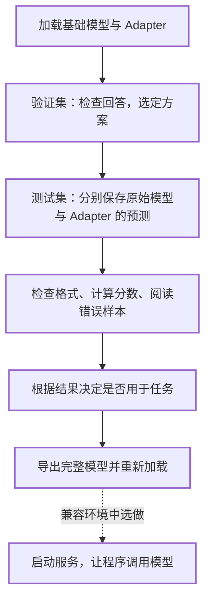
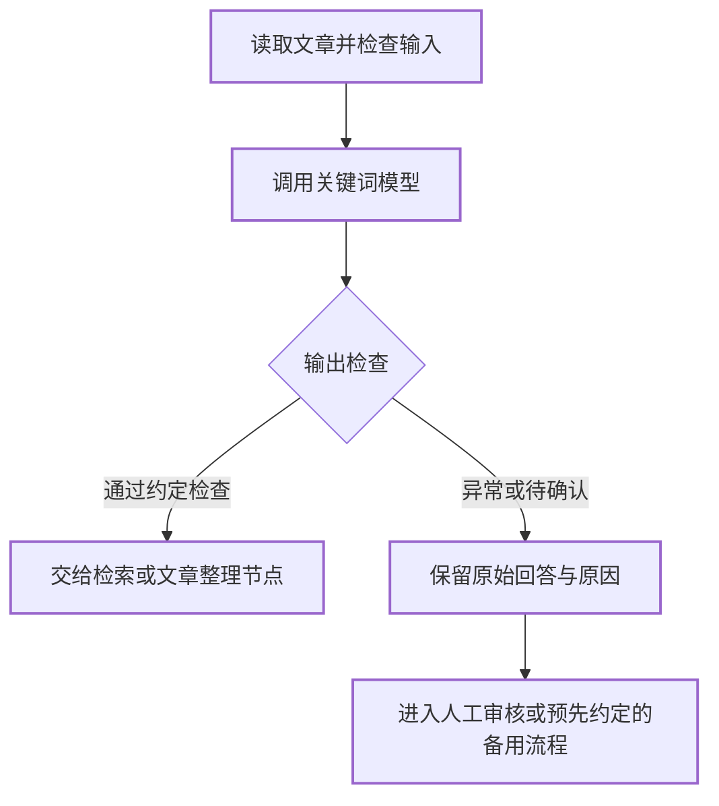

# 微调效果评估与模型部署

------

**本章课程目标：**

- 能让原始模型与微调模型回答相同问题，说明比较条件是否公平。
- 能用一条样本算清精确率、召回率与 F1，再结合格式和实际错误读懂整份报告。
- 能根据证据决定继续改进还是采用模型，并安排下一轮数据检查与回归验证。
- 能区分 Adapter、合并模型和接口服务，完成导出核查；需要时再选做部署。

**学习建议：** 围绕“这次微调是否值得采用，依据是什么”展开学习：先看一条回答，再看一批结果，最后决定怎样改进和交付。英文参数和命令用于完成这些检查，首次阅读不要求记住它们。

先按正文理解第 1～4 节，亲手计算第 4.2 节的图书馆样本；进阶对照和故障说明需要时再展开。跟做时，有 Adapter 就完成第 2～3 节的加载与预测；暂时没有 GPU，可直接用课程附带的两组预测完成第 4.4 节，只需要 Python 3。两条路线都要在第 4.6 节写出自己的评估结论。

第 5 节学习怎样交付模型文件，第 6 节再认识程序如何调用它。安装 vLLM 按环境条件选做；接口返回后怎样检查、失败后怎样处理，仍值得读懂。

------

## 1、模型验证的任务与准备

### 1.1 从训练结果到实际回答

第 4 章中，我们完成了一轮 LoRA 训练，保存了 Adapter。接下来，把它与原来的 Qwen3-0.6B 一起加载，看看模型能否按要求抽取关键词。

第 3 章的 Loss 告诉我们模型对参考答案的预测情况；现在要检查的是：**真正让模型回答时，能不能直接给出关键词，选出的内容是否合适。** 这就是本章的模型验证。

沿用第 1 章的文章管理场景：程序收到回答后，要按英文分号拆分关键词，再用于展示和检索。如果模型给出一段解释，或者漏掉文章主题，即使训练顺利结束，也还没有解决这个问题。

把一次评估放进完整项目，可以按下面的顺序推进：



第 2 章已经把数据分成了训练、验证和测试三份。自己的项目先用验证集选定方案，再用未参与选择的测试集验收；**测试集不用于反复挑检查点或调整参数。** 本章附带的 200 条预测保留了当时的固定设置，我们用它练习复算与错误分析；它与第 2.4 节的排查实验分别保存，不能拼成一次优化后的验收。

入门时也可以导出尚未达到任务要求的模型，练习文件保存和加载。导出成功只表示这一步操作完成，不表示它已经适合实际业务。

### 1.2 本章会用到的文件

先认清三样东西：验证／测试数据是“题目”，Adapter 是本轮训练的产物，两组预测文件是模型的“原始答卷”。每一步用到哪个文件，会在对应操作处说明。

<details style="-webkit-font-smoothing: antialiased; -webkit-tap-highlight-color: rgba(221, 220, 217, 0); text-size-adjust: none; box-sizing: border-box; font-size: 15px; color: rgb(163, 182, 197); font-family: &quot;Source Sans Pro&quot;, &quot;Helvetica Neue&quot;, Arial, sans-serif; font-style: normal; font-variant-ligatures: normal; font-variant-caps: normal; font-weight: 400; letter-spacing: normal; orphans: 2; text-align: start; text-indent: 0px; text-transform: none; widows: 2; word-spacing: 0px; -webkit-text-stroke-width: 0px; white-space: normal; background-color: rgb(34, 36, 37); text-decoration-thickness: initial; text-decoration-style: initial; text-decoration-color: initial;"><summary style="-webkit-font-smoothing: antialiased; -webkit-tap-highlight-color: rgba(221, 220, 217, 0); text-size-adjust: none; box-sizing: border-box;">跟做时查阅：本章文件位置</summary><p style="-webkit-font-smoothing: antialiased; -webkit-tap-highlight-color: rgba(221, 220, 217, 0); text-size-adjust: none; box-sizing: border-box; margin: 1.2em 0px; line-height: 1.6rem; word-spacing: 0.05rem;">在本机课程项目中，先找到下面这些文件。它们在第 29、31 章已经介绍或上传过，不需要重新制作测试集：</p><pre v-pre="" data-lang="text" style="-webkit-font-smoothing: antialiased; -webkit-tap-highlight-color: rgba(221, 220, 217, 0); text-size-adjust: none; box-sizing: border-box; font-family: &quot;Roboto Mono&quot;, Monaco, courier, monospace; background-color: rgb(38, 40, 41); margin: 1.2em 0px; position: relative; padding: 0px 1.4rem; line-height: 1.5rem; overflow: auto; overflow-wrap: normal;"><code class="lang-text" style="-webkit-font-smoothing: initial; -webkit-tap-highlight-color: rgba(221, 220, 217, 0); text-size-adjust: none; box-sizing: border-box; font-family: &quot;Roboto Mono&quot;, Monaco, courier, monospace; background-color: inherit; border-radius: 2px; color: rgb(175, 169, 161); margin: 0px 2px; padding: 2.2em 5px; white-space: inherit; display: block; font-size: 0.8rem; line-height: inherit; max-width: inherit; overflow: inherit;">案例与源码-4-微调/
├── processed/keywords-clean/
│   ├── keywords_validation.jsonl       # 200 条，用于检查与选择方案
│   └── keywords_test.jsonl             # 200 条，用于最后比较
├── configs/
│   ├── keywords_clean_predict_base.yaml # 不加载 Adapter 的预测配置
│   ├── keywords_clean_predict_lora.yaml # 加载 Adapter 的预测配置
│   └── keywords_clean_export.yaml       # 合并导出配置
├── examples/prompt-comparison/ # 第 2.4 节的提示词与 Adapter 对照
├── examples/thinking-control/ # 思考模式诊断与标注审核
├── results/keywords-clean/
│   ├── base/generated_predictions.jsonl # 课程附带的 200 条原始模型预测
│   └── lora/generated_predictions.jsonl # 课程附带的 200 条 LoRA 预测
├── audit_keywords_prediction.py          # 运行预测并核对实际精度、条数与数据
├── convert_keywords_predictions.py      # 把预测文件整理为评分脚本的输入
└── evaluate_keywords_predictions.py     # 对照参考答案评分</code><button class="docsify-copy-code-button" style="-webkit-font-smoothing: antialiased; -webkit-tap-highlight-color: rgba(221, 220, 217, 0); text-size-adjust: none; box-sizing: border-box; cursor: pointer; transition: 0.25s; position: absolute; z-index: 1; top: 0px; right: 0px; overflow: visible; padding: 0.65em 0.8em; border: 0px; border-radius: 0px; outline: 0px; font-size: 1em; background: none 0% 0% / auto repeat scroll padding-box border-box rgb(18, 155, 75); color: rgb(222, 220, 217); opacity: 0;"><span class="label" style="-webkit-font-smoothing: antialiased; -webkit-tap-highlight-color: rgba(221, 220, 217, 0); text-size-adjust: none; box-sizing: border-box; cursor: pointer; transition: 0.25s; border-radius: 3px; background: inherit; pointer-events: none;">复制</span><span class="error" style="-webkit-font-smoothing: antialiased; -webkit-tap-highlight-color: rgba(221, 220, 217, 0); text-size-adjust: none; box-sizing: border-box; cursor: pointer; transition: 0.25s; border-radius: 3px; background: inherit; pointer-events: none; position: absolute; z-index: -100; top: 19.75px; right: 0px; padding: 0.5em 0.65em; font-size: 0.825em; opacity: 0; transform: translateY(-50%);">错误</span><span class="success" style="-webkit-font-smoothing: antialiased; -webkit-tap-highlight-color: rgba(221, 220, 217, 0); text-size-adjust: none; box-sizing: border-box; cursor: pointer; transition: 0.25s; border-radius: 3px; background: inherit; pointer-events: none; position: absolute; z-index: -100; top: 19.75px; right: 0px; padding: 0.5em 0.65em; font-size: 0.825em; opacity: 0; transform: translateY(-50%);">已复制</span></button></pre></details>

训练得到的 Adapter 位于 **AutoDL** 中：

```text
/root/autodl-tmp/LLaMA-Factory/saves/Qwen3-0.6B-Thinking/lora/keywords-clean/
```

使用自己训练的目录；若名称不同，后面的检查点选项和配置路径也要对应修改。基础模型仍使用训练时同一份 `Qwen/Qwen3-0.6B` 文件。

本章中，**加载、预测和导出在 AutoDL 完成；下载后的文件转换与评分在本机完成**。后者只是处理文本，不需要占用 GPU。

### 1.3 原始模型与微调模型的比较

第 1 章把微调前的表现称为**基线**。现在实际比较两种状态：

| 比较对象     | 加载什么                                 |
| ------------ | ---------------------------------------- |
| 原始模型     | Qwen3-0.6B，不加载本次训练的 Adapter     |
| 微调后的模型 | 同一个 Qwen3-0.6B，加上第 4 章的 Adapter |

比如，同一篇图书馆文章，原始模型多写了“关键词：”，加载 Adapter 后没有前缀，才可能说明输出行为有变化。如果第二次另外补上了“禁止前缀”的指令，就不能只把改善归功于微调。

所以，两组比较要使用**相同的完整输入、模型文件、对话模板和生成设置**。第 2 节先练习单条观察，第 3 节再用两份配套配置进行批量预测。第 1 章的记录帮助我们认识问题，但不能用不同输入或不明设置下的回答替代这里的比较。

------

## 2、模型加载与单条验证

### 2.1 在 Chat 页面加载模型

先打开第 4 章的 LLaMA-Factory WebUI，进入 **Chat** 页。若已经加载过模型，先点“卸载模型”，再填写：

| 页面字段                | 本章填写值                                | 作用                          |
| ----------------------- | ----------------------------------------- | ----------------------------- |
| 模型名称 / 路径         | `Qwen3-0.6B-Thinking` / `Qwen/Qwen3-0.6B` | 选择基础模型                  |
| 模型下载源              | `modelscope`                              | 沿用训练时的模型文件          |
| 微调方法 / 量化等级     | `lora` / `none`                           | 本次加载普通 LoRA，不额外量化 |
| 检查点路径              | `keywords-clean`                          | 指向第 4 章训练得到的 Adapter |
| 对话模板                | `qwen3_nothink`                           | 按选定规则组织对话            |
| 推理引擎 / 推理数据类型 | `huggingface` / `float16`                 | 本次聊天使用的引擎与精度设置  |

模型名称中的 `Thinking` 是页面上的名称，不等于每次都必须开启思考。按第 2 章的约定选好模板，并在聊天区域取消勾选“启用思考模式”。

在 **Chat 页的“额外参数”**中填写：

```json
{ "do_sample": false, "max_new_tokens": 256, "repetition_penalty": 1.0 }
```

`do_sample: false` 表示关闭随机采样；`max_new_tokens` 限制最多生成多少个 token；`repetition_penalty: 1.0` 表示不额外施加重复惩罚。页面下方的最大生成长度也填 `256`，随机种子填 `42`，系统提示词留空。

前面大模型核心开发框架第三章介绍过温度与生成长度。本次关闭采样后，所用聊天引擎不会用温度和 Top-p 进行随机选词，因此不要只看截图中的温度滑块，就以为本次启用了随机生成。

点“加载模型”，等待“模型已加载，可以开始聊天了”。下面按模型位置、加载状态和生成设置放大显示关键区域，逐项核对：

先核对**模型名称、模型路径、检查点与模板**。本图已选中 `keywords-clean`：


<details style="-webkit-font-smoothing: antialiased; -webkit-tap-highlight-color: rgba(221, 220, 217, 0); text-size-adjust: none; box-sizing: border-box; font-size: 15px; color: rgb(163, 182, 197); font-family: &quot;Source Sans Pro&quot;, &quot;Helvetica Neue&quot;, Arial, sans-serif; font-style: normal; font-variant-ligatures: normal; font-variant-caps: normal; font-weight: 400; letter-spacing: normal; orphans: 2; text-align: start; text-indent: 0px; text-transform: none; widows: 2; word-spacing: 0px; -webkit-text-stroke-width: 0px; white-space: normal; background-color: rgb(34, 36, 37); text-decoration-thickness: initial; text-decoration-style: initial; text-decoration-color: initial;"><summary style="-webkit-font-smoothing: antialiased; -webkit-tap-highlight-color: rgba(221, 220, 217, 0); text-size-adjust: none; box-sizing: border-box;">跟做时展开：精度、额外参数与聊天设置截图</summary><p style="-webkit-font-smoothing: antialiased; -webkit-tap-highlight-color: rgba(221, 220, 217, 0); text-size-adjust: none; box-sizing: border-box; margin: 1.2em 0px; line-height: 1.6rem; word-spacing: 0.05rem;">再看<strong style="-webkit-font-smoothing: antialiased; -webkit-tap-highlight-color: rgba(221, 220, 217, 0); text-size-adjust: none; box-sizing: border-box; color: rgb(163, 182, 197); font-weight: 600;">推理引擎、FP16 精度与加载成功提示</strong>：</p><div role="region" aria-label="Chat 推理引擎 huggingface、精度 float16 与模型加载成功提示，窄屏可横向滚动" tabindex="0" style="-webkit-font-smoothing: antialiased; -webkit-tap-highlight-color: rgba(221, 220, 217, 0); text-size-adjust: none; box-sizing: border-box; overflow-x: auto; margin: 12px 0px;"><div style="-webkit-font-smoothing: antialiased; -webkit-tap-highlight-color: rgba(221, 220, 217, 0); text-size-adjust: none; box-sizing: border-box; position: relative; width: 975px; max-width: 975px; min-width: 640px; aspect-ratio: 975 / 245; overflow: clip;"></div></div><p style="-webkit-font-smoothing: antialiased; -webkit-tap-highlight-color: rgba(221, 220, 217, 0); text-size-adjust: none; box-sizing: border-box; margin: 1.2em 0px; line-height: 1.6rem; word-spacing: 0.05rem;">最后核对“额外参数”，并在下方聊天区域设置<strong style="-webkit-font-smoothing: antialiased; -webkit-tap-highlight-color: rgba(221, 220, 217, 0); text-size-adjust: none; box-sizing: border-box; color: rgb(163, 182, 197); font-weight: 600;">最大生成长度 256、随机种子 42，取消勾选“启用思考模式”</strong>。系统提示词保持空白：</p><div role="region" aria-label="Chat 额外参数：关闭采样、生成上限 256、重复惩罚 1.0，窄屏可横向滚动" tabindex="0" style="-webkit-font-smoothing: antialiased; -webkit-tap-highlight-color: rgba(221, 220, 217, 0); text-size-adjust: none; box-sizing: border-box; overflow-x: auto; margin: 12px 0px;"><div style="-webkit-font-smoothing: antialiased; -webkit-tap-highlight-color: rgba(221, 220, 217, 0); text-size-adjust: none; box-sizing: border-box; position: relative; width: 485px; max-width: 485px; min-width: 485px; aspect-ratio: 485 / 110; overflow: clip;"></div></div><div role="region" aria-label="Chat 生成设置：最大长度 256、种子 42、未勾选启用思考模式，窄屏可横向滚动" tabindex="0" style="-webkit-font-smoothing: antialiased; -webkit-tap-highlight-color: rgba(221, 220, 217, 0); text-size-adjust: none; box-sizing: border-box; overflow-x: auto; margin: 12px 0px;"><div style="-webkit-font-smoothing: antialiased; -webkit-tap-highlight-color: rgba(221, 220, 217, 0); text-size-adjust: none; box-sizing: border-box; position: relative; width: 322px; max-width: 322px; min-width: 322px; aspect-ratio: 322 / 452; overflow: clip;"></div></div><p style="-webkit-font-smoothing: antialiased; -webkit-tap-highlight-color: rgba(221, 220, 217, 0); text-size-adjust: none; box-sizing: border-box; margin: 1.2em 0px; line-height: 1.6rem; word-spacing: 0.05rem;"><a href="https://didilili.github.io/ai-agents-from-zero/images/32/32-2-1-1.jpg" target="_blank" rel="noopener" style="color: rgb(77, 240, 144); -webkit-font-smoothing: antialiased; -webkit-tap-highlight-color: rgba(221, 220, 217, 0); text-size-adjust: none; box-sizing: border-box; font-weight: 600;">查看完整加载区截图</a> · <a href="https://didilili.github.io/ai-agents-from-zero/images/32/32-2-1-2.jpg" target="_blank" rel="noopener" style="color: rgb(77, 240, 144); -webkit-font-smoothing: antialiased; -webkit-tap-highlight-color: rgba(221, 220, 217, 0); text-size-adjust: none; box-sizing: border-box; font-weight: 600;">查看完整聊天设置截图</a>。实际目录名以自己的训练结果为准。</p></details>

切换两种模型时，按下面的顺序操作：

| 要检查哪一组       | 操作顺序                               |
| ------------------ | -------------------------------------- |
| 原始模型           | 卸载模型 → 清空检查点路径 → 加载模型   |
| 基础模型 + Adapter | 卸载模型 → 选择自己的检查点 → 加载模型 |

只改下拉框还不够，内存中可能仍是上一次加载的模型。每次提交比较输入前，也要点“清空历史”，避免上一轮对话影响本次回答。

### 2.2 从验证集读取输入与参考答案

先用下方这条验证输入练习。把文章连同“关键词抽取”一起交给模型，参考答案留到回答后再看。先核对回答是否直接给出关键词、是否保留参考答案中的完整名称，再检查有没有漏掉主题。

<details style="-webkit-font-smoothing: antialiased; -webkit-tap-highlight-color: rgba(221, 220, 217, 0); text-size-adjust: none; box-sizing: border-box; font-size: 15px; color: rgb(163, 182, 197); font-family: &quot;Source Sans Pro&quot;, &quot;Helvetica Neue&quot;, Arial, sans-serif; font-style: normal; font-variant-ligatures: normal; font-variant-caps: normal; font-weight: 400; letter-spacing: normal; orphans: 2; text-align: start; text-indent: 0px; text-transform: none; widows: 2; word-spacing: 0px; -webkit-text-stroke-width: 0px; white-space: normal; background-color: rgb(34, 36, 37); text-decoration-thickness: initial; text-decoration-style: initial; text-decoration-color: initial;"><summary style="-webkit-font-smoothing: antialiased; -webkit-tap-highlight-color: rgba(221, 220, 217, 0); text-size-adjust: none; box-sizing: border-box;">换其他验证文章时：读取输入与参考答案</summary><p style="-webkit-font-smoothing: antialiased; -webkit-tap-highlight-color: rgba(221, 220, 217, 0); text-size-adjust: none; box-sizing: border-box; margin: 1.2em 0px; line-height: 1.6rem; word-spacing: 0.05rem;">在<strong style="-webkit-font-smoothing: antialiased; -webkit-tap-highlight-color: rgba(221, 220, 217, 0); text-size-adjust: none; box-sizing: border-box; color: rgb(163, 182, 197); font-weight: 600;">本机课程项目根目录</strong>打开终端，执行下面的代码。它只读取验证集，不调用模型：</p><pre v-pre="" data-lang="bash" style="-webkit-font-smoothing: antialiased; -webkit-tap-highlight-color: rgba(221, 220, 217, 0); text-size-adjust: none; box-sizing: border-box; font-family: &quot;Roboto Mono&quot;, Monaco, courier, monospace; background-color: rgb(38, 40, 41); margin: 1.2em 0px; position: relative; padding: 0px 1.4rem; line-height: 1.5rem; overflow: auto; overflow-wrap: normal;"><code class="lang-bash" style="-webkit-font-smoothing: initial; -webkit-tap-highlight-color: rgba(221, 220, 217, 0); text-size-adjust: none; box-sizing: border-box; font-family: &quot;Roboto Mono&quot;, Monaco, courier, monospace; background-color: inherit; border-radius: 2px; color: rgb(175, 169, 161); margin: 0px 2px; padding: 2.2em 5px; white-space: inherit; display: block; font-size: 0.8rem; line-height: inherit; max-width: inherit; overflow: inherit;">python3 - &lt;&lt;'PY'
import json
from pathlib import Path
path = Path("案例与源码-4-微调/processed/keywords-clean/keywords_validation.jsonl")
sample_number = 1  # 验证集中的第几条，从 1 开始
with path.open(encoding="utf-8") as f:
    samples = [json.loads(line) for line in f]
sample = samples[sample_number - 1]
print("【粘贴到 Chat 的完整输入】")
print(sample["conversations"][0]["content"])
print("\n【回答后再对照的参考答案，不粘贴到 Chat】")
print(sample["conversations"][1]["content"])
PY</code><button class="docsify-copy-code-button" style="-webkit-font-smoothing: antialiased; -webkit-tap-highlight-color: rgba(221, 220, 217, 0); text-size-adjust: none; box-sizing: border-box; cursor: pointer; transition: 0.25s; position: absolute; z-index: 1; top: 0px; right: 0px; overflow: visible; padding: 0.65em 0.8em; border: 0px; border-radius: 0px; outline: 0px; font-size: 1em; background: none 0% 0% / auto repeat scroll padding-box border-box rgb(18, 155, 75); color: rgb(222, 220, 217); opacity: 0;"><span class="label" style="-webkit-font-smoothing: antialiased; -webkit-tap-highlight-color: rgba(221, 220, 217, 0); text-size-adjust: none; box-sizing: border-box; cursor: pointer; transition: 0.25s; border-radius: 3px; background: inherit; pointer-events: none;">复制</span><span class="error" style="-webkit-font-smoothing: antialiased; -webkit-tap-highlight-color: rgba(221, 220, 217, 0); text-size-adjust: none; box-sizing: border-box; cursor: pointer; transition: 0.25s; border-radius: 3px; background: inherit; pointer-events: none; position: absolute; z-index: -100; top: 19.75px; right: 0px; padding: 0.5em 0.65em; font-size: 0.825em; opacity: 0; transform: translateY(-50%);">错误</span><span class="success" style="-webkit-font-smoothing: antialiased; -webkit-tap-highlight-color: rgba(221, 220, 217, 0); text-size-adjust: none; box-sizing: border-box; cursor: pointer; transition: 0.25s; border-radius: 3px; background: inherit; pointer-events: none; position: absolute; z-index: -100; top: 19.75px; right: 0px; padding: 0.5em 0.65em; font-size: 0.825em; opacity: 0; transform: translateY(-50%);">已复制</span></button></pre><p style="-webkit-font-smoothing: antialiased; -webkit-tap-highlight-color: rgba(221, 220, 217, 0); text-size-adjust: none; box-sizing: border-box; margin: 1.2em 0px; line-height: 1.6rem; word-spacing: 0.05rem;"><strong style="-webkit-font-smoothing: antialiased; -webkit-tap-highlight-color: rgba(221, 220, 217, 0); text-size-adjust: none; box-sizing: border-box; color: rgb(163, 182, 197); font-weight: 600;">只把第一部分的输入正文粘贴到 Chat，不带打印的提示标题，也不带参考答案。</strong> 第 2 章已经说明：推理时让模型根据用户输入生成回答，不能先把参考答案交给它。</p><p style="-webkit-font-smoothing: antialiased; -webkit-tap-highlight-color: rgba(221, 220, 217, 0); text-size-adjust: none; box-sizing: border-box; margin: 1.2em 0px; line-height: 1.6rem; word-spacing: 0.05rem;">后面要换一篇文章时，把 <code style="-webkit-font-smoothing: antialiased; -webkit-tap-highlight-color: rgba(221, 220, 217, 0); text-size-adjust: none; box-sizing: border-box; font-family: &quot;Roboto Mono&quot;, Monaco, courier, monospace; background-color: rgb(38, 40, 41); border-radius: 2px; color: rgb(238, 137, 55); margin: 0px 2px; padding: 3px 5px; white-space: pre-wrap; font-size: 0.8rem;">sample_number</code> 改成 <code style="-webkit-font-smoothing: antialiased; -webkit-tap-highlight-color: rgba(221, 220, 217, 0); text-size-adjust: none; box-sizing: border-box; font-family: &quot;Roboto Mono&quot;, Monaco, courier, monospace; background-color: rgb(38, 40, 41); border-radius: 2px; color: rgb(238, 137, 55); margin: 0px 2px; padding: 3px 5px; white-space: pre-wrap; font-size: 0.8rem;">2</code>、<code style="-webkit-font-smoothing: antialiased; -webkit-tap-highlight-color: rgba(221, 220, 217, 0); text-size-adjust: none; box-sizing: border-box; font-family: &quot;Roboto Mono&quot;, Monaco, courier, monospace; background-color: rgb(38, 40, 41); border-radius: 2px; color: rgb(238, 137, 55); margin: 0px 2px; padding: 3px 5px; white-space: pre-wrap; font-size: 0.8rem;">3</code> 等，再运行一次。当前验证集共 200 条，编号范围是 <code style="-webkit-font-smoothing: antialiased; -webkit-tap-highlight-color: rgba(221, 220, 217, 0); text-size-adjust: none; box-sizing: border-box; font-family: &quot;Roboto Mono&quot;, Monaco, courier, monospace; background-color: rgb(38, 40, 41); border-radius: 2px; color: rgb(238, 137, 55); margin: 0px 2px; padding: 3px 5px; white-space: pre-wrap; font-size: 0.8rem;">1～200</code>；本节先查看第 1 条。</p></details>


当前验证集第一条讨论矿山巷道降温。完整输入如下，复制时保留“关键词抽取”这句任务要求。文中的“工程的的”是原始数据的重复字，此处保留原样，确保对照使用相同输入：

```text
关键词抽取：
金属矿山独头掘进巷道制冷系数是计算独头掘进巷道降温需冷量非常重要的参数之一,关系到能否达到预期降温效果及影响着降温工程的的经济投入。利用“金属矿山深部开采降温试验系统”分别模拟通风降温、加大风量降温、制冷降温、加大制冷降温4种条件下独头掘进巷道的降温过程,并分析独头掘进巷道降温效果,在通风及加大风量降温后,独头掘进巷道内温度先下降然后趋于稳定,再也无法下降,只有通过制冷措施,对独头掘进工作面进行降温。通过监测数据的焓差值计算出降温制冷系数,同时利用多次试验得出制冷系数范围在1．38~1．68,进而为独头掘进巷道降温设计提供设计依据。
```

参考答案是：

```text
独头掘进巷道;降温试验系统;制冷降温;焓差;制冷系数
```

先检查回答是否直接给出关键词列表，再对照原文和标注规则，检查选词是否有依据、名称是否完整。

### 2.3 原始模型与 Adapter 的回答对照

前面的 Chat 操作用于人工检查回答。要保存可复查的正式对照，我们改用固定配置的命令行预测，第 3 节会带你运行完整测试。这里先阅读课程已保存的**验证集前 3 条**预测中的第 1 条，即上面的矿山降温文章。

两组都使用同一份 Qwen3-0.6B、`qwen3_nothink` 模板和生成设置，实际参数精度均为 `torch.float16`；其中一组加载了当前 `keywords-clean` 数据训练出的 Adapter。

加载 Adapter 后，得到：

```text
金属矿山;独头掘进;降温试验系统;制冷系数
```

不加载 Adapter 时，原始模型从 `<think>` 开始输出分析，在本次 256 token 的生成上限内没有给出完整关键词列表，末尾停在一句未写完的话上。

```
好的，我现在需要处理用户提供的关于金属矿山独头掘进巷道制冷系数的文本，提取关键词。首先，我得通读一遍这段文字，理解其主要内容和关键点。

用户提到金属矿山独头掘进巷道的制冷系数是重要的参数，关系到降温效果和经济投入。然后他们用“金属矿山深部开采降温试验系统”模拟了四种降温条件：通风、加大风量、制冷和加大制冷，分析降温效果。温度变化过程是先下降后稳定，只有通过制冷才能降温。通过焓差值计算制冷系数，范围在1.38到1.68，为设计提供依据。

接下来，我需要确定哪些是关键词。通常，关键词包括主要术语、研究方法、结果和应用领域等。可能的关键词有：金属矿山、独头掘进巷道、制冷系数、降温试验系统、通风降温、加大风量降温、制冷降温、焓差值、设计依据、经济投入。

还要注意用户可能希望关键词既准确又简洁，可能需要排除一些次要信息。例如，“金属矿山深部开采”可能是一个背景，但作为关键词可能不需要。同样，“降温试验系统”是方法，但
```


下图展示两组完整回答和共同设置。先看回答形式，再对照参考词：


把两组回答与参考答案放在一起看：

| 检查项             | 原始模型                         | 加载 Adapter                                           |
| ------------------ | -------------------------------- | ------------------------------------------------------ |
| 是否直接输出关键词 | 否，达到长度上限时仍在分析       | 是，给出 4 个分号分隔的词                              |
| 是否符合目标格式   | 不符合，有分析段落，没有最终列表 | 符合，没有前缀、序号或解释                             |
| 与参考答案一致的词 | 尚未形成可供比较的最终关键词列表 | `降温试验系统`、`制冷系数`                             |
| 还需检查什么       | 为什么没有在长度上限内完成任务   | 漏掉“制冷降温”“焓差”，将“独头掘进巷道”缩短为“独头掘进” |

这里有个容易忽略的细节：**“金属矿山”出现在原文中，只是没有被参考答案收录。** 在后面的精确匹配评分中，它算“多出的词”，但不能仅凭这一点就说模型编造了信息。判断它是否值得保留，仍要回到文章主题与选词规则。

这条示例中，Adapter 的回答更接近目标格式，仍有漏词和名称缩短的问题。接下来用更多输入检查这些现象是否普遍。

<details style="-webkit-font-smoothing: antialiased; -webkit-tap-highlight-color: rgba(221, 220, 217, 0); text-size-adjust: none; box-sizing: border-box; font-size: 15px; color: rgb(163, 182, 197); font-family: &quot;Source Sans Pro&quot;, &quot;Helvetica Neue&quot;, Arial, sans-serif; font-style: normal; font-variant-ligatures: normal; font-variant-caps: normal; font-weight: 400; letter-spacing: normal; orphans: 2; text-align: start; text-indent: 0px; text-transform: none; widows: 2; word-spacing: 0px; -webkit-text-stroke-width: 0px; white-space: normal; background-color: rgb(34, 36, 37); text-decoration-thickness: initial; text-decoration-style: initial; text-decoration-color: initial;"><summary style="-webkit-font-smoothing: antialiased; -webkit-tap-highlight-color: rgba(221, 220, 217, 0); text-size-adjust: none; box-sizing: border-box;">示例的比较条件与配套文件</summary><p style="-webkit-font-smoothing: antialiased; -webkit-tap-highlight-color: rgba(221, 220, 217, 0); text-size-adjust: none; box-sizing: border-box; margin: 1.2em 0px; line-height: 1.6rem; word-spacing: 0.05rem;">示例 Adapter 用 1,600 条训练数据完成 3 轮、150 步训练，按验证 Loss 选择 <code style="-webkit-font-smoothing: antialiased; -webkit-tap-highlight-color: rgba(221, 220, 217, 0); text-size-adjust: none; box-sizing: border-box; font-family: &quot;Roboto Mono&quot;, Monaco, courier, monospace; background-color: rgb(38, 40, 41); border-radius: 2px; color: rgb(238, 137, 55); margin: 0px 2px; padding: 3px 5px; white-space: pre-wrap; font-size: 0.8rem;">checkpoint-150</code>。两组使用同一份基础模型、完整输入和 <code style="-webkit-font-smoothing: antialiased; -webkit-tap-highlight-color: rgba(221, 220, 217, 0); text-size-adjust: none; box-sizing: border-box; font-family: &quot;Roboto Mono&quot;, Monaco, courier, monospace; background-color: rgb(38, 40, 41); border-radius: 2px; color: rgb(238, 137, 55); margin: 0px 2px; padding: 3px 5px; white-space: pre-wrap; font-size: 0.8rem;">qwen3_nothink</code> 模板；关闭采样和思考设置，最大生成长度为 256，重复惩罚为 1.0，种子为 42，不加入系统提示词或历史对话。</p><p style="-webkit-font-smoothing: antialiased; -webkit-tap-highlight-color: rgba(221, 220, 217, 0); text-size-adjust: none; box-sizing: border-box; margin: 1.2em 0px; line-height: 1.6rem; word-spacing: 0.05rem;">本节单条验证每批处理 1 条，两组模型参数均为 <code style="-webkit-font-smoothing: antialiased; -webkit-tap-highlight-color: rgba(221, 220, 217, 0); text-size-adjust: none; box-sizing: border-box; font-family: &quot;Roboto Mono&quot;, Monaco, courier, monospace; background-color: rgb(38, 40, 41); border-radius: 2px; color: rgb(238, 137, 55); margin: 0px 2px; padding: 3px 5px; white-space: pre-wrap; font-size: 0.8rem;">torch.float16</code>；第 3 节的完整测试每批处理 4 条。比较时不要混用这两种批次设置。</p><p style="-webkit-font-smoothing: antialiased; -webkit-tap-highlight-color: rgba(221, 220, 217, 0); text-size-adjust: none; box-sizing: border-box; margin: 1.2em 0px; line-height: 1.6rem; word-spacing: 0.05rem;">示例中，原始模型在关闭思考设置后仍返回分析文字。第 2.4 节会从实际输入检查原因；这只能说明当前调用条件没有完成目标输出，不能推出其他 Prompt 或思考控制方法也无效。</p><p style="-webkit-font-smoothing: antialiased; -webkit-tap-highlight-color: rgba(221, 220, 217, 0); text-size-adjust: none; box-sizing: border-box; margin: 1.2em 0px; line-height: 1.6rem; word-spacing: 0.05rem;">三条输入的完整验证记录见<a href="https://didilili.github.io/ai-agents-from-zero/%E6%A1%88%E4%BE%8B%E4%B8%8E%E6%BA%90%E7%A0%81-4-%E5%BE%AE%E8%B0%83/results/keywords-clean/%E9%AA%8C%E8%AF%81%E4%B8%8E%E5%90%88%E5%B9%B6%E6%A8%A1%E5%9E%8B%E5%AF%B9%E7%85%A7.json" target="_blank" rel="noopener" style="color: rgb(77, 240, 144); -webkit-font-smoothing: antialiased; -webkit-tap-highlight-color: rgba(221, 220, 217, 0); text-size-adjust: none; box-sizing: border-box; font-weight: 600;">验证与合并模型对照</a>：</p><ul style="-webkit-font-smoothing: antialiased; -webkit-tap-highlight-color: rgba(221, 220, 217, 0); text-size-adjust: none; box-sizing: border-box; line-height: 1.6rem; word-spacing: 0.05rem; padding-left: 1.5rem;"><li style="-webkit-font-smoothing: antialiased; -webkit-tap-highlight-color: rgba(221, 220, 217, 0); text-size-adjust: none; box-sizing: border-box;"><code style="-webkit-font-smoothing: antialiased; -webkit-tap-highlight-color: rgba(221, 220, 217, 0); text-size-adjust: none; box-sizing: border-box; font-family: &quot;Roboto Mono&quot;, Monaco, courier, monospace; background-color: rgb(38, 40, 41); border-radius: 2px; color: rgb(238, 137, 55); margin: 0px 2px; padding: 3px 5px; white-space: pre-wrap; font-size: 0.8rem;">configuration</code>：共同的模板、精度与生成设置。</li><li style="-webkit-font-smoothing: antialiased; -webkit-tap-highlight-color: rgba(221, 220, 217, 0); text-size-adjust: none; box-sizing: border-box;"><code style="-webkit-font-smoothing: antialiased; -webkit-tap-highlight-color: rgba(221, 220, 217, 0); text-size-adjust: none; box-sizing: border-box; font-family: &quot;Roboto Mono&quot;, Monaco, courier, monospace; background-color: rgb(38, 40, 41); border-radius: 2px; color: rgb(238, 137, 55); margin: 0px 2px; padding: 3px 5px; white-space: pre-wrap; font-size: 0.8rem;">models</code>：原始模型、加载 Adapter、合并模型三种状态及各自实际精度。</li><li style="-webkit-font-smoothing: antialiased; -webkit-tap-highlight-color: rgba(221, 220, 217, 0); text-size-adjust: none; box-sizing: border-box;"><code style="-webkit-font-smoothing: antialiased; -webkit-tap-highlight-color: rgba(221, 220, 217, 0); text-size-adjust: none; box-sizing: border-box; font-family: &quot;Roboto Mono&quot;, Monaco, courier, monospace; background-color: rgb(38, 40, 41); border-radius: 2px; color: rgb(238, 137, 55); margin: 0px 2px; padding: 3px 5px; white-space: pre-wrap; font-size: 0.8rem;">samples</code>：完整输入、参考答案和三种状态下的原始回答。</li><li style="-webkit-font-smoothing: antialiased; -webkit-tap-highlight-color: rgba(221, 220, 217, 0); text-size-adjust: none; box-sizing: border-box;"><code style="-webkit-font-smoothing: antialiased; -webkit-tap-highlight-color: rgba(221, 220, 217, 0); text-size-adjust: none; box-sizing: border-box; font-family: &quot;Roboto Mono&quot;, Monaco, courier, monospace; background-color: rgb(38, 40, 41); border-radius: 2px; color: rgb(238, 137, 55); margin: 0px 2px; padding: 3px 5px; white-space: pre-wrap; font-size: 0.8rem;">merge_check</code>：合并模型独立加载及三条回答一致性检查，配合第 5 节阅读。</li></ul></details>

### 2.4 从单条观察到批量测试

Chat 适合快速发现明显问题。但看到原始模型格式不对，还需要回答第 1 章留下的问题：**把要求说清楚，是否已经能够改善？** 可以先做一组小范围验证，再决定是否值得继续训练。

首次阅读先记住三个判断：**任务要求要说清；比较微调影响时条件要相同；格式合格还要检查内容。** 下方保留了对应的练习与结果，读懂结论后即可进入第 3 节，不必先完成所有实验。

做自己的项目时，再展开第 2.4.1 节实际比较提示词；遇到分析段、重复或回答不完整，再查第 2.4.3 节。

#### 2.4.1 固定输入，比较提示词与模型

先固定一小组验证文章，观察三种提示词：A 使用原有要求，B 写清格式与选词要求，C 在 B 的基础上补一个示例。选好提示词后，让原始模型和加载 Adapter 的模型使用同一版本，才能继续比较微调的影响。

<details style="-webkit-font-smoothing: antialiased; -webkit-tap-highlight-color: rgba(221, 220, 217, 0); text-size-adjust: none; box-sizing: border-box; font-size: 15px; color: rgb(163, 182, 197); font-family: &quot;Source Sans Pro&quot;, &quot;Helvetica Neue&quot;, Arial, sans-serif; font-style: normal; font-variant-ligatures: normal; font-variant-caps: normal; font-weight: 400; letter-spacing: normal; orphans: 2; text-align: start; text-indent: 0px; text-transform: none; widows: 2; word-spacing: 0px; -webkit-text-stroke-width: 0px; white-space: normal; background-color: rgb(34, 36, 37); text-decoration-thickness: initial; text-decoration-style: initial; text-decoration-color: initial;"><summary style="-webkit-font-smoothing: antialiased; -webkit-tap-highlight-color: rgba(221, 220, 217, 0); text-size-adjust: none; box-sizing: border-box;">进阶练习：完成 A/B/C 提示词与 Adapter 对照</summary><p style="-webkit-font-smoothing: antialiased; -webkit-tap-highlight-color: rgba(221, 220, 217, 0); text-size-adjust: none; box-sizing: border-box; margin: 1.2em 0px; line-height: 1.6rem; word-spacing: 0.05rem;"><strong style="-webkit-font-smoothing: antialiased; -webkit-tap-highlight-color: rgba(221, 220, 217, 0); text-size-adjust: none; box-sizing: border-box; color: rgb(163, 182, 197); font-weight: 600;">第一步：固定验证输入，只改变提示词。</strong> 先按第 2.1 节加载原始模型，检查点路径留空。初次练习可固定使用验证集前 10 条，按第 2.2 节修改 <code style="-webkit-font-smoothing: antialiased; -webkit-tap-highlight-color: rgba(221, 220, 217, 0); text-size-adjust: none; box-sizing: border-box; font-family: &quot;Roboto Mono&quot;, Monaco, courier, monospace; background-color: rgb(38, 40, 41); border-radius: 2px; color: rgb(238, 137, 55); margin: 0px 2px; padding: 3px 5px; white-space: pre-wrap; font-size: 0.8rem;">sample_number</code> 依次读取。每条都比较下面三个版本，不能给某个版本单独换更容易的文章：</p><table style="border-color: rgb(89, 95, 97); -webkit-font-smoothing: antialiased; -webkit-tap-highlight-color: rgba(221, 220, 217, 0); text-size-adjust: none; box-sizing: border-box; border-collapse: collapse; border-spacing: 0px; display: block; margin-bottom: 1rem; overflow: auto; width: 1134.8px;"><thead style="-webkit-font-smoothing: antialiased; -webkit-tap-highlight-color: rgba(221, 220, 217, 0); text-size-adjust: none; box-sizing: border-box;"><tr style="-webkit-font-smoothing: antialiased; -webkit-tap-highlight-color: rgba(221, 220, 217, 0); text-size-adjust: none; box-sizing: border-box; border-top: 1px solid rgb(65, 69, 71);"><th style="-webkit-font-smoothing: antialiased; -webkit-tap-highlight-color: rgba(221, 220, 217, 0); text-size-adjust: none; box-sizing: border-box; font-weight: 700; border: 1px solid rgb(65, 69, 71); padding: 6px 13px;">版本</th><th style="-webkit-font-smoothing: antialiased; -webkit-tap-highlight-color: rgba(221, 220, 217, 0); text-size-adjust: none; box-sizing: border-box; font-weight: 700; border: 1px solid rgb(65, 69, 71); padding: 6px 13px;">交给模型的内容</th><th style="-webkit-font-smoothing: antialiased; -webkit-tap-highlight-color: rgba(221, 220, 217, 0); text-size-adjust: none; box-sizing: border-box; font-weight: 700; border: 1px solid rgb(65, 69, 71); padding: 6px 13px;">想观察什么</th></tr></thead><tbody style="-webkit-font-smoothing: antialiased; -webkit-tap-highlight-color: rgba(221, 220, 217, 0); text-size-adjust: none; box-sizing: border-box;"><tr style="-webkit-font-smoothing: antialiased; -webkit-tap-highlight-color: rgba(221, 220, 217, 0); text-size-adjust: none; box-sizing: border-box; border-top: 1px solid rgb(65, 69, 71);"><td style="-webkit-font-smoothing: antialiased; -webkit-tap-highlight-color: rgba(221, 220, 217, 0); text-size-adjust: none; box-sizing: border-box; border: 1px solid rgb(65, 69, 71); padding: 6px 13px;">A：原始指令</td><td style="-webkit-font-smoothing: antialiased; -webkit-tap-highlight-color: rgba(221, 220, 217, 0); text-size-adjust: none; box-sizing: border-box; border: 1px solid rgb(65, 69, 71); padding: 6px 13px;">第 2.2 节打印的完整用户输入，原样粘贴</td><td style="-webkit-font-smoothing: antialiased; -webkit-tap-highlight-color: rgba(221, 220, 217, 0); text-size-adjust: none; box-sizing: border-box; border: 1px solid rgb(65, 69, 71); padding: 6px 13px;">当前数据里的任务指令能否让模型完成要求</td></tr><tr style="-webkit-font-smoothing: antialiased; -webkit-tap-highlight-color: rgba(221, 220, 217, 0); text-size-adjust: none; box-sizing: border-box; border-top: 1px solid rgb(65, 69, 71); background-color: rgb(38, 40, 41);"><td style="-webkit-font-smoothing: antialiased; -webkit-tap-highlight-color: rgba(221, 220, 217, 0); text-size-adjust: none; box-sizing: border-box; border: 1px solid rgb(65, 69, 71); padding: 6px 13px;">B：明确要求</td><td style="-webkit-font-smoothing: antialiased; -webkit-tap-highlight-color: rgba(221, 220, 217, 0); text-size-adjust: none; box-sizing: border-box; border: 1px solid rgb(65, 69, 71); padding: 6px 13px;">在 A 前加上下面的格式与选词要求</td><td style="-webkit-font-smoothing: antialiased; -webkit-tap-highlight-color: rgba(221, 220, 217, 0); text-size-adjust: none; box-sizing: border-box; border: 1px solid rgb(65, 69, 71); padding: 6px 13px;">说明分隔符、前缀和选词范围后，错误是否减少</td></tr><tr style="-webkit-font-smoothing: antialiased; -webkit-tap-highlight-color: rgba(221, 220, 217, 0); text-size-adjust: none; box-sizing: border-box; border-top: 1px solid rgb(65, 69, 71);"><td style="-webkit-font-smoothing: antialiased; -webkit-tap-highlight-color: rgba(221, 220, 217, 0); text-size-adjust: none; box-sizing: border-box; border: 1px solid rgb(65, 69, 71); padding: 6px 13px;">C：加入示例</td><td style="-webkit-font-smoothing: antialiased; -webkit-tap-highlight-color: rgba(221, 220, 217, 0); text-size-adjust: none; box-sizing: border-box; border: 1px solid rgb(65, 69, 71); padding: 6px 13px;">在 B 的要求之后、待处理输入之前，增加一组示范</td><td style="-webkit-font-smoothing: antialiased; -webkit-tap-highlight-color: rgba(221, 220, 217, 0); text-size-adjust: none; box-sizing: border-box; border: 1px solid rgb(65, 69, 71); padding: 6px 13px;">看过期望答案的写法后，是否更容易遵守要求</td></tr></tbody></table><p style="-webkit-font-smoothing: antialiased; -webkit-tap-highlight-color: rgba(221, 220, 217, 0); text-size-adjust: none; box-sizing: border-box; margin: 1.2em 0px; line-height: 1.6rem; word-spacing: 0.05rem;">B 版本可以这样组织。把最后一行占位说明换成第 2.2 节打印的<strong style="-webkit-font-smoothing: antialiased; -webkit-tap-highlight-color: rgba(221, 220, 217, 0); text-size-adjust: none; box-sizing: border-box; color: rgb(163, 182, 197); font-weight: 600;">完整用户输入</strong>，保留文章和原有任务指令：</p><pre v-pre="" data-lang="text" style="-webkit-font-smoothing: antialiased; -webkit-tap-highlight-color: rgba(221, 220, 217, 0); text-size-adjust: none; box-sizing: border-box; font-family: &quot;Roboto Mono&quot;, Monaco, courier, monospace; background-color: rgb(38, 40, 41); margin: 1.2em 0px; position: relative; padding: 0px 1.4rem; line-height: 1.5rem; overflow: auto; overflow-wrap: normal;"><code class="lang-text" style="-webkit-font-smoothing: initial; -webkit-tap-highlight-color: rgba(221, 220, 217, 0); text-size-adjust: none; box-sizing: border-box; font-family: &quot;Roboto Mono&quot;, Monaco, courier, monospace; background-color: inherit; border-radius: 2px; color: rgb(175, 169, 161); margin: 0px 2px; padding: 2.2em 5px; white-space: inherit; display: block; font-size: 0.8rem; line-height: inherit; max-width: inherit; overflow: inherit;">请从下面的输入中抽取能够概括文章主题的关键词。
只输出一行关键词，关键词之间使用英文分号 ; 分隔。
不要输出“关键词：”、序号、解释或分析过程，不要重复关键词。
关键词应有原文依据，保留影响含义的完整名称，不为凑数量拆开短语。
原文同时给出全称和简称时优先使用全称，只有简称时保留简称。
待处理输入：
【替换为第 2.2 节打印的完整用户输入，不粘贴参考答案】</code><button class="docsify-copy-code-button" style="-webkit-font-smoothing: antialiased; -webkit-tap-highlight-color: rgba(221, 220, 217, 0); text-size-adjust: none; box-sizing: border-box; cursor: pointer; transition: 0.25s; position: absolute; z-index: 1; top: 0px; right: 0px; overflow: visible; padding: 0.65em 0.8em; border: 0px; border-radius: 0px; outline: 0px; font-size: 1em; background: none 0% 0% / auto repeat scroll padding-box border-box rgb(18, 155, 75); color: rgb(222, 220, 217); opacity: 0;"><span class="label" style="-webkit-font-smoothing: antialiased; -webkit-tap-highlight-color: rgba(221, 220, 217, 0); text-size-adjust: none; box-sizing: border-box; cursor: pointer; transition: 0.25s; border-radius: 3px; background: inherit; pointer-events: none;">复制</span><span class="error" style="-webkit-font-smoothing: antialiased; -webkit-tap-highlight-color: rgba(221, 220, 217, 0); text-size-adjust: none; box-sizing: border-box; cursor: pointer; transition: 0.25s; border-radius: 3px; background: inherit; pointer-events: none; position: absolute; z-index: -100; top: 19.75px; right: 0px; padding: 0.5em 0.65em; font-size: 0.825em; opacity: 0; transform: translateY(-50%);">错误</span><span class="success" style="-webkit-font-smoothing: antialiased; -webkit-tap-highlight-color: rgba(221, 220, 217, 0); text-size-adjust: none; box-sizing: border-box; cursor: pointer; transition: 0.25s; border-radius: 3px; background: inherit; pointer-events: none; position: absolute; z-index: -100; top: 19.75px; right: 0px; padding: 0.5em 0.65em; font-size: 0.825em; opacity: 0; transform: translateY(-50%);">已复制</span></button></pre><p style="-webkit-font-smoothing: antialiased; -webkit-tap-highlight-color: rgba(221, 220, 217, 0); text-size-adjust: none; box-sizing: border-box; margin: 1.2em 0px; line-height: 1.6rem; word-spacing: 0.05rem;">C 版本在相同要求与“待处理输入”之间加入下面这段示范，其余内容保持一致。这是第 2 章的教学例子，答案由我们编写，用来展示格式与选词口径，不是模型实测输出：</p><pre v-pre="" data-lang="text" style="-webkit-font-smoothing: antialiased; -webkit-tap-highlight-color: rgba(221, 220, 217, 0); text-size-adjust: none; box-sizing: border-box; font-family: &quot;Roboto Mono&quot;, Monaco, courier, monospace; background-color: rgb(38, 40, 41); margin: 1.2em 0px; position: relative; padding: 0px 1.4rem; line-height: 1.5rem; overflow: auto; overflow-wrap: normal;"><code class="lang-text" style="-webkit-font-smoothing: initial; -webkit-tap-highlight-color: rgba(221, 220, 217, 0); text-size-adjust: none; box-sizing: border-box; font-family: &quot;Roboto Mono&quot;, Monaco, courier, monospace; background-color: inherit; border-radius: 2px; color: rgb(175, 169, 161); margin: 0px 2px; padding: 2.2em 5px; white-space: inherit; display: block; font-size: 0.8rem; line-height: inherit; max-width: inherit; overflow: inherit;">示例文章：市图书馆周末开设儿童阅读课，读者可通过公众号预约。
示例答案：市图书馆;儿童阅读课;公众号预约</code><button class="docsify-copy-code-button" style="-webkit-font-smoothing: antialiased; -webkit-tap-highlight-color: rgba(221, 220, 217, 0); text-size-adjust: none; box-sizing: border-box; cursor: pointer; transition: 0.25s; position: absolute; z-index: 1; top: 0px; right: 0px; overflow: visible; padding: 0.65em 0.8em; border: 0px; border-radius: 0px; outline: 0px; font-size: 1em; background: none 0% 0% / auto repeat scroll padding-box border-box rgb(18, 155, 75); color: rgb(222, 220, 217); opacity: 0;"><span class="label" style="-webkit-font-smoothing: antialiased; -webkit-tap-highlight-color: rgba(221, 220, 217, 0); text-size-adjust: none; box-sizing: border-box; cursor: pointer; transition: 0.25s; border-radius: 3px; background: inherit; pointer-events: none;">复制</span><span class="error" style="-webkit-font-smoothing: antialiased; -webkit-tap-highlight-color: rgba(221, 220, 217, 0); text-size-adjust: none; box-sizing: border-box; cursor: pointer; transition: 0.25s; border-radius: 3px; background: inherit; pointer-events: none; position: absolute; z-index: -100; top: 19.75px; right: 0px; padding: 0.5em 0.65em; font-size: 0.825em; opacity: 0; transform: translateY(-50%);">错误</span><span class="success" style="-webkit-font-smoothing: antialiased; -webkit-tap-highlight-color: rgba(221, 220, 217, 0); text-size-adjust: none; box-sizing: border-box; cursor: pointer; transition: 0.25s; border-radius: 3px; background: inherit; pointer-events: none; position: absolute; z-index: -100; top: 19.75px; right: 0px; padding: 0.5em 0.65em; font-size: 0.825em; opacity: 0; transform: translateY(-50%);">已复制</span></button></pre><p style="-webkit-font-smoothing: antialiased; -webkit-tap-highlight-color: rgba(221, 220, 217, 0); text-size-adjust: none; box-sizing: border-box; margin: 1.2em 0px; line-height: 1.6rem; word-spacing: 0.05rem;">准备自己的示例时，可从训练集中选取已审核的记录；不要把正在比较的验证题或测试题及其答案放进提示词。</p><p style="-webkit-font-smoothing: antialiased; -webkit-tap-highlight-color: rgba(221, 220, 217, 0); text-size-adjust: none; box-sizing: border-box; margin: 1.2em 0px; line-height: 1.6rem; word-spacing: 0.05rem;"><strong style="-webkit-font-smoothing: antialiased; -webkit-tap-highlight-color: rgba(221, 220, 217, 0); text-size-adjust: none; box-sizing: border-box; color: rgb(163, 182, 197); font-weight: 600;">第二步：保存原始回答，再选提示词。</strong> 每次发送前清空历史，沿用第 2.1 节的模板、精度、生成长度等设置。不要手动删掉解释或修正分隔符，按下面的表格记录，每条验证输入各占三行：</p><table style="border-color: rgb(89, 95, 97); -webkit-font-smoothing: antialiased; -webkit-tap-highlight-color: rgba(221, 220, 217, 0); text-size-adjust: none; box-sizing: border-box; border-collapse: collapse; border-spacing: 0px; display: block; margin-bottom: 1rem; overflow: auto; width: 1134.8px;"><thead style="-webkit-font-smoothing: antialiased; -webkit-tap-highlight-color: rgba(221, 220, 217, 0); text-size-adjust: none; box-sizing: border-box;"><tr style="-webkit-font-smoothing: antialiased; -webkit-tap-highlight-color: rgba(221, 220, 217, 0); text-size-adjust: none; box-sizing: border-box; border-top: 1px solid rgb(65, 69, 71);"><th style="-webkit-font-smoothing: antialiased; -webkit-tap-highlight-color: rgba(221, 220, 217, 0); text-size-adjust: none; box-sizing: border-box; font-weight: 700; border: 1px solid rgb(65, 69, 71); padding: 6px 13px;">验证集编号</th><th style="-webkit-font-smoothing: antialiased; -webkit-tap-highlight-color: rgba(221, 220, 217, 0); text-size-adjust: none; box-sizing: border-box; font-weight: 700; border: 1px solid rgb(65, 69, 71); padding: 6px 13px;">提示词版本</th><th style="-webkit-font-smoothing: antialiased; -webkit-tap-highlight-color: rgba(221, 220, 217, 0); text-size-adjust: none; box-sizing: border-box; font-weight: 700; border: 1px solid rgb(65, 69, 71); padding: 6px 13px;">模型原始回答</th><th style="-webkit-font-smoothing: antialiased; -webkit-tap-highlight-color: rgba(221, 220, 217, 0); text-size-adjust: none; box-sizing: border-box; font-weight: 700; border: 1px solid rgb(65, 69, 71); padding: 6px 13px;">格式是否符合要求</th><th style="-webkit-font-smoothing: antialiased; -webkit-tap-highlight-color: rgba(221, 220, 217, 0); text-size-adjust: none; box-sizing: border-box; font-weight: 700; border: 1px solid rgb(65, 69, 71); padding: 6px 13px;">选词问题</th></tr></thead><tbody style="-webkit-font-smoothing: antialiased; -webkit-tap-highlight-color: rgba(221, 220, 217, 0); text-size-adjust: none; box-sizing: border-box;"><tr style="-webkit-font-smoothing: antialiased; -webkit-tap-highlight-color: rgba(221, 220, 217, 0); text-size-adjust: none; box-sizing: border-box; border-top: 1px solid rgb(65, 69, 71);"><td style="-webkit-font-smoothing: antialiased; -webkit-tap-highlight-color: rgba(221, 220, 217, 0); text-size-adjust: none; box-sizing: border-box; border: 1px solid rgb(65, 69, 71); padding: 6px 13px;">1</td><td style="-webkit-font-smoothing: antialiased; -webkit-tap-highlight-color: rgba(221, 220, 217, 0); text-size-adjust: none; box-sizing: border-box; border: 1px solid rgb(65, 69, 71); padding: 6px 13px;">A / B / C（分别记录）</td><td style="-webkit-font-smoothing: antialiased; -webkit-tap-highlight-color: rgba(221, 220, 217, 0); text-size-adjust: none; box-sizing: border-box; border: 1px solid rgb(65, 69, 71); padding: 6px 13px;">粘贴实际回答</td><td style="-webkit-font-smoothing: antialiased; -webkit-tap-highlight-color: rgba(221, 220, 217, 0); text-size-adjust: none; box-sizing: border-box; border: 1px solid rgb(65, 69, 71); padding: 6px 13px;">检查分号、前缀、解释和重复</td><td style="-webkit-font-smoothing: antialiased; -webkit-tap-highlight-color: rgba(221, 220, 217, 0); text-size-adjust: none; box-sizing: border-box; border: 1px solid rgb(65, 69, 71); padding: 6px 13px;">对照原文记录漏词、过度缩写、无依据内容等</td></tr></tbody></table><p style="-webkit-font-smoothing: antialiased; -webkit-tap-highlight-color: rgba(221, 220, 217, 0); text-size-adjust: none; box-sizing: border-box; margin: 1.2em 0px; line-height: 1.6rem; word-spacing: 0.05rem;">另外保存 A、B、C 的完整输入文本和共同的生成设置，便于复查。先看 10 条中各有多少条格式合格，再检查选词质量；不要只挑最好的一次回答。若几种方案都不理想，继续在验证集检查问题原因。这里的小样本练习用于筛选方案，不能据此估计正式使用时的成功率。</p><p style="-webkit-font-smoothing: antialiased; -webkit-tap-highlight-color: rgba(221, 220, 217, 0); text-size-adjust: none; box-sizing: border-box; margin: 1.2em 0px; line-height: 1.6rem; word-spacing: 0.05rem;"><strong style="-webkit-font-smoothing: antialiased; -webkit-tap-highlight-color: rgba(221, 220, 217, 0); text-size-adjust: none; box-sizing: border-box; color: rgb(163, 182, 197); font-weight: 600;">第三步：固定选定的提示词，再比较 Adapter。</strong> 用验证中选定的同一个版本，分别运行原始模型与“基础模型 + Adapter”，输入与生成设置都保持相同。第 4 章已按验证 Loss 选择检查点，核对方法见<a href="https://didilili.github.io/ai-agents-from-zero/#/31-LLaMA-Factory%E7%8E%AF%E5%A2%83%E6%90%AD%E5%BB%BA%E4%B8%8E%E5%BE%AE%E8%B0%83%E5%AE%9E%E6%88%98?id=_92-%e6%9c%80%e4%bd%b3%e6%a3%80%e6%9f%a5%e7%82%b9%e6%a0%b8%e5%af%b9" style="color: rgb(77, 240, 144); -webkit-font-smoothing: antialiased; -webkit-tap-highlight-color: rgba(221, 220, 217, 0); text-size-adjust: none; box-sizing: border-box; font-weight: 600;">最佳检查点核对</a>。加载那份已选 Adapter，再结合实际回答判断；Loss 较低并不保证每条关键词都更好。</p></details>


#### 2.4.2 怎样理解这组对照结果

下面使用验证集第 1～10 条：原始模型分别采用 A、B、C 提示词，Adapter 使用 B。四组各 10 条，均为 FP16、每批 1 条，其他生成设置相同。

| 比较组       | 格式合格条数 | 逐条阅读后的发现                                             |
| ------------ | ------------ | ------------------------------------------------------------ |
| 原始模型 + A | 0/10         | 回答含分析段，没有交付合格列表                               |
| 原始模型 + B | 0/10         | 加上明确要求后仍含分析段，部分回答还有英文改写或无依据内容   |
| 原始模型 + C | 0/10         | 加入示例仍未解决格式问题；部分分析把示例的三个词当成数量提示 |
| Adapter + B  | 7/10         | 更常直接输出列表，但仍有重复、漏词、拆词和无依据词           |

**B 用于固定清楚的任务要求，不表示它效果最好。** 三种提示词下的原始模型都没有通过格式检查；B 不额外加入示例，适合用来继续观察模板与 Adapter 的影响。

怎样理解 Adapter 的 `7/10`？看第 6 条的真实回答就知道了。原文写的是用 `F58050` 为母本、`Bakeking` 为父本育成“夏波蒂”，Adapter 返回：

```text
F58050;Bakeking;F68050
```

它符合一行、英文分号、无重复等形式规则，**但 `F68050` 没有原文依据，还漏掉了品种名“夏波蒂”**。另外，第 3、7、8 条分别重复输出英文片段，也没有成为合格列表。因此，`7/10` 不能当作“七条内容完全正确”，更不能当作业务准确率。

**参考答案也要审核。** 第 4 条原文是“万安县”，参考词却是“安县”。这类问题会影响按参考答案计算的分数，审核方法见第 2 章的标注规则与三个示例。评价模型时区分参考命中与内容正确；修订参考答案后，应按同一套新标准重新评估所有比较组。

完整文章、参考答案及 40 份回答见提示词对照示例。提示词与模板示例的原始文件位置、比较设置和本机复算方法见示例说明。

#### 2.4.3 检查模板与生成停止条件

第 2 章讲过，模板决定模型实际收到的输入。课程的小样本对照中，换一种输入包装减少了分析段，但漏词和重复仍在；这说明**思考控制、格式和选词质量需要分别检查**。

另一个要点是：达到生成长度上限，只表示不能继续生成，不表示任务已经完成。先保存原始回答和停止原因，再检查输入与设置。下面给出具体实验和排查方法，首次阅读无需记住 token 标记。

<details style="-webkit-font-smoothing: antialiased; -webkit-tap-highlight-color: rgba(221, 220, 217, 0); text-size-adjust: none; box-sizing: border-box; font-size: 15px; color: rgb(163, 182, 197); font-family: &quot;Source Sans Pro&quot;, &quot;Helvetica Neue&quot;, Arial, sans-serif; font-style: normal; font-variant-ligatures: normal; font-variant-caps: normal; font-weight: 400; letter-spacing: normal; orphans: 2; text-align: start; text-indent: 0px; text-transform: none; widows: 2; word-spacing: 0px; -webkit-text-stroke-width: 0px; white-space: normal; background-color: rgb(34, 36, 37); text-decoration-thickness: initial; text-decoration-style: initial; text-decoration-color: initial;"><summary style="-webkit-font-smoothing: antialiased; -webkit-tap-highlight-color: rgba(221, 220, 217, 0); text-size-adjust: none; box-sizing: border-box;">遇到分析段或重复时：查看模板实验与停止条件</summary><p style="-webkit-font-smoothing: antialiased; -webkit-tap-highlight-color: rgba(221, 220, 217, 0); text-size-adjust: none; box-sizing: border-box; margin: 1.2em 0px; line-height: 1.6rem; word-spacing: 0.05rem;"><strong style="-webkit-font-smoothing: antialiased; -webkit-tap-highlight-color: rgba(221, 220, 217, 0); text-size-adjust: none; box-sizing: border-box; color: rgb(163, 182, 197); font-weight: 600;">为什么取消勾选后，原始模型仍在分析？</strong> 第 2 章讲过，模型收到的是模板整理后的输入。在课程固定的 LLaMA-Factory 版本中，<code style="-webkit-font-smoothing: antialiased; -webkit-tap-highlight-color: rgba(221, 220, 217, 0); text-size-adjust: none; box-sizing: border-box; font-family: &quot;Roboto Mono&quot;, Monaco, courier, monospace; background-color: rgb(38, 40, 41); border-radius: 2px; color: rgb(238, 137, 55); margin: 0px 2px; padding: 3px 5px; white-space: pre-wrap; font-size: 0.8rem;">qwen3_nothink</code> 不在输入末尾加入空思考区块；<code style="-webkit-font-smoothing: antialiased; -webkit-tap-highlight-color: rgba(221, 220, 217, 0); text-size-adjust: none; box-sizing: border-box; font-family: &quot;Roboto Mono&quot;, Monaco, courier, monospace; background-color: rgb(38, 40, 41); border-radius: 2px; color: rgb(238, 137, 55); margin: 0px 2px; padding: 3px 5px; white-space: pre-wrap; font-size: 0.8rem;">qwen3</code> 配合 <code style="-webkit-font-smoothing: antialiased; -webkit-tap-highlight-color: rgba(221, 220, 217, 0); text-size-adjust: none; box-sizing: border-box; font-family: &quot;Roboto Mono&quot;, Monaco, courier, monospace; background-color: rgb(38, 40, 41); border-radius: 2px; color: rgb(238, 137, 55); margin: 0px 2px; padding: 3px 5px; white-space: pre-wrap; font-size: 0.8rem;">enable_thinking: false</code> 则会加入。可以把这个区块理解为：在模型开始回答的位置，先写好“思考区已经结束”的标记。<strong style="-webkit-font-smoothing: antialiased; -webkit-tap-highlight-color: rgba(221, 220, 217, 0); text-size-adjust: none; box-sizing: border-box; color: rgb(163, 182, 197); font-weight: 600;">设置名称相似，真正送给模型的内容却不同。</strong></p><p style="-webkit-font-smoothing: antialiased; -webkit-tap-highlight-color: rgba(221, 220, 217, 0); text-size-adjust: none; box-sizing: border-box; margin: 1.2em 0px; line-height: 1.6rem; word-spacing: 0.05rem;">下面固定 B 提示词，选取验证集第 <strong style="-webkit-font-smoothing: antialiased; -webkit-tap-highlight-color: rgba(221, 220, 217, 0); text-size-adjust: none; box-sizing: border-box; color: rgb(163, 182, 197); font-weight: 600;">1、6、8 条</strong>，分别观察普通输出、无依据词和重复输出。每组 3 条，共 12 条回答；基础模型、Adapter、FP16 精度及其他生成设置保持不变，只比较模板的影响：</p><table style="border-color: rgb(89, 95, 97); -webkit-font-smoothing: antialiased; -webkit-tap-highlight-color: rgba(221, 220, 217, 0); text-size-adjust: none; box-sizing: border-box; border-collapse: collapse; border-spacing: 0px; display: block; margin-bottom: 1rem; overflow: auto; width: 1134.8px;"><thead style="-webkit-font-smoothing: antialiased; -webkit-tap-highlight-color: rgba(221, 220, 217, 0); text-size-adjust: none; box-sizing: border-box;"><tr style="-webkit-font-smoothing: antialiased; -webkit-tap-highlight-color: rgba(221, 220, 217, 0); text-size-adjust: none; box-sizing: border-box; border-top: 1px solid rgb(65, 69, 71);"><th style="-webkit-font-smoothing: antialiased; -webkit-tap-highlight-color: rgba(221, 220, 217, 0); text-size-adjust: none; box-sizing: border-box; font-weight: 700; border: 1px solid rgb(65, 69, 71); padding: 6px 13px;">比较组</th><th style="-webkit-font-smoothing: antialiased; -webkit-tap-highlight-color: rgba(221, 220, 217, 0); text-size-adjust: none; box-sizing: border-box; font-weight: 700; border: 1px solid rgb(65, 69, 71); padding: 6px 13px;">模板</th><th style="-webkit-font-smoothing: antialiased; -webkit-tap-highlight-color: rgba(221, 220, 217, 0); text-size-adjust: none; box-sizing: border-box; font-weight: 700; border: 1px solid rgb(65, 69, 71); padding: 6px 13px;">含分析段</th><th style="-webkit-font-smoothing: antialiased; -webkit-tap-highlight-color: rgba(221, 220, 217, 0); text-size-adjust: none; box-sizing: border-box; font-weight: 700; border: 1px solid rgb(65, 69, 71); padding: 6px 13px;">格式合格</th></tr></thead><tbody style="-webkit-font-smoothing: antialiased; -webkit-tap-highlight-color: rgba(221, 220, 217, 0); text-size-adjust: none; box-sizing: border-box;"><tr style="-webkit-font-smoothing: antialiased; -webkit-tap-highlight-color: rgba(221, 220, 217, 0); text-size-adjust: none; box-sizing: border-box; border-top: 1px solid rgb(65, 69, 71);"><td style="-webkit-font-smoothing: antialiased; -webkit-tap-highlight-color: rgba(221, 220, 217, 0); text-size-adjust: none; box-sizing: border-box; border: 1px solid rgb(65, 69, 71); padding: 6px 13px;">原始模型</td><td style="-webkit-font-smoothing: antialiased; -webkit-tap-highlight-color: rgba(221, 220, 217, 0); text-size-adjust: none; box-sizing: border-box; border: 1px solid rgb(65, 69, 71); padding: 6px 13px;"><code style="-webkit-font-smoothing: antialiased; -webkit-tap-highlight-color: rgba(221, 220, 217, 0); text-size-adjust: none; box-sizing: border-box; font-family: &quot;Roboto Mono&quot;, Monaco, courier, monospace; background-color: rgb(38, 40, 41); border-radius: 2px; color: rgb(238, 137, 55); margin: 0px 2px; padding: 3px 5px; white-space: pre-wrap; font-size: 0.8rem;">qwen3_nothink</code></td><td style="-webkit-font-smoothing: antialiased; -webkit-tap-highlight-color: rgba(221, 220, 217, 0); text-size-adjust: none; box-sizing: border-box; border: 1px solid rgb(65, 69, 71); padding: 6px 13px;">3/3</td><td style="-webkit-font-smoothing: antialiased; -webkit-tap-highlight-color: rgba(221, 220, 217, 0); text-size-adjust: none; box-sizing: border-box; border: 1px solid rgb(65, 69, 71); padding: 6px 13px;">0/3</td></tr><tr style="-webkit-font-smoothing: antialiased; -webkit-tap-highlight-color: rgba(221, 220, 217, 0); text-size-adjust: none; box-sizing: border-box; border-top: 1px solid rgb(65, 69, 71); background-color: rgb(38, 40, 41);"><td style="-webkit-font-smoothing: antialiased; -webkit-tap-highlight-color: rgba(221, 220, 217, 0); text-size-adjust: none; box-sizing: border-box; border: 1px solid rgb(65, 69, 71); padding: 6px 13px;">原始模型</td><td style="-webkit-font-smoothing: antialiased; -webkit-tap-highlight-color: rgba(221, 220, 217, 0); text-size-adjust: none; box-sizing: border-box; border: 1px solid rgb(65, 69, 71); padding: 6px 13px;"><code style="-webkit-font-smoothing: antialiased; -webkit-tap-highlight-color: rgba(221, 220, 217, 0); text-size-adjust: none; box-sizing: border-box; font-family: &quot;Roboto Mono&quot;, Monaco, courier, monospace; background-color: rgb(38, 40, 41); border-radius: 2px; color: rgb(238, 137, 55); margin: 0px 2px; padding: 3px 5px; white-space: pre-wrap; font-size: 0.8rem;">qwen3</code></td><td style="-webkit-font-smoothing: antialiased; -webkit-tap-highlight-color: rgba(221, 220, 217, 0); text-size-adjust: none; box-sizing: border-box; border: 1px solid rgb(65, 69, 71); padding: 6px 13px;">0/3</td><td style="-webkit-font-smoothing: antialiased; -webkit-tap-highlight-color: rgba(221, 220, 217, 0); text-size-adjust: none; box-sizing: border-box; border: 1px solid rgb(65, 69, 71); padding: 6px 13px;">2/3</td></tr><tr style="-webkit-font-smoothing: antialiased; -webkit-tap-highlight-color: rgba(221, 220, 217, 0); text-size-adjust: none; box-sizing: border-box; border-top: 1px solid rgb(65, 69, 71);"><td style="-webkit-font-smoothing: antialiased; -webkit-tap-highlight-color: rgba(221, 220, 217, 0); text-size-adjust: none; box-sizing: border-box; border: 1px solid rgb(65, 69, 71); padding: 6px 13px;">Adapter</td><td style="-webkit-font-smoothing: antialiased; -webkit-tap-highlight-color: rgba(221, 220, 217, 0); text-size-adjust: none; box-sizing: border-box; border: 1px solid rgb(65, 69, 71); padding: 6px 13px;"><code style="-webkit-font-smoothing: antialiased; -webkit-tap-highlight-color: rgba(221, 220, 217, 0); text-size-adjust: none; box-sizing: border-box; font-family: &quot;Roboto Mono&quot;, Monaco, courier, monospace; background-color: rgb(38, 40, 41); border-radius: 2px; color: rgb(238, 137, 55); margin: 0px 2px; padding: 3px 5px; white-space: pre-wrap; font-size: 0.8rem;">qwen3_nothink</code></td><td style="-webkit-font-smoothing: antialiased; -webkit-tap-highlight-color: rgba(221, 220, 217, 0); text-size-adjust: none; box-sizing: border-box; border: 1px solid rgb(65, 69, 71); padding: 6px 13px;">0/3</td><td style="-webkit-font-smoothing: antialiased; -webkit-tap-highlight-color: rgba(221, 220, 217, 0); text-size-adjust: none; box-sizing: border-box; border: 1px solid rgb(65, 69, 71); padding: 6px 13px;">2/3</td></tr><tr style="-webkit-font-smoothing: antialiased; -webkit-tap-highlight-color: rgba(221, 220, 217, 0); text-size-adjust: none; box-sizing: border-box; border-top: 1px solid rgb(65, 69, 71); background-color: rgb(38, 40, 41);"><td style="-webkit-font-smoothing: antialiased; -webkit-tap-highlight-color: rgba(221, 220, 217, 0); text-size-adjust: none; box-sizing: border-box; border: 1px solid rgb(65, 69, 71); padding: 6px 13px;">Adapter</td><td style="-webkit-font-smoothing: antialiased; -webkit-tap-highlight-color: rgba(221, 220, 217, 0); text-size-adjust: none; box-sizing: border-box; border: 1px solid rgb(65, 69, 71); padding: 6px 13px;"><code style="-webkit-font-smoothing: antialiased; -webkit-tap-highlight-color: rgba(221, 220, 217, 0); text-size-adjust: none; box-sizing: border-box; font-family: &quot;Roboto Mono&quot;, Monaco, courier, monospace; background-color: rgb(38, 40, 41); border-radius: 2px; color: rgb(238, 137, 55); margin: 0px 2px; padding: 3px 5px; white-space: pre-wrap; font-size: 0.8rem;">qwen3</code></td><td style="-webkit-font-smoothing: antialiased; -webkit-tap-highlight-color: rgba(221, 220, 217, 0); text-size-adjust: none; box-sizing: border-box; border: 1px solid rgb(65, 69, 71); padding: 6px 13px;">0/3</td><td style="-webkit-font-smoothing: antialiased; -webkit-tap-highlight-color: rgba(221, 220, 217, 0); text-size-adjust: none; box-sizing: border-box; border: 1px solid rgb(65, 69, 71); padding: 6px 13px;">2/3</td></tr></tbody></table><p style="-webkit-font-smoothing: antialiased; -webkit-tap-highlight-color: rgba(221, 220, 217, 0); text-size-adjust: none; box-sizing: border-box; margin: 1.2em 0px; line-height: 1.6rem; word-spacing: 0.05rem;">四组配置都写着 <code style="-webkit-font-smoothing: antialiased; -webkit-tap-highlight-color: rgba(221, 220, 217, 0); text-size-adjust: none; box-sizing: border-box; font-family: &quot;Roboto Mono&quot;, Monaco, courier, monospace; background-color: rgb(38, 40, 41); border-radius: 2px; color: rgb(238, 137, 55); margin: 0px 2px; padding: 3px 5px; white-space: pre-wrap; font-size: 0.8rem;">enable_thinking: false</code>。原始模型换用带空思考区块的输入后，这 3 条回答不再出现分析段，<strong style="-webkit-font-smoothing: antialiased; -webkit-tap-highlight-color: rgba(221, 220, 217, 0); text-size-adjust: none; box-sizing: border-box; color: rgb(163, 182, 197); font-weight: 600;">但关键词质量仍未过关</strong>：第 6 条只返回 <code style="-webkit-font-smoothing: antialiased; -webkit-tap-highlight-color: rgba(221, 220, 217, 0); text-size-adjust: none; box-sizing: border-box; font-family: &quot;Roboto Mono&quot;, Monaco, courier, monospace; background-color: rgb(38, 40, 41); border-radius: 2px; color: rgb(238, 137, 55); margin: 0px 2px; padding: 3px 5px; white-space: pre-wrap; font-size: 0.8rem;">F58050;Bakeking</code>，漏掉主题品种“夏波蒂”；第 8 条仍重复输出英文词。Adapter 的第 6 条依然包含无依据词 <code style="-webkit-font-smoothing: antialiased; -webkit-tap-highlight-color: rgba(221, 220, 217, 0); text-size-adjust: none; box-sizing: border-box; font-family: &quot;Roboto Mono&quot;, Monaco, courier, monospace; background-color: rgb(38, 40, 41); border-radius: 2px; color: rgb(238, 137, 55); margin: 0px 2px; padding: 3px 5px; white-space: pre-wrap; font-size: 0.8rem;">F68050</code>，第 8 条的重复也没有消失。</p><p style="-webkit-font-smoothing: antialiased; -webkit-tap-highlight-color: rgba(221, 220, 217, 0); text-size-adjust: none; box-sizing: border-box; margin: 1.2em 0px; line-height: 1.6rem; word-spacing: 0.05rem;">这个小样本对照展示了输入包装对分析段的影响，但不能证明“换模板就解决了关键词抽取”或“微调优于充分优化的原始模型”。<strong style="-webkit-font-smoothing: antialiased; -webkit-tap-highlight-color: rgba(221, 220, 217, 0); text-size-adjust: none; box-sizing: border-box; color: rgb(163, 182, 197); font-weight: 600;">思考控制、回答格式和选词质量，要分别检查。</strong></p><details style="-webkit-font-smoothing: antialiased; -webkit-tap-highlight-color: rgba(221, 220, 217, 0); text-size-adjust: none; box-sizing: border-box;"><summary style="-webkit-font-smoothing: antialiased; -webkit-tap-highlight-color: rgba(221, 220, 217, 0); text-size-adjust: none; box-sizing: border-box;">选读：实际输入中多出了什么</summary><p style="-webkit-font-smoothing: antialiased; -webkit-tap-highlight-color: rgba(221, 220, 217, 0); text-size-adjust: none; box-sizing: border-box; margin: 1.2em 0px; line-height: 1.6rem; word-spacing: 0.05rem;">在课程固定的<a href="https://github.com/hiyouga/LLaMA-Factory/blob/dced5f8804bfbf7109ef7c14401db6bd5cce7e53/src/llamafactory/data/template.py" target="_blank" rel="noopener" style="color: rgb(77, 240, 144); -webkit-font-smoothing: antialiased; -webkit-tap-highlight-color: rgba(221, 220, 217, 0); text-size-adjust: none; box-sizing: border-box; font-weight: 600;">源码版本</a>中，<code style="-webkit-font-smoothing: antialiased; -webkit-tap-highlight-color: rgba(221, 220, 217, 0); text-size-adjust: none; box-sizing: border-box; font-family: &quot;Roboto Mono&quot;, Monaco, courier, monospace; background-color: rgb(38, 40, 41); border-radius: 2px; color: rgb(238, 137, 55); margin: 0px 2px; padding: 3px 5px; white-space: pre-wrap; font-size: 0.8rem;">qwen3_nothink</code> 使用普通 <code style="-webkit-font-smoothing: antialiased; -webkit-tap-highlight-color: rgba(221, 220, 217, 0); text-size-adjust: none; box-sizing: border-box; font-family: &quot;Roboto Mono&quot;, Monaco, courier, monospace; background-color: rgb(38, 40, 41); border-radius: 2px; color: rgb(238, 137, 55); margin: 0px 2px; padding: 3px 5px; white-space: pre-wrap; font-size: 0.8rem;">Template</code>；<code style="-webkit-font-smoothing: antialiased; -webkit-tap-highlight-color: rgba(221, 220, 217, 0); text-size-adjust: none; box-sizing: border-box; font-family: &quot;Roboto Mono&quot;, Monaco, courier, monospace; background-color: rgb(38, 40, 41); border-radius: 2px; color: rgb(238, 137, 55); margin: 0px 2px; padding: 3px 5px; white-space: pre-wrap; font-size: 0.8rem;">qwen3</code> 使用 <code style="-webkit-font-smoothing: antialiased; -webkit-tap-highlight-color: rgba(221, 220, 217, 0); text-size-adjust: none; box-sizing: border-box; font-family: &quot;Roboto Mono&quot;, Monaco, courier, monospace; background-color: rgb(38, 40, 41); border-radius: 2px; color: rgb(238, 137, 55); margin: 0px 2px; padding: 3px 5px; white-space: pre-wrap; font-size: 0.8rem;">ReasoningTemplate</code>，后者会处理关闭思考时的空区块。仅凭名称或开关状态，不能替代实际输入检查。</p><p style="-webkit-font-smoothing: antialiased; -webkit-tap-highlight-color: rgba(221, 220, 217, 0); text-size-adjust: none; box-sizing: border-box; margin: 1.2em 0px; line-height: 1.6rem; word-spacing: 0.05rem;">查看两种模板的文本和 token 编号时，用户消息相同，<code style="-webkit-font-smoothing: antialiased; -webkit-tap-highlight-color: rgba(221, 220, 217, 0); text-size-adjust: none; box-sizing: border-box; font-family: &quot;Roboto Mono&quot;, Monaco, courier, monospace; background-color: rgb(38, 40, 41); border-radius: 2px; color: rgb(238, 137, 55); margin: 0px 2px; padding: 3px 5px; white-space: pre-wrap; font-size: 0.8rem;">qwen3</code> 在助手起始标记后多出 <code style="-webkit-font-smoothing: antialiased; -webkit-tap-highlight-color: rgba(221, 220, 217, 0); text-size-adjust: none; box-sizing: border-box; font-family: &quot;Roboto Mono&quot;, Monaco, courier, monospace; background-color: rgb(38, 40, 41); border-radius: 2px; color: rgb(238, 137, 55); margin: 0px 2px; padding: 3px 5px; white-space: pre-wrap; font-size: 0.8rem;">&lt;think&gt;\n\n&lt;/think&gt;\n\n</code>，在示例分词器中对应 <strong style="-webkit-font-smoothing: antialiased; -webkit-tap-highlight-color: rgba(221, 220, 217, 0); text-size-adjust: none; box-sizing: border-box; color: rgb(163, 182, 197); font-weight: 600;">4 个 token</strong>；其中 <code style="-webkit-font-smoothing: antialiased; -webkit-tap-highlight-color: rgba(221, 220, 217, 0); text-size-adjust: none; box-sizing: border-box; font-family: &quot;Roboto Mono&quot;, Monaco, courier, monospace; background-color: rgb(38, 40, 41); border-radius: 2px; color: rgb(238, 137, 55); margin: 0px 2px; padding: 3px 5px; white-space: pre-wrap; font-size: 0.8rem;">\n</code> 表示换行。这与官方关闭思考模板的输入一致。推理输入只包含用户消息和回答起点，参考答案另存用于评估。</p><p style="-webkit-font-smoothing: antialiased; -webkit-tap-highlight-color: rgba(221, 220, 217, 0); text-size-adjust: none; box-sizing: border-box; margin: 1.2em 0px; line-height: 1.6rem; word-spacing: 0.05rem;">四组共同设置为 FP16、每批 1 条、关闭采样、生成上限 256、重复惩罚 1.0、种子 42。阅读预测文件时，先确认实际输入符合所选模板，再评价模型回答。</p><p style="-webkit-font-smoothing: antialiased; -webkit-tap-highlight-color: rgba(221, 220, 217, 0); text-size-adjust: none; box-sizing: border-box; margin: 1.2em 0px; line-height: 1.6rem; word-spacing: 0.05rem;">完整回答见<a href="https://didilili.github.io/ai-agents-from-zero/#/%E6%A1%88%E4%BE%8B%E4%B8%8E%E6%BA%90%E7%A0%81-4-%E5%BE%AE%E8%B0%83/examples/thinking-control/review" style="color: rgb(77, 240, 144); -webkit-font-smoothing: antialiased; -webkit-tap-highlight-color: rgba(221, 220, 217, 0); text-size-adjust: none; box-sizing: border-box; font-weight: 600;">模板对照示例</a>。这里改变的是<strong style="-webkit-font-smoothing: antialiased; -webkit-tap-highlight-color: rgba(221, 220, 217, 0); text-size-adjust: none; box-sizing: border-box; color: rgb(163, 182, 197); font-weight: 600;">推理模板</strong>，使用的是同一个按 <code style="-webkit-font-smoothing: antialiased; -webkit-tap-highlight-color: rgba(221, 220, 217, 0); text-size-adjust: none; box-sizing: border-box; font-family: &quot;Roboto Mono&quot;, Monaco, courier, monospace; background-color: rgb(38, 40, 41); border-radius: 2px; color: rgb(238, 137, 55); margin: 0px 2px; padding: 3px 5px; white-space: pre-wrap; font-size: 0.8rem;">qwen3_nothink</code> 训练的 Adapter，因此不能把它理解为两种训练模板的效果比较。</p></details><p style="-webkit-font-smoothing: antialiased; -webkit-tap-highlight-color: rgba(221, 220, 217, 0); text-size-adjust: none; box-sizing: border-box; margin: 1.2em 0px; line-height: 1.6rem; word-spacing: 0.05rem;"><strong style="-webkit-font-smoothing: antialiased; -webkit-tap-highlight-color: rgba(221, 220, 217, 0); text-size-adjust: none; box-sizing: border-box; color: rgb(163, 182, 197); font-weight: 600;">模型停下来了，是否表示答案写完了？</strong> 还要检查它为什么停止。<code style="-webkit-font-smoothing: antialiased; -webkit-tap-highlight-color: rgba(221, 220, 217, 0); text-size-adjust: none; box-sizing: border-box; font-family: &quot;Roboto Mono&quot;, Monaco, courier, monospace; background-color: rgb(38, 40, 41); border-radius: 2px; color: rgb(238, 137, 55); margin: 0px 2px; padding: 3px 5px; white-space: pre-wrap; font-size: 0.8rem;">max_new_tokens: 256</code> 只是本次最多允许生成的 token 数；模型可能提前生成指定的结束标记，也可能一直写到上限。它不会因为设置了 256，就自动知道应该交付几个关键词。</p><details style="-webkit-font-smoothing: antialiased; -webkit-tap-highlight-color: rgba(221, 220, 217, 0); text-size-adjust: none; box-sizing: border-box;"><summary style="-webkit-font-smoothing: antialiased; -webkit-tap-highlight-color: rgba(221, 220, 217, 0); text-size-adjust: none; box-sizing: border-box;">遇到重复或不完整回答时：检查生成停止条件</summary><p style="-webkit-font-smoothing: antialiased; -webkit-tap-highlight-color: rgba(221, 220, 217, 0); text-size-adjust: none; box-sizing: border-box; margin: 1.2em 0px; line-height: 1.6rem; word-spacing: 0.05rem;">把第 2 章的消息边界与本章生成设置放在一起看：</p><table style="border-color: rgb(89, 95, 97); -webkit-font-smoothing: antialiased; -webkit-tap-highlight-color: rgba(221, 220, 217, 0); text-size-adjust: none; box-sizing: border-box; border-collapse: collapse; border-spacing: 0px; display: block; margin-bottom: 1rem; overflow: auto; width: 1134.8px;"><thead style="-webkit-font-smoothing: antialiased; -webkit-tap-highlight-color: rgba(221, 220, 217, 0); text-size-adjust: none; box-sizing: border-box;"><tr style="-webkit-font-smoothing: antialiased; -webkit-tap-highlight-color: rgba(221, 220, 217, 0); text-size-adjust: none; box-sizing: border-box; border-top: 1px solid rgb(65, 69, 71);"><th style="-webkit-font-smoothing: antialiased; -webkit-tap-highlight-color: rgba(221, 220, 217, 0); text-size-adjust: none; box-sizing: border-box; font-weight: 700; border: 1px solid rgb(65, 69, 71); padding: 6px 13px;">标记或设置</th><th style="-webkit-font-smoothing: antialiased; -webkit-tap-highlight-color: rgba(221, 220, 217, 0); text-size-adjust: none; box-sizing: border-box; font-weight: 700; border: 1px solid rgb(65, 69, 71); padding: 6px 13px;">表示什么</th><th style="-webkit-font-smoothing: antialiased; -webkit-tap-highlight-color: rgba(221, 220, 217, 0); text-size-adjust: none; box-sizing: border-box; font-weight: 700; border: 1px solid rgb(65, 69, 71); padding: 6px 13px;">不能据此认定什么</th></tr></thead><tbody style="-webkit-font-smoothing: antialiased; -webkit-tap-highlight-color: rgba(221, 220, 217, 0); text-size-adjust: none; box-sizing: border-box;"><tr style="-webkit-font-smoothing: antialiased; -webkit-tap-highlight-color: rgba(221, 220, 217, 0); text-size-adjust: none; box-sizing: border-box; border-top: 1px solid rgb(65, 69, 71);"><td style="-webkit-font-smoothing: antialiased; -webkit-tap-highlight-color: rgba(221, 220, 217, 0); text-size-adjust: none; box-sizing: border-box; border: 1px solid rgb(65, 69, 71); padding: 6px 13px;"><code style="-webkit-font-smoothing: antialiased; -webkit-tap-highlight-color: rgba(221, 220, 217, 0); text-size-adjust: none; box-sizing: border-box; font-family: &quot;Roboto Mono&quot;, Monaco, courier, monospace; background-color: rgb(38, 40, 41); border-radius: 2px; color: rgb(238, 137, 55); margin: 0px 2px; padding: 3px 5px; white-space: pre-wrap; font-size: 0.8rem;">&lt;/think&gt;</code></td><td style="-webkit-font-smoothing: antialiased; -webkit-tap-highlight-color: rgba(221, 220, 217, 0); text-size-adjust: none; box-sizing: border-box; border: 1px solid rgb(65, 69, 71); padding: 6px 13px;">思考区结束，后面还可以生成最终答案</td><td style="-webkit-font-smoothing: antialiased; -webkit-tap-highlight-color: rgba(221, 220, 217, 0); text-size-adjust: none; box-sizing: border-box; border: 1px solid rgb(65, 69, 71); padding: 6px 13px;">不能当作整个回答结束</td></tr><tr style="-webkit-font-smoothing: antialiased; -webkit-tap-highlight-color: rgba(221, 220, 217, 0); text-size-adjust: none; box-sizing: border-box; border-top: 1px solid rgb(65, 69, 71); background-color: rgb(38, 40, 41);"><td style="-webkit-font-smoothing: antialiased; -webkit-tap-highlight-color: rgba(221, 220, 217, 0); text-size-adjust: none; box-sizing: border-box; border: 1px solid rgb(65, 69, 71); padding: 6px 13px;">EOS / 配置的停止 token</td><td style="-webkit-font-smoothing: antialiased; -webkit-tap-highlight-color: rgba(221, 220, 217, 0); text-size-adjust: none; box-sizing: border-box; border: 1px solid rgb(65, 69, 71); padding: 6px 13px;">推理程序识别到指定 token 时，可以终止生成；具体编号须与模型、模板和引擎匹配</td><td style="-webkit-font-smoothing: antialiased; -webkit-tap-highlight-color: rgba(221, 220, 217, 0); text-size-adjust: none; box-sizing: border-box; border: 1px solid rgb(65, 69, 71); padding: 6px 13px;">生成正常结束，也不保证内容正确</td></tr><tr style="-webkit-font-smoothing: antialiased; -webkit-tap-highlight-color: rgba(221, 220, 217, 0); text-size-adjust: none; box-sizing: border-box; border-top: 1px solid rgb(65, 69, 71);"><td style="-webkit-font-smoothing: antialiased; -webkit-tap-highlight-color: rgba(221, 220, 217, 0); text-size-adjust: none; box-sizing: border-box; border: 1px solid rgb(65, 69, 71); padding: 6px 13px;"><code style="-webkit-font-smoothing: antialiased; -webkit-tap-highlight-color: rgba(221, 220, 217, 0); text-size-adjust: none; box-sizing: border-box; font-family: &quot;Roboto Mono&quot;, Monaco, courier, monospace; background-color: rgb(38, 40, 41); border-radius: 2px; color: rgb(238, 137, 55); margin: 0px 2px; padding: 3px 5px; white-space: pre-wrap; font-size: 0.8rem;">max_new_tokens</code></td><td style="-webkit-font-smoothing: antialiased; -webkit-tap-highlight-color: rgba(221, 220, 217, 0); text-size-adjust: none; box-sizing: border-box; border: 1px solid rgb(65, 69, 71); padding: 6px 13px;">最多生成多少个新 token，不包含输入 token</td><td style="-webkit-font-smoothing: antialiased; -webkit-tap-highlight-color: rgba(221, 220, 217, 0); text-size-adjust: none; box-sizing: border-box; border: 1px solid rgb(65, 69, 71); padding: 6px 13px;">不是期望关键词数量，也不是必须写满的长度</td></tr><tr style="-webkit-font-smoothing: antialiased; -webkit-tap-highlight-color: rgba(221, 220, 217, 0); text-size-adjust: none; box-sizing: border-box; border-top: 1px solid rgb(65, 69, 71); background-color: rgb(38, 40, 41);"><td style="-webkit-font-smoothing: antialiased; -webkit-tap-highlight-color: rgba(221, 220, 217, 0); text-size-adjust: none; box-sizing: border-box; border: 1px solid rgb(65, 69, 71); padding: 6px 13px;">接口返回 <code style="-webkit-font-smoothing: antialiased; -webkit-tap-highlight-color: rgba(221, 220, 217, 0); text-size-adjust: none; box-sizing: border-box; font-family: &quot;Roboto Mono&quot;, Monaco, courier, monospace; background-color: rgb(38, 40, 41); border-radius: 2px; color: rgb(238, 137, 55); margin: 0px 2px; padding: 3px 5px; white-space: pre-wrap; font-size: 0.8rem;">finish_reason: length</code></td><td style="-webkit-font-smoothing: antialiased; -webkit-tap-highlight-color: rgba(221, 220, 217, 0); text-size-adjust: none; box-sizing: border-box; border: 1px solid rgb(65, 69, 71); padding: 6px 13px;">触及长度限制；第 6.3 节的实测达到了请求的生成上限</td><td style="-webkit-font-smoothing: antialiased; -webkit-tap-highlight-color: rgba(221, 220, 217, 0); text-size-adjust: none; box-sizing: border-box; border: 1px solid rgb(65, 69, 71); padding: 6px 13px;">不能证明是结束标记配置错误，也不能证明答案已经完整</td></tr></tbody></table><p style="-webkit-font-smoothing: antialiased; -webkit-tap-highlight-color: rgba(221, 220, 217, 0); text-size-adjust: none; box-sizing: border-box; margin: 1.2em 0px; line-height: 1.6rem; word-spacing: 0.05rem;">例如，<code style="-webkit-font-smoothing: antialiased; -webkit-tap-highlight-color: rgba(221, 220, 217, 0); text-size-adjust: none; box-sizing: border-box; font-family: &quot;Roboto Mono&quot;, Monaco, courier, monospace; background-color: rgb(38, 40, 41); border-radius: 2px; color: rgb(238, 137, 55); margin: 0px 2px; padding: 3px 5px; white-space: pre-wrap; font-size: 0.8rem;">市图书馆;儿童阅读课;公众号预约</code> 后结束，可以是一份完整答案；反复写 <code style="-webkit-font-smoothing: antialiased; -webkit-tap-highlight-color: rgba(221, 220, 217, 0); text-size-adjust: none; box-sizing: border-box; font-family: &quot;Roboto Mono&quot;, Monaco, courier, monospace; background-color: rgb(38, 40, 41); border-radius: 2px; color: rgb(238, 137, 55); margin: 0px 2px; padding: 3px 5px; white-space: pre-wrap; font-size: 0.8rem;">book;book;book</code> 直到上限，则需要排查。提高上限可能只是让重复持续更久；重复惩罚也可能影响选词，不能直接当作修复内容的开关。</p><p style="-webkit-font-smoothing: antialiased; -webkit-tap-highlight-color: rgba(221, 220, 217, 0); text-size-adjust: none; box-sizing: border-box; margin: 1.2em 0px; line-height: 1.6rem; word-spacing: 0.05rem;">先保存完整回答与停止原因，再按顺序检查：<strong style="-webkit-font-smoothing: antialiased; -webkit-tap-highlight-color: rgba(221, 220, 217, 0); text-size-adjust: none; box-sizing: border-box; color: rgb(163, 182, 197); font-weight: 600;">实际输入是否正确 → 模板与引擎的停止 token 是否匹配 → 训练答案及结束位置是否被截断 → 生成设置是否合适。</strong> 查看解码文本时，结束标记可能已被工具隐藏，必要时连同原始 token 编号核对，不能仅凭页面看不到标记就认定模型没生成它。模板与 EOS 的关系可参考 <a href="https://huggingface.co/docs/trl/sft_trainer#instruction-tuning-example" target="_blank" rel="noopener" style="color: rgb(77, 240, 144); -webkit-font-smoothing: antialiased; -webkit-tap-highlight-color: rgba(221, 220, 217, 0); text-size-adjust: none; box-sizing: border-box; font-weight: 600;">TRL 的说明</a>，课程中的具体值仍以固定版本的实际输入和配置为准。</p><p style="-webkit-font-smoothing: antialiased; -webkit-tap-highlight-color: rgba(221, 220, 217, 0); text-size-adjust: none; box-sizing: border-box; margin: 1.2em 0px; line-height: 1.6rem; word-spacing: 0.05rem;">空思考区块解释了输入包装的差异，不能单凭这一点解释重复输出。遇到重复时，仍需按上述顺序检查，不把某个设置当作通用修复方法。</p></details></details>

**进入批量测试前，确认你在做哪一组实验。** 下表用于查找结果，不要求重新跑完三组：

| 对照范围                              | 主要检查什么                                   | 结果用于哪里                     |
| ------------------------------------- | ---------------------------------------------- | -------------------------------- |
| 10 条验证输入：A/B/C 提示词与 Adapter | 提示词与模型对格式、选词的影响                 | 小范围排查与方案选择             |
| 3 条验证输入：模板与模型组合          | 输入包装改变后，分析段和关键词是否变化         | 定位模板影响，不能估计整体成功率 |
| 第 3～4 节的 200 条测试输入           | 原始指令、`qwen3_nothink` 下两组模型的批量表现 | 复算本轮既定条件的评估结果       |

**下面先复算固定条件的课程实验，学习完整评估方法。** 提示词或模板变了，就另存为新实验；课程这组结果尚不能证明微调优于充分优化后的原始模型。自己的项目仍按“验证集选方案 → 冻结设置 → 独立测试”执行。

------

## 3、批量预测与结果保存

### 3.1 认识两份预测配置

一条条复制文章适合初步观察；面对 200 条测试数据，可以让程序依次读取输入、调用模型，再把回答写入文件。这就是**批量预测**，不需要重新训练。

测试数据已在第 4 章上传到 AutoDL：

```text
/root/autodl-tmp/LLaMA-Factory/data/keywords-clean/keywords_test.jsonl
```

它的登记名是 `keywords_test`。本轮比较期间，题目、参考答案和数据划分保持不变，这就是**固定测试集**。

在本地课程目录的 `案例与源码-4-微调/configs/` 中，查看这两份预测配置：

- 基线预测配置：`keywords_clean_predict_base.yaml`。
- Adapter 预测配置：`keywords_clean_predict_lora.yaml`。

这里的两份配置只生成回答，不更新模型参数。

<details style="-webkit-font-smoothing: antialiased; -webkit-tap-highlight-color: rgba(221, 220, 217, 0); text-size-adjust: none; box-sizing: border-box; font-size: 15px; color: rgb(163, 182, 197); font-family: &quot;Source Sans Pro&quot;, &quot;Helvetica Neue&quot;, Arial, sans-serif; font-style: normal; font-variant-ligatures: normal; font-variant-caps: normal; font-weight: 400; letter-spacing: normal; orphans: 2; text-align: start; text-indent: 0px; text-transform: none; widows: 2; word-spacing: 0px; -webkit-text-stroke-width: 0px; white-space: normal; background-color: rgb(34, 36, 37); text-decoration-thickness: initial; text-decoration-style: initial; text-decoration-color: initial;"><summary style="-webkit-font-smoothing: antialiased; -webkit-tap-highlight-color: rgba(221, 220, 217, 0); text-size-adjust: none; box-sizing: border-box;">查配置时展开：为什么命令名含 train，却只做预测</summary><p style="-webkit-font-smoothing: antialiased; -webkit-tap-highlight-color: rgba(221, 220, 217, 0); text-size-adjust: none; box-sizing: border-box; margin: 1.2em 0px; line-height: 1.6rem; word-spacing: 0.05rem;">先确认决定任务行为的三个开关：</p><table style="border-color: rgb(89, 95, 97); -webkit-font-smoothing: antialiased; -webkit-tap-highlight-color: rgba(221, 220, 217, 0); text-size-adjust: none; box-sizing: border-box; border-collapse: collapse; border-spacing: 0px; display: block; margin-bottom: 1rem; overflow: auto; width: 1134.8px;"><thead style="-webkit-font-smoothing: antialiased; -webkit-tap-highlight-color: rgba(221, 220, 217, 0); text-size-adjust: none; box-sizing: border-box;"><tr style="-webkit-font-smoothing: antialiased; -webkit-tap-highlight-color: rgba(221, 220, 217, 0); text-size-adjust: none; box-sizing: border-box; border-top: 1px solid rgb(65, 69, 71);"><th style="-webkit-font-smoothing: antialiased; -webkit-tap-highlight-color: rgba(221, 220, 217, 0); text-size-adjust: none; box-sizing: border-box; font-weight: 700; border: 1px solid rgb(65, 69, 71); padding: 6px 13px;">配置字段</th><th style="-webkit-font-smoothing: antialiased; -webkit-tap-highlight-color: rgba(221, 220, 217, 0); text-size-adjust: none; box-sizing: border-box; font-weight: 700; border: 1px solid rgb(65, 69, 71); padding: 6px 13px;">中文含义</th><th style="-webkit-font-smoothing: antialiased; -webkit-tap-highlight-color: rgba(221, 220, 217, 0); text-size-adjust: none; box-sizing: border-box; font-weight: 700; border: 1px solid rgb(65, 69, 71); padding: 6px 13px;">两份配置中的安排</th></tr></thead><tbody style="-webkit-font-smoothing: antialiased; -webkit-tap-highlight-color: rgba(221, 220, 217, 0); text-size-adjust: none; box-sizing: border-box;"><tr style="-webkit-font-smoothing: antialiased; -webkit-tap-highlight-color: rgba(221, 220, 217, 0); text-size-adjust: none; box-sizing: border-box; border-top: 1px solid rgb(65, 69, 71);"><td style="-webkit-font-smoothing: antialiased; -webkit-tap-highlight-color: rgba(221, 220, 217, 0); text-size-adjust: none; box-sizing: border-box; border: 1px solid rgb(65, 69, 71); padding: 6px 13px;"><code style="-webkit-font-smoothing: antialiased; -webkit-tap-highlight-color: rgba(221, 220, 217, 0); text-size-adjust: none; box-sizing: border-box; font-family: &quot;Roboto Mono&quot;, Monaco, courier, monospace; background-color: rgb(38, 40, 41); border-radius: 2px; color: rgb(238, 137, 55); margin: 0px 2px; padding: 3px 5px; white-space: pre-wrap; font-size: 0.8rem;">do_train</code></td><td style="-webkit-font-smoothing: antialiased; -webkit-tap-highlight-color: rgba(221, 220, 217, 0); text-size-adjust: none; box-sizing: border-box; border: 1px solid rgb(65, 69, 71); padding: 6px 13px;">是否执行训练</td><td style="-webkit-font-smoothing: antialiased; -webkit-tap-highlight-color: rgba(221, 220, 217, 0); text-size-adjust: none; box-sizing: border-box; border: 1px solid rgb(65, 69, 71); padding: 6px 13px;">不启用，不更新模型参数</td></tr><tr style="-webkit-font-smoothing: antialiased; -webkit-tap-highlight-color: rgba(221, 220, 217, 0); text-size-adjust: none; box-sizing: border-box; border-top: 1px solid rgb(65, 69, 71); background-color: rgb(38, 40, 41);"><td style="-webkit-font-smoothing: antialiased; -webkit-tap-highlight-color: rgba(221, 220, 217, 0); text-size-adjust: none; box-sizing: border-box; border: 1px solid rgb(65, 69, 71); padding: 6px 13px;"><code style="-webkit-font-smoothing: antialiased; -webkit-tap-highlight-color: rgba(221, 220, 217, 0); text-size-adjust: none; box-sizing: border-box; font-family: &quot;Roboto Mono&quot;, Monaco, courier, monospace; background-color: rgb(38, 40, 41); border-radius: 2px; color: rgb(238, 137, 55); margin: 0px 2px; padding: 3px 5px; white-space: pre-wrap; font-size: 0.8rem;">do_predict</code></td><td style="-webkit-font-smoothing: antialiased; -webkit-tap-highlight-color: rgba(221, 220, 217, 0); text-size-adjust: none; box-sizing: border-box; border: 1px solid rgb(65, 69, 71); padding: 6px 13px;">是否执行预测</td><td style="-webkit-font-smoothing: antialiased; -webkit-tap-highlight-color: rgba(221, 220, 217, 0); text-size-adjust: none; box-sizing: border-box; border: 1px solid rgb(65, 69, 71); padding: 6px 13px;"><code style="-webkit-font-smoothing: antialiased; -webkit-tap-highlight-color: rgba(221, 220, 217, 0); text-size-adjust: none; box-sizing: border-box; font-family: &quot;Roboto Mono&quot;, Monaco, courier, monospace; background-color: rgb(38, 40, 41); border-radius: 2px; color: rgb(238, 137, 55); margin: 0px 2px; padding: 3px 5px; white-space: pre-wrap; font-size: 0.8rem;">true</code>，读取指定数据并运行预测</td></tr><tr style="-webkit-font-smoothing: antialiased; -webkit-tap-highlight-color: rgba(221, 220, 217, 0); text-size-adjust: none; box-sizing: border-box; border-top: 1px solid rgb(65, 69, 71);"><td style="-webkit-font-smoothing: antialiased; -webkit-tap-highlight-color: rgba(221, 220, 217, 0); text-size-adjust: none; box-sizing: border-box; border: 1px solid rgb(65, 69, 71); padding: 6px 13px;"><code style="-webkit-font-smoothing: antialiased; -webkit-tap-highlight-color: rgba(221, 220, 217, 0); text-size-adjust: none; box-sizing: border-box; font-family: &quot;Roboto Mono&quot;, Monaco, courier, monospace; background-color: rgb(38, 40, 41); border-radius: 2px; color: rgb(238, 137, 55); margin: 0px 2px; padding: 3px 5px; white-space: pre-wrap; font-size: 0.8rem;">predict_with_generate</code></td><td style="-webkit-font-smoothing: antialiased; -webkit-tap-highlight-color: rgba(221, 220, 217, 0); text-size-adjust: none; box-sizing: border-box; border: 1px solid rgb(65, 69, 71); padding: 6px 13px;">预测时是否生成回答</td><td style="-webkit-font-smoothing: antialiased; -webkit-tap-highlight-color: rgba(221, 220, 217, 0); text-size-adjust: none; box-sizing: border-box; border: 1px solid rgb(65, 69, 71); padding: 6px 13px;"><code style="-webkit-font-smoothing: antialiased; -webkit-tap-highlight-color: rgba(221, 220, 217, 0); text-size-adjust: none; box-sizing: border-box; font-family: &quot;Roboto Mono&quot;, Monaco, courier, monospace; background-color: rgb(38, 40, 41); border-radius: 2px; color: rgb(238, 137, 55); margin: 0px 2px; padding: 3px 5px; white-space: pre-wrap; font-size: 0.8rem;">true</code>，让模型生成文本，供后续关键词评分</td></tr></tbody></table><p style="-webkit-font-smoothing: antialiased; -webkit-tap-highlight-color: rgba(221, 220, 217, 0); text-size-adjust: none; box-sizing: border-box; margin: 1.2em 0px; line-height: 1.6rem; word-spacing: 0.05rem;">配置中的 <code style="-webkit-font-smoothing: antialiased; -webkit-tap-highlight-color: rgba(221, 220, 217, 0); text-size-adjust: none; box-sizing: border-box; font-family: &quot;Roboto Mono&quot;, Monaco, courier, monospace; background-color: rgb(38, 40, 41); border-radius: 2px; color: rgb(238, 137, 55); margin: 0px 2px; padding: 3px 5px; white-space: pre-wrap; font-size: 0.8rem;">stage: sft</code> 指定所用任务流程，是否实际训练仍由上述开关决定。<code style="-webkit-font-smoothing: antialiased; -webkit-tap-highlight-color: rgba(221, 220, 217, 0); text-size-adjust: none; box-sizing: border-box; font-family: &quot;Roboto Mono&quot;, Monaco, courier, monospace; background-color: rgb(38, 40, 41); border-radius: 2px; color: rgb(238, 137, 55); margin: 0px 2px; padding: 3px 5px; white-space: pre-wrap; font-size: 0.8rem;">llamafactory-cli train</code> 中的 <code style="-webkit-font-smoothing: antialiased; -webkit-tap-highlight-color: rgba(221, 220, 217, 0); text-size-adjust: none; box-sizing: border-box; font-family: &quot;Roboto Mono&quot;, Monaco, courier, monospace; background-color: rgb(38, 40, 41); border-radius: 2px; color: rgb(238, 137, 55); margin: 0px 2px; padding: 3px 5px; white-space: pre-wrap; font-size: 0.8rem;">train</code> 也是统一入口的名称；这两份配置交给它时执行的是预测。</p></details>

再看两组配置的关键差别：

| 配置项                 | 基线预测                              | Adapter 预测                                    |
| ---------------------- | ------------------------------------- | ----------------------------------------------- |
| `model_name_or_path`   | `Qwen/Qwen3-0.6B`                     | 相同                                            |
| `adapter_name_or_path` | 不填写                                | `saves/Qwen3-0.6B-Thinking/lora/keywords-clean` |
| `output_dir`           | 末级目录为 `keywords-clean-test-base` | 末级目录为 `keywords-clean-test-lora`           |

两组只改变是否加载 Adapter，回答分别保存。配套条件为同一测试集、同一模板、FP16、每批 4 条、关闭采样、最多生成 256 个 token；完整字段如下，执行前逐项核对即可。

<details style="-webkit-font-smoothing: antialiased; -webkit-tap-highlight-color: rgba(221, 220, 217, 0); text-size-adjust: none; box-sizing: border-box; font-size: 15px; color: rgb(163, 182, 197); font-family: &quot;Source Sans Pro&quot;, &quot;Helvetica Neue&quot;, Arial, sans-serif; font-style: normal; font-variant-ligatures: normal; font-variant-caps: normal; font-weight: 400; letter-spacing: normal; orphans: 2; text-align: start; text-indent: 0px; text-transform: none; widows: 2; word-spacing: 0px; -webkit-text-stroke-width: 0px; white-space: normal; background-color: rgb(34, 36, 37); text-decoration-thickness: initial; text-decoration-style: initial; text-decoration-color: initial;"><summary style="-webkit-font-smoothing: antialiased; -webkit-tap-highlight-color: rgba(221, 220, 217, 0); text-size-adjust: none; box-sizing: border-box;">跟做时核对：两组共同使用的预测设置</summary><p style="-webkit-font-smoothing: antialiased; -webkit-tap-highlight-color: rgba(221, 220, 217, 0); text-size-adjust: none; box-sizing: border-box; margin: 1.2em 0px; line-height: 1.6rem; word-spacing: 0.05rem;">基础模型不变，第二组多加载一个 Adapter，并把结果写入另一处，避免两组回答混在一起。两份文件中的其余主要设置相同：</p><table style="border-color: rgb(89, 95, 97); -webkit-font-smoothing: antialiased; -webkit-tap-highlight-color: rgba(221, 220, 217, 0); text-size-adjust: none; box-sizing: border-box; border-collapse: collapse; border-spacing: 0px; display: block; margin-bottom: 1rem; overflow: auto; width: 1134.8px;"><thead style="-webkit-font-smoothing: antialiased; -webkit-tap-highlight-color: rgba(221, 220, 217, 0); text-size-adjust: none; box-sizing: border-box;"><tr style="-webkit-font-smoothing: antialiased; -webkit-tap-highlight-color: rgba(221, 220, 217, 0); text-size-adjust: none; box-sizing: border-box; border-top: 1px solid rgb(65, 69, 71);"><th style="-webkit-font-smoothing: antialiased; -webkit-tap-highlight-color: rgba(221, 220, 217, 0); text-size-adjust: none; box-sizing: border-box; font-weight: 700; border: 1px solid rgb(65, 69, 71); padding: 6px 13px;">配置项</th><th style="-webkit-font-smoothing: antialiased; -webkit-tap-highlight-color: rgba(221, 220, 217, 0); text-size-adjust: none; box-sizing: border-box; font-weight: 700; border: 1px solid rgb(65, 69, 71); padding: 6px 13px;">值</th><th style="-webkit-font-smoothing: antialiased; -webkit-tap-highlight-color: rgba(221, 220, 217, 0); text-size-adjust: none; box-sizing: border-box; font-weight: 700; border: 1px solid rgb(65, 69, 71); padding: 6px 13px;">用途</th></tr></thead><tbody style="-webkit-font-smoothing: antialiased; -webkit-tap-highlight-color: rgba(221, 220, 217, 0); text-size-adjust: none; box-sizing: border-box;"><tr style="-webkit-font-smoothing: antialiased; -webkit-tap-highlight-color: rgba(221, 220, 217, 0); text-size-adjust: none; box-sizing: border-box; border-top: 1px solid rgb(65, 69, 71);"><td style="-webkit-font-smoothing: antialiased; -webkit-tap-highlight-color: rgba(221, 220, 217, 0); text-size-adjust: none; box-sizing: border-box; border: 1px solid rgb(65, 69, 71); padding: 6px 13px;"><code style="-webkit-font-smoothing: antialiased; -webkit-tap-highlight-color: rgba(221, 220, 217, 0); text-size-adjust: none; box-sizing: border-box; font-family: &quot;Roboto Mono&quot;, Monaco, courier, monospace; background-color: rgb(38, 40, 41); border-radius: 2px; color: rgb(238, 137, 55); margin: 0px 2px; padding: 3px 5px; white-space: pre-wrap; font-size: 0.8rem;">eval_dataset</code> / <code style="-webkit-font-smoothing: antialiased; -webkit-tap-highlight-color: rgba(221, 220, 217, 0); text-size-adjust: none; box-sizing: border-box; font-family: &quot;Roboto Mono&quot;, Monaco, courier, monospace; background-color: rgb(38, 40, 41); border-radius: 2px; color: rgb(238, 137, 55); margin: 0px 2px; padding: 3px 5px; white-space: pre-wrap; font-size: 0.8rem;">max_samples</code></td><td style="-webkit-font-smoothing: antialiased; -webkit-tap-highlight-color: rgba(221, 220, 217, 0); text-size-adjust: none; box-sizing: border-box; border: 1px solid rgb(65, 69, 71); padding: 6px 13px;"><code style="-webkit-font-smoothing: antialiased; -webkit-tap-highlight-color: rgba(221, 220, 217, 0); text-size-adjust: none; box-sizing: border-box; font-family: &quot;Roboto Mono&quot;, Monaco, courier, monospace; background-color: rgb(38, 40, 41); border-radius: 2px; color: rgb(238, 137, 55); margin: 0px 2px; padding: 3px 5px; white-space: pre-wrap; font-size: 0.8rem;">keywords_test</code> / <code style="-webkit-font-smoothing: antialiased; -webkit-tap-highlight-color: rgba(221, 220, 217, 0); text-size-adjust: none; box-sizing: border-box; font-family: &quot;Roboto Mono&quot;, Monaco, courier, monospace; background-color: rgb(38, 40, 41); border-radius: 2px; color: rgb(238, 137, 55); margin: 0px 2px; padding: 3px 5px; white-space: pre-wrap; font-size: 0.8rem;">200</code></td><td style="-webkit-font-smoothing: antialiased; -webkit-tap-highlight-color: rgba(221, 220, 217, 0); text-size-adjust: none; box-sizing: border-box; border: 1px solid rgb(65, 69, 71); padding: 6px 13px;">使用已登记的完整测试集</td></tr><tr style="-webkit-font-smoothing: antialiased; -webkit-tap-highlight-color: rgba(221, 220, 217, 0); text-size-adjust: none; box-sizing: border-box; border-top: 1px solid rgb(65, 69, 71); background-color: rgb(38, 40, 41);"><td style="-webkit-font-smoothing: antialiased; -webkit-tap-highlight-color: rgba(221, 220, 217, 0); text-size-adjust: none; box-sizing: border-box; border: 1px solid rgb(65, 69, 71); padding: 6px 13px;"><code style="-webkit-font-smoothing: antialiased; -webkit-tap-highlight-color: rgba(221, 220, 217, 0); text-size-adjust: none; box-sizing: border-box; font-family: &quot;Roboto Mono&quot;, Monaco, courier, monospace; background-color: rgb(38, 40, 41); border-radius: 2px; color: rgb(238, 137, 55); margin: 0px 2px; padding: 3px 5px; white-space: pre-wrap; font-size: 0.8rem;">template</code> / <code style="-webkit-font-smoothing: antialiased; -webkit-tap-highlight-color: rgba(221, 220, 217, 0); text-size-adjust: none; box-sizing: border-box; font-family: &quot;Roboto Mono&quot;, Monaco, courier, monospace; background-color: rgb(38, 40, 41); border-radius: 2px; color: rgb(238, 137, 55); margin: 0px 2px; padding: 3px 5px; white-space: pre-wrap; font-size: 0.8rem;">enable_thinking</code></td><td style="-webkit-font-smoothing: antialiased; -webkit-tap-highlight-color: rgba(221, 220, 217, 0); text-size-adjust: none; box-sizing: border-box; border: 1px solid rgb(65, 69, 71); padding: 6px 13px;"><code style="-webkit-font-smoothing: antialiased; -webkit-tap-highlight-color: rgba(221, 220, 217, 0); text-size-adjust: none; box-sizing: border-box; font-family: &quot;Roboto Mono&quot;, Monaco, courier, monospace; background-color: rgb(38, 40, 41); border-radius: 2px; color: rgb(238, 137, 55); margin: 0px 2px; padding: 3px 5px; white-space: pre-wrap; font-size: 0.8rem;">qwen3_nothink</code> / <code style="-webkit-font-smoothing: antialiased; -webkit-tap-highlight-color: rgba(221, 220, 217, 0); text-size-adjust: none; box-sizing: border-box; font-family: &quot;Roboto Mono&quot;, Monaco, courier, monospace; background-color: rgb(38, 40, 41); border-radius: 2px; color: rgb(238, 137, 55); margin: 0px 2px; padding: 3px 5px; white-space: pre-wrap; font-size: 0.8rem;">false</code></td><td style="-webkit-font-smoothing: antialiased; -webkit-tap-highlight-color: rgba(221, 220, 217, 0); text-size-adjust: none; box-sizing: border-box; border: 1px solid rgb(65, 69, 71); padding: 6px 13px;">保持对话组织方式一致</td></tr><tr style="-webkit-font-smoothing: antialiased; -webkit-tap-highlight-color: rgba(221, 220, 217, 0); text-size-adjust: none; box-sizing: border-box; border-top: 1px solid rgb(65, 69, 71);"><td style="-webkit-font-smoothing: antialiased; -webkit-tap-highlight-color: rgba(221, 220, 217, 0); text-size-adjust: none; box-sizing: border-box; border: 1px solid rgb(65, 69, 71); padding: 6px 13px;"><code style="-webkit-font-smoothing: antialiased; -webkit-tap-highlight-color: rgba(221, 220, 217, 0); text-size-adjust: none; box-sizing: border-box; font-family: &quot;Roboto Mono&quot;, Monaco, courier, monospace; background-color: rgb(38, 40, 41); border-radius: 2px; color: rgb(238, 137, 55); margin: 0px 2px; padding: 3px 5px; white-space: pre-wrap; font-size: 0.8rem;">cutoff_len</code></td><td style="-webkit-font-smoothing: antialiased; -webkit-tap-highlight-color: rgba(221, 220, 217, 0); text-size-adjust: none; box-sizing: border-box; border: 1px solid rgb(65, 69, 71); padding: 6px 13px;"><code style="-webkit-font-smoothing: antialiased; -webkit-tap-highlight-color: rgba(221, 220, 217, 0); text-size-adjust: none; box-sizing: border-box; font-family: &quot;Roboto Mono&quot;, Monaco, courier, monospace; background-color: rgb(38, 40, 41); border-radius: 2px; color: rgb(238, 137, 55); margin: 0px 2px; padding: 3px 5px; white-space: pre-wrap; font-size: 0.8rem;">2048</code></td><td style="-webkit-font-smoothing: antialiased; -webkit-tap-highlight-color: rgba(221, 220, 217, 0); text-size-adjust: none; box-sizing: border-box; border: 1px solid rgb(65, 69, 71); padding: 6px 13px;">数据预处理的长度上限</td></tr><tr style="-webkit-font-smoothing: antialiased; -webkit-tap-highlight-color: rgba(221, 220, 217, 0); text-size-adjust: none; box-sizing: border-box; border-top: 1px solid rgb(65, 69, 71); background-color: rgb(38, 40, 41);"><td style="-webkit-font-smoothing: antialiased; -webkit-tap-highlight-color: rgba(221, 220, 217, 0); text-size-adjust: none; box-sizing: border-box; border: 1px solid rgb(65, 69, 71); padding: 6px 13px;"><code style="-webkit-font-smoothing: antialiased; -webkit-tap-highlight-color: rgba(221, 220, 217, 0); text-size-adjust: none; box-sizing: border-box; font-family: &quot;Roboto Mono&quot;, Monaco, courier, monospace; background-color: rgb(38, 40, 41); border-radius: 2px; color: rgb(238, 137, 55); margin: 0px 2px; padding: 3px 5px; white-space: pre-wrap; font-size: 0.8rem;">per_device_eval_batch_size</code></td><td style="-webkit-font-smoothing: antialiased; -webkit-tap-highlight-color: rgba(221, 220, 217, 0); text-size-adjust: none; box-sizing: border-box; border: 1px solid rgb(65, 69, 71); padding: 6px 13px;"><code style="-webkit-font-smoothing: antialiased; -webkit-tap-highlight-color: rgba(221, 220, 217, 0); text-size-adjust: none; box-sizing: border-box; font-family: &quot;Roboto Mono&quot;, Monaco, courier, monospace; background-color: rgb(38, 40, 41); border-radius: 2px; color: rgb(238, 137, 55); margin: 0px 2px; padding: 3px 5px; white-space: pre-wrap; font-size: 0.8rem;">4</code></td><td style="-webkit-font-smoothing: antialiased; -webkit-tap-highlight-color: rgba(221, 220, 217, 0); text-size-adjust: none; box-sizing: border-box; border: 1px solid rgb(65, 69, 71); padding: 6px 13px;">两组均每批处理 4 条；200 条共 50 批</td></tr><tr style="-webkit-font-smoothing: antialiased; -webkit-tap-highlight-color: rgba(221, 220, 217, 0); text-size-adjust: none; box-sizing: border-box; border-top: 1px solid rgb(65, 69, 71);"><td style="-webkit-font-smoothing: antialiased; -webkit-tap-highlight-color: rgba(221, 220, 217, 0); text-size-adjust: none; box-sizing: border-box; border: 1px solid rgb(65, 69, 71); padding: 6px 13px;"><code style="-webkit-font-smoothing: antialiased; -webkit-tap-highlight-color: rgba(221, 220, 217, 0); text-size-adjust: none; box-sizing: border-box; font-family: &quot;Roboto Mono&quot;, Monaco, courier, monospace; background-color: rgb(38, 40, 41); border-radius: 2px; color: rgb(238, 137, 55); margin: 0px 2px; padding: 3px 5px; white-space: pre-wrap; font-size: 0.8rem;">infer_dtype</code> / <code style="-webkit-font-smoothing: antialiased; -webkit-tap-highlight-color: rgba(221, 220, 217, 0); text-size-adjust: none; box-sizing: border-box; font-family: &quot;Roboto Mono&quot;, Monaco, courier, monospace; background-color: rgb(38, 40, 41); border-radius: 2px; color: rgb(238, 137, 55); margin: 0px 2px; padding: 3px 5px; white-space: pre-wrap; font-size: 0.8rem;">fp16</code> / <code style="-webkit-font-smoothing: antialiased; -webkit-tap-highlight-color: rgba(221, 220, 217, 0); text-size-adjust: none; box-sizing: border-box; font-family: &quot;Roboto Mono&quot;, Monaco, courier, monospace; background-color: rgb(38, 40, 41); border-radius: 2px; color: rgb(238, 137, 55); margin: 0px 2px; padding: 3px 5px; white-space: pre-wrap; font-size: 0.8rem;">bf16</code></td><td style="-webkit-font-smoothing: antialiased; -webkit-tap-highlight-color: rgba(221, 220, 217, 0); text-size-adjust: none; box-sizing: border-box; border: 1px solid rgb(65, 69, 71); padding: 6px 13px;"><code style="-webkit-font-smoothing: antialiased; -webkit-tap-highlight-color: rgba(221, 220, 217, 0); text-size-adjust: none; box-sizing: border-box; font-family: &quot;Roboto Mono&quot;, Monaco, courier, monospace; background-color: rgb(38, 40, 41); border-radius: 2px; color: rgb(238, 137, 55); margin: 0px 2px; padding: 3px 5px; white-space: pre-wrap; font-size: 0.8rem;">float16</code> / <code style="-webkit-font-smoothing: antialiased; -webkit-tap-highlight-color: rgba(221, 220, 217, 0); text-size-adjust: none; box-sizing: border-box; font-family: &quot;Roboto Mono&quot;, Monaco, courier, monospace; background-color: rgb(38, 40, 41); border-radius: 2px; color: rgb(238, 137, 55); margin: 0px 2px; padding: 3px 5px; white-space: pre-wrap; font-size: 0.8rem;">true</code> / <code style="-webkit-font-smoothing: antialiased; -webkit-tap-highlight-color: rgba(221, 220, 217, 0); text-size-adjust: none; box-sizing: border-box; font-family: &quot;Roboto Mono&quot;, Monaco, courier, monospace; background-color: rgb(38, 40, 41); border-radius: 2px; color: rgb(238, 137, 55); margin: 0px 2px; padding: 3px 5px; white-space: pre-wrap; font-size: 0.8rem;">false</code></td><td style="-webkit-font-smoothing: antialiased; -webkit-tap-highlight-color: rgba(221, 220, 217, 0); text-size-adjust: none; box-sizing: border-box; border: 1px solid rgb(65, 69, 71); padding: 6px 13px;">明确写入精度设置</td></tr><tr style="-webkit-font-smoothing: antialiased; -webkit-tap-highlight-color: rgba(221, 220, 217, 0); text-size-adjust: none; box-sizing: border-box; border-top: 1px solid rgb(65, 69, 71); background-color: rgb(38, 40, 41);"><td style="-webkit-font-smoothing: antialiased; -webkit-tap-highlight-color: rgba(221, 220, 217, 0); text-size-adjust: none; box-sizing: border-box; border: 1px solid rgb(65, 69, 71); padding: 6px 13px;"><code style="-webkit-font-smoothing: antialiased; -webkit-tap-highlight-color: rgba(221, 220, 217, 0); text-size-adjust: none; box-sizing: border-box; font-family: &quot;Roboto Mono&quot;, Monaco, courier, monospace; background-color: rgb(38, 40, 41); border-radius: 2px; color: rgb(238, 137, 55); margin: 0px 2px; padding: 3px 5px; white-space: pre-wrap; font-size: 0.8rem;">fp16_full_eval</code></td><td style="-webkit-font-smoothing: antialiased; -webkit-tap-highlight-color: rgba(221, 220, 217, 0); text-size-adjust: none; box-sizing: border-box; border: 1px solid rgb(65, 69, 71); padding: 6px 13px;"><code style="-webkit-font-smoothing: antialiased; -webkit-tap-highlight-color: rgba(221, 220, 217, 0); text-size-adjust: none; box-sizing: border-box; font-family: &quot;Roboto Mono&quot;, Monaco, courier, monospace; background-color: rgb(38, 40, 41); border-radius: 2px; color: rgb(238, 137, 55); margin: 0px 2px; padding: 3px 5px; white-space: pre-wrap; font-size: 0.8rem;">true</code></td><td style="-webkit-font-smoothing: antialiased; -webkit-tap-highlight-color: rgba(221, 220, 217, 0); text-size-adjust: none; box-sizing: border-box; border: 1px solid rgb(65, 69, 71); padding: 6px 13px;">纯预测时将模型参数转换为 FP16</td></tr><tr style="-webkit-font-smoothing: antialiased; -webkit-tap-highlight-color: rgba(221, 220, 217, 0); text-size-adjust: none; box-sizing: border-box; border-top: 1px solid rgb(65, 69, 71);"><td style="-webkit-font-smoothing: antialiased; -webkit-tap-highlight-color: rgba(221, 220, 217, 0); text-size-adjust: none; box-sizing: border-box; border: 1px solid rgb(65, 69, 71); padding: 6px 13px;"><code style="-webkit-font-smoothing: antialiased; -webkit-tap-highlight-color: rgba(221, 220, 217, 0); text-size-adjust: none; box-sizing: border-box; font-family: &quot;Roboto Mono&quot;, Monaco, courier, monospace; background-color: rgb(38, 40, 41); border-radius: 2px; color: rgb(238, 137, 55); margin: 0px 2px; padding: 3px 5px; white-space: pre-wrap; font-size: 0.8rem;">do_sample</code> / <code style="-webkit-font-smoothing: antialiased; -webkit-tap-highlight-color: rgba(221, 220, 217, 0); text-size-adjust: none; box-sizing: border-box; font-family: &quot;Roboto Mono&quot;, Monaco, courier, monospace; background-color: rgb(38, 40, 41); border-radius: 2px; color: rgb(238, 137, 55); margin: 0px 2px; padding: 3px 5px; white-space: pre-wrap; font-size: 0.8rem;">max_new_tokens</code></td><td style="-webkit-font-smoothing: antialiased; -webkit-tap-highlight-color: rgba(221, 220, 217, 0); text-size-adjust: none; box-sizing: border-box; border: 1px solid rgb(65, 69, 71); padding: 6px 13px;"><code style="-webkit-font-smoothing: antialiased; -webkit-tap-highlight-color: rgba(221, 220, 217, 0); text-size-adjust: none; box-sizing: border-box; font-family: &quot;Roboto Mono&quot;, Monaco, courier, monospace; background-color: rgb(38, 40, 41); border-radius: 2px; color: rgb(238, 137, 55); margin: 0px 2px; padding: 3px 5px; white-space: pre-wrap; font-size: 0.8rem;">false</code> / <code style="-webkit-font-smoothing: antialiased; -webkit-tap-highlight-color: rgba(221, 220, 217, 0); text-size-adjust: none; box-sizing: border-box; font-family: &quot;Roboto Mono&quot;, Monaco, courier, monospace; background-color: rgb(38, 40, 41); border-radius: 2px; color: rgb(238, 137, 55); margin: 0px 2px; padding: 3px 5px; white-space: pre-wrap; font-size: 0.8rem;">256</code></td><td style="-webkit-font-smoothing: antialiased; -webkit-tap-highlight-color: rgba(221, 220, 217, 0); text-size-adjust: none; box-sizing: border-box; border: 1px solid rgb(65, 69, 71); padding: 6px 13px;">关闭采样，限制回答长度</td></tr><tr style="-webkit-font-smoothing: antialiased; -webkit-tap-highlight-color: rgba(221, 220, 217, 0); text-size-adjust: none; box-sizing: border-box; border-top: 1px solid rgb(65, 69, 71); background-color: rgb(38, 40, 41);"><td style="-webkit-font-smoothing: antialiased; -webkit-tap-highlight-color: rgba(221, 220, 217, 0); text-size-adjust: none; box-sizing: border-box; border: 1px solid rgb(65, 69, 71); padding: 6px 13px;"><code style="-webkit-font-smoothing: antialiased; -webkit-tap-highlight-color: rgba(221, 220, 217, 0); text-size-adjust: none; box-sizing: border-box; font-family: &quot;Roboto Mono&quot;, Monaco, courier, monospace; background-color: rgb(38, 40, 41); border-radius: 2px; color: rgb(238, 137, 55); margin: 0px 2px; padding: 3px 5px; white-space: pre-wrap; font-size: 0.8rem;">repetition_penalty</code> / <code style="-webkit-font-smoothing: antialiased; -webkit-tap-highlight-color: rgba(221, 220, 217, 0); text-size-adjust: none; box-sizing: border-box; font-family: &quot;Roboto Mono&quot;, Monaco, courier, monospace; background-color: rgb(38, 40, 41); border-radius: 2px; color: rgb(238, 137, 55); margin: 0px 2px; padding: 3px 5px; white-space: pre-wrap; font-size: 0.8rem;">seed</code></td><td style="-webkit-font-smoothing: antialiased; -webkit-tap-highlight-color: rgba(221, 220, 217, 0); text-size-adjust: none; box-sizing: border-box; border: 1px solid rgb(65, 69, 71); padding: 6px 13px;"><code style="-webkit-font-smoothing: antialiased; -webkit-tap-highlight-color: rgba(221, 220, 217, 0); text-size-adjust: none; box-sizing: border-box; font-family: &quot;Roboto Mono&quot;, Monaco, courier, monospace; background-color: rgb(38, 40, 41); border-radius: 2px; color: rgb(238, 137, 55); margin: 0px 2px; padding: 3px 5px; white-space: pre-wrap; font-size: 0.8rem;">1.0</code> / <code style="-webkit-font-smoothing: antialiased; -webkit-tap-highlight-color: rgba(221, 220, 217, 0); text-size-adjust: none; box-sizing: border-box; font-family: &quot;Roboto Mono&quot;, Monaco, courier, monospace; background-color: rgb(38, 40, 41); border-radius: 2px; color: rgb(238, 137, 55); margin: 0px 2px; padding: 3px 5px; white-space: pre-wrap; font-size: 0.8rem;">42</code></td><td style="-webkit-font-smoothing: antialiased; -webkit-tap-highlight-color: rgba(221, 220, 217, 0); text-size-adjust: none; box-sizing: border-box; border: 1px solid rgb(65, 69, 71); padding: 6px 13px;">保持重复惩罚与种子一致</td></tr></tbody></table></details>

生成长度应足够容纳关键词列表。换成自己的任务时，先在验证集检查回答是否经常被截断，再选定两组共同使用的上限。本次预测脚本还会检查实际参数精度，确认两组都以 FP16 运行。

这里用两份 YAML 保存完整条件。离开 Chat 页后，需要在预测配置中明确填写模板和生成参数，Chat 页的设置不会自动完整传入批量任务。

<details style="-webkit-font-smoothing: antialiased; -webkit-tap-highlight-color: rgba(221, 220, 217, 0); text-size-adjust: none; box-sizing: border-box; font-size: 15px; color: rgb(163, 182, 197); font-family: &quot;Source Sans Pro&quot;, &quot;Helvetica Neue&quot;, Arial, sans-serif; font-style: normal; font-variant-ligatures: normal; font-variant-caps: normal; font-weight: 400; letter-spacing: normal; orphans: 2; text-align: start; text-indent: 0px; text-transform: none; widows: 2; word-spacing: 0px; -webkit-text-stroke-width: 0px; white-space: normal; background-color: rgb(34, 36, 37); text-decoration-thickness: initial; text-decoration-style: initial; text-decoration-color: initial;"><summary style="-webkit-font-smoothing: antialiased; -webkit-tap-highlight-color: rgba(221, 220, 217, 0); text-size-adjust: none; box-sizing: border-box;">选读：预测精度与页面设置的核对</summary><p style="-webkit-font-smoothing: antialiased; -webkit-tap-highlight-color: rgba(221, 220, 217, 0); text-size-adjust: none; box-sizing: border-box; margin: 1.2em 0px; line-height: 1.6rem; word-spacing: 0.05rem;"><code style="-webkit-font-smoothing: antialiased; -webkit-tap-highlight-color: rgba(221, 220, 217, 0); text-size-adjust: none; box-sizing: border-box; font-family: &quot;Roboto Mono&quot;, Monaco, courier, monospace; background-color: rgb(38, 40, 41); border-radius: 2px; color: rgb(238, 137, 55); margin: 0px 2px; padding: 3px 5px; white-space: pre-wrap; font-size: 0.8rem;">fp16</code> 是混合精度开关；<code style="-webkit-font-smoothing: antialiased; -webkit-tap-highlight-color: rgba(221, 220, 217, 0); text-size-adjust: none; box-sizing: border-box; font-family: &quot;Roboto Mono&quot;, Monaco, courier, monospace; background-color: rgb(38, 40, 41); border-radius: 2px; color: rgb(238, 137, 55); margin: 0px 2px; padding: 3px 5px; white-space: pre-wrap; font-size: 0.8rem;">fp16_full_eval</code> 用于本次不训练的评估过程，将模型参数转换为 FP16。课程所用版本的模型加载器会按权重文件自动选择初始精度，因此除配置中的 <code style="-webkit-font-smoothing: antialiased; -webkit-tap-highlight-color: rgba(221, 220, 217, 0); text-size-adjust: none; box-sizing: border-box; font-family: &quot;Roboto Mono&quot;, Monaco, courier, monospace; background-color: rgb(38, 40, 41); border-radius: 2px; color: rgb(238, 137, 55); margin: 0px 2px; padding: 3px 5px; white-space: pre-wrap; font-size: 0.8rem;">infer_dtype: float16</code> 外，还需要读取预测时的实际参数精度。</p><p style="-webkit-font-smoothing: antialiased; -webkit-tap-highlight-color: rgba(221, 220, 217, 0); text-size-adjust: none; box-sizing: border-box; margin: 1.2em 0px; line-height: 1.6rem; word-spacing: 0.05rem;">固定种子便于复查本次设置，但跨硬件、跨推理框架仍可能产生输出差异。生成长度也应在验证阶段选定，测试期间保持两组相同。</p><p style="-webkit-font-smoothing: antialiased; -webkit-tap-highlight-color: rgba(221, 220, 217, 0); text-size-adjust: none; box-sizing: border-box; margin: 1.2em 0px; line-height: 1.6rem; word-spacing: 0.05rem;">LLaMA-Factory 的 <strong style="-webkit-font-smoothing: antialiased; -webkit-tap-highlight-color: rgba(221, 220, 217, 0); text-size-adjust: none; box-sizing: border-box; color: rgb(163, 182, 197); font-weight: 600;">Evaluate &amp; Predict（评估与预测）</strong>页也能发起批量任务。页面参数与 CLI 的关系见第 4 章；具体传递过程可查看<a href="https://github.com/hiyouga/LLaMA-Factory/blob/dced5f8804bfbf7109ef7c14401db6bd5cce7e53/src/llamafactory/webui/runner.py" target="_blank" rel="noopener" style="color: rgb(77, 240, 144); -webkit-font-smoothing: antialiased; -webkit-tap-highlight-color: rgba(221, 220, 217, 0); text-size-adjust: none; box-sizing: border-box; font-weight: 600;">课程所用版本的 WebUI 参数组装代码</a>。</p></details>

### 3.2 在 AutoDL 运行预测

先在 Chat 页卸载模型，释放显存。打开 **AutoDL 的 JupyterLab 终端**，进入项目、激活训练环境，并准备存放预测配置的目录：

```bash
cd /root/autodl-tmp/LLaMA-Factory
source .venv/bin/activate
mkdir -p configs
```

`configs/` 是本课程额外准备的目录；只按第 4 章 WebUI 路线操作时，它可能还不存在。`mkdir -p` 可以创建目录，目录已存在时会保留其中的文件。

在 JupyterLab 左侧文件面板进入 `LLaMA-Factory/configs/`，上传本机案例目录中的 `keywords_clean_predict_base.yaml` 和 `keywords_clean_predict_lora.yaml`；再回到 `LLaMA-Factory/` 根目录，上传 `audit_keywords_prediction.py`。已经上传则核对 YAML 是否包含本节的 `fp16_full_eval` 和 batch 设置；若 Adapter 目录名不同，先修改第二份配置的 `adapter_name_or_path`。

保持终端位于 `LLaMA-Factory/`，检查三个文件都在预期位置：

```bash
ls configs/keywords_clean_predict_base.yaml configs/keywords_clean_predict_lora.yaml audit_keywords_prediction.py
```

正常时会列出三个文件路径。如果出现 `No such file or directory`，先按报错路径检查上传位置和文件名，再继续。

先运行原始模型：

```bash
USE_MODELSCOPE_HUB=1 python audit_keywords_prediction.py configs/keywords_clean_predict_base.yaml
```

确认第一组没有报错并正常结束，再运行 Adapter 组，不要同时启动两份 GPU 任务：

```bash
USE_MODELSCOPE_HUB=1 python audit_keywords_prediction.py configs/keywords_clean_predict_lora.yaml
```

这个脚本调用 LLaMA-Factory 生成回答，并将实际参数精度、预测条数和数据核对结果保存为 `prediction-evidence.json`。输出目录已存在或条件不符时，脚本会停止。

### 3.3 保存与下载预测文件

运行成功后，分别查看下面两个位置：

```text
saves/Qwen3-0.6B-Thinking/lora/
├── keywords-clean-test-base/generated_predictions.jsonl
└── keywords-clean-test-lora/generated_predictions.jsonl
```

`generated_predictions.jsonl` 保存逐条输入、模型生成的回答和参考标签。先在日志中确认任务成功结束，再检查文件是否包含本次结果。

通过 JupyterLab 左侧文件面板进入对应目录，右键下载各自的 `generated_predictions.jsonl`。在**本机**案例目录中新建自己的实验目录，例如下面的 `keywords-my-run-1`，把文件分别放进去：

```text
案例与源码-4-微调/results/keywords-my-run-1/
├── base/generated_predictions.jsonl   # 原始模型回答
└── lora/generated_predictions.jsonl   # 加载 Adapter 后的回答
```

用父目录 `base` 和 `lora` 区分这两份同名文件。自己的实验使用新目录；课程附带的 `results/keywords-clean/` 保持原样。下一节将读取这里下载的预测，核对条数并评分。

课程附带的原始模型预测 `案例与源码-4-微调/results/keywords-clean/base/generated_predictions.jsonl` 和 LoRA 预测 `案例与源码-4-微调/results/keywords-clean/lora/generated_predictions.jsonl`，各有完整的 200 条结果。它们使用同一份 `keywords_test.jsonl`，实际参数均为 FP16，预测 batch 均为 4；模板、输入长度和生成设置也保持一致。LoRA 使用本次 `keywords-clean` 数据训练后选出的 `checkpoint-150`，不是其他数据版本的 Adapter。

下载自己的预测结果时，同时保留实际配置、数据指纹和完成条数，方便核对比较条件。配套目录中的 `prediction-evidence.json` 展示这些检查项；下一节使用原始回答评分。

------

## 4、关键词评分与结果分析

### 4.1 格式检查与内容检查

第 1 章就区分过：回答能否被程序直接处理，与选词是否准确，是两件事。第 2 章的标注规则与审核示例进一步说明，选词既要有原文依据，也要抓住主题。到了评估阶段，还要区分“命中参考答案”和“内容合理”。

先沿用第 2 章的图书馆短文。**下面是教学示例，不是模型实测结果：**

```text
文章：市图书馆周末开设儿童阅读课，读者可通过公众号预约。
参考答案：市图书馆;儿童阅读课;公众号预约
```

| 假设模型回答                             | 格式是否合格 | 是否命中参考答案                   | 内容是否合理                                                 |
| ---------------------------------------- | ------------ | ---------------------------------- | ------------------------------------------------------------ |
| `市图书馆;儿童阅读课;公众号预约`         | 是           | 三个词全部命中                     | 符合本例约定的对象、活动和参与方式范围                       |
| `关键词：市图书馆;儿童阅读课;公众号预约` | 否，多出前缀 | 后两个词命中；带前缀的第一项未命中 | 能读出相关信息，但没有按要求交付                             |
| `市图书馆;成人培训`                      | 是           | 只命中“市图书馆”                   | “成人培训”没有原文依据                                       |
| `市图书馆;儿童阅读课`                    | 是           | 输出的两个词都命中，但未找全       | 有依据，漏掉本例要求的预约方式                               |
| `市图书馆;儿童阅读课;公众号预约;周末`    | 是           | 三个参考词命中，多出“周末”         | “周末”有原文依据；本例未把时间列入目标范围，换业务时须按规则判断 |

**格式检查**看分隔符、前缀和重复等形式；**参考答案匹配**按既定规则比较词语；**内容审核**再回到原文，判断依据、名称和主题覆盖。三者不能互相代替：多出一个未命中的词，可能是无依据内容，也可能是原文中的合理信息或标注范围差异。

表中的“命中”沿用现有脚本规则，未提前去掉前缀；后面的精确率、召回率与 F1 也以随附参考答案为准，不等同于人工认定的内容正确率。

第 2 章教过清洗答案，为什么这里不把前缀删掉再评分？

**清洗训练答案，是为了提供正确示范；保留预测错误，是为了检查模型有没有学会。** 如果评分前替模型删除“关键词：”，就看不出它原本没有完成格式要求了。

因此，模型的解释、换行、前缀和错误都保留在预测文件里。脚本分别计算格式与内容指标；内容计算采用哪些归一化规则，在第 4.5 节说明。

课程输入并非每条都明确写了英文分号要求，所以“没有达到本课程的目标格式”，不总等于“违反了这条输入明写的指令”。比较时保留两组相同的原始任务要求。

<details style="-webkit-font-smoothing: antialiased; -webkit-tap-highlight-color: rgba(221, 220, 217, 0); text-size-adjust: none; box-sizing: border-box; font-size: 15px; color: rgb(163, 182, 197); font-family: &quot;Source Sans Pro&quot;, &quot;Helvetica Neue&quot;, Arial, sans-serif; font-style: normal; font-variant-ligatures: normal; font-variant-caps: normal; font-weight: 400; letter-spacing: normal; orphans: 2; text-align: start; text-indent: 0px; text-transform: none; widows: 2; word-spacing: 0px; -webkit-text-stroke-width: 0px; white-space: normal; background-color: rgb(34, 36, 37); text-decoration-thickness: initial; text-decoration-style: initial; text-decoration-color: initial;"><summary style="-webkit-font-smoothing: antialiased; -webkit-tap-highlight-color: rgba(221, 220, 217, 0); text-size-adjust: none; box-sizing: border-box;">换成问答、分类或摘要任务时，怎样调整评估</summary><p style="-webkit-font-smoothing: antialiased; -webkit-tap-highlight-color: rgba(221, 220, 217, 0); text-size-adjust: none; box-sizing: border-box; margin: 1.2em 0px; line-height: 1.6rem; word-spacing: 0.05rem;">第 29 章的 Easy Dataset 扩展生成的是问答数据，不能直接套用本章的分号解析与关键词集合评分。先确定新任务期望交付什么，再选择检查方法：</p><table style="border-color: rgb(89, 95, 97); -webkit-font-smoothing: antialiased; -webkit-tap-highlight-color: rgba(221, 220, 217, 0); text-size-adjust: none; box-sizing: border-box; border-collapse: collapse; border-spacing: 0px; display: block; margin-bottom: 1rem; overflow: auto; width: 1134.8px;"><thead style="-webkit-font-smoothing: antialiased; -webkit-tap-highlight-color: rgba(221, 220, 217, 0); text-size-adjust: none; box-sizing: border-box;"><tr style="-webkit-font-smoothing: antialiased; -webkit-tap-highlight-color: rgba(221, 220, 217, 0); text-size-adjust: none; box-sizing: border-box; border-top: 1px solid rgb(65, 69, 71);"><th style="-webkit-font-smoothing: antialiased; -webkit-tap-highlight-color: rgba(221, 220, 217, 0); text-size-adjust: none; box-sizing: border-box; font-weight: 700; border: 1px solid rgb(65, 69, 71); padding: 6px 13px;">任务</th><th style="-webkit-font-smoothing: antialiased; -webkit-tap-highlight-color: rgba(221, 220, 217, 0); text-size-adjust: none; box-sizing: border-box; font-weight: 700; border: 1px solid rgb(65, 69, 71); padding: 6px 13px;">自动检查可以先做什么</th><th style="-webkit-font-smoothing: antialiased; -webkit-tap-highlight-color: rgba(221, 220, 217, 0); text-size-adjust: none; box-sizing: border-box; font-weight: 700; border: 1px solid rgb(65, 69, 71); padding: 6px 13px;">还需要怎样阅读结果</th></tr></thead><tbody style="-webkit-font-smoothing: antialiased; -webkit-tap-highlight-color: rgba(221, 220, 217, 0); text-size-adjust: none; box-sizing: border-box;"><tr style="-webkit-font-smoothing: antialiased; -webkit-tap-highlight-color: rgba(221, 220, 217, 0); text-size-adjust: none; box-sizing: border-box; border-top: 1px solid rgb(65, 69, 71);"><td style="-webkit-font-smoothing: antialiased; -webkit-tap-highlight-color: rgba(221, 220, 217, 0); text-size-adjust: none; box-sizing: border-box; border: 1px solid rgb(65, 69, 71); padding: 6px 13px;">关键词抽取</td><td style="-webkit-font-smoothing: antialiased; -webkit-tap-highlight-color: rgba(221, 220, 217, 0); text-size-adjust: none; box-sizing: border-box; border: 1px solid rgb(65, 69, 71); padding: 6px 13px;">检查格式、计算参考关键词的命中与遗漏</td><td style="-webkit-font-smoothing: antialiased; -webkit-tap-highlight-color: rgba(221, 220, 217, 0); text-size-adjust: none; box-sizing: border-box; border: 1px solid rgb(65, 69, 71); padding: 6px 13px;">对照原文判断名称、主题和依据</td></tr><tr style="-webkit-font-smoothing: antialiased; -webkit-tap-highlight-color: rgba(221, 220, 217, 0); text-size-adjust: none; box-sizing: border-box; border-top: 1px solid rgb(65, 69, 71); background-color: rgb(38, 40, 41);"><td style="-webkit-font-smoothing: antialiased; -webkit-tap-highlight-color: rgba(221, 220, 217, 0); text-size-adjust: none; box-sizing: border-box; border: 1px solid rgb(65, 69, 71); padding: 6px 13px;">固定类别分类</td><td style="-webkit-font-smoothing: antialiased; -webkit-tap-highlight-color: rgba(221, 220, 217, 0); text-size-adjust: none; box-sizing: border-box; border: 1px solid rgb(65, 69, 71); padding: 6px 13px;">检查类别是否合法，统计准确率与各类别表现</td><td style="-webkit-font-smoothing: antialiased; -webkit-tap-highlight-color: rgba(221, 220, 217, 0); text-size-adjust: none; box-sizing: border-box; border: 1px solid rgb(65, 69, 71); padding: 6px 13px;">查看哪些类别经常互相混淆，避免总体分数掩盖少数类别</td></tr><tr style="-webkit-font-smoothing: antialiased; -webkit-tap-highlight-color: rgba(221, 220, 217, 0); text-size-adjust: none; box-sizing: border-box; border-top: 1px solid rgb(65, 69, 71);"><td style="-webkit-font-smoothing: antialiased; -webkit-tap-highlight-color: rgba(221, 220, 217, 0); text-size-adjust: none; box-sizing: border-box; border: 1px solid rgb(65, 69, 71); padding: 6px 13px;">文档问答</td><td style="-webkit-font-smoothing: antialiased; -webkit-tap-highlight-color: rgba(221, 220, 217, 0); text-size-adjust: none; box-sizing: border-box; border: 1px solid rgb(65, 69, 71); padding: 6px 13px;">检查必需字段或可明确核验的答案要点</td><td style="-webkit-font-smoothing: antialiased; -webkit-tap-highlight-color: rgba(221, 220, 217, 0); text-size-adjust: none; box-sizing: border-box; border: 1px solid rgb(65, 69, 71); padding: 6px 13px;">核对事实来源、是否回答问题、是否漏掉前提与限制</td></tr><tr style="-webkit-font-smoothing: antialiased; -webkit-tap-highlight-color: rgba(221, 220, 217, 0); text-size-adjust: none; box-sizing: border-box; border-top: 1px solid rgb(65, 69, 71); background-color: rgb(38, 40, 41);"><td style="-webkit-font-smoothing: antialiased; -webkit-tap-highlight-color: rgba(221, 220, 217, 0); text-size-adjust: none; box-sizing: border-box; border: 1px solid rgb(65, 69, 71); padding: 6px 13px;">摘要生成</td><td style="-webkit-font-smoothing: antialiased; -webkit-tap-highlight-color: rgba(221, 220, 217, 0); text-size-adjust: none; box-sizing: border-box; border: 1px solid rgb(65, 69, 71); padding: 6px 13px;">检查长度、格式及规定的必要信息</td><td style="-webkit-font-smoothing: antialiased; -webkit-tap-highlight-color: rgba(221, 220, 217, 0); text-size-adjust: none; box-sizing: border-box; border: 1px solid rgb(65, 69, 71); padding: 6px 13px;">检查主要信息是否保留，是否增加原文没有的事实</td></tr></tbody></table><p style="-webkit-font-smoothing: antialiased; -webkit-tap-highlight-color: rgba(221, 220, 217, 0); text-size-adjust: none; box-sizing: border-box; margin: 1.2em 0px; line-height: 1.6rem; word-spacing: 0.05rem;">例如，参考写“可通过公众号预约”，回答写“在公众号内完成预约”，逐字匹配不同，但可能表达相同信息；若回答改成“只能现场预约”，即使包含“预约”也可能错误。问答与摘要允许不同措辞时，应先制定内容审核规则，不把字符串相同当作唯一标准。</p><p style="-webkit-font-smoothing: antialiased; -webkit-tap-highlight-color: rgba(221, 220, 217, 0); text-size-adjust: none; box-sizing: border-box; margin: 1.2em 0px; line-height: 1.6rem; word-spacing: 0.05rem;">可以让另一个模型辅助审核，但仍需用人工已核对的样本检查它的判断，专业疑点交给熟悉领域的人确认。让模型评分不会自动消除偏差。相关方法见 <a href="https://huggingface.co/learn/llm-course/chapter11/5" target="_blank" rel="noopener" style="color: rgb(77, 240, 144); -webkit-font-smoothing: antialiased; -webkit-tap-highlight-color: rgba(221, 220, 217, 0); text-size-adjust: none; box-sizing: border-box; font-weight: 600;">Hugging Face 自定义评估课程</a>；本课关键词评分脚本仍按前述规则计算，不包含这类人工或模型审核。</p></details>

### 4.2 精确率、召回率与 F1

仍用上面的教学样本。假设模型回答：

```text
市图书馆;儿童阅读课
```

它输出的两个词都在参考答案里，但没有找全。我们分别问两个问题：

| 问题                             | 指标名称          | 本例计算                      |
| -------------------------------- | ----------------- | ----------------------------- |
| 选出来的词，有多少命中参考答案？ | Precision，精确率 | 命中 2 个 ÷ 输出 2 个 = 100%  |
| 参考答案里的词，有多少被找回来？ | Recall，召回率    | 命中 2 个 ÷ 参考 3 个 ≈ 66.7% |

精确率高，不代表找得全；召回率高，也不代表没有多选。比如把三个参考词都输出，再加上两个未命中的词，召回率会是 100%，精确率却只有 3/5。

**F1** 用一个数综合这两项，避免只看“准”或只看“全”。它不是简单的算术平均，计算方式是：

```text
F1 = 2 × 精确率 × 召回率 ÷（精确率 + 召回率）
   = 2 × 1 × (2/3) ÷ (1 + 2/3)
   = 0.8
```

图中用同一条样本把“命中”和“漏掉”标出来：


这些指标在本课程脚本中取值为 0～1，显示成百分比时，`0.8` 就是 80%。没有命中任何参考词时，脚本将该条的 F1 记为 0。

**F1＝0.8 不等于“80%的文章都答对了”，也不是本课程规定的合格线。** 它描述的是按当前规则计算的匹配情况，是否可用还要看任务要求和实际错误。

### 4.3 从预测文件转换到评分文件

LLaMA-Factory 保存的每条结果包含 `prompt`、`predict`、`label`；配套评分脚本则读取 `input` 与 `prediction`。

转换是把同一份预测整理成评分脚本需要的字段。下面用教学样本展示这个关系：


`案例与源码-4-微调/convert_keywords_predictions.py` 会按完整输入和参考答案核对每条记录，再保存模型回答。你需要把握的是：**答卷与题目一一对应，模型写错的内容也原样保留。** 字段转换不会替模型修答案。

例如，转换后的一行采用这样的结构：

```json
{ "input": "完整文章与关键词抽取指令", "prediction": "模型实际返回的全部文字" }
```

转换器按完整输入核对每条预测与参考答案的对应关系，处理 `prompt` 中的模板标记，并原样保留模型回答。

<details style="-webkit-font-smoothing: antialiased; -webkit-tap-highlight-color: rgba(221, 220, 217, 0); text-size-adjust: none; box-sizing: border-box; font-size: 15px; color: rgb(163, 182, 197); font-family: &quot;Source Sans Pro&quot;, &quot;Helvetica Neue&quot;, Arial, sans-serif; font-style: normal; font-variant-ligatures: normal; font-variant-caps: normal; font-weight: 400; letter-spacing: normal; orphans: 2; text-align: start; text-indent: 0px; text-transform: none; widows: 2; word-spacing: 0px; -webkit-text-stroke-width: 0px; white-space: normal; background-color: rgb(34, 36, 37); text-decoration-thickness: initial; text-decoration-style: initial; text-decoration-color: initial;"><summary style="-webkit-font-smoothing: antialiased; -webkit-tap-highlight-color: rgba(221, 220, 217, 0); text-size-adjust: none; box-sizing: border-box;">转换失败时：核对模板包装与原始输入</summary><p style="-webkit-font-smoothing: antialiased; -webkit-tap-highlight-color: rgba(221, 220, 217, 0); text-size-adjust: none; box-sizing: border-box; margin: 1.2em 0px; line-height: 1.6rem; word-spacing: 0.05rem;">第 2 章介绍的用户输入是消息内容，工具保存的 <code style="-webkit-font-smoothing: antialiased; -webkit-tap-highlight-color: rgba(221, 220, 217, 0); text-size-adjust: none; box-sizing: border-box; font-family: &quot;Roboto Mono&quot;, Monaco, courier, monospace; background-color: rgb(38, 40, 41); border-radius: 2px; color: rgb(238, 137, 55); margin: 0px 2px; padding: 3px 5px; white-space: pre-wrap; font-size: 0.8rem;">prompt</code> 则可能包含对话模板标记。因此，转换需要识别模板外壳，并按输入内容配对；仅改字段名或按文件行号配对都可能出错。</p><p style="-webkit-font-smoothing: antialiased; -webkit-tap-highlight-color: rgba(221, 220, 217, 0); text-size-adjust: none; box-sizing: border-box; margin: 1.2em 0px; line-height: 1.6rem; word-spacing: 0.05rem;">本转换器支持已核对的单轮 Qwen3 包装，并允许参考标签末尾多一个换行。评分脚本会合并输入中的连续空白再匹配，但完整文章和任务指令仍须保留。遇到不支持的输出结构时，先检查模板和原始文件，再判断是否需要扩展转换器。</p></details>

### 4.4 运行转换与评分脚本

本节接着处理第 3.3 节下载的两组预测：先转换，再评分。没有运行云端预测的读者，可以选择下面的“使用课程附带预测”入口；选好输入后，两条路线执行同一组命令。

在**本机项目根目录**打开终端，进入案例目录；已经位于该目录则不必再执行 `cd`：

```bash
cd "案例与源码-4-微调"
```

先指定原始预测和评分结果的目录。接着第 3.3 节跟做时，执行：

```bash
prediction_dir="results/keywords-my-run-1"
score_dir="results/keywords-my-run-1-score"
```

`prediction_dir` 指向下载文件所在的目录，`score_dir` 指向本次新建的评分目录。它们是当前终端中保存路径的两个变量，后面用 `$prediction_dir`、`$score_dir` 取用；若自己的实验目录名称不同，在这里修改一次即可。

<details style="-webkit-font-smoothing: antialiased; -webkit-tap-highlight-color: rgba(221, 220, 217, 0); text-size-adjust: none; box-sizing: border-box; font-size: 15px; color: rgb(163, 182, 197); font-family: &quot;Source Sans Pro&quot;, &quot;Helvetica Neue&quot;, Arial, sans-serif; font-style: normal; font-variant-ligatures: normal; font-variant-caps: normal; font-weight: 400; letter-spacing: normal; orphans: 2; text-align: start; text-indent: 0px; text-transform: none; widows: 2; word-spacing: 0px; -webkit-text-stroke-width: 0px; white-space: normal; background-color: rgb(34, 36, 37); text-decoration-thickness: initial; text-decoration-style: initial; text-decoration-color: initial;"><summary style="-webkit-font-smoothing: antialiased; -webkit-tap-highlight-color: rgba(221, 220, 217, 0); text-size-adjust: none; box-sizing: border-box;">没有 GPU：使用课程附带预测</summary><p style="-webkit-font-smoothing: antialiased; -webkit-tap-highlight-color: rgba(221, 220, 217, 0); text-size-adjust: none; box-sizing: border-box; margin: 1.2em 0px; line-height: 1.6rem; word-spacing: 0.05rem;">课程已经保存了原始模型与 LoRA 的各 200 条预测。要直接复算它们，在同一终端中改用下面两个路径：</p><pre v-pre="" data-lang="bash" style="-webkit-font-smoothing: antialiased; -webkit-tap-highlight-color: rgba(221, 220, 217, 0); text-size-adjust: none; box-sizing: border-box; font-family: &quot;Roboto Mono&quot;, Monaco, courier, monospace; background-color: rgb(38, 40, 41); margin: 1.2em 0px; position: relative; padding: 0px 1.4rem; line-height: 1.5rem; overflow: auto; overflow-wrap: normal;"><code class="lang-bash" style="-webkit-font-smoothing: initial; -webkit-tap-highlight-color: rgba(221, 220, 217, 0); text-size-adjust: none; box-sizing: border-box; font-family: &quot;Roboto Mono&quot;, Monaco, courier, monospace; background-color: inherit; border-radius: 2px; color: rgb(175, 169, 161); margin: 0px 2px; padding: 2.2em 5px; white-space: inherit; display: block; font-size: 0.8rem; line-height: inherit; max-width: inherit; overflow: inherit;">prediction_dir="results/keywords-clean"
score_dir="results/keywords-clean-rescore"</code><button class="docsify-copy-code-button" style="-webkit-font-smoothing: antialiased; -webkit-tap-highlight-color: rgba(221, 220, 217, 0); text-size-adjust: none; box-sizing: border-box; cursor: pointer; transition: 0.25s; position: absolute; z-index: 1; top: 0px; right: 0px; overflow: visible; padding: 0.65em 0.8em; border: 0px; border-radius: 0px; outline: 0px; font-size: 1em; background: none 0% 0% / auto repeat scroll padding-box border-box rgb(18, 155, 75); color: rgb(222, 220, 217); opacity: 0;"><span class="label" style="-webkit-font-smoothing: antialiased; -webkit-tap-highlight-color: rgba(221, 220, 217, 0); text-size-adjust: none; box-sizing: border-box; cursor: pointer; transition: 0.25s; border-radius: 3px; background: inherit; pointer-events: none;">复制</span><span class="error" style="-webkit-font-smoothing: antialiased; -webkit-tap-highlight-color: rgba(221, 220, 217, 0); text-size-adjust: none; box-sizing: border-box; cursor: pointer; transition: 0.25s; border-radius: 3px; background: inherit; pointer-events: none; position: absolute; z-index: -100; top: 19.75px; right: 0px; padding: 0.5em 0.65em; font-size: 0.825em; opacity: 0; transform: translateY(-50%);">错误</span><span class="success" style="-webkit-font-smoothing: antialiased; -webkit-tap-highlight-color: rgba(221, 220, 217, 0); text-size-adjust: none; box-sizing: border-box; cursor: pointer; transition: 0.25s; border-radius: 3px; background: inherit; pointer-events: none; position: absolute; z-index: -100; top: 19.75px; right: 0px; padding: 0.5em 0.65em; font-size: 0.825em; opacity: 0; transform: translateY(-50%);">已复制</span></button></pre><p style="-webkit-font-smoothing: antialiased; -webkit-tap-highlight-color: rgba(221, 220, 217, 0); text-size-adjust: none; box-sizing: border-box; margin: 1.2em 0px; line-height: 1.6rem; word-spacing: 0.05rem;">这一入口只需要 Python 3。输入仍读取课程附带文件，自己的转换结果和报告另存；继续执行下方命令即可。</p></details>

**评分结果使用尚未存在的新目录。** 若 `score_dir` 指向以前用过的目录，先换一个名字。然后创建本次目录：

```bash
mkdir "$score_dir"
mkdir "$score_dir/base" "$score_dir/lora"
```

若创建时报“目录已存在”，修改 `score_dir` 后重新创建，再继续。后续命令都在当前终端中执行。

先处理原始模型的预测文件：

```bash
python3 convert_keywords_predictions.py \
  --reference processed/keywords-clean/keywords_test.jsonl \
  --predictions "$prediction_dir/base/generated_predictions.jsonl" \
  --output "$score_dir/base/predictions.jsonl"
```

转换成功后，再评分：

```bash
python3 evaluate_keywords_predictions.py \
  --reference processed/keywords-clean/keywords_test.jsonl \
  --predictions "$score_dir/base/predictions.jsonl" \
  --output "$score_dir/base/report.json" \
  --require-all
```

| 参数            | 这里填写什么                                   |
| --------------- | ---------------------------------------------- |
| `--reference`   | 同一份测试集，里面有完整输入和参考答案         |
| `--predictions` | 转换时填工具导出的文件；评分时填转换后的文件   |
| `--output`      | 本步骤新生成的文件位置                         |
| `--require-all` | 评分必须覆盖全部参考输入，不能只计算其中一部分 |

**原始模型评分成功后，再用相同参考数据处理 Adapter 组。** 两组执行相同的“转换 → 评分”，只改变路径：

| 比较组   | 原始预测所在位置        | 报告保存位置                  |
| -------- | ----------------------- | ----------------------------- |
| 原始模型 | `$prediction_dir/base/` | `$score_dir/base/report.json` |
| Adapter  | `$prediction_dir/lora/` | `$score_dir/lora/report.json` |

展开下面的命令继续执行，不必手工逐项替换。完成后应得到两份报告，再进入第 4.5 节；若输入使用课程附带预测，评分应与第 4.6 节一致。

<details style="-webkit-font-smoothing: antialiased; -webkit-tap-highlight-color: rgba(221, 220, 217, 0); text-size-adjust: none; box-sizing: border-box; font-size: 15px; color: rgb(163, 182, 197); font-family: &quot;Source Sans Pro&quot;, &quot;Helvetica Neue&quot;, Arial, sans-serif; font-style: normal; font-variant-ligatures: normal; font-variant-caps: normal; font-weight: 400; letter-spacing: normal; orphans: 2; text-align: start; text-indent: 0px; text-transform: none; widows: 2; word-spacing: 0px; -webkit-text-stroke-width: 0px; white-space: normal; background-color: rgb(34, 36, 37); text-decoration-thickness: initial; text-decoration-style: initial; text-decoration-color: initial;"><summary style="-webkit-font-smoothing: antialiased; -webkit-tap-highlight-color: rgba(221, 220, 217, 0); text-size-adjust: none; box-sizing: border-box;">接着执行：Adapter 组的完整转换与评分命令</summary><p style="-webkit-font-smoothing: antialiased; -webkit-tap-highlight-color: rgba(221, 220, 217, 0); text-size-adjust: none; box-sizing: border-box; margin: 1.2em 0px; line-height: 1.6rem; word-spacing: 0.05rem;">接着处理 Adapter 组。参考数据不变，把结果路径中的 <code style="-webkit-font-smoothing: antialiased; -webkit-tap-highlight-color: rgba(221, 220, 217, 0); text-size-adjust: none; box-sizing: border-box; font-family: &quot;Roboto Mono&quot;, Monaco, courier, monospace; background-color: rgb(38, 40, 41); border-radius: 2px; color: rgb(238, 137, 55); margin: 0px 2px; padding: 3px 5px; white-space: pre-wrap; font-size: 0.8rem;">base</code> 换成 <code style="-webkit-font-smoothing: antialiased; -webkit-tap-highlight-color: rgba(221, 220, 217, 0); text-size-adjust: none; box-sizing: border-box; font-family: &quot;Roboto Mono&quot;, Monaco, courier, monospace; background-color: rgb(38, 40, 41); border-radius: 2px; color: rgb(238, 137, 55); margin: 0px 2px; padding: 3px 5px; white-space: pre-wrap; font-size: 0.8rem;">lora</code>：</p><pre v-pre="" data-lang="bash" style="-webkit-font-smoothing: antialiased; -webkit-tap-highlight-color: rgba(221, 220, 217, 0); text-size-adjust: none; box-sizing: border-box; font-family: &quot;Roboto Mono&quot;, Monaco, courier, monospace; background-color: rgb(38, 40, 41); margin: 1.2em 0px; position: relative; padding: 0px 1.4rem; line-height: 1.5rem; overflow: auto; overflow-wrap: normal;"><code class="lang-bash" style="-webkit-font-smoothing: initial; -webkit-tap-highlight-color: rgba(221, 220, 217, 0); text-size-adjust: none; box-sizing: border-box; font-family: &quot;Roboto Mono&quot;, Monaco, courier, monospace; background-color: inherit; border-radius: 2px; color: rgb(175, 169, 161); margin: 0px 2px; padding: 2.2em 5px; white-space: inherit; display: block; font-size: 0.8rem; line-height: inherit; max-width: inherit; overflow: inherit;">python3 convert_keywords_predictions.py \
  --reference processed/keywords-clean/keywords_test.jsonl \
  --predictions "$prediction_dir/lora/generated_predictions.jsonl" \
  --output "$score_dir/lora/predictions.jsonl"</code><button class="docsify-copy-code-button" style="-webkit-font-smoothing: antialiased; -webkit-tap-highlight-color: rgba(221, 220, 217, 0); text-size-adjust: none; box-sizing: border-box; cursor: pointer; transition: 0.25s; position: absolute; z-index: 1; top: 0px; right: 0px; overflow: visible; padding: 0.65em 0.8em; border: 0px; border-radius: 0px; outline: 0px; font-size: 1em; background: none 0% 0% / auto repeat scroll padding-box border-box rgb(18, 155, 75); color: rgb(222, 220, 217); opacity: 0;"><span class="label" style="-webkit-font-smoothing: antialiased; -webkit-tap-highlight-color: rgba(221, 220, 217, 0); text-size-adjust: none; box-sizing: border-box; cursor: pointer; transition: 0.25s; border-radius: 3px; background: inherit; pointer-events: none;">复制</span><span class="error" style="-webkit-font-smoothing: antialiased; -webkit-tap-highlight-color: rgba(221, 220, 217, 0); text-size-adjust: none; box-sizing: border-box; cursor: pointer; transition: 0.25s; border-radius: 3px; background: inherit; pointer-events: none; position: absolute; z-index: -100; top: 19.75px; right: 0px; padding: 0.5em 0.65em; font-size: 0.825em; opacity: 0; transform: translateY(-50%);">错误</span><span class="success" style="-webkit-font-smoothing: antialiased; -webkit-tap-highlight-color: rgba(221, 220, 217, 0); text-size-adjust: none; box-sizing: border-box; cursor: pointer; transition: 0.25s; border-radius: 3px; background: inherit; pointer-events: none; position: absolute; z-index: -100; top: 19.75px; right: 0px; padding: 0.5em 0.65em; font-size: 0.825em; opacity: 0; transform: translateY(-50%);">已复制</span></button></pre><p style="-webkit-font-smoothing: antialiased; -webkit-tap-highlight-color: rgba(221, 220, 217, 0); text-size-adjust: none; box-sizing: border-box; margin: 1.2em 0px; line-height: 1.6rem; word-spacing: 0.05rem;">确认转换成功后执行：</p><pre v-pre="" data-lang="bash" style="-webkit-font-smoothing: antialiased; -webkit-tap-highlight-color: rgba(221, 220, 217, 0); text-size-adjust: none; box-sizing: border-box; font-family: &quot;Roboto Mono&quot;, Monaco, courier, monospace; background-color: rgb(38, 40, 41); margin: 1.2em 0px; position: relative; padding: 0px 1.4rem; line-height: 1.5rem; overflow: auto; overflow-wrap: normal;"><code class="lang-bash" style="-webkit-font-smoothing: initial; -webkit-tap-highlight-color: rgba(221, 220, 217, 0); text-size-adjust: none; box-sizing: border-box; font-family: &quot;Roboto Mono&quot;, Monaco, courier, monospace; background-color: inherit; border-radius: 2px; color: rgb(175, 169, 161); margin: 0px 2px; padding: 2.2em 5px; white-space: inherit; display: block; font-size: 0.8rem; line-height: inherit; max-width: inherit; overflow: inherit;">python3 evaluate_keywords_predictions.py \
  --reference processed/keywords-clean/keywords_test.jsonl \
  --predictions "$score_dir/lora/predictions.jsonl" \
  --output "$score_dir/lora/report.json" \
  --require-all</code><button class="docsify-copy-code-button" style="-webkit-font-smoothing: antialiased; -webkit-tap-highlight-color: rgba(221, 220, 217, 0); text-size-adjust: none; box-sizing: border-box; cursor: pointer; transition: 0.25s; position: absolute; z-index: 1; top: 0px; right: 0px; overflow: visible; padding: 0.65em 0.8em; border: 0px; border-radius: 0px; outline: 0px; font-size: 1em; background: none 0% 0% / auto repeat scroll padding-box border-box rgb(18, 155, 75); color: rgb(222, 220, 217); opacity: 0;"><span class="label" style="-webkit-font-smoothing: antialiased; -webkit-tap-highlight-color: rgba(221, 220, 217, 0); text-size-adjust: none; box-sizing: border-box; cursor: pointer; transition: 0.25s; border-radius: 3px; background: inherit; pointer-events: none;">复制</span><span class="error" style="-webkit-font-smoothing: antialiased; -webkit-tap-highlight-color: rgba(221, 220, 217, 0); text-size-adjust: none; box-sizing: border-box; cursor: pointer; transition: 0.25s; border-radius: 3px; background: inherit; pointer-events: none; position: absolute; z-index: -100; top: 19.75px; right: 0px; padding: 0.5em 0.65em; font-size: 0.825em; opacity: 0; transform: translateY(-50%);">错误</span><span class="success" style="-webkit-font-smoothing: antialiased; -webkit-tap-highlight-color: rgba(221, 220, 217, 0); text-size-adjust: none; box-sizing: border-box; cursor: pointer; transition: 0.25s; border-radius: 3px; background: inherit; pointer-events: none; position: absolute; z-index: -100; top: 19.75px; right: 0px; padding: 0.5em 0.65em; font-size: 0.825em; opacity: 0; transform: translateY(-50%);">已复制</span></button></pre></details>

以跟做者的原始模型预测为例，三类文件分别位于：

```text
results/
├── keywords-my-run-1/base/generated_predictions.jsonl  # 原始回答
└── keywords-my-run-1-score/base/
    ├── predictions.jsonl                              # 转换后的评分输入
    └── report.json                                    # 本次评分报告
```

LoRA 组位于相应的 `lora/` 目录。无论选择哪个入口，评分都读取转换后的 `predictions.jsonl`，测试集中的 `assistant.content` 始终保留为参考答案。

<details style="-webkit-font-smoothing: antialiased; -webkit-tap-highlight-color: rgba(221, 220, 217, 0); text-size-adjust: none; box-sizing: border-box; font-size: 15px; color: rgb(163, 182, 197); font-family: &quot;Source Sans Pro&quot;, &quot;Helvetica Neue&quot;, Arial, sans-serif; font-style: normal; font-variant-ligatures: normal; font-variant-caps: normal; font-weight: 400; letter-spacing: normal; orphans: 2; text-align: start; text-indent: 0px; text-transform: none; widows: 2; word-spacing: 0px; -webkit-text-stroke-width: 0px; white-space: normal; background-color: rgb(34, 36, 37); text-decoration-thickness: initial; text-decoration-style: initial; text-decoration-color: initial;"><summary style="-webkit-font-smoothing: antialiased; -webkit-tap-highlight-color: rgba(221, 220, 217, 0); text-size-adjust: none; box-sizing: border-box;">脚本报错时：按提示检查文件、模板和数据</summary><p style="-webkit-font-smoothing: antialiased; -webkit-tap-highlight-color: rgba(221, 220, 217, 0); text-size-adjust: none; box-sizing: border-box; margin: 1.2em 0px; line-height: 1.6rem; word-spacing: 0.05rem;">如果脚本报错，先看提示，不要继续执行下一步：</p><table style="border-color: rgb(89, 95, 97); -webkit-font-smoothing: antialiased; -webkit-tap-highlight-color: rgba(221, 220, 217, 0); text-size-adjust: none; box-sizing: border-box; border-collapse: collapse; border-spacing: 0px; display: block; margin-bottom: 1rem; overflow: auto; width: 1134.8px;"><thead style="-webkit-font-smoothing: antialiased; -webkit-tap-highlight-color: rgba(221, 220, 217, 0); text-size-adjust: none; box-sizing: border-box;"><tr style="-webkit-font-smoothing: antialiased; -webkit-tap-highlight-color: rgba(221, 220, 217, 0); text-size-adjust: none; box-sizing: border-box; border-top: 1px solid rgb(65, 69, 71);"><th style="-webkit-font-smoothing: antialiased; -webkit-tap-highlight-color: rgba(221, 220, 217, 0); text-size-adjust: none; box-sizing: border-box; font-weight: 700; border: 1px solid rgb(65, 69, 71); padding: 6px 13px;">提示或现象</th><th style="-webkit-font-smoothing: antialiased; -webkit-tap-highlight-color: rgba(221, 220, 217, 0); text-size-adjust: none; box-sizing: border-box; font-weight: 700; border: 1px solid rgb(65, 69, 71); padding: 6px 13px;">先检查什么</th></tr></thead><tbody style="-webkit-font-smoothing: antialiased; -webkit-tap-highlight-color: rgba(221, 220, 217, 0); text-size-adjust: none; box-sizing: border-box;"><tr style="-webkit-font-smoothing: antialiased; -webkit-tap-highlight-color: rgba(221, 220, 217, 0); text-size-adjust: none; box-sizing: border-box; border-top: 1px solid rgb(65, 69, 71);"><td style="-webkit-font-smoothing: antialiased; -webkit-tap-highlight-color: rgba(221, 220, 217, 0); text-size-adjust: none; box-sizing: border-box; border: 1px solid rgb(65, 69, 71); padding: 6px 13px;">找不到文件</td><td style="-webkit-font-smoothing: antialiased; -webkit-tap-highlight-color: rgba(221, 220, 217, 0); text-size-adjust: none; box-sizing: border-box; border: 1px solid rgb(65, 69, 71); padding: 6px 13px;">当前终端目录、下载位置，以及 <code style="-webkit-font-smoothing: antialiased; -webkit-tap-highlight-color: rgba(221, 220, 217, 0); text-size-adjust: none; box-sizing: border-box; font-family: &quot;Roboto Mono&quot;, Monaco, courier, monospace; background-color: rgb(38, 40, 41); border-radius: 2px; color: rgb(238, 137, 55); margin: 0px 2px; padding: 3px 5px; white-space: pre-wrap; font-size: 0.8rem;">base</code> / <code style="-webkit-font-smoothing: antialiased; -webkit-tap-highlight-color: rgba(221, 220, 217, 0); text-size-adjust: none; box-sizing: border-box; font-family: &quot;Roboto Mono&quot;, Monaco, courier, monospace; background-color: rgb(38, 40, 41); border-radius: 2px; color: rgb(238, 137, 55); margin: 0px 2px; padding: 3px 5px; white-space: pre-wrap; font-size: 0.8rem;">lora</code> 是否放反</td></tr><tr style="-webkit-font-smoothing: antialiased; -webkit-tap-highlight-color: rgba(221, 220, 217, 0); text-size-adjust: none; box-sizing: border-box; border-top: 1px solid rgb(65, 69, 71); background-color: rgb(38, 40, 41);"><td style="-webkit-font-smoothing: antialiased; -webkit-tap-highlight-color: rgba(221, 220, 217, 0); text-size-adjust: none; box-sizing: border-box; border: 1px solid rgb(65, 69, 71); padding: 6px 13px;"><code style="-webkit-font-smoothing: antialiased; -webkit-tap-highlight-color: rgba(221, 220, 217, 0); text-size-adjust: none; box-sizing: border-box; font-family: &quot;Roboto Mono&quot;, Monaco, courier, monospace; background-color: rgb(38, 40, 41); border-radius: 2px; color: rgb(238, 137, 55); margin: 0px 2px; padding: 3px 5px; white-space: pre-wrap; font-size: 0.8rem;">FileExistsError</code></td><td style="-webkit-font-smoothing: antialiased; -webkit-tap-highlight-color: rgba(221, 220, 217, 0); text-size-adjust: none; box-sizing: border-box; border: 1px solid rgb(65, 69, 71); padding: 6px 13px;">转换器拒绝覆盖旧文件；换一个新的 <code style="-webkit-font-smoothing: antialiased; -webkit-tap-highlight-color: rgba(221, 220, 217, 0); text-size-adjust: none; box-sizing: border-box; font-family: &quot;Roboto Mono&quot;, Monaco, courier, monospace; background-color: rgb(38, 40, 41); border-radius: 2px; color: rgb(238, 137, 55); margin: 0px 2px; padding: 3px 5px; white-space: pre-wrap; font-size: 0.8rem;">score_dir</code> 并从目录创建重新执行，保留原始回答</td></tr><tr style="-webkit-font-smoothing: antialiased; -webkit-tap-highlight-color: rgba(221, 220, 217, 0); text-size-adjust: none; box-sizing: border-box; border-top: 1px solid rgb(65, 69, 71);"><td style="-webkit-font-smoothing: antialiased; -webkit-tap-highlight-color: rgba(221, 220, 217, 0); text-size-adjust: none; box-sizing: border-box; border: 1px solid rgb(65, 69, 71); padding: 6px 13px;">输入或模板无法匹配</td><td style="-webkit-font-smoothing: antialiased; -webkit-tap-highlight-color: rgba(221, 220, 217, 0); text-size-adjust: none; box-sizing: border-box; border: 1px solid rgb(65, 69, 71); padding: 6px 13px;">是否保留了完整文章与任务指令，模板外壳是否与转换器支持的形式相同</td></tr><tr style="-webkit-font-smoothing: antialiased; -webkit-tap-highlight-color: rgba(221, 220, 217, 0); text-size-adjust: none; box-sizing: border-box; border-top: 1px solid rgb(65, 69, 71); background-color: rgb(38, 40, 41);"><td style="-webkit-font-smoothing: antialiased; -webkit-tap-highlight-color: rgba(221, 220, 217, 0); text-size-adjust: none; box-sizing: border-box; border: 1px solid rgb(65, 69, 71); padding: 6px 13px;"><code style="-webkit-font-smoothing: antialiased; -webkit-tap-highlight-color: rgba(221, 220, 217, 0); text-size-adjust: none; box-sizing: border-box; font-family: &quot;Roboto Mono&quot;, Monaco, courier, monospace; background-color: rgb(38, 40, 41); border-radius: 2px; color: rgb(238, 137, 55); margin: 0px 2px; padding: 3px 5px; white-space: pre-wrap; font-size: 0.8rem;">label</code> 与参考答案不一致</td><td style="-webkit-font-smoothing: antialiased; -webkit-tap-highlight-color: rgba(221, 220, 217, 0); text-size-adjust: none; box-sizing: border-box; border: 1px solid rgb(65, 69, 71); padding: 6px 13px;">是否用了另一份数据，或答案被截断、改动</td></tr><tr style="-webkit-font-smoothing: antialiased; -webkit-tap-highlight-color: rgba(221, 220, 217, 0); text-size-adjust: none; box-sizing: border-box; border-top: 1px solid rgb(65, 69, 71);"><td style="-webkit-font-smoothing: antialiased; -webkit-tap-highlight-color: rgba(221, 220, 217, 0); text-size-adjust: none; box-sizing: border-box; border: 1px solid rgb(65, 69, 71); padding: 6px 13px;">缺少预测或出现重复</td><td style="-webkit-font-smoothing: antialiased; -webkit-tap-highlight-color: rgba(221, 220, 217, 0); text-size-adjust: none; box-sizing: border-box; border: 1px solid rgb(65, 69, 71); padding: 6px 13px;">是否只跑了部分数据，或混入了其他实验的结果</td></tr><tr style="-webkit-font-smoothing: antialiased; -webkit-tap-highlight-color: rgba(221, 220, 217, 0); text-size-adjust: none; box-sizing: border-box; border-top: 1px solid rgb(65, 69, 71); background-color: rgb(38, 40, 41);"><td style="-webkit-font-smoothing: antialiased; -webkit-tap-highlight-color: rgba(221, 220, 217, 0); text-size-adjust: none; box-sizing: border-box; border: 1px solid rgb(65, 69, 71); padding: 6px 13px;">参考答案未通过格式检查</td><td style="-webkit-font-smoothing: antialiased; -webkit-tap-highlight-color: rgba(221, 220, 217, 0); text-size-adjust: none; box-sizing: border-box; border: 1px solid rgb(65, 69, 71); padding: 6px 13px;">回查参考数据和标注规则，而不是先修饰模型回答</td></tr></tbody></table></details>

### 4.5 阅读评分报告

运行完成后，打开 `score_dir` 所指目录下的 `base/report.json` 与 `lora/report.json`。第 4.6 节展示课程附带预测的评分；选择课程入口复算时，结果应与它一致。自己的模型预测可能不同，先回答三个问题即可：

| 先问什么           | 看哪里                       | 本次应怎样判断                             |
| ------------------ | ---------------------------- | ------------------------------------------ |
| 题目都评了吗？     | 参考数、已评估数、缺失数     | 前两项都是 200，缺失为 0                   |
| 格式和选词怎样？   | 格式通过率、Macro F1         | 分别看能否按要求交付、是否命中参考词       |
| 哪些错误影响使用？ | `items` 中的原文、参考和预测 | 找到漏词、名称不完整、无依据内容等具体原因 |

其余字段帮助进一步解释分数，需要时查下表。

<details style="-webkit-font-smoothing: antialiased; -webkit-tap-highlight-color: rgba(221, 220, 217, 0); text-size-adjust: none; box-sizing: border-box; font-size: 15px; color: rgb(163, 182, 197); font-family: &quot;Source Sans Pro&quot;, &quot;Helvetica Neue&quot;, Arial, sans-serif; font-style: normal; font-variant-ligatures: normal; font-variant-caps: normal; font-weight: 400; letter-spacing: normal; orphans: 2; text-align: start; text-indent: 0px; text-transform: none; widows: 2; word-spacing: 0px; -webkit-text-stroke-width: 0px; white-space: normal; background-color: rgb(34, 36, 37); text-decoration-thickness: initial; text-decoration-style: initial; text-decoration-color: initial;"><summary style="-webkit-font-smoothing: antialiased; -webkit-tap-highlight-color: rgba(221, 220, 217, 0); text-size-adjust: none; box-sizing: border-box;">查阅：评分报告的完整字段说明</summary><table style="border-color: rgb(89, 95, 97); -webkit-font-smoothing: antialiased; -webkit-tap-highlight-color: rgba(221, 220, 217, 0); text-size-adjust: none; box-sizing: border-box; border-collapse: collapse; border-spacing: 0px; display: block; margin-bottom: 1rem; overflow: auto; width: 1134.8px;"><thead style="-webkit-font-smoothing: antialiased; -webkit-tap-highlight-color: rgba(221, 220, 217, 0); text-size-adjust: none; box-sizing: border-box;"><tr style="-webkit-font-smoothing: antialiased; -webkit-tap-highlight-color: rgba(221, 220, 217, 0); text-size-adjust: none; box-sizing: border-box; border-top: 1px solid rgb(65, 69, 71);"><th style="-webkit-font-smoothing: antialiased; -webkit-tap-highlight-color: rgba(221, 220, 217, 0); text-size-adjust: none; box-sizing: border-box; font-weight: 700; border: 1px solid rgb(65, 69, 71); padding: 6px 13px;">阅读顺序</th><th style="-webkit-font-smoothing: antialiased; -webkit-tap-highlight-color: rgba(221, 220, 217, 0); text-size-adjust: none; box-sizing: border-box; font-weight: 700; border: 1px solid rgb(65, 69, 71); padding: 6px 13px;">字段与中文名称</th><th style="-webkit-font-smoothing: antialiased; -webkit-tap-highlight-color: rgba(221, 220, 217, 0); text-size-adjust: none; box-sizing: border-box; font-weight: 700; border: 1px solid rgb(65, 69, 71); padding: 6px 13px;">要回答的问题</th></tr></thead><tbody style="-webkit-font-smoothing: antialiased; -webkit-tap-highlight-color: rgba(221, 220, 217, 0); text-size-adjust: none; box-sizing: border-box;"><tr style="-webkit-font-smoothing: antialiased; -webkit-tap-highlight-color: rgba(221, 220, 217, 0); text-size-adjust: none; box-sizing: border-box; border-top: 1px solid rgb(65, 69, 71);"><td style="-webkit-font-smoothing: antialiased; -webkit-tap-highlight-color: rgba(221, 220, 217, 0); text-size-adjust: none; box-sizing: border-box; border: 1px solid rgb(65, 69, 71); padding: 6px 13px;">1</td><td style="-webkit-font-smoothing: antialiased; -webkit-tap-highlight-color: rgba(221, 220, 217, 0); text-size-adjust: none; box-sizing: border-box; border: 1px solid rgb(65, 69, 71); padding: 6px 13px;"><code style="-webkit-font-smoothing: antialiased; -webkit-tap-highlight-color: rgba(221, 220, 217, 0); text-size-adjust: none; box-sizing: border-box; font-family: &quot;Roboto Mono&quot;, Monaco, courier, monospace; background-color: rgb(38, 40, 41); border-radius: 2px; color: rgb(238, 137, 55); margin: 0px 2px; padding: 3px 5px; white-space: pre-wrap; font-size: 0.8rem;">reference_samples</code>：参考样本数</td><td style="-webkit-font-smoothing: antialiased; -webkit-tap-highlight-color: rgba(221, 220, 217, 0); text-size-adjust: none; box-sizing: border-box; border: 1px solid rgb(65, 69, 71); padding: 6px 13px;">这次应评估多少条？本例应为 200</td></tr><tr style="-webkit-font-smoothing: antialiased; -webkit-tap-highlight-color: rgba(221, 220, 217, 0); text-size-adjust: none; box-sizing: border-box; border-top: 1px solid rgb(65, 69, 71); background-color: rgb(38, 40, 41);"><td style="-webkit-font-smoothing: antialiased; -webkit-tap-highlight-color: rgba(221, 220, 217, 0); text-size-adjust: none; box-sizing: border-box; border: 1px solid rgb(65, 69, 71); padding: 6px 13px;">2</td><td style="-webkit-font-smoothing: antialiased; -webkit-tap-highlight-color: rgba(221, 220, 217, 0); text-size-adjust: none; box-sizing: border-box; border: 1px solid rgb(65, 69, 71); padding: 6px 13px;"><code style="-webkit-font-smoothing: antialiased; -webkit-tap-highlight-color: rgba(221, 220, 217, 0); text-size-adjust: none; box-sizing: border-box; font-family: &quot;Roboto Mono&quot;, Monaco, courier, monospace; background-color: rgb(38, 40, 41); border-radius: 2px; color: rgb(238, 137, 55); margin: 0px 2px; padding: 3px 5px; white-space: pre-wrap; font-size: 0.8rem;">evaluated_samples</code>：已评估样本数</td><td style="-webkit-font-smoothing: antialiased; -webkit-tap-highlight-color: rgba(221, 220, 217, 0); text-size-adjust: none; box-sizing: border-box; border: 1px solid rgb(65, 69, 71); padding: 6px 13px;">实际评估了多少条？是否覆盖完整测试集？</td></tr><tr style="-webkit-font-smoothing: antialiased; -webkit-tap-highlight-color: rgba(221, 220, 217, 0); text-size-adjust: none; box-sizing: border-box; border-top: 1px solid rgb(65, 69, 71);"><td style="-webkit-font-smoothing: antialiased; -webkit-tap-highlight-color: rgba(221, 220, 217, 0); text-size-adjust: none; box-sizing: border-box; border: 1px solid rgb(65, 69, 71); padding: 6px 13px;">3</td><td style="-webkit-font-smoothing: antialiased; -webkit-tap-highlight-color: rgba(221, 220, 217, 0); text-size-adjust: none; box-sizing: border-box; border: 1px solid rgb(65, 69, 71); padding: 6px 13px;"><code style="-webkit-font-smoothing: antialiased; -webkit-tap-highlight-color: rgba(221, 220, 217, 0); text-size-adjust: none; box-sizing: border-box; font-family: &quot;Roboto Mono&quot;, Monaco, courier, monospace; background-color: rgb(38, 40, 41); border-radius: 2px; color: rgb(238, 137, 55); margin: 0px 2px; padding: 3px 5px; white-space: pre-wrap; font-size: 0.8rem;">missing_predictions</code>：缺失预测数</td><td style="-webkit-font-smoothing: antialiased; -webkit-tap-highlight-color: rgba(221, 220, 217, 0); text-size-adjust: none; box-sizing: border-box; border: 1px solid rgb(65, 69, 71); padding: 6px 13px;">有多少条参考输入没有对应的模型回答？</td></tr><tr style="-webkit-font-smoothing: antialiased; -webkit-tap-highlight-color: rgba(221, 220, 217, 0); text-size-adjust: none; box-sizing: border-box; border-top: 1px solid rgb(65, 69, 71); background-color: rgb(38, 40, 41);"><td style="-webkit-font-smoothing: antialiased; -webkit-tap-highlight-color: rgba(221, 220, 217, 0); text-size-adjust: none; box-sizing: border-box; border: 1px solid rgb(65, 69, 71); padding: 6px 13px;">4</td><td style="-webkit-font-smoothing: antialiased; -webkit-tap-highlight-color: rgba(221, 220, 217, 0); text-size-adjust: none; box-sizing: border-box; border: 1px solid rgb(65, 69, 71); padding: 6px 13px;"><code style="-webkit-font-smoothing: antialiased; -webkit-tap-highlight-color: rgba(221, 220, 217, 0); text-size-adjust: none; box-sizing: border-box; font-family: &quot;Roboto Mono&quot;, Monaco, courier, monospace; background-color: rgb(38, 40, 41); border-radius: 2px; color: rgb(238, 137, 55); margin: 0px 2px; padding: 3px 5px; white-space: pre-wrap; font-size: 0.8rem;">format_pass_rate</code>：格式通过率</td><td style="-webkit-font-smoothing: antialiased; -webkit-tap-highlight-color: rgba(221, 220, 217, 0); text-size-adjust: none; box-sizing: border-box; border: 1px solid rgb(65, 69, 71); padding: 6px 13px;">有多少比例的回答通过格式检查？</td></tr><tr style="-webkit-font-smoothing: antialiased; -webkit-tap-highlight-color: rgba(221, 220, 217, 0); text-size-adjust: none; box-sizing: border-box; border-top: 1px solid rgb(65, 69, 71);"><td style="-webkit-font-smoothing: antialiased; -webkit-tap-highlight-color: rgba(221, 220, 217, 0); text-size-adjust: none; box-sizing: border-box; border: 1px solid rgb(65, 69, 71); padding: 6px 13px;">5</td><td style="-webkit-font-smoothing: antialiased; -webkit-tap-highlight-color: rgba(221, 220, 217, 0); text-size-adjust: none; box-sizing: border-box; border: 1px solid rgb(65, 69, 71); padding: 6px 13px;"><code style="-webkit-font-smoothing: antialiased; -webkit-tap-highlight-color: rgba(221, 220, 217, 0); text-size-adjust: none; box-sizing: border-box; font-family: &quot;Roboto Mono&quot;, Monaco, courier, monospace; background-color: rgb(38, 40, 41); border-radius: 2px; color: rgb(238, 137, 55); margin: 0px 2px; padding: 3px 5px; white-space: pre-wrap; font-size: 0.8rem;">macro_precision</code>：宏平均精确率</td><td style="-webkit-font-smoothing: antialiased; -webkit-tap-highlight-color: rgba(221, 220, 217, 0); text-size-adjust: none; box-sizing: border-box; border: 1px solid rgb(65, 69, 71); padding: 6px 13px;">每篇文章中，模型给出的关键词有多大比例命中参考答案？</td></tr><tr style="-webkit-font-smoothing: antialiased; -webkit-tap-highlight-color: rgba(221, 220, 217, 0); text-size-adjust: none; box-sizing: border-box; border-top: 1px solid rgb(65, 69, 71); background-color: rgb(38, 40, 41);"><td style="-webkit-font-smoothing: antialiased; -webkit-tap-highlight-color: rgba(221, 220, 217, 0); text-size-adjust: none; box-sizing: border-box; border: 1px solid rgb(65, 69, 71); padding: 6px 13px;">6</td><td style="-webkit-font-smoothing: antialiased; -webkit-tap-highlight-color: rgba(221, 220, 217, 0); text-size-adjust: none; box-sizing: border-box; border: 1px solid rgb(65, 69, 71); padding: 6px 13px;"><code style="-webkit-font-smoothing: antialiased; -webkit-tap-highlight-color: rgba(221, 220, 217, 0); text-size-adjust: none; box-sizing: border-box; font-family: &quot;Roboto Mono&quot;, Monaco, courier, monospace; background-color: rgb(38, 40, 41); border-radius: 2px; color: rgb(238, 137, 55); margin: 0px 2px; padding: 3px 5px; white-space: pre-wrap; font-size: 0.8rem;">macro_recall</code>：宏平均召回率</td><td style="-webkit-font-smoothing: antialiased; -webkit-tap-highlight-color: rgba(221, 220, 217, 0); text-size-adjust: none; box-sizing: border-box; border: 1px solid rgb(65, 69, 71); padding: 6px 13px;">每篇文章中，参考关键词有多大比例被模型找到了？</td></tr><tr style="-webkit-font-smoothing: antialiased; -webkit-tap-highlight-color: rgba(221, 220, 217, 0); text-size-adjust: none; box-sizing: border-box; border-top: 1px solid rgb(65, 69, 71);"><td style="-webkit-font-smoothing: antialiased; -webkit-tap-highlight-color: rgba(221, 220, 217, 0); text-size-adjust: none; box-sizing: border-box; border: 1px solid rgb(65, 69, 71); padding: 6px 13px;">7</td><td style="-webkit-font-smoothing: antialiased; -webkit-tap-highlight-color: rgba(221, 220, 217, 0); text-size-adjust: none; box-sizing: border-box; border: 1px solid rgb(65, 69, 71); padding: 6px 13px;"><code style="-webkit-font-smoothing: antialiased; -webkit-tap-highlight-color: rgba(221, 220, 217, 0); text-size-adjust: none; box-sizing: border-box; font-family: &quot;Roboto Mono&quot;, Monaco, courier, monospace; background-color: rgb(38, 40, 41); border-radius: 2px; color: rgb(238, 137, 55); margin: 0px 2px; padding: 3px 5px; white-space: pre-wrap; font-size: 0.8rem;">macro_f1</code>：宏平均 F1</td><td style="-webkit-font-smoothing: antialiased; -webkit-tap-highlight-color: rgba(221, 220, 217, 0); text-size-adjust: none; box-sizing: border-box; border: 1px solid rgb(65, 69, 71); padding: 6px 13px;">各篇文章综合精确率与召回率后的 F1，平均是多少？</td></tr><tr style="-webkit-font-smoothing: antialiased; -webkit-tap-highlight-color: rgba(221, 220, 217, 0); text-size-adjust: none; box-sizing: border-box; border-top: 1px solid rgb(65, 69, 71); background-color: rgb(38, 40, 41);"><td style="-webkit-font-smoothing: antialiased; -webkit-tap-highlight-color: rgba(221, 220, 217, 0); text-size-adjust: none; box-sizing: border-box; border: 1px solid rgb(65, 69, 71); padding: 6px 13px;">8</td><td style="-webkit-font-smoothing: antialiased; -webkit-tap-highlight-color: rgba(221, 220, 217, 0); text-size-adjust: none; box-sizing: border-box; border: 1px solid rgb(65, 69, 71); padding: 6px 13px;"><code style="-webkit-font-smoothing: antialiased; -webkit-tap-highlight-color: rgba(221, 220, 217, 0); text-size-adjust: none; box-sizing: border-box; font-family: &quot;Roboto Mono&quot;, Monaco, courier, monospace; background-color: rgb(38, 40, 41); border-radius: 2px; color: rgb(238, 137, 55); margin: 0px 2px; padding: 3px 5px; white-space: pre-wrap; font-size: 0.8rem;">exact_match_rate</code>：完全匹配率</td><td style="-webkit-font-smoothing: antialiased; -webkit-tap-highlight-color: rgba(221, 220, 217, 0); text-size-adjust: none; box-sizing: border-box; border: 1px solid rgb(65, 69, 71); padding: 6px 13px;">有多少比例的回答与参考关键词集合完全相同？</td></tr><tr style="-webkit-font-smoothing: antialiased; -webkit-tap-highlight-color: rgba(221, 220, 217, 0); text-size-adjust: none; box-sizing: border-box; border-top: 1px solid rgb(65, 69, 71);"><td style="-webkit-font-smoothing: antialiased; -webkit-tap-highlight-color: rgba(221, 220, 217, 0); text-size-adjust: none; box-sizing: border-box; border: 1px solid rgb(65, 69, 71); padding: 6px 13px;">9</td><td style="-webkit-font-smoothing: antialiased; -webkit-tap-highlight-color: rgba(221, 220, 217, 0); text-size-adjust: none; box-sizing: border-box; border: 1px solid rgb(65, 69, 71); padding: 6px 13px;"><code style="-webkit-font-smoothing: antialiased; -webkit-tap-highlight-color: rgba(221, 220, 217, 0); text-size-adjust: none; box-sizing: border-box; font-family: &quot;Roboto Mono&quot;, Monaco, courier, monospace; background-color: rgb(38, 40, 41); border-radius: 2px; color: rgb(238, 137, 55); margin: 0px 2px; padding: 3px 5px; white-space: pre-wrap; font-size: 0.8rem;">items</code>：逐条结果</td><td style="-webkit-font-smoothing: antialiased; -webkit-tap-highlight-color: rgba(221, 220, 217, 0); text-size-adjust: none; box-sizing: border-box; border: 1px solid rgb(65, 69, 71); padding: 6px 13px;">具体哪篇文章漏词或多词，需要怎样改进？</td></tr></tbody></table></details>

**Macro（宏平均）**在这里表示“先算每条，再平均”。例如，三条教学样本的 F1 分别是 `1.0`、`0.8`、`0`，Macro F1 就是：

```text
(1.0 + 0.8 + 0) ÷ 3 = 0.6
```

每篇文章贡献一个 F1，不是先把全部文章的关键词混到一起算，也不是“60%的文章完全正确”。`macro_precision`、`macro_recall` 同样分别对每条结果取平均；不要拿这两个平均数重新计算 F1，替代脚本的 `macro_f1`。

本次的“完全匹配”要求预测词集合与参考集合相同；自动评分不会把近义词或简称自动视为同一个词。看见低分后，还要回到原文判断。

<details style="-webkit-font-smoothing: antialiased; -webkit-tap-highlight-color: rgba(221, 220, 217, 0); text-size-adjust: none; box-sizing: border-box; font-size: 15px; color: rgb(163, 182, 197); font-family: &quot;Source Sans Pro&quot;, &quot;Helvetica Neue&quot;, Arial, sans-serif; font-style: normal; font-variant-ligatures: normal; font-variant-caps: normal; font-weight: 400; letter-spacing: normal; orphans: 2; text-align: start; text-indent: 0px; text-transform: none; widows: 2; word-spacing: 0px; -webkit-text-stroke-width: 0px; white-space: normal; background-color: rgb(34, 36, 37); text-decoration-thickness: initial; text-decoration-style: initial; text-decoration-color: initial;"><summary style="-webkit-font-smoothing: antialiased; -webkit-tap-highlight-color: rgba(221, 220, 217, 0); text-size-adjust: none; box-sizing: border-box;">进阶阅读：完全匹配与评分归一化规则</summary><p style="-webkit-font-smoothing: antialiased; -webkit-tap-highlight-color: rgba(221, 220, 217, 0); text-size-adjust: none; box-sizing: border-box; margin: 1.2em 0px; line-height: 1.6rem; word-spacing: 0.05rem;"><strong style="-webkit-font-smoothing: antialiased; -webkit-tap-highlight-color: rgba(221, 220, 217, 0); text-size-adjust: none; box-sizing: border-box; color: rgb(163, 182, 197); font-weight: 600;">完全匹配</strong>检查的是关键词集合：词相同即可，顺序不作比较。比如 <code style="-webkit-font-smoothing: antialiased; -webkit-tap-highlight-color: rgba(221, 220, 217, 0); text-size-adjust: none; box-sizing: border-box; font-family: &quot;Roboto Mono&quot;, Monaco, courier, monospace; background-color: rgb(38, 40, 41); border-radius: 2px; color: rgb(238, 137, 55); margin: 0px 2px; padding: 3px 5px; white-space: pre-wrap; font-size: 0.8rem;">图书馆;阅读课</code> 与 <code style="-webkit-font-smoothing: antialiased; -webkit-tap-highlight-color: rgba(221, 220, 217, 0); text-size-adjust: none; box-sizing: border-box; font-family: &quot;Roboto Mono&quot;, Monaco, courier, monospace; background-color: rgb(38, 40, 41); border-radius: 2px; color: rgb(238, 137, 55); margin: 0px 2px; padding: 3px 5px; white-space: pre-wrap; font-size: 0.8rem;">阅读课;图书馆</code> 在内容集合上相同，但只要少一个参考词，就不是完全匹配。</p><p style="-webkit-font-smoothing: antialiased; -webkit-tap-highlight-color: rgba(221, 220, 217, 0); text-size-adjust: none; box-sizing: border-box; margin: 1.2em 0px; line-height: 1.6rem; word-spacing: 0.05rem;"><strong style="-webkit-font-smoothing: antialiased; -webkit-tap-highlight-color: rgba(221, 220, 217, 0); text-size-adjust: none; box-sizing: border-box; color: rgb(163, 182, 197); font-weight: 600;">格式与内容采用不同的检查方式。</strong> 内容评分会统一分号、整理空白并去重，再精确比较词语；格式检查始终针对模型原始回答。因此：</p><ul style="-webkit-font-smoothing: antialiased; -webkit-tap-highlight-color: rgba(221, 220, 217, 0); text-size-adjust: none; box-sizing: border-box; line-height: 1.6rem; word-spacing: 0.05rem; padding-left: 1.5rem;"><li style="-webkit-font-smoothing: antialiased; -webkit-tap-highlight-color: rgba(221, 220, 217, 0); text-size-adjust: none; box-sizing: border-box;">中文分号可能不影响词语命中，但仍会导致格式不通过。</li><li style="-webkit-font-smoothing: antialiased; -webkit-tap-highlight-color: rgba(221, 220, 217, 0); text-size-adjust: none; box-sizing: border-box;">重复列词不会增加内容命中数，也会被格式检查发现。</li><li style="-webkit-font-smoothing: antialiased; -webkit-tap-highlight-color: rgba(221, 220, 217, 0); text-size-adjust: none; box-sizing: border-box;"><code style="-webkit-font-smoothing: antialiased; -webkit-tap-highlight-color: rgba(221, 220, 217, 0); text-size-adjust: none; box-sizing: border-box; font-family: &quot;Roboto Mono&quot;, Monaco, courier, monospace; background-color: rgb(38, 40, 41); border-radius: 2px; color: rgb(238, 137, 55); margin: 0px 2px; padding: 3px 5px; white-space: pre-wrap; font-size: 0.8rem;">独头掘进</code> 不会自动匹配 <code style="-webkit-font-smoothing: antialiased; -webkit-tap-highlight-color: rgba(221, 220, 217, 0); text-size-adjust: none; box-sizing: border-box; font-family: &quot;Roboto Mono&quot;, Monaco, courier, monospace; background-color: rgb(38, 40, 41); border-radius: 2px; color: rgb(238, 137, 55); margin: 0px 2px; padding: 3px 5px; white-space: pre-wrap; font-size: 0.8rem;">独头掘进巷道</code>；简称、近义词不会自动算作相同。</li><li style="-webkit-font-smoothing: antialiased; -webkit-tap-highlight-color: rgba(221, 220, 217, 0); text-size-adjust: none; box-sizing: border-box;">格式通过也不保证全部内容都是关键词，规则无法识别所有解释句，更不能代替语义判断。</li></ul></details>

### 4.6 从分数回到具体错误

在报告的 `items` 中，每条都有 `reference`、`prediction`、`missing_keywords` 和 `extra_keywords`。后两项分别列出相对参考答案漏掉与多出的词。

先看两组的整体表现，再沿着“原文 → 参考答案 → 模型回答”分析具体失误。

**本次测试的实际结果：**

下面两组使用第 3 节的配置，评分来自原始模型报告 `案例与源码-4-微调/results/keywords-clean/base/report.json` 与 LoRA 报告 `案例与源码-4-微调/results/keywords-clean/lora/report.json`。

| 指标            | 原始模型  | 加载 LoRA 后    |
| --------------- | --------- | --------------- |
| 完整评估条数    | 200 / 200 | 200 / 200       |
| 格式通过率      | 0%        | 86.5%（173 条） |
| Macro Precision | 0.0000    | 0.3202          |
| Macro Recall    | 0.0000    | 0.3353          |
| Macro F1        | 0.0000    | 0.3125          |
| 完全匹配率      | 0%        | 0%              |


图中是本机课程脚本生成的报告，在终端中并排查看。先留意两个容易误读的地方：

- **原始模型的 0 分反映本次输出未满足评分规则。** 在本次模板、原有任务指令和最多生成 256 个 Token 的条件下，它输出了思考、解释等内容，没有形成脚本能够匹配的关键词列表。这一结果不能代表模型的总体能力；加强提示词或调整生成方式后的表现，需要另做对照。
- **LoRA 的格式改善，不等于关键词已经抽取准确。** 仍有 27 条未通过格式检查，而且没有一条的关键词集合与参考集合完全相同。它适合用于分析下一步改进，不宜据此宣布可以直接上线。

第 2.4 节的小样本对照帮助我们发现提示词、模板和标注问题。要判断“优化提示词后，微调还能带来多少改善”，应在验证集选定方案，再用未参与选择的测试数据做同条件比较；本表不能替代这项验收。

**走完一条真实结果：格式通过，为什么 F1 只有 0.3333？**

测试集第 1 条的完整输入是：

```
帮我识别出文本中的关键词：
标题：经营者激励的国情约束
摘要：我们能否仿效西方国家的做法,对经营者给予股票期权等种种薪酬呢?在考虑完善中国的薪酬制度时,还需要对与薪酬制度密切相关的其他制度情况作一考察.
参考答案：经营者;激励;薪酬制度;其他制度;股票期权;中国;考察;国家
LoRA 回答：经营者;激励;制度;约束
```

回答使用了英文分号，也没有前缀和解释，因此格式通过。再逐词对照参考答案：

| 对照结果 | 词语                                           | 数量 |
| -------- | ---------------------------------------------- | ---- |
| 命中     | 经营者、激励                                   | 2    |
| 漏掉     | 薪酬制度、其他制度、股票期权、中国、考察、国家 | 6    |
| 多出     | 制度、约束                                     | 2    |

所以精确率为 `2 ÷ 4 = 0.5`，召回率为 `2 ÷ 8 = 0.25`，F1 为 `2 × 0.5 × 0.25 ÷ (0.5 + 0.25) ≈ 0.3333`。它给出了一份容易拆分的列表，但只命中八个参考词中的两个。

再回到原文判断错误的性质：`制度` 把文章中的“薪酬制度”“其他制度”写得更宽泛，丢掉了具体所指；`约束` 则出现在标题中，有文本依据，只是未被参考答案收录。报告中的“多出”表示相对参考集合多出，是否适合作为关键词还需按标注规则判断。

这条记录帮助我们提出下一步检查的问题：训练数据是否经常把具体名称缩短，参考选词规则是否一致？若准备改进，应到**训练集和验证集**查找同类样本，复核完整名称、选词范围，再用验证集比较候选方案。这条测试记录保留为当前结果，不拿它挑选参数或临时修改参考答案。

<details style="-webkit-font-smoothing: antialiased; -webkit-tap-highlight-color: rgba(221, 220, 217, 0); text-size-adjust: none; box-sizing: border-box; font-size: 15px; color: rgb(163, 182, 197); font-family: &quot;Source Sans Pro&quot;, &quot;Helvetica Neue&quot;, Arial, sans-serif; font-style: normal; font-variant-ligatures: normal; font-variant-caps: normal; font-weight: 400; letter-spacing: normal; orphans: 2; text-align: start; text-indent: 0px; text-transform: none; widows: 2; word-spacing: 0px; -webkit-text-stroke-width: 0px; white-space: normal; background-color: rgb(34, 36, 37); text-decoration-thickness: initial; text-decoration-style: initial; text-decoration-color: initial;"><summary style="-webkit-font-smoothing: antialiased; -webkit-tap-highlight-color: rgba(221, 220, 217, 0); text-size-adjust: none; box-sizing: border-box;">继续练习：简称差异与重复输出为何影响判断</summary><p style="-webkit-font-smoothing: antialiased; -webkit-tap-highlight-color: rgba(221, 220, 217, 0); text-size-adjust: none; box-sizing: border-box; margin: 1.2em 0px; line-height: 1.6rem; word-spacing: 0.05rem;">再对照两种不同的错误，体会为什么分数还需要结合原文阅读：</p><table style="border-color: rgb(89, 95, 97); -webkit-font-smoothing: antialiased; -webkit-tap-highlight-color: rgba(221, 220, 217, 0); text-size-adjust: none; box-sizing: border-box; border-collapse: collapse; border-spacing: 0px; display: block; margin-bottom: 1rem; overflow: auto; width: 1134.8px;"><thead style="-webkit-font-smoothing: antialiased; -webkit-tap-highlight-color: rgba(221, 220, 217, 0); text-size-adjust: none; box-sizing: border-box;"><tr style="-webkit-font-smoothing: antialiased; -webkit-tap-highlight-color: rgba(221, 220, 217, 0); text-size-adjust: none; box-sizing: border-box; border-top: 1px solid rgb(65, 69, 71);"><th style="-webkit-font-smoothing: antialiased; -webkit-tap-highlight-color: rgba(221, 220, 217, 0); text-size-adjust: none; box-sizing: border-box; font-weight: 700; border: 1px solid rgb(65, 69, 71); padding: 6px 13px;">测试条目</th><th style="-webkit-font-smoothing: antialiased; -webkit-tap-highlight-color: rgba(221, 220, 217, 0); text-size-adjust: none; box-sizing: border-box; font-weight: 700; border: 1px solid rgb(65, 69, 71); padding: 6px 13px;">实际现象</th><th style="-webkit-font-smoothing: antialiased; -webkit-tap-highlight-color: rgba(221, 220, 217, 0); text-size-adjust: none; box-sizing: border-box; font-weight: 700; border: 1px solid rgb(65, 69, 71); padding: 6px 13px;">怎样理解</th></tr></thead><tbody style="-webkit-font-smoothing: antialiased; -webkit-tap-highlight-color: rgba(221, 220, 217, 0); text-size-adjust: none; box-sizing: border-box;"><tr style="-webkit-font-smoothing: antialiased; -webkit-tap-highlight-color: rgba(221, 220, 217, 0); text-size-adjust: none; box-sizing: border-box; border-top: 1px solid rgb(65, 69, 71);"><td style="-webkit-font-smoothing: antialiased; -webkit-tap-highlight-color: rgba(221, 220, 217, 0); text-size-adjust: none; box-sizing: border-box; border: 1px solid rgb(65, 69, 71); padding: 6px 13px;">第 3 条：潜舰对抗模拟</td><td style="-webkit-font-smoothing: antialiased; -webkit-tap-highlight-color: rgba(221, 220, 217, 0); text-size-adjust: none; box-sizing: border-box; border: 1px solid rgb(65, 69, 71); padding: 6px 13px;">回答用了 <code style="-webkit-font-smoothing: antialiased; -webkit-tap-highlight-color: rgba(221, 220, 217, 0); text-size-adjust: none; box-sizing: border-box; font-family: &quot;Roboto Mono&quot;, Monaco, courier, monospace; background-color: rgb(38, 40, 41); border-radius: 2px; color: rgb(238, 137, 55); margin: 0px 2px; padding: 3px 5px; white-space: pre-wrap; font-size: 0.8rem;">HLA</code>，参考用的是“高层体系结构”；本条 F1 为 0</td><td style="-webkit-font-smoothing: antialiased; -webkit-tap-highlight-color: rgba(221, 220, 217, 0); text-size-adjust: none; box-sizing: border-box; border: 1px solid rgb(65, 69, 71); padding: 6px 13px;">原文已给出这组中英文对应，精确匹配不会自动换算；同时参考中的 <code style="-webkit-font-smoothing: antialiased; -webkit-tap-highlight-color: rgba(221, 220, 217, 0); text-size-adjust: none; box-sizing: border-box; font-family: &quot;Roboto Mono&quot;, Monaco, courier, monospace; background-color: rgb(38, 40, 41); border-radius: 2px; color: rgb(238, 137, 55); margin: 0px 2px; padding: 3px 5px; white-space: pre-wrap; font-size: 0.8rem;">RTI</code> 等在给定文本中未明确出现，需复核标注，不能把所有不匹配都当作模型胡编</td></tr><tr style="-webkit-font-smoothing: antialiased; -webkit-tap-highlight-color: rgba(221, 220, 217, 0); text-size-adjust: none; box-sizing: border-box; border-top: 1px solid rgb(65, 69, 71); background-color: rgb(38, 40, 41);"><td style="-webkit-font-smoothing: antialiased; -webkit-tap-highlight-color: rgba(221, 220, 217, 0); text-size-adjust: none; box-sizing: border-box; border: 1px solid rgb(65, 69, 71); padding: 6px 13px;">第 7 条：云南新植物</td><td style="-webkit-font-smoothing: antialiased; -webkit-tap-highlight-color: rgba(221, 220, 217, 0); text-size-adjust: none; box-sizing: border-box; border: 1px solid rgb(65, 69, 71); padding: 6px 13px;">参考中的 5 个词都出现了，但后面不断重复，F1 为 0.8333，格式不通过</td><td style="-webkit-font-smoothing: antialiased; -webkit-tap-highlight-color: rgba(221, 220, 217, 0); text-size-adjust: none; box-sizing: border-box; border: 1px solid rgb(65, 69, 71); padding: 6px 13px;">内容评分会去重，因此 F1 仍较高；读者实际拿到的却是重复列表，不能只看 F1 判断是否可用</td></tr></tbody></table></details>

这组结果给出的结论是：**本次 LoRA 更容易按关键词形式回答，但漏词、名称不一致和重复输出仍需处理，参考标注也需要继续审核。** 格式问题可在验证集检查 Adapter 加载和生成设置，内容问题则结合训练样本与标注规则分析。

**如果要把它用进文章管理系统，当前应作出什么决定？** 继续改进与验证，暂缓自动写入标签。可以按下面三项整理评估结论：

| 业务要求                 | 当前证据                                       | 下一步                                               |
| ------------------------ | ---------------------------------------------- | ---------------------------------------------------- |
| 回答能稳定解析           | 173/200 条通过格式检查，仍有重复等问题         | 保留原始回答，异常进入审核或约定的备用流程           |
| 标签有依据且覆盖主题     | 已看到漏词、名称缩短；验证样本还出现无依据编号 | 审核训练与验证样本，比较数据改进方案                 |
| 比其他可选方案更值得采用 | 尚无优化后基线及目标业务成本、时延对照         | 在相同业务要求下，补测质量、响应时间、调用与维护成本 |

没有适用于所有任务的统一 F1 上线门槛。用于检索提示的候选标签与直接写入正式记录，可以有不同的验收要求，应先约定哪些错误可以接受、哪些必须拦截。

测试集用于评价已经选定的方案。根据本次结果继续开发后，下一次独立验收需要新的留出数据；用于企业文章前，还需覆盖目标场景，不能只看同源练习数据的分数。


### 4.7 回归检查：原来能做的任务还可靠吗

假如下一轮补充了农业文章，品种名提取得更好了，但原来的图书馆文章开始反复输出关键词，这轮改动就有新的问题。**回归检查**就是把一组需要持续满足的要求固定下来，每次更换数据、模型或提示词后重新检查。

先确定模型负责什么。当前 Adapter 只负责关键词节点，重点检查文章类型、选词规则、格式和停止行为。只有准备让同一个 Adapter 继续承担问答、摘要等任务时，才需要把那些必须保留的任务也加入检查。

**先用四条短文理解检查方法。** 下面都是自编教学样例，没有附微调前后的实测回答。每条都加上相同的关键词任务说明，按第 2 章的规则审核参考答案，再用于自己的开发回归练习：

| 编号 | 示例文章                                           | 重点检查                                                  |
| ---- | -------------------------------------------------- | --------------------------------------------------------- |
| K01  | 市图书馆周末开设儿童阅读课，读者可通过公众号预约。 | 能否继续概括活动与参与方式；分号、前缀、重复是否合格      |
| K02  | 青禾市图书馆在北城分馆开设儿童阅读课。             | 是否保留影响含义的机构与分馆名称，而非只留下“图书馆;活动” |
| K03  | 高层体系结构（HLA）用于连接仿真系统。              | 是否按本课规则优先使用原文给出的全称                      |
| K04  | 青禾一号由 A17 与 B08 杂交育成。                   | 是否保留主要品种名；有无凭空增加相似编号                  |

比较时，固定样本、参考规则与共同生成设置，分别保存旧方案和新方案的原始回答。每条记录“格式检查、内容问题、是否比原来变差”，先逐条读，再汇总。这里的四条只够演示方法；实际项目还需加入有代表性的主题、较长输入和关键边界，不能用“四条都过了”保证没有退化。

还可以把第 2 章的覆盖表用于分组看结果：专业名称、全称与缩写、长文本等各有多少条，分别出现什么错误。一个样本可以属于多组，各组数量不能简单相加当作总样本数；小组样本很少时，分数也更容易波动。

这组题一旦用来反复选择方案，就属于**开发检查数据**。最终验收仍需未参与这些选择的留出数据。对照条件与结果位置可接着记入第 4 章的实验记录卡。

<details style="-webkit-font-smoothing: antialiased; -webkit-tap-highlight-color: rgba(221, 220, 217, 0); text-size-adjust: none; box-sizing: border-box; font-size: 15px; color: rgb(163, 182, 197); font-family: &quot;Source Sans Pro&quot;, &quot;Helvetica Neue&quot;, Arial, sans-serif; font-style: normal; font-variant-ligatures: normal; font-variant-caps: normal; font-weight: 400; letter-spacing: normal; orphans: 2; text-align: start; text-indent: 0px; text-transform: none; widows: 2; word-spacing: 0px; -webkit-text-stroke-width: 0px; white-space: normal; background-color: rgb(34, 36, 37); text-decoration-thickness: initial; text-decoration-style: initial; text-decoration-color: initial;"><summary style="-webkit-font-smoothing: antialiased; -webkit-tap-highlight-color: rgba(221, 220, 217, 0); text-size-adjust: none; box-sizing: border-box;">如果模型还负责选择工具，回归检查增加什么？</summary><p style="-webkit-font-smoothing: antialiased; -webkit-tap-highlight-color: rgba(221, 220, 217, 0); text-size-adjust: none; box-sizing: border-box; margin: 1.2em 0px; line-height: 1.6rem; word-spacing: 0.05rem;">对照<a href="" style="color: rgb(77, 240, 144); -webkit-font-smoothing: antialiased; -webkit-tap-highlight-color: rgba(221, 220, 217, 0); text-size-adjust: none; box-sizing: border-box; font-weight: 600;">第 2 章的工具调用示意</a>，分别检查：信息不足时是否澄清、信息齐全时工具是否选对、参数是否符合约定、查询失败时是否如实处理、最终回答是否符合工具结果，以及不需要工具时是否避免多余调用。</p><p style="-webkit-font-smoothing: antialiased; -webkit-tap-highlight-color: rgba(221, 220, 217, 0); text-size-adjust: none; box-sizing: border-box; margin: 1.2em 0px; line-height: 1.6rem; word-spacing: 0.05rem;">最终一句回答正确，不代表中间步骤都正确；也不要求每次都复现唯一一条调用顺序。应以任务要求、工具执行记录和最终结果判断。当前关键词训练没有验证工具选择能力，这些是扩展任务的评估要求。</p></details>

发现表现下降时，先核对实际输入、模板、Adapter 加载与生成设置，再调查数据和训练。目标任务的泛化变差与其他旧任务的能力下降可能同时出现，不能仅凭一次低分就把原因定为“灾难性遗忘”。第 3 章讲过训练与验证的对照；这里补充的是那些必须持续保持的实际行为。


### 4.8 从错误样本到下一轮数据改进

第 4.6 节已经发现名称缩短、漏词和重复。接下来该补数据，还是调参数？先把**看到的现象**和**尚待验证的解释**分开。下面是一轮改进练习，目前没有随附重训后的效果；先完成数据审核与实验设计，再实际运行。

以验证中的“万安县”问题为例，能够确认的是：原参考答案把地名截短了。由此可以提出“其他参考答案是否也存在名称截短”的检查方向，但还不能认定所有模型错误都由它造成。按下面的顺序继续：

| 步骤                  | 具体做什么                                                   | 留下什么结果                                           |
| --------------------- | ------------------------------------------------------------ | ------------------------------------------------------ |
| 1．检查同类问题       | 到训练集和验证集查找含完整地名、机构名或品种名的样本，对照原文及第 2 章规则审核 | 样本编号、原答案、建议答案、依据与待确认项             |
| 2．确定修订范围       | 只采纳已经确认的修订；已有样本保留训练或验证归属，新增材料按来源分组安排 | 新数据与变更说明，保留旧版；历史测试题不进入训练       |
| 3．重新检查文件       | 沿用第 2 章的格式与去重检查，核对集合交叉，为新版本使用独立输出目录；新验收题从未参与开发的来源另留 | 新三份数据、登记文件、清洗报告和文件指纹；语义仍需审核 |
| 4．比较一次明确的改动 | 先固定基础模型和训练设置，从同一起点重新训练候选方案，用验证集及回归题比较 | 本轮实际配置、日志、检查点与原始回答                   |
| 5．验收选定方案       | 在未参与开发的新留出数据上比较，结合格式、内容与失败样本判断 | 同条件的预测与报告，以及改善了什么、仍有什么问题       |

比如，这一轮只想验证“修订名称标注是否有帮助”，就先保持学习率、rank、模板等设置相同。**数据变了，应作为新实验；不要用第 4 章的断点恢复冒充原训练的接续。** 如果选择接着旧 Adapter 训练，需要另记起点和训练预算，其结果不能与从原模型重新训练混为一谈。

补充样本后，即使 epoch 不变，更新步和训练工作量也可能增加，比较时要一起记录。重新随机划分旧数据，也可能把以前的验证或测试题移入训练；不要把这种变化当作又得到了一份独立验收集。

若同时修改了参考答案，比较组也必须按同一份新参考重新评分。旧版分数保留其原口径；不能把“换了一把尺子”造成的变化全算作模型进步。修复一个名字也不代表整份数据已经完成语义审核。

这一轮仍可出现“格式改善，但完整名称没有改善”的结果。原样记录，再决定下一步，不预设必须提高多少分。完成后，在实验记录卡中注明新数据、配置、原始预测的位置和本轮结论。

------

## 5、模型合并与导出

### 5.1 从 Adapter 到完整模型

第 3 章解释过：LoRA 训练的主要产物是新增的权重，通常保存为：

```text
adapter_config.json        # Adapter 配置与基础模型信息
adapter_model.safetensors  # LoRA 增量权重
```

这两个文件需要对应的基础模型一起工作。第 4 章的示例 Adapter 约 20 MB，并不是把完整 Qwen 模型压缩到了 20 MB。

Chat 页面已经帮我们把两者一起加载。若希望另一个程序只指定一个模型目录，可以把增量合并进基础权重，导出完整模型：

```text
导出前：Qwen3-0.6B 基础模型 + keywords-clean Adapter
导出后：keywords-clean-merged/ 完整模型目录
```

导出会另外生成合并后的模型文件，原 Adapter 仍可保留使用。基础模型与 Adapter 分开加载的服务路线见第 6.5 节。

### 5.2 导出配置与操作

在本地编辑器中查看导出配置 `案例与源码-4-微调/configs/keywords_clean_export.yaml`，核对：

| 配置项                          | 值                                               | 用途                                   |
| ------------------------------- | ------------------------------------------------ | -------------------------------------- |
| `model_name_or_path`            | `Qwen/Qwen3-0.6B`                                | 训练时的基础模型                       |
| `adapter_name_or_path`          | `saves/Qwen3-0.6B-Thinking/lora/keywords-clean`  | 本次选定的 Adapter                     |
| `template`                      | `qwen3_nothink`                                  | 沿用本次对话模板                       |
| `export_dir`                    | `/root/autodl-tmp/exports/keywords-clean-merged` | 保存完整模型的新目录                   |
| `export_device` / `infer_dtype` | `cpu` / `float16`                                | 在 CPU 上完成导出，设置权重数据类型    |
| `export_size`                   | `2`                                              | 单个权重分片的大小上限，配置按 GB 表示 |
| `export_legacy_format`          | `false`                                          | 使用 safetensors，不导出旧格式         |

**分片**就是把较大的权重拆成几个文件保存。`export_size: 2` 设置每个分片的大小上限，超过时工具会把权重分到多个文件；加载时仍使用整个目录。

在 WebUI 的 **Export（导出）**页，可以找到最大分块大小、导出设备、旧格式和目录等对应选项。本次不做导出量化，也不填写自动上传到 Hugging Face 的仓库信息；导出设备为 CPU，不表示以后只能用 CPU 推理。

先通过 JupyterLab 文件面板，将本机的 `案例与源码-4-微调/configs/keywords_clean_export.yaml` 上传到云端 `/root/autodl-tmp/LLaMA-Factory/configs/`。如果云端已有自己的同名配置，先打开核对，不要直接覆盖。确认 `adapter_name_or_path` 指向自己要导出的 Adapter，`export_dir` 是尚未使用的新目录。

在 Chat 页卸载模型后，在 **AutoDL 终端**执行：

```bash
cd /root/autodl-tmp/LLaMA-Factory
source .venv/bin/activate
USE_MODELSCOPE_HUB=1 llamafactory-cli export configs/keywords_clean_export.yaml
```

CPU 导出仍需要内存和磁盘空间。开始前确认目标目录尚不存在；已有同名目录时换一个导出目录，避免新旧文件混在一起。使用 WebUI 导出，也按上表核对基础模型、Adapter 和选项。

### 5.3 查看导出文件

日志提示导出成功后，在 AutoDL 执行：

```bash
ls -lh /root/autodl-tmp/exports/keywords-clean-merged
```

下面是课程示例的完整导出目录，包含 7 个文件：

```text
keywords-clean-merged/
├── config.json                 # 模型配置
├── model.safetensors           # 合并后的完整权重
├── generation_config.json      # 生成配置
├── tokenizer.json              # 分词器文件
├── tokenizer_config.json       # 分词器配置
├── chat_template.jinja         # 保存的对话模板
└── Modelfile                   # 工具生成的附加模型配置
```

示例 `model.safetensors` 约 1.19 GB，文件内的权重类型为 FP16，没有拆成多个分片。其他模型可能生成多个 `model-00001-of-...safetensors` 及权重索引文件，它们是一份模型的不同部分，不是多个可以单独使用的模型。复制时不要遗漏分片或索引。

保存到本机时，下载整个目录或完整压缩包，不只保留权重文件。按第 4 章的备份方法检查压缩包大小、SHA-256 和包内文件；确认模型配置、分词器及所有权重都已保存。

第 1 章介绍模型目录时见过权重、配置与分词器；这里保存的已经是合并后的模型。目录存在只能证明创建过位置，还应检查导出日志，并实际加载一次。

### 5.4 独立加载合并模型

回到 Chat 页，按下面顺序操作：

1. 卸载当前模型。
2. 将**模型路径**改为 `/root/autodl-tmp/exports/keywords-clean-merged`。
3. **清空检查点路径**，不再选择 Adapter。
4. 保持 `qwen3_nothink`、`float16` 与第 2 节的生成设置，关闭思考模式。
5. 加载模型、清空历史，提交第 2 节同一条验证输入。

这里清空检查点，是因为合并目录已经包含本次 LoRA 的修改，不应再次叠加同一 Adapter。

检查时先确认：模型能否只凭这个完整目录加载，能否正常生成回答。再对照合并前的结果，检查格式与关键词；如果出现差异，先核对输入、模板、历史和生成设置，不直接认定合并失败。不同数值实现也可能导致输出差异。

**独立加载的对照示例：** 使用前三条验证输入，保持模板、生成设置和 FP16 精度一致。加载配置只指定合并目录，不再填写 `adapter_name_or_path`，再比较合并前后的回答：


三条输入均正常生成，回答与合并前逐条一致。第 2 节那条矿山文章的回答仍是：

```text
金属矿山;独头掘进;降温试验系统;制冷系数
```

这三条回答说明示例的合并目录可以独立加载，并保留了合并前的表现；第 4 节发现的漏词问题也仍存在。合并解决的是权重组织和交付问题，不会自动修复任务错误。

------

## 6、vLLM 部署与接口调用（选做）

文章管理程序需要完成“发送文章 → 收到回答 → 检查关键词 → 保存或处理失败”。本节用 vLLM 把第 5 节的合并模型变成可调用的服务，第 6.3 节说明怎样接回智能体流程。

先读各节的用途和结果；准备实际部署时，再依次展开第 6.1～6.4 节的操作。示例安装方案针对 V100 与固定版本，不能原样套到所有环境。第 6.5 节介绍另一种加载方式，理解区别即可。

### 6.1 部署环境与安装

Chat 页面适合人工提问；文章管理程序则需要通过接口提交文章、取得关键词。这里使用的 **vLLM 是一种推理框架，负责加载模型、处理输入并生成回答，也能把这些功能提供为程序可调用的接口**。接下来用它运行第 5 节导出的模型。

这一步的结果是：在独立的推理环境里，能够加载依赖并完成 GPU 运算。训练环境继续负责训练，两套环境的 Python 路径要分清。

<details style="-webkit-font-smoothing: antialiased; -webkit-tap-highlight-color: rgba(221, 220, 217, 0); text-size-adjust: none; box-sizing: border-box; font-size: 15px; color: rgb(163, 182, 197); font-family: &quot;Source Sans Pro&quot;, &quot;Helvetica Neue&quot;, Arial, sans-serif; font-style: normal; font-variant-ligatures: normal; font-variant-caps: normal; font-weight: 400; letter-spacing: normal; orphans: 2; text-align: start; text-indent: 0px; text-transform: none; widows: 2; word-spacing: 0px; -webkit-text-stroke-width: 0px; white-space: normal; background-color: rgb(34, 36, 37); text-decoration-thickness: initial; text-decoration-style: initial; text-decoration-color: initial;"><summary style="-webkit-font-smoothing: antialiased; -webkit-tap-highlight-color: rgba(221, 220, 217, 0); text-size-adjust: none; box-sizing: border-box;">选做实操：V100 上安装并验证 vLLM 0.9.2</summary><p style="-webkit-font-smoothing: antialiased; -webkit-tap-highlight-color: rgba(221, 220, 217, 0); text-size-adjust: none; box-sizing: border-box; margin: 1.2em 0px; line-height: 1.6rem; word-spacing: 0.05rem;">先按下面的环境要求核对部署实例，确认它处于<strong style="-webkit-font-smoothing: antialiased; -webkit-tap-highlight-color: rgba(221, 220, 217, 0); text-size-adjust: none; box-sizing: border-box; color: rgb(163, 182, 197); font-weight: 600;">正常开机</strong>状态。若 LLaMA-Factory <strong style="-webkit-font-smoothing: antialiased; -webkit-tap-highlight-color: rgba(221, 220, 217, 0); text-size-adjust: none; box-sizing: border-box; color: rgb(163, 182, 197); font-weight: 600;">Chat 页</strong>仍加载着模型，点击“卸载模型”释放显存。</p><p style="-webkit-font-smoothing: antialiased; -webkit-tap-highlight-color: rgba(221, 220, 217, 0); text-size-adjust: none; box-sizing: border-box; margin: 1.2em 0px; line-height: 1.6rem; word-spacing: 0.05rem;">不再使用 WebUI 时，先确认没有训练任务：前台服务到<strong style="-webkit-font-smoothing: antialiased; -webkit-tap-highlight-color: rgba(221, 220, 217, 0); text-size-adjust: none; box-sizing: border-box; color: rgb(163, 182, 197); font-weight: 600;">启动 <code style="-webkit-font-smoothing: antialiased; -webkit-tap-highlight-color: rgba(221, 220, 217, 0); text-size-adjust: none; box-sizing: border-box; font-family: &quot;Roboto Mono&quot;, Monaco, courier, monospace; background-color: rgb(38, 40, 41); border-radius: 2px; color: rgb(238, 137, 55); margin: 0px 2px; padding: 3px 5px; white-space: pre-wrap; font-size: 0.8rem;">llamafactory-cli webui</code> 的 AutoDL 终端</strong>按 <code style="-webkit-font-smoothing: antialiased; -webkit-tap-highlight-color: rgba(221, 220, 217, 0); text-size-adjust: none; box-sizing: border-box; font-family: &quot;Roboto Mono&quot;, Monaco, courier, monospace; background-color: rgb(38, 40, 41); border-radius: 2px; color: rgb(238, 137, 55); margin: 0px 2px; padding: 3px 5px; white-space: pre-wrap; font-size: 0.8rem;">Ctrl+C</code>；后台服务按<a href="https://didilili.github.io/ai-agents-from-zero/#/31-LLaMA-Factory%E7%8E%AF%E5%A2%83%E6%90%AD%E5%BB%BA%E4%B8%8E%E5%BE%AE%E8%B0%83%E5%AE%9E%E6%88%98?id=_43-%e5%90%8e%e5%8f%b0%e8%bf%90%e8%a1%8c%ef%bc%88%e9%80%89%e8%af%bb%ef%bc%89" style="color: rgb(77, 240, 144); -webkit-font-smoothing: antialiased; -webkit-tap-highlight-color: rgba(221, 220, 217, 0); text-size-adjust: none; box-sizing: border-box; font-weight: 600;">第 4 章“怎样停止后台 WebUI”</a>核对 PID 后停止。不要在本机 SSH 隧道终端按 <code style="-webkit-font-smoothing: antialiased; -webkit-tap-highlight-color: rgba(221, 220, 217, 0); text-size-adjust: none; box-sizing: border-box; font-family: &quot;Roboto Mono&quot;, Monaco, courier, monospace; background-color: rgb(38, 40, 41); border-radius: 2px; color: rgb(238, 137, 55); margin: 0px 2px; padding: 3px 5px; white-space: pre-wrap; font-size: 0.8rem;">Ctrl+C</code> 代替它，那只会断开访问。</p><p style="-webkit-font-smoothing: antialiased; -webkit-tap-highlight-color: rgba(221, 220, 217, 0); text-size-adjust: none; box-sizing: border-box; margin: 1.2em 0px; line-height: 1.6rem; word-spacing: 0.05rem;">本节固定使用 <strong style="-webkit-font-smoothing: antialiased; -webkit-tap-highlight-color: rgba(221, 220, 217, 0); text-size-adjust: none; box-sizing: border-box; color: rgb(163, 182, 197); font-weight: 600;">vLLM 0.9.2</strong>，该版本的<a href="https://docs.vllm.ai/en/v0.9.2/getting_started/installation/gpu.html" target="_blank" rel="noopener" style="color: rgb(77, 240, 144); -webkit-font-smoothing: antialiased; -webkit-tap-highlight-color: rgba(221, 220, 217, 0); text-size-adjust: none; box-sizing: border-box; font-weight: 600;">官方安装要求</a>列出 V100。跟做时保留版本号；更换 vLLM 版本或显卡时，重新核对兼容要求。其中的<strong style="-webkit-font-smoothing: antialiased; -webkit-tap-highlight-color: rgba(221, 220, 217, 0); text-size-adjust: none; box-sizing: border-box; color: rgb(163, 182, 197); font-weight: 600;">计算能力</strong>表示 GPU 硬件特性的版本，与显存容量、CUDA 软件版本分别检查。</p><p style="-webkit-font-smoothing: antialiased; -webkit-tap-highlight-color: rgba(221, 220, 217, 0); text-size-adjust: none; box-sizing: border-box; margin: 1.2em 0px; line-height: 1.6rem; word-spacing: 0.05rem;">本节的复现环境为 V100-32GB、驱动 <code style="-webkit-font-smoothing: antialiased; -webkit-tap-highlight-color: rgba(221, 220, 217, 0); text-size-adjust: none; box-sizing: border-box; font-family: &quot;Roboto Mono&quot;, Monaco, courier, monospace; background-color: rgb(38, 40, 41); border-radius: 2px; color: rgb(238, 137, 55); margin: 0px 2px; padding: 3px 5px; white-space: pre-wrap; font-size: 0.8rem;">580.105.08</code>，配合以下版本：</p><table style="border-color: rgb(89, 95, 97); -webkit-font-smoothing: antialiased; -webkit-tap-highlight-color: rgba(221, 220, 217, 0); text-size-adjust: none; box-sizing: border-box; border-collapse: collapse; border-spacing: 0px; display: block; margin-bottom: 1rem; overflow: auto; width: 1134.8px;"><thead style="-webkit-font-smoothing: antialiased; -webkit-tap-highlight-color: rgba(221, 220, 217, 0); text-size-adjust: none; box-sizing: border-box;"><tr style="-webkit-font-smoothing: antialiased; -webkit-tap-highlight-color: rgba(221, 220, 217, 0); text-size-adjust: none; box-sizing: border-box; border-top: 1px solid rgb(65, 69, 71);"><th style="-webkit-font-smoothing: antialiased; -webkit-tap-highlight-color: rgba(221, 220, 217, 0); text-size-adjust: none; box-sizing: border-box; font-weight: 700; border: 1px solid rgb(65, 69, 71); padding: 6px 13px;">组件</th><th style="-webkit-font-smoothing: antialiased; -webkit-tap-highlight-color: rgba(221, 220, 217, 0); text-size-adjust: none; box-sizing: border-box; font-weight: 700; border: 1px solid rgb(65, 69, 71); padding: 6px 13px;">示例版本</th></tr></thead><tbody style="-webkit-font-smoothing: antialiased; -webkit-tap-highlight-color: rgba(221, 220, 217, 0); text-size-adjust: none; box-sizing: border-box;"><tr style="-webkit-font-smoothing: antialiased; -webkit-tap-highlight-color: rgba(221, 220, 217, 0); text-size-adjust: none; box-sizing: border-box; border-top: 1px solid rgb(65, 69, 71);"><td style="-webkit-font-smoothing: antialiased; -webkit-tap-highlight-color: rgba(221, 220, 217, 0); text-size-adjust: none; box-sizing: border-box; border: 1px solid rgb(65, 69, 71); padding: 6px 13px;">Python</td><td style="-webkit-font-smoothing: antialiased; -webkit-tap-highlight-color: rgba(221, 220, 217, 0); text-size-adjust: none; box-sizing: border-box; border: 1px solid rgb(65, 69, 71); padding: 6px 13px;">3.12.3</td></tr><tr style="-webkit-font-smoothing: antialiased; -webkit-tap-highlight-color: rgba(221, 220, 217, 0); text-size-adjust: none; box-sizing: border-box; border-top: 1px solid rgb(65, 69, 71); background-color: rgb(38, 40, 41);"><td style="-webkit-font-smoothing: antialiased; -webkit-tap-highlight-color: rgba(221, 220, 217, 0); text-size-adjust: none; box-sizing: border-box; border: 1px solid rgb(65, 69, 71); padding: 6px 13px;">vLLM</td><td style="-webkit-font-smoothing: antialiased; -webkit-tap-highlight-color: rgba(221, 220, 217, 0); text-size-adjust: none; box-sizing: border-box; border: 1px solid rgb(65, 69, 71); padding: 6px 13px;">0.9.2</td></tr><tr style="-webkit-font-smoothing: antialiased; -webkit-tap-highlight-color: rgba(221, 220, 217, 0); text-size-adjust: none; box-sizing: border-box; border-top: 1px solid rgb(65, 69, 71);"><td style="-webkit-font-smoothing: antialiased; -webkit-tap-highlight-color: rgba(221, 220, 217, 0); text-size-adjust: none; box-sizing: border-box; border: 1px solid rgb(65, 69, 71); padding: 6px 13px;">PyTorch / CUDA 构建</td><td style="-webkit-font-smoothing: antialiased; -webkit-tap-highlight-color: rgba(221, 220, 217, 0); text-size-adjust: none; box-sizing: border-box; border: 1px solid rgb(65, 69, 71); padding: 6px 13px;">2.7.0 / 12.6</td></tr><tr style="-webkit-font-smoothing: antialiased; -webkit-tap-highlight-color: rgba(221, 220, 217, 0); text-size-adjust: none; box-sizing: border-box; border-top: 1px solid rgb(65, 69, 71); background-color: rgb(38, 40, 41);"><td style="-webkit-font-smoothing: antialiased; -webkit-tap-highlight-color: rgba(221, 220, 217, 0); text-size-adjust: none; box-sizing: border-box; border: 1px solid rgb(65, 69, 71); padding: 6px 13px;">Transformers</td><td style="-webkit-font-smoothing: antialiased; -webkit-tap-highlight-color: rgba(221, 220, 217, 0); text-size-adjust: none; box-sizing: border-box; border: 1px solid rgb(65, 69, 71); padding: 6px 13px;">4.53.3</td></tr><tr style="-webkit-font-smoothing: antialiased; -webkit-tap-highlight-color: rgba(221, 220, 217, 0); text-size-adjust: none; box-sizing: border-box; border-top: 1px solid rgb(65, 69, 71);"><td style="-webkit-font-smoothing: antialiased; -webkit-tap-highlight-color: rgba(221, 220, 217, 0); text-size-adjust: none; box-sizing: border-box; border: 1px solid rgb(65, 69, 71); padding: 6px 13px;">xFormers / OpenAI 客户端</td><td style="-webkit-font-smoothing: antialiased; -webkit-tap-highlight-color: rgba(221, 220, 217, 0); text-size-adjust: none; box-sizing: border-box; border: 1px solid rgb(65, 69, 71); padding: 6px 13px;">0.0.30 / 1.90.0</td></tr></tbody></table><p style="-webkit-font-smoothing: antialiased; -webkit-tap-highlight-color: rgba(221, 220, 217, 0); text-size-adjust: none; box-sizing: border-box; margin: 1.2em 0px; line-height: 1.6rem; word-spacing: 0.05rem;">接下来，新开一个 JupyterLab 终端，不要激活训练用的 <code style="-webkit-font-smoothing: antialiased; -webkit-tap-highlight-color: rgba(221, 220, 217, 0); text-size-adjust: none; box-sizing: border-box; font-family: &quot;Roboto Mono&quot;, Monaco, courier, monospace; background-color: rgb(38, 40, 41); border-radius: 2px; color: rgb(238, 137, 55); margin: 0px 2px; padding: 3px 5px; white-space: pre-wrap; font-size: 0.8rem;">.venv</code>，创建独立推理环境：</p><pre v-pre="" data-lang="bash" style="-webkit-font-smoothing: antialiased; -webkit-tap-highlight-color: rgba(221, 220, 217, 0); text-size-adjust: none; box-sizing: border-box; font-family: &quot;Roboto Mono&quot;, Monaco, courier, monospace; background-color: rgb(38, 40, 41); margin: 1.2em 0px; position: relative; padding: 0px 1.4rem; line-height: 1.5rem; overflow: auto; overflow-wrap: normal;"><code class="lang-bash" style="-webkit-font-smoothing: initial; -webkit-tap-highlight-color: rgba(221, 220, 217, 0); text-size-adjust: none; box-sizing: border-box; font-family: &quot;Roboto Mono&quot;, Monaco, courier, monospace; background-color: inherit; border-radius: 2px; color: rgb(175, 169, 161); margin: 0px 2px; padding: 2.2em 5px; white-space: inherit; display: block; font-size: 0.8rem; line-height: inherit; max-width: inherit; overflow: inherit;">cd /root/autodl-tmp
uv venv vllm-compat-092/.venv --python 3.12 --seed
cd vllm-compat-092
source .venv/bin/activate
UV_CACHE_DIR=/root/autodl-tmp/vllm-compat-092/cache uv pip install \
  --python .venv/bin/python \
  --index-url https://pypi.tuna.tsinghua.edu.cn/simple \
  vllm==0.9.2 transformers==4.53.3
python -m pip check</code><button class="docsify-copy-code-button" style="-webkit-font-smoothing: antialiased; -webkit-tap-highlight-color: rgba(221, 220, 217, 0); text-size-adjust: none; box-sizing: border-box; cursor: pointer; transition: 0.25s; position: absolute; z-index: 1; top: 0px; right: 0px; overflow: visible; padding: 0.65em 0.8em; border: 0px; border-radius: 0px; outline: 0px; font-size: 1em; background: none 0% 0% / auto repeat scroll padding-box border-box rgb(18, 155, 75); color: rgb(222, 220, 217); opacity: 0;"><span class="label" style="-webkit-font-smoothing: antialiased; -webkit-tap-highlight-color: rgba(221, 220, 217, 0); text-size-adjust: none; box-sizing: border-box; cursor: pointer; transition: 0.25s; border-radius: 3px; background: inherit; pointer-events: none;">复制</span><span class="error" style="-webkit-font-smoothing: antialiased; -webkit-tap-highlight-color: rgba(221, 220, 217, 0); text-size-adjust: none; box-sizing: border-box; cursor: pointer; transition: 0.25s; border-radius: 3px; background: inherit; pointer-events: none; position: absolute; z-index: -100; top: 19.75px; right: 0px; padding: 0.5em 0.65em; font-size: 0.825em; opacity: 0; transform: translateY(-50%);">错误</span><span class="success" style="-webkit-font-smoothing: antialiased; -webkit-tap-highlight-color: rgba(221, 220, 217, 0); text-size-adjust: none; box-sizing: border-box; cursor: pointer; transition: 0.25s; border-radius: 3px; background: inherit; pointer-events: none; position: absolute; z-index: -100; top: 19.75px; right: 0px; padding: 0.5em 0.65em; font-size: 0.825em; opacity: 0; transform: translateY(-50%);">已复制</span></button></pre><p style="-webkit-font-smoothing: antialiased; -webkit-tap-highlight-color: rgba(221, 220, 217, 0); text-size-adjust: none; box-sizing: border-box; margin: 1.2em 0px; line-height: 1.6rem; word-spacing: 0.05rem;"><code style="-webkit-font-smoothing: antialiased; -webkit-tap-highlight-color: rgba(221, 220, 217, 0); text-size-adjust: none; box-sizing: border-box; font-family: &quot;Roboto Mono&quot;, Monaco, courier, monospace; background-color: rgb(38, 40, 41); border-radius: 2px; color: rgb(238, 137, 55); margin: 0px 2px; padding: 3px 5px; white-space: pre-wrap; font-size: 0.8rem;">uv</code> 沿用第 4 章安装的工具。环境目录已经存在时，先核对路径，再激活已有环境。</p><p style="-webkit-font-smoothing: antialiased; -webkit-tap-highlight-color: rgba(221, 220, 217, 0); text-size-adjust: none; box-sizing: border-box; margin: 1.2em 0px; line-height: 1.6rem; word-spacing: 0.05rem;">这和第 4 章的 LLaMA-Factory <code style="-webkit-font-smoothing: antialiased; -webkit-tap-highlight-color: rgba(221, 220, 217, 0); text-size-adjust: none; box-sizing: border-box; font-family: &quot;Roboto Mono&quot;, Monaco, courier, monospace; background-color: rgb(38, 40, 41); border-radius: 2px; color: rgb(238, 137, 55); margin: 0px 2px; padding: 3px 5px; white-space: pre-wrap; font-size: 0.8rem;">.venv</code> 是两套环境：</p><pre v-pre="" data-lang="text" style="-webkit-font-smoothing: antialiased; -webkit-tap-highlight-color: rgba(221, 220, 217, 0); text-size-adjust: none; box-sizing: border-box; font-family: &quot;Roboto Mono&quot;, Monaco, courier, monospace; background-color: rgb(38, 40, 41); margin: 1.2em 0px; position: relative; padding: 0px 1.4rem; line-height: 1.5rem; overflow: auto; overflow-wrap: normal;"><code class="lang-text" style="-webkit-font-smoothing: initial; -webkit-tap-highlight-color: rgba(221, 220, 217, 0); text-size-adjust: none; box-sizing: border-box; font-family: &quot;Roboto Mono&quot;, Monaco, courier, monospace; background-color: inherit; border-radius: 2px; color: rgb(175, 169, 161); margin: 0px 2px; padding: 2.2em 5px; white-space: inherit; display: block; font-size: 0.8rem; line-height: inherit; max-width: inherit; overflow: inherit;">LLaMA-Factory/.venv  → 训练和 WebUI
vllm-compat-092/.venv → 本节的推理服务</code><button class="docsify-copy-code-button" style="-webkit-font-smoothing: antialiased; -webkit-tap-highlight-color: rgba(221, 220, 217, 0); text-size-adjust: none; box-sizing: border-box; cursor: pointer; transition: 0.25s; position: absolute; z-index: 1; top: 0px; right: 0px; overflow: visible; padding: 0.65em 0.8em; border: 0px; border-radius: 0px; outline: 0px; font-size: 1em; background: none 0% 0% / auto repeat scroll padding-box border-box rgb(18, 155, 75); color: rgb(222, 220, 217); opacity: 0;"><span class="label" style="-webkit-font-smoothing: antialiased; -webkit-tap-highlight-color: rgba(221, 220, 217, 0); text-size-adjust: none; box-sizing: border-box; cursor: pointer; transition: 0.25s; border-radius: 3px; background: inherit; pointer-events: none;">复制</span><span class="error" style="-webkit-font-smoothing: antialiased; -webkit-tap-highlight-color: rgba(221, 220, 217, 0); text-size-adjust: none; box-sizing: border-box; cursor: pointer; transition: 0.25s; border-radius: 3px; background: inherit; pointer-events: none; position: absolute; z-index: -100; top: 19.75px; right: 0px; padding: 0.5em 0.65em; font-size: 0.825em; opacity: 0; transform: translateY(-50%);">错误</span><span class="success" style="-webkit-font-smoothing: antialiased; -webkit-tap-highlight-color: rgba(221, 220, 217, 0); text-size-adjust: none; box-sizing: border-box; cursor: pointer; transition: 0.25s; border-radius: 3px; background: inherit; pointer-events: none; position: absolute; z-index: -100; top: 19.75px; right: 0px; padding: 0.5em 0.65em; font-size: 0.825em; opacity: 0; transform: translateY(-50%);">已复制</span></button></pre><p style="-webkit-font-smoothing: antialiased; -webkit-tap-highlight-color: rgba(221, 220, 217, 0); text-size-adjust: none; box-sizing: border-box; margin: 1.2em 0px; line-height: 1.6rem; word-spacing: 0.05rem;">后面的 <code style="-webkit-font-smoothing: antialiased; -webkit-tap-highlight-color: rgba(221, 220, 217, 0); text-size-adjust: none; box-sizing: border-box; font-family: &quot;Roboto Mono&quot;, Monaco, courier, monospace; background-color: rgb(38, 40, 41); border-radius: 2px; color: rgb(238, 137, 55); margin: 0px 2px; padding: 3px 5px; white-space: pre-wrap; font-size: 0.8rem;">vllm serve</code> 都在推理环境中执行。运行前检查 <code style="-webkit-font-smoothing: antialiased; -webkit-tap-highlight-color: rgba(221, 220, 217, 0); text-size-adjust: none; box-sizing: border-box; font-family: &quot;Roboto Mono&quot;, Monaco, courier, monospace; background-color: rgb(38, 40, 41); border-radius: 2px; color: rgb(238, 137, 55); margin: 0px 2px; padding: 3px 5px; white-space: pre-wrap; font-size: 0.8rem;">which python</code> 指向 <code style="-webkit-font-smoothing: antialiased; -webkit-tap-highlight-color: rgba(221, 220, 217, 0); text-size-adjust: none; box-sizing: border-box; font-family: &quot;Roboto Mono&quot;, Monaco, courier, monospace; background-color: rgb(38, 40, 41); border-radius: 2px; color: rgb(238, 137, 55); margin: 0px 2px; padding: 3px 5px; white-space: pre-wrap; font-size: 0.8rem;">vllm-compat-092/.venv</code>，避免把训练环境和推理环境的依赖混用。完整依赖清单可从<a href="https://didilili.github.io/ai-agents-from-zero/#/%E6%A1%88%E4%BE%8B%E4%B8%8E%E6%BA%90%E7%A0%81-4-%E5%BE%AE%E8%B0%83/README" style="color: rgb(77, 240, 144); -webkit-font-smoothing: antialiased; -webkit-tap-highlight-color: rgba(221, 220, 217, 0); text-size-adjust: none; box-sizing: border-box; font-weight: 600;">配套文件说明</a>查阅。</p><p style="-webkit-font-smoothing: antialiased; -webkit-tap-highlight-color: rgba(221, 220, 217, 0); text-size-adjust: none; box-sizing: border-box; margin: 1.2em 0px; line-height: 1.6rem; word-spacing: 0.05rem;">安装后，在推理环境中执行第 4 章第 3.4 节的 GPU 检查代码。下图给出版本、GPU 架构和 FP16 运算的示例检查结果：</p><p style="-webkit-font-smoothing: antialiased; -webkit-tap-highlight-color: rgba(221, 220, 217, 0); text-size-adjust: none; box-sizing: border-box; margin: 1.2em 0px; line-height: 1.6rem; word-spacing: 0.05rem;"></p><p style="-webkit-font-smoothing: antialiased; -webkit-tap-highlight-color: rgba(221, 220, 217, 0); text-size-adjust: none; box-sizing: border-box; margin: 1.2em 0px; line-height: 1.6rem; word-spacing: 0.05rem;">重点核对 Python 路径、<code style="-webkit-font-smoothing: antialiased; -webkit-tap-highlight-color: rgba(221, 220, 217, 0); text-size-adjust: none; box-sizing: border-box; font-family: &quot;Roboto Mono&quot;, Monaco, courier, monospace; background-color: rgb(38, 40, 41); border-radius: 2px; color: rgb(238, 137, 55); margin: 0px 2px; padding: 3px 5px; white-space: pre-wrap; font-size: 0.8rem;">sm_70</code> 和最后的 <code style="-webkit-font-smoothing: antialiased; -webkit-tap-highlight-color: rgba(221, 220, 217, 0); text-size-adjust: none; box-sizing: border-box; font-family: &quot;Roboto Mono&quot;, Monaco, courier, monospace; background-color: rgb(38, 40, 41); border-radius: 2px; color: rgb(238, 137, 55); margin: 0px 2px; padding: 3px 5px; white-space: pre-wrap; font-size: 0.8rem;">cuda:0</code>，确认当前推理环境能在 V100 上完成 FP16 运算。</p></details>

### 6.2 前台启动与接口检查

先把服务理解成一个接收文章的窗口：模型目录指定“由谁回答”，服务地址指定“发到哪里”，请求中的模型名指定“调用哪一个”。本例使用：

| 项目                    | 本例取值                                         |
| ----------------------- | ------------------------------------------------ |
| 模型目录                | `/root/autodl-tmp/exports/keywords-clean-merged` |
| AutoDL 实例内的接口地址 | `http://127.0.0.1:8000/v1`                       |
| 请求中的模型名          | `keywords-clean`                                 |

实际跟做时，先展开下方步骤启动服务，再执行后面的请求。上下文长度、显存预算等参数先沿用本例；调整前再查其含义。

<details style="-webkit-font-smoothing: antialiased; -webkit-tap-highlight-color: rgba(221, 220, 217, 0); text-size-adjust: none; box-sizing: border-box; font-size: 15px; color: rgb(163, 182, 197); font-family: &quot;Source Sans Pro&quot;, &quot;Helvetica Neue&quot;, Arial, sans-serif; font-style: normal; font-variant-ligatures: normal; font-variant-caps: normal; font-weight: 400; letter-spacing: normal; orphans: 2; text-align: start; text-indent: 0px; text-transform: none; widows: 2; word-spacing: 0px; -webkit-text-stroke-width: 0px; white-space: normal; background-color: rgb(34, 36, 37); text-decoration-thickness: initial; text-decoration-style: initial; text-decoration-color: initial;"><summary style="-webkit-font-smoothing: antialiased; -webkit-tap-highlight-color: rgba(221, 220, 217, 0); text-size-adjust: none; box-sizing: border-box;">选做实操：准备模型、启动服务与核对参数</summary><p style="-webkit-font-smoothing: antialiased; -webkit-tap-highlight-color: rgba(221, 220, 217, 0); text-size-adjust: none; box-sizing: border-box; margin: 1.2em 0px; line-height: 1.6rem; word-spacing: 0.05rem;"><strong style="-webkit-font-smoothing: antialiased; -webkit-tap-highlight-color: rgba(221, 220, 217, 0); text-size-adjust: none; box-sizing: border-box; color: rgb(163, 182, 197); font-weight: 600;">先确认部署机器上有完整的导出模型。</strong> 如果部署与训练不在同一台机器，第 5 节导出的文件不会自动出现在新机器上。先将整个 <code style="-webkit-font-smoothing: antialiased; -webkit-tap-highlight-color: rgba(221, 220, 217, 0); text-size-adjust: none; box-sizing: border-box; font-family: &quot;Roboto Mono&quot;, Monaco, courier, monospace; background-color: rgb(38, 40, 41); border-radius: 2px; color: rgb(238, 137, 55); margin: 0px 2px; padding: 3px 5px; white-space: pre-wrap; font-size: 0.8rem;">keywords-clean-merged/</code> 文件夹打包下载到本机，再通过部署实例的 JupyterLab 上传并解压到 <code style="-webkit-font-smoothing: antialiased; -webkit-tap-highlight-color: rgba(221, 220, 217, 0); text-size-adjust: none; box-sizing: border-box; font-family: &quot;Roboto Mono&quot;, Monaco, courier, monospace; background-color: rgb(38, 40, 41); border-radius: 2px; color: rgb(238, 137, 55); margin: 0px 2px; padding: 3px 5px; white-space: pre-wrap; font-size: 0.8rem;">/root/autodl-tmp/exports/</code>。不能只传 Adapter，也不能只复制一个权重文件。</p><p style="-webkit-font-smoothing: antialiased; -webkit-tap-highlight-color: rgba(221, 220, 217, 0); text-size-adjust: none; box-sizing: border-box; margin: 1.2em 0px; line-height: 1.6rem; word-spacing: 0.05rem;">在<strong style="-webkit-font-smoothing: antialiased; -webkit-tap-highlight-color: rgba(221, 220, 217, 0); text-size-adjust: none; box-sizing: border-box; color: rgb(163, 182, 197); font-weight: 600;">部署实例的 AutoDL 终端</strong>中检查：</p><pre v-pre="" data-lang="bash" style="-webkit-font-smoothing: antialiased; -webkit-tap-highlight-color: rgba(221, 220, 217, 0); text-size-adjust: none; box-sizing: border-box; font-family: &quot;Roboto Mono&quot;, Monaco, courier, monospace; background-color: rgb(38, 40, 41); margin: 1.2em 0px; position: relative; padding: 0px 1.4rem; line-height: 1.5rem; overflow: auto; overflow-wrap: normal;"><code class="lang-bash" style="-webkit-font-smoothing: initial; -webkit-tap-highlight-color: rgba(221, 220, 217, 0); text-size-adjust: none; box-sizing: border-box; font-family: &quot;Roboto Mono&quot;, Monaco, courier, monospace; background-color: inherit; border-radius: 2px; color: rgb(175, 169, 161); margin: 0px 2px; padding: 2.2em 5px; white-space: inherit; display: block; font-size: 0.8rem; line-height: inherit; max-width: inherit; overflow: inherit;">ls -lh /root/autodl-tmp/exports/keywords-clean-merged</code><button class="docsify-copy-code-button" style="-webkit-font-smoothing: antialiased; -webkit-tap-highlight-color: rgba(221, 220, 217, 0); text-size-adjust: none; box-sizing: border-box; cursor: pointer; transition: 0.25s; position: absolute; z-index: 1; top: 0px; right: 0px; overflow: visible; padding: 0.65em 0.8em; border: 0px; border-radius: 0px; outline: 0px; font-size: 1em; background: none 0% 0% / auto repeat scroll padding-box border-box rgb(18, 155, 75); color: rgb(222, 220, 217); opacity: 0;"><span class="label" style="-webkit-font-smoothing: antialiased; -webkit-tap-highlight-color: rgba(221, 220, 217, 0); text-size-adjust: none; box-sizing: border-box; cursor: pointer; transition: 0.25s; border-radius: 3px; background: inherit; pointer-events: none;">复制</span><span class="error" style="-webkit-font-smoothing: antialiased; -webkit-tap-highlight-color: rgba(221, 220, 217, 0); text-size-adjust: none; box-sizing: border-box; cursor: pointer; transition: 0.25s; border-radius: 3px; background: inherit; pointer-events: none; position: absolute; z-index: -100; top: 19.75px; right: 0px; padding: 0.5em 0.65em; font-size: 0.825em; opacity: 0; transform: translateY(-50%);">错误</span><span class="success" style="-webkit-font-smoothing: antialiased; -webkit-tap-highlight-color: rgba(221, 220, 217, 0); text-size-adjust: none; box-sizing: border-box; cursor: pointer; transition: 0.25s; border-radius: 3px; background: inherit; pointer-events: none; position: absolute; z-index: -100; top: 19.75px; right: 0px; padding: 0.5em 0.65em; font-size: 0.825em; opacity: 0; transform: translateY(-50%);">已复制</span></button></pre><p style="-webkit-font-smoothing: antialiased; -webkit-tap-highlight-color: rgba(221, 220, 217, 0); text-size-adjust: none; box-sizing: border-box; margin: 1.2em 0px; line-height: 1.6rem; word-spacing: 0.05rem;">对照第 5.3 节的导出文件列表：确认模型配置、分词器及全部权重文件齐全；模型采用分片权重时，索引文件和各分片也要一起传。目录不同，就同步修改下面 <code style="-webkit-font-smoothing: antialiased; -webkit-tap-highlight-color: rgba(221, 220, 217, 0); text-size-adjust: none; box-sizing: border-box; font-family: &quot;Roboto Mono&quot;, Monaco, courier, monospace; background-color: rgb(38, 40, 41); border-radius: 2px; color: rgb(238, 137, 55); margin: 0px 2px; padding: 3px 5px; white-space: pre-wrap; font-size: 0.8rem;">vllm serve</code> 后的地址。文件尚未上传或解压时，先完成文件准备，不进入启动步骤。</p><p style="-webkit-font-smoothing: antialiased; -webkit-tap-highlight-color: rgba(221, 220, 217, 0); text-size-adjust: none; box-sizing: border-box; margin: 1.2em 0px; line-height: 1.6rem; word-spacing: 0.05rem;">为兼容本节的 Transformers 版本，启动时用 <code style="-webkit-font-smoothing: antialiased; -webkit-tap-highlight-color: rgba(221, 220, 217, 0); text-size-adjust: none; box-sizing: border-box; font-family: &quot;Roboto Mono&quot;, Monaco, courier, monospace; background-color: rgb(38, 40, 41); border-radius: 2px; color: rgb(238, 137, 55); margin: 0px 2px; padding: 3px 5px; white-space: pre-wrap; font-size: 0.8rem;">--tokenizer</code> 指定原 Qwen3-0.6B 的分词器，用 <code style="-webkit-font-smoothing: antialiased; -webkit-tap-highlight-color: rgba(221, 220, 217, 0); text-size-adjust: none; box-sizing: border-box; font-family: &quot;Roboto Mono&quot;, Monaco, courier, monospace; background-color: rgb(38, 40, 41); border-radius: 2px; color: rgb(238, 137, 55); margin: 0px 2px; padding: 3px 5px; white-space: pre-wrap; font-size: 0.8rem;">--chat-template</code> 指定导出目录的对话模板。基础模型缓存位置按第 4 章第 5.3 节查找；换到另一台机器时，也要准备好这份分词器，并修改命令中的路径。</p><details style="-webkit-font-smoothing: antialiased; -webkit-tap-highlight-color: rgba(221, 220, 217, 0); text-size-adjust: none; box-sizing: border-box;"><summary style="-webkit-font-smoothing: antialiased; -webkit-tap-highlight-color: rgba(221, 220, 217, 0); text-size-adjust: none; box-sizing: border-box;">兼容性说明：为什么单独指定分词器？</summary><p style="-webkit-font-smoothing: antialiased; -webkit-tap-highlight-color: rgba(221, 220, 217, 0); text-size-adjust: none; box-sizing: border-box; margin: 1.2em 0px; line-height: 1.6rem; word-spacing: 0.05rem;">第 5 节的导出工具在 <code style="-webkit-font-smoothing: antialiased; -webkit-tap-highlight-color: rgba(221, 220, 217, 0); text-size-adjust: none; box-sizing: border-box; font-family: &quot;Roboto Mono&quot;, Monaco, courier, monospace; background-color: rgb(38, 40, 41); border-radius: 2px; color: rgb(238, 137, 55); margin: 0px 2px; padding: 3px 5px; white-space: pre-wrap; font-size: 0.8rem;">tokenizer_config.json</code> 中保存了列表形式的 <code style="-webkit-font-smoothing: antialiased; -webkit-tap-highlight-color: rgba(221, 220, 217, 0); text-size-adjust: none; box-sizing: border-box; font-family: &quot;Roboto Mono&quot;, Monaco, courier, monospace; background-color: rgb(38, 40, 41); border-radius: 2px; color: rgb(238, 137, 55); margin: 0px 2px; padding: 3px 5px; white-space: pre-wrap; font-size: 0.8rem;">extra_special_tokens</code>；本节的 Transformers 4.53.3 按字典读取时，会出现 <code style="-webkit-font-smoothing: antialiased; -webkit-tap-highlight-color: rgba(221, 220, 217, 0); text-size-adjust: none; box-sizing: border-box; font-family: &quot;Roboto Mono&quot;, Monaco, courier, monospace; background-color: rgb(38, 40, 41); border-radius: 2px; color: rgb(238, 137, 55); margin: 0px 2px; padding: 3px 5px; white-space: pre-wrap; font-size: 0.8rem;">AttributeError: 'list' object has no attribute 'keys'</code>。</p><p style="-webkit-font-smoothing: antialiased; -webkit-tap-highlight-color: rgba(221, 220, 217, 0); text-size-adjust: none; box-sizing: border-box; margin: 1.2em 0px; line-height: 1.6rem; word-spacing: 0.05rem;">这里通过启动参数选择原模型分词器和导出的对话模板。替换分词器前，应比较相同文本的 token 编号，确认与模型相匹配；示例中抽查的三组文本编号一致。</p></details><p style="-webkit-font-smoothing: antialiased; -webkit-tap-highlight-color: rgba(221, 220, 217, 0); text-size-adjust: none; box-sizing: border-box; margin: 1.2em 0px; line-height: 1.6rem; word-spacing: 0.05rem;">然后在已激活 <strong style="-webkit-font-smoothing: antialiased; -webkit-tap-highlight-color: rgba(221, 220, 217, 0); text-size-adjust: none; box-sizing: border-box; color: rgb(163, 182, 197); font-weight: 600;"><code style="-webkit-font-smoothing: antialiased; -webkit-tap-highlight-color: rgba(221, 220, 217, 0); text-size-adjust: none; box-sizing: border-box; font-family: &quot;Roboto Mono&quot;, Monaco, courier, monospace; background-color: rgb(38, 40, 41); border-radius: 2px; color: rgb(238, 137, 55); margin: 0px 2px; padding: 3px 5px; white-space: pre-wrap; font-size: 0.8rem;">vllm-compat-092/.venv</code></strong> 的 AutoDL 终端中启动服务：</p><pre v-pre="" data-lang="bash" style="-webkit-font-smoothing: antialiased; -webkit-tap-highlight-color: rgba(221, 220, 217, 0); text-size-adjust: none; box-sizing: border-box; font-family: &quot;Roboto Mono&quot;, Monaco, courier, monospace; background-color: rgb(38, 40, 41); margin: 1.2em 0px; position: relative; padding: 0px 1.4rem; line-height: 1.5rem; overflow: auto; overflow-wrap: normal;"><code class="lang-bash" style="-webkit-font-smoothing: initial; -webkit-tap-highlight-color: rgba(221, 220, 217, 0); text-size-adjust: none; box-sizing: border-box; font-family: &quot;Roboto Mono&quot;, Monaco, courier, monospace; background-color: inherit; border-radius: 2px; color: rgb(175, 169, 161); margin: 0px 2px; padding: 2.2em 5px; white-space: inherit; display: block; font-size: 0.8rem; line-height: inherit; max-width: inherit; overflow: inherit;">VLLM_USE_V1=0 vllm serve /root/autodl-tmp/exports/keywords-clean-merged \
  --tokenizer /root/.cache/modelscope/models/Qwen--Qwen3-0.6B/snapshots/master \
  --chat-template /root/autodl-tmp/exports/keywords-clean-merged/chat_template.jinja \
  --served-model-name keywords-clean \
  --dtype half \
  --enforce-eager \
  --max-model-len 2048 \
  --max-num-seqs 4 \
  --gpu-memory-utilization 0.30 \
  --host 127.0.0.1 --port 8000 \
  --generation-config vllm</code><button class="docsify-copy-code-button" style="-webkit-font-smoothing: antialiased; -webkit-tap-highlight-color: rgba(221, 220, 217, 0); text-size-adjust: none; box-sizing: border-box; cursor: pointer; transition: 0.25s; position: absolute; z-index: 1; top: 0px; right: 0px; overflow: visible; padding: 0.65em 0.8em; border: 0px; border-radius: 0px; outline: 0px; font-size: 1em; background: none 0% 0% / auto repeat scroll padding-box border-box rgb(18, 155, 75); color: rgb(222, 220, 217); opacity: 0;"><span class="label" style="-webkit-font-smoothing: antialiased; -webkit-tap-highlight-color: rgba(221, 220, 217, 0); text-size-adjust: none; box-sizing: border-box; cursor: pointer; transition: 0.25s; border-radius: 3px; background: inherit; pointer-events: none;">复制</span><span class="error" style="-webkit-font-smoothing: antialiased; -webkit-tap-highlight-color: rgba(221, 220, 217, 0); text-size-adjust: none; box-sizing: border-box; cursor: pointer; transition: 0.25s; border-radius: 3px; background: inherit; pointer-events: none; position: absolute; z-index: -100; top: 19.75px; right: 0px; padding: 0.5em 0.65em; font-size: 0.825em; opacity: 0; transform: translateY(-50%);">错误</span><span class="success" style="-webkit-font-smoothing: antialiased; -webkit-tap-highlight-color: rgba(221, 220, 217, 0); text-size-adjust: none; box-sizing: border-box; cursor: pointer; transition: 0.25s; border-radius: 3px; background: inherit; pointer-events: none; position: absolute; z-index: -100; top: 19.75px; right: 0px; padding: 0.5em 0.65em; font-size: 0.825em; opacity: 0; transform: translateY(-50%);">已复制</span></button></pre><p style="-webkit-font-smoothing: antialiased; -webkit-tap-highlight-color: rgba(221, 220, 217, 0); text-size-adjust: none; box-sizing: border-box; margin: 1.2em 0px; line-height: 1.6rem; word-spacing: 0.05rem;">按用途对照这条启动命令：</p><table style="border-color: rgb(89, 95, 97); -webkit-font-smoothing: antialiased; -webkit-tap-highlight-color: rgba(221, 220, 217, 0); text-size-adjust: none; box-sizing: border-box; border-collapse: collapse; border-spacing: 0px; display: block; margin-bottom: 1rem; overflow: auto; width: 1134.8px;"><thead style="-webkit-font-smoothing: antialiased; -webkit-tap-highlight-color: rgba(221, 220, 217, 0); text-size-adjust: none; box-sizing: border-box;"><tr style="-webkit-font-smoothing: antialiased; -webkit-tap-highlight-color: rgba(221, 220, 217, 0); text-size-adjust: none; box-sizing: border-box; border-top: 1px solid rgb(65, 69, 71);"><th style="-webkit-font-smoothing: antialiased; -webkit-tap-highlight-color: rgba(221, 220, 217, 0); text-size-adjust: none; box-sizing: border-box; font-weight: 700; border: 1px solid rgb(65, 69, 71); padding: 6px 13px;">参数或环境变量</th><th style="-webkit-font-smoothing: antialiased; -webkit-tap-highlight-color: rgba(221, 220, 217, 0); text-size-adjust: none; box-sizing: border-box; font-weight: 700; border: 1px solid rgb(65, 69, 71); padding: 6px 13px;">中文含义</th><th style="-webkit-font-smoothing: antialiased; -webkit-tap-highlight-color: rgba(221, 220, 217, 0); text-size-adjust: none; box-sizing: border-box; font-weight: 700; border: 1px solid rgb(65, 69, 71); padding: 6px 13px;">设置的作用</th></tr></thead><tbody style="-webkit-font-smoothing: antialiased; -webkit-tap-highlight-color: rgba(221, 220, 217, 0); text-size-adjust: none; box-sizing: border-box;"><tr style="-webkit-font-smoothing: antialiased; -webkit-tap-highlight-color: rgba(221, 220, 217, 0); text-size-adjust: none; box-sizing: border-box; border-top: 1px solid rgb(65, 69, 71);"><td style="-webkit-font-smoothing: antialiased; -webkit-tap-highlight-color: rgba(221, 220, 217, 0); text-size-adjust: none; box-sizing: border-box; border: 1px solid rgb(65, 69, 71); padding: 6px 13px;"><code style="-webkit-font-smoothing: antialiased; -webkit-tap-highlight-color: rgba(221, 220, 217, 0); text-size-adjust: none; box-sizing: border-box; font-family: &quot;Roboto Mono&quot;, Monaco, courier, monospace; background-color: rgb(38, 40, 41); border-radius: 2px; color: rgb(238, 137, 55); margin: 0px 2px; padding: 3px 5px; white-space: pre-wrap; font-size: 0.8rem;">vllm serve</code> 后的第一个路径</td><td style="-webkit-font-smoothing: antialiased; -webkit-tap-highlight-color: rgba(221, 220, 217, 0); text-size-adjust: none; box-sizing: border-box; border: 1px solid rgb(65, 69, 71); padding: 6px 13px;">模型目录</td><td style="-webkit-font-smoothing: antialiased; -webkit-tap-highlight-color: rgba(221, 220, 217, 0); text-size-adjust: none; box-sizing: border-box; border: 1px solid rgb(65, 69, 71); padding: 6px 13px;">加载第 5 节导出的完整模型</td></tr><tr style="-webkit-font-smoothing: antialiased; -webkit-tap-highlight-color: rgba(221, 220, 217, 0); text-size-adjust: none; box-sizing: border-box; border-top: 1px solid rgb(65, 69, 71); background-color: rgb(38, 40, 41);"><td style="-webkit-font-smoothing: antialiased; -webkit-tap-highlight-color: rgba(221, 220, 217, 0); text-size-adjust: none; box-sizing: border-box; border: 1px solid rgb(65, 69, 71); padding: 6px 13px;"><code style="-webkit-font-smoothing: antialiased; -webkit-tap-highlight-color: rgba(221, 220, 217, 0); text-size-adjust: none; box-sizing: border-box; font-family: &quot;Roboto Mono&quot;, Monaco, courier, monospace; background-color: rgb(38, 40, 41); border-radius: 2px; color: rgb(238, 137, 55); margin: 0px 2px; padding: 3px 5px; white-space: pre-wrap; font-size: 0.8rem;">--tokenizer</code></td><td style="-webkit-font-smoothing: antialiased; -webkit-tap-highlight-color: rgba(221, 220, 217, 0); text-size-adjust: none; box-sizing: border-box; border: 1px solid rgb(65, 69, 71); padding: 6px 13px;">分词器位置</td><td style="-webkit-font-smoothing: antialiased; -webkit-tap-highlight-color: rgba(221, 220, 217, 0); text-size-adjust: none; box-sizing: border-box; border: 1px solid rgb(65, 69, 71); padding: 6px 13px;">使用原 Qwen3-0.6B 分词器，兼容本节的工具版本</td></tr><tr style="-webkit-font-smoothing: antialiased; -webkit-tap-highlight-color: rgba(221, 220, 217, 0); text-size-adjust: none; box-sizing: border-box; border-top: 1px solid rgb(65, 69, 71);"><td style="-webkit-font-smoothing: antialiased; -webkit-tap-highlight-color: rgba(221, 220, 217, 0); text-size-adjust: none; box-sizing: border-box; border: 1px solid rgb(65, 69, 71); padding: 6px 13px;"><code style="-webkit-font-smoothing: antialiased; -webkit-tap-highlight-color: rgba(221, 220, 217, 0); text-size-adjust: none; box-sizing: border-box; font-family: &quot;Roboto Mono&quot;, Monaco, courier, monospace; background-color: rgb(38, 40, 41); border-radius: 2px; color: rgb(238, 137, 55); margin: 0px 2px; padding: 3px 5px; white-space: pre-wrap; font-size: 0.8rem;">--chat-template</code></td><td style="-webkit-font-smoothing: antialiased; -webkit-tap-highlight-color: rgba(221, 220, 217, 0); text-size-adjust: none; box-sizing: border-box; border: 1px solid rgb(65, 69, 71); padding: 6px 13px;">对话模板文件</td><td style="-webkit-font-smoothing: antialiased; -webkit-tap-highlight-color: rgba(221, 220, 217, 0); text-size-adjust: none; box-sizing: border-box; border: 1px solid rgb(65, 69, 71); padding: 6px 13px;">使用导出目录中的 <code style="-webkit-font-smoothing: antialiased; -webkit-tap-highlight-color: rgba(221, 220, 217, 0); text-size-adjust: none; box-sizing: border-box; font-family: &quot;Roboto Mono&quot;, Monaco, courier, monospace; background-color: rgb(38, 40, 41); border-radius: 2px; color: rgb(238, 137, 55); margin: 0px 2px; padding: 3px 5px; white-space: pre-wrap; font-size: 0.8rem;">chat_template.jinja</code> 组织消息</td></tr><tr style="-webkit-font-smoothing: antialiased; -webkit-tap-highlight-color: rgba(221, 220, 217, 0); text-size-adjust: none; box-sizing: border-box; border-top: 1px solid rgb(65, 69, 71); background-color: rgb(38, 40, 41);"><td style="-webkit-font-smoothing: antialiased; -webkit-tap-highlight-color: rgba(221, 220, 217, 0); text-size-adjust: none; box-sizing: border-box; border: 1px solid rgb(65, 69, 71); padding: 6px 13px;"><code style="-webkit-font-smoothing: antialiased; -webkit-tap-highlight-color: rgba(221, 220, 217, 0); text-size-adjust: none; box-sizing: border-box; font-family: &quot;Roboto Mono&quot;, Monaco, courier, monospace; background-color: rgb(38, 40, 41); border-radius: 2px; color: rgb(238, 137, 55); margin: 0px 2px; padding: 3px 5px; white-space: pre-wrap; font-size: 0.8rem;">--served-model-name</code></td><td style="-webkit-font-smoothing: antialiased; -webkit-tap-highlight-color: rgba(221, 220, 217, 0); text-size-adjust: none; box-sizing: border-box; border: 1px solid rgb(65, 69, 71); padding: 6px 13px;">对外提供服务的模型名</td><td style="-webkit-font-smoothing: antialiased; -webkit-tap-highlight-color: rgba(221, 220, 217, 0); text-size-adjust: none; box-sizing: border-box; border: 1px solid rgb(65, 69, 71); padding: 6px 13px;">调用接口时填写 <code style="-webkit-font-smoothing: antialiased; -webkit-tap-highlight-color: rgba(221, 220, 217, 0); text-size-adjust: none; box-sizing: border-box; font-family: &quot;Roboto Mono&quot;, Monaco, courier, monospace; background-color: rgb(38, 40, 41); border-radius: 2px; color: rgb(238, 137, 55); margin: 0px 2px; padding: 3px 5px; white-space: pre-wrap; font-size: 0.8rem;">keywords-clean</code></td></tr><tr style="-webkit-font-smoothing: antialiased; -webkit-tap-highlight-color: rgba(221, 220, 217, 0); text-size-adjust: none; box-sizing: border-box; border-top: 1px solid rgb(65, 69, 71);"><td style="-webkit-font-smoothing: antialiased; -webkit-tap-highlight-color: rgba(221, 220, 217, 0); text-size-adjust: none; box-sizing: border-box; border: 1px solid rgb(65, 69, 71); padding: 6px 13px;"><code style="-webkit-font-smoothing: antialiased; -webkit-tap-highlight-color: rgba(221, 220, 217, 0); text-size-adjust: none; box-sizing: border-box; font-family: &quot;Roboto Mono&quot;, Monaco, courier, monospace; background-color: rgb(38, 40, 41); border-radius: 2px; color: rgb(238, 137, 55); margin: 0px 2px; padding: 3px 5px; white-space: pre-wrap; font-size: 0.8rem;">VLLM_USE_V1=0</code></td><td style="-webkit-font-smoothing: antialiased; -webkit-tap-highlight-color: rgba(221, 220, 217, 0); text-size-adjust: none; box-sizing: border-box; border: 1px solid rgb(65, 69, 71); padding: 6px 13px;">引擎版本选择</td><td style="-webkit-font-smoothing: antialiased; -webkit-tap-highlight-color: rgba(221, 220, 217, 0); text-size-adjust: none; box-sizing: border-box; border: 1px solid rgb(65, 69, 71); padding: 6px 13px;">使用 V0 引擎</td></tr><tr style="-webkit-font-smoothing: antialiased; -webkit-tap-highlight-color: rgba(221, 220, 217, 0); text-size-adjust: none; box-sizing: border-box; border-top: 1px solid rgb(65, 69, 71); background-color: rgb(38, 40, 41);"><td style="-webkit-font-smoothing: antialiased; -webkit-tap-highlight-color: rgba(221, 220, 217, 0); text-size-adjust: none; box-sizing: border-box; border: 1px solid rgb(65, 69, 71); padding: 6px 13px;"><code style="-webkit-font-smoothing: antialiased; -webkit-tap-highlight-color: rgba(221, 220, 217, 0); text-size-adjust: none; box-sizing: border-box; font-family: &quot;Roboto Mono&quot;, Monaco, courier, monospace; background-color: rgb(38, 40, 41); border-radius: 2px; color: rgb(238, 137, 55); margin: 0px 2px; padding: 3px 5px; white-space: pre-wrap; font-size: 0.8rem;">--dtype half</code></td><td style="-webkit-font-smoothing: antialiased; -webkit-tap-highlight-color: rgba(221, 220, 217, 0); text-size-adjust: none; box-sizing: border-box; border: 1px solid rgb(65, 69, 71); padding: 6px 13px;">权重数据类型</td><td style="-webkit-font-smoothing: antialiased; -webkit-tap-highlight-color: rgba(221, 220, 217, 0); text-size-adjust: none; box-sizing: border-box; border: 1px solid rgb(65, 69, 71); padding: 6px 13px;">使用 FP16，<code style="-webkit-font-smoothing: antialiased; -webkit-tap-highlight-color: rgba(221, 220, 217, 0); text-size-adjust: none; box-sizing: border-box; font-family: &quot;Roboto Mono&quot;, Monaco, courier, monospace; background-color: rgb(38, 40, 41); border-radius: 2px; color: rgb(238, 137, 55); margin: 0px 2px; padding: 3px 5px; white-space: pre-wrap; font-size: 0.8rem;">half</code> 是这里的取值名称</td></tr><tr style="-webkit-font-smoothing: antialiased; -webkit-tap-highlight-color: rgba(221, 220, 217, 0); text-size-adjust: none; box-sizing: border-box; border-top: 1px solid rgb(65, 69, 71);"><td style="-webkit-font-smoothing: antialiased; -webkit-tap-highlight-color: rgba(221, 220, 217, 0); text-size-adjust: none; box-sizing: border-box; border: 1px solid rgb(65, 69, 71); padding: 6px 13px;"><code style="-webkit-font-smoothing: antialiased; -webkit-tap-highlight-color: rgba(221, 220, 217, 0); text-size-adjust: none; box-sizing: border-box; font-family: &quot;Roboto Mono&quot;, Monaco, courier, monospace; background-color: rgb(38, 40, 41); border-radius: 2px; color: rgb(238, 137, 55); margin: 0px 2px; padding: 3px 5px; white-space: pre-wrap; font-size: 0.8rem;">--enforce-eager</code></td><td style="-webkit-font-smoothing: antialiased; -webkit-tap-highlight-color: rgba(221, 220, 217, 0); text-size-adjust: none; box-sizing: border-box; border: 1px solid rgb(65, 69, 71); padding: 6px 13px;">强制即时执行</td><td style="-webkit-font-smoothing: antialiased; -webkit-tap-highlight-color: rgba(221, 220, 217, 0); text-size-adjust: none; box-sizing: border-box; border: 1px solid rgb(65, 69, 71); padding: 6px 13px;">关闭 CUDA Graph，采用示例的运行方式</td></tr><tr style="-webkit-font-smoothing: antialiased; -webkit-tap-highlight-color: rgba(221, 220, 217, 0); text-size-adjust: none; box-sizing: border-box; border-top: 1px solid rgb(65, 69, 71); background-color: rgb(38, 40, 41);"><td style="-webkit-font-smoothing: antialiased; -webkit-tap-highlight-color: rgba(221, 220, 217, 0); text-size-adjust: none; box-sizing: border-box; border: 1px solid rgb(65, 69, 71); padding: 6px 13px;"><code style="-webkit-font-smoothing: antialiased; -webkit-tap-highlight-color: rgba(221, 220, 217, 0); text-size-adjust: none; box-sizing: border-box; font-family: &quot;Roboto Mono&quot;, Monaco, courier, monospace; background-color: rgb(38, 40, 41); border-radius: 2px; color: rgb(238, 137, 55); margin: 0px 2px; padding: 3px 5px; white-space: pre-wrap; font-size: 0.8rem;">--max-model-len 2048</code></td><td style="-webkit-font-smoothing: antialiased; -webkit-tap-highlight-color: rgba(221, 220, 217, 0); text-size-adjust: none; box-sizing: border-box; border: 1px solid rgb(65, 69, 71); padding: 6px 13px;">服务上下文长度上限</td><td style="-webkit-font-smoothing: antialiased; -webkit-tap-highlight-color: rgba(221, 220, 217, 0); text-size-adjust: none; box-sizing: border-box; border: 1px solid rgb(65, 69, 71); padding: 6px 13px;">输入与输出合计最多 2,048 个 token</td></tr><tr style="-webkit-font-smoothing: antialiased; -webkit-tap-highlight-color: rgba(221, 220, 217, 0); text-size-adjust: none; box-sizing: border-box; border-top: 1px solid rgb(65, 69, 71);"><td style="-webkit-font-smoothing: antialiased; -webkit-tap-highlight-color: rgba(221, 220, 217, 0); text-size-adjust: none; box-sizing: border-box; border: 1px solid rgb(65, 69, 71); padding: 6px 13px;"><code style="-webkit-font-smoothing: antialiased; -webkit-tap-highlight-color: rgba(221, 220, 217, 0); text-size-adjust: none; box-sizing: border-box; font-family: &quot;Roboto Mono&quot;, Monaco, courier, monospace; background-color: rgb(38, 40, 41); border-radius: 2px; color: rgb(238, 137, 55); margin: 0px 2px; padding: 3px 5px; white-space: pre-wrap; font-size: 0.8rem;">--max-num-seqs 4</code></td><td style="-webkit-font-smoothing: antialiased; -webkit-tap-highlight-color: rgba(221, 220, 217, 0); text-size-adjust: none; box-sizing: border-box; border: 1px solid rgb(65, 69, 71); padding: 6px 13px;">同时处理的序列数上限</td><td style="-webkit-font-smoothing: antialiased; -webkit-tap-highlight-color: rgba(221, 220, 217, 0); text-size-adjust: none; box-sizing: border-box; border: 1px solid rgb(65, 69, 71); padding: 6px 13px;">每轮调度最多同时处理 4 条序列</td></tr><tr style="-webkit-font-smoothing: antialiased; -webkit-tap-highlight-color: rgba(221, 220, 217, 0); text-size-adjust: none; box-sizing: border-box; border-top: 1px solid rgb(65, 69, 71); background-color: rgb(38, 40, 41);"><td style="-webkit-font-smoothing: antialiased; -webkit-tap-highlight-color: rgba(221, 220, 217, 0); text-size-adjust: none; box-sizing: border-box; border: 1px solid rgb(65, 69, 71); padding: 6px 13px;"><code style="-webkit-font-smoothing: antialiased; -webkit-tap-highlight-color: rgba(221, 220, 217, 0); text-size-adjust: none; box-sizing: border-box; font-family: &quot;Roboto Mono&quot;, Monaco, courier, monospace; background-color: rgb(38, 40, 41); border-radius: 2px; color: rgb(238, 137, 55); margin: 0px 2px; padding: 3px 5px; white-space: normal; font-size: 0.8rem; overflow-wrap: anywhere;">--gpu-memory-utilization 0.30</code></td><td style="-webkit-font-smoothing: antialiased; -webkit-tap-highlight-color: rgba(221, 220, 217, 0); text-size-adjust: none; box-sizing: border-box; border: 1px solid rgb(65, 69, 71); padding: 6px 13px;">显存预算比例</td><td style="-webkit-font-smoothing: antialiased; -webkit-tap-highlight-color: rgba(221, 220, 217, 0); text-size-adjust: none; box-sizing: border-box; border: 1px solid rgb(65, 69, 71); padding: 6px 13px;">为本服务设置约 30% 的显存预算，模型权重仍完整加载</td></tr><tr style="-webkit-font-smoothing: antialiased; -webkit-tap-highlight-color: rgba(221, 220, 217, 0); text-size-adjust: none; box-sizing: border-box; border-top: 1px solid rgb(65, 69, 71);"><td style="-webkit-font-smoothing: antialiased; -webkit-tap-highlight-color: rgba(221, 220, 217, 0); text-size-adjust: none; box-sizing: border-box; border: 1px solid rgb(65, 69, 71); padding: 6px 13px;"><code style="-webkit-font-smoothing: antialiased; -webkit-tap-highlight-color: rgba(221, 220, 217, 0); text-size-adjust: none; box-sizing: border-box; font-family: &quot;Roboto Mono&quot;, Monaco, courier, monospace; background-color: rgb(38, 40, 41); border-radius: 2px; color: rgb(238, 137, 55); margin: 0px 2px; padding: 3px 5px; white-space: pre-wrap; font-size: 0.8rem;">--host 127.0.0.1</code></td><td style="-webkit-font-smoothing: antialiased; -webkit-tap-highlight-color: rgba(221, 220, 217, 0); text-size-adjust: none; box-sizing: border-box; border: 1px solid rgb(65, 69, 71); padding: 6px 13px;">监听地址</td><td style="-webkit-font-smoothing: antialiased; -webkit-tap-highlight-color: rgba(221, 220, 217, 0); text-size-adjust: none; box-sizing: border-box; border: 1px solid rgb(65, 69, 71); padding: 6px 13px;">只接受实例内部连接，本机通过 SSH 隧道访问</td></tr><tr style="-webkit-font-smoothing: antialiased; -webkit-tap-highlight-color: rgba(221, 220, 217, 0); text-size-adjust: none; box-sizing: border-box; border-top: 1px solid rgb(65, 69, 71); background-color: rgb(38, 40, 41);"><td style="-webkit-font-smoothing: antialiased; -webkit-tap-highlight-color: rgba(221, 220, 217, 0); text-size-adjust: none; box-sizing: border-box; border: 1px solid rgb(65, 69, 71); padding: 6px 13px;"><code style="-webkit-font-smoothing: antialiased; -webkit-tap-highlight-color: rgba(221, 220, 217, 0); text-size-adjust: none; box-sizing: border-box; font-family: &quot;Roboto Mono&quot;, Monaco, courier, monospace; background-color: rgb(38, 40, 41); border-radius: 2px; color: rgb(238, 137, 55); margin: 0px 2px; padding: 3px 5px; white-space: pre-wrap; font-size: 0.8rem;">--port 8000</code></td><td style="-webkit-font-smoothing: antialiased; -webkit-tap-highlight-color: rgba(221, 220, 217, 0); text-size-adjust: none; box-sizing: border-box; border: 1px solid rgb(65, 69, 71); padding: 6px 13px;">监听端口</td><td style="-webkit-font-smoothing: antialiased; -webkit-tap-highlight-color: rgba(221, 220, 217, 0); text-size-adjust: none; box-sizing: border-box; border: 1px solid rgb(65, 69, 71); padding: 6px 13px;">服务通过实例的 8000 端口接收请求</td></tr><tr style="-webkit-font-smoothing: antialiased; -webkit-tap-highlight-color: rgba(221, 220, 217, 0); text-size-adjust: none; box-sizing: border-box; border-top: 1px solid rgb(65, 69, 71);"><td style="-webkit-font-smoothing: antialiased; -webkit-tap-highlight-color: rgba(221, 220, 217, 0); text-size-adjust: none; box-sizing: border-box; border: 1px solid rgb(65, 69, 71); padding: 6px 13px;"><code style="-webkit-font-smoothing: antialiased; -webkit-tap-highlight-color: rgba(221, 220, 217, 0); text-size-adjust: none; box-sizing: border-box; font-family: &quot;Roboto Mono&quot;, Monaco, courier, monospace; background-color: rgb(38, 40, 41); border-radius: 2px; color: rgb(238, 137, 55); margin: 0px 2px; padding: 3px 5px; white-space: pre-wrap; font-size: 0.8rem;">--generation-config vllm</code></td><td style="-webkit-font-smoothing: antialiased; -webkit-tap-highlight-color: rgba(221, 220, 217, 0); text-size-adjust: none; box-sizing: border-box; border: 1px solid rgb(65, 69, 71); padding: 6px 13px;">默认生成配置来源</td><td style="-webkit-font-smoothing: antialiased; -webkit-tap-highlight-color: rgba(221, 220, 217, 0); text-size-adjust: none; box-sizing: border-box; border: 1px solid rgb(65, 69, 71); padding: 6px 13px;">使用 vLLM 默认值；温度与输出长度由下面的请求明确设置</td></tr></tbody></table><p style="-webkit-font-smoothing: antialiased; -webkit-tap-highlight-color: rgba(221, 220, 217, 0); text-size-adjust: none; box-sizing: border-box; margin: 1.2em 0px; line-height: 1.6rem; word-spacing: 0.05rem;">从本机连接这个服务的方法见第 6.4 节。</p><p style="-webkit-font-smoothing: antialiased; -webkit-tap-highlight-color: rgba(221, 220, 217, 0); text-size-adjust: none; box-sizing: border-box; margin: 1.2em 0px; line-height: 1.6rem; word-spacing: 0.05rem;">这些值用于小模型连通性练习，不是性能最优配置。启动日志应与设置对应：示例使用 V0 引擎、xFormers 后端和 FP16 权重。确认服务启动成功后，再测试接口。 这里的 2048 与第 3 章的训练截断长度取值相同，但不是同一个开关。<strong style="-webkit-font-smoothing: antialiased; -webkit-tap-highlight-color: rgba(221, 220, 217, 0); text-size-adjust: none; box-sizing: border-box; color: rgb(163, 182, 197); font-weight: 600;">服务上下文包括输入与输出</strong>：如果套用模板后的输入已经占了 1800 token，就不能再在这个上限内生成 1024 token。请求中的最大生成长度只限制输出，也要受服务总长度约束。<a href="https://docs.vllm.ai/en/stable/configuration/engine_args/#max-model-len" target="_blank" rel="noopener" style="color: rgb(77, 240, 144); -webkit-font-smoothing: antialiased; -webkit-tap-highlight-color: rgba(221, 220, 217, 0); text-size-adjust: none; box-sizing: border-box; font-weight: 600;">vLLM 长度参数说明</a></p></details>

前台启动时，终端会持续显示日志，没有马上回到命令提示符是正常的。保留这个终端，另开一个 **AutoDL 终端**，先查看模型列表：

```bash
curl http://127.0.0.1:8000/v1/models
```

`/v1/models` 用来确认服务能访问、模型名称是什么，还没有执行关键词抽取。接着发送一次实际请求：

```bash
curl http://127.0.0.1:8000/v1/chat/completions \
  -H "Content-Type: application/json" \
  -d '{
    "model": "keywords-clean",
    "messages": [
      {
        "role": "user",
        "content": "市图书馆周末开设儿童阅读课，读者可通过公众号预约。请提取关键词，只输出关键词，并使用英文分号分隔。"
      }
    ],
    "temperature": 0,
    "max_tokens": 1024,
    "top_p": 1,
    "chat_template_kwargs": {"enable_thinking": false}
  }'
```

正常返回时，响应是 JSON，模型回答位于 `choices[0].message.content`：`choices[0]` 表示取第一个候选结果，`message.content` 是它的回答文字。打开这一项，检查是否只有分号分隔的关键词；不能只看 HTTP 请求成功。

这里的图书馆输入用于接口连通性练习，不是前面 200 条测试的一部分。curl 和下面的 Python 请求统一使用温度 `0`、Top-p `1`、最大生成长度 `1024`，关闭思考模式；输入与生成长度不同于前面的批量测试，因此不把它作为同条件效果复测。温度为 0 也不保证跨环境逐字一致。

### 6.3 在 Python 中调用模型

使用 LangChain 接入时，可以沿用大模型核心开发框架第三章的 ChatOpenAI 调用，将服务地址与模型名改为这里的 vLLM 配置，消息内容继续使用关键词任务。

**把这个模型接回前面的智能体流程。** 关键词模型负责“读取文章、给出关键词”，其他节点负责检查和后续处理。下面是接入流程的教学示意；只有回答通过业务检查，才进入自动保存环节：



- 能根据证据决定继续改进还是采用模型，并安排下一轮数据检查与回归验证。
- 能区分 Adapter、合并模型和接口服务，完成导出核查；需要时再选做部署。

**学习建议：** 围绕“这次微调是否值得采用，依据是什么”展开学习：先看一条回答，再看一批结果，最后决定怎样改进和交付。英文参数和命令用于完成这些检查，首次阅读不要求记住它们。

先按正文理解第 1～4 节，亲手计算第 4.2 节的图书馆样本；进阶对照和故障说明需要时再展开。跟做时，有 Adapter 就完成第 2～3 节的加载与预测；暂时没有 GPU，可直接用课程附带的两组预测完成第 4.4 节，只需要 Python 3。两条路线都要在第 4.6 节写出自己的评估结论。

第 5 节学习怎样交付模型文件，第 6 节再认识程序如何调用它。安装 vLLM 按环境条件选做；接口返回后怎样检查、失败后怎样处理，仍值得读懂。

可以把 `article`、`raw_answer`、`keywords` 和 `status` 分别保存在大模型核心微调实践-15章的状态中：`raw_answer` 保留原始文字，`keywords` 只接收通过格式检查后解析出的列表，`status` 决定下一步走向。模型调用抛出异常时也进入失败分支，不能把空结果默认为成功。

这里需要两层检查：程序先检查前缀、分隔符、空项、重复和是否被长度限制截断；选词依据与主题完整性再按业务规则审核。**程序能拆出列表，不代表内容已经正确。** 例如本次 `F58050;Bakeking;F68050` 可以拆成三个词，却有无依据内容，仍应留在审核环节。

这也对应[大模型核心微调实践-输出解析与校验]：程序能读懂结果的结构，还需要检查字段或词语是否符合任务要求。微调、格式约束和后续校验可以配合使用。

流程分支可复用大模型核心微调实践-16章条件边。如果允许重试，应规定次数与退出条件；不要对同一失败请求无限重试，也不要静默替换成另一模型的回答后，仍把它算作这份 Adapter 的效果。

若进一步希望模型自己选择工具、填写参数、读取工具结果，可先对照第 2 章的工具调用样本和本章第 4.7 节的回归检查。仅做关键词训练没有证明这些能力，完整训练可把 [Function Calling 微调课程](https://huggingface.co/learn/agents-course/en/bonus-unit1/introduction)作为进阶选读。

`curl` 适合检查接口，项目里则通常用代码调用。大模型核心微调实践-第 3 章已经学过 [OpenAI 兼容接口与模型接入](https://didilili.github.io/ai-agents-from-zero/#/11-Model-I-O与模型接入?id=_32-接入-openai-及兼容接口)：这里复用同一种客户端，只把服务地址和模型名指向自己部署的模型，并不是改用 OpenAI 的云端模型。

需要跟做时，先确认第 6.2 节的服务仍在运行，再展开下面的客户端代码。

<details style="-webkit-font-smoothing: antialiased; -webkit-tap-highlight-color: rgba(221, 220, 217, 0); text-size-adjust: none; box-sizing: border-box; font-size: 15px; color: rgb(163, 182, 197); font-family: &quot;Source Sans Pro&quot;, &quot;Helvetica Neue&quot;, Arial, sans-serif; font-style: normal; font-variant-ligatures: normal; font-variant-caps: normal; font-weight: 400; letter-spacing: normal; orphans: 2; text-align: start; text-indent: 0px; text-transform: none; widows: 2; word-spacing: 0px; -webkit-text-stroke-width: 0px; white-space: normal; background-color: rgb(34, 36, 37); text-decoration-thickness: initial; text-decoration-style: initial; text-decoration-color: initial;"><summary style="-webkit-font-smoothing: antialiased; -webkit-tap-highlight-color: rgba(221, 220, 217, 0); text-size-adjust: none; box-sizing: border-box;">选做实操：创建并运行 Python 调用文件</summary><p style="-webkit-font-smoothing: antialiased; -webkit-tap-highlight-color: rgba(221, 220, 217, 0); text-size-adjust: none; box-sizing: border-box; margin: 1.2em 0px; line-height: 1.6rem; word-spacing: 0.05rem;">下面的代码先在 <strong style="-webkit-font-smoothing: antialiased; -webkit-tap-highlight-color: rgba(221, 220, 217, 0); text-size-adjust: none; box-sizing: border-box; color: rgb(163, 182, 197); font-weight: 600;">AutoDL 的 <code style="-webkit-font-smoothing: antialiased; -webkit-tap-highlight-color: rgba(221, 220, 217, 0); text-size-adjust: none; box-sizing: border-box; font-family: &quot;Roboto Mono&quot;, Monaco, courier, monospace; background-color: rgb(38, 40, 41); border-radius: 2px; color: rgb(238, 137, 55); margin: 0px 2px; padding: 3px 5px; white-space: pre-wrap; font-size: 0.8rem;">vllm-compat-092/.venv</code> 环境</strong>中运行，<code style="-webkit-font-smoothing: antialiased; -webkit-tap-highlight-color: rgba(221, 220, 217, 0); text-size-adjust: none; box-sizing: border-box; font-family: &quot;Roboto Mono&quot;, Monaco, courier, monospace; background-color: rgb(38, 40, 41); border-radius: 2px; color: rgb(238, 137, 55); margin: 0px 2px; padding: 3px 5px; white-space: pre-wrap; font-size: 0.8rem;">127.0.0.1</code> 指这台 AutoDL 实例。客户端随上述依赖安装，先确认版本：</p><pre v-pre="" data-lang="bash" style="-webkit-font-smoothing: antialiased; -webkit-tap-highlight-color: rgba(221, 220, 217, 0); text-size-adjust: none; box-sizing: border-box; font-family: &quot;Roboto Mono&quot;, Monaco, courier, monospace; background-color: rgb(38, 40, 41); margin: 1.2em 0px; position: relative; padding: 0px 1.4rem; line-height: 1.5rem; overflow: auto; overflow-wrap: normal;"><code class="lang-bash" style="-webkit-font-smoothing: initial; -webkit-tap-highlight-color: rgba(221, 220, 217, 0); text-size-adjust: none; box-sizing: border-box; font-family: &quot;Roboto Mono&quot;, Monaco, courier, monospace; background-color: inherit; border-radius: 2px; color: rgb(175, 169, 161); margin: 0px 2px; padding: 2.2em 5px; white-space: inherit; display: block; font-size: 0.8rem; line-height: inherit; max-width: inherit; overflow: inherit;">python -m pip show openai</code><button class="docsify-copy-code-button" style="-webkit-font-smoothing: antialiased; -webkit-tap-highlight-color: rgba(221, 220, 217, 0); text-size-adjust: none; box-sizing: border-box; cursor: pointer; transition: 0.25s; position: absolute; z-index: 1; top: 0px; right: 0px; overflow: visible; padding: 0.65em 0.8em; border: 0px; border-radius: 0px; outline: 0px; font-size: 1em; background: none 0% 0% / auto repeat scroll padding-box border-box rgb(18, 155, 75); color: rgb(222, 220, 217); opacity: 0;"><span class="label" style="-webkit-font-smoothing: antialiased; -webkit-tap-highlight-color: rgba(221, 220, 217, 0); text-size-adjust: none; box-sizing: border-box; cursor: pointer; transition: 0.25s; border-radius: 3px; background: inherit; pointer-events: none;">复制</span><span class="error" style="-webkit-font-smoothing: antialiased; -webkit-tap-highlight-color: rgba(221, 220, 217, 0); text-size-adjust: none; box-sizing: border-box; cursor: pointer; transition: 0.25s; border-radius: 3px; background: inherit; pointer-events: none; position: absolute; z-index: -100; top: 19.75px; right: 0px; padding: 0.5em 0.65em; font-size: 0.825em; opacity: 0; transform: translateY(-50%);">错误</span><span class="success" style="-webkit-font-smoothing: antialiased; -webkit-tap-highlight-color: rgba(221, 220, 217, 0); text-size-adjust: none; box-sizing: border-box; cursor: pointer; transition: 0.25s; border-radius: 3px; background: inherit; pointer-events: none; position: absolute; z-index: -100; top: 19.75px; right: 0px; padding: 0.5em 0.65em; font-size: 0.825em; opacity: 0; transform: translateY(-50%);">已复制</span></button></pre><p style="-webkit-font-smoothing: antialiased; -webkit-tap-highlight-color: rgba(221, 220, 217, 0); text-size-adjust: none; box-sizing: border-box; margin: 1.2em 0px; line-height: 1.6rem; word-spacing: 0.05rem;">在 AutoDL 中新建 <code style="-webkit-font-smoothing: antialiased; -webkit-tap-highlight-color: rgba(221, 220, 217, 0); text-size-adjust: none; box-sizing: border-box; font-family: &quot;Roboto Mono&quot;, Monaco, courier, monospace; background-color: rgb(38, 40, 41); border-radius: 2px; color: rgb(238, 137, 55); margin: 0px 2px; padding: 3px 5px; white-space: pre-wrap; font-size: 0.8rem;">call_keywords.py</code>，填入以下代码：</p><pre v-pre="" data-lang="python" style="-webkit-font-smoothing: antialiased; -webkit-tap-highlight-color: rgba(221, 220, 217, 0); text-size-adjust: none; box-sizing: border-box; font-family: &quot;Roboto Mono&quot;, Monaco, courier, monospace; background-color: rgb(38, 40, 41); margin: 1.2em 0px; position: relative; padding: 0px 1.4rem; line-height: 1.5rem; overflow: auto; overflow-wrap: normal;"><code class="lang-python" style="-webkit-font-smoothing: initial; -webkit-tap-highlight-color: rgba(221, 220, 217, 0); text-size-adjust: none; box-sizing: border-box; font-family: &quot;Roboto Mono&quot;, Monaco, courier, monospace; background-color: inherit; border-radius: 2px; color: rgb(175, 169, 161); margin: 0px 2px; padding: 2.2em 5px; white-space: inherit; display: block; font-size: 0.8rem; line-height: inherit; max-width: inherit; overflow: inherit;"><span class="token keyword" style="-webkit-font-smoothing: initial; -webkit-tap-highlight-color: rgba(221, 220, 217, 0); text-size-adjust: none; box-sizing: border-box; min-height: 1.5rem; position: relative; left: auto; color: rgb(64, 195, 239);">from</span> openai <span class="token keyword" style="-webkit-font-smoothing: initial; -webkit-tap-highlight-color: rgba(221, 220, 217, 0); text-size-adjust: none; box-sizing: border-box; min-height: 1.5rem; position: relative; left: auto; color: rgb(64, 195, 239);">import</span> OpenAI
&#10;
client <span class="token operator" style="-webkit-font-smoothing: initial; -webkit-tap-highlight-color: rgba(221, 220, 217, 0); text-size-adjust: none; box-sizing: border-box; min-height: 1.5rem; position: relative; left: auto; color: rgb(190, 186, 180);">=</span> OpenAI<span class="token punctuation" style="-webkit-font-smoothing: initial; -webkit-tap-highlight-color: rgba(221, 220, 217, 0); text-size-adjust: none; box-sizing: border-box; min-height: 1.5rem; position: relative; left: auto; color: rgb(190, 186, 180);">(</span>
    base_url<span class="token operator" style="-webkit-font-smoothing: initial; -webkit-tap-highlight-color: rgba(221, 220, 217, 0); text-size-adjust: none; box-sizing: border-box; min-height: 1.5rem; position: relative; left: auto; color: rgb(190, 186, 180);">=</span><span class="token string" style="-webkit-font-smoothing: initial; -webkit-tap-highlight-color: rgba(221, 220, 217, 0); text-size-adjust: none; box-sizing: border-box; min-height: 1.5rem; position: relative; left: auto; color: rgb(222, 59, 129);">"http://127.0.0.1:8000/v1"</span><span class="token punctuation" style="-webkit-font-smoothing: initial; -webkit-tap-highlight-color: rgba(221, 220, 217, 0); text-size-adjust: none; box-sizing: border-box; min-height: 1.5rem; position: relative; left: auto; color: rgb(190, 186, 180);">,</span>
    api_key<span class="token operator" style="-webkit-font-smoothing: initial; -webkit-tap-highlight-color: rgba(221, 220, 217, 0); text-size-adjust: none; box-sizing: border-box; min-height: 1.5rem; position: relative; left: auto; color: rgb(190, 186, 180);">=</span><span class="token string" style="-webkit-font-smoothing: initial; -webkit-tap-highlight-color: rgba(221, 220, 217, 0); text-size-adjust: none; box-sizing: border-box; min-height: 1.5rem; position: relative; left: auto; color: rgb(222, 59, 129);">"none"</span><span class="token punctuation" style="-webkit-font-smoothing: initial; -webkit-tap-highlight-color: rgba(221, 220, 217, 0); text-size-adjust: none; box-sizing: border-box; min-height: 1.5rem; position: relative; left: auto; color: rgb(190, 186, 180);">,</span>  <span class="token comment" style="-webkit-font-smoothing: initial; -webkit-tap-highlight-color: rgba(221, 220, 217, 0); text-size-adjust: none; box-sizing: border-box; min-height: 1.5rem; position: relative; left: auto; color: rgb(158, 151, 141); font-style: italic;"># 当前 vLLM 启动命令未启用 API 密钥；这里只是 SDK 必填占位符</span>
<span class="token punctuation" style="-webkit-font-smoothing: initial; -webkit-tap-highlight-color: rgba(221, 220, 217, 0); text-size-adjust: none; box-sizing: border-box; min-height: 1.5rem; position: relative; left: auto; color: rgb(190, 186, 180);">)</span>
&#10;
response <span class="token operator" style="-webkit-font-smoothing: initial; -webkit-tap-highlight-color: rgba(221, 220, 217, 0); text-size-adjust: none; box-sizing: border-box; min-height: 1.5rem; position: relative; left: auto; color: rgb(190, 186, 180);">=</span> client<span class="token punctuation" style="-webkit-font-smoothing: initial; -webkit-tap-highlight-color: rgba(221, 220, 217, 0); text-size-adjust: none; box-sizing: border-box; min-height: 1.5rem; position: relative; left: auto; color: rgb(190, 186, 180);">.</span>chat<span class="token punctuation" style="-webkit-font-smoothing: initial; -webkit-tap-highlight-color: rgba(221, 220, 217, 0); text-size-adjust: none; box-sizing: border-box; min-height: 1.5rem; position: relative; left: auto; color: rgb(190, 186, 180);">.</span>completions<span class="token punctuation" style="-webkit-font-smoothing: initial; -webkit-tap-highlight-color: rgba(221, 220, 217, 0); text-size-adjust: none; box-sizing: border-box; min-height: 1.5rem; position: relative; left: auto; color: rgb(190, 186, 180);">.</span>create<span class="token punctuation" style="-webkit-font-smoothing: initial; -webkit-tap-highlight-color: rgba(221, 220, 217, 0); text-size-adjust: none; box-sizing: border-box; min-height: 1.5rem; position: relative; left: auto; color: rgb(190, 186, 180);">(</span>
    model<span class="token operator" style="-webkit-font-smoothing: initial; -webkit-tap-highlight-color: rgba(221, 220, 217, 0); text-size-adjust: none; box-sizing: border-box; min-height: 1.5rem; position: relative; left: auto; color: rgb(190, 186, 180);">=</span><span class="token string" style="-webkit-font-smoothing: initial; -webkit-tap-highlight-color: rgba(221, 220, 217, 0); text-size-adjust: none; box-sizing: border-box; min-height: 1.5rem; position: relative; left: auto; color: rgb(222, 59, 129);">"keywords-clean"</span><span class="token punctuation" style="-webkit-font-smoothing: initial; -webkit-tap-highlight-color: rgba(221, 220, 217, 0); text-size-adjust: none; box-sizing: border-box; min-height: 1.5rem; position: relative; left: auto; color: rgb(190, 186, 180);">,</span>
    messages<span class="token operator" style="-webkit-font-smoothing: initial; -webkit-tap-highlight-color: rgba(221, 220, 217, 0); text-size-adjust: none; box-sizing: border-box; min-height: 1.5rem; position: relative; left: auto; color: rgb(190, 186, 180);">=</span><span class="token punctuation" style="-webkit-font-smoothing: initial; -webkit-tap-highlight-color: rgba(221, 220, 217, 0); text-size-adjust: none; box-sizing: border-box; min-height: 1.5rem; position: relative; left: auto; color: rgb(190, 186, 180);">[</span>
        <span class="token punctuation" style="-webkit-font-smoothing: initial; -webkit-tap-highlight-color: rgba(221, 220, 217, 0); text-size-adjust: none; box-sizing: border-box; min-height: 1.5rem; position: relative; left: auto; color: rgb(190, 186, 180);">{</span>
            <span class="token string" style="-webkit-font-smoothing: initial; -webkit-tap-highlight-color: rgba(221, 220, 217, 0); text-size-adjust: none; box-sizing: border-box; min-height: 1.5rem; position: relative; left: auto; color: rgb(222, 59, 129);">"role"</span><span class="token punctuation" style="-webkit-font-smoothing: initial; -webkit-tap-highlight-color: rgba(221, 220, 217, 0); text-size-adjust: none; box-sizing: border-box; min-height: 1.5rem; position: relative; left: auto; color: rgb(190, 186, 180);">:</span> <span class="token string" style="-webkit-font-smoothing: initial; -webkit-tap-highlight-color: rgba(221, 220, 217, 0); text-size-adjust: none; box-sizing: border-box; min-height: 1.5rem; position: relative; left: auto; color: rgb(222, 59, 129);">"user"</span><span class="token punctuation" style="-webkit-font-smoothing: initial; -webkit-tap-highlight-color: rgba(221, 220, 217, 0); text-size-adjust: none; box-sizing: border-box; min-height: 1.5rem; position: relative; left: auto; color: rgb(190, 186, 180);">,</span>
            <span class="token string" style="-webkit-font-smoothing: initial; -webkit-tap-highlight-color: rgba(221, 220, 217, 0); text-size-adjust: none; box-sizing: border-box; min-height: 1.5rem; position: relative; left: auto; color: rgb(222, 59, 129);">"content"</span><span class="token punctuation" style="-webkit-font-smoothing: initial; -webkit-tap-highlight-color: rgba(221, 220, 217, 0); text-size-adjust: none; box-sizing: border-box; min-height: 1.5rem; position: relative; left: auto; color: rgb(190, 186, 180);">:</span> <span class="token string" style="-webkit-font-smoothing: initial; -webkit-tap-highlight-color: rgba(221, 220, 217, 0); text-size-adjust: none; box-sizing: border-box; min-height: 1.5rem; position: relative; left: auto; color: rgb(222, 59, 129);">"市图书馆周末开设儿童阅读课，读者可通过公众号预约。请提取关键词，只输出关键词，并使用英文分号分隔。"</span><span class="token punctuation" style="-webkit-font-smoothing: initial; -webkit-tap-highlight-color: rgba(221, 220, 217, 0); text-size-adjust: none; box-sizing: border-box; min-height: 1.5rem; position: relative; left: auto; color: rgb(190, 186, 180);">,</span>
        <span class="token punctuation" style="-webkit-font-smoothing: initial; -webkit-tap-highlight-color: rgba(221, 220, 217, 0); text-size-adjust: none; box-sizing: border-box; min-height: 1.5rem; position: relative; left: auto; color: rgb(190, 186, 180);">}</span>
    <span class="token punctuation" style="-webkit-font-smoothing: initial; -webkit-tap-highlight-color: rgba(221, 220, 217, 0); text-size-adjust: none; box-sizing: border-box; min-height: 1.5rem; position: relative; left: auto; color: rgb(190, 186, 180);">]</span><span class="token punctuation" style="-webkit-font-smoothing: initial; -webkit-tap-highlight-color: rgba(221, 220, 217, 0); text-size-adjust: none; box-sizing: border-box; min-height: 1.5rem; position: relative; left: auto; color: rgb(190, 186, 180);">,</span>
    temperature<span class="token operator" style="-webkit-font-smoothing: initial; -webkit-tap-highlight-color: rgba(221, 220, 217, 0); text-size-adjust: none; box-sizing: border-box; min-height: 1.5rem; position: relative; left: auto; color: rgb(190, 186, 180);">=</span><span class="token number" style="-webkit-font-smoothing: initial; -webkit-tap-highlight-color: rgba(221, 220, 217, 0); text-size-adjust: none; box-sizing: border-box; min-height: 1.5rem; position: relative; left: auto; color: rgb(103, 196, 194);">0</span><span class="token punctuation" style="-webkit-font-smoothing: initial; -webkit-tap-highlight-color: rgba(221, 220, 217, 0); text-size-adjust: none; box-sizing: border-box; min-height: 1.5rem; position: relative; left: auto; color: rgb(190, 186, 180);">,</span>
    top_p<span class="token operator" style="-webkit-font-smoothing: initial; -webkit-tap-highlight-color: rgba(221, 220, 217, 0); text-size-adjust: none; box-sizing: border-box; min-height: 1.5rem; position: relative; left: auto; color: rgb(190, 186, 180);">=</span><span class="token number" style="-webkit-font-smoothing: initial; -webkit-tap-highlight-color: rgba(221, 220, 217, 0); text-size-adjust: none; box-sizing: border-box; min-height: 1.5rem; position: relative; left: auto; color: rgb(103, 196, 194);">1</span><span class="token punctuation" style="-webkit-font-smoothing: initial; -webkit-tap-highlight-color: rgba(221, 220, 217, 0); text-size-adjust: none; box-sizing: border-box; min-height: 1.5rem; position: relative; left: auto; color: rgb(190, 186, 180);">,</span>
    max_tokens<span class="token operator" style="-webkit-font-smoothing: initial; -webkit-tap-highlight-color: rgba(221, 220, 217, 0); text-size-adjust: none; box-sizing: border-box; min-height: 1.5rem; position: relative; left: auto; color: rgb(190, 186, 180);">=</span><span class="token number" style="-webkit-font-smoothing: initial; -webkit-tap-highlight-color: rgba(221, 220, 217, 0); text-size-adjust: none; box-sizing: border-box; min-height: 1.5rem; position: relative; left: auto; color: rgb(103, 196, 194);">1024</span><span class="token punctuation" style="-webkit-font-smoothing: initial; -webkit-tap-highlight-color: rgba(221, 220, 217, 0); text-size-adjust: none; box-sizing: border-box; min-height: 1.5rem; position: relative; left: auto; color: rgb(190, 186, 180);">,</span>
    extra_body<span class="token operator" style="-webkit-font-smoothing: initial; -webkit-tap-highlight-color: rgba(221, 220, 217, 0); text-size-adjust: none; box-sizing: border-box; min-height: 1.5rem; position: relative; left: auto; color: rgb(190, 186, 180);">=</span><span class="token punctuation" style="-webkit-font-smoothing: initial; -webkit-tap-highlight-color: rgba(221, 220, 217, 0); text-size-adjust: none; box-sizing: border-box; min-height: 1.5rem; position: relative; left: auto; color: rgb(190, 186, 180);">{</span>
        <span class="token string" style="-webkit-font-smoothing: initial; -webkit-tap-highlight-color: rgba(221, 220, 217, 0); text-size-adjust: none; box-sizing: border-box; min-height: 1.5rem; position: relative; left: auto; color: rgb(222, 59, 129);">"chat_template_kwargs"</span><span class="token punctuation" style="-webkit-font-smoothing: initial; -webkit-tap-highlight-color: rgba(221, 220, 217, 0); text-size-adjust: none; box-sizing: border-box; min-height: 1.5rem; position: relative; left: auto; color: rgb(190, 186, 180);">:</span> <span class="token punctuation" style="-webkit-font-smoothing: initial; -webkit-tap-highlight-color: rgba(221, 220, 217, 0); text-size-adjust: none; box-sizing: border-box; min-height: 1.5rem; position: relative; left: auto; color: rgb(190, 186, 180);">{</span><span class="token string" style="-webkit-font-smoothing: initial; -webkit-tap-highlight-color: rgba(221, 220, 217, 0); text-size-adjust: none; box-sizing: border-box; min-height: 1.5rem; position: relative; left: auto; color: rgb(222, 59, 129);">"enable_thinking"</span><span class="token punctuation" style="-webkit-font-smoothing: initial; -webkit-tap-highlight-color: rgba(221, 220, 217, 0); text-size-adjust: none; box-sizing: border-box; min-height: 1.5rem; position: relative; left: auto; color: rgb(190, 186, 180);">:</span> <span class="token boolean" style="-webkit-font-smoothing: initial; -webkit-tap-highlight-color: rgba(221, 220, 217, 0); text-size-adjust: none; box-sizing: border-box; min-height: 1.5rem; position: relative; left: auto; color: rgb(103, 196, 194);">False</span><span class="token punctuation" style="-webkit-font-smoothing: initial; -webkit-tap-highlight-color: rgba(221, 220, 217, 0); text-size-adjust: none; box-sizing: border-box; min-height: 1.5rem; position: relative; left: auto; color: rgb(190, 186, 180);">}</span>
    <span class="token punctuation" style="-webkit-font-smoothing: initial; -webkit-tap-highlight-color: rgba(221, 220, 217, 0); text-size-adjust: none; box-sizing: border-box; min-height: 1.5rem; position: relative; left: auto; color: rgb(190, 186, 180);">}</span><span class="token punctuation" style="-webkit-font-smoothing: initial; -webkit-tap-highlight-color: rgba(221, 220, 217, 0); text-size-adjust: none; box-sizing: border-box; min-height: 1.5rem; position: relative; left: auto; color: rgb(190, 186, 180);">,</span>
<span class="token punctuation" style="-webkit-font-smoothing: initial; -webkit-tap-highlight-color: rgba(221, 220, 217, 0); text-size-adjust: none; box-sizing: border-box; min-height: 1.5rem; position: relative; left: auto; color: rgb(190, 186, 180);">)</span>
&#10;
<span class="token keyword" style="-webkit-font-smoothing: initial; -webkit-tap-highlight-color: rgba(221, 220, 217, 0); text-size-adjust: none; box-sizing: border-box; min-height: 1.5rem; position: relative; left: auto; color: rgb(64, 195, 239);">print</span><span class="token punctuation" style="-webkit-font-smoothing: initial; -webkit-tap-highlight-color: rgba(221, 220, 217, 0); text-size-adjust: none; box-sizing: border-box; min-height: 1.5rem; position: relative; left: auto; color: rgb(190, 186, 180);">(</span>response<span class="token punctuation" style="-webkit-font-smoothing: initial; -webkit-tap-highlight-color: rgba(221, 220, 217, 0); text-size-adjust: none; box-sizing: border-box; min-height: 1.5rem; position: relative; left: auto; color: rgb(190, 186, 180);">.</span>choices<span class="token punctuation" style="-webkit-font-smoothing: initial; -webkit-tap-highlight-color: rgba(221, 220, 217, 0); text-size-adjust: none; box-sizing: border-box; min-height: 1.5rem; position: relative; left: auto; color: rgb(190, 186, 180);">[</span><span class="token number" style="-webkit-font-smoothing: initial; -webkit-tap-highlight-color: rgba(221, 220, 217, 0); text-size-adjust: none; box-sizing: border-box; min-height: 1.5rem; position: relative; left: auto; color: rgb(103, 196, 194);">0</span><span class="token punctuation" style="-webkit-font-smoothing: initial; -webkit-tap-highlight-color: rgba(221, 220, 217, 0); text-size-adjust: none; box-sizing: border-box; min-height: 1.5rem; position: relative; left: auto; color: rgb(190, 186, 180);">]</span><span class="token punctuation" style="-webkit-font-smoothing: initial; -webkit-tap-highlight-color: rgba(221, 220, 217, 0); text-size-adjust: none; box-sizing: border-box; min-height: 1.5rem; position: relative; left: auto; color: rgb(190, 186, 180);">.</span>message<span class="token punctuation" style="-webkit-font-smoothing: initial; -webkit-tap-highlight-color: rgba(221, 220, 217, 0); text-size-adjust: none; box-sizing: border-box; min-height: 1.5rem; position: relative; left: auto; color: rgb(190, 186, 180);">.</span>content<span class="token punctuation" style="-webkit-font-smoothing: initial; -webkit-tap-highlight-color: rgba(221, 220, 217, 0); text-size-adjust: none; box-sizing: border-box; min-height: 1.5rem; position: relative; left: auto; color: rgb(190, 186, 180);">)</span></code><button class="docsify-copy-code-button" style="-webkit-font-smoothing: antialiased; -webkit-tap-highlight-color: rgba(221, 220, 217, 0); text-size-adjust: none; box-sizing: border-box; cursor: pointer; transition: 0.25s; position: absolute; z-index: 1; top: 0px; right: 0px; overflow: visible; padding: 0.65em 0.8em; border: 0px; border-radius: 0px; outline: 0px; font-size: 1em; background: none 0% 0% / auto repeat scroll padding-box border-box rgb(18, 155, 75); color: rgb(222, 220, 217); opacity: 0;"><span class="label" style="-webkit-font-smoothing: antialiased; -webkit-tap-highlight-color: rgba(221, 220, 217, 0); text-size-adjust: none; box-sizing: border-box; cursor: pointer; transition: 0.25s; border-radius: 3px; background: inherit; pointer-events: none;">复制</span><span class="error" style="-webkit-font-smoothing: antialiased; -webkit-tap-highlight-color: rgba(221, 220, 217, 0); text-size-adjust: none; box-sizing: border-box; cursor: pointer; transition: 0.25s; border-radius: 3px; background: inherit; pointer-events: none; position: absolute; z-index: -100; top: 19.75px; right: 0px; padding: 0.5em 0.65em; font-size: 0.825em; opacity: 0; transform: translateY(-50%);">错误</span><span class="success" style="-webkit-font-smoothing: antialiased; -webkit-tap-highlight-color: rgba(221, 220, 217, 0); text-size-adjust: none; box-sizing: border-box; cursor: pointer; transition: 0.25s; border-radius: 3px; background: inherit; pointer-events: none; position: absolute; z-index: -100; top: 19.75px; right: 0px; padding: 0.5em 0.65em; font-size: 0.825em; opacity: 0; transform: translateY(-50%);">已复制</span></button></pre><p style="-webkit-font-smoothing: antialiased; -webkit-tap-highlight-color: rgba(221, 220, 217, 0); text-size-adjust: none; box-sizing: border-box; margin: 1.2em 0px; line-height: 1.6rem; word-spacing: 0.05rem;">保存文件后，在其所在目录执行：</p><pre v-pre="" data-lang="bash" style="-webkit-font-smoothing: antialiased; -webkit-tap-highlight-color: rgba(221, 220, 217, 0); text-size-adjust: none; box-sizing: border-box; font-family: &quot;Roboto Mono&quot;, Monaco, courier, monospace; background-color: rgb(38, 40, 41); margin: 1.2em 0px; position: relative; padding: 0px 1.4rem; line-height: 1.5rem; overflow: auto; overflow-wrap: normal;"><code class="lang-bash" style="-webkit-font-smoothing: initial; -webkit-tap-highlight-color: rgba(221, 220, 217, 0); text-size-adjust: none; box-sizing: border-box; font-family: &quot;Roboto Mono&quot;, Monaco, courier, monospace; background-color: inherit; border-radius: 2px; color: rgb(175, 169, 161); margin: 0px 2px; padding: 2.2em 5px; white-space: inherit; display: block; font-size: 0.8rem; line-height: inherit; max-width: inherit; overflow: inherit;">python call_keywords.py</code><button class="docsify-copy-code-button" style="-webkit-font-smoothing: antialiased; -webkit-tap-highlight-color: rgba(221, 220, 217, 0); text-size-adjust: none; box-sizing: border-box; cursor: pointer; transition: 0.25s; position: absolute; z-index: 1; top: 0px; right: 0px; overflow: visible; padding: 0.65em 0.8em; border: 0px; border-radius: 0px; outline: 0px; font-size: 1em; background: none 0% 0% / auto repeat scroll padding-box border-box rgb(18, 155, 75); color: rgb(222, 220, 217); opacity: 0;"><span class="label" style="-webkit-font-smoothing: antialiased; -webkit-tap-highlight-color: rgba(221, 220, 217, 0); text-size-adjust: none; box-sizing: border-box; cursor: pointer; transition: 0.25s; border-radius: 3px; background: inherit; pointer-events: none;">复制</span><span class="error" style="-webkit-font-smoothing: antialiased; -webkit-tap-highlight-color: rgba(221, 220, 217, 0); text-size-adjust: none; box-sizing: border-box; cursor: pointer; transition: 0.25s; border-radius: 3px; background: inherit; pointer-events: none; position: absolute; z-index: -100; top: 19.75px; right: 0px; padding: 0.5em 0.65em; font-size: 0.825em; opacity: 0; transform: translateY(-50%);">错误</span><span class="success" style="-webkit-font-smoothing: antialiased; -webkit-tap-highlight-color: rgba(221, 220, 217, 0); text-size-adjust: none; box-sizing: border-box; cursor: pointer; transition: 0.25s; border-radius: 3px; background: inherit; pointer-events: none; position: absolute; z-index: -100; top: 19.75px; right: 0px; padding: 0.5em 0.65em; font-size: 0.825em; opacity: 0; transform: translateY(-50%);">已复制</span></button></pre><p style="-webkit-font-smoothing: antialiased; -webkit-tap-highlight-color: rgba(221, 220, 217, 0); text-size-adjust: none; box-sizing: border-box; margin: 1.2em 0px; line-height: 1.6rem; word-spacing: 0.05rem;">这里的 <code style="-webkit-font-smoothing: antialiased; -webkit-tap-highlight-color: rgba(221, 220, 217, 0); text-size-adjust: none; box-sizing: border-box; font-family: &quot;Roboto Mono&quot;, Monaco, courier, monospace; background-color: rgb(38, 40, 41); border-radius: 2px; color: rgb(238, 137, 55); margin: 0px 2px; padding: 3px 5px; white-space: pre-wrap; font-size: 0.8rem;">base_url</code>、模型名和第 6.2 节的 curl 请求必须对应同一台 AutoDL 实例、同一个 vLLM 服务。<code style="-webkit-font-smoothing: antialiased; -webkit-tap-highlight-color: rgba(221, 220, 217, 0); text-size-adjust: none; box-sizing: border-box; font-family: &quot;Roboto Mono&quot;, Monaco, courier, monospace; background-color: rgb(38, 40, 41); border-radius: 2px; color: rgb(238, 137, 55); margin: 0px 2px; padding: 3px 5px; white-space: pre-wrap; font-size: 0.8rem;">enable_thinking: false</code> 的目的是让 Qwen3 直接返回关键词，不把思考内容混进任务输出。</p></details>

**检查返回内容，而不只看请求是否成功。** 下面的示例响应没有思考段，但关键词仍不合格；原始回答以这段内容开头：

```text
children;reading;library;weekends;public;book;book;book;book;book复制错误已复制
```

这里只展示开头，后面继续重复 `book`。响应中的 `completion_tokens` 为 `1024`、`finish_reason` 为 `length`，说明触及生成长度上限，不能当作正常完成的关键词列表。


**接口可调用，回答仍可能不合格。** 这条输入和生成设置与第 4 节的批量测试不同，不能直接比较分数。遇到类似问题，回到验证集固定输入，再分别检查模板、生成设置和执行环境。

### 6.4 后台运行与本机访问

前台运行适合看日志；后台运行方便关闭终端后继续使用。两种方式沿用同一组模型和服务参数，切换前先停止原服务，避免重复占用端口和显存。

本机访问时，SSH 隧道把本机的 `18000` 端口转发到 AutoDL 的 `8000` 端口；因此本机客户端地址改为 `http://127.0.0.1:18000/v1`。隧道只负责转发，服务仍须在 AutoDL 运行。

<details style="-webkit-font-smoothing: antialiased; -webkit-tap-highlight-color: rgba(221, 220, 217, 0); text-size-adjust: none; box-sizing: border-box; font-size: 15px; color: rgb(163, 182, 197); font-family: &quot;Source Sans Pro&quot;, &quot;Helvetica Neue&quot;, Arial, sans-serif; font-style: normal; font-variant-ligatures: normal; font-variant-caps: normal; font-weight: 400; letter-spacing: normal; orphans: 2; text-align: start; text-indent: 0px; text-transform: none; widows: 2; word-spacing: 0px; -webkit-text-stroke-width: 0px; white-space: normal; background-color: rgb(34, 36, 37); text-decoration-thickness: initial; text-decoration-style: initial; text-decoration-color: initial;"><summary style="-webkit-font-smoothing: antialiased; -webkit-tap-highlight-color: rgba(221, 220, 217, 0); text-size-adjust: none; box-sizing: border-box;">需要后台服务或本机调用时：完整启动、隧道与停止步骤</summary><p style="-webkit-font-smoothing: antialiased; -webkit-tap-highlight-color: rgba(221, 220, 217, 0); text-size-adjust: none; box-sizing: border-box; margin: 1.2em 0px; line-height: 1.6rem; word-spacing: 0.05rem;">确认前台接口能够返回响应后，回到<strong style="-webkit-font-smoothing: antialiased; -webkit-tap-highlight-color: rgba(221, 220, 217, 0); text-size-adjust: none; box-sizing: border-box; color: rgb(163, 182, 197); font-weight: 600;">第 6.2 节运行 <code style="-webkit-font-smoothing: antialiased; -webkit-tap-highlight-color: rgba(221, 220, 217, 0); text-size-adjust: none; box-sizing: border-box; font-family: &quot;Roboto Mono&quot;, Monaco, courier, monospace; background-color: rgb(38, 40, 41); border-radius: 2px; color: rgb(238, 137, 55); margin: 0px 2px; padding: 3px 5px; white-space: pre-wrap; font-size: 0.8rem;">vllm serve</code> 的 AutoDL 终端</strong>，按 <code style="-webkit-font-smoothing: antialiased; -webkit-tap-highlight-color: rgba(221, 220, 217, 0); text-size-adjust: none; box-sizing: border-box; font-family: &quot;Roboto Mono&quot;, Monaco, courier, monospace; background-color: rgb(38, 40, 41); border-radius: 2px; color: rgb(238, 137, 55); margin: 0px 2px; padding: 3px 5px; white-space: pre-wrap; font-size: 0.8rem;">Ctrl+C</code>，等待服务退出。不是在发请求的终端或本机 SSH 隧道终端操作。若进程仍存在，按下面折叠说明核对 PID 后停止，确认显存和端口释放，再切换运行方式。然后仍在推理环境中，保留第 6.2 节的全部参数，用后台方式启动：</p><pre v-pre="" data-lang="bash" style="-webkit-font-smoothing: antialiased; -webkit-tap-highlight-color: rgba(221, 220, 217, 0); text-size-adjust: none; box-sizing: border-box; font-family: &quot;Roboto Mono&quot;, Monaco, courier, monospace; background-color: rgb(38, 40, 41); margin: 1.2em 0px; position: relative; padding: 0px 1.4rem; line-height: 1.5rem; overflow: auto; overflow-wrap: normal;"><code class="lang-bash" style="-webkit-font-smoothing: initial; -webkit-tap-highlight-color: rgba(221, 220, 217, 0); text-size-adjust: none; box-sizing: border-box; font-family: &quot;Roboto Mono&quot;, Monaco, courier, monospace; background-color: inherit; border-radius: 2px; color: rgb(175, 169, 161); margin: 0px 2px; padding: 2.2em 5px; white-space: inherit; display: block; font-size: 0.8rem; line-height: inherit; max-width: inherit; overflow: inherit;">nohup env VLLM_USE_V1=0 vllm serve /root/autodl-tmp/exports/keywords-clean-merged \
  --tokenizer /root/.cache/modelscope/models/Qwen--Qwen3-0.6B/snapshots/master \
  --chat-template /root/autodl-tmp/exports/keywords-clean-merged/chat_template.jinja \
  --served-model-name keywords-clean \
  --dtype half \
  --enforce-eager \
  --max-model-len 2048 \
  --max-num-seqs 4 \
  --gpu-memory-utilization 0.30 \
  --host 127.0.0.1 --port 8000 \
  --generation-config vllm \
  &gt; /root/autodl-tmp/vllm-keywords.log 2&gt;&amp;1 &lt; /dev/null &amp;
VLLM_PID=$!
ps -p "$VLLM_PID" -o pid,ppid,lstart,args</code><button class="docsify-copy-code-button" style="-webkit-font-smoothing: antialiased; -webkit-tap-highlight-color: rgba(221, 220, 217, 0); text-size-adjust: none; box-sizing: border-box; cursor: pointer; transition: 0.25s; position: absolute; z-index: 1; top: 0px; right: 0px; overflow: visible; padding: 0.65em 0.8em; border: 0px; border-radius: 0px; outline: 0px; font-size: 1em; background: none 0% 0% / auto repeat scroll padding-box border-box rgb(18, 155, 75); color: rgb(222, 220, 217); opacity: 0;"><span class="label" style="-webkit-font-smoothing: antialiased; -webkit-tap-highlight-color: rgba(221, 220, 217, 0); text-size-adjust: none; box-sizing: border-box; cursor: pointer; transition: 0.25s; border-radius: 3px; background: inherit; pointer-events: none;">复制</span><span class="error" style="-webkit-font-smoothing: antialiased; -webkit-tap-highlight-color: rgba(221, 220, 217, 0); text-size-adjust: none; box-sizing: border-box; cursor: pointer; transition: 0.25s; border-radius: 3px; background: inherit; pointer-events: none; position: absolute; z-index: -100; top: 19.75px; right: 0px; padding: 0.5em 0.65em; font-size: 0.825em; opacity: 0; transform: translateY(-50%);">错误</span><span class="success" style="-webkit-font-smoothing: antialiased; -webkit-tap-highlight-color: rgba(221, 220, 217, 0); text-size-adjust: none; box-sizing: border-box; cursor: pointer; transition: 0.25s; border-radius: 3px; background: inherit; pointer-events: none; position: absolute; z-index: -100; top: 19.75px; right: 0px; padding: 0.5em 0.65em; font-size: 0.825em; opacity: 0; transform: translateY(-50%);">已复制</span></button></pre><p style="-webkit-font-smoothing: antialiased; -webkit-tap-highlight-color: rgba(221, 220, 217, 0); text-size-adjust: none; box-sizing: border-box; margin: 1.2em 0px; line-height: 1.6rem; word-spacing: 0.05rem;">查看后台日志：</p><pre v-pre="" data-lang="bash" style="-webkit-font-smoothing: antialiased; -webkit-tap-highlight-color: rgba(221, 220, 217, 0); text-size-adjust: none; box-sizing: border-box; font-family: &quot;Roboto Mono&quot;, Monaco, courier, monospace; background-color: rgb(38, 40, 41); margin: 1.2em 0px; position: relative; padding: 0px 1.4rem; line-height: 1.5rem; overflow: auto; overflow-wrap: normal;"><code class="lang-bash" style="-webkit-font-smoothing: initial; -webkit-tap-highlight-color: rgba(221, 220, 217, 0); text-size-adjust: none; box-sizing: border-box; font-family: &quot;Roboto Mono&quot;, Monaco, courier, monospace; background-color: inherit; border-radius: 2px; color: rgb(175, 169, 161); margin: 0px 2px; padding: 2.2em 5px; white-space: inherit; display: block; font-size: 0.8rem; line-height: inherit; max-width: inherit; overflow: inherit;">tail -f /root/autodl-tmp/vllm-keywords.log</code><button class="docsify-copy-code-button" style="-webkit-font-smoothing: antialiased; -webkit-tap-highlight-color: rgba(221, 220, 217, 0); text-size-adjust: none; box-sizing: border-box; cursor: pointer; transition: 0.25s; position: absolute; z-index: 1; top: 0px; right: 0px; overflow: visible; padding: 0.65em 0.8em; border: 0px; border-radius: 0px; outline: 0px; font-size: 1em; background: none 0% 0% / auto repeat scroll padding-box border-box rgb(18, 155, 75); color: rgb(222, 220, 217); opacity: 0;"><span class="label" style="-webkit-font-smoothing: antialiased; -webkit-tap-highlight-color: rgba(221, 220, 217, 0); text-size-adjust: none; box-sizing: border-box; cursor: pointer; transition: 0.25s; border-radius: 3px; background: inherit; pointer-events: none;">复制</span><span class="error" style="-webkit-font-smoothing: antialiased; -webkit-tap-highlight-color: rgba(221, 220, 217, 0); text-size-adjust: none; box-sizing: border-box; cursor: pointer; transition: 0.25s; border-radius: 3px; background: inherit; pointer-events: none; position: absolute; z-index: -100; top: 19.75px; right: 0px; padding: 0.5em 0.65em; font-size: 0.825em; opacity: 0; transform: translateY(-50%);">错误</span><span class="success" style="-webkit-font-smoothing: antialiased; -webkit-tap-highlight-color: rgba(221, 220, 217, 0); text-size-adjust: none; box-sizing: border-box; cursor: pointer; transition: 0.25s; border-radius: 3px; background: inherit; pointer-events: none; position: absolute; z-index: -100; top: 19.75px; right: 0px; padding: 0.5em 0.65em; font-size: 0.825em; opacity: 0; transform: translateY(-50%);">已复制</span></button></pre><p style="-webkit-font-smoothing: antialiased; -webkit-tap-highlight-color: rgba(221, 220, 217, 0); text-size-adjust: none; box-sizing: border-box; margin: 1.2em 0px; line-height: 1.6rem; word-spacing: 0.05rem;"><code style="-webkit-font-smoothing: antialiased; -webkit-tap-highlight-color: rgba(221, 220, 217, 0); text-size-adjust: none; box-sizing: border-box; font-family: &quot;Roboto Mono&quot;, Monaco, courier, monospace; background-color: rgb(38, 40, 41); border-radius: 2px; color: rgb(238, 137, 55); margin: 0px 2px; padding: 3px 5px; white-space: pre-wrap; font-size: 0.8rem;">nohup</code> 配合末尾的 <code style="-webkit-font-smoothing: antialiased; -webkit-tap-highlight-color: rgba(221, 220, 217, 0); text-size-adjust: none; box-sizing: border-box; font-family: &quot;Roboto Mono&quot;, Monaco, courier, monospace; background-color: rgb(38, 40, 41); border-radius: 2px; color: rgb(238, 137, 55); margin: 0px 2px; padding: 3px 5px; white-space: pre-wrap; font-size: 0.8rem;">&amp;</code> 让服务在后台运行，<code style="-webkit-font-smoothing: antialiased; -webkit-tap-highlight-color: rgba(221, 220, 217, 0); text-size-adjust: none; box-sizing: border-box; font-family: &quot;Roboto Mono&quot;, Monaco, courier, monospace; background-color: rgb(38, 40, 41); border-radius: 2px; color: rgb(238, 137, 55); margin: 0px 2px; padding: 3px 5px; white-space: pre-wrap; font-size: 0.8rem;">&gt;</code> 与 <code style="-webkit-font-smoothing: antialiased; -webkit-tap-highlight-color: rgba(221, 220, 217, 0); text-size-adjust: none; box-sizing: border-box; font-family: &quot;Roboto Mono&quot;, Monaco, courier, monospace; background-color: rgb(38, 40, 41); border-radius: 2px; color: rgb(238, 137, 55); margin: 0px 2px; padding: 3px 5px; white-space: pre-wrap; font-size: 0.8rem;">2&gt;&amp;1</code> 将输出和报错一起写入日志。此时关闭日志查看或按 <code style="-webkit-font-smoothing: antialiased; -webkit-tap-highlight-color: rgba(221, 220, 217, 0); text-size-adjust: none; box-sizing: border-box; font-family: &quot;Roboto Mono&quot;, Monaco, courier, monospace; background-color: rgb(38, 40, 41); border-radius: 2px; color: rgb(238, 137, 55); margin: 0px 2px; padding: 3px 5px; white-space: pre-wrap; font-size: 0.8rem;">Ctrl + C</code> 退出 <code style="-webkit-font-smoothing: antialiased; -webkit-tap-highlight-color: rgba(221, 220, 217, 0); text-size-adjust: none; box-sizing: border-box; font-family: &quot;Roboto Mono&quot;, Monaco, courier, monospace; background-color: rgb(38, 40, 41); border-radius: 2px; color: rgb(238, 137, 55); margin: 0px 2px; padding: 3px 5px; white-space: pre-wrap; font-size: 0.8rem;">tail</code>，不会停止后台服务。</p><details style="-webkit-font-smoothing: antialiased; -webkit-tap-highlight-color: rgba(221, 220, 217, 0); text-size-adjust: none; box-sizing: border-box;"><summary style="-webkit-font-smoothing: antialiased; -webkit-tap-highlight-color: rgba(221, 220, 217, 0); text-size-adjust: none; box-sizing: border-box;">结束本次部署或切换加载方式时：停止后台 vLLM</summary><p style="-webkit-font-smoothing: antialiased; -webkit-tap-highlight-color: rgba(221, 220, 217, 0); text-size-adjust: none; box-sizing: border-box; margin: 1.2em 0px; line-height: 1.6rem; word-spacing: 0.05rem;">先完成后面的接口访问；只有准备结束服务或切换到第 6.5 节时，才执行这里的停止操作。在 AutoDL 终端运行下面的命令，找到该服务的进程编号，并核对模型路径和启动时间：</p><pre v-pre="" data-lang="bash" style="-webkit-font-smoothing: antialiased; -webkit-tap-highlight-color: rgba(221, 220, 217, 0); text-size-adjust: none; box-sizing: border-box; font-family: &quot;Roboto Mono&quot;, Monaco, courier, monospace; background-color: rgb(38, 40, 41); margin: 1.2em 0px; position: relative; padding: 0px 1.4rem; line-height: 1.5rem; overflow: auto; overflow-wrap: normal;"><code class="lang-bash" style="-webkit-font-smoothing: initial; -webkit-tap-highlight-color: rgba(221, 220, 217, 0); text-size-adjust: none; box-sizing: border-box; font-family: &quot;Roboto Mono&quot;, Monaco, courier, monospace; background-color: inherit; border-radius: 2px; color: rgb(175, 169, 161); margin: 0px 2px; padding: 2.2em 5px; white-space: inherit; display: block; font-size: 0.8rem; line-height: inherit; max-width: inherit; overflow: inherit;">ps -eo pid,ppid,lstart,args | grep '[v]llm serve'</code><button class="docsify-copy-code-button" style="-webkit-font-smoothing: antialiased; -webkit-tap-highlight-color: rgba(221, 220, 217, 0); text-size-adjust: none; box-sizing: border-box; cursor: pointer; transition: 0.25s; position: absolute; z-index: 1; top: 0px; right: 0px; overflow: visible; padding: 0.65em 0.8em; border: 0px; border-radius: 0px; outline: 0px; font-size: 1em; background: none 0% 0% / auto repeat scroll padding-box border-box rgb(18, 155, 75); color: rgb(222, 220, 217); opacity: 0;"><span class="label" style="-webkit-font-smoothing: antialiased; -webkit-tap-highlight-color: rgba(221, 220, 217, 0); text-size-adjust: none; box-sizing: border-box; cursor: pointer; transition: 0.25s; border-radius: 3px; background: inherit; pointer-events: none;">复制</span><span class="error" style="-webkit-font-smoothing: antialiased; -webkit-tap-highlight-color: rgba(221, 220, 217, 0); text-size-adjust: none; box-sizing: border-box; cursor: pointer; transition: 0.25s; border-radius: 3px; background: inherit; pointer-events: none; position: absolute; z-index: -100; top: 19.75px; right: 0px; padding: 0.5em 0.65em; font-size: 0.825em; opacity: 0; transform: translateY(-50%);">错误</span><span class="success" style="-webkit-font-smoothing: antialiased; -webkit-tap-highlight-color: rgba(221, 220, 217, 0); text-size-adjust: none; box-sizing: border-box; cursor: pointer; transition: 0.25s; border-radius: 3px; background: inherit; pointer-events: none; position: absolute; z-index: -100; top: 19.75px; right: 0px; padding: 0.5em 0.65em; font-size: 0.825em; opacity: 0; transform: translateY(-50%);">已复制</span></button></pre><p style="-webkit-font-smoothing: antialiased; -webkit-tap-highlight-color: rgba(221, 220, 217, 0); text-size-adjust: none; box-sizing: border-box; margin: 1.2em 0px; line-height: 1.6rem; word-spacing: 0.05rem;">新终端不会保留刚才的 <code style="-webkit-font-smoothing: antialiased; -webkit-tap-highlight-color: rgba(221, 220, 217, 0); text-size-adjust: none; box-sizing: border-box; font-family: &quot;Roboto Mono&quot;, Monaco, courier, monospace; background-color: rgb(38, 40, 41); border-radius: 2px; color: rgb(238, 137, 55); margin: 0px 2px; padding: 3px 5px; white-space: pre-wrap; font-size: 0.8rem;">VLLM_PID</code> 变量。输入核对后的 PID，再查看一次目标：</p><pre v-pre="" data-lang="bash" style="-webkit-font-smoothing: antialiased; -webkit-tap-highlight-color: rgba(221, 220, 217, 0); text-size-adjust: none; box-sizing: border-box; font-family: &quot;Roboto Mono&quot;, Monaco, courier, monospace; background-color: rgb(38, 40, 41); margin: 1.2em 0px; position: relative; padding: 0px 1.4rem; line-height: 1.5rem; overflow: auto; overflow-wrap: normal;"><code class="lang-bash" style="-webkit-font-smoothing: initial; -webkit-tap-highlight-color: rgba(221, 220, 217, 0); text-size-adjust: none; box-sizing: border-box; font-family: &quot;Roboto Mono&quot;, Monaco, courier, monospace; background-color: inherit; border-radius: 2px; color: rgb(175, 169, 161); margin: 0px 2px; padding: 2.2em 5px; white-space: inherit; display: block; font-size: 0.8rem; line-height: inherit; max-width: inherit; overflow: inherit;">read -r -p "输入要停止的 vLLM PID：" vllm_pid
ps -p "$vllm_pid" -o pid,ppid,lstart,args</code><button class="docsify-copy-code-button" style="-webkit-font-smoothing: antialiased; -webkit-tap-highlight-color: rgba(221, 220, 217, 0); text-size-adjust: none; box-sizing: border-box; cursor: pointer; transition: 0.25s; position: absolute; z-index: 1; top: 0px; right: 0px; overflow: visible; padding: 0.65em 0.8em; border: 0px; border-radius: 0px; outline: 0px; font-size: 1em; background: none 0% 0% / auto repeat scroll padding-box border-box rgb(18, 155, 75); color: rgb(222, 220, 217); opacity: 0;"><span class="label" style="-webkit-font-smoothing: antialiased; -webkit-tap-highlight-color: rgba(221, 220, 217, 0); text-size-adjust: none; box-sizing: border-box; cursor: pointer; transition: 0.25s; border-radius: 3px; background: inherit; pointer-events: none;">复制</span><span class="error" style="-webkit-font-smoothing: antialiased; -webkit-tap-highlight-color: rgba(221, 220, 217, 0); text-size-adjust: none; box-sizing: border-box; cursor: pointer; transition: 0.25s; border-radius: 3px; background: inherit; pointer-events: none; position: absolute; z-index: -100; top: 19.75px; right: 0px; padding: 0.5em 0.65em; font-size: 0.825em; opacity: 0; transform: translateY(-50%);">错误</span><span class="success" style="-webkit-font-smoothing: antialiased; -webkit-tap-highlight-color: rgba(221, 220, 217, 0); text-size-adjust: none; box-sizing: border-box; cursor: pointer; transition: 0.25s; border-radius: 3px; background: inherit; pointer-events: none; position: absolute; z-index: -100; top: 19.75px; right: 0px; padding: 0.5em 0.65em; font-size: 0.825em; opacity: 0; transform: translateY(-50%);">已复制</span></button></pre><p style="-webkit-font-smoothing: antialiased; -webkit-tap-highlight-color: rgba(221, 220, 217, 0); text-size-adjust: none; box-sizing: border-box; margin: 1.2em 0px; line-height: 1.6rem; word-spacing: 0.05rem;">确认无误后再停止，不使用截图里的旧编号：</p><pre v-pre="" data-lang="bash" style="-webkit-font-smoothing: antialiased; -webkit-tap-highlight-color: rgba(221, 220, 217, 0); text-size-adjust: none; box-sizing: border-box; font-family: &quot;Roboto Mono&quot;, Monaco, courier, monospace; background-color: rgb(38, 40, 41); margin: 1.2em 0px; position: relative; padding: 0px 1.4rem; line-height: 1.5rem; overflow: auto; overflow-wrap: normal;"><code class="lang-bash" style="-webkit-font-smoothing: initial; -webkit-tap-highlight-color: rgba(221, 220, 217, 0); text-size-adjust: none; box-sizing: border-box; font-family: &quot;Roboto Mono&quot;, Monaco, courier, monospace; background-color: inherit; border-radius: 2px; color: rgb(175, 169, 161); margin: 0px 2px; padding: 2.2em 5px; white-space: inherit; display: block; font-size: 0.8rem; line-height: inherit; max-width: inherit; overflow: inherit;">[[ "$vllm_pid" =~ ^[1-9][0-9]*$ ]] &amp;&amp; (( vllm_pid &gt; 1 )) &amp;&amp; kill -TERM "$vllm_pid"
ps -p "$vllm_pid" -o pid,ppid,lstart,args
python - &lt;&lt;'PY'
import socket
s = socket.socket()
s.settimeout(2)
print("8000 连接检查：", s.connect_ex(("127.0.0.1", 8000)))
s.close()
PY
nvidia-smi</code><button class="docsify-copy-code-button" style="-webkit-font-smoothing: antialiased; -webkit-tap-highlight-color: rgba(221, 220, 217, 0); text-size-adjust: none; box-sizing: border-box; cursor: pointer; transition: 0.25s; position: absolute; z-index: 1; top: 0px; right: 0px; overflow: visible; padding: 0.65em 0.8em; border: 0px; border-radius: 0px; outline: 0px; font-size: 1em; background: none 0% 0% / auto repeat scroll padding-box border-box rgb(18, 155, 75); color: rgb(222, 220, 217); opacity: 0;"><span class="label" style="-webkit-font-smoothing: antialiased; -webkit-tap-highlight-color: rgba(221, 220, 217, 0); text-size-adjust: none; box-sizing: border-box; cursor: pointer; transition: 0.25s; border-radius: 3px; background: inherit; pointer-events: none;">复制</span><span class="error" style="-webkit-font-smoothing: antialiased; -webkit-tap-highlight-color: rgba(221, 220, 217, 0); text-size-adjust: none; box-sizing: border-box; cursor: pointer; transition: 0.25s; border-radius: 3px; background: inherit; pointer-events: none; position: absolute; z-index: -100; top: 19.75px; right: 0px; padding: 0.5em 0.65em; font-size: 0.825em; opacity: 0; transform: translateY(-50%);">错误</span><span class="success" style="-webkit-font-smoothing: antialiased; -webkit-tap-highlight-color: rgba(221, 220, 217, 0); text-size-adjust: none; box-sizing: border-box; cursor: pointer; transition: 0.25s; border-radius: 3px; background: inherit; pointer-events: none; position: absolute; z-index: -100; top: 19.75px; right: 0px; padding: 0.5em 0.65em; font-size: 0.825em; opacity: 0; transform: translateY(-50%);">已复制</span></button></pre><p style="-webkit-font-smoothing: antialiased; -webkit-tap-highlight-color: rgba(221, 220, 217, 0); text-size-adjust: none; box-sizing: border-box; margin: 1.2em 0px; line-height: 1.6rem; word-spacing: 0.05rem;">这里用 Python 检查端口：返回 <code style="-webkit-font-smoothing: antialiased; -webkit-tap-highlight-color: rgba(221, 220, 217, 0); text-size-adjust: none; box-sizing: border-box; font-family: &quot;Roboto Mono&quot;, Monaco, courier, monospace; background-color: rgb(38, 40, 41); border-radius: 2px; color: rgb(238, 137, 55); margin: 0px 2px; padding: 3px 5px; white-space: pre-wrap; font-size: 0.8rem;">0</code> 表示仍可连接，不能启动第二个占用相同端口的服务。确认目标进程退出、端口不能连接、模型显存已释放后，再启动另一种加载方式；仍有占用时先核对遗留进程，不批量终止所有 Python 进程。</p></details><p style="-webkit-font-smoothing: antialiased; -webkit-tap-highlight-color: rgba(221, 220, 217, 0); text-size-adjust: none; box-sizing: border-box; margin: 1.2em 0px; line-height: 1.6rem; word-spacing: 0.05rem;">API 服务运行在 AutoDL 实例的 <code style="-webkit-font-smoothing: antialiased; -webkit-tap-highlight-color: rgba(221, 220, 217, 0); text-size-adjust: none; box-sizing: border-box; font-family: &quot;Roboto Mono&quot;, Monaco, courier, monospace; background-color: rgb(38, 40, 41); border-radius: 2px; color: rgb(238, 137, 55); margin: 0px 2px; padding: 3px 5px; white-space: pre-wrap; font-size: 0.8rem;">8000</code> 端口。若要从自己的电脑调用，沿用第 4 章的 <strong style="-webkit-font-smoothing: antialiased; -webkit-tap-highlight-color: rgba(221, 220, 217, 0); text-size-adjust: none; box-sizing: border-box; color: rgb(163, 182, 197); font-weight: 600;">SSH 隧道</strong>，不是进入“自定义服务”填写本地代理。<strong style="-webkit-font-smoothing: antialiased; -webkit-tap-highlight-color: rgba(221, 220, 217, 0); text-size-adjust: none; box-sizing: border-box; color: rgb(163, 182, 197); font-weight: 600;">两端端口不必相同</strong>：本机 <code style="-webkit-font-smoothing: antialiased; -webkit-tap-highlight-color: rgba(221, 220, 217, 0); text-size-adjust: none; box-sizing: border-box; font-family: &quot;Roboto Mono&quot;, Monaco, courier, monospace; background-color: rgb(38, 40, 41); border-radius: 2px; color: rgb(238, 137, 55); margin: 0px 2px; padding: 3px 5px; white-space: pre-wrap; font-size: 0.8rem;">8000</code> 已被其他程序使用时，可以选择空闲的 <code style="-webkit-font-smoothing: antialiased; -webkit-tap-highlight-color: rgba(221, 220, 217, 0); text-size-adjust: none; box-sizing: border-box; font-family: &quot;Roboto Mono&quot;, Monaco, courier, monospace; background-color: rgb(38, 40, 41); border-radius: 2px; color: rgb(238, 137, 55); margin: 0px 2px; padding: 3px 5px; white-space: pre-wrap; font-size: 0.8rem;">18000</code>，远端目标仍是 <code style="-webkit-font-smoothing: antialiased; -webkit-tap-highlight-color: rgba(221, 220, 217, 0); text-size-adjust: none; box-sizing: border-box; font-family: &quot;Roboto Mono&quot;, Monaco, courier, monospace; background-color: rgb(38, 40, 41); border-radius: 2px; color: rgb(238, 137, 55); margin: 0px 2px; padding: 3px 5px; white-space: pre-wrap; font-size: 0.8rem;">8000</code>。Windows 隧道工具也分别填写本地端口和远端目标端口；Mac / Linux 在<strong style="-webkit-font-smoothing: antialiased; -webkit-tap-highlight-color: rgba(221, 220, 217, 0); text-size-adjust: none; box-sizing: border-box; color: rgb(163, 182, 197); font-weight: 600;">本机终端</strong>执行：</p><pre v-pre="" data-lang="bash" style="-webkit-font-smoothing: antialiased; -webkit-tap-highlight-color: rgba(221, 220, 217, 0); text-size-adjust: none; box-sizing: border-box; font-family: &quot;Roboto Mono&quot;, Monaco, courier, monospace; background-color: rgb(38, 40, 41); margin: 1.2em 0px; position: relative; padding: 0px 1.4rem; line-height: 1.5rem; overflow: auto; overflow-wrap: normal;"><code class="lang-bash" style="-webkit-font-smoothing: initial; -webkit-tap-highlight-color: rgba(221, 220, 217, 0); text-size-adjust: none; box-sizing: border-box; font-family: &quot;Roboto Mono&quot;, Monaco, courier, monospace; background-color: inherit; border-radius: 2px; color: rgb(175, 169, 161); margin: 0px 2px; padding: 2.2em 5px; white-space: inherit; display: block; font-size: 0.8rem; line-height: inherit; max-width: inherit; overflow: inherit;"># 替换为当前部署实例的 SSH 登录信息；不要照抄其他实例
ssh -N -L 127.0.0.1:18000:127.0.0.1:8000 -o ExitOnForwardFailure=yes -p SSH端口 root@实例主机</code><button class="docsify-copy-code-button" style="-webkit-font-smoothing: antialiased; -webkit-tap-highlight-color: rgba(221, 220, 217, 0); text-size-adjust: none; box-sizing: border-box; cursor: pointer; transition: 0.25s; position: absolute; z-index: 1; top: 0px; right: 0px; overflow: visible; padding: 0.65em 0.8em; border: 0px; border-radius: 0px; outline: 0px; font-size: 1em; background: none 0% 0% / auto repeat scroll padding-box border-box rgb(18, 155, 75); color: rgb(222, 220, 217); opacity: 0;"><span class="label" style="-webkit-font-smoothing: antialiased; -webkit-tap-highlight-color: rgba(221, 220, 217, 0); text-size-adjust: none; box-sizing: border-box; cursor: pointer; transition: 0.25s; border-radius: 3px; background: inherit; pointer-events: none;">复制</span><span class="error" style="-webkit-font-smoothing: antialiased; -webkit-tap-highlight-color: rgba(221, 220, 217, 0); text-size-adjust: none; box-sizing: border-box; cursor: pointer; transition: 0.25s; border-radius: 3px; background: inherit; pointer-events: none; position: absolute; z-index: -100; top: 19.75px; right: 0px; padding: 0.5em 0.65em; font-size: 0.825em; opacity: 0; transform: translateY(-50%);">错误</span><span class="success" style="-webkit-font-smoothing: antialiased; -webkit-tap-highlight-color: rgba(221, 220, 217, 0); text-size-adjust: none; box-sizing: border-box; cursor: pointer; transition: 0.25s; border-radius: 3px; background: inherit; pointer-events: none; position: absolute; z-index: -100; top: 19.75px; right: 0px; padding: 0.5em 0.65em; font-size: 0.825em; opacity: 0; transform: translateY(-50%);">已复制</span></button></pre><p style="-webkit-font-smoothing: antialiased; -webkit-tap-highlight-color: rgba(221, 220, 217, 0); text-size-adjust: none; box-sizing: border-box; margin: 1.2em 0px; line-height: 1.6rem; word-spacing: 0.05rem;">先确认远端服务已启动并通过第 6.2 节的检查，再保持隧道运行，在本机访问：</p><pre v-pre="" data-lang="text" style="-webkit-font-smoothing: antialiased; -webkit-tap-highlight-color: rgba(221, 220, 217, 0); text-size-adjust: none; box-sizing: border-box; font-family: &quot;Roboto Mono&quot;, Monaco, courier, monospace; background-color: rgb(38, 40, 41); margin: 1.2em 0px; position: relative; padding: 0px 1.4rem; line-height: 1.5rem; overflow: auto; overflow-wrap: normal;"><code class="lang-text" style="-webkit-font-smoothing: initial; -webkit-tap-highlight-color: rgba(221, 220, 217, 0); text-size-adjust: none; box-sizing: border-box; font-family: &quot;Roboto Mono&quot;, Monaco, courier, monospace; background-color: inherit; border-radius: 2px; color: rgb(175, 169, 161); margin: 0px 2px; padding: 2.2em 5px; white-space: inherit; display: block; font-size: 0.8rem; line-height: inherit; max-width: inherit; overflow: inherit;">http://127.0.0.1:18000/v1/models</code><button class="docsify-copy-code-button" style="-webkit-font-smoothing: antialiased; -webkit-tap-highlight-color: rgba(221, 220, 217, 0); text-size-adjust: none; box-sizing: border-box; cursor: pointer; transition: 0.25s; position: absolute; z-index: 1; top: 0px; right: 0px; overflow: visible; padding: 0.65em 0.8em; border: 0px; border-radius: 0px; outline: 0px; font-size: 1em; background: none 0% 0% / auto repeat scroll padding-box border-box rgb(18, 155, 75); color: rgb(222, 220, 217); opacity: 0;"><span class="label" style="-webkit-font-smoothing: antialiased; -webkit-tap-highlight-color: rgba(221, 220, 217, 0); text-size-adjust: none; box-sizing: border-box; cursor: pointer; transition: 0.25s; border-radius: 3px; background: inherit; pointer-events: none;">复制</span><span class="error" style="-webkit-font-smoothing: antialiased; -webkit-tap-highlight-color: rgba(221, 220, 217, 0); text-size-adjust: none; box-sizing: border-box; cursor: pointer; transition: 0.25s; border-radius: 3px; background: inherit; pointer-events: none; position: absolute; z-index: -100; top: 19.75px; right: 0px; padding: 0.5em 0.65em; font-size: 0.825em; opacity: 0; transform: translateY(-50%);">错误</span><span class="success" style="-webkit-font-smoothing: antialiased; -webkit-tap-highlight-color: rgba(221, 220, 217, 0); text-size-adjust: none; box-sizing: border-box; cursor: pointer; transition: 0.25s; border-radius: 3px; background: inherit; pointer-events: none; position: absolute; z-index: -100; top: 19.75px; right: 0px; padding: 0.5em 0.65em; font-size: 0.825em; opacity: 0; transform: translateY(-50%);">已复制</span></button></pre><p style="-webkit-font-smoothing: antialiased; -webkit-tap-highlight-color: rgba(221, 220, 217, 0); text-size-adjust: none; box-sizing: border-box; margin: 1.2em 0px; line-height: 1.6rem; word-spacing: 0.05rem;">在本机运行第 6.3 节的 Python 代码时，<code style="-webkit-font-smoothing: antialiased; -webkit-tap-highlight-color: rgba(221, 220, 217, 0); text-size-adjust: none; box-sizing: border-box; font-family: &quot;Roboto Mono&quot;, Monaco, courier, monospace; background-color: rgb(38, 40, 41); border-radius: 2px; color: rgb(238, 137, 55); margin: 0px 2px; padding: 3px 5px; white-space: pre-wrap; font-size: 0.8rem;">base_url</code> 也改为 <code style="-webkit-font-smoothing: antialiased; -webkit-tap-highlight-color: rgba(221, 220, 217, 0); text-size-adjust: none; box-sizing: border-box; font-family: &quot;Roboto Mono&quot;, Monaco, courier, monospace; background-color: rgb(38, 40, 41); border-radius: 2px; color: rgb(238, 137, 55); margin: 0px 2px; padding: 3px 5px; white-space: pre-wrap; font-size: 0.8rem;">http://127.0.0.1:18000/v1</code>；在 AutoDL 终端运行时仍用 <code style="-webkit-font-smoothing: antialiased; -webkit-tap-highlight-color: rgba(221, 220, 217, 0); text-size-adjust: none; box-sizing: border-box; font-family: &quot;Roboto Mono&quot;, Monaco, courier, monospace; background-color: rgb(38, 40, 41); border-radius: 2px; color: rgb(238, 137, 55); margin: 0px 2px; padding: 3px 5px; white-space: pre-wrap; font-size: 0.8rem;">http://127.0.0.1:8000/v1</code>。隧道只负责转发，不会替我们启动模型服务。</p><p style="-webkit-font-smoothing: antialiased; -webkit-tap-highlight-color: rgba(221, 220, 217, 0); text-size-adjust: none; box-sizing: border-box; margin: 1.2em 0px; line-height: 1.6rem; word-spacing: 0.05rem;"><strong style="-webkit-font-smoothing: antialiased; -webkit-tap-highlight-color: rgba(221, 220, 217, 0); text-size-adjust: none; box-sizing: border-box; color: rgb(163, 182, 197); font-weight: 600;">确认后台服务和本机访问。</strong> 退出启动终端后，在另一终端检查进程是否仍在，并请求 <code style="-webkit-font-smoothing: antialiased; -webkit-tap-highlight-color: rgba(221, 220, 217, 0); text-size-adjust: none; box-sizing: border-box; font-family: &quot;Roboto Mono&quot;, Monaco, courier, monospace; background-color: rgb(38, 40, 41); border-radius: 2px; color: rgb(238, 137, 55); margin: 0px 2px; padding: 3px 5px; white-space: pre-wrap; font-size: 0.8rem;">/v1/models</code>，确认列表包含预期的 <code style="-webkit-font-smoothing: antialiased; -webkit-tap-highlight-color: rgba(221, 220, 217, 0); text-size-adjust: none; box-sizing: border-box; font-family: &quot;Roboto Mono&quot;, Monaco, courier, monospace; background-color: rgb(38, 40, 41); border-radius: 2px; color: rgb(238, 137, 55); margin: 0px 2px; padding: 3px 5px; white-space: pre-wrap; font-size: 0.8rem;">keywords-clean</code>。下图展示需要关注的进程与模型列表：</p><p style="-webkit-font-smoothing: antialiased; -webkit-tap-highlight-color: rgba(221, 220, 217, 0); text-size-adjust: none; box-sizing: border-box; margin: 1.2em 0px; line-height: 1.6rem; word-spacing: 0.05rem;"></p><p style="-webkit-font-smoothing: antialiased; -webkit-tap-highlight-color: rgba(221, 220, 217, 0); text-size-adjust: none; box-sizing: border-box; margin: 1.2em 0px; line-height: 1.6rem; word-spacing: 0.05rem;">这张图主要看服务进程和返回的模型名。<code style="-webkit-font-smoothing: antialiased; -webkit-tap-highlight-color: rgba(221, 220, 217, 0); text-size-adjust: none; box-sizing: border-box; font-family: &quot;Roboto Mono&quot;, Monaco, courier, monospace; background-color: rgb(38, 40, 41); border-radius: 2px; color: rgb(238, 137, 55); margin: 0px 2px; padding: 3px 5px; white-space: pre-wrap; font-size: 0.8rem;">PPID</code> 为 <code style="-webkit-font-smoothing: antialiased; -webkit-tap-highlight-color: rgba(221, 220, 217, 0); text-size-adjust: none; box-sizing: border-box; font-family: &quot;Roboto Mono&quot;, Monaco, courier, monospace; background-color: rgb(38, 40, 41); border-radius: 2px; color: rgb(238, 137, 55); margin: 0px 2px; padding: 3px 5px; white-space: pre-wrap; font-size: 0.8rem;">1</code> 是示例中的父进程状态，不是接口健康的充分条件；仍需发起请求检查。右侧命令未完整显示，运行时复制本节命令，并使用自己查询到的 PID。</p><p style="-webkit-font-smoothing: antialiased; -webkit-tap-highlight-color: rgba(221, 220, 217, 0); text-size-adjust: none; box-sizing: border-box; margin: 1.2em 0px; line-height: 1.6rem; word-spacing: 0.05rem;">本机通过 <code style="-webkit-font-smoothing: antialiased; -webkit-tap-highlight-color: rgba(221, 220, 217, 0); text-size-adjust: none; box-sizing: border-box; font-family: &quot;Roboto Mono&quot;, Monaco, courier, monospace; background-color: rgb(38, 40, 41); border-radius: 2px; color: rgb(238, 137, 55); margin: 0px 2px; padding: 3px 5px; white-space: pre-wrap; font-size: 0.8rem;">18000 → 8000</code> 隧道访问时，也要检查响应内容和 <code style="-webkit-font-smoothing: antialiased; -webkit-tap-highlight-color: rgba(221, 220, 217, 0); text-size-adjust: none; box-sizing: border-box; font-family: &quot;Roboto Mono&quot;, Monaco, courier, monospace; background-color: rgb(38, 40, 41); border-radius: 2px; color: rgb(238, 137, 55); margin: 0px 2px; padding: 3px 5px; white-space: pre-wrap; font-size: 0.8rem;">finish_reason</code>。HTTP <code style="-webkit-font-smoothing: antialiased; -webkit-tap-highlight-color: rgba(221, 220, 217, 0); text-size-adjust: none; box-sizing: border-box; font-family: &quot;Roboto Mono&quot;, Monaco, courier, monospace; background-color: rgb(38, 40, 41); border-radius: 2px; color: rgb(238, 137, 55); margin: 0px 2px; padding: 3px 5px; white-space: pre-wrap; font-size: 0.8rem;">200</code> 表示请求成功，不表示关键词合格；停止服务时，按折叠说明重新查询并核对 PID。</p></details>

### 6.5 分开加载基础模型与 Adapter

例如，同一份 Qwen3 基础模型，一次训练了关键词 Adapter，另一次训练了翻译 Adapter。分别保存它们，可以在支持的服务中选择调用哪个任务版本，而不必每个任务都另存一套合并权重。

**课程跟做采用第 6.2 节的合并模型部署。** 分开加载还依赖推理引擎、GPU 和 LoRA 内核的兼容性；课程示例的 V100、vLLM 0.9.2、Triton 3.3.0 组合存在 LoRA 内核编译问题。下面只解释配置关系，不作为这套环境的运行步骤。

<details style="-webkit-font-smoothing: antialiased; -webkit-tap-highlight-color: rgba(221, 220, 217, 0); text-size-adjust: none; box-sizing: border-box; font-size: 15px; color: rgb(163, 182, 197); font-family: &quot;Source Sans Pro&quot;, &quot;Helvetica Neue&quot;, Arial, sans-serif; font-style: normal; font-variant-ligatures: normal; font-variant-caps: normal; font-weight: 400; letter-spacing: normal; orphans: 2; text-align: start; text-indent: 0px; text-transform: none; widows: 2; word-spacing: 0px; -webkit-text-stroke-width: 0px; white-space: normal; background-color: rgb(34, 36, 37); text-decoration-thickness: initial; text-decoration-style: initial; text-decoration-color: initial;"><summary style="-webkit-font-smoothing: antialiased; -webkit-tap-highlight-color: rgba(221, 220, 217, 0); text-size-adjust: none; box-sizing: border-box;">选读：分开加载时需要配置什么</summary><p style="-webkit-font-smoothing: antialiased; -webkit-tap-highlight-color: rgba(221, 220, 217, 0); text-size-adjust: none; box-sizing: border-box; margin: 1.2em 0px; line-height: 1.6rem; word-spacing: 0.05rem;">分开加载时，服务读取原始基础模型目录与 Adapter 目录，而不是将同一个 Adapter 再次叠加到合并模型上。主要设置如下：</p><table style="border-color: rgb(89, 95, 97); -webkit-font-smoothing: antialiased; -webkit-tap-highlight-color: rgba(221, 220, 217, 0); text-size-adjust: none; box-sizing: border-box; border-collapse: collapse; border-spacing: 0px; display: block; margin-bottom: 1rem; overflow: auto; width: 1134.8px;"><thead style="-webkit-font-smoothing: antialiased; -webkit-tap-highlight-color: rgba(221, 220, 217, 0); text-size-adjust: none; box-sizing: border-box;"><tr style="-webkit-font-smoothing: antialiased; -webkit-tap-highlight-color: rgba(221, 220, 217, 0); text-size-adjust: none; box-sizing: border-box; border-top: 1px solid rgb(65, 69, 71);"><th style="-webkit-font-smoothing: antialiased; -webkit-tap-highlight-color: rgba(221, 220, 217, 0); text-size-adjust: none; box-sizing: border-box; font-weight: 700; border: 1px solid rgb(65, 69, 71); padding: 6px 13px;">设置</th><th style="-webkit-font-smoothing: antialiased; -webkit-tap-highlight-color: rgba(221, 220, 217, 0); text-size-adjust: none; box-sizing: border-box; font-weight: 700; border: 1px solid rgb(65, 69, 71); padding: 6px 13px;">用途</th></tr></thead><tbody style="-webkit-font-smoothing: antialiased; -webkit-tap-highlight-color: rgba(221, 220, 217, 0); text-size-adjust: none; box-sizing: border-box;"><tr style="-webkit-font-smoothing: antialiased; -webkit-tap-highlight-color: rgba(221, 220, 217, 0); text-size-adjust: none; box-sizing: border-box; border-top: 1px solid rgb(65, 69, 71);"><td style="-webkit-font-smoothing: antialiased; -webkit-tap-highlight-color: rgba(221, 220, 217, 0); text-size-adjust: none; box-sizing: border-box; border: 1px solid rgb(65, 69, 71); padding: 6px 13px;">基础模型目录</td><td style="-webkit-font-smoothing: antialiased; -webkit-tap-highlight-color: rgba(221, 220, 217, 0); text-size-adjust: none; box-sizing: border-box; border: 1px solid rgb(65, 69, 71); padding: 6px 13px;">指向与训练匹配的原始模型权重</td></tr><tr style="-webkit-font-smoothing: antialiased; -webkit-tap-highlight-color: rgba(221, 220, 217, 0); text-size-adjust: none; box-sizing: border-box; border-top: 1px solid rgb(65, 69, 71); background-color: rgb(38, 40, 41);"><td style="-webkit-font-smoothing: antialiased; -webkit-tap-highlight-color: rgba(221, 220, 217, 0); text-size-adjust: none; box-sizing: border-box; border: 1px solid rgb(65, 69, 71); padding: 6px 13px;"><code style="-webkit-font-smoothing: antialiased; -webkit-tap-highlight-color: rgba(221, 220, 217, 0); text-size-adjust: none; box-sizing: border-box; font-family: &quot;Roboto Mono&quot;, Monaco, courier, monospace; background-color: rgb(38, 40, 41); border-radius: 2px; color: rgb(238, 137, 55); margin: 0px 2px; padding: 3px 5px; white-space: pre-wrap; font-size: 0.8rem;">--enable-lora</code></td><td style="-webkit-font-smoothing: antialiased; -webkit-tap-highlight-color: rgba(221, 220, 217, 0); text-size-adjust: none; box-sizing: border-box; border: 1px solid rgb(65, 69, 71); padding: 6px 13px;">开启 LoRA 加载支持</td></tr><tr style="-webkit-font-smoothing: antialiased; -webkit-tap-highlight-color: rgba(221, 220, 217, 0); text-size-adjust: none; box-sizing: border-box; border-top: 1px solid rgb(65, 69, 71);"><td style="-webkit-font-smoothing: antialiased; -webkit-tap-highlight-color: rgba(221, 220, 217, 0); text-size-adjust: none; box-sizing: border-box; border: 1px solid rgb(65, 69, 71); padding: 6px 13px;"><code style="-webkit-font-smoothing: antialiased; -webkit-tap-highlight-color: rgba(221, 220, 217, 0); text-size-adjust: none; box-sizing: border-box; font-family: &quot;Roboto Mono&quot;, Monaco, courier, monospace; background-color: rgb(38, 40, 41); border-radius: 2px; color: rgb(238, 137, 55); margin: 0px 2px; padding: 3px 5px; white-space: pre-wrap; font-size: 0.8rem;">--lora-modules</code></td><td style="-webkit-font-smoothing: antialiased; -webkit-tap-highlight-color: rgba(221, 220, 217, 0); text-size-adjust: none; box-sizing: border-box; border: 1px solid rgb(65, 69, 71); padding: 6px 13px;">用“服务中的 Adapter 名称=Adapter 目录”登记增量权重</td></tr><tr style="-webkit-font-smoothing: antialiased; -webkit-tap-highlight-color: rgba(221, 220, 217, 0); text-size-adjust: none; box-sizing: border-box; border-top: 1px solid rgb(65, 69, 71); background-color: rgb(38, 40, 41);"><td style="-webkit-font-smoothing: antialiased; -webkit-tap-highlight-color: rgba(221, 220, 217, 0); text-size-adjust: none; box-sizing: border-box; border: 1px solid rgb(65, 69, 71); padding: 6px 13px;">请求中的模型名</td><td style="-webkit-font-smoothing: antialiased; -webkit-tap-highlight-color: rgba(221, 220, 217, 0); text-size-adjust: none; box-sizing: border-box; border: 1px solid rgb(65, 69, 71); padding: 6px 13px;">选择服务实际提供的基础模型或 Adapter</td></tr></tbody></table><p style="-webkit-font-smoothing: antialiased; -webkit-tap-highlight-color: rgba(221, 220, 217, 0); text-size-adjust: none; box-sizing: border-box; margin: 1.2em 0px; line-height: 1.6rem; word-spacing: 0.05rem;">模型目录的填写方法见<a href="https://didilili.github.io/ai-agents-from-zero/#/31-LLaMA-Factory%E7%8E%AF%E5%A2%83%E6%90%AD%E5%BB%BA%E4%B8%8E%E5%BE%AE%E8%B0%83%E5%AE%9E%E6%88%98?id=_53-%e6%9c%ac%e5%9c%b0%e6%a8%a1%e5%9e%8b%e8%b7%af%e5%be%84%ef%bc%88%e9%80%89%e8%af%bb%ef%bc%89" style="color: rgb(77, 240, 144); -webkit-font-smoothing: antialiased; -webkit-tap-highlight-color: rgba(221, 220, 217, 0); text-size-adjust: none; box-sizing: border-box; font-weight: 600;">第 31 章本地模型路径</a>。准备使用其他环境时，先按对应版本的 <a href="https://docs.vllm.ai/en/v0.9.2/features/lora.html" target="_blank" rel="noopener" style="color: rgb(77, 240, 144); -webkit-font-smoothing: antialiased; -webkit-tap-highlight-color: rgba(221, 220, 217, 0); text-size-adjust: none; box-sizing: border-box; font-weight: 600;">vLLM LoRA 服务说明</a>核对支持条件。</p><p style="-webkit-font-smoothing: antialiased; -webkit-tap-highlight-color: rgba(221, 220, 217, 0); text-size-adjust: none; box-sizing: border-box; margin: 1.2em 0px; line-height: 1.6rem; word-spacing: 0.05rem;">只有服务启动成功后，才能查看 <code style="-webkit-font-smoothing: antialiased; -webkit-tap-highlight-color: rgba(221, 220, 217, 0); text-size-adjust: none; box-sizing: border-box; font-family: &quot;Roboto Mono&quot;, Monaco, courier, monospace; background-color: rgb(38, 40, 41); border-radius: 2px; color: rgb(238, 137, 55); margin: 0px 2px; padding: 3px 5px; white-space: pre-wrap; font-size: 0.8rem;">/v1/models</code> 并用实际返回的 Adapter 名称调用。启动参数中出现了 Adapter 名称，不代表请求已经使用它；还要检查服务加载信息和实际回答。</p></details>

| 方式                       | 适合什么情况                                                 |
| -------------------------- | ------------------------------------------------------------ |
| 加载合并模型               | 权重已经合并，服务中不再单独登记 Adapter；课程跟做采用此路线 |
| 分开加载基础模型 + Adapter | 一个基础模型对应多个任务 Adapter，需要灵活切换               |

两种方式选择一种即可。启动合并模型时不再添加 `--enable-lora` 与 `--lora-modules`；分开加载时则不使用第 5 节的合并目录作为基础模型路径。

------

**结果整理：** 保留两组原始预测、评分报告和比较条件，在第 4 章的实验记录卡中写清“改善了什么、还错在哪里、下一步做什么”。使用课程预测时注明是案例复算；自己训练时关联实际 Adapter，导出时保存完整模型目录，选做部署时再保存启动命令。

介绍这项项目经历时，可以顺着“业务要求 → 为什么比较这些方案 → 怎样评估 → 发现什么错误 → 为什么采用或暂缓”讲述。结论尚未达到上线要求，也可以说明你怎样依据证据作出决定。下面的思考题用于检查这些判断，不要求背诵全部参数。

**章节思考题：**

1. 第 4 章得到 Adapter 后，怎样在本章开始检查效果？为什么先用验证输入试问，再做批量测试？

   **参考思路：** 先加载匹配的基础模型与 Adapter，核对模板和生成设置，用验证输入检查能否正常回答，再固定方案运行批量预测、保存原始输出并评分。试问用于发现加载或输入问题、选择方案，测试数据留到方案确定后使用。单条回答只是一种局部观察，不能代表整份数据的表现。

2. 怎样比较原模型和微调模型，才能判断差异来自哪里？如果两组使用不同提示词，应该怎样安排和解释实验？

   **参考思路：** 比较微调影响时，固定基础模型版本、输入、提示词、模板、生成设置和评分规则，并确认 Adapter 加载正确。若分别优化各自的使用方案，应先在验证集上完成并冻结，再用未参与调试的测试数据比较，说明结论对应这些条件。两组同时改变提示词时，不能把全部差异归给微调。

3. 一条样本的参考有 8 个关键词，预测有 4 个，命中 2 个。精确率、召回率和 F1 各是多少？它们分别反映什么？

   **参考思路：** 精确率为 2/4=0.5，表示预测词中有多少命中参考；召回率为 2/8=0.25，表示参考词中找回多少。F1 综合两者，按 2×0.5×0.25÷(0.5+0.25) 得到约 0.3333。只看精确率可能忽略大量漏词，只看召回率也可能忽略多输出的不合适词。

4. 课程报告中的格式合规率 86.5%、Macro F1 0.3125、完全匹配率 0，应怎样解释？汇总前要核对哪些内容？

   **参考思路：** 200 条中有 173 条符合格式要求；Macro F1 是逐条 F1 的平均值，不是文章完全正确的比例，也不是用平均精确率和平均召回率再算一次 F1。完全匹配率为 0 表示没有一条预测关键词集合与参考完全一致。先核对预期与实际均为 200 条、两组逐条对应且无缺失，再解释该条件下的结果。

5. 预测为“关键词：图书馆；图书馆；亲子阅读”，为什么要保留原始文本，同时另做规范化评分？

   **参考思路：** 原始文本保留了前缀、重复词和分隔符等问题，格式检查应按原输出进行。内容评分可以按既定规则统一分隔符、空白并去重，但不能先修好格式再报告合规率。即使规范化后的内容得分较高，也要记录原输出的问题；清洗训练参考则还需审核答案依据与标注规则。

6. 第 4.6 节预测中的“约束”没有命中参考，就一定是编造吗？遇到漏词、简称或多词时，应怎样分析？

   **参考思路：** “约束”出现在原文中，未命中参考不等于无依据。把原文、参考和预测放在一起，分别检查漏掉的关键信息、过宽或截短的词语、确实无来源的内容，以及参考本身是否合理。先确定错误类型和标注口径，再决定是修数据、补样本，还是继续检查模型行为。

7. 确定部分农业样本的名称标注需要修订后，怎样设计下一轮实验，判断数据修改是否有效？

   **参考思路：** 审核修订并保留旧版、来源与集合归属，新增材料按来源分组，重新核对格式、重复和集合交叉。先固定基础模型和训练设置，从同一起点比较候选数据，用验证集选方案，再用未参与开发的数据检查。参考口径若改变，两组都按同一版重新评分；样本数改变带来的更新步与工作量变化也要记录。

8. 关键词测试分数提高后，为什么还要做回归检查？你会选择哪些输入，怎样使用检查结果？

   **参考思路：** 目标任务改善不保证通用问答、指令遵循、澄清或其他必须保留的行为不变。选取代表性输入，固定条件比较原模型与 Adapter；若模型还负责工具调用，还要检查工具选择、参数及结果使用。用这些题反复选方案后，它们属于开发检查数据，最终验收仍需未参与选择的留出数据。

9. 基础模型加 Adapter，与合并导出的完整模型，在加载方式上有什么不同？怎样确认合并结果可以独立使用？

   **参考思路：** 前者需要基础模型与对应 Adapter 一起加载，后者将支持合并的增量写入完整权重，可按导出路径加载。检查权重、配置和 Tokenizer 等文件齐全，清除重复挂载 Adapter 的设置，再用相同输入和生成条件比较合并前后的回答与评分。导出成功还不等于任务质量达标。

<details style="-webkit-font-smoothing: antialiased; -webkit-tap-highlight-color: rgba(221, 220, 217, 0); text-size-adjust: none; box-sizing: border-box; font-size: 15px; color: rgb(163, 182, 197); font-family: &quot;Source Sans Pro&quot;, &quot;Helvetica Neue&quot;, Arial, sans-serif; font-style: normal; font-variant-ligatures: normal; font-variant-caps: normal; font-weight: 400; letter-spacing: normal; orphans: 2; text-align: start; text-indent: 0px; text-transform: none; widows: 2; word-spacing: 0px; -webkit-text-stroke-width: 0px; white-space: normal; background-color: rgb(34, 36, 37); text-decoration-thickness: initial; text-decoration-style: initial; text-decoration-color: initial;"><summary style="-webkit-font-smoothing: antialiased; -webkit-tap-highlight-color: rgba(221, 220, 217, 0); text-size-adjust: none; box-sizing: border-box;">选读练习：部署与接口调用</summary><ol style="-webkit-font-smoothing: antialiased; -webkit-tap-highlight-color: rgba(221, 220, 217, 0); text-size-adjust: none; box-sizing: border-box; line-height: 1.6rem; word-spacing: 0.05rem; padding-left: 1.5rem;"><li style="-webkit-font-smoothing: antialiased; -webkit-tap-highlight-color: rgba(221, 220, 217, 0); text-size-adjust: none; box-sizing: border-box;"><p style="-webkit-font-smoothing: antialiased; -webkit-tap-highlight-color: rgba(221, 220, 217, 0); text-size-adjust: none; box-sizing: border-box; margin: 1.2em 0px; line-height: 1.6rem; word-spacing: 0.05rem;">/v1/models 能返回列表，关键词请求却重复输出，且 finish_reason 为 length。接下来应怎样检查服务？</p><p style="-webkit-font-smoothing: antialiased; -webkit-tap-highlight-color: rgba(221, 220, 217, 0); text-size-adjust: none; box-sizing: border-box; margin: 1.2em 0px; line-height: 1.6rem; word-spacing: 0.05rem;"><strong style="-webkit-font-smoothing: antialiased; -webkit-tap-highlight-color: rgba(221, 220, 217, 0); text-size-adjust: none; box-sizing: border-box; color: rgb(163, 182, 197); font-weight: 600;">参考思路：</strong> 模型列表只证明接口的一部分可访问，还需检查实际任务请求与返回内容。length 表示触及生成长度限制，不能单凭它确定重复原因；继续核对模型、输入、模板、结束标记和生成设置，再观察回答。直接加长输出上限可能只得到更多重复。</p></li></ol></details>

**本章小结：**

- 效果评估从正确加载模型开始，先用验证数据试问并选择方案，再对固定测试数据生成预测、评分和分析。比较条件与原始输出一起保存，才能解释微调带来的变化。
- 精确率看预测词的命中比例，召回率看参考词的找回比例，F1 综合两者。Macro F1 先逐条计算再平均，格式合规与完全匹配分别衡量其他要求。
- 评分前核对样本完整性和逐条对应关系；评分后回到原文区分漏词、多词、概括不当与参考问题。规范化后的分数不能掩盖原始输出的格式和重复问题。
- 数据改进应保留版本与来源，固定比较起点和条件，用验证集选择方案，再用独立数据验收。回归检查用于观察必须保留的旧行为，不能只关注关键词分数。
- Adapter 需要匹配的基础模型，合并模型则应验证独立加载并比较合并前后的回答表现。选做部署时，还要分别检查接口连通、任务输出和生成结束情况。

**建议下一步：** 保存两组预测、评分报告、错误分析和回归记录，写清哪些表现改善、哪些仍不合格、比较条件及下一轮计划。然后进入下一章，学习在资源受限时选择训练方案。使用课程附带预测完成练习时，注明它们是课程案例结果。
